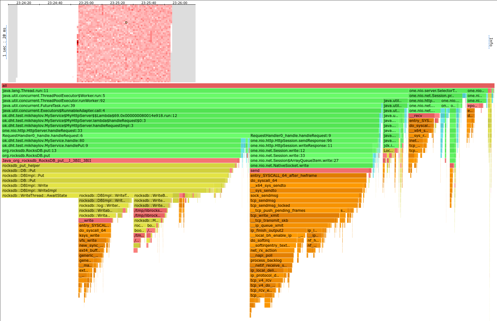

# Отчет по второй задаче

Используемая БД была заменена на RocksDB.

## Нагрузочное тестирование

Использовались скрипты из первой задачи - [../stage1/scripts/get.lua](get.lua) и [../stage1/scripts/put.lua](put.lua).
Как и в первой задаче, PUT тестировался на пустой БД, а GET - на заполненной 1.804 Гб данных БД.
Во всех выводах `wrk2` была убрана секция Detailed Percentile spectrum для краткости.

### Синхронная версия

Использовалась синхронная версия, но уже с RocksDB,
а не референсной реализацией - сравнение разных БД не входит в задачу. 

#### PUT

```
❯ wrk2 -d 60 -t 6 -c 128 -R 100000 -L -s scripts/put.lua "http://localhost:19235/"
Running 1m test @ http://localhost:19235/
  6 threads and 128 connections
  Thread calibration: mean lat.: 2659.710ms, rate sampling interval: 10715ms
  Thread calibration: mean lat.: 2855.122ms, rate sampling interval: 11108ms
  Thread calibration: mean lat.: 2756.433ms, rate sampling interval: 11042ms
  Thread calibration: mean lat.: 2678.218ms, rate sampling interval: 10878ms
  Thread calibration: mean lat.: 2896.763ms, rate sampling interval: 10936ms
  Thread calibration: mean lat.: 2651.319ms, rate sampling interval: 10616ms
  Thread Stats   Avg      Stdev     Max   +/- Stdev
    Latency    25.67s    12.85s   50.56s    56.26%
    Req/Sec     2.66k   453.99     3.59k    75.00%
  Latency Distribution (HdrHistogram - Recorded Latency)
 50.000%   25.03s 
 75.000%   36.77s 
 90.000%   44.17s 
 99.000%   48.92s 
 99.900%   49.84s 
 99.990%   50.14s 
 99.999%   50.43s 
100.000%   50.59s 

----------------------------------------------------------
  1131896 requests in 1.00m, 72.32MB read
Requests/sec:  18860.37
Transfer/sec:      1.21MB
```

Как и ожидалось, синхронный сервис не справляется с 100000 запросов в секунду.

#### GET

```
❯ wrk2 -d 60 -t 6 -c 128 -R 100000 -L -s scripts/get.lua "http://localhost:19235/"
Running 1m test @ http://localhost:19235/
  6 threads and 128 connections
  Thread calibration: mean lat.: 2236.706ms, rate sampling interval: 6443ms
  Thread calibration: mean lat.: 2542.150ms, rate sampling interval: 7081ms
  Thread calibration: mean lat.: 2360.775ms, rate sampling interval: 6901ms
  Thread calibration: mean lat.: 2432.252ms, rate sampling interval: 7004ms
  Thread calibration: mean lat.: 2604.303ms, rate sampling interval: 7319ms
  Thread calibration: mean lat.: 2497.385ms, rate sampling interval: 7122ms
  Thread Stats   Avg      Stdev     Max   +/- Stdev
    Latency    16.51s     8.25s   28.34s    55.37%
    Req/Sec    43.93k    12.88k   60.37k    41.46%
  Latency Distribution (HdrHistogram - Recorded Latency)
 50.000%   19.07s 
 75.000%   23.99s 
 90.000%   25.79s 
 99.000%   27.33s 
 99.900%   28.02s 
 99.990%   28.26s 
 99.999%   28.34s 
100.000%   28.36s 

----------------------------------------------------------
  1042626 requests in 1.00m, 78.69MB read
Requests/sec:  18432.16
Transfer/sec:      1.31MB
```

Как и с PUT, синхронный сервис не справляется с 100000 запросов в секунду.

### Асинхронная версия

#### PUT

```
❯ wrk2 -d 60 -t 6 -c 128 -R 100000 -L -s stage1/scripts/put.lua "http://localhost:19234/"
Running 1m test @ http://localhost:19234/
  6 threads and 128 connections
  Thread calibration: mean lat.: 1.220ms, rate sampling interval: 10ms
  Thread calibration: mean lat.: 4.830ms, rate sampling interval: 10ms
  Thread calibration: mean lat.: 4.668ms, rate sampling interval: 10ms
  Thread calibration: mean lat.: 4.656ms, rate sampling interval: 10ms
  Thread calibration: mean lat.: 6.390ms, rate sampling interval: 10ms
  Thread calibration: mean lat.: 1.248ms, rate sampling interval: 10ms
  Thread Stats   Avg      Stdev     Max   +/- Stdev
    Latency     0.97ms  714.72us  50.78ms   90.29%
    Req/Sec    17.57k     1.07k   47.10k    77.15%
  Latency Distribution (HdrHistogram - Recorded Latency)
 50.000%    0.93ms
 75.000%    1.28ms
 90.000%    1.56ms
 99.000%    2.04ms
 99.900%    6.51ms
 99.990%   30.70ms
 99.999%   41.57ms
100.000%   50.81ms

----------------------------------------------------------
  5992011 requests in 1.00m, 387.80MB read
  Non-2xx or 3xx responses: 184600
Requests/sec:  99865.54
Transfer/sec:      6.46MB
```

С первого взгляда может показаться, что сервис справляется с 100000 запросами, но это не так -
186400 запросов получили не 2xx ответ - это значит, что очередь была заполнена и сервер не успевал ответить на запросы.
Это было сделано c `MAX_REQUESTS = 32`, попробуем увеличить размер очереди до 128
(с размером 64 все еще дропались запросы, но в меньшем количестве):

```
❯ wrk2 -d 60 -t 6 -c 128 -R 100000 -L -s stage1/scripts/put.lua "http://localhost:19234/"
Running 1m test @ http://localhost:19234/
  6 threads and 128 connections
  Thread calibration: mean lat.: 2.284ms, rate sampling interval: 10ms
  Thread calibration: mean lat.: 1.152ms, rate sampling interval: 10ms
  Thread calibration: mean lat.: 2.342ms, rate sampling interval: 10ms
  Thread calibration: mean lat.: 1.137ms, rate sampling interval: 10ms
  Thread calibration: mean lat.: 2.211ms, rate sampling interval: 10ms
  Thread calibration: mean lat.: 2.355ms, rate sampling interval: 10ms
  Thread Stats   Avg      Stdev     Max   +/- Stdev
    Latency     1.09ms    1.15ms  44.29ms   98.25%
    Req/Sec    17.57k     1.29k   51.56k    82.55%
  Latency Distribution (HdrHistogram - Recorded Latency)
 50.000%    1.00ms
 75.000%    1.36ms
 90.000%    1.68ms
 99.000%    2.49ms
 99.900%   19.90ms
 99.990%   32.72ms
 99.999%   38.43ms
100.000%   44.32ms

----------------------------------------------------------
  5992945 requests in 1.00m, 382.93MB read
Requests/sec:  99881.14
Transfer/sec:      6.38MB
```

Теперь запросы не дропаются, но выросла задержка - например, медиана стала 1.09ms против 0.97ms.
Кроме того, среднеквадратичное отклонение выросло до 1.15ms.
Это ожидаемо - с меньшим размером очереди "лишние" запросы просто отклонялись и время запроса было низким,
а теперь они попадают в очередь и дольше ждут.

#### GET

```
❯ wrk2 -d 60 -t 6 -c 128 -R 100000 -L -s stage1/scripts/get.lua "http://localhost:19234/"
Running 1m test @ http://localhost:19234/
  6 threads and 128 connections
  Thread calibration: mean lat.: 1.036ms, rate sampling interval: 10ms
  Thread calibration: mean lat.: 1.038ms, rate sampling interval: 10ms
  Thread calibration: mean lat.: 2.192ms, rate sampling interval: 10ms
  Thread calibration: mean lat.: 1.038ms, rate sampling interval: 10ms
  Thread calibration: mean lat.: 2.175ms, rate sampling interval: 10ms
  Thread calibration: mean lat.: 2.189ms, rate sampling interval: 10ms
  Thread Stats   Avg      Stdev     Max   +/- Stdev
    Latency     1.01ms  630.75us  28.48ms   81.10%
    Req/Sec    17.54k     1.27k   46.56k    84.19%
  Latency Distribution (HdrHistogram - Recorded Latency)
 50.000%    0.96ms
 75.000%    1.30ms
 90.000%    1.61ms
 99.000%    2.94ms
 99.900%    6.82ms
 99.990%   14.39ms
 99.999%   22.69ms
100.000%   28.50ms

----------------------------------------------------------
  5992673 requests in 1.00m, 427.99MB read
Requests/sec:  99876.95
Transfer/sec:      7.13MB
```

## Профилирование

### PUT



- Большая часть cpu уходит на `handle` - 50%. Из них 48.5% (в абсолютных величинах) использует сам RocksDB.
  Остальные 1.5% - почти целиком `getParameter` из `one-nio`.
- Ещё 26% уходят на запись ответов - тут мы упираемся в syscall и это скорее всего не оптимизируется.
- 5% использует `ThreadPoolExecutor` в ожидании очереди.
- 11% использует Selector из `one-nio` - мы его разгрузили, т.к. в предыдущей реализации было 32%.
  Однако не стоит забывать, что мы за это платим локами.


Аллокации практически такие же, как в предыдущей реализации, но теперь нет аллокации в БД.
Т.к. JVM была уже прогрета, то видимо RocksDB переиспользует уже аллоцированное пространство.


Все локи - очередь в `ThreadPoolExecutor`, в park.
Возможно, ожидание можно уменьшить, паркуясь не сразу - небольшое время активно ожидать и только потом уйти в парковку,
т.к. парковка - дорогая операция.

### GET


Мы упираемся либо в системные вызовы, либо в RocksDB.
Возможно, второе можно улучшить тюнингом RocksDB, но это не точно.

Как и в случае с PUT, Selector был разгружен примерно в той же степени.


Аналогично PUT - по сравнению с предыдущей реализацией единственное изменение - отсутствие аллокаций в БД.


Аналогично PUT.

## Выводы

- Асинхронность повысила RPS в случае, если сервер получает запросы в несколько потоков/соединений.
  Синхронный сервер справлялся с примерно 30000 запросов/сек, а асинхронный уже может справляться с 100000 запросов/сек.
- Нужно корректно выбирать размер очереди, чтобы сервер с одной стороны не дропал запросы,
  а с другой стороны не перегружался в случае слишком большой нагрузки.