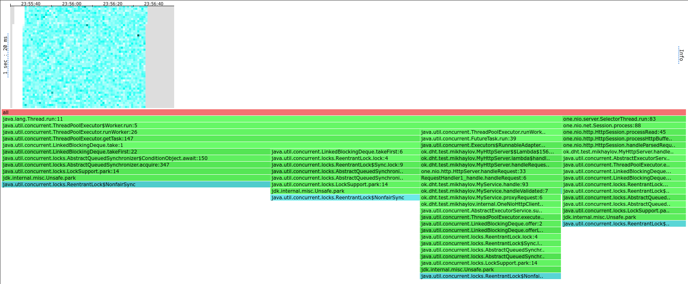
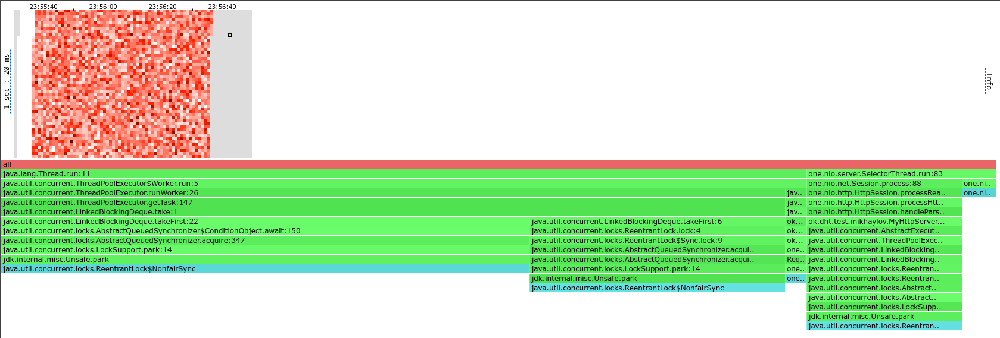
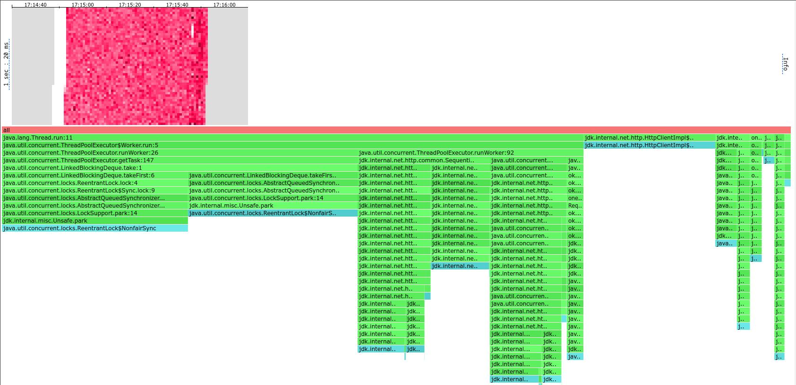
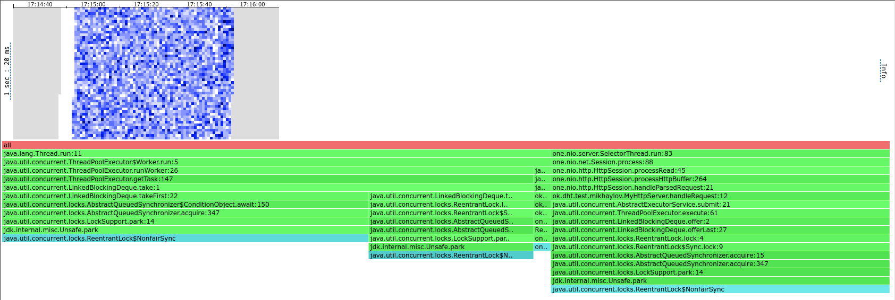
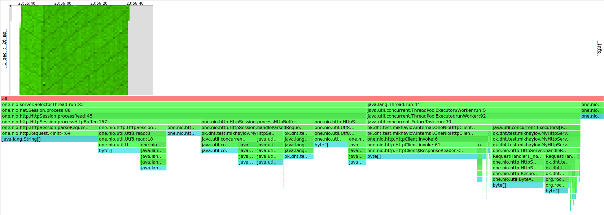
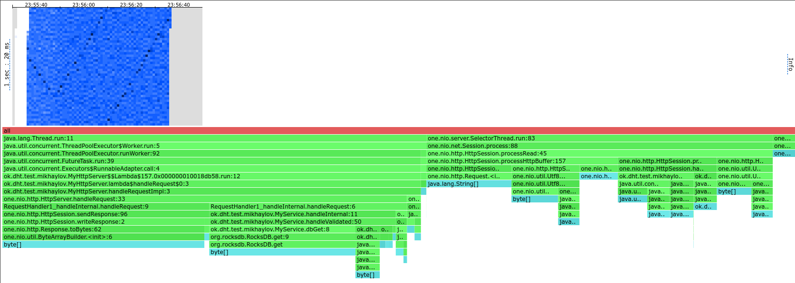
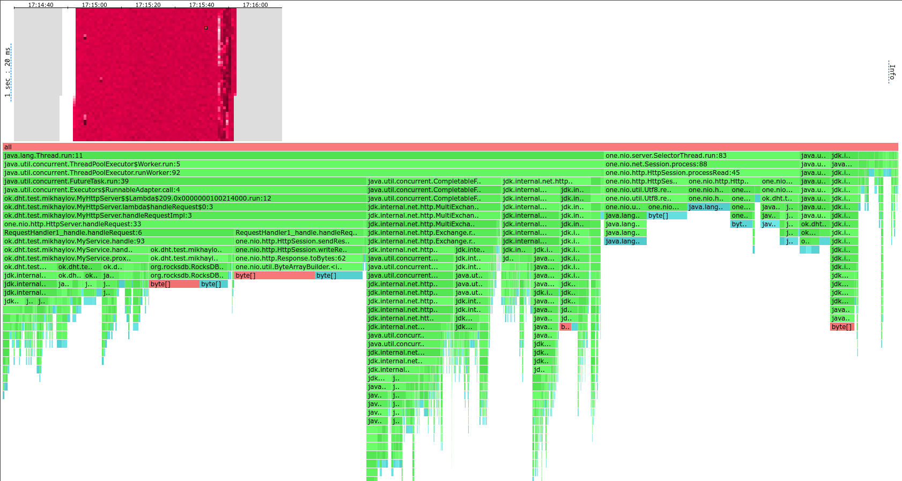
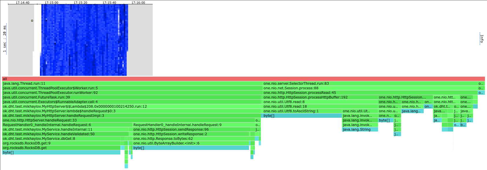

# Отчет по третьей задаче

Тестировалась конфигурация только с двумя нодами.
В качестве алгоритма распределения данных использовалось consistent hashing, которое вырождается в
`Math.abs(hashCode(obj) % N)`, т.к. топология сети не меняется.

## Нагрузочное тестирование

Стрельба проводилась только по одной из нод для упрощения интерпретации результатов.

Тестировались две версии - одна использовала `java.net.http.HttpClient` для передачи внутренних запросов,
а другая - `one.nio.http.HttpClient` (`JavaHttpClient` и `OneNioHttpClient` соответственно).

Как и в прошлой задаче, тестирование производилось 6 потоками с 128 соединениями для простоты сравнения с предыдущей
задачей.

### PUT

#### `one.nio.http.HttpClient`

Сначала была стрельба небольшим числом запросов (10000 RPS),
чтобы найти референсные значения для низкой нагрузки:

```
  Thread Stats   Avg      Stdev     Max   +/- Stdev
    Latency   814.38us  377.90us   3.10ms   64.42%
    Req/Sec     1.75k   423.66     2.33k    79.10%
  Latency Distribution (HdrHistogram - Recorded Latency)
 50.000%  814.00us
 75.000%    1.09ms
 90.000%    1.30ms
 99.000%    1.71ms
 99.900%    2.02ms
 99.990%    2.34ms
 99.999%    2.91ms
100.000%    3.10ms

Requests/sec:   9959.16
```

То же самое для 100000 RPS: 

```
  Thread Stats   Avg      Stdev     Max   +/- Stdev
    Latency     1.74s   569.02ms   2.69s    59.06%
    Req/Sec    13.26k   414.15    13.63k    70.27%
  Latency Distribution (HdrHistogram - Recorded Latency)
 50.000%    1.78s 
 75.000%    2.23s 
 90.000%    2.50s 
 99.000%    2.66s 
 99.900%    2.68s 
 99.990%    2.69s 
 99.999%    2.69s 
100.000%    2.70s 

Requests/sec:  85492.47
```

Нагрузку не держим и latency очень сильно выросла.
Попробуем 50000 RPS:

```
  Thread Stats   Avg      Stdev     Max   +/- Stdev
    Latency     1.03ms  489.42us  12.22ms   69.22%
    Req/Sec     8.76k   608.72    13.00k    81.12%
  Latency Distribution (HdrHistogram - Recorded Latency)
 50.000%    1.01ms
 75.000%    1.34ms
 90.000%    1.62ms
 99.000%    2.12ms
 99.900%    4.68ms
 99.990%    6.95ms
 99.999%    8.14ms
100.000%   12.23ms

Requests/sec:  49812.62
```

Latency относительно малой нагрузки выросла, но не слишком сильно.
Запросы успевают обрабатываться.
Попробуем 70000 RPS:

```
  Thread Stats   Avg      Stdev     Max   +/- Stdev
    Latency     4.08ms   13.04ms 109.18ms   94.99%
    Req/Sec    12.29k     1.80k   23.70k    89.88%
  Latency Distribution (HdrHistogram - Recorded Latency)
 50.000%    1.32ms
 75.000%    1.80ms
 90.000%    2.40ms
 99.000%   83.97ms
 99.900%  105.60ms
 99.990%  108.29ms
 99.999%  108.99ms
100.000%  109.25ms

Requests/sec:  69697.14
```

Последние перцентили latency выросли уже слишком сильно.
Поэтому будем считать 50000 RPS стабильной нагрузкой.

#### `java.net.http.HttpClient` 

Все примерно то же самое.

10000 RPS:
```
  Thread Stats   Avg      Stdev     Max   +/- Stdev
    Latency     0.97ms  456.94us   3.30ms   64.23%
    Req/Sec     1.75k   414.73     2.33k    79.04%
  Latency Distribution (HdrHistogram - Recorded Latency)
 50.000%    0.96ms
 75.000%    1.29ms
 90.000%    1.60ms
 99.000%    1.98ms
 99.900%    2.35ms
 99.990%    3.13ms
 99.999%    3.28ms
100.000%    3.31ms

Requests/sec:   9956.73
```

С 50000 RPS не справляемся - теряем запросы и latency неприемлемый:
```
  Thread Stats   Avg      Stdev     Max   +/- Stdev
    Latency     8.26s     3.89s   14.93s    57.89%
    Req/Sec     6.11k   106.45     6.31k    66.67%
  Latency Distribution (HdrHistogram - Recorded Latency)
 50.000%    8.33s 
 75.000%   11.59s 
 90.000%   13.66s 
 99.000%   14.79s 
 99.900%   14.90s 
 99.990%   14.92s 
 99.999%   14.93s 
100.000%   14.93s

Requests/sec:  37536.98
```

С 40000 RPS уже лучше, но все еще не справляемся:
```
  Thread Stats   Avg      Stdev     Max   +/- Stdev
    Latency     2.27s     1.12s    4.19s    61.02%
    Req/Sec     6.15k   172.67     6.35k    80.14%
  Latency Distribution (HdrHistogram - Recorded Latency)
 50.000%    2.30s 
 75.000%    3.23s 
 90.000%    3.83s 
 99.000%    4.14s 
 99.900%    4.18s 
 99.990%    4.19s 
 99.999%    4.20s 
100.000%    4.20s

Requests/sec:  37083.87
```

С 30000 RPS справляемся:
```
  Thread Stats   Avg      Stdev     Max   +/- Stdev
    Latency     1.14ms  817.26us  22.48ms   89.01%
    Req/Sec     5.27k   351.75     7.55k    70.70%
  Latency Distribution (HdrHistogram - Recorded Latency)
 50.000%    1.07ms
 75.000%    1.46ms
 90.000%    1.80ms
 99.000%    2.76ms
 99.900%   11.64ms
 99.990%   17.89ms
 99.999%   21.14ms
100.000%   22.50ms

Requests/sec:  29975.21
```

### GET

Перед стрельбой сервис был нагружен 1.2 Гб данных.
В каждой ноде была приблизительно половина данных, т.е. данные распределились равномерно, как и должно быть. 

#### `one.nio.http.HttpClient`

10000 RPS - с нагрузкой справляемся:
```
  Thread Stats   Avg      Stdev     Max   +/- Stdev
    Latency   840.28us  396.80us   4.42ms   64.87%
    Req/Sec     1.74k   413.75     2.33k    79.42%
  Latency Distribution (HdrHistogram - Recorded Latency)
 50.000%  833.00us
 75.000%    1.13ms
 90.000%    1.36ms
 99.000%    1.72ms
 99.900%    2.24ms
 99.990%    3.87ms
 99.999%    4.33ms
100.000%    4.42ms

Requests/sec:   9967.85
```

50000 RPS - с нагрузкой справляемся:
```
  Thread Stats   Avg      Stdev     Max   +/- Stdev
    Latency     0.98ms  456.03us   7.56ms   66.56%
    Req/Sec     8.76k   636.26    13.67k    83.16%
  Latency Distribution (HdrHistogram - Recorded Latency)
 50.000%    0.98ms
 75.000%    1.31ms
 90.000%    1.54ms
 99.000%    1.91ms
 99.900%    3.86ms
 99.990%    6.70ms
 99.999%    7.32ms
100.000%    7.57ms

Requests/sec:  49825.38
```

70000 RPS - с нагрузкой технически справляемся, но последние перцентили latency уже высоки. 
```
  Thread Stats   Avg      Stdev     Max   +/- Stdev
    Latency     1.40ms    2.82ms  77.06ms   98.70%
    Req/Sec    12.30k     0.97k   27.80k    74.39%
  Latency Distribution (HdrHistogram - Recorded Latency)
 50.000%    1.13ms
 75.000%    1.54ms
 90.000%    1.93ms
 99.000%    5.54ms
 99.900%   46.24ms
 99.990%   69.69ms
 99.999%   74.37ms
100.000%   77.12ms

Requests/sec:  69910.71
```

Будем считать 50000 RPS стабильной нагрузкой.

#### `java.net.http.HttpClient`

10000 RPS - с нагрузкой справляемся:
```
  Thread Stats   Avg      Stdev     Max   +/- Stdev
    Latency     0.96ms  586.68us  15.82ms   80.19%
    Req/Sec     1.74k   428.22     4.33k    78.95%
  Latency Distribution (HdrHistogram - Recorded Latency)
 50.000%    0.94ms
 75.000%    1.26ms
 90.000%    1.53ms
 99.000%    1.98ms
 99.900%    9.29ms
 99.990%   13.76ms
 99.999%   15.10ms
100.000%   15.82ms

Requests/sec:   9959.79
```

50000 RPS - с нагрузкой не справляемся (20.8% запросов не выполняется, очень высокая latency):
```
  Thread Stats   Avg      Stdev     Max   +/- Stdev
    Latency     6.07s     3.40s   12.18s    58.73%
    Req/Sec     6.41k   336.57     7.95k    93.57%
  Latency Distribution (HdrHistogram - Recorded Latency)
 50.000%    6.00s 
 75.000%    8.93s 
 90.000%   10.89s 
 99.000%   12.03s 
 99.900%   12.14s 
 99.990%   12.17s 
 99.999%   12.18s 
100.000%   12.19s

Requests/sec:  39575.45
```

40000 RPS - с нагрузкой не справляемся - запросы выполняются, но высокая latency:
```
  Thread Stats   Avg      Stdev     Max   +/- Stdev
    Latency   413.04ms  333.74ms 871.42ms   41.99%
    Req/Sec     6.91k   452.12     8.78k    70.67%
  Latency Distribution (HdrHistogram - Recorded Latency)
 50.000%  308.99ms
 75.000%  791.55ms
 90.000%  827.39ms
 99.000%  857.09ms
 99.900%  865.79ms
 99.990%  870.40ms
 99.999%  870.91ms
100.000%  871.93ms

Requests/sec:  39396.37
```

30000 RPS - с нагрузкой справляемся:
```
  Thread Stats   Avg      Stdev     Max   +/- Stdev
    Latency     1.12ms  708.15us  22.90ms   83.03%
    Req/Sec     5.02k    26.30     5.24k    78.05%
  Latency Distribution (HdrHistogram - Recorded Latency)
 50.000%    1.07ms
 75.000%    1.45ms
 90.000%    1.78ms
 99.000%    2.43ms
 99.900%    9.10ms
 99.990%   20.32ms
 99.999%   22.06ms
100.000%   22.91ms

Requests/sec:  29895.19
```

Будем считать 30000 RPS стабильной нагрузкой.

Увеличение числа потоков в http клиенте не улучшает ситуацию и для java слиента, и для one-nio клинета -
latency остается в пределах +- 10% для всех перцентилей.
Т.к. wrk2 работает на 6 потоков, нода, по которой идет стрельба, отправляет запросы на другую ноду в 3 потока.
Поэтому больше потоков в клиенте не дает прироста в производительности.

### Промежуточные результаты (нагрузочное тестирование)

По сравнению с реализацией без шардирования мы теряем в RPS и latency.
Latency падает из-за того, что нам нужно ходить в другие ноды, а ходить по сети - относительно долго,
т.к. запросы у нас легкие.
RPS падает, т.к. мы тратим ресурсы на передачу запросов другим нодам и на свои запросы остается меньше ресурсов.

Однако этот проигрыш не значит, что шардирование бесполезно - мы теперь можем хранить данные,
которые не помещаются на одну ноду, а также увеличиваем отказоустойчивость - если одна нода упадет,
то по крайней мере часть данных будет доступна.
Кроме того, с добавлением репликации мы можем понизить число походов в другие ноды, что может повысить
производительность.

Реализация на `java.net.http.HttpClient` не справляется с той нагрузкой, с которой справляется `one.nio.http.HttpClient`
(50k RPS).
Почему - узнаем в следующем разделе отчета.

## Профилирование

Heatmap'ы находятся в папке heatmaps.
Те, что с префиксом `19234` - нода, по которой идет стрельба.

В каждой секции первый скриншот - heatmap от ноды, по которой идет стрельба.

### PUT

#### CPU

##### `one.nio.http.HttpClient`


##### `java.net.http.HttpClient`


#### Lock

##### `one.nio.http.HttpClient`


##### `java.net.http.HttpClient`


#### Alloc

##### `one.nio.http.HttpClient`


##### `java.net.http.HttpClient`


### GET

#### CPU

##### `one.nio.http.HttpClient`


##### `java.net.http.HttpClient`


#### Lock

##### `one.nio.http.HttpClient`




##### `java.net.http.HttpClient`




#### Alloc

##### `one.nio.http.HttpClient`




##### `java.net.http.HttpClient`



