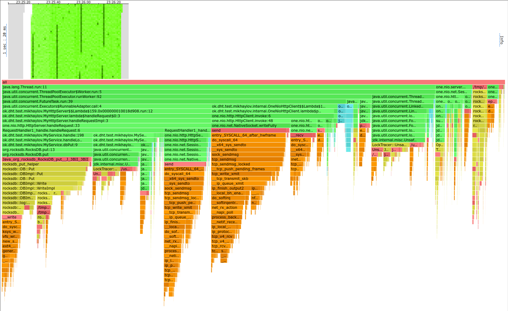
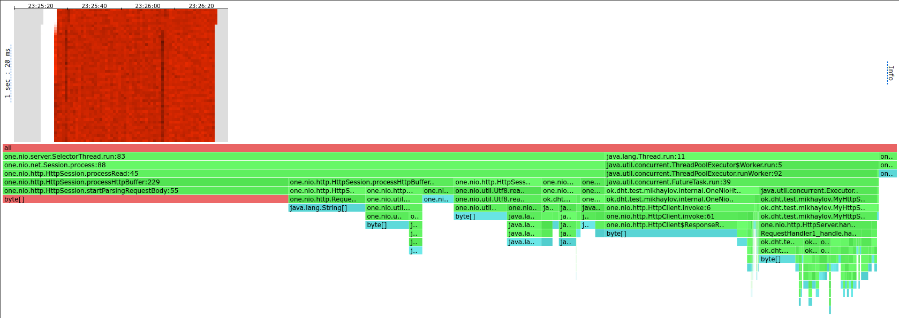
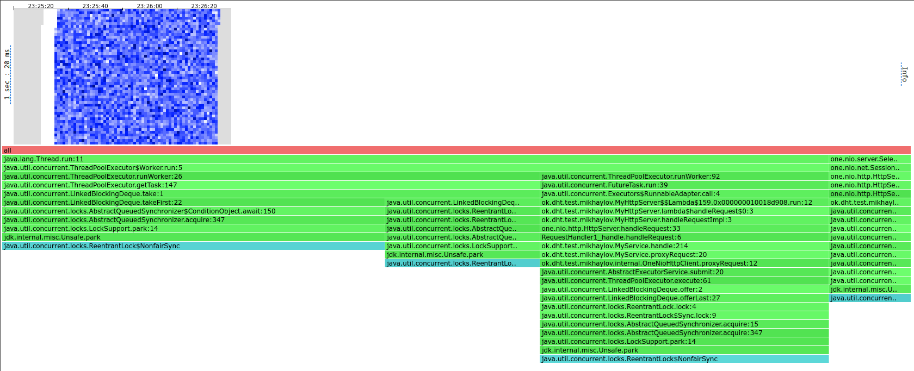

# Отчет по четвертой задаче

В качестве клиента для общения между шардами использовался `one.nio.http.HttpClient`,
т.к. он оказался более производительным для моих задач.

## Алгоритм распределения данных между узлами

Как и в прошлой задаче, использовался consistent hashing в силу простоты реализации для статической конфигурации.
Если раньше ключу соответствовал узел номер `n`, то теперь ключу соответствуют узлы `[n ... n + from)`
(по модулю числа узлов).

## Хранение данных

Для задачи необходимо было хранить не только пары ключ-значение, но еще и timestamp'ы, а также нужно было проверять
tombstone'ы.
К сожалению, в выбранной мной базе RocksDB нет поддержки и того, и другого, поэтому пришлось
добавлять в данные дополнительные байты.
Первый байт в значении определяет tombstone (0 - не tombstone, 1 - tombstone).
Следующие 8 байт - `long`, соответсвующий timestamp'у в unix'овых миллисекундах.
Остальные байты - собственно значение.

В общении между шардами отправляются именно такие массивы байт, а не просто значения.
Можно было бы отправлять метаданные более традиционными способами, например в header'ах запроса,
но это повлекло бы за собой лишние аллокации.

И нагрузочное тестирование, и профилирование производилось на прогретых JVM.

## Нагрузочное тестирование

При нагрузочном тестировании использовалась конфигурация из 3 шардов,
т.к. один шард бессмысленно тестировать (не в этом задача), на двух шардах мы получаем ситуацию,
похожую на предыдущую задачу, а если использовать больше 3 шардов, то у меня кончаются ресурсы компьютера. 

В параметрах репликации всегда использовалось `from=3` и `ack=3`.
Значение `ack` при этом не очень важно, т.к. я в любом случае жду, пока все шарды ответят или наступит таймаут.
Т.к. я не симулирую отказы шардов, то результаты всегда будут приходить.

Как и в прошлой задаче, для краткости я привожу только самые содержательные (по моему мнению) части вывода `wrk2`:
Thread stats, Latency Distribution, Requests/sec.
Также для краткости я не указываю аргументы `wrk2` кроме RPS; если нужно, они есть в скрипте [profile.sh](profile.sh).

### PUT

Использовался скрипт [put.lua](scripts/put.lua)

Сначала была стрельба небольшим числом запросов (1000 RPS), чтобы найти референсные значения для низкой нагрузки:

```
  Thread Stats   Avg      Stdev     Max   +/- Stdev
    Latency     0.93ms  396.12us   5.61ms   67.73%
    Req/Sec   177.50     80.11   333.00     82.72%
  Latency Distribution (HdrHistogram - Recorded Latency)
 50.000%    0.96ms
 75.000%    1.19ms
 90.000%    1.40ms
 99.000%    1.90ms
 99.900%    2.18ms
 99.990%    5.21ms
 99.999%    5.61ms
100.000%    5.61ms

Requests/sec:   1000.16
```

10000 RPS - последние перцентили выросли, но не критично:

```
  Thread Stats   Avg      Stdev     Max   +/- Stdev
    Latency     0.98ms  438.86us   9.50ms   66.36%
    Req/Sec     1.75k   131.93     2.78k    56.22%
  Latency Distribution (HdrHistogram - Recorded Latency)
 50.000%    0.96ms
 75.000%    1.29ms
 90.000%    1.54ms
 99.000%    1.95ms
 99.900%    3.19ms
 99.990%    6.66ms
 99.999%    8.24ms
100.000%    9.51ms

Requests/sec:   9992.25
```

50000 RPS - с нагрузкой не справляемся, что видно как и по latency, так и по выполненному RPS:
```
  Thread Stats   Avg      Stdev     Max   +/- Stdev
    Latency    19.15s     8.20s   33.41s    57.76%
    Req/Sec     3.60k    16.79     3.62k    63.33%
  Latency Distribution (HdrHistogram - Recorded Latency)
 50.000%   19.15s 
 75.000%   26.26s 
 90.000%   30.59s 
 99.000%   33.10s 
 99.900%   33.39s 
 99.990%   33.42s 
 99.999%   33.42s 
100.000%   33.42s

Requests/sec:  22029.16
```

30000 RPS - с нагрузкой все так же не справляемся:
```
  Thread Stats   Avg      Stdev     Max   +/- Stdev
    Latency     9.73s     4.50s   17.40s    56.59%
    Req/Sec     3.47k    99.22     3.63k    64.29%
  Latency Distribution (HdrHistogram - Recorded Latency)
 50.000%    9.70s 
 75.000%   13.76s 
 90.000%   16.00s 
 99.000%   17.27s 
 99.900%   17.40s 
 99.990%   17.42s 
 99.999%   17.42s 
100.000%   17.42s 

Requests/sec:  21276.44
```

20000 RPS - успеваем выполнять почти все запросы, но последние перцентили latency слишком высоки:
```
  Thread Stats   Avg      Stdev     Max   +/- Stdev
    Latency     3.61ms    8.50ms  67.20ms   93.88%
    Req/Sec     3.39k   113.46     3.89k    80.96%
  Latency Distribution (HdrHistogram - Recorded Latency)
 50.000%    1.41ms
 75.000%    1.99ms
 90.000%    5.84ms
 99.000%   54.27ms
 99.900%   58.53ms
 99.990%   59.84ms
 99.999%   66.11ms
100.000%   67.26ms

Requests/sec:  19983.77
```

15000 RPS - уже приемлемая latency:
```
  Thread Stats   Avg      Stdev     Max   +/- Stdev
    Latency     1.07ms    0.89ms  25.97ms   97.66%
    Req/Sec     2.64k   178.53     4.67k    76.14%
  Latency Distribution (HdrHistogram - Recorded Latency)
 50.000%    1.01ms
 75.000%    1.36ms
 90.000%    1.62ms
 99.000%    2.18ms
 99.900%   16.00ms
 99.990%   21.31ms
 99.999%   24.48ms
100.000%   25.98ms

Requests/sec:  14988.14
```

Будем считать 15000 RPS стабильной нагрузкой.

### GET

Как и в предыдущей задаче, сервис был наполнен 490 Мб данных.
Таким образом, данные на каждом шарде не помещаются в память.

Использовался скрипт [get.lua](scripts/get.lua).

Сначала была стрельба небольшим числом запросов (1000 RPS), чтобы найти референсные значения для низкой нагрузки:

```
Thread Stats   Avg      Stdev     Max   +/- Stdev
Latency     0.86ms  411.93us   3.33ms   63.52%
Req/Sec   176.88     79.94   333.00     82.71%
Latency Distribution (HdrHistogram - Recorded Latency)
50.000%    0.86ms
75.000%    1.18ms
90.000%    1.38ms
99.000%    1.81ms
99.900%    2.04ms
99.990%    2.26ms
99.999%    3.33ms
100.000%    3.33ms

Requests/sec:   1000.15
```

10000 RPS - latency выросла, но все еще в пределах нормы:
```
  Thread Stats   Avg      Stdev     Max   +/- Stdev
    Latency     0.95ms  406.42us   6.50ms   63.65%
    Req/Sec     1.75k   126.58     2.33k    56.42%
  Latency Distribution (HdrHistogram - Recorded Latency)
 50.000%    0.94ms
 75.000%    1.26ms
 90.000%    1.48ms
 99.000%    1.86ms
 99.900%    2.10ms
 99.990%    2.39ms
 99.999%    5.95ms
100.000%    6.50ms

Requests/sec:   9992.42
```

20000 RPS - latency слишком высокая, не справляемся:
```
  Thread Stats   Avg      Stdev     Max   +/- Stdev
    Latency     4.72ms   17.42ms 139.65ms   95.59%
    Req/Sec     3.51k   281.60     4.67k    76.92%
  Latency Distribution (HdrHistogram - Recorded Latency)
 50.000%    1.14ms
 75.000%    1.55ms
 90.000%    1.95ms
 99.000%   99.71ms
 99.900%  129.98ms
 99.990%  137.34ms
 99.999%  139.13ms
100.000%  139.77ms

Requests/sec:  19983.76
```

15000 RPS - с нагрузкой справляемся:
```
  Thread Stats   Avg      Stdev     Max   +/- Stdev
    Latency     0.99ms  568.22us  19.78ms   79.48%
    Req/Sec     2.64k   175.76     4.00k    75.18%
  Latency Distribution (HdrHistogram - Recorded Latency)
 50.000%    0.96ms
 75.000%    1.30ms
 90.000%    1.54ms
 99.000%    2.06ms
 99.900%    7.51ms
 99.990%   16.27ms
 99.999%   17.74ms
100.000%   19.79ms

Requests/sec:  14988.10
```

Будем считать 15000 RPS стабильной нагрузкой.

### Промежуточные результаты по нагрузочному тестированию

Мы потеряли в RPS в 3.33 раза как в GET, так и в PUT.
В целом это логично - мы делаем в три раза больше работы, реплицируя данные трижды, при этом шарды запущены
на одной машине и борются за ресурсы друг с другом.
Потеряв в RPS, мы выигрываем в отказоустойчивости и надежности.

## Профилирование

Профилировалось только два шарда - тот, по которому производилась стрельба и один из двух оставшихся,
т.к. оставшиеся эквивалентны. 

html'ки лежат в папке [heatmaps](heatmaps) в формате `<port>_<alloc|cpu|lock>__<htmlverb>_<RPS>.html`.
Порты:
- 19234 - шард, по которому стреляли
- 19235 - шард, по которому не стреляли

Скриншоты лежат в папке [images](images) в аналогичном формате, но без RPS.

В отчете я буду использовать для краткости только скриншоты с шарда 19234,
т.к. шард 19235 не изменился по сравнению с предыдущей задачей.

### PUT

#### CPU



По сравнению с предыдущей задачей у нас больше семплов в тех функциях, которые занимаются коммуникацией
с шардами. Это логично - мы теперь делаем в 4 раза больше запросов, т.к. раньше на один запрос "снаружи"
мы отправляли запрос на шард с вероятностью 50%, а теперь мы отправляем всегда по запросу на два шарда.

#### Alloc



Стало больше аллокаций в `startParsingRequestBody`, т.к. теперь мы читаем больше запросов.

#### Lock



Стало больше блокировок в `OneNioHttpClient`, т.к. теперь мы читаем больше запросов.

### GET

Все изменения по сравнению с предыдущей задачей абсолютно аналогичны PUT.

## Выводы

- Мы потеряли в RPS, но выиграли в отказоустойчивости и надежности.
  Кроме того, в реальных условиях потерь будет меньше, т.к. запуски будут на разных машинах и не будет конкуренции за ресурсы.
- Коммуникацию между шардами можно ускорить за счет асинхронности, тогда предположительно мы не будем так сильно терять в RPS.
- Много времени уходит на коммуникацию между шардами. Как я уже сказал в предыдущем отчете, можно было бы
  использовать протокол с меньшим оверхедом.