# Отчет по пятой задаче

Сравнивались синхронная реализация (коммит `053d64e11ebfb57ea7662576c4bfaa3fcb2ea1ea`)
и асинхронная (последний коммит в ветке)

Как и в прошлых задачах, для краткости я привожу только самые содержательные (по моему мнению) части вывода `wrk2`:
Thread stats, Latency Distribution, Requests/sec.
Также для краткости я не указываю аргументы `wrk2` кроме RPS; если нужно, они есть в скрипте [profile.sh](profile.sh).

Как и в прошлой задаче, тестировалась конфигурация из 3 шардов и использовались параметры репликации `from=3` и `ack=3`
(см [прошлый отчет](../stage4/stage4.md) для объяснения).

## Нагрузочное тестирование

### GET

#### Синхронная реализация

<details>
<summary> Сначала была стрельба небольшим числом запросов (1000 RPS), чтобы найти референсные значения для низкой нагрузки: </summary>

```
  Thread Stats   Avg      Stdev     Max   +/- Stdev
    Latency     0.94ms  520.70us  22.56ms   78.83%
    Req/Sec   177.64     79.96   666.00     82.96%
  Latency Distribution (HdrHistogram - Recorded Latency)
 50.000%    0.92ms
 75.000%    1.21ms
 90.000%    1.46ms
 99.000%    1.96ms
 99.900%    3.43ms
 99.990%   17.49ms
 99.999%   22.58ms
100.000%   22.58ms

Requests/sec:   1000.16
Transfer/sec:      1.01MB
```
</details>

<details>
<summary> 10000 RPS: latency выросла, но не критично </summary>

```
  Thread Stats   Avg      Stdev     Max   +/- Stdev
    Latency     1.63ms    1.27ms  21.65ms   91.48%
    Req/Sec     1.75k   339.85     2.78k    77.10%
  Latency Distribution (HdrHistogram - Recorded Latency)
 50.000%    1.44ms
 75.000%    2.03ms
 90.000%    2.62ms
 99.000%    7.03ms
 99.900%   14.39ms
 99.990%   16.86ms
 99.999%   19.92ms
100.000%   21.66ms

Requests/sec:   9964.88
Transfer/sec:     10.97MB
```
</details>

<details>
<summary> 20000 RPS: уже захлебываемся, это видно как по Requests/sec, так и по latency: </summary>

```
  Thread Stats   Avg      Stdev     Max   +/- Stdev
    Latency    13.42s     6.00s   23.67s    57.68%
    Req/Sec     1.95k    17.93     2.00k    70.37%
  Latency Distribution (HdrHistogram - Recorded Latency)
 50.000%   13.39s 
 75.000%   18.64s 
 90.000%   21.74s 
 99.000%   23.48s 
 99.900%   23.66s 
 99.990%   23.67s 
 99.999%   23.67s 
100.000%   23.69s 

Requests/sec:  12045.11
Transfer/sec:     13.47MB
```
</details>

<details>
<summary> 15000 RPS: все еще захлебываемся </summary>

```
  Thread Stats   Avg      Stdev     Max   +/- Stdev
    Latency     5.62s     3.05s   10.80s    57.72%
    Req/Sec     1.99k    81.37     2.37k    90.82%
  Latency Distribution (HdrHistogram - Recorded Latency)
 50.000%    5.73s 
 75.000%    8.27s 
 90.000%    9.83s 
 99.000%   10.70s 
 99.900%   10.79s 
 99.990%   10.80s 
 99.999%   10.80s 
100.000%   10.81s 

Requests/sec:  12290.77
Transfer/sec:     13.77MB
```
</details>

<details>
<summary>12000 RPS: все еще захлебываемся</summary>

```
  Thread Stats   Avg      Stdev     Max   +/- Stdev
    Latency   425.51ms  195.90ms 644.61ms   82.00%
    Req/Sec     2.08k   171.34     2.78k    70.67%
  Latency Distribution (HdrHistogram - Recorded Latency)
 50.000%  490.75ms
 75.000%  557.57ms
 90.000%  607.23ms
 99.000%  629.25ms
 99.900%  635.90ms
 99.990%  640.00ms
 99.999%  643.07ms
100.000%  645.12ms

Requests/sec:  11874.74
Transfer/sec:     13.27MB
```
</details>

Будем считать 10000 RPS стабильной нагрузкой.

#### Асинхронная реализация

<details>
<summary>Сначала была стрельба небольшим числом запросов (1000 RPS), чтобы найти референсные значения для низкой нагрузки:</summary>

```
  Thread Stats   Avg      Stdev     Max   +/- Stdev
    Latency     0.93ms  439.11us   9.77ms   69.06%
    Req/Sec   177.70     80.25   333.00     82.55%
  Latency Distribution (HdrHistogram - Recorded Latency)
 50.000%    0.95ms
 75.000%    1.22ms
 90.000%    1.44ms
 99.000%    1.98ms
 99.900%    3.13ms
 99.990%    9.36ms
 99.999%    9.77ms
100.000%    9.77ms

Requests/sec:   1000.16
Transfer/sec:      1.01MB
```
</details>

<details>
<summary>10000 RPS: не захлебываемся</summary>

```
  Thread Stats   Avg      Stdev     Max   +/- Stdev
    Latency     1.28ms    1.03ms  47.62ms   94.77%
    Req/Sec     1.76k   178.83     4.00k    82.17%
  Latency Distribution (HdrHistogram - Recorded Latency)
 50.000%    1.17ms
 75.000%    1.55ms
 90.000%    1.95ms
 99.000%    4.08ms
 99.900%   14.81ms
 99.990%   26.64ms
 99.999%   38.30ms

Requests/sec:   9992.46
Transfer/sec:     11.00MB
```
</details>

<details>
<summary>15000 RPS: не справляемся</summary>

```
  Thread Stats   Avg      Stdev     Max   +/- Stdev
    Latency     5.23s     3.00s   10.32s    56.28%
    Req/Sec     2.00k   102.93     2.42k    75.80%
  Latency Distribution (HdrHistogram - Recorded Latency)
 50.000%    5.21s 
 75.000%    7.87s 
 90.000%    9.40s 
 99.000%   10.15s 
 99.900%   10.25s 
 99.990%   10.29s 
 99.999%   10.31s 
100.000%   10.33s 

Requests/sec:  12428.72
Transfer/sec:     13.93MB
```
</details>

<details>
<summary>12000 RPS: не справляемся</summary>

```
  Thread Stats   Avg      Stdev     Max   +/- Stdev
    Latency    38.33ms   35.86ms 174.46ms   79.11%
    Req/Sec     2.11k   321.49     9.22k    82.73%
  Latency Distribution (HdrHistogram - Recorded Latency)
 50.000%   28.05ms
 75.000%   46.14ms
 90.000%   83.58ms
 99.000%  158.59ms
 99.900%  167.93ms
 99.990%  171.77ms
 99.999%  173.82ms
100.000%  174.59ms

Requests/sec:  11977.07
Transfer/sec:     13.39MB
```
</details>

Будем считать 10000 RPS стабильной нагрузкой.

### PUT

#### Синхронная реализация

<details>
<summary>Сначала была стрельба небольшим числом запросов (1000 RPS), чтобы найти референсные значения для низкой нагрузки:</summary>

```
  Thread Stats   Avg      Stdev     Max   +/- Stdev
    Latency     1.10ms  518.45us  21.49ms   79.64%
    Req/Sec   178.40     79.56   700.00     83.16%
  Latency Distribution (HdrHistogram - Recorded Latency)
 50.000%    1.09ms
 75.000%    1.35ms
 90.000%    1.62ms
 99.000%    2.12ms
 99.900%    4.74ms
 99.990%   19.79ms
 99.999%   21.50ms
100.000%   21.50ms

Requests/sec:   1000.16
Transfer/sec:     65.44KB
```
</details>

<details>
<summary>10000 RPS: latency выросла, но не критично</summary>

```
  Thread Stats   Avg      Stdev     Max   +/- Stdev
    Latency     2.51ms    4.24ms  42.34ms   93.52%
    Req/Sec     1.74k   146.84     2.73k    68.72%
  Latency Distribution (HdrHistogram - Recorded Latency)
 50.000%    1.50ms
 75.000%    2.04ms
 90.000%    3.41ms
 99.000%   26.29ms
 99.900%   37.12ms
 99.990%   39.84ms
 99.999%   40.90ms
100.000%   42.37ms

Requests/sec:   9992.25
Transfer/sec:    653.79KB
```
</details>

<details>
<summary>12000 RPS: уже захлебываемся, это видно как по Requests/sec, так и по latency</summary>

```
  Thread Stats   Avg      Stdev     Max   +/- Stdev
    Latency     3.35s     1.84s    6.23s    57.03%
    Req/Sec     1.75k   145.70     2.12k    80.28%
  Latency Distribution (HdrHistogram - Recorded Latency)
 50.000%    3.69s 
 75.000%    4.87s 
 90.000%    5.79s 
 99.000%    6.14s 
 99.900%    6.21s 
 99.990%    6.23s 
 99.999%    6.23s 
100.000%    6.24s

Requests/sec:  10747.19
Transfer/sec:    703.19KB
```
</details>

Будем считать 10000 RPS стабильной нагрузкой.


#### Асинхронная реализация

<details>
<summary>Сначала была стрельба небольшим числом запросов (1000 RPS), чтобы найти референсные значения для низкой нагрузки:</summary>

```
  Thread Stats   Avg      Stdev     Max   +/- Stdev
    Latency     0.95ms  397.84us   5.74ms   67.23%
    Req/Sec   177.54     78.63   333.00     83.62%
  Latency Distribution (HdrHistogram - Recorded Latency)
 50.000%    0.96ms
 75.000%    1.21ms
 90.000%    1.45ms
 99.000%    1.90ms
 99.900%    2.60ms
 99.990%    5.71ms
 99.999%    5.75ms
100.000%    5.75ms

Requests/sec:   1000.17
Transfer/sec:     65.44KB
```
</details>

<details>
<summary>10000 RPS: latency выросла, но не критично</summary>

```
  Thread Stats   Avg      Stdev     Max   +/- Stdev
    Latency     0.98ms  488.10us  16.15ms   72.44%
    Req/Sec     1.76k   146.25     4.33k    75.87%
  Latency Distribution (HdrHistogram - Recorded Latency)
 50.000%    0.97ms
 75.000%    1.28ms
 90.000%    1.52ms
 99.000%    2.00ms
 99.900%    4.39ms
 99.990%   11.67ms
 99.999%   14.91ms
100.000%   16.16ms

Requests/sec:   9992.54
Transfer/sec:    653.81KB
```
</details>

<details>
<summary>15000 RPS: все еще справляемся</summary>

```
  Thread Stats   Avg      Stdev     Max   +/- Stdev
    Latency     1.14ms  597.16us  21.71ms   74.98%
    Req/Sec     2.63k   359.74     6.30k    85.75%
  Latency Distribution (HdrHistogram - Recorded Latency)
 50.000%    1.10ms
 75.000%    1.46ms
 90.000%    1.79ms
 99.000%    2.52ms
 99.900%    6.76ms
 99.990%   13.07ms
 99.999%   18.51ms
100.000%   21.73ms

Requests/sec:  14948.10
Transfer/sec:      0.96MB
```
</details>

<details>
<summary>20000 RPS: все еще справляемся</summary>

```
  Thread Stats   Avg      Stdev     Max   +/- Stdev
    Latency     1.66ms    3.19ms  47.17ms   98.17%
    Req/Sec     3.51k   377.83     9.11k    89.43%
  Latency Distribution (HdrHistogram - Recorded Latency)
 50.000%    1.25ms
 75.000%    1.70ms
 90.000%    2.13ms
 99.000%   17.93ms
 99.900%   40.64ms
 99.990%   44.22ms
 99.999%   45.95ms
100.000%   47.20ms

Requests/sec:  19983.65
Transfer/sec:      1.28MB
```
</details>

<details>
<summary>50000 RPS: не справляемся, что видно по latency и обработанным запросам</summary>

```
  Thread Stats   Avg      Stdev     Max   +/- Stdev
    Latency    13.07s     6.19s   23.27s    58.29%
    Req/Sec     4.91k   487.44     5.86k    70.00%
  Latency Distribution (HdrHistogram - Recorded Latency)
 50.000%   12.81s 
 75.000%   18.56s 
 90.000%   21.46s 
 99.000%   23.04s 
 99.900%   23.20s 
 99.990%   23.25s 
 99.999%   23.28s 
100.000%   23.28s 

Requests/sec:  30640.48
Transfer/sec:      1.96MB
```
</details>

<details>
<summary>30000 RPS: не справляемся, слишком высокая latency</summary>

```
  Thread Stats   Avg      Stdev     Max   +/- Stdev
    Latency    42.04ms   68.08ms 381.18ms   83.54%
    Req/Sec     5.05k   455.05     8.06k    81.17%
  Latency Distribution (HdrHistogram - Recorded Latency)
 50.000%    4.26ms
 75.000%   61.41ms
 90.000%  151.04ms
 99.000%  272.38ms
 99.900%  329.98ms
 99.990%  366.85ms
 99.999%  378.37ms
100.000%  381.44ms

Requests/sec:  29974.47
Transfer/sec:      1.92MB
```
</details>

<details>
<summary>25000 RPS: не справляемся, слишком высокая latency</summary>

```
  Thread Stats   Avg      Stdev     Max   +/- Stdev
    Latency    39.72ms   94.94ms 455.94ms   87.83%
    Req/Sec     4.37k     0.93k    9.50k    79.10%
  Latency Distribution (HdrHistogram - Recorded Latency)
 50.000%    3.11ms
 75.000%    4.00ms
 90.000%  217.47ms
 99.000%  375.81ms
 99.900%  414.72ms
 99.990%  439.30ms
 99.999%  451.33ms
100.000%  456.19ms

Requests/sec:  24978.67
Transfer/sec:      1.60MB
```
</details>

<details>
<summary>22000 RPS: не справляемся, слишком высокая latency</summary>

```
  Thread Stats   Avg      Stdev     Max   +/- Stdev
    Latency     2.13ms    5.64ms 110.98ms   98.39%
    Req/Sec     3.86k   541.46    10.00k    89.35%
  Latency Distribution (HdrHistogram - Recorded Latency)
 50.000%    1.45ms
 75.000%    1.98ms
 90.000%    2.51ms
 99.000%   25.66ms
 99.900%   84.67ms
 99.990%  106.50ms
 99.999%  110.14ms
100.000%  111.04ms

Requests/sec:  21982.35
Transfer/sec:      1.40MB
```
</details>

Будем считать 20000 RPS стабильной нагрузкой.

### Промежуточные выводы (нагрузочное тестирование)

- Асинхронная обработка не дала выигрыша в RPS для GET
- Асинхронная обработка дала двукратный выигрыш в RPS для PUT

## Профилирование

Профилировалось только два шарда - тот, по которому производилась стрельба и один из двух оставшихся,
т.к. оставшиеся эквивалентны.

html'ки лежат в папке [heatmaps](heatmaps) в формате `<port>_<alloc|cpu|lock>_<sync|async>_<htmlverb>.html`.
Порты:
- 19234 - шард, по которому стреляли
- 19235 - шард, по которому не стреляли

Скриншоты лежат в папке [images](images) в том же формате.

В отчете будут приведены скриншоты только шарда 19234,
т.к. профиль шарда 19235 совпадает для синхронной и асинхронной версии.

### GET

#### CPU

##### Синхронная реализация

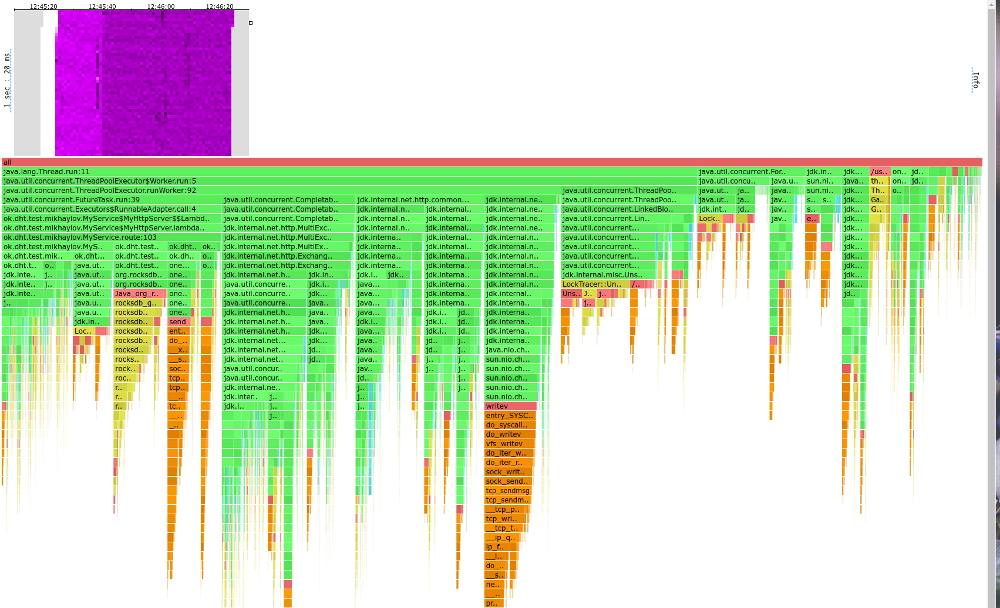

##### Асинхронная реализация

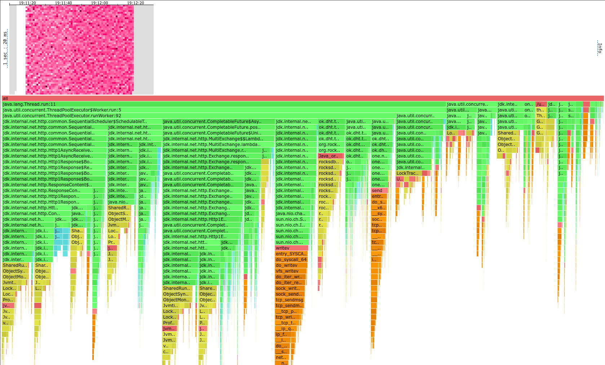

- В асинхронной версии мы видим меньше семплов в коде `MyService`, потому что код стал выполняться в различных
executor'ах.
- Вызовы rocksdb переехали в ThreadPoolExecutor.
- Стало больше семплов в коде `LinkedBlockingDeque`, т.к. executor'ы больше используются.

#### ALLOC

##### Синхронная реализация

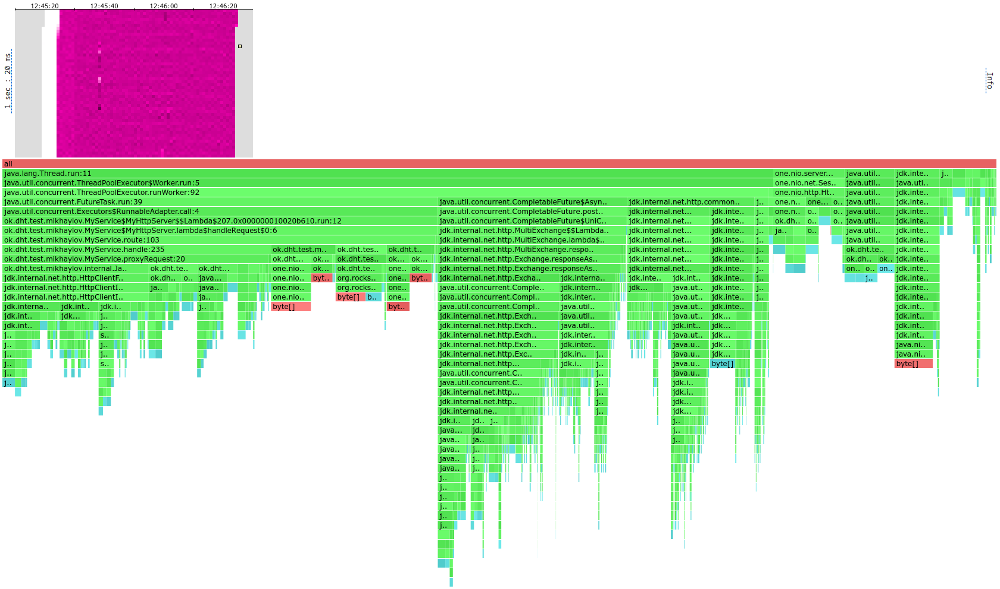

##### Асинхронная реализация

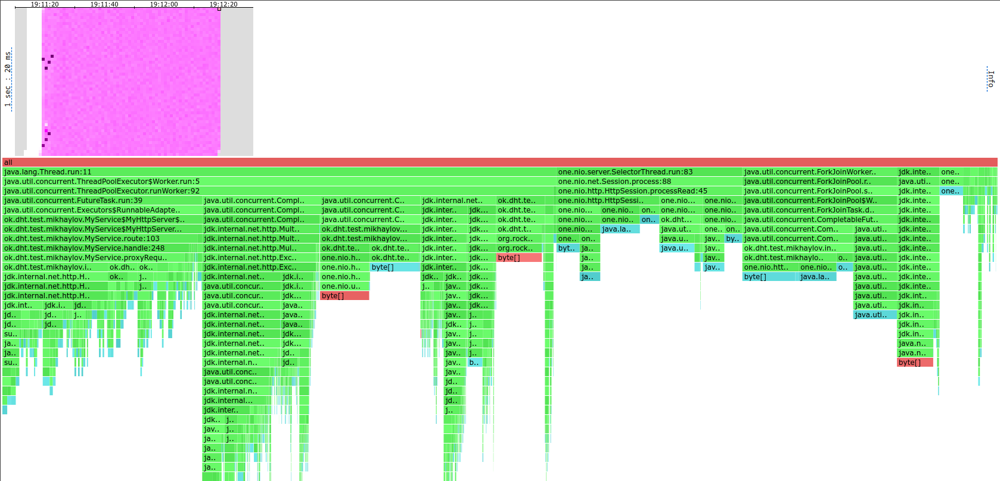

Стало больше аллокаций в `CompletableFuture` и добавились аллокации в executor'е для future'ов.

#### LOCK

##### Синхронная реализация

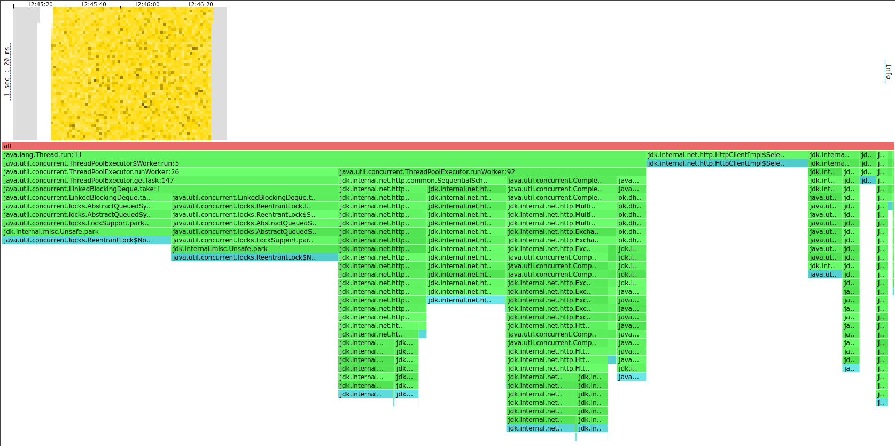

##### Асинхронная реализация

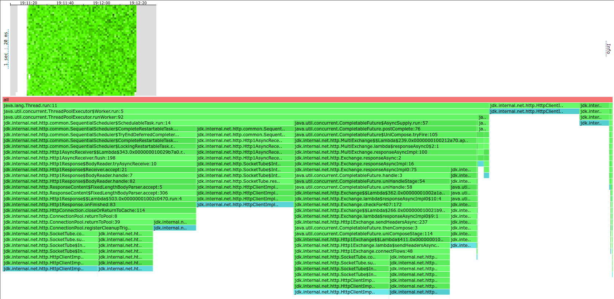

В асинхронной реализации больше локов берется для клиента http, по большей части в `ConnectionPool`,
т.к. клиент кеширует соединения.

Локи в `LinkedBlockingDeque` (от executor'а) теперь занимают всего лишь 1.84% вместо 37%.

### PUT

#### CPU

##### Синхронная реализация

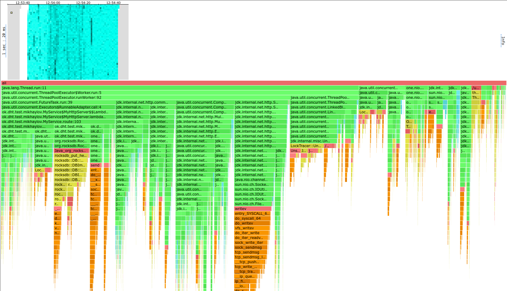

##### Асинхронная реализация

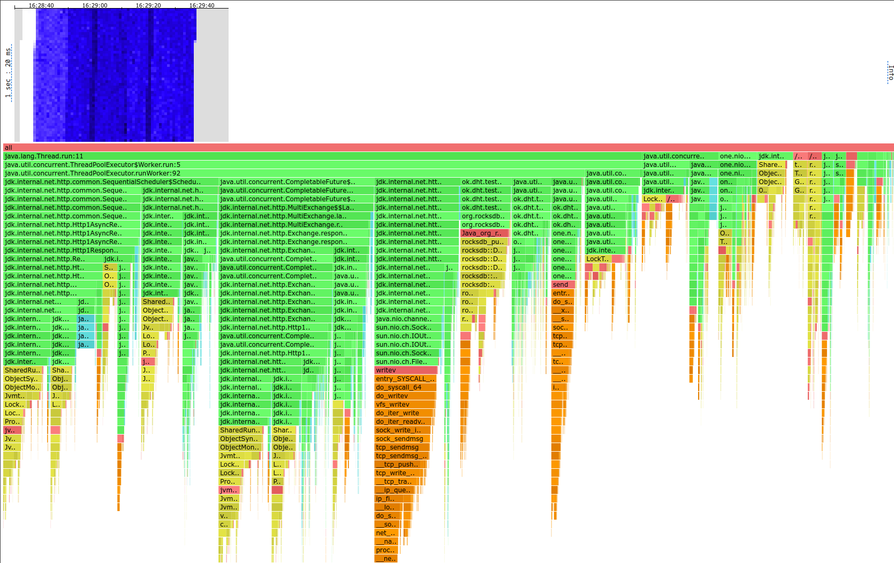

Стало немного больше семплов в коде http клиента.

Также стало больше семплов в `LockTracer` профилировщика (19% против 14%), то же самое верно и про GET запросы.
Таким образом, профилировщик уже стал замедлять сервис - без него у меня получилось достичь практически в 2 раза большего RPS.

#### ALLOC

##### Синхронная реализация

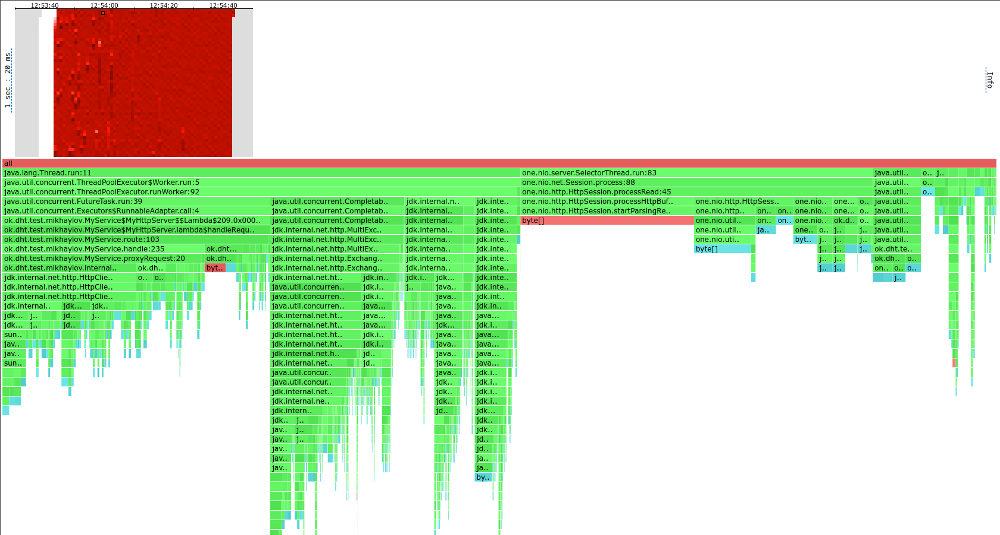

##### Асинхронная реализация

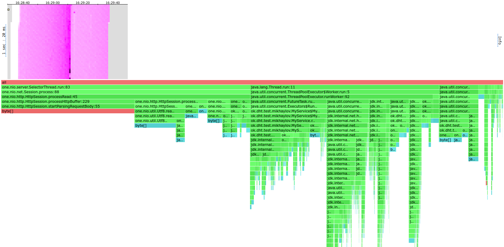

#### LOCK

##### Синхронная реализация

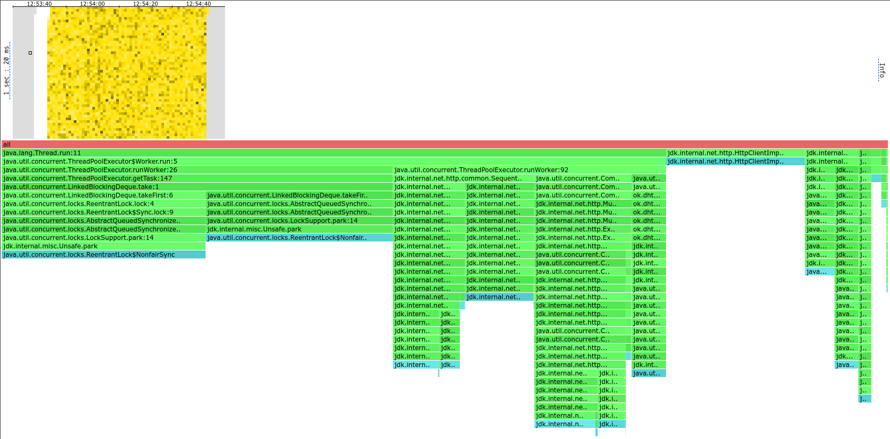

##### Асинхронная реализация

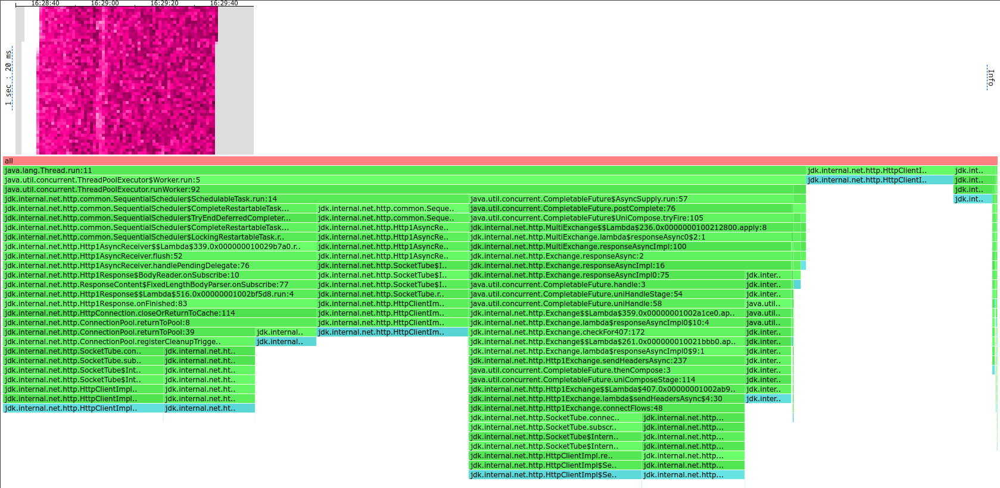

## Выводы