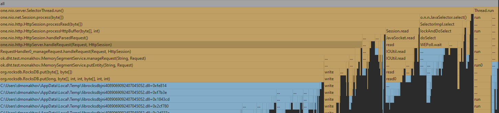
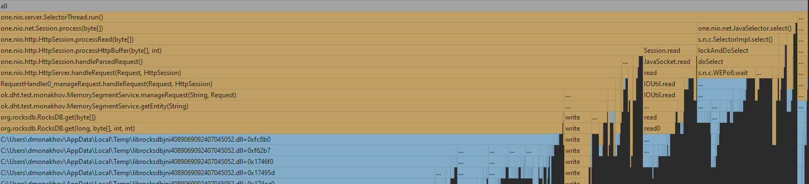

# Отчет по 1 стадии

Была взята референсная реализация базы данных. И до начала тестирования нагружена данными примерно на 6.21GB

Так же были написаны скрипты для перформанс теста:
1. [Lua get script](java/ok/dht/test/monakhov/wrk/get.lua)
2. [Lua put script](java/ok/dht/test/monakhov/wrk/put.lua)

К сожалению возникли огромные трудности с использованием async-profiler(я под виндой, а на wsl профайлер установился, но
крашился вместе с профилируемым процессом при попытке остановить его с записью в файле), поэтому в дальнейшем отчете будет
отсутствовать heatmap. Был использован idea profiler, под капотом использующий async-profiler.

# Профилирование
## PUT
### Latency(wrk2)
Ордеррейт 800 оказался стабилоной нагрузкой, при которой 99 процентов запросов укладывается в 9 мс, при нагрузке 1000
99 персентиль возрастает до 900 мс. 
```
wrk -c1 -t1 -d5m -R800 -L -s put.lua http://localhost:19234
Running 5m test @ http://localhost:19234
  1 threads and 1 connections
  Thread calibration: mean lat.: 1.652ms, rate sampling interval: 10ms
  Thread Stats   Avg      Stdev     Max   +/- Stdev
    Latency     2.01ms    3.96ms 105.09ms   98.71%
    Req/Sec   843.76    108.58     2.33k    72.36%
  Latency Distribution (HdrHistogram - Recorded Latency)
 50.000%    1.66ms
 75.000%    2.15ms
 90.000%    2.60ms
 99.000%    8.11ms
 99.900%   67.84ms
 99.990%  103.04ms
 99.999%  105.02ms
100.000%  105.15ms

  Detailed Percentile spectrum:
       Value   Percentile   TotalCount 1/(1-Percentile)

       0.312     0.000000            1         1.00
       0.818     0.100000        23223         1.11
       1.068     0.200000        46479         1.25
       1.279     0.300000        69621         1.43
       1.476     0.400000        92892         1.67
       1.661     0.500000       116051         2.00
       1.752     0.550000       127635         2.22
       1.843     0.600000       139210         2.50
       1.938     0.650000       150873         2.86
       2.040     0.700000       162449         3.33
       2.149     0.750000       174001         4.00
       2.209     0.775000       179860         4.44
       2.273     0.800000       185700         5.00
       2.341     0.825000       191478         5.71
       2.417     0.850000       197327         6.67
       2.503     0.875000       203105         8.00
       2.549     0.887500       205993         8.89
       2.599     0.900000       208850        10.00
       2.655     0.912500       211735        11.43
       2.719     0.925000       214645        13.33
       2.795     0.937500       217509        16.00
       2.837     0.943750       218969        17.78
       2.885     0.950000       220426        20.00
       2.939     0.956250       221864        22.86
       3.005     0.962500       223319        26.67
       3.089     0.968750       224771        32.00
       3.141     0.971875       225478        35.56
       3.213     0.975000       226201        40.00
       3.319     0.978125       226928        45.71
       3.535     0.981250       227646        53.33
       4.447     0.984375       228372        64.00
       5.263     0.985938       228733        71.11
       6.215     0.987500       229097        80.00
       7.151     0.989062       229458        91.43
       9.007     0.990625       229822       106.67
      13.327     0.992188       230183       128.00
      16.367     0.992969       230364       142.22
      20.031     0.993750       230546       160.00
      23.919     0.994531       230727       182.86
      29.183     0.995313       230908       213.33
      33.919     0.996094       231089       256.00
      37.375     0.996484       231180       284.44
      39.551     0.996875       231272       320.00
      42.335     0.997266       231361       365.71
      45.119     0.997656       231454       426.67
      48.351     0.998047       231544       512.00
      50.207     0.998242       231588       568.89
      52.447     0.998437       231634       640.00
      56.383     0.998633       231678       731.43
      62.687     0.998828       231724       853.33
      68.607     0.999023       231769      1024.00
      72.255     0.999121       231793      1137.78
      75.071     0.999219       231814      1280.00
      79.423     0.999316       231837      1462.86
      83.007     0.999414       231860      1706.67
      85.503     0.999512       231883      2048.00
      87.039     0.999561       231894      2275.56
      90.111     0.999609       231905      2560.00
      92.799     0.999658       231916      2925.71
      95.359     0.999707       231928      3413.33
      99.135     0.999756       231939      4096.00
     100.351     0.999780       231945      4551.11
     101.759     0.999805       231950      5120.00
     102.335     0.999829       231956      5851.43
     102.591     0.999854       231962      6826.67
     102.783     0.999878       231967      8192.00
     102.975     0.999890       231971      9102.22
     103.039     0.999902       231973     10240.00
     103.167     0.999915       231976     11702.86
     103.615     0.999927       231979     13653.33
     103.999     0.999939       231982     16384.00
     104.127     0.999945       231983     18204.44
     104.255     0.999951       231984     20480.00
     104.575     0.999957       231986     23405.71
     104.703     0.999963       231987     27306.67
     104.767     0.999969       231989     32768.00
     104.767     0.999973       231989     36408.89
     104.831     0.999976       231991     40960.00
     104.831     0.999979       231991     46811.43
     104.831     0.999982       231991     54613.33
     104.959     0.999985       231992     65536.00
     104.959     0.999986       231992     72817.78
     105.023     0.999988       231993     81920.00
     105.023     0.999989       231993     93622.86
     105.023     0.999991       231993    109226.67
     105.087     0.999992       231994    131072.00
     105.087     0.999993       231994    145635.56
     105.087     0.999994       231994    163840.00
     105.087     0.999995       231994    187245.71
     105.087     0.999995       231994    218453.33
     105.151     0.999996       231995    262144.00
     105.151     1.000000       231995          inf
#[Mean    =        2.007, StdDeviation   =        3.959]
#[Max     =      105.088, Total count    =       231995]
#[Buckets =           27, SubBuckets     =         2048]
----------------------------------------------------------
  239999 requests in 5.00m, 15.34MB read
Requests/sec:    800.00
Transfer/sec:     52.34KB
```
### Flame graph
#### Cpu

#### Alloc


# GET
### Latency(wrk2)
Ордеррейт 500 является стабильным, при котором 90% запросов обрабатывается за 94 мс. При ордеррейте 800, 80 персентиль еще адекватный - 120 мс,
90 - 1000 мс, а 99 совсем ужас - 8101. Что связано с большой загрузкой базы данных
```
wrk -c1 -t1 -d5m -R500 -L -s
get.lua http://localhost:19234
Running 5m test @ http://localhost:19234
 1 threads and 1 connections
  Thread calibration: mean lat.: 1.875ms, rate sampling interval: 10ms
  Thread Stats   Avg      Stdev     Max   +/- Stdev
    Latency     4.24ms   13.80ms 148.86ms   96.71%
    Req/Sec   529.68     94.23     1.22k    83.70%
  Latency Distribution (HdrHistogram - Recorded Latency)
 50.000%    1.88ms
 75.000%    2.37ms
 90.000%    2.82ms
 99.000%   94.14ms
 99.900%  127.87ms
 99.990%  146.81ms
 99.999%  148.86ms
100.000%  148.99ms

  Detailed Percentile spectrum:
       Value   Percentile   TotalCount 1/(1-Percentile)

       0.703     0.000000            1         1.00
       1.165     0.100000        14520         1.11
       1.357     0.200000        29020         1.25
       1.534     0.300000        43537         1.43
       1.706     0.400000        58038         1.67
       1.877     0.500000        72505         2.00
       1.965     0.550000        79830         2.22
       2.057     0.600000        87091         2.50
       2.153     0.650000        94284         2.86
       2.259     0.700000       101536         3.33
       2.373     0.750000       108750         4.00
       2.433     0.775000       112415         4.44
       2.497     0.800000       116003         5.00
       2.563     0.825000       119643         5.71
       2.637     0.850000       123269         6.67
       2.725     0.875000       126929         8.00
       2.771     0.887500       128751         8.89
       2.823     0.900000       130505        10.00
       2.887     0.912500       132327        11.43
       2.967     0.925000       134137        13.33
       3.085     0.937500       135944        16.00
       3.177     0.943750       136846        17.78
       3.317     0.950000       137751        20.00
       3.589     0.956250       138657        22.86
       6.899     0.962500       139560        26.67
      22.463     0.968750       140466        32.00
      32.687     0.971875       140919        35.56
      42.943     0.975000       141374        40.00
      51.743     0.978125       141826        45.71
      62.975     0.981250       142279        53.33
      74.239     0.984375       142733        64.00
      79.871     0.985938       142958        71.11
      85.759     0.987500       143188        80.00
      91.007     0.989062       143412        91.43
      96.063     0.990625       143642       106.67
     100.479     0.992188       143865       128.00
     102.783     0.992969       143978       142.22
     104.831     0.993750       144091       160.00
     107.135     0.994531       144208       182.86
     110.015     0.995313       144319       213.33
     112.703     0.996094       144436       256.00
     114.047     0.996484       144493       284.44
     115.455     0.996875       144544       320.00
     116.607     0.997266       144602       365.71
     118.207     0.997656       144661       426.67
     120.063     0.998047       144716       512.00
     120.959     0.998242       144743       568.89
     122.239     0.998437       144771       640.00
     123.583     0.998633       144801       731.43
     126.079     0.998828       144831       853.33
     128.191     0.999023       144856      1024.00
     129.215     0.999121       144870      1137.78
     130.047     0.999219       144885      1280.00
     130.943     0.999316       144901      1462.86
     131.455     0.999414       144914      1706.67
     132.863     0.999512       144929      2048.00
     134.015     0.999561       144934      2275.56
     135.039     0.999609       144941      2560.00
     136.959     0.999658       144948      2925.71
     138.367     0.999707       144955      3413.33
     141.055     0.999756       144962      4096.00
     142.335     0.999780       144966      4551.11
     143.487     0.999805       144969      5120.00
     144.639     0.999829       144973      5851.43
     145.279     0.999854       144976      6826.67
     146.047     0.999878       144981      8192.00
     146.431     0.999890       144982      9102.22
     146.815     0.999902       144983     10240.00
     147.327     0.999915       144985     11702.86
     147.583     0.999927       144987     13653.33
     147.711     0.999939       144989     16384.00
     147.839     0.999945       144991     18204.44
     147.839     0.999951       144991     20480.00
     147.839     0.999957       144991     23405.71
     147.967     0.999963       144993     27306.67
     147.967     0.999969       144993     32768.00
     148.351     0.999973       144994     36408.89
     148.351     0.999976       144994     40960.00
     148.351     0.999979       144994     46811.43
     148.735     0.999982       144995     54613.33
     148.735     0.999985       144995     65536.00
     148.863     0.999986       144996     72817.78
     148.863     0.999988       144996     81920.00
     148.863     0.999989       144996     93622.86
     148.863     0.999991       144996    109226.67
     148.863     0.999992       144996    131072.00
     148.991     0.999993       144997    145635.56
     148.991     1.000000       144997          inf
#[Mean    =        4.245, StdDeviation   =       13.798]
#[Max     =      148.864, Total count    =       144997]
#[Buckets =           27, SubBuckets     =         2048]
----------------------------------------------------------
  150000 requests in 5.00m, 1.69GB read
Requests/sec:    500.00
Transfer/sec:      5.75MB
```
### Flame graph
#### Cpu

#### Alloc


