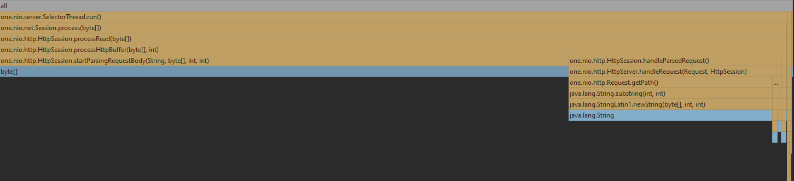
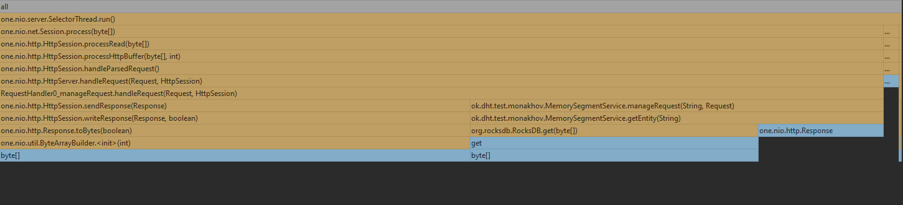

# Отчет по 1 стадии

Была взята референсная реализация базы данных. И до начала тестирования нагружена данными примерно на 20.24GB

Так же были написаны скрипты для перформанс теста:
1. [Lua get script](../wrk/get.lua)
2. [Lua put script](../wrk/put.lua)

К сожалению возникли огромные трудности с использованием async-profiler(я под виндой, а на wsl профайлер установился, но
крашился вместе с профилируемым процессом при попытке остановить его с записью в файле), поэтому в дальнейшем отчете будет
отсутствовать heatmap. Был использован idea profiler, под капотом использующий async-profiler.

# Профилирование
## PUT
### Latency(wrk2)
Ордеррейт 800 оказался стабильной нагрузкой, при которой 99 процентов запросов укладывается в 19 мс, при нагрузке 1000
99 персентиль возрастает до 900 мс. 
```
 wrk -c1 -t1 -d3m -R800 -L -s put.lua http://localhost:19234
Running 3m test @ http://localhost:19234
  1 threads and 1 connections
  Thread calibration: mean lat.: 1.775ms, rate sampling interval: 10ms


  Thread Stats   Avg      Stdev     Max   +/- Stdev
    Latency     2.20ms    3.36ms  53.73ms   97.96%
    Req/Sec   843.28     96.28     1.80k    76.76%
  Latency Distribution (HdrHistogram - Recorded Latency)
 50.000%    1.80ms
 75.000%    2.31ms
 90.000%    2.81ms
 99.000%   18.06ms
 99.900%   48.03ms
 99.990%   53.38ms
 99.999%   53.73ms
100.000%   53.76ms

  Detailed Percentile spectrum:
       Value   Percentile   TotalCount 1/(1-Percentile)

       0.409     0.000000            1         1.00
       0.920     0.100000        13649         1.11
       1.162     0.200000        27204         1.25
       1.380     0.300000        40849         1.43
       1.591     0.400000        54442         1.67
       1.798     0.500000        68041         2.00
       1.897     0.550000        74860         2.22
       1.996     0.600000        81644         2.50
       2.097     0.650000        88475         2.86
       2.199     0.700000        95199         3.33
       2.313     0.750000       102085         4.00
       2.373     0.775000       105472         4.44
       2.439     0.800000       108892         5.00
       2.511     0.825000       112245         5.71
       2.593     0.850000       115683         6.67
       2.687     0.875000       119020         8.00
       2.745     0.887500       120723         8.89
       2.809     0.900000       122433        10.00
       2.877     0.912500       124099        11.43
       2.961     0.925000       125836        13.33
       3.063     0.937500       127530        16.00
       3.125     0.943750       128358        17.78
       3.197     0.950000       129200        20.00
       3.285     0.956250       130061        22.86
       3.403     0.962500       130900        26.67
       3.597     0.968750       131749        32.00
       3.765     0.971875       132174        35.56
       4.087     0.975000       132599        40.00
       4.787     0.978125       133023        45.71
       6.919     0.981250       133447        53.33
       9.711     0.984375       133872        64.00
      11.159     0.985938       134085        71.11
      13.791     0.987500       134298        80.00
      16.639     0.989062       134509        91.43
      19.247     0.990625       134722       106.67
      21.871     0.992188       134935       128.00
      23.727     0.992969       135040       142.22
      26.847     0.993750       135147       160.00
      29.871     0.994531       135253       182.86
      31.375     0.995313       135359       213.33
      33.791     0.996094       135467       256.00
      34.687     0.996484       135520       284.44
      35.807     0.996875       135572       320.00
      36.863     0.997266       135626       365.71
      38.335     0.997656       135678       426.67
      40.639     0.998047       135731       512.00
      42.431     0.998242       135757       568.89
      44.575     0.998437       135784       640.00
      45.791     0.998633       135812       731.43
      46.783     0.998828       135837       853.33
      48.319     0.999023       135865      1024.00
      49.023     0.999121       135877      1137.78
      49.343     0.999219       135892      1280.00
      50.111     0.999316       135904      1462.86
      50.655     0.999414       135917      1706.67
      50.847     0.999512       135932      2048.00
      50.943     0.999561       135938      2275.56
      51.103     0.999609       135943      2560.00
      51.423     0.999658       135950      2925.71
      51.551     0.999707       135959      3413.33
      51.711     0.999756       135963      4096.00
      52.063     0.999780       135967      4551.11
      52.959     0.999805       135970      5120.00
      53.183     0.999829       135973      5851.43
      53.279     0.999854       135978      6826.67
      53.343     0.999878       135980      8192.00
      53.375     0.999890       135982      9102.22
      53.439     0.999902       135985     10240.00
      53.439     0.999915       135985     11702.86
      53.503     0.999927       135987     13653.33
      53.535     0.999939       135988     16384.00
      53.567     0.999945       135990     18204.44
      53.567     0.999951       135990     20480.00
      53.599     0.999957       135992     23405.71
      53.599     0.999963       135992     27306.67
      53.599     0.999969       135992     32768.00
      53.663     0.999973       135994     36408.89
      53.663     0.999976       135994     40960.00
      53.663     0.999979       135994     46811.43
      53.663     0.999982       135994     54613.33
      53.663     0.999985       135994     65536.00
      53.727     0.999986       135995     72817.78
      53.727     0.999988       135995     81920.00
      53.727     0.999989       135995     93622.86
      53.727     0.999991       135995    109226.67
      53.727     0.999992       135995    131072.00
      53.759     0.999993       135996    145635.56
      53.759     1.000000       135996          inf
#[Mean    =        2.203, StdDeviation   =        3.358]
#[Max     =       53.728, Total count    =       135996]
#[Buckets =           27, SubBuckets     =         2048]
----------------------------------------------------------
  144000 requests in 3.00m, 9.20MB read
Requests/sec:    799.99
Transfer/sec:     52.34KB
```
### Flame graph
Сервис класс называется MemorySegmentService потому что я его поздно переименовал.
#### Cpu

Можно заметить, что 65% тратит RockDB.put на добавление данных, такой большой процент связан со сложностью данной операции и большим объемом данных в бд.
(у гет операция с базой данных потребляет больше ресурсов(70%), что обусловлено структурой данных внутри базы, которая обеспечивает более быстрые put).
HttpSession.writeResponse потребляет 5.03% на отправку ответа клиенту, интересно, что у гет это значение 5.37, хоть и отправляем больше данных.
Еще можно отметить Session.read(6.6%) тратящий ресурсы на прием запросов(интересно что столько же сколько у и гет) и JavaSelector.select(10.2)
слушающий новые подключения.
#### Alloc

72% уходит на аллокацию байтов для приема объектов из сети и 26.72 на роутинг.

# GET
### Latency(wrk2)
Ордеррейт 700 является стабильным, при котором 99% запросов обрабатывается за 41 мс. При ордеррейте 800, 80 персентиль еще адекватный - 58 мс,
90 персентиль - 248 мс, а 99 совсем ужас - 935. Что связано с большой загрузкой базы данных (20 гигов для моего компа жесть так-то)
```
wrk -c1 -t1 -d3m -R700 -L -s get.lua http://localhost:19234
Running 3m test @ http://localhost:19234
  1 threads and 1 connections
  Thread calibration: mean lat.: 1.999ms, rate sampling interval: 10ms
  Thread Stats   Avg      Stdev     Max   +/- Stdev
    Latency     3.24ms    7.27ms 100.48ms   96.93%
    Req/Sec   737.37     88.25     1.22k    77.57%
  Latency Distribution (HdrHistogram - Recorded Latency)
 50.000%    2.15ms
 75.000%    2.73ms
 90.000%    3.30ms
 99.000%   38.59ms
 99.900%   90.30ms
 99.990%  100.22ms
 99.999%  100.48ms
100.000%  100.54ms

  Detailed Percentile spectrum:
       Value   Percentile   TotalCount 1/(1-Percentile)

       0.741     0.000000            1         1.00
       1.278     0.100000        11952         1.11
       1.519     0.200000        23842         1.25
       1.738     0.300000        35699         1.43
       1.948     0.400000        47620         1.67
       2.155     0.500000        59572         2.00
       2.259     0.550000        65455         2.22
       2.367     0.600000        71494         2.50
       2.479     0.650000        77407         2.86
       2.597     0.700000        83412         3.33
       2.727     0.750000        89259         4.00
       2.797     0.775000        92229         4.44
       2.871     0.800000        95197         5.00
       2.957     0.825000        98214         5.71
       3.051     0.850000       101165         6.67
       3.163     0.875000       104166         8.00
       3.227     0.887500       105643         8.89
       3.299     0.900000       107099        10.00
       3.397     0.912500       108591        11.43
       3.513     0.925000       110075        13.33
       3.699     0.937500       111563        16.00
       3.863     0.943750       112309        17.78
       4.211     0.950000       113046        20.00
       5.375     0.956250       113791        22.86
       7.267     0.962500       114534        26.67
      10.199     0.968750       115277        32.00
      11.999     0.971875       115649        35.56
      13.799     0.975000       116022        40.00
      15.695     0.978125       116392        45.71
      18.351     0.981250       116765        53.33
      22.991     0.984375       117136        64.00
      26.559     0.985938       117322        71.11
      31.711     0.987500       117508        80.00
      35.679     0.989062       117695        91.43
      41.503     0.990625       117880       106.67
      49.663     0.992188       118066       128.00
      53.471     0.992969       118159       142.22
      57.375     0.993750       118252       160.00
      62.303     0.994531       118346       182.86
      66.623     0.995313       118438       213.33
      73.535     0.996094       118531       256.00
      77.695     0.996484       118578       284.44
      82.559     0.996875       118626       320.00
      84.607     0.997266       118673       365.71
      85.567     0.997656       118717       426.67
      87.167     0.998047       118766       512.00
      87.615     0.998242       118791       568.89
      87.871     0.998437       118813       640.00
      88.383     0.998633       118835       731.43
      89.535     0.998828       118856       853.33
      91.007     0.999023       118879      1024.00
      92.351     0.999121       118891      1137.78
      94.271     0.999219       118904      1280.00
      94.911     0.999316       118914      1462.86
      95.999     0.999414       118926      1706.67
      97.599     0.999512       118937      2048.00
      98.815     0.999561       118943      2275.56
      99.263     0.999609       118950      2560.00
      99.455     0.999658       118955      2925.71
      99.711     0.999707       118962      3413.33
      99.903     0.999756       118967      4096.00
      99.967     0.999780       118970      4551.11
     100.031     0.999805       118973      5120.00
     100.095     0.999829       118976      5851.43
     100.159     0.999854       118979      6826.67
     100.223     0.999878       118983      8192.00
     100.223     0.999890       118983      9102.22
     100.287     0.999902       118986     10240.00
     100.287     0.999915       118986     11702.86
     100.351     0.999927       118988     13653.33
     100.351     0.999939       118988     16384.00
     100.415     0.999945       118992     18204.44
     100.415     0.999951       118992     20480.00
     100.415     0.999957       118992     23405.71
     100.415     0.999963       118992     27306.67
     100.415     0.999969       118992     32768.00
     100.415     0.999973       118992     36408.89
     100.479     0.999976       118994     40960.00
     100.479     0.999979       118994     46811.43
     100.479     0.999982       118994     54613.33
     100.479     0.999985       118994     65536.00
     100.479     0.999986       118994     72817.78
     100.479     0.999988       118994     81920.00
     100.479     0.999989       118994     93622.86
     100.479     0.999991       118994    109226.67
     100.543     0.999992       118995    131072.00
     100.543     1.000000       118995          inf
#[Mean    =        3.240, StdDeviation   =        7.268]
#[Max     =      100.480, Total count    =       118995]
#[Buckets =           27, SubBuckets     =         2048]
----------------------------------------------------------
  125999 requests in 3.00m, 1.42GB read
Requests/sec:    700.00
Transfer/sec:      8.05MB
```
### Flame graph
#### Cpu

Использование cpu практически идентично put запросу. За исключение того что теперь операция RocksDb.get.
Небольшие различия в процентах так же описаны в put.
#### Alloc
52% уходит на аллокацию байтов для отправки по сети (sendResponse) и на создание в куче объекта полученного из бд (getEntity 45%)


