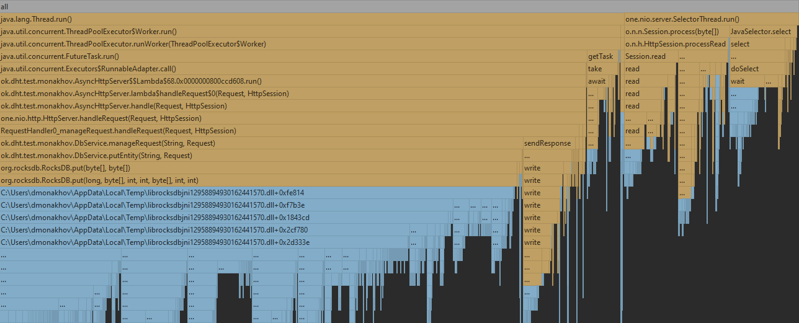
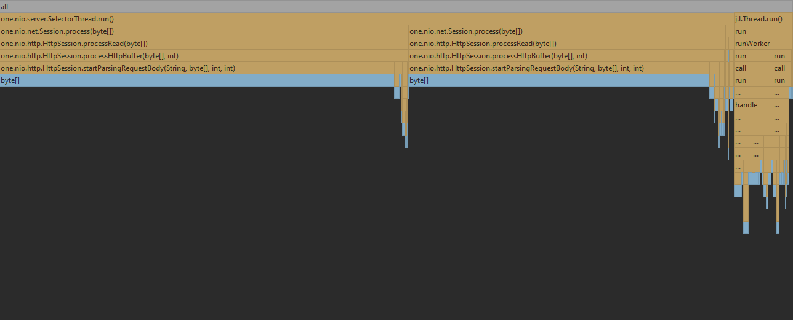
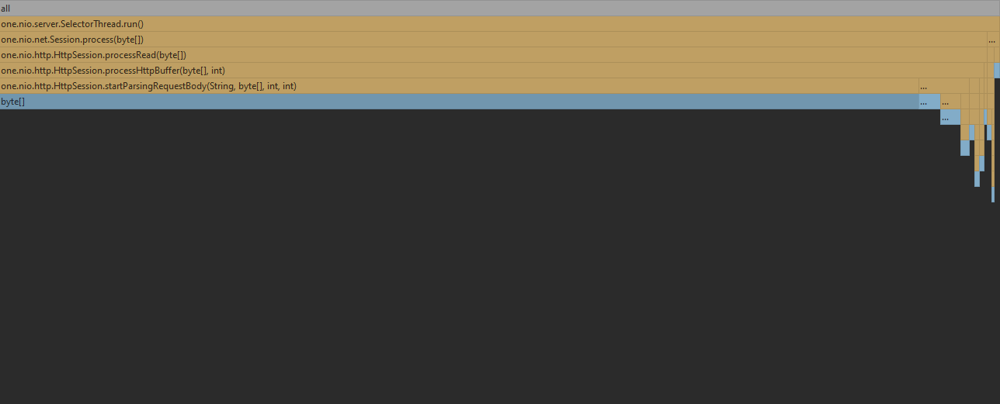
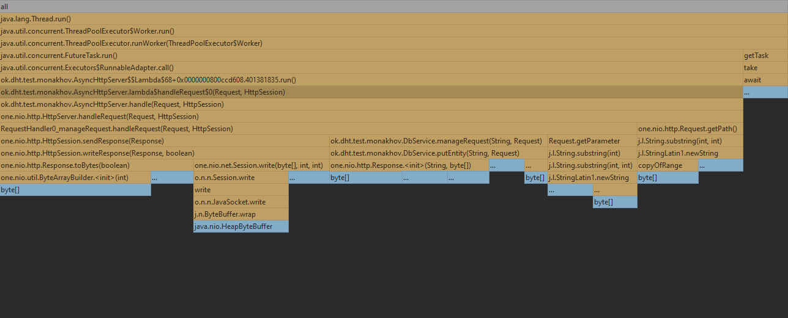
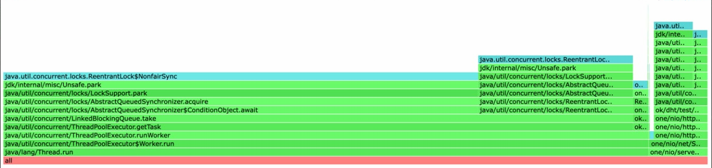
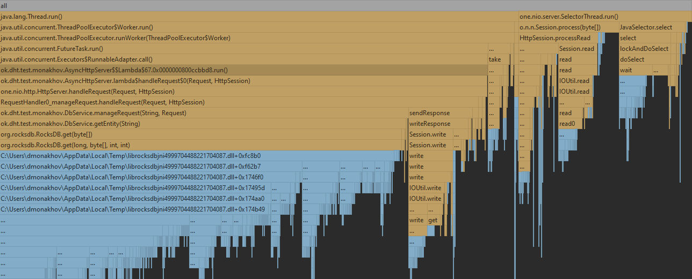
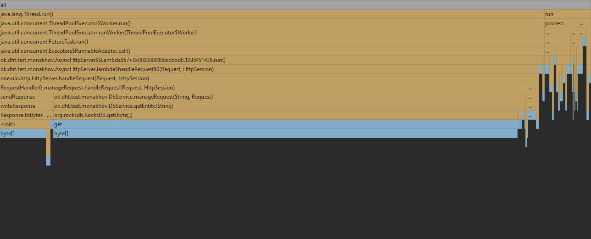

# Отчет по 2 стадии

!!!!!!!!!! Такие низкие показатели ордеррейта потому что рабочий антивирус eset при нагрузке начинает резко сжирать 60-70% cpu.

Была взята rockDB реализация базы данных. И до начала тестирования нагружена данными примерно на 20.24GB

Был распараллелено stage1 приложение. Теперь селектор треды занимаются только приемом данных из сети, а роутингом и 
бизнес логикой занимаютя потоки из тред пула. На машине 8 физических потоков и 16 логический, тесты показали что результаты
при 16 потоках куда эффективнее, что связано с гипертредингом и использорванием 8 доп потоков во время простоя первых 8.

К сожалению возникли огромные трудности с использованием async-profiler(я под виндой, а на wsl профайлер установился, но
крашился вместе с профилируемым процессом при попытке остановить его с записью в файле), поэтому в дальнейшем отчете будет
отсутствовать heatmap. Был использован idea profiler, под капотом использующий async-profiler.

# Профилирование
## PUT
### Latency(wrk2)
Ордеррейт 6000 оказался стабильной нагрузкой, при которой 99 процентов запросов укладывается в 12 мс, при нагрузке 6500
99 персентиль возрастает до 462 мс.
По сравнения с однопоточной реализаций, ордеррейд возрос в 6 раз, что при 8 физический потоках является неплохим результатом.
Put все еще выдерживает больший ордеррейт из-за особенностей структуры данных в бд
```
 wrk -c16 -t16 -d1m -R6000 -L -s put.lua http://localhost:19234
Running 1m test @ http://localhost:19234
  16 threads and 16 connections
  Thread calibration: mean lat.: 5.455ms, rate sampling interval: 24ms
  Thread calibration: mean lat.: 8.241ms, rate sampling interval: 56ms
  Thread calibration: mean lat.: 6.667ms, rate sampling interval: 30ms
  Thread calibration: mean lat.: 6.964ms, rate sampling interval: 37ms
  Thread calibration: mean lat.: 7.003ms, rate sampling interval: 40ms
  Thread calibration: mean lat.: 5.573ms, rate sampling interval: 24ms
  Thread calibration: mean lat.: 8.119ms, rate sampling interval: 46ms
  Thread calibration: mean lat.: 3.834ms, rate sampling interval: 12ms
  Thread calibration: mean lat.: 6.741ms, rate sampling interval: 36ms
  Thread calibration: mean lat.: 7.426ms, rate sampling interval: 44ms
  Thread calibration: mean lat.: 5.512ms, rate sampling interval: 26ms
  Thread calibration: mean lat.: 6.244ms, rate sampling interval: 28ms
  Thread calibration: mean lat.: 3.743ms, rate sampling interval: 11ms
  Thread calibration: mean lat.: 3.646ms, rate sampling interval: 10ms
  Thread calibration: mean lat.: 4.809ms, rate sampling interval: 16ms
  Thread calibration: mean lat.: 4.039ms, rate sampling interval: 13ms
  Thread Stats   Avg      Stdev     Max   +/- Stdev
    Latency     2.96ms    1.83ms  31.74ms   95.09%
    Req/Sec   386.62     41.69   600.00     75.36%
  Latency Distribution (HdrHistogram - Recorded Latency)
 50.000%    2.69ms
 75.000%    3.24ms
 90.000%    3.89ms
 99.000%   12.25ms
 99.900%   22.70ms
 99.990%   28.82ms
 99.999%   31.28ms
100.000%   31.76ms

  Detailed Percentile spectrum:
       Value   Percentile   TotalCount 1/(1-Percentile)

       0.736     0.000000            1         1.00
       1.764     0.100000        30047         1.11
       2.055     0.200000        59979         1.25
       2.285     0.300000        90134         1.43
       2.487     0.400000       119977         1.67
       2.687     0.500000       150181         2.00
       2.785     0.550000       164942         2.22
       2.889     0.600000       179999         2.50
       2.995     0.650000       194962         2.86
       3.111     0.700000       209964         3.33
       3.243     0.750000       225018         4.00
       3.315     0.775000       232375         4.44
       3.397     0.800000       239964         5.00
       3.487     0.825000       247429         5.71
       3.591     0.850000       254883         6.67
       3.717     0.875000       262316         8.00
       3.795     0.887500       266115         8.89
       3.887     0.900000       269864        10.00
       3.997     0.912500       273586        11.43
       4.135     0.925000       277343        13.33
       4.327     0.937500       281061        16.00
       4.459     0.943750       282931        17.78
       4.647     0.950000       284797        20.00
       4.891     0.956250       286691        22.86
       5.243     0.962500       288547        26.67
       5.779     0.968750       290418        32.00
       6.135     0.971875       291359        35.56
       6.575     0.975000       292294        40.00
       7.135     0.978125       293230        45.71
       7.923     0.981250       294167        53.33
       8.991     0.984375       295100        64.00
       9.599     0.985938       295569        71.11
      10.327     0.987500       296038        80.00
      11.503     0.989062       296511        91.43
      12.671     0.990625       296974       106.67
      13.735     0.992188       297444       128.00
      14.223     0.992969       297678       142.22
      14.863     0.993750       297914       160.00
      15.455     0.994531       298146       182.86
      16.199     0.995313       298381       213.33
      16.991     0.996094       298616       256.00
      17.439     0.996484       298736       284.44
      18.015     0.996875       298848       320.00
      18.751     0.997266       298971       365.71
      19.439     0.997656       299085       426.67
      20.207     0.998047       299200       512.00
      20.527     0.998242       299259       568.89
      20.959     0.998437       299316       640.00
      21.423     0.998633       299376       731.43
      22.015     0.998828       299434       853.33
      22.815     0.999023       299494      1024.00
      23.359     0.999121       299522      1137.78
      23.935     0.999219       299550      1280.00
      24.415     0.999316       299580      1462.86
      25.167     0.999414       299610      1706.67
      25.631     0.999512       299639      2048.00
      25.935     0.999561       299653      2275.56
      26.223     0.999609       299667      2560.00
      26.511     0.999658       299682      2925.71
      27.007     0.999707       299697      3413.33
      27.263     0.999756       299712      4096.00
      27.535     0.999780       299720      4551.11
      27.695     0.999805       299726      5120.00
      27.903     0.999829       299733      5851.43
      28.447     0.999854       299741      6826.67
      28.623     0.999878       299748      8192.00
      28.799     0.999890       299753      9102.22
      28.847     0.999902       299755     10240.00
      29.231     0.999915       299759     11702.86
      29.343     0.999927       299764     13653.33
      29.519     0.999939       299767     16384.00
      29.615     0.999945       299769     18204.44
      29.663     0.999951       299770     20480.00
      30.239     0.999957       299772     23405.71
      30.623     0.999963       299774     27306.67
      30.671     0.999969       299775     32768.00
      30.799     0.999973       299776     36408.89
      30.815     0.999976       299777     40960.00
      30.847     0.999979       299778     46811.43
      30.927     0.999982       299779     54613.33
      31.231     0.999985       299780     65536.00
      31.231     0.999986       299780     72817.78
      31.279     0.999988       299781     81920.00
      31.279     0.999989       299781     93622.86
      31.327     0.999991       299782    109226.67
      31.327     0.999992       299782    131072.00
      31.327     0.999993       299782    145635.56
      31.727     0.999994       299783    163840.00
      31.727     0.999995       299783    187245.71
      31.727     0.999995       299783    218453.33
      31.727     0.999996       299783    262144.00
      31.727     0.999997       299783    291271.11
      31.759     0.999997       299784    327680.00
      31.759     1.000000       299784          inf
#[Mean    =        2.965, StdDeviation   =        1.832]
#[Max     =       31.744, Total count    =       299784]
#[Buckets =           27, SubBuckets     =         2048]
----------------------------------------------------------
  359823 requests in 1.00m, 22.99MB read
Requests/sec:   6000.45
Transfer/sec:    392.61KB
```
### Flame graph
#### Cpu
Различия с однопоточной версией не то чтобы колоссальные. Изменилась иерархия вызова по пути к конченым функциям (теперь 
selectorThread отвечает только за прием данных, а тредпул за занесение в бд и отправку ответа), а соотношение используемового 
cpu осталось примерно таким же. Стоит отметить разве что появление ThreadPoolExecutor.getTask занимающей 4% и отвественной
за менеджмент тасок в тредпуле.


#### Alloc

Ситуация не сильно изменилась по сравнения с однопоточным приложением. Вот общая картина по тредам. И дальше посмотрим детали.
Из общей картины можно сделать вывод что почти все аллокации так же уходят на прием объектов из сети как и в 1 поточном случае



Для селектора ситуация выглядит так. 98% уходит на processRead. Неудивительно, ведь мы разделили функционал так,
что селектор треды только читают поступающие запросы, а записью ответов и выполнение бизнес логики занимаются уже воркеры.



Для воркера ситуация уже интереснее. 6% уходит на внутренние аллокации для Executor. 25% уходит на Request.getPararmeter и
Request.getPath (внутрениие функции one.nio омогающие в роутинге). И самое главное 41% на запись ответа по сети sendResponse
и 27% на саму запись в бд. 



#### Lock

90% на LinkBlockQueue.take - ожидание доступа к очереди внутри тредпула(потенциально можно лок фри структуру юзать)  и
10 % на ожидание разрешения для взаимодействия с сокетом.




# GET
### Latency(wrk2)
Ордеррейт 5000 является стабильным, при котором 99% запросов обрабатывается за 4 мс. При ордеррейте 6000 задержки уже порядка 2000
Нагрузка так же как и для put выросла в ~6 раз. 

```
wrk -c16 -t16 -d1m -R5000 -L -s get.lua http://localhost:19234
Running 1m test @ http://localhost:19234
  16 threads and 16 connections
  Thread calibration: mean lat.: 3.057ms, rate sampling interval: 10ms
  Thread calibration: mean lat.: 3.110ms, rate sampling interval: 10ms
  Thread calibration: mean lat.: 3.182ms, rate sampling interval: 10ms
  Thread calibration: mean lat.: 3.099ms, rate sampling interval: 10ms
  Thread calibration: mean lat.: 3.063ms, rate sampling interval: 10ms
  Thread calibration: mean lat.: 3.129ms, rate sampling interval: 10ms
  Thread calibration: mean lat.: 3.073ms, rate sampling interval: 10ms
  Thread calibration: mean lat.: 3.139ms, rate sampling interval: 10ms
  Thread calibration: mean lat.: 3.091ms, rate sampling interval: 10ms
  Thread calibration: mean lat.: 3.061ms, rate sampling interval: 10ms
  Thread calibration: mean lat.: 3.062ms, rate sampling interval: 10ms
  Thread calibration: mean lat.: 3.063ms, rate sampling interval: 10ms
  Thread calibration: mean lat.: 3.085ms, rate sampling interval: 10ms
  Thread calibration: mean lat.: 3.079ms, rate sampling interval: 10ms
  Thread calibration: mean lat.: 3.119ms, rate sampling interval: 10ms
  Thread calibration: mean lat.: 3.091ms, rate sampling interval: 10ms
  Thread Stats   Avg      Stdev     Max   +/- Stdev
    Latency     3.07ms  756.91us  20.77ms   73.20%
    Req/Sec   329.59     55.95   555.00     62.01%
  Latency Distribution (HdrHistogram - Recorded Latency)
 50.000%    3.02ms
 75.000%    3.50ms
 90.000%    3.93ms
 99.000%    4.82ms
 99.900%    9.36ms
 99.990%   16.75ms
 99.999%   20.16ms
100.000%   20.78ms

  Detailed Percentile spectrum:
       Value   Percentile   TotalCount 1/(1-Percentile)

       1.262     0.000000            1         1.00
       2.193     0.100000        25022         1.11
       2.457     0.200000        50101         1.25
       2.667     0.300000        75223         1.43
       2.849     0.400000       100071         1.67
       3.023     0.500000       124989         2.00
       3.111     0.550000       137513         2.22
       3.201     0.600000       150121         2.50
       3.293     0.650000       162566         2.86
       3.389     0.700000       175038         3.33
       3.495     0.750000       187574         4.00
       3.553     0.775000       193857         4.44
       3.613     0.800000       200008         5.00
       3.679     0.825000       206275         5.71
       3.753     0.850000       212587         6.67
       3.835     0.875000       218826         8.00
       3.879     0.887500       221872         8.89
       3.931     0.900000       225054        10.00
       3.987     0.912500       228194        11.43
       4.049     0.925000       231280        13.33
       4.119     0.937500       234406        16.00
       4.159     0.943750       236002        17.78
       4.199     0.950000       237465        20.00
       4.251     0.956250       239128        22.86
       4.307     0.962500       240687        26.67
       4.371     0.968750       242165        32.00
       4.411     0.971875       242964        35.56
       4.455     0.975000       243711        40.00
       4.507     0.978125       244541        45.71
       4.559     0.981250       245269        53.33
       4.631     0.984375       246084        64.00
       4.671     0.985938       246455        71.11
       4.719     0.987500       246855        80.00
       4.775     0.989062       247221        91.43
       4.843     0.990625       247610       106.67
       4.935     0.992188       248012       128.00
       4.995     0.992969       248205       142.22
       5.067     0.993750       248396       160.00
       5.151     0.994531       248589       182.86
       5.275     0.995313       248782       213.33
       5.431     0.996094       248978       256.00
       5.567     0.996484       249076       284.44
       5.751     0.996875       249172       320.00
       6.071     0.997266       249271       365.71
       6.531     0.997656       249368       426.67
       7.107     0.998047       249465       512.00
       7.523     0.998242       249514       568.89
       7.991     0.998437       249563       640.00
       8.439     0.998633       249612       731.43
       8.991     0.998828       249664       853.33
       9.439     0.999023       249709      1024.00
       9.743     0.999121       249734      1137.78
      10.151     0.999219       249758      1280.00
      10.655     0.999316       249783      1462.86
      11.207     0.999414       249807      1706.67
      11.943     0.999512       249831      2048.00
      12.463     0.999561       249844      2275.56
      12.879     0.999609       249856      2560.00
      13.111     0.999658       249868      2925.71
      13.703     0.999707       249880      3413.33
      14.127     0.999756       249892      4096.00
      14.431     0.999780       249899      4551.11
      14.607     0.999805       249905      5120.00
      15.095     0.999829       249911      5851.43
      15.615     0.999854       249917      6826.67
      16.079     0.999878       249923      8192.00
      16.351     0.999890       249926      9102.22
      16.767     0.999902       249930     10240.00
      16.847     0.999915       249932     11702.86
      16.975     0.999927       249935     13653.33
      17.503     0.999939       249938     16384.00
      18.223     0.999945       249940     18204.44
      18.319     0.999951       249941     20480.00
      19.087     0.999957       249943     23405.71
      19.391     0.999963       249944     27306.67
      19.519     0.999969       249946     32768.00
      19.647     0.999973       249947     36408.89
      19.647     0.999976       249947     40960.00
      19.855     0.999979       249948     46811.43
      20.047     0.999982       249949     54613.33
      20.111     0.999985       249950     65536.00
      20.111     0.999986       249950     72817.78
      20.111     0.999988       249950     81920.00
      20.159     0.999989       249951     93622.86
      20.159     0.999991       249951    109226.67
      20.239     0.999992       249952    131072.00
      20.239     0.999993       249952    145635.56
      20.239     0.999994       249952    163840.00
      20.239     0.999995       249952    187245.71
      20.239     0.999995       249952    218453.33
      20.783     0.999996       249953    262144.00
      20.783     1.000000       249953          inf
#[Mean    =        3.066, StdDeviation   =        0.757]
#[Max     =       20.768, Total count    =       249953]
#[Buckets =           27, SubBuckets     =         2048]
----------------------------------------------------------
  299989 requests in 1.00m, 1.55GB read
Requests/sec:   5000.36
Transfer/sec:     26.40MB
```
### Flame graph
Глобальные отличия от однопоточной программы описаны в пут секции.

#### Cpu
Изменения описанные в секции про put так же актуальны и для get. 4% на getTask в тред пуде. И разнесение чтения-селекта и обработки-записи
запроса по разным тредам. Проценты каждой из секций равносильны процентам в однопоточном приложении. Единственное можно отметить
что взятие из бд и запись ответа оказались в одном потоке, что оптимально для пут, но плохо для гет(две самые затратные оперции 
в 1 потоке). В итоге у нас трейд офф или быстрый гет или быстрый пут. Выбираем пут:)



#### Alloc
Все так же похоже на однопоточную программу. 47% writeResponse, 46% getEntity и какие-то копейки на getTask и селект.


#### Lock


Все так же 90% на LinkBlockQueue.take - ожидание доступа к очереди внутри тредпула(потенциально можно лок фри структуру юзать)  и
10 % на ожидание разрешения для взаимодействия с сокетом.


