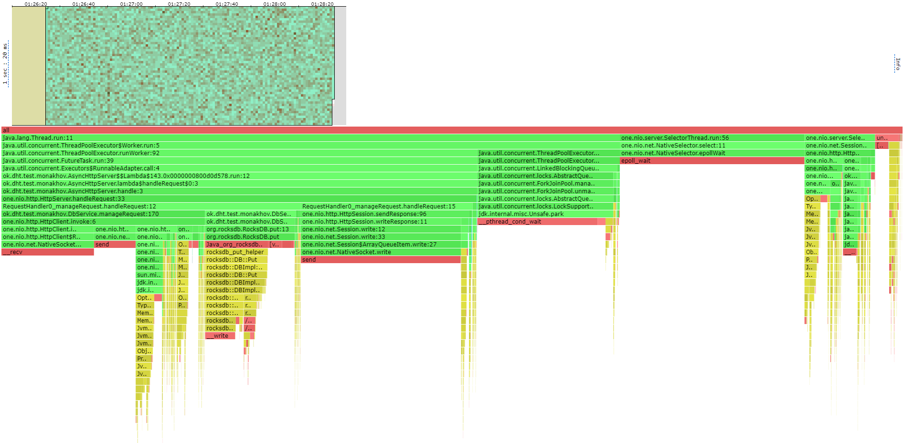
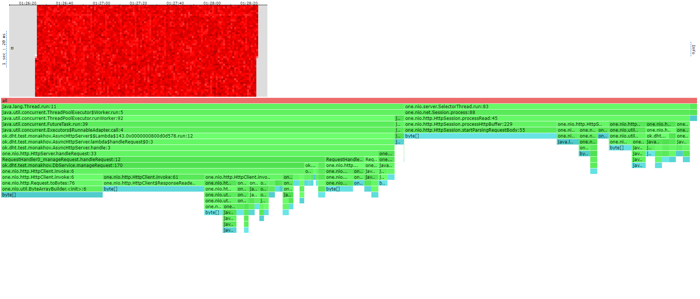
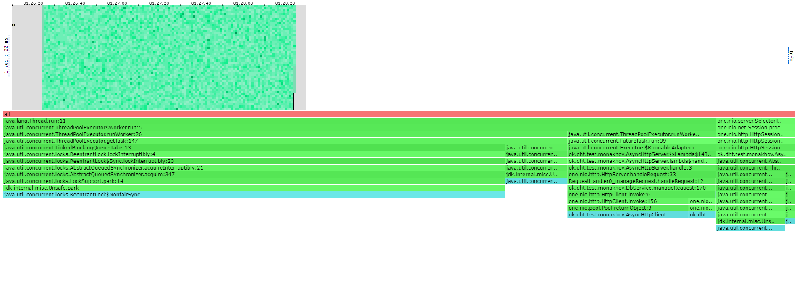
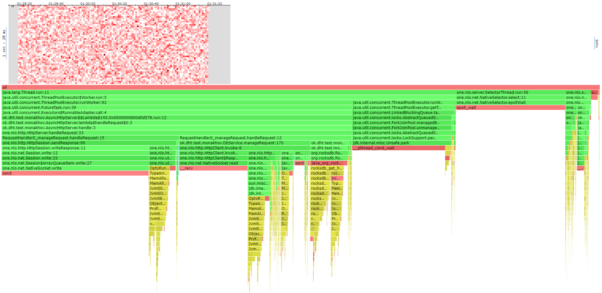
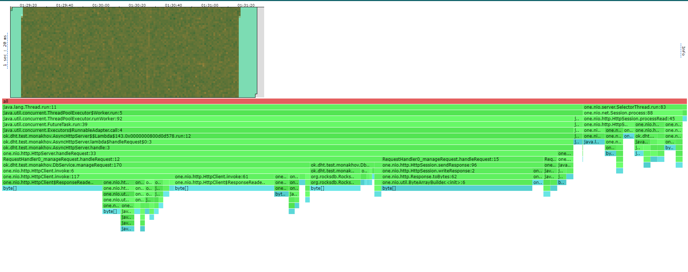
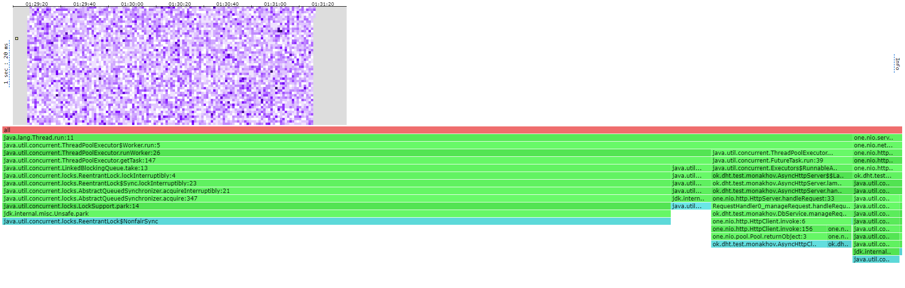

# Отчет по 3 стадии

### Я фулл хз почему на винде и на линуксе так отличаются результаты профилирования, поэтому когда я говорю так же как и было до шардирования, я повторил тест на винде и сравнил 

### !!!!!!!!!! Такие низкие показатели ордеррейта потому что рабочий антивирус eset при нагрузке начинает резко сжирать 60-70% cpu.

Была взята rockDB реализация базы данных. И до начала тестирования нагружена данными примерно на 15.6GB суммарно на 3 узла

Несмотря на все трудности с async-profiler, я почти смог его победить. Подебажив async-profiler получилось 
заставить его работать на wsl, теперь в отчетах будет хитмапа, но с профилированием локов все еще проблемы. При 
конвертации в html из jfr, jrf2flame отказывается конвертировать локи, хотя информация о них собиралась во время
профилирования.

По сравнению с прошлым этапом, было добавлено шардирование кластера на несколько нод.
После ресолва реквеста в сервис и проверки запроса на минимальную корректность 
с помощью NodeRouters(использующего Jumping hashes в сочетании с Hash.murmur3, отличающейся максимально честным 
распределением по нодам и возможность добавления нод(но не удаления)
по ключу вычисляется подходящая нода для переадресовки запроса.

Кроме того был реализован circuit breaker(так что дайте бонус!!!), использующий Scheduled thread pool.
При обнаружении дисконекта ноды, все запросы на нее начинают реджектится и создается таска раз в 5 секунд
мониторящая доступность ноды, которая открывает доступ к ней при подъеме.

В отчете будут отражены результаты подачи нагрузки через первую ноду, но за кадром была протестирована
нагрузка на все ноды. 

Кроме того, стоит отметить, что из-за подхода использующегося в предыдущем дз с распараллеливанием на уровне
сервера и нежеланием нарушать все возможные принципы инкапсуляции с выполнение работы сервиса в сервере,
не было возможность добавить отдельный тредпул для асинхронного редиректа запросов, и редирект происходит
в основном тредпуле для записи данных(что на самом деле не особо и проблема то).

Стоит отметить, что неочевидной причиной дергадации перформанса мог быть переезд на wsl(в профайлинге очевидно мы это не увидим,
но я подозреваю что накладные расходы все таки присутствуют)

Более очевидными проблемами деградации перформанса являются: 
1. Возросшая в 3 раза нагрузка на ресурсы компьютера(ноды то локально поднимаются). А если бы поднимались не локально,
сеть бы передала привет(хотя про нее дальше).
2. Возросшая сетевая нагрузка мастер узла. Отправка и прием редеректнутого запроса на другой узел совсем 
не бесплатная. По сути мы почти в 2/3 раза сильнее нагружаем сеть узла.
3. Использование circuit breaker тоже не дается бесплатно(нам все еще нужен тредпул для мониторинга доступности нод),
хоть и дает куда больше импакта, из-за того, что мы не тратим время на попытки отправки заведомо мертвых запросов,
а сразу их реджектим.


Далее я приведу результаты профилирования с минимальными комментариями по возможным улучшениям и отличиям от предыдущих этапов
(писать пасту про то у кого сколько процентов не вижу смысла, это очевидно видно из флейм графа).
   
# Профилирование
## PUT
### Latency(wrk2)
```
Running 2m test @ http://localhost:19234
  8 threads and 8 connections
  Thread calibration: mean lat.: 3.097ms, rate sampling interval: 10ms
  Thread calibration: mean lat.: 3.192ms, rate sampling interval: 10ms
  Thread calibration: mean lat.: 3.227ms, rate sampling interval: 10ms
  Thread calibration: mean lat.: 3.225ms, rate sampling interval: 10ms
  Thread calibration: mean lat.: 3.179ms, rate sampling interval: 10ms
  Thread calibration: mean lat.: 3.224ms, rate sampling interval: 10ms
  Thread calibration: mean lat.: 3.236ms, rate sampling interval: 10ms
  Thread calibration: mean lat.: 3.270ms, rate sampling interval: 10ms
  Thread Stats   Avg      Stdev     Max   +/- Stdev
    Latency     6.68ms   10.21ms 108.80ms   92.05%
    Req/Sec   526.57     84.90     1.00k    75.52%
  Latency Distribution (HdrHistogram - Recorded Latency)
 50.000%    3.51ms
 75.000%    5.35ms
 90.000%   12.49ms
 99.000%   55.87ms
 99.900%   85.44ms
 99.990%  104.51ms
 99.999%  108.29ms
100.000%  108.86ms

  Detailed Percentile spectrum:
       Value   Percentile   TotalCount 1/(1-Percentile)

       0.650     0.000000            1         1.00
       1.987     0.100000        44034         1.11
       2.433     0.200000        88072         1.25
       2.799     0.300000       132220         1.43
       3.139     0.400000       175997         1.67
       3.509     0.500000       220162         2.00
       3.723     0.550000       242049         2.22
       3.981     0.600000       264091         2.50
       4.307     0.650000       286132         2.86
       4.735     0.700000       308087         3.33
       5.347     0.750000       329982         4.00
       5.771     0.775000       341046         4.44
       6.319     0.800000       351976         5.00
       7.055     0.825000       362977         5.71
       8.067     0.850000       374008         6.67
       9.623     0.875000       384991         8.00
      10.847     0.887500       390488         8.89
      12.487     0.900000       395974        10.00
      14.951     0.912500       401472        11.43
      18.271     0.925000       406982        13.33
      22.783     0.937500       412476        16.00
      25.327     0.943750       415229        17.78
      28.095     0.950000       417991        20.00
      30.639     0.956250       420721        22.86
      34.303     0.962500       423496        26.67
      38.559     0.968750       426238        32.00
      40.575     0.971875       427598        35.56
      42.239     0.975000       428978        40.00
      43.775     0.978125       430369        45.71
      45.823     0.981250       431730        53.33
      48.415     0.984375       433100        64.00
      49.823     0.985938       433786        71.11
      52.127     0.987500       434475        80.00
      54.623     0.989062       435157        91.43
      56.863     0.990625       435845       106.67
      59.615     0.992188       436532       128.00
      60.735     0.992969       436886       142.22
      61.919     0.993750       437220       160.00
      63.263     0.994531       437564       182.86
      64.831     0.995313       437909       213.33
      67.775     0.996094       438255       256.00
      69.119     0.996484       438430       284.44
      70.847     0.996875       438599       320.00
      71.999     0.997266       438767       365.71
      73.407     0.997656       438939       426.67
      75.007     0.998047       439114       512.00
      75.647     0.998242       439197       568.89
      76.479     0.998437       439285       640.00
      77.503     0.998633       439369       731.43
      80.255     0.998828       439455       853.33
      86.911     0.999023       439541      1024.00
      90.111     0.999121       439583      1137.78
      93.567     0.999219       439628      1280.00
      96.511     0.999316       439669      1462.86
      98.239     0.999414       439713      1706.67
     100.159     0.999512       439755      2048.00
     100.607     0.999561       439776      2275.56
     100.927     0.999609       439798      2560.00
     101.439     0.999658       439822      2925.71
     102.079     0.999707       439841      3413.33
     102.719     0.999756       439862      4096.00
     103.039     0.999780       439873      4551.11
     103.359     0.999805       439886      5120.00
     103.551     0.999829       439895      5851.43
     103.935     0.999854       439905      6826.67
     104.127     0.999878       439916      8192.00
     104.383     0.999890       439921      9102.22
     104.831     0.999902       439927     10240.00
     105.343     0.999915       439932     11702.86
     106.239     0.999927       439937     13653.33
     107.135     0.999939       439943     16384.00
     107.199     0.999945       439945     18204.44
     107.327     0.999951       439948     20480.00
     107.583     0.999957       439952     23405.71
     107.647     0.999963       439954     27306.67
     107.711     0.999969       439956     32768.00
     107.775     0.999973       439957     36408.89
     107.967     0.999976       439959     40960.00
     108.031     0.999979       439960     46811.43
     108.159     0.999982       439963     54613.33
     108.159     0.999985       439963     65536.00
     108.159     0.999986       439963     72817.78
     108.223     0.999988       439964     81920.00
     108.287     0.999989       439967     93622.86
     108.287     0.999991       439967    109226.67
     108.287     0.999992       439967    131072.00
     108.287     0.999993       439967    145635.56
     108.287     0.999994       439967    163840.00
     108.287     0.999995       439967    187245.71
     108.287     0.999995       439967    218453.33
     108.607     0.999996       439968    262144.00
     108.607     0.999997       439968    291271.11
     108.607     0.999997       439968    327680.00
     108.607     0.999997       439968    374491.43
     108.607     0.999998       439968    436906.67
     108.863     0.999998       439969    524288.00
     108.863     1.000000       439969          inf
#[Mean    =        6.676, StdDeviation   =       10.213]
#[Max     =      108.800, Total count    =       439969]
#[Buckets =           27, SubBuckets     =         2048]
----------------------------------------------------------
  479988 requests in 2.00m, 37.98MB read
Requests/sec:   4000.01
Transfer/sec:    324.14KB
```
### Flame graph
#### Cpu
1. Сильно уменьшилась доля RocksDB.put(). Неудивительно, ведь уменьшили в 3 раза нагрузку на нашу ноду
2. Появился HttpClient.invoke() отвечающий за отправку и прием редиректнутого сообщения


А теперь самый треш. Это отличия от такого же теста на винде. В остальном тест на винде == тест на винде до шардов
1. Увеличилось время ожидание появления таски в пуле await в 5 раз (Очередь пустая? Не успел нормально дотестить мб проблема что сеть не вывозит ордеррейт) 
4. Увеличилось время select (казалось бы лол, как сеть может не вывозить в таком случае)

Формально их увеличение говорит нам о простое системы и можно было бы без задней мысли увеличить рейт. Но нельзя. Латенси
улетит куда-то в небеса, а процентное соотношение блоков тут как тут(по 15 процентов примерно каждый от корня).
Возможные проблемы:
мой рабочий антивирус тротлит(хз надо мужикам код отправить)




#### Alloc
По хитмапе видно, что аллокациям очень больно.
Так же появилсь аллокации в invoke, а в остальном очень похоже на не шардированную версию.


#### Lock
Появились аллокации для HttpClient.invoke(). Которые как не странно уходят на пересылку объекта по сети.
В остальном так же. Большая часть локов на вынимание элементов из очереди



# GET
### Latency(wrk2)
```
Running 2m test @ http://localhost:19234
  8 threads and 8 connections
  Thread calibration: mean lat.: 6.089ms, rate sampling interval: 22ms
  Thread calibration: mean lat.: 7.478ms, rate sampling interval: 26ms
  Thread calibration: mean lat.: 5.650ms, rate sampling interval: 19ms
  Thread calibration: mean lat.: 6.082ms, rate sampling interval: 20ms
  Thread calibration: mean lat.: 5.863ms, rate sampling interval: 19ms
  Thread calibration: mean lat.: 6.013ms, rate sampling interval: 20ms
  Thread calibration: mean lat.: 6.243ms, rate sampling interval: 22ms
  Thread calibration: mean lat.: 7.712ms, rate sampling interval: 28ms
  Thread Stats   Avg      Stdev     Max   +/- Stdev
    Latency     8.72ms   11.13ms 100.35ms   93.39%
    Req/Sec   383.93     42.84   631.00     71.49%
  Latency Distribution (HdrHistogram - Recorded Latency)
 50.000%    5.49ms
 75.000%    8.57ms
 90.000%   14.57ms
 99.000%   67.58ms
 99.900%   84.99ms
 99.990%   95.94ms
 99.999%   99.58ms
100.000%  100.42ms

  Detailed Percentile spectrum:
       Value   Percentile   TotalCount 1/(1-Percentile)

       0.936     0.000000            1         1.00
       2.957     0.100000        33011         1.11
       3.669     0.200000        66066         1.25
       4.219     0.300000        99176         1.43
       4.787     0.400000       132163         1.67
       5.491     0.500000       165162         2.00
       5.915     0.550000       181562         2.22
       6.395     0.600000       197992         2.50
       6.971     0.650000       214534         2.86
       7.675     0.700000       231048         3.33
       8.567     0.750000       247540         4.00
       9.111     0.775000       255841         4.44
       9.735     0.800000       263990         5.00
      10.479     0.825000       272292         5.71
      11.399     0.850000       280546         6.67
      12.647     0.875000       288751         8.00
      13.487     0.887500       292861         8.89
      14.567     0.900000       296998        10.00
      15.999     0.912500       301124        11.43
      17.967     0.925000       305243        13.33
      20.911     0.937500       309362        16.00
      23.039     0.943750       311436        17.78
      25.999     0.950000       313485        20.00
      30.159     0.956250       315546        22.86
      35.583     0.962500       317609        26.67
      42.367     0.968750       319672        32.00
      45.727     0.971875       320706        35.56
      49.247     0.975000       321737        40.00
      53.791     0.978125       322768        45.71
      57.055     0.981250       323797        53.33
      60.447     0.984375       324828        64.00
      62.079     0.985938       325349        71.11
      63.999     0.987500       325869        80.00
      65.983     0.989062       326387        91.43
      68.863     0.990625       326898       106.67
      71.103     0.992188       327416       128.00
      72.319     0.992969       327671       142.22
      73.471     0.993750       327933       160.00
      74.495     0.994531       328190       182.86
      75.647     0.995313       328437       213.33
      77.119     0.996094       328702       256.00
      77.759     0.996484       328826       284.44
      78.399     0.996875       328952       320.00
      79.231     0.997266       329087       365.71
      80.191     0.997656       329211       426.67
      81.279     0.998047       329339       512.00
      81.791     0.998242       329405       568.89
      82.367     0.998437       329468       640.00
      83.071     0.998633       329533       731.43
      83.839     0.998828       329599       853.33
      85.119     0.999023       329660      1024.00
      85.887     0.999121       329696      1137.78
      86.719     0.999219       329730      1280.00
      87.423     0.999316       329757      1462.86
      88.319     0.999414       329789      1706.67
      89.471     0.999512       329824      2048.00
      89.855     0.999561       329839      2275.56
      90.431     0.999609       329854      2560.00
      91.007     0.999658       329871      2925.71
      91.519     0.999707       329887      3413.33
      92.095     0.999756       329903      4096.00
      92.415     0.999780       329910      4551.11
      93.567     0.999805       329919      5120.00
      94.719     0.999829       329928      5851.43
      95.039     0.999854       329934      6826.67
      95.551     0.999878       329943      8192.00
      95.807     0.999890       329946      9102.22
      95.999     0.999902       329950     10240.00
      96.383     0.999915       329954     11702.86
      96.639     0.999927       329958     13653.33
      97.087     0.999939       329962     16384.00
      97.279     0.999945       329964     18204.44
      97.471     0.999951       329967     20480.00
      97.535     0.999957       329968     23405.71
      97.919     0.999963       329970     27306.67
      98.239     0.999969       329972     32768.00
      98.495     0.999973       329973     36408.89
      98.751     0.999976       329974     40960.00
      99.071     0.999979       329975     46811.43
      99.263     0.999982       329976     54613.33
      99.391     0.999985       329977     65536.00
      99.455     0.999986       329978     72817.78
      99.455     0.999988       329978     81920.00
      99.583     0.999989       329979     93622.86
      99.583     0.999991       329979    109226.67
     100.095     0.999992       329980    131072.00
     100.095     0.999993       329980    145635.56
     100.095     0.999994       329980    163840.00
     100.159     0.999995       329981    187245.71
     100.159     0.999995       329981    218453.33
     100.159     0.999996       329981    262144.00
     100.159     0.999997       329981    291271.11
     100.159     0.999997       329981    327680.00
     100.415     0.999997       329982    374491.43
     100.415     1.000000       329982          inf
#[Mean    =        8.722, StdDeviation   =       11.130]
#[Max     =      100.352, Total count    =       329982]
#[Buckets =           27, SubBuckets     =         2048]
----------------------------------------------------------
  359990 requests in 2.00m, 1.86GB read
Requests/sec:   2999.99
Transfer/sec:     15.89MB

```
### Flame graph
#### Cpu




#### Alloc
Все так же как и до шардирования, кроме опять же аллокаций на invoke(нет не оптимизируем).


#### Lock
Так же как до + так же как в пут



Теперь покажу результаты если отключить ноду во время тестирования. Покажу только для пут для гет тоже самое будет.


## PUT
### Latency(wrk2)
```
```
### Flame graph


#### Alloc


#### Lock


