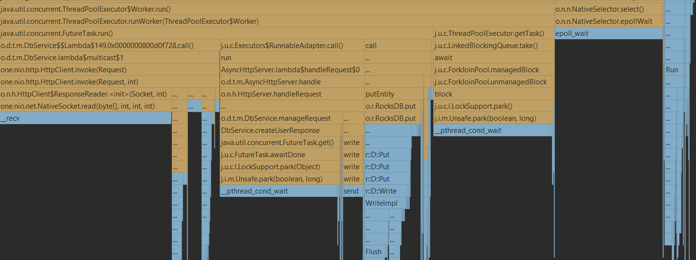
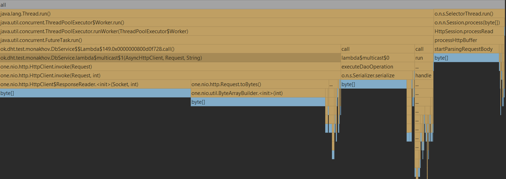
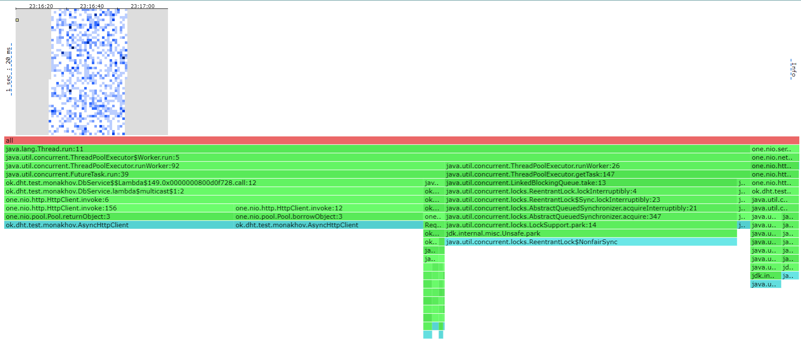
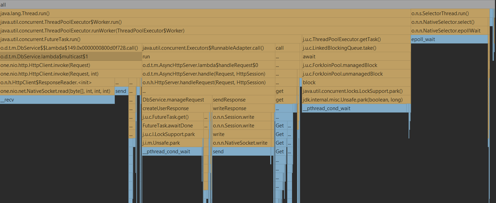
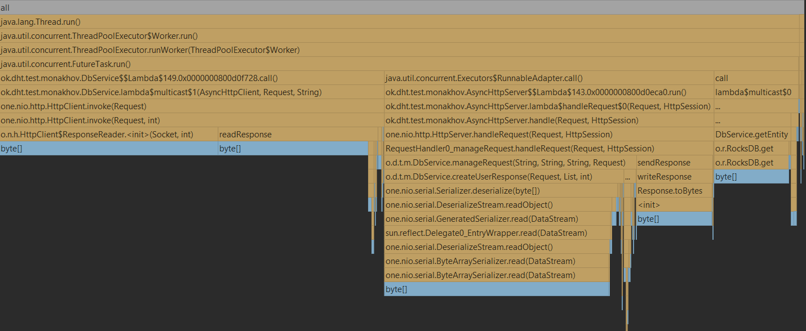
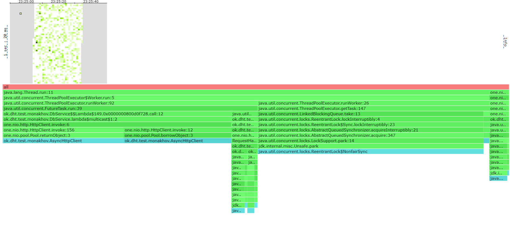

# Отчет по 4 стадии

### Очень сильно не успеваю, поэтому будет что будет

Тут дефолтная подготовка к каждому этапу, 3 ноды, 15 гигабай суммарно на них. Подробнее можно прочитать в отчете 
к предыдущей стадии.

Добавил еще один тред пул для параллельного конекта к нодам в рамках 1 запроса на мастер ноду.
Все остальное полнейший дефолт, таймстемпы, сериализация.


# Профилирование
## PUT
### Latency(wrk2)
1.5 k/sec
```
Running 30s test @ http://localhost:19234
  16 threads and 16 connections
  Thread calibration: mean lat.: 266.183ms, rate sampling interval: 902ms
  Thread calibration: mean lat.: 272.338ms, rate sampling interval: 915ms
  Thread calibration: mean lat.: 256.814ms, rate sampling interval: 872ms
  Thread calibration: mean lat.: 260.464ms, rate sampling interval: 882ms
  Thread calibration: mean lat.: 263.604ms, rate sampling interval: 895ms
  Thread calibration: mean lat.: 267.507ms, rate sampling interval: 901ms
  Thread calibration: mean lat.: 262.594ms, rate sampling interval: 898ms
  Thread calibration: mean lat.: 267.257ms, rate sampling interval: 900ms
  Thread calibration: mean lat.: 262.077ms, rate sampling interval: 889ms
  Thread calibration: mean lat.: 265.702ms, rate sampling interval: 899ms
  Thread calibration: mean lat.: 267.587ms, rate sampling interval: 901ms
  Thread calibration: mean lat.: 262.386ms, rate sampling interval: 889ms
  Thread calibration: mean lat.: 267.501ms, rate sampling interval: 902ms
  Thread calibration: mean lat.: 266.739ms, rate sampling interval: 906ms
  Thread calibration: mean lat.: 262.259ms, rate sampling interval: 883ms
  Thread calibration: mean lat.: 267.053ms, rate sampling interval: 904ms
  Thread Stats   Avg      Stdev     Max   +/- Stdev
    Latency    10.47ms   13.19ms  70.78ms   87.56%
    Req/Sec    93.34      2.05   100.00     86.04%
  Latency Distribution (HdrHistogram - Recorded Latency)
 50.000%    4.78ms
 75.000%    8.98ms
 90.000%   28.78ms
 99.000%   61.50ms
 99.900%   68.09ms
 99.990%   70.33ms
 99.999%   70.85ms
100.000%   70.85ms

  Detailed Percentile spectrum:
       Value   Percentile   TotalCount 1/(1-Percentile)

       1.844     0.000000            1         1.00
       3.255     0.100000         3008         1.11
       3.657     0.200000         6002         1.25
       4.009     0.300000         9001         1.43
       4.367     0.400000        12018         1.67
       4.779     0.500000        14996         2.00
       5.011     0.550000        16495         2.22
       5.311     0.600000        18003         2.50
       5.739     0.650000        19486         2.86
       6.747     0.700000        20984         3.33
       8.983     0.750000        22485         4.00
      10.527     0.775000        23229         4.44
      13.415     0.800000        23979         5.00
      16.527     0.825000        24729         5.71
      19.375     0.850000        25478         6.67
      23.503     0.875000        26226         8.00
      26.511     0.887500        26602         8.89
      28.783     0.900000        26978        10.00
      31.279     0.912500        27350        11.43
      36.543     0.925000        27725        13.33
      41.407     0.937500        28100        16.00
      42.847     0.943750        28289        17.78
      44.639     0.950000        28478        20.00
      46.911     0.956250        28662        22.86
      49.855     0.962500        28849        26.67
      51.647     0.968750        29041        32.00
      52.447     0.971875        29131        35.56
      53.247     0.975000        29223        40.00
      54.335     0.978125        29318        45.71
      55.711     0.981250        29411        53.33
      57.631     0.984375        29505        64.00
      58.751     0.985938        29551        71.11
      59.903     0.987500        29601        80.00
      60.895     0.989062        29647        91.43
      61.887     0.990625        29692       106.67
      62.655     0.992188        29740       128.00
      63.103     0.992969        29764       142.22
      63.487     0.993750        29785       160.00
      63.999     0.994531        29811       182.86
      64.607     0.995313        29832       213.33
      65.023     0.996094        29856       256.00
      65.151     0.996484        29868       284.44
      65.727     0.996875        29881       320.00
      65.983     0.997266        29892       365.71
      66.239     0.997656        29903       426.67
      66.623     0.998047        29914       512.00
      67.135     0.998242        29923       568.89
      67.263     0.998437        29927       640.00
      67.519     0.998633        29932       731.43
      67.903     0.998828        29938       853.33
      68.159     0.999023        29943      1024.00
      68.351     0.999121        29946      1137.78
      68.479     0.999219        29949      1280.00
      68.799     0.999316        29952      1462.86
      68.863     0.999414        29955      1706.67
      69.311     0.999512        29958      2048.00
      69.375     0.999561        29959      2275.56
      69.695     0.999609        29961      2560.00
      69.823     0.999658        29962      2925.71
      69.887     0.999707        29964      3413.33
      69.951     0.999756        29965      4096.00
      70.015     0.999780        29967      4551.11
      70.015     0.999805        29967      5120.00
      70.015     0.999829        29967      5851.43
      70.207     0.999854        29968      6826.67
      70.335     0.999878        29969      8192.00
      70.335     0.999890        29969      9102.22
      70.527     0.999902        29970     10240.00
      70.527     0.999915        29970     11702.86
      70.527     0.999927        29970     13653.33
      70.655     0.999939        29971     16384.00
      70.655     0.999945        29971     18204.44
      70.655     0.999951        29971     20480.00
      70.655     0.999957        29971     23405.71
      70.655     0.999963        29971     27306.67
      70.847     0.999969        29972     32768.00
      70.847     1.000000        29972          inf
#[Mean    =       10.473, StdDeviation   =       13.192]
#[Max     =       70.784, Total count    =        29972]
#[Buckets =           27, SubBuckets     =         2048]
----------------------------------------------------------
  44996 requests in 29.98s, 2.88MB read
Requests/sec:   1500.80
Transfer/sec:     98.20KB
```
### Flame graph
Если не успею с картинками посмотри html или jfr пожалуйста
#### Cpu

Очень много времени занимает ожидание получения запроса из future, оно и не странно, очень емкая по времени операция и на нее 
стоит явно выделять побольше тредов на конет по сети между нодами(Я очень мало поставил, поэтому такой большой процент 
у этой категории а перетестить не усеваю, но это очевидный ботлнек)

Два брата select и threadpool на месте(про них подробно в стейдж3), да и все остальное по старому



#### Alloc
Появилась сериализация, хотя занимает и не так много (13%)
Все отсальное как и раньше +-, куча мелких аллокаций которые были в прошлый раз не исчезли, просто стали еще меньше
по сравнению



#### Lock

Лок тоже не поменялся координально, но все же довольно заметно

Локи инвока(на socket и общение по сети) потеснили несравненного лидера прошлой части лока на взятие таски из тредпула локаьных задач
Это связано с тем, раньше мы сшардировали на 1 ноду, а теперь на фром, колоссально выросла конкуренцию





Я уже не усеваю, но там все точно так же как и в пут c поправкой на то что данные мы читаем, а не пишем.

# GET
### Latency(wrk2)
1k/sec
```
Running 30s test @ http://localhost:19234
  16 threads and 16 connections
  Thread calibration: mean lat.: 106.925ms, rate sampling interval: 454ms
  Thread calibration: mean lat.: 99.389ms, rate sampling interval: 428ms
  Thread calibration: mean lat.: 97.302ms, rate sampling interval: 422ms
  Thread calibration: mean lat.: 100.823ms, rate sampling interval: 436ms
  Thread calibration: mean lat.: 103.107ms, rate sampling interval: 440ms
  Thread calibration: mean lat.: 100.006ms, rate sampling interval: 437ms
  Thread calibration: mean lat.: 93.980ms, rate sampling interval: 411ms
  Thread calibration: mean lat.: 100.409ms, rate sampling interval: 434ms
  Thread calibration: mean lat.: 98.179ms, rate sampling interval: 431ms
  Thread calibration: mean lat.: 98.411ms, rate sampling interval: 427ms
  Thread calibration: mean lat.: 103.038ms, rate sampling interval: 438ms
  Thread calibration: mean lat.: 98.569ms, rate sampling interval: 427ms
  Thread calibration: mean lat.: 99.287ms, rate sampling interval: 431ms
  Thread calibration: mean lat.: 106.248ms, rate sampling interval: 450ms
  Thread calibration: mean lat.: 100.996ms, rate sampling interval: 435ms
  Thread calibration: mean lat.: 98.119ms, rate sampling interval: 429ms
  Thread Stats   Avg      Stdev     Max   +/- Stdev
    Latency     5.36ms    3.78ms  39.87ms   96.81%
    Req/Sec    62.10      1.34    68.00     96.16%
  Latency Distribution (HdrHistogram - Recorded Latency)
 50.000%    4.69ms
 75.000%    5.47ms
 90.000%    6.29ms
 99.000%   29.57ms
 99.900%   38.05ms
 99.990%   39.58ms
 99.999%   39.90ms
100.000%   39.90ms

  Detailed Percentile spectrum:
       Value   Percentile   TotalCount 1/(1-Percentile)

       2.569     0.000000            1         1.00
       3.627     0.100000         2001         1.11
       3.943     0.200000         4003         1.25
       4.199     0.300000         6022         1.43
       4.427     0.400000         7996         1.67
       4.687     0.500000        10000         2.00
       4.819     0.550000        11012         2.22
       4.963     0.600000        12014         2.50
       5.111     0.650000        12998         2.86
       5.279     0.700000        13992         3.33
       5.471     0.750000        15002         4.00
       5.571     0.775000        15494         4.44
       5.687     0.800000        15992         5.00
       5.811     0.825000        16504         5.71
       5.939     0.850000        16992         6.67
       6.103     0.875000        17486         8.00
       6.195     0.887500        17738         8.89
       6.295     0.900000        17988        10.00
       6.423     0.912500        18235        11.43
       6.603     0.925000        18489        13.33
       6.839     0.937500        18736        16.00
       6.979     0.943750        18863        17.78
       7.163     0.950000        18985        20.00
       7.467     0.956250        19109        22.86
       7.979     0.962500        19234        26.67
       9.399     0.968750        19359        32.00
      10.559     0.971875        19421        35.56
      12.631     0.975000        19484        40.00
      17.071     0.978125        19546        45.71
      21.983     0.981250        19609        53.33
      23.791     0.984375        19671        64.00
      24.783     0.985938        19702        71.11
      26.079     0.987500        19734        80.00
      28.191     0.989062        19765        91.43
      30.175     0.990625        19796       106.67
      31.839     0.992188        19827       128.00
      32.719     0.992969        19843       142.22
      33.311     0.993750        19859       160.00
      33.919     0.994531        19874       182.86
      34.623     0.995313        19890       213.33
      35.071     0.996094        19906       256.00
      35.391     0.996484        19913       284.44
      35.647     0.996875        19921       320.00
      36.127     0.997266        19930       365.71
      36.383     0.997656        19937       426.67
      36.607     0.998047        19944       512.00
      37.087     0.998242        19948       568.89
      37.279     0.998437        19952       640.00
      37.439     0.998633        19956       731.43
      37.823     0.998828        19960       853.33
      38.079     0.999023        19964      1024.00
      38.175     0.999121        19966      1137.78
      38.271     0.999219        19968      1280.00
      38.591     0.999316        19970      1462.86
      38.719     0.999414        19972      1706.67
      39.007     0.999512        19974      2048.00
      39.135     0.999561        19975      2275.56
      39.199     0.999609        19976      2560.00
      39.295     0.999658        19977      2925.71
      39.423     0.999707        19978      3413.33
      39.455     0.999756        19979      4096.00
      39.455     0.999780        19979      4551.11
      39.519     0.999805        19980      5120.00
      39.519     0.999829        19980      5851.43
      39.583     0.999854        19981      6826.67
      39.583     0.999878        19981      8192.00
      39.583     0.999890        19981      9102.22
      39.839     0.999902        19982     10240.00
      39.839     0.999915        19982     11702.86
      39.839     0.999927        19982     13653.33
      39.839     0.999939        19982     16384.00
      39.839     0.999945        19982     18204.44
      39.903     0.999951        19983     20480.00
      39.903     1.000000        19983          inf
#[Mean    =        5.363, StdDeviation   =        3.778]
#[Max     =       39.872, Total count    =        19983]
#[Buckets =           27, SubBuckets     =         2048]
----------------------------------------------------------
  30003 requests in 29.98s, 158.43MB read
Requests/sec:   1000.76
Transfer/sec:      5.28MB
```
### Flame graph
#### Cpu
Все наблюдения из пута актуальны и тут. Ничего нового.


#### Alloc
Все так же как и до шардирования, кроме опять же аллокаций на invoke(нет не оптимизируем).


#### Lock
Так же как до + так же как в пут

