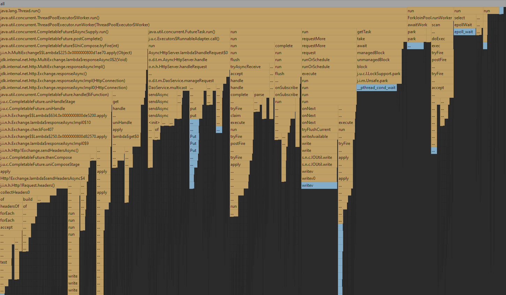
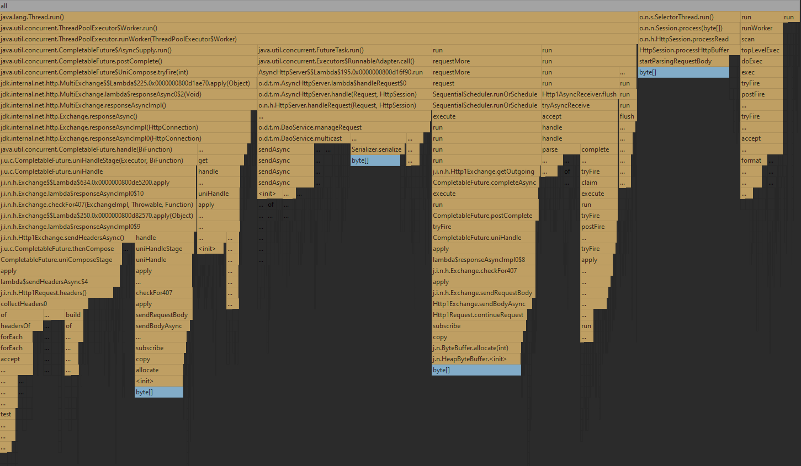
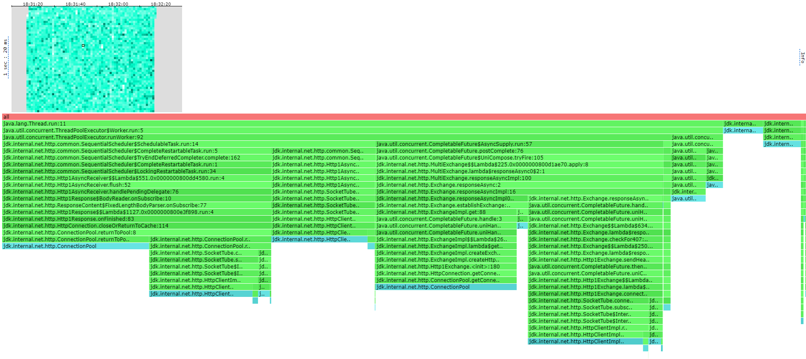
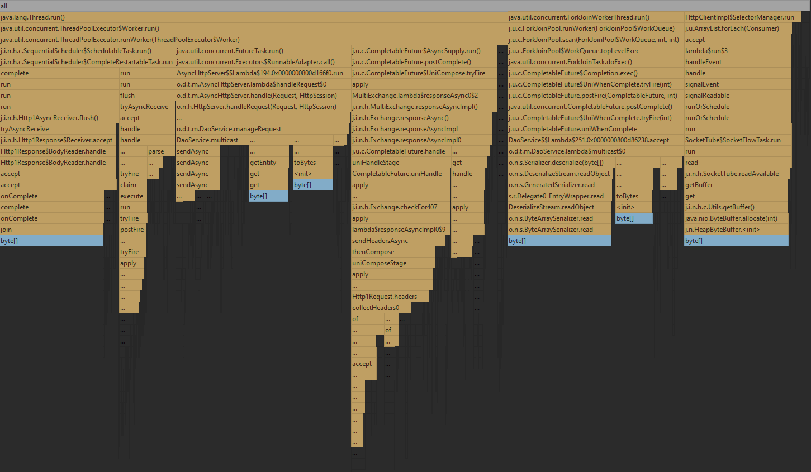
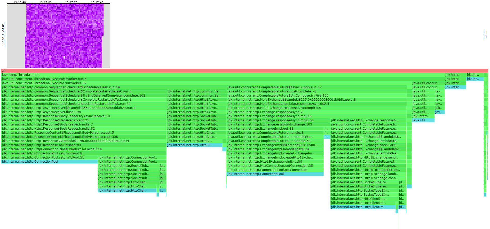

# Отчет по 3 стадии

Прокомментируйте, пожалуйста, неправильные выводы в отчете!!

Была взята rockDB реализация базы данных. И до начала тестирования нагружена данными примерно на 15.6GB суммарно на 3 узла
Тестрирование проводилось после прогрева и JIT оптимизации

Даже не знаю с чего начать, поменялось все, теперь не смогу отсылать на прошлый этап :с

Была добавлена асинхронность в решение с предыдущей лекции, теперь треды не дожидаются все ack, тот тред который делает 
ack и видит что набрал достаточное число возвращает результат с самым большим таймстемпом, дальнейшие таски относящиеся
к этому треду спокойно довыполняются, но их результат игнорируется(Todo потенциально можно канселить эти таски, 
экономим кучу сетевых ресурсов забивая на получение и обработку данных которые все равно выкинем. !! На момент написания
отчета нет, да и на конфиге 3ack/3from не даст буст).

Еще было переписано использование one.nio.Client на java.net.Client, В целом то можно было и на ван нио сделать с
кастомным тредпулом(если не канселить таски, потому что как там completable future получить я сходу не скажу)

Замеры приведенные в отчете производились на конфиге 3ack/3from. Что на самом деле равносильно предыдущему этапу, т.к все
равно ждем от всех. Отдельно будет замерена конфигурация 1ack/3from, в которой будет получен прирост к производительности
по сравнению с предыдущим этапом, цифры без дальнейшего анализа приведу в конце отчета(На момент написания отчета не замерял еще,
да и тестируем конфигурацию 3/3 для честного сравнения с предыдущим этапом)(Если не забыл сделаю)

Был замерен перформанс на дефолтном тред пуле java client(кажется там был Cached) и на кастомном FixedThreadPool c разным
количеством тредов. Cached сошел с ума и создал мне 120 тредов(мне грустно стало), из-за чего большая часть уходила на ожидание локов очереди.
Оптимальным оказался Fixed с 32 тредами(Нужно и вправду много тредов для кучи коннектов к нодам).

В итоге на 3/3 rpc put примерно такой же как и при ожидании всех ответов, а вот rpc get вырос в два раза(очень странно,
что так сильно. Похоже то что мы забиваем на прием всех данных сильно решает, но почему на 3/3 то прирост тогда??? Может
приколы джавового сервера, не доверяю one.nio после всех добрых пранков)


# Профилирование
## PUT
### Latency(wrk2)
1700 rpc самый хайп
```
Running 1m test @ http://localhost:19234
  16 threads and 16 connections
  Thread calibration: mean lat.: 9.060ms, rate sampling interval: 24ms
  Thread calibration: mean lat.: 9.423ms, rate sampling interval: 24ms
  Thread calibration: mean lat.: 9.533ms, rate sampling interval: 25ms
  Thread calibration: mean lat.: 9.334ms, rate sampling interval: 24ms
  Thread calibration: mean lat.: 9.455ms, rate sampling interval: 25ms
  Thread calibration: mean lat.: 9.252ms, rate sampling interval: 24ms
  Thread calibration: mean lat.: 9.258ms, rate sampling interval: 24ms
  Thread calibration: mean lat.: 9.455ms, rate sampling interval: 26ms
  Thread calibration: mean lat.: 8.858ms, rate sampling interval: 23ms
  Thread calibration: mean lat.: 9.082ms, rate sampling interval: 24ms
  Thread calibration: mean lat.: 9.122ms, rate sampling interval: 24ms
  Thread calibration: mean lat.: 9.164ms, rate sampling interval: 24ms
  Thread calibration: mean lat.: 9.594ms, rate sampling interval: 26ms
  Thread calibration: mean lat.: 9.190ms, rate sampling interval: 23ms
  Thread calibration: mean lat.: 9.726ms, rate sampling interval: 26ms
  Thread calibration: mean lat.: 9.309ms, rate sampling interval: 24ms
  Thread Stats   Avg      Stdev     Max   +/- Stdev
    Latency    14.20ms   14.82ms 124.22ms   91.66%
    Req/Sec   108.28     22.12   181.00     66.97%
  Latency Distribution (HdrHistogram - Recorded Latency)
 50.000%    9.57ms
 75.000%   12.41ms
 90.000%   23.98ms
 99.000%   86.59ms
 99.900%  111.61ms
 99.990%  120.51ms
 99.999%  123.78ms
100.000%  124.29ms

  Detailed Percentile spectrum:
       Value   Percentile   TotalCount 1/(1-Percentile)

       2.007     0.000000            1         1.00
       6.967     0.100000         8507         1.11
       7.687     0.200000        16998         1.25
       8.287     0.300000        25519         1.43
       8.903     0.400000        34088         1.67
       9.567     0.500000        42505         2.00
       9.951     0.550000        46825         2.22
      10.367     0.600000        51029         2.50
      10.879     0.650000        55259         2.86
      11.535     0.700000        59514         3.33
      12.407     0.750000        63738         4.00
      13.015     0.775000        65865         4.44
      13.847     0.800000        67991         5.00
      15.015     0.825000        70107         5.71
      16.735     0.850000        72238         6.67
      19.423     0.875000        74364         8.00
      21.439     0.887500        75422         8.89
      23.983     0.900000        76477        10.00
      27.519     0.912500        77540        11.43
      32.255     0.925000        78602        13.33
      38.175     0.937500        79665        16.00
      41.503     0.943750        80197        17.78
      44.959     0.950000        80728        20.00
      49.151     0.956250        81259        22.86
      54.687     0.962500        81790        26.67
      61.599     0.968750        82322        32.00
      65.983     0.971875        82588        35.56
      69.375     0.975000        82852        40.00
      72.767     0.978125        83119        45.71
      76.223     0.981250        83381        53.33
      79.807     0.984375        83651        64.00
      81.407     0.985938        83781        71.11
      83.199     0.987500        83916        80.00
      85.119     0.989062        84045        91.43
      87.295     0.990625        84179       106.67
      89.727     0.992188        84311       128.00
      91.263     0.992969        84378       142.22
      92.735     0.993750        84444       160.00
      94.271     0.994531        84510       182.86
      95.807     0.995313        84581       213.33
      97.279     0.996094        84643       256.00
      98.559     0.996484        84676       284.44
      99.647     0.996875        84711       320.00
     100.863     0.997266        84743       365.71
     101.823     0.997656        84775       426.67
     103.295     0.998047        84809       512.00
     104.511     0.998242        84825       568.89
     105.855     0.998437        84842       640.00
     108.095     0.998633        84858       731.43
     109.823     0.998828        84875       853.33
     111.743     0.999023        84892      1024.00
     112.447     0.999121        84901      1137.78
     112.959     0.999219        84908      1280.00
     113.855     0.999316        84916      1462.86
     114.559     0.999414        84925      1706.67
     115.327     0.999512        84934      2048.00
     115.775     0.999561        84937      2275.56
     116.031     0.999609        84942      2560.00
     116.351     0.999658        84945      2925.71
     116.927     0.999707        84950      3413.33
     117.631     0.999756        84954      4096.00
     118.143     0.999780        84956      4551.11
     118.399     0.999805        84958      5120.00
     118.719     0.999829        84960      5851.43
     119.103     0.999854        84962      6826.67
     119.935     0.999878        84964      8192.00
     120.127     0.999890        84965      9102.22
     120.511     0.999902        84966     10240.00
     121.279     0.999915        84967     11702.86
     121.535     0.999927        84968     13653.33
     121.727     0.999939        84969     16384.00
     121.919     0.999945        84970     18204.44
     121.919     0.999951        84970     20480.00
     122.303     0.999957        84971     23405.71
     122.303     0.999963        84971     27306.67
     123.391     0.999969        84972     32768.00
     123.391     0.999973        84972     36408.89
     123.391     0.999976        84972     40960.00
     123.775     0.999979        84973     46811.43
     123.775     0.999982        84973     54613.33
     123.775     0.999985        84973     65536.00
     123.775     0.999986        84973     72817.78
     123.775     0.999988        84973     81920.00
     124.287     0.999989        84974     93622.86
     124.287     1.000000        84974          inf
#[Mean    =       14.201, StdDeviation   =       14.821]
#[Max     =      124.224, Total count    =        84974]
#[Buckets =           27, SubBuckets     =         2048]
----------------------------------------------------------
  101997 requests in 1.00m, 6.52MB read
Requests/sec:   1700.17
Transfer/sec:    111.24KB
```
### Flame graph
#### Cpu

Сначала пару общих слов о том что внезапно пут стал сильно медленнее гет, отчего я прибалдел. Но в итоге логично,
пут загибается на моменте репликации пута на кучу нод и пересылки миллиарда данных по сети(если посмотреть в диспетчер, то
у мастре ноды 80% cpu, у остальных нод по 4), в то время как гет на мастер ноде при репликации пересылает совсем немного данных,
но много получит в конце, но часть мы просто выкинем, поэтому в гете данных будет задействовано просто меньше, да и нагрузка
размажется более равномерно(в рандомные моменты получать данные лучше, чем отправлять все в 1 момент)


Я сдохну описывать все что тут происходит, учитывая что поменялось все!!!
Я не до конца понимаю все что вытворяет HttpServer(а вытворяет он много), но давайте вкратце и без супер подробностей.

1. Конкретно код занимающийся записью в бд и созданием тасок занимает какие-то копейки 16%
2. Ожидание локов тредпула для запросов к нодам занимает не так много 7% для 32 тредов.
3. select и await все еще остались, но занимают совсем немного 4% и 4%
4. Очень много занимает PostComplete 30%. Который что только не делает. Как я понял он выполняет логику тасок 
(WhenComplete 0.18%, но там лок фри алгос так что норм) после завершения future, а большая его часть уходит на создание соединений и
операции с хедерами + управление Stage CompletableFuture.
5. Есть еще SequentialScheduler 14%, который занимает непонятно чем(для своего названия). Асинхронно принимает
ответы от нод кластера и возвращает аллоцированные соединения в пул 
6. Ну и InternalWriteSubscriber который отправляет тела запросов по частями по необходимости другой стороны(потенциально же они могут быть большими).
Отправка самих запросов занимает 8% что очень мало по сравнению с хедерами.

Бонус: gc треды что-то маловато делали. Cуммарно на всех процент наверное, а мусорим мы солидно. Но раз что-то делали то гц пауза была,
что должно было дропнуть латенси для небольшого процента запросов 99+ персентиль



#### Alloc
Аллокации распределены примерно так же как и cpu. 
1. Большая часть на управление CompletableFuture + хедеры 32%.
2. Довольно много относительно сpu на код сервиса. В основном на sendAsync и сериализацию, ну и по мелочам
на создание реквеста 21%
3. SequentialScheduler а прием запросов от нод(на сеть всегда много аллокаций уходит) 12%
4. Ну и наш старый друг one.nio.selector который принимает от wrk запросы 12% 




#### Lock

С локами все без грязи хотя бы. На гет и на пут идентичные. Опишу их здесь.

1. Лок на возвращение в пул соединений 18% + и сразу на взятие из пула 17%
2. Куча разбросанных selectorManager, как я понял на запись и на чтение в наши соединения. Суммарно 55%.
Какого фига вообще? Как у нас создаются соединения в java client? До каждого уникального клиента 1 конект? Или на каждый
запрос свой конект(во втором случае не должно быть локов(но дофига конектов тоже оч плохо), а в первом локов будет очень много,
оптимальным было бы создать несколько соединений в зависимости от нагрузки(мб там так и сделано, но очень много локов, я не понимаю почему!!!))
3. Внезапно лок на таски в тредпуле всего 6%!!!!!!!!!!!!!

Делаем вывод очевидный ботлнек в сети, хрен мы больше выжмем без каких-нибудь грязных хаков о которых я не особо в курсе.
Здесь наверное поможет уменьшить лок на selectorManager добавление большего количества нод -> больше уникальных конектов,
меньше борьбы за каждый коннект. Но это увеличит лок на пул, не понятно короче, а проверять проблематично



# GET
### Latency(wrk2)
```
Running 1m test @ http://localhost:19234
  16 threads and 16 connections
  Thread calibration: mean lat.: 11.805ms, rate sampling interval: 41ms
  Thread calibration: mean lat.: 11.466ms, rate sampling interval: 36ms
  Thread calibration: mean lat.: 13.150ms, rate sampling interval: 51ms
  Thread calibration: mean lat.: 11.981ms, rate sampling interval: 43ms
  Thread calibration: mean lat.: 12.143ms, rate sampling interval: 41ms
  Thread calibration: mean lat.: 11.343ms, rate sampling interval: 32ms
  Thread calibration: mean lat.: 10.337ms, rate sampling interval: 28ms
  Thread calibration: mean lat.: 14.249ms, rate sampling interval: 65ms
  Thread calibration: mean lat.: 14.650ms, rate sampling interval: 75ms
  Thread calibration: mean lat.: 13.210ms, rate sampling interval: 54ms
  Thread calibration: mean lat.: 13.979ms, rate sampling interval: 67ms
  Thread calibration: mean lat.: 11.656ms, rate sampling interval: 37ms
  Thread calibration: mean lat.: 12.861ms, rate sampling interval: 44ms
  Thread calibration: mean lat.: 13.802ms, rate sampling interval: 55ms
  Thread calibration: mean lat.: 10.653ms, rate sampling interval: 31ms
  Thread calibration: mean lat.: 13.493ms, rate sampling interval: 53ms
  Thread Stats   Avg      Stdev     Max   +/- Stdev
    Latency     9.74ms    3.15ms  39.49ms   79.37%
    Req/Sec   116.76     14.13   178.00     70.85%
  Latency Distribution (HdrHistogram - Recorded Latency)
 50.000%    9.05ms
 75.000%   10.92ms
 90.000%   13.49ms
 99.000%   21.39ms
 99.900%   29.34ms
 99.990%   35.62ms
 99.999%   37.95ms
100.000%   39.52ms

  Detailed Percentile spectrum:
       Value   Percentile   TotalCount 1/(1-Percentile)

       2.021     0.000000            1         1.00
       6.715     0.100000         9259         1.11
       7.403     0.200000        18569         1.25
       7.967     0.300000        27780         1.43
       8.495     0.400000        37015         1.67
       9.047     0.500000        46258         2.00
       9.343     0.550000        50906         2.22
       9.671     0.600000        55536         2.50
      10.031     0.650000        60178         2.86
      10.439     0.700000        64810         3.33
      10.919     0.750000        69433         4.00
      11.191     0.775000        71676         4.44
      11.511     0.800000        74034         5.00
      11.879     0.825000        76331         5.71
      12.303     0.850000        78637         6.67
      12.815     0.875000        80920         8.00
      13.143     0.887500        82110         8.89
      13.487     0.900000        83243        10.00
      13.911     0.912500        84398        11.43
      14.399     0.925000        85548        13.33
      14.967     0.937500        86711        16.00
      15.311     0.943750        87279        17.78
      15.727     0.950000        87860        20.00
      16.183     0.956250        88437        22.86
      16.719     0.962500        89022        26.67
      17.311     0.968750        89592        32.00
      17.695     0.971875        89880        35.56
      18.111     0.975000        90170        40.00
      18.591     0.978125        90460        45.71
      19.167     0.981250        90746        53.33
      19.807     0.984375        91037        64.00
      20.207     0.985938        91185        71.11
      20.623     0.987500        91326        80.00
      21.055     0.989062        91470        91.43
      21.679     0.990625        91613       106.67
      22.319     0.992188        91756       128.00
      22.687     0.992969        91833       142.22
      23.151     0.993750        91904       160.00
      23.583     0.994531        91975       182.86
      24.111     0.995313        92048       213.33
      24.655     0.996094        92117       256.00
      24.863     0.996484        92154       284.44
      25.151     0.996875        92192       320.00
      25.615     0.997266        92226       365.71
      26.143     0.997656        92262       426.67
      26.927     0.998047        92298       512.00
      27.263     0.998242        92316       568.89
      27.551     0.998437        92334       640.00
      28.175     0.998633        92353       731.43
      28.703     0.998828        92370       853.33
      29.455     0.999023        92388      1024.00
      30.031     0.999121        92397      1137.78
      30.495     0.999219        92407      1280.00
      30.847     0.999316        92415      1462.86
      31.263     0.999414        92424      1706.67
      31.871     0.999512        92433      2048.00
      32.287     0.999561        92438      2275.56
      32.559     0.999609        92442      2560.00
      32.991     0.999658        92447      2925.71
      33.695     0.999707        92451      3413.33
      34.367     0.999756        92456      4096.00
      34.559     0.999780        92458      4551.11
      34.815     0.999805        92460      5120.00
      35.199     0.999829        92463      5851.43
      35.359     0.999854        92466      6826.67
      35.519     0.999878        92468      8192.00
      35.519     0.999890        92468      9102.22
      35.615     0.999902        92470     10240.00
      35.679     0.999915        92471     11702.86
      35.999     0.999927        92472     13653.33
      36.031     0.999939        92473     16384.00
      36.031     0.999945        92473     18204.44
      36.063     0.999951        92474     20480.00
      36.383     0.999957        92475     23405.71
      36.383     0.999963        92475     27306.67
      37.151     0.999969        92476     32768.00
      37.151     0.999973        92476     36408.89
      37.151     0.999976        92476     40960.00
      37.951     0.999979        92477     46811.43
      37.951     0.999982        92477     54613.33
      37.951     0.999985        92477     65536.00
      37.951     0.999986        92477     72817.78
      37.951     0.999988        92477     81920.00
      39.519     0.999989        92478     93622.86
      39.519     1.000000        92478          inf
#[Mean    =        9.736, StdDeviation   =        3.150]
#[Max     =       39.488, Total count    =        92478]
#[Buckets =           27, SubBuckets     =         2048]
----------------------------------------------------------
  110991 requests in 1.00m, 586.09MB read
Requests/sec:   1850.16
Transfer/sec:      9.77MB

```

### Flame graph
Как я уже говорил, жесть перформанс вырос. Тут стандартной фразой ну как в путе почти не отделаюсь похоже.

#### Cpu
Хотя блин, если внимательно посмотреть реально 1 в 1 с учетом перестановок колонок местами


#### Alloc




#### Lock
Нет, ну тут точно как в путе, посмотрите ту секцию еще раз и по возможности помоги с вопросом.

