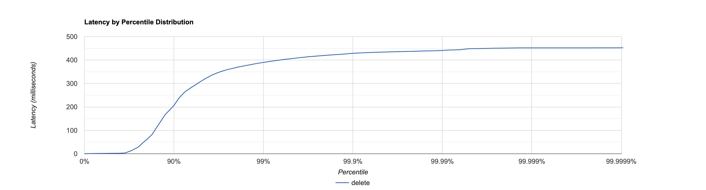
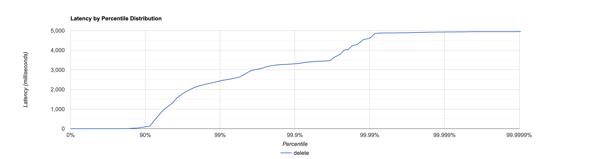
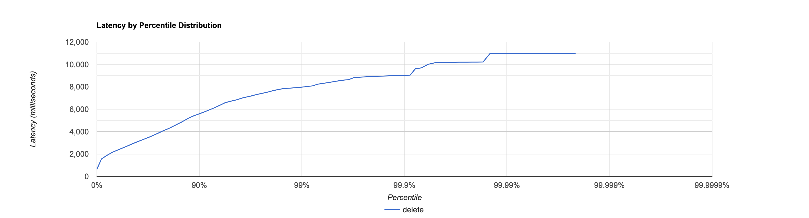

# Отчёт

Для начала засечём как работает система без шардирования.

Тестирование проводится при помощи скриптов [put](../HW2/scripts/put.lua) и [get](../HW2/scripts/get.lua),
при помощи команд:

* `wrk2 -t 8 -c 64 -d 30s -R 50000 -L http://localhost:19234 -s reports/HW2/scripts/put.lua`
* `wrk2 -t 8 -c 64 -d 30s -R 60000 -L http://localhost:19234 -s reports/HW2/scripts/get.lua`

Перед каждым get будем заполнять базу 5 put подряд

## Без Шардирования

### PUT

```
  Thread Stats   Avg      Stdev     Max   +/- Stdev
    Latency    48.31ms   98.15ms 452.10ms   86.11%
    Req/Sec     6.66k     1.48k   20.11k    82.51%
  Latency Distribution (HdrHistogram - Recorded Latency)
 50.000%    1.80ms
 75.000%   28.86ms
 90.000%  206.34ms
 99.000%  389.89ms
 99.900%  428.54ms
 99.990%  440.83ms
 99.999%  451.84ms
100.000%  452.35ms

#[Mean    =       48.313, StdDeviation   =       98.150]
#[Max     =      452.096, Total count    =       997971]
#[Buckets =           27, SubBuckets     =         2048]
----------------------------------------------------------
  1499017 requests in 30.00s, 95.78MB read
Requests/sec:  49967.28
Transfer/sec:      3.19MB
```



### GET

```
  Thread Stats   Avg      Stdev     Max   +/- Stdev
    Latency   129.22ms  470.98ms   4.95s    93.15%
    Req/Sec     6.57k     2.67k   14.58k    76.66%
  Latency Distribution (HdrHistogram - Recorded Latency)
 50.000%    1.37ms
 75.000%    2.05ms
 90.000%   97.28ms
 99.000%    2.44s 
 99.900%    3.31s 
 99.990%    4.62s 
 99.999%    4.93s 
100.000%    4.96s 

#[Mean    =      129.217, StdDeviation   =      470.975]
#[Max     =     4952.064, Total count    =       998409]
#[Buckets =           27, SubBuckets     =         2048]
----------------------------------------------------------
  1584743 requests in 30.00s, 111.07MB read
  Non-2xx or 3xx responses: 73192
Requests/sec:  52825.49
Transfer/sec:      3.70MB
```


## С шардированием

Для выбора шарда было решено использовать алгоритм `JumpHash`,
он прост в реализации, быстр и достаточно эффективен.

### PUT

```
  Thread Stats   Avg      Stdev     Max   +/- Stdev
    Latency     2.57s     4.41s   24.35s    86.93%
    Req/Sec     3.11k   779.35     4.61k    75.00%
  Latency Distribution (HdrHistogram - Recorded Latency)
 50.000%  349.44ms
 75.000%    3.49s 
 90.000%    8.80s 
 99.000%   22.09s 
 99.900%   24.13s 
 99.990%   24.31s 
 99.999%   24.35s 
100.000%   24.36s 

#[Mean    =     2572.807, StdDeviation   =     4412.217]
#[Max     =    24346.624, Total count    =       546685]
#[Buckets =           27, SubBuckets     =         2048]
----------------------------------------------------------
  749900 requests in 30.00s, 44.10MB read
  Socket errors: connect 0, read 0, write 0, timeout 433
Requests/sec:  24997.82
Transfer/sec:      1.47MB
```


### GET

```
  Thread Stats   Avg      Stdev     Max   +/- Stdev
    Latency     3.17s     1.61s   10.99s    74.67%
    Req/Sec     5.38k     1.19k    6.80k    69.09%
  Latency Distribution (HdrHistogram - Recorded Latency)
 50.000%    2.73s 
 75.000%    3.88s 
 90.000%    5.59s 
 99.000%    7.97s 
 99.900%    9.03s 
 99.990%   10.97s 
 99.999%   10.99s 
100.000%   10.99s 

  Detailed Percentile spectrum:
#[Mean    =     3169.441, StdDeviation   =     1614.325]
#[Max     =    10985.472, Total count    =       844781]
#[Buckets =           27, SubBuckets     =         2048]
----------------------------------------------------------
  1365508 requests in 30.00s, 93.65MB read
  Non-2xx or 3xx responses: 937640
Requests/sec:  45517.90
Transfer/sec:      3.12MB
```



## Распределение

После нескольких повторений операции put шарды оказались заполнены следующим образом

* `http://localhost:19234` - 999_417 записей
* `http://localhost:19235` - 1_007_155 записей
* `http://localhost:19236` - 989_783 записей

Достаточно впечатляющий результат.
Обосновать такие показатели (при стандартном хешировании) можно
1. Сами запросы были случайными
2. JumpHash помимо хеша использует random (не волнуйтесь, всё детерменировано), а потому даже близкие ключи могут с большой вероятностью оказаться на разных шардах.

## Показатели

Если распределение нас радует, то нельзя сказать, то же самое про показатели, которые заметно упали.

Самая главная причина - общение между шардами. Работа с сетью всегда была слабым местом нашей системы,
поэтому неудивительно, что общение через сеть негативно сказалось на работе нашей системы.

Если посмотреть на профилирование put запросов, то видно, что `Session.process` стало потреблять больше процессорного времени.
Это связанно в первую очередь с тем, что системе надо не только отвечать на запросы приходящие из вне, но и общаться между шардами.

Но если с put запросами снижение производительности не удивительно (бд собирает запросы в памяти, а потом выгружает на диск в бекграунде),
снижение производительности get запросов ~~стало ударом в спину~~ было достаточно неожиданным.

Первое что бросается в глаза возросший процент cpu `JavaSelector.select` что в целом не удивительно, учитывая, что было обговорено раньше.
Вторая проблема - большой процент `Logger.error`, проблема возникает в том, что шарды периодические не успевают отвечать
(сама проблема не критичная, так как шард не отключился, а значит перевес неудачных запросов над удачными меньше 100),
однако это показывает, что всё же проблема с падающими запросами есть.
Однако не стоит расстраиваться узким местом get запросов была именно работа с базой данных. Как видно из отчёта 
`MemorySegment.get` занимает всего 8 % в шардированном решении, по сравнению с 38 % в обычном,
это происходит благодаря 'размазыванию' базы данных по шардам, а как следствие ускорения работы с ней.

## Решения
1. Сделать что-то с put запросами. По-хорошему put должен помогать базе организовывать данные так, чтобы их в последствии было легко найти
2. Оптимизировать базу на get. Logger достаточно часто фиксировал ошибку, что свидетельствует о том, что шарды просто не справлялись с входящей на них нагрузкой. Если мы хотим в добавок к поиску по базе общаться по сети, нужна более оптимальная база на get (возможно в следующий раз будет взята другая).
3. Как видно из отчёта работа селекторов всё ещё один из бичей нашего проекта. К сожалению мы не можем отказаться от общения по сети (но это и не нужно). Чтобы увидеть улучшение, нам нужно тестировать на более загруженной системе (с большим количеством данных). Однако в масштабе локальной машины это сделать достаточно тяжело.
4. Убрать Logger. Очевидно что такое решение ускорит работу системы тем, что не будет выводов в консоль, что оказывает нагрузку на систему, однако не приведёт к желаемому результату - отлаженной высоко нагруженной системе.

## Circuit Breaker

Как уже было обговорено на занятии 'болеющая' нода может вызывать проблемы.
Для решения этой проблемы было решено обратиться к паттерну `Circuit Breaker`.
Основная идея такая - каждый неудачный запрос увеличивает наш счётчик, каждый удачный - уменьшает (не ниже 0).
Когда значение сравняется с `Constants.MAX_FAILS` шард начинает считать своего соседа недоступным и перестаёт слать на него запросы.
Таким образом, если шард b стал недоступен, потребуется пожертвовать `Constants.MAX_FAILS`, чтобы это определить.

Для бонусной реализации нужно после некоторого времени нужно постепенно увеличивать нагрузку на соседа, реализацию этого вы увидите уже когда можно будет делать бонус :-). 