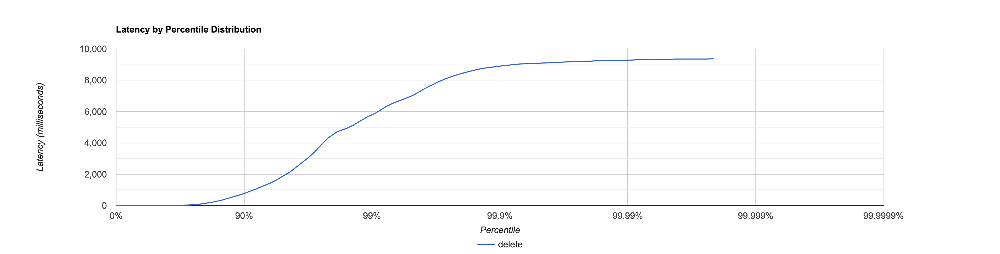
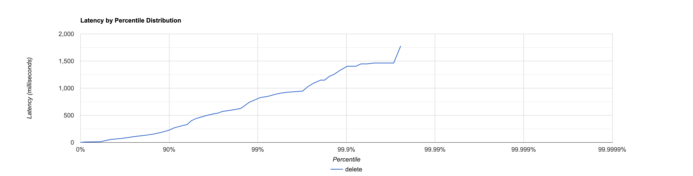

# Отчёт

В данном отчёте будут проверяться следующие вещи:

1. Скорость зависимость скорости от длины интервала.
2. Зависимость скорости работы от величины буфера.

Перед замерами **база предварительно заполняется** при помощи скрипта

```lua
id = 0
wrk.method = "PUT"
request = function()
    wrk.path = "/v0/entity?id=" .. math.random(0, 1000000)
    wrk.body = "№ " .. id
    id = id + 1
    return wrk.format(nil)
end
```

Будем проверять интервалы длины 50

```lua
wrk.method = "GET"
request = function()
    start = math.random(0, 1000000)
    wrk.path = "/v0/entities?start=" .. start .. "&end =" .. start + 50
    return wrk.format(nil)
end
```

и 1000

```lua
wrk.method = "GET"
request = function()
    start = math.random(0, 1000000)
    wrk.path = "/v0/entities?start=" .. start .. "&end =" .. start + 1000
    return wrk.format(nil)
end
```

# Размер буффера 1000

## Интервал длины 10

```
  Thread Stats   Avg      Stdev     Max   +/- Stdev
    Latency   319.91ms    1.03s    9.37s    93.43%
    Req/Sec   305.06    171.59     1.28k    73.68%
  Latency Distribution (HdrHistogram - Recorded Latency)
 50.000%    5.35ms
 75.000%   53.34ms
 90.000%  764.93ms
 99.000%    5.76s 
 99.900%    8.90s 
 99.990%    9.27s 
 99.999%    9.38s 
100.000%    9.38s 

#[Mean    =      319.910, StdDeviation   =     1032.360]
#[Max     =     9371.648, Total count    =        46753]
#[Buckets =           27, SubBuckets     =         2048]
----------------------------------------------------------
  71499 requests in 30.00s, 23.11MB read
  Socket errors: connect 0, read 0, write 0, timeout 40
  Non-2xx or 3xx responses: 8
Requests/sec:   2382.98
Transfer/sec:    788.70KB
```



## Интервал длины 1000

```
  Thread Stats   Avg      Stdev     Max   +/- Stdev
    Latency    93.99ms  154.79ms   1.78s    90.74%
    Req/Sec    24.63     18.26   126.00     68.22%
  Latency Distribution (HdrHistogram - Recorded Latency)
 50.000%   41.50ms
 75.000%  107.33ms
 90.000%  227.71ms
 99.000%  803.33ms
 99.900%    1.33s 
 99.990%    1.78s 
 99.999%    1.78s 
100.000%    1.78s 

#[Mean    =       93.987, StdDeviation   =      154.789]
#[Max     =     1776.640, Total count    =         3994]
#[Buckets =           27, SubBuckets     =         2048]
----------------------------------------------------------
  5992 requests in 30.05s, 63.67MB read
  Non-2xx or 3xx responses: 8
Requests/sec:    199.43
Transfer/sec:      2.12MB
```



# Выводы:

В начале планировалось провести 2 тестирования. Одно на буффере размера 1000,
другое на буффере размера 5000-10000, однако результаты профилирования [cpu при интервале 10](profile/get10/cpu.html)
и [cpu при интервале 1000](profile/get1000/cpu.html), а также результаты запуска, меня очень удивили и я бы хотел вместе
с вами в них разобраться.

И так, давайте посмотрим, что же удивительно в этих замерах.

1. Результаты для интервала 10 всего лишь в 10 раз хуже результатов для 1000
2. Ни в одном из профайлингов cpu HttpClient никакой значимой роли не играет, а вот работа с базой как раз таки важный
   компонент
3. В профилировании cpu для интервала 1000 главную роль играет отнюдь не база данных, а их последующая
   обработка `UtilsClass.segmentToValue`

Попробуем всё обосновать:

## Результаты для интервала 10 всего лишь в 10 раз хуже результатов для 1000

Базы данных хороши в обработке большого количества информации.
Действительно, предположим, что наши данные хранятся в файлах,
при этом для любого ключа вероятность попасть в любой из файлов - одинакова (мы генерим ключи равновероятно).
В таком случае, когда мы берём интервал 10, плотность ключей на файл - маленькая, когда же мы процессим интервал длины
1000, плотность ключей увеличивается.

Рассмотрим пример: у нас есть 100 файлов. При процессинге 10 ключей матожидание ключа в файле всего 0.1,
и в среднем придётся обойти 10 файлов, чтобы найти хотя бы 1. Когда мы обрабатываем интервал длины 1000,
то в среднем в каждом файле мы найдём в среднем 10 ключей.

В этом может быть главная причина таких результатов.

## Ни в одном из профайлингов cpu HttpClient никакой значимой роли не играет, а вот работа с базой как раз таки важный компонент

Как было обговорено раннее, get в нашей базе достаточно долгая операция, сейчас же мы заставили его поработать во всей
красе.
Поэтому нет ничего удивительного, что `MemorySegmentDao.get` съедает 77.1 % cpu в случае интервала размера 10 и 11.8 % в
случае интервала 1000, он это заслужил :-).

## В профилировании cpu для интервала 1000 главную роль играет отнюдь не база данных, а их последующая обработка `UtilsClass.segmentToValue`

Объясняется это отчасти пунктом 1 (при увеличении количества запрашиваемых данных время их поиска растёт отнюдь не
линейно).
Однако время на обработку данных увеличивается как раз линейно (нам нужно обработать каждый элемент), поэтому при
дальнейшем увеличении запроса,
время поиска будет меняться всё меньше и меньше, а время на обработку будет расти также как и росло.

# Оптимизации и предложения.

1. Как было выяснено обрабатывать малое количество данных - почти ничего не стоит, однако их поиск - занимает большое
   количество времени.
   Обратная сторона с большим количеством данных. Однако стоит заметить, что большое количество данных нам нужно в
   достаточно специфичных ситуациях,
   поэтому, чтобы не обрабатывать данные, можно их автоматически хранить в готовом виде, тем самым сэкономив уйму
   времени.
   Что же касается малого количества данных, то их как раз таки можно и обработать, поэтому не будет ничего страшного в
   случае, если мы сохраним данные по 'специфичному', в любом случае, при доставании обработаем.
2. Заметим, что скорее всего пользователям не будут нужны все данные сразу же, они их будут поедать по чуть-чуть,
   поэтому имеет смысл при взятии большого куска данных сохранить его в быстрой памяти (условный ignite), а выдавать и
   обрабатывать уже по чуть-чуть.
3. Во время того, как мы проставиваем, имеет смысл упорядочивать данные, чтобы при запросе на интервал не искать по всем
   файлам,
   а почти за O(1) найти откуда и до куда нужно читать, что позволит нам очень хорошо сэкономить
   на `MemorySegmentDao.get`.