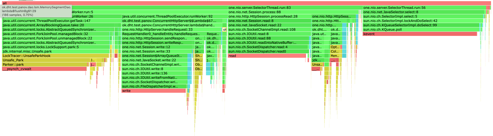
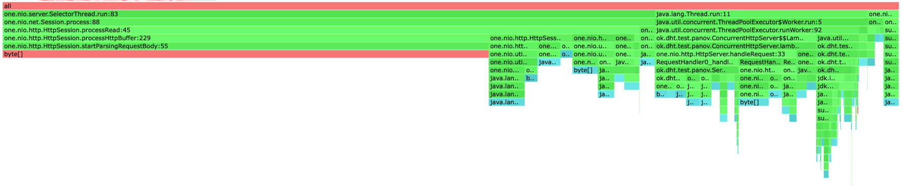
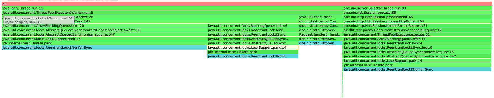
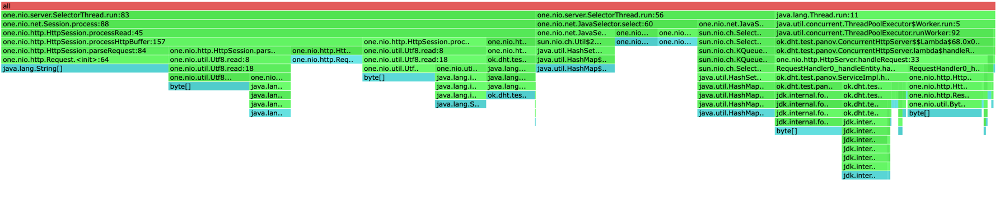
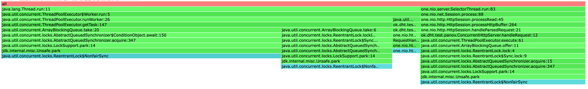

# Stage 1

## PUT

Проведем нагрузочное тестирование:

`wrk2 -d 1m -t 8 -c 32 -R 10000 -s PutStableLoad.lua "http://localhost:19234"`

```
Running 1m test @ http://localhost:19234
  Thread Stats   Avg      Stdev     Max   +/- Stdev
    Latency     0.93ms  410.71us   9.14ms   65.16%
    Req/Sec     1.33k    95.85     1.90k    60.01%
  599913 requests in 1.00m, 38.33MB read
Requests/sec:   9998.87
Transfer/sec:    654.22KB
```

По сравнению с однопоточны сервером, Latency уменьшилаль с 30ms до ~1ms

Попробуем увеличть рейт

` wrk2 -d 1m -t 8 -c 32 -R 100000 -s PutStableLoad.lua "http://localhost:19234"`

```
Running 1m test @ http://localhost:19234
  8 threads and 32 connections
  Thread Stats   Avg      Stdev     Max   +/- Stdev
    Latency    10.11s     4.32s   18.15s    58.43%
    Req/Sec     8.72k   294.50     9.07k    55.56%
  4185183 requests in 1.00m, 267.42MB read
Requests/sec:  69756.56
Transfer/sec:      4.46MB
```

Многопоточный сервер не справляется с такой нагрузкой, но количество запросов и задержка улучшили показатели
по сравнению с однопоточной реализацией. Latency уменьшалась почти в 3 раза, а количество обрабатываемых запросов увеличилось в 7 раз.

Проведем профилирование


Сразу видно что время, которое тратилось селектором, умешилось из-за вычисления задач в отдельном пуле, но так же 
большая часть времени (около 20%) тратится на блокировки для работы с очередью.


Картина выглядит анлогично однопоточному серверу, значительных изменений нет. Это понятно, так как мы увеличили количество потоков, которые просто делают те 
же самые алокации.


По профили видно, что 70% процентов локов тратится на операции с пулом, а остальныые 
30% на добавление задач в очередь.

## GET

Проведем нагрузочное тестирование:

`wrk2 -d 1m -t 8 -c 32 -R 5000 -s GetStableLoad.lua "http://localhost:19234"`

```
Running 1m test @ http://localhost:19234
  8 threads and 32 connections
  Thread Stats   Avg      Stdev     Max   +/- Stdev
    Latency     c  475.96us   5.34ms   65.38%
    Req/Sec   657.48     93.49     0.89k    65.24%
  299960 requests in 1.00m, 361.87MB read
Requests/sec:   4999.47
Transfer/sec:      6.03MB
```

По сравнению с однопоточны сервером, Latency уменьшилаль с 1.80ms до 0.93ms.

Повысим RPS

` wrk2 -d 1m -t 8 -c 32 -R 10000 -s GetStableLoad.lua "http://localhost:19234"`

```
 8 threads and 32 connections
  Thread Stats   Avg      Stdev     Max   +/- Stdev
    Latency     0.96ms  408.03us   5.90ms   64.40%
    Req/Sec     1.33k    94.81     1.89k    59.69%
  599918 requests in 1.00m, 723.74MB read
Requests/sec:   9998.87
Transfer/sec:     12.06MB
```

Раньше на 10000 сервер захлебывался, чего не происходит сейчас.

Проведем профилирование


По профилю видно, что большАя доля (~20) CPU теперь тратится на локи. В целом,
выводы верные для PUT запросов верны и тут.


Картина почти не поменялась, за исключением аллокаций связаных с базой, которе теперь происходят в тред пуле.
И дополнительных алокаций на использование самого пула.


Результаты get и put практически совпадают по профилю, это логично, так как
принцип обработки этих запросов одинаковый.


