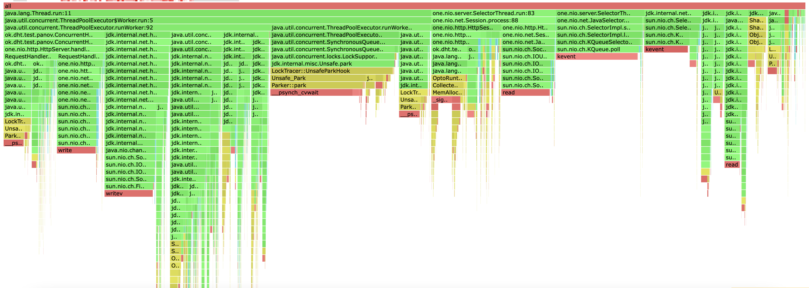
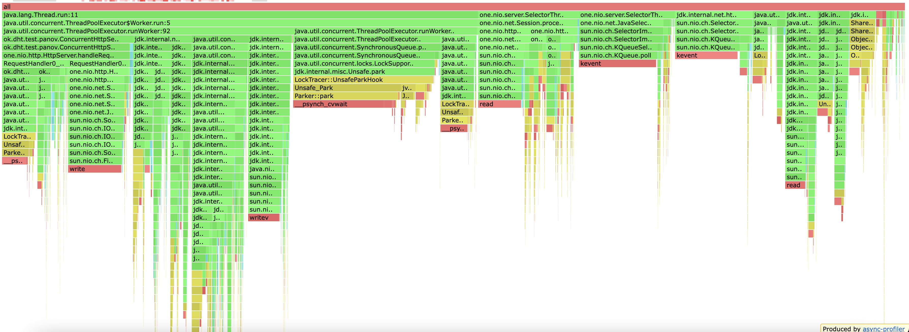

# Stage 3

Все профилирование будет проводится с тремя нодами, а строиться профили для ноды, на которую посылаются запросы. 
Конфигурация запросов будет аналогична конфигурации прошлого этапа для честного сравнения изменений.

## PUT

Проведем нагрузочное тестирование:

```
wrk2 -d 1m -t 8 -c 32 -R 10000 -s PutStableLoad.lua "http://localhost:19234"
```

```
Running 1m test @ http://localhost:19234
Thread Stats   Avg      Stdev     Max   +/- Stdev
    Latency     1.24ms    1.57ms  37.70ms   98.48%
    Req/Sec     1.25k     2.25     1.27k    98.26%
  599800 requests in 1.00m, 36.01MB read
Requests/sec:   9997.12
Transfer/sec:    614.57KB
```

На 10000 запросах, сервер отрабатывает стабильно как и без шардирования.
Скорее всего это происходит из-за запуска всех нод на одной машине, конкуренцией за процессорное время и т. д.

```
i.panov@macbook-i stage_1 % du -sh /var/folders/0y/h0j9xdp567j7f7y_f9jf08qm0000gp/T/server3531925502667129736 
 44M    /var/folders/0y/h0j9xdp567j7f7y_f9jf08qm0000gp/T/server3531925502667129736
i.panov@macbook-i stage_1 % du -sh /var/folders/0y/h0j9xdp567j7f7y_f9jf08qm0000gp/T/server12492733374320666327
 16M    /var/folders/0y/h0j9xdp567j7f7y_f9jf08qm0000gp/T/server12492733374320666327
i.panov@macbook-i stage_1 % du -sh /var/folders/0y/h0j9xdp567j7f7y_f9jf08qm0000gp/T/server6025840628954999856 
 32M    /var/folders/0y/h0j9xdp567j7f7y_f9jf08qm0000gp/T/server6025840628954999856
```

Если посмотреть на распределение данных по нодам, может показаться что нагрузка распределяется 
не равномерно, но при повторном запуске скрипта видно, что распределение ключей становится 
более равномерным. Для распределения ключей использовался алгоритм консистентного хэширования.
Ключи для PUT запросов генерируются псевдорандомно в заданом диапазоне.
Для хеширования исполльзовался murmur хэш. Думаю можно использовать более сложные криптографичекие хэшкоды,
но придется немного пожетвовать производительностью. 

```
i.panov@macbook-i stage_1 % du -sh /var/folders/0y/h0j9xdp567j7f7y_f9jf08qm0000gp/T/server3531925502667129736 
 69M    /var/folders/0y/h0j9xdp567j7f7y_f9jf08qm0000gp/T/server3531925502667129736
i.panov@macbook-i stage_1 % du -sh /var/folders/0y/h0j9xdp567j7f7y_f9jf08qm0000gp/T/server12492733374320666327
 48M    /var/folders/0y/h0j9xdp567j7f7y_f9jf08qm0000gp/T/server12492733374320666327
i.panov@macbook-i stage_1 % du -sh /var/folders/0y/h0j9xdp567j7f7y_f9jf08qm0000gp/T/server6025840628954999856 
 67M    /var/folders/0y/h0j9xdp567j7f7y_f9jf08qm0000gp/T/server6025840628954999856
```

Проведем профилирование


Не сложно заметить, что в новой версии приложения много времени (около 23%) тратится на проксировани
запросов на другие ноды, и работы с CompletableFuture, что кажется логичным.  


Видно, что огромное количество алокаций теперь тратится на проксирование запросов на другие ноды.


Картина по блокировкам изменилась координально, теперь бОльшая чать блокировок приходится именно на проксирование запросов,
по сравнению с этим блокировки на многопоточную работу занимают крошечную долю от всех.


## GET

Проведем нагрузочное тестирование:

```
wrk2 -d 1m -t 8 -c 32 -R 10000 -s GetStableLoad.lua "http://localhost:19234"
```

```
Running 1m test @ http://localhost:19234
  8 threads and 32 connections
  Thread Stats   Avg      Stdev     Max   +/- Stdev
    Latency     1.04ms  454.33us   3.34ms   65.20%
    Req/Sec     1.32k    99.00     1.78k    58.73%
  599796 requests in 1.00m, 722.72MB read
Requests/sec:   9997.59
Transfer/sec:     12.05MB
```

Проведем профилирование




Картина профилирования GET запросов аналогична PUT.

##Выводы
* По профилю видно, что много ресурсов тратится на проксирование запросов на другие ноды и работу с сетью, так как 
теперь в худшем случае создается два HTTP запроса на один реквест.
Оптимизацией может послужить изменение протокола взаимодействия: другой протокол сетевого взаимодействия или 
работа с брокерами сообщений и асинхронная обработка этих сообщений. 
* Для более равномерного распределения можно тюнить хэшфункцию для ключей.
