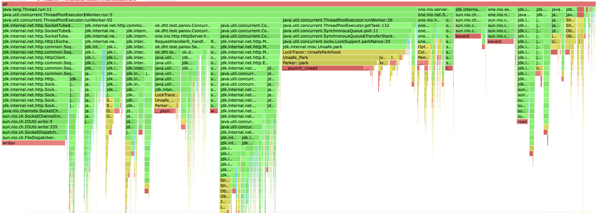
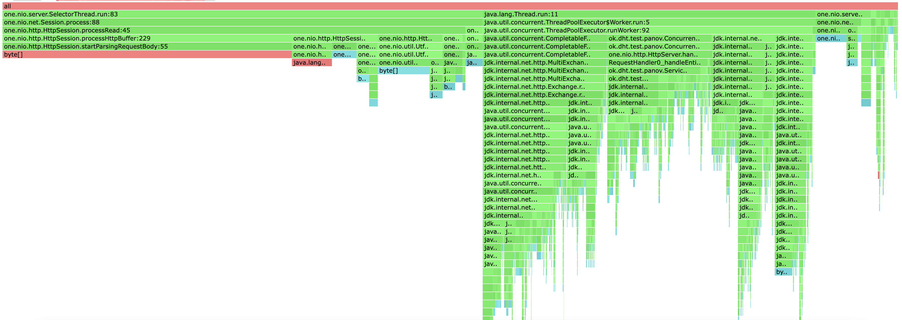
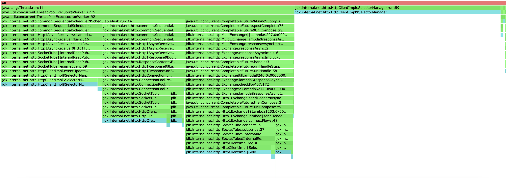
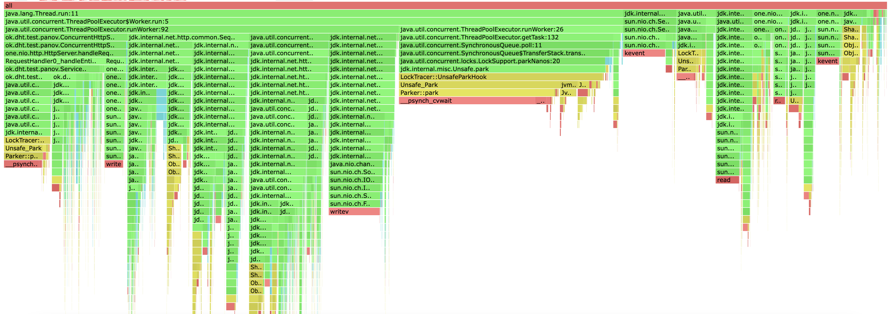
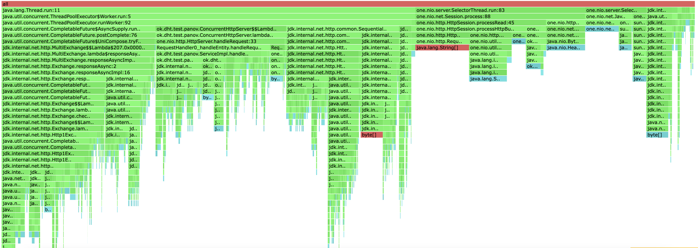
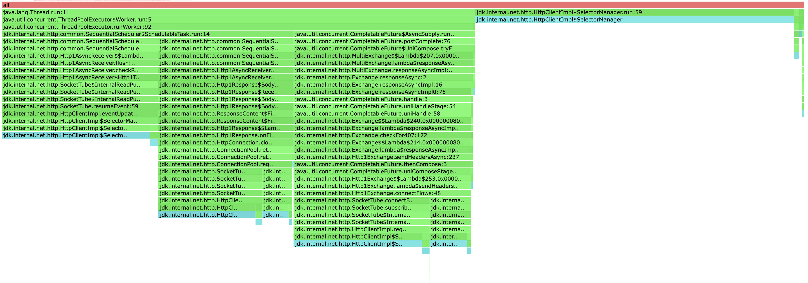

# Stage 4

Все профилирование будет проводится с тремя нодами, а строиться профили для ноды, на которую посылаются запросы. 
Конфигурация запросов будет аналогична конфигурации прошлого этапа для честного сравнения изменений.

Для нагрузочного тестирования и профилирования будет использоваться правило кворума для достижения репликации.

## PUT

Проведем нагрузочное тестирование:

```
wrk2 -d 1m -t 8 -c 32 -R 10000 -s PutStableLoad.lua "http://localhost:19234"
```

```
Running 1m test @ http://localhost:19234
  8 threads and 32 connections
  Thread Stats   Avg      Stdev     Max   +/- Stdev
    Latency    12.79s     2.00s   15.52s    69.50%
    Req/Sec     0.99k   169.04     1.14k    75.00%
  444820 requests in 1.00m, 25.62MB read
Requests/sec:   7413.74
Transfer/sec:    437.19KB

```

На 10000 запросах, сервер захлебывается попробуем подобрать такой рейт, чтобы сервер справлялся с нагрузкой.

```
wrk2 -d 1m -t 8 -c 32 -R 8000 -s PutStableLoad.lua "http://localhost:19234"
```

```
Running 1m test @ http://localhost:19234
  8 threads and 32 connections
  Thread Stats   Avg      Stdev     Max   +/- Stdev
    Latency    50.06ms  104.37ms 473.34ms   85.13%
    Req/Sec     0.88k    61.89     1.13k    85.66%
  419785 requests in 1.00m, 24.18MB read
Requests/sec:   6996.71
Transfer/sec:    412.65KB

```

На 8000 сервер практически справляется с нагрузкой, но видно что latency до сих пор держится на высоком уровне. 
Немного еще уменьшим RPS для более стабильной нагрузки.

```
wrk2 -d 1m -t 8 -c 32 -R 5000 -s PutStableLoad.lua "http://localhost:19234"
```

```
Running 1m test @ http://localhost:19234
  8 threads and 32 connections
  Thread Stats   Avg      Stdev     Max   +/- Stdev
    Latency     2.16ms    5.22ms  80.19ms   98.25%
    Req/Sec   626.61     20.21     0.90k    97.36%
  299868 requests in 1.00m, 17.27MB read
Requests/sec:   4997.87
Transfer/sec:    294.75KB
```

На 5000 запросах сервер стабильно отрабатывает.
Логично что так сильно упал RPS, так как теперь на каждый запрос создается еще три (при моей конфигурации сервера).
И каждый запрос нужно отправить и дождать, что создает большие расходы для приложения.

Проведем профилирование


Если сравнить профили до добавления репликации и после, то сразу видно, что каких-то 
глобальных изменений не произошло. Несколько выросла доля времени, которая тратися на взаимодействиия с нодами 
из-за дополнительных запросов на репликацию. Поле оптимизайций остается тем же что и для прошлого этапа. Поскольку
до сих пор самой большой проблемой является взимодействие можду нодами, то это место и нужно оптимизировать сменой протокола и
методом общения нод друг с другом.


Профили аллокаций так-же совпадают с предыдущим этапом в процентном соотношении, само количество аллокаций выросло, 
так как каждый запрос приходится проксировать на несколько нод, что вызвает затраты на выделения памяти для запроса, ответа, их парсинга и так далее.
По профилю плохо видно, но можно заметить что и база начала тратить больше памяти, это связано с сохранением для каждого
значения в базе его timestamp'а.


По большому счету локи не поменялить по сравнению с прошлым этапом. Немного увеличилась доля 
локов HTTP сервера, так и должно быть, поскольку мы только увеличили количество запросов на каждый сервер
но сама логика осталась прежней.

## GET

Проведем нагрузочное тестирование:

```
wrk2 -d 1m -t 8 -c 32 -R 10000 -s GetStableLoad.lua "http://localhost:19234"
```

```
Running 1m test @ http://localhost:19234
  8 threads and 32 connections
  Thread Stats   Avg      Stdev     Max   +/- Stdev
    Latency     3.33s     1.65s    6.74s    69.98%
    Req/Sec     1.12k    98.61     1.25k    54.72%
  533099 requests in 1.00m, 648.18MB read
  Non-2xx or 3xx responses: 5042
Requests/sec:   8885.31
Transfer/sec:     10.80MB
```

На 10000 сервер захлебывается, попробуем найти меньший RPS, с которым сервер будет справляться.

```
wrk2 -d 1m -t 8 -c 32 -R 5000 -s GetStableLoad.lua "http://localhost:19234"
```

```
Running 1m test @ http://localhost:19234
  8 threads and 32 connections
  Thread Stats   Avg      Stdev     Max   +/- Stdev
    Latency     1.30ms  458.63us   6.70ms   67.09%
    Req/Sec   627.86      8.52   652.00     75.43%
  299868 requests in 1.00m, 367.92MB read
Requests/sec:   4997.84
Transfer/sec:      6.13MB
```

На 5000 запросах сервер справляется, RPS упал по тем же причинам, что и для PUT запросов, и это имеет смысл, так
как с точки зрения программы внетренняя логика обработки почти не изменилась.

Проведем профилирование





Картина профилирования GET запросов аналогична PUT.
Все выводы валидны и в этом случае.


##Детали реализации

###Выбор нод для реплик
Поскольку реплики должны вибираться детемринировано, я немного изменил подход роутера, которыы раньше 
определял на какой шард отправить запрос. Я по прежнему выбираю ноду при помощи
консистеного хеширования, а нодами для реплик беру `k` следующих нод по кругу. Таким образом
получается детерминированный алогритм, который равномерно распределяет данные по нодам.

###Сохранение данных и разрешение вопроса актуальности
Теперь вместе с каждой записью в базу сохраняется его `timestamp`, чтобы определять какие данные были записаны последними.
Помимо этого, для данные которые были удалены тоже приходится хранить `timestamp`,
иначе не возможно выяснить было удалено значени или его никогда не существовало.
Понятно, что это решение не является идеальным, мы не решаем проблему консистентности данных, до сих пор может возникнуть
ситуация, когда значение пишется на все ноды, но произошла проблема с сетью, и значение оказалось не на всех нодах.
При этом следующий запрос может спокойно вычитать значение из базы, хотя после фейла на запись, мы сообщили пользователю, что 
значение не было записано. 

##Выводы
* По профилю видно, что много ресурсов тратится на проксирование запросов на другие ноды и работу с сетью, так как 
теперь в худшем случае создается два HTTP запроса на один реквест.
Оптимизацией может послужить изменение протокола взаимодействия: другой протокол сетевого взаимодействия или 
работа с брокерами сообщений и асинхронная обработка этих сообщений. 
