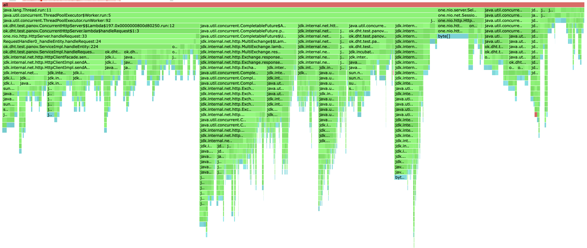

# Stage 5

Все профилирование будет проводится с тремя нодами, а строиться профили для ноды, на которую посылаются запросы. 
Конфигурация запросов будет аналогична конфигурации прошлого этапа для честного сравнения изменений.

Для нагрузочного тестирования и профилирования будет использоваться правило кворума для достижения репликации.

## PUT

Проведем нагрузочное тестирование:

```
wrk2 -d 60s -t 8 -c 32 -R 5000 -s PutStableLoad.lua "http://localhost:19234"
```

```
Running 1m test @ http://localhost:19234
  8 threads and 32 connections
  Thread Stats   Avg      Stdev     Max   +/- Stdev
    Latency     7.48s     3.12s   12.10s    53.43%
    Req/Sec     3.98k   220.29     4.42k    66.67%
  239414 requests in 1.00m, 13.47MB read
Requests/sec:   3990.98
Transfer/sec:    229.95KB


```

На 5000 запросах, сервер захлебывается попробуем подобрать такой рейт, чтобы сервер справлялся с нагрузкой.

```
wrk2 -d 1m -t 8 -c 32 -R 2500 -s PutStableLoad.lua "http://localhost:19234"
```

```
Running 1m test @ http://localhost:19234
  8 threads and 32 connections
  Thread Stats   Avg      Stdev     Max   +/- Stdev
    Latency     6.11ms   28.30ms 287.74ms   96.61%
    Req/Sec     2.64k   397.44     5.44k    91.34%
  149974 requests in 1.00m, 8.44MB read
Requests/sec:   2499.95
Transfer/sec:    144.04KB
```

На 2500 запросах сервер стабильно отрабатывает.

Довольно странное поведение, что при избавлении от лишних блокировок и написании асинхронного кода, упала производительность.
Если посмотреть на профиль можно заметить большое количество `park`'ов, из этого можно сделать вывод, что падение производительности
произошло по причине нехватки локальных ресурсов компьютера, а конкретнее физических тредов. Поэтому из-за большого количества 
выполненяющихся асинхронно задач приходится заниматься контекст свитчингом и парковать треды.


Проведем профилирование


Если сравнить профили до добавления асинхронного взаимодействия и после, то на первый взгляд они очень похожи.
Можно заметить, что часть изменений перенеслась в тред пул, что логично по причине асинхронного выполнения запросов.
В остальном изменений нет.


Сразу бросается в глаза, что доля алокаций селектора, значительно упала. Это связано с тем, что раньше сервер не успевал
обрабатывать все запросы, которые были заселекчены, а теперь успевает и доля уменьшилась из-за увелечения алокаций в других
частях базы. Еще можно заметить, что появилось достаточно много алокаций связаных с ассинхронным выполнением задач в 
`executor service`.


Можно заметить, что количество блокировок стало в разы меньше, что совсем неувидительно. Поскольку взаимодействие узлов
теперь устроено асинхронным образом, нам не приходится ждать ответа каждой ноды. Теперь каждый запрос по завершению проверяет 
готовность ответа на запрос к серверу.

## GET

Проведем нагрузочное тестирование:

```
wrk2 -d 1m -t 8 -c 32 -R 2000 -s GetStableLoad.lua "http://localhost:19234"
```

```
Running 1m test @ http://localhost:19234
  8 threads and 32 connections
  Thread Stats   Avg      Stdev     Max   +/- Stdev
    Latency    87.80ms  181.92ms 913.41ms   86.35%
    Req/Sec     1.99k   196.17     2.74k    80.00%
  119849 requests in 1.00m, 1.35GB read
Requests/sec:   1997.51
Transfer/sec:     23.03MB
```

На 2000 сервер справляется, но Latency слишком большая, попробуем найти меньший RPS, с которым сервер будет справляться.

```
wrk2 -d 1m -t 8 -c 32 -R 1700 -s GetStableLoad.lua "http://localhost:19234"
```

```
Running 1m test @ http://localhost:19234
  8 threads and 32 connections
  Thread Stats   Avg      Stdev     Max   +/- Stdev
    Latency     6.99ms    6.09ms  96.99ms   95.54%
    Req/Sec     834.52    23.37     1.05k    88.87%
  100621 requests in 1.00m, 1.13GB read
Requests/sec:   1677.35
Transfer/sec:     19.33MB

```

На 1700 запросах сервер справляется, RPS упал по тем же причинам, что и для PUT запросов, и это имеет смысл, так
как с точки зрения программы внетренняя логика обработки почти не изменилась.

Проведем профилирование


Картина профилирования GET запросов аналогична PUT.
Все выводы валидны и в этом случае.


##Детали реализации

Для асинхронного взаимодействия узлов используется клиент `java.net.http.HttpClient`. При отправке на другую ноду
запроса возвращается `CompletableFuture`, которая не ожидат своего выполнения и не блокирует поток. На эту фьючу навешивается
действия по завершению работы. По завершению каждый запрос инрементирует счетчик выполненых запросов, и если это число 
достигло количества трубемых для ответа, то посылается ответ. Остальные же фьючи закончат свое выполнение и не будет влиять
на итоговый результат.

##Выводы
* Может показаться, что мы не добились улучшения проихводительности с новой оптимизайцией, но если посмотреть на профили 
можно понять, что количество блокировок уменьшилось и мы добились, того чего хотели. Для тестирования реальной производительности
нужным более мощные машины с большим количеством тредов, которыми я не распологаю.
