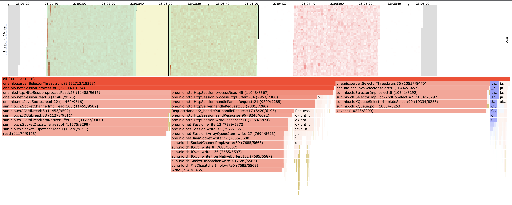
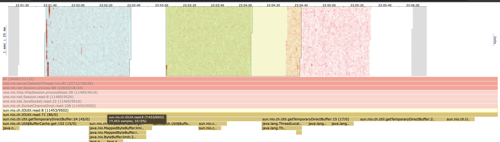

# Результаты нагрузочного тестирования 
## PUT запросы
* Было проведено 3 одинаковых теста с помощью wrk2 put запросами на стабильной нагрузке в одно соединение с rate-ом 20000. Каждый тест проводился в течение 60 секунд
* Во время теста последовательно клались разные пары id:value, для этого был написан [скрипт для wrk](./wrk/put/put_script.lua)
* Снятие сэмплов профилирощиком производилось с частотой 1 раз в 500 микро секунд (-i 500us)

### Гистограмма задержек с wrk

Из гистограммы персентилей для задержек видно, что нагрузка была стабильной. 99% задержек не превышали 2 мс, а 90% и вовсе были около 1 мс. 

Также из [вывода wrk](./wrk/put/wrk_put.txt) можно узнать 2 не менее важных показателя. Средняя задержка составила 744 микросекунды, максимальная была 5 миллисекунд. Из гистограммы видим, что доля больших задержек несущественна, да и 5 миллисекунд задержка не критичная на данном этапе.

### Результаты с профилировщика (flamegraph)

При втором запуске задержка была меньше. На хитмапе при сравнении двух тестов хорошо видно, почему так произошло. 

Одной из причин было то, что временные буффера и память необходимая при чтении и записи уже были выделены jvm:

---

## GET запросы
* Было проведено 2 одинаковых теста с помощью wrk2 get запросами по наполненной на 2.4 гб базе. На стабильной нагрузке с rate-ом 150. Каждый тест проводился в течение 60 секунд.
* Во время теста запрос пытался достать entry по какому-то ключу, для этого был написан [скрипт для wrk](./wrk/get/get_script.lua)
* Снятие сэмплов профилировщиком производилось с частотой 1 раз в 500 микро секунд (-i 500us)

## Гистограмма задержек с wrk

Из гистограммы персентилей для задержек видно, что нагрузка была стабильной. 99% задержек были меньше 10 мс.

Также из [вывода wrk](./wrk/get/wrk_get.txt) можно узнать 2 не менее важных показателя. Средняя задержка составила 6.95 миллисекунд, максимальная была 16.25 миллисекунд.

Задержка достаточно большая и при большем rate база начинает захлебываться (нагрузка становится не стабильной), что не есть хорошо.

### Результаты с профилировщика (flamegraph)

Результаты обеих тестов схожи.