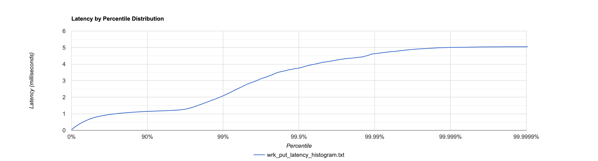
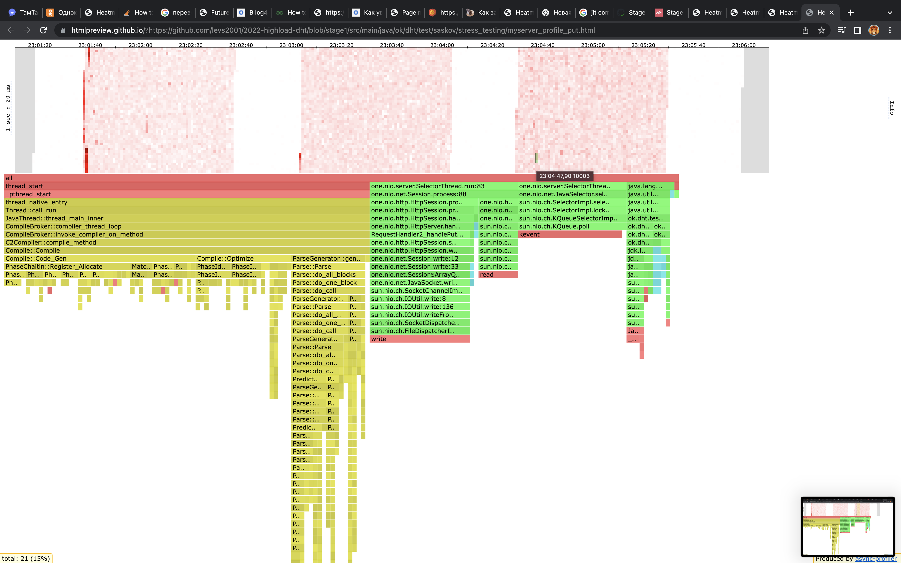
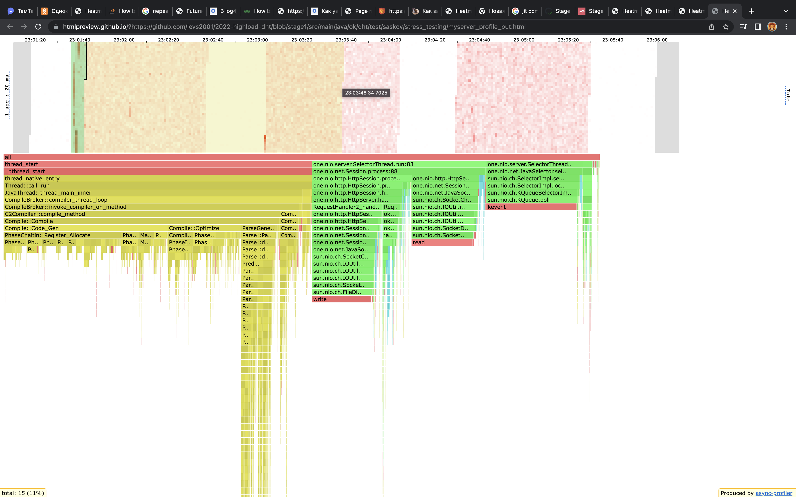
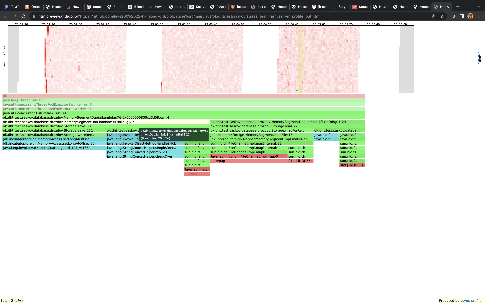
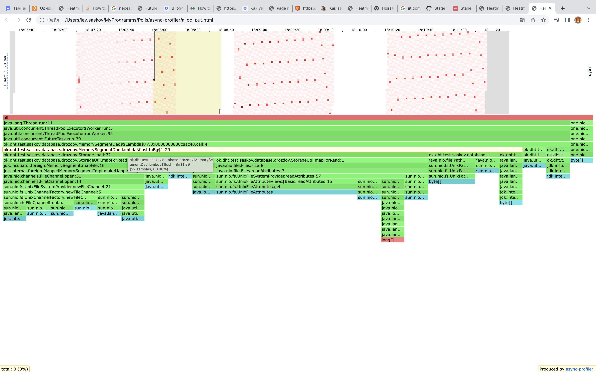
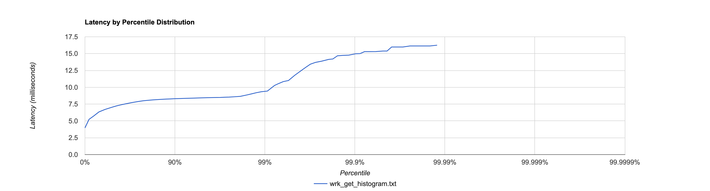
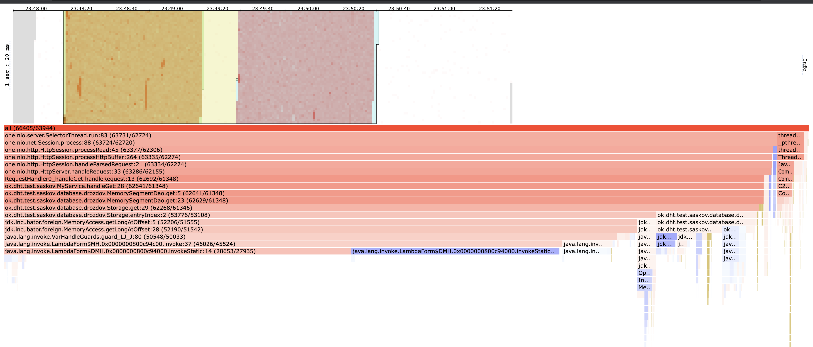
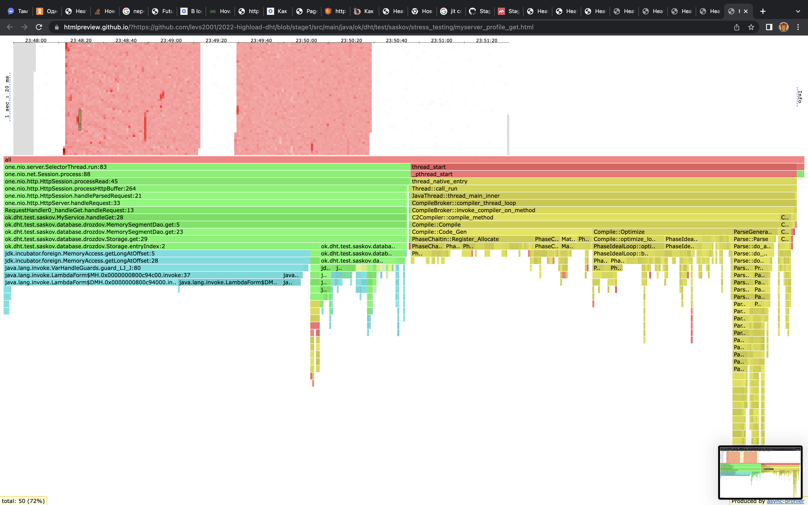
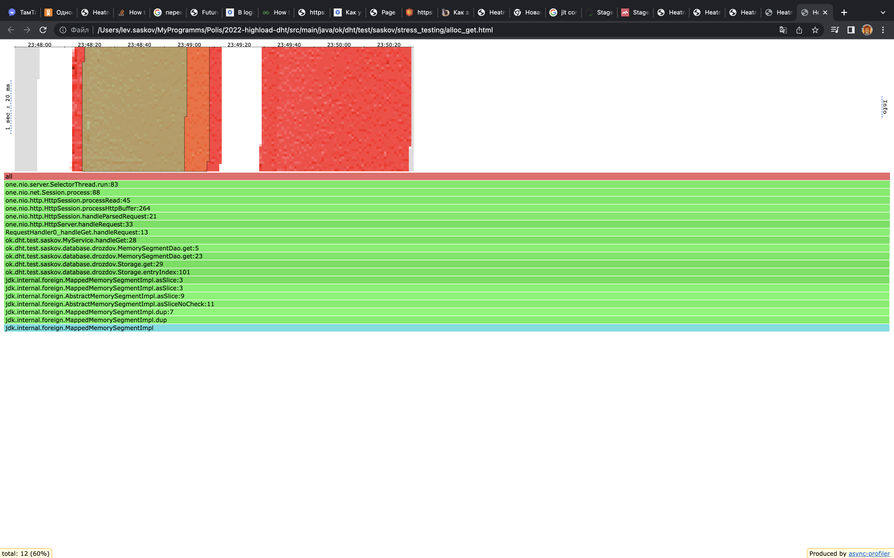

# Результаты нагрузочного тестирования 
## PUT запросы
* Было проведено 3 одинаковых теста с помощью wrk2 put запросами на стабильной нагрузке в одно соединение с rate-ом 20000. Каждый тест проводился в течение 60 секунд
* Во время теста последовательно клались разные пары id:value, для этого был написан [скрипт для wrk](./wrk/put/put_script.lua)
* Снятие сэмплов профилирощиком производилось с частотой 1 раз в 500 микро секунд (-i 500us)

### Гистограмма задержек с wrk

Из гистограммы персентилей для задержек видно, что нагрузка была стабильной. 99% задержек не превышали 2 мс, а 90% и вовсе были около 1 мс. 

Также из [вывода wrk](./wrk/put/wrk_put.txt) можно узнать 2 не менее важных показателя. Средняя задержка составила 744 микросекунды, максимальная была 5 миллисекунд. Посмотрим с помощью профилировщика чем была вызвана максимальная задержка.

### Результаты с профилировщика (flamegraph)
**CPU**

Видим, что часть времени тратится на JIT компиляцию, именно это вызывает максимальную задержку.

Процесс JIT компиляции при первом запуске наиболее ярко выраженный (мы еще не входили в большинство методов, JIT-у нужно время, чтобы их скомпилировать):

Также какое-то количество времени тратится на flush, это тоже вносит увеличение задержки:

**Alloc**

На графике для Аллоков хорошо видны моменты флашей (красные кубики). Также можно обратить внимание, что к концу каждого теста эти кубики постепенно сближаются, это связано с тем, что размер entry, которое я кладу увеличивается (в скрипте счетчик), соответственно флашить приходится чаще. 

---

## GET запросы
* Было проведено 2 одинаковых теста с помощью wrk2 get запросами по наполненной на 2.4 гб базе. На стабильной нагрузке с rate-ом 150. Каждый тест проводился в течение 60 секунд.
* Во время теста запрос пытался достать entry по какому-то ключу, для этого был написан [скрипт для wrk](./wrk/get/get_script.lua)
* Снятие сэмплов профилировщиком производилось с частотой 1 раз в 500 микро секунд (-i 500us)

## Гистограмма задержек с wrk

Из гистограммы персентилей для задержек видно, что нагрузка была стабильной. 99% задержек были меньше 10 мс.

Также из [вывода wrk](./wrk/get/wrk_get.txt) можно узнать 2 не менее важных показателя. Средняя задержка составила 6.95 миллисекунд, максимальная была 16.25 миллисекунд.

Задержка достаточно большая и при большем rate база начинает захлебываться (нагрузка становится не стабильной), что не есть хорошо.

### Результаты с профилировщика (flamegraph)
**CPU**

Видно, что очень много ресурсов уходит на работу селекторов, именно в них мы упираемся на данном этапе. Главная идея по улучшению заставить их делать свою работу сопоставлять сокеты результатам, а не ждать этих результатов, то есть они должны перестать ждать, когда закончится put, get и тп.

Скорее всего, рост задержки больше чем в 2 раза связан с jit компиляцией и работой jit-а над оптимизацией:

**Alloc**

Результаты обеих тестов схожи.