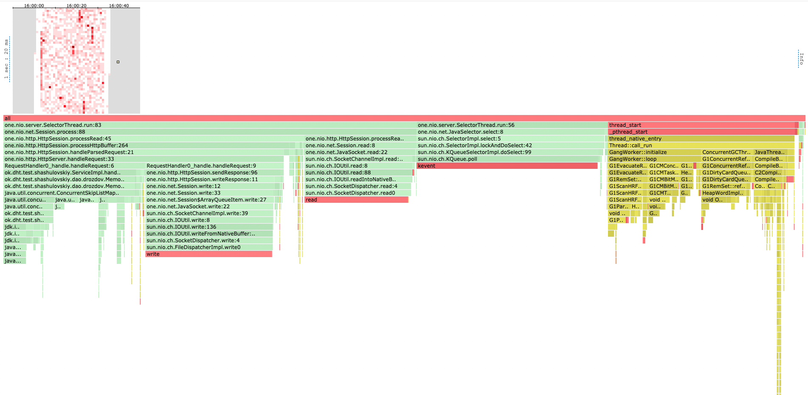
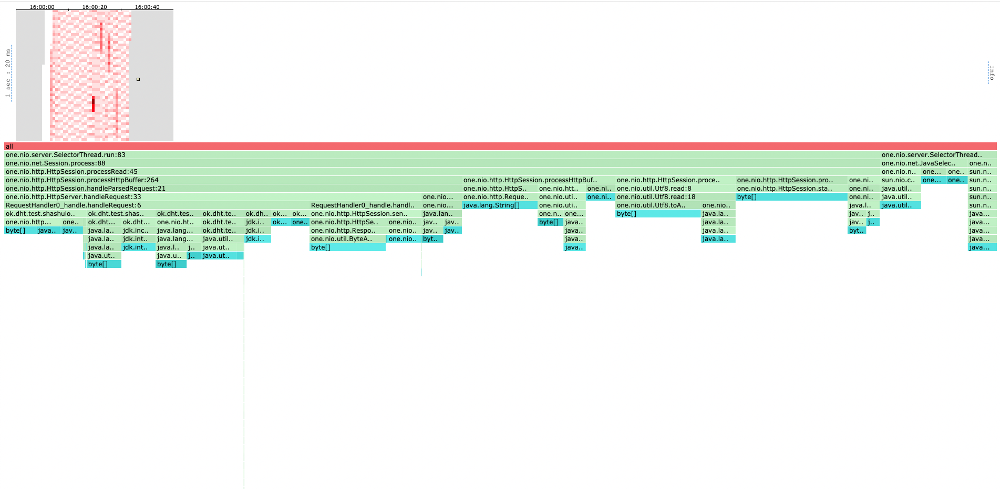
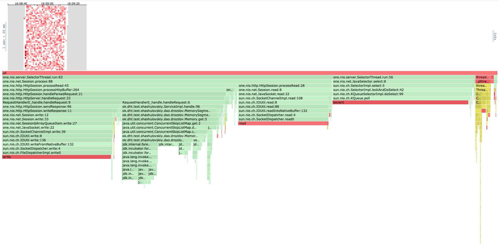

# Нагрузочное тестирование с помошью wkr2

Тестирование проводилось на ARM чипе M1 Pro с соответствующей модификацией wrk2,
поддерживающей эту архитектуру

### PUT

Для нагрузочного тестирования использовался следующий скрипт, позволяющий генерировать запросы по рандомным **m** ключам
```
request = function()
    url = '/v0/entity?id=key' .. math.random(1, m)
    body = 'value' .. math.random(1, 1000)

    return wrk.format("PUT", url, {}, body)
end
```

Рассмотрим различное число ключей и разные рейты нагрузки.

Если rate имеет порядок 10000, у нашего сервера не возникает трудностей с обработкой запросов, число
обработанных за секунду запросов примерно равно заданному рейту.

```
wrk2 -t 1 -c 1 -d 30s -R 10000 http://localhost:19234 -s load_testing_put.lua

Running 30s test @ http://localhost:19234
  1 threads and 1 connections
  Thread calibration: mean lat.: 0.941ms, rate sampling interval: 10ms
  Thread Stats   Avg      Stdev     Max   +/- Stdev
    Latency     1.52ms    5.26ms  85.25ms   98.03%
    Req/Sec    10.56k     1.74k   34.11k    89.45%
  299996 requests in 30.00s, 19.17MB read
Requests/sec:   9999.90
Transfer/sec:    654.29KB
```


Проблемы начинаются при рейте порядка 100000. Рассмотрим разный диапазон ключей:
1. 1000000 ключей, low contention
```
wrk2 -t 1 -c 1 -d 30s -R 100000 http://localhost:19234 -s load_testing_put.lua

Running 30s test @ http://localhost:19234
  1 threads and 1 connections
  Thread calibration: mean lat.: 2881.805ms, rate sampling interval: 10297ms
  Thread Stats   Avg      Stdev     Max   +/- Stdev
    Latency    11.42s     3.30s   17.14s    57.66%
    Req/Sec    42.99k     0.00    43.00k     0.00%
  1285424 requests in 30.00s, 82.13MB read
Requests/sec:  42847.64
Transfer/sec:      2.74MB
```

2. 1000 ключей, somewhat medium contention
```
wrk2 -t 1 -c 1 -d 30s -R 100000 http://localhost:19234 -s load_testing_put.lua

Running 30s test @ http://localhost:19234
  1 threads and 1 connections
  Thread calibration: mean lat.: 2881.734ms, rate sampling interval: 10280ms
  Thread Stats   Avg      Stdev     Max   +/- Stdev
    Latency    11.37s     3.27s   17.01s    57.65%
    Req/Sec    43.38k     0.00    43.36k     0.00%
  1299235 requests in 30.00s, 83.02MB read
Requests/sec:  43307.99
Transfer/sec:      2.77MB
```

3. 1 ключ, very high contention
```
wrk2 -t 1 -c 1 -d 30s -R 100000 http://localhost:19234 -s load_testing_put.lua
Running 30s test @ http://localhost:19234
  1 threads and 1 connections
  Thread calibration: mean lat.: 2776.541ms, rate sampling interval: 9945ms
  Thread Stats   Avg      Stdev     Max   +/- Stdev
    Latency    11.00s     3.17s   16.48s    57.71%
    Req/Sec    45.12k    16.00    45.14k    50.00%
  1351162 requests in 30.00s, 86.33MB read
Requests/sec:  45038.90
Transfer/sec:      2.88MB
```

Как видим, кол-во запросов которые выдерживает наш сервер больше чем в два раза меньше числа запросов,
сервер не справляется. Но чем меньше ключей тем больше запросов в секунду мы обрабатываем, связано это
с тем что мы лучше попадаем в кеш и меньше дергаем память.

### GET

Тестирование будем проводитить следующим скрптом
```
request = function()
    url = '/v0/entity?id=key' .. math.random(1, m)
    return wrk.format("GET", url, {})
end
```

Для нагрузочного тестирования метода GET база данных была сначала наполнена 2 гигабайтами данных.
Блоки выгружаются на диск размерами примерно 1 мегабайт.

Попробуем жестокий тест: данных которые мы ищем почти всегда нет. Результаты соответствующие: уже при
1000 RPS мы сильно захлебываемся

```
wrk2 -t 1 -c 1 -d 30s -R 1000 http://localhost:19234 -s load_testing_get.lua

Running 30s test @ http://localhost:19234
  1 threads and 1 connections
  Thread calibration: mean lat.: 5581.376ms, rate sampling interval: 18415ms
  Thread Stats   Avg      Stdev     Max   +/- Stdev
    Latency    21.02s     4.47s   29.10s    61.11%
    Req/Sec     9.00      0.00     9.00    100.00%
  202 requests in 30.02s, 16.30KB read
  Socket errors: connect 0, read 0, write 0, timeout 1
  Non-2xx or 3xx responses: 201
```

Попробуем увеличить размер блоков, сбрасываемых на диск в 64 раза.

```
wrk2 -t 1 -c 1 -d 30s -R 1000 http://localhost:19234 -s load_testing_get.lua
Running 30s test @ http://localhost:19234
  1 threads and 1 connections
  Thread calibration: mean lat.: 2.285ms, rate sampling interval: 10ms
  Thread Stats   Avg      Stdev     Max   +/- Stdev
    Latency     1.35ms    1.61ms  26.94ms   96.05%
    Req/Sec     1.06k   229.00     4.00k    81.97%
  30002 requests in 30.00s, 2.16MB read
  Non-2xx or 3xx responses: 30002
Requests/sec:   1000.02
Transfer/sec:     73.73KB
```

Теперь мы уже не захлебываемся на 1000 RPS, будем увеличивать RPS.

```
 wrk2 -t 1 -c 1 -d 30s -R 10000 http://localhost:19234 -s load_testing_get.lua

Running 30s test @ http://localhost:19234
  1 threads and 1 connections
  Thread calibration: mean lat.: 1.635ms, rate sampling interval: 10ms
  Thread Stats   Avg      Stdev     Max   +/- Stdev
    Latency     1.61ms    1.01ms  10.53ms   65.32%
    Req/Sec    10.51k     1.44k   22.22k    71.41%
  299992 requests in 30.00s, 19.74MB read
  Non-2xx or 3xx responses: 299992
Requests/sec:   9999.75
Transfer/sec:    673.81KB

wrk2 -t 1 -c 1 -d 30s -R 100000 http://localhost:19234 -s load_testing_get.lua

Running 30s test @ http://localhost:19234
  1 threads and 1 connections
  Thread calibration: mean lat.: 3196.539ms, rate sampling interval: 10895ms
  Thread Stats   Avg      Stdev     Max   +/- Stdev
    Latency    11.68s     3.31s   17.30s    57.33%
    Req/Sec    43.22k     0.00    43.21k     0.00%
  1268200 requests in 30.00s, 83.45MB read
  Non-2xx or 3xx responses: 1268200
Requests/sec:  42273.36
Transfer/sec:      2.78MB
```

Смягчим условия и заполним ключи к которым мы обращаемся значениями. Нашему GET'у стало легче:

```
wrk2 -t 1 -c 1 -d 30s -R 10000 http://localhost:19234 -s load_testing_get.lua
Running 30s test @ http://localhost:19234
  1 threads and 1 connections
  Thread calibration: mean lat.: 1.474ms, rate sampling interval: 10ms
  Thread Stats   Avg      Stdev     Max   +/- Stdev
    Latency     1.45ms    0.91ms   9.75ms   69.73%
    Req/Sec    10.54k     1.32k   17.67k    70.42%
  299981 requests in 30.00s, 19.99MB read
Requests/sec:   9999.28
Transfer/sec:    682.34KB
```

На 100000 RPS получаем ожидаемый захлеб:

```
wrk2 -t 1 -c 1 -d 30s -R 100000 http://localhost:19234 -s load_testing_get.lua
Running 30s test @ http://localhost:19234
  1 threads and 1 connections
  Thread calibration: mean lat.: 2279.857ms, rate sampling interval: 7958ms
  Thread Stats   Avg      Stdev     Max   +/- Stdev
    Latency     9.20s     2.57s   13.66s    60.86%
    Req/Sec    53.68k     3.04k   56.73k    50.00%
  1634046 requests in 30.00s, 108.89MB read
Requests/sec:  54468.27
Transfer/sec:      3.63MB
```

### Выводы:
1. Сервер выдерживает RPS порядка 40000-50000
2. Оптимальнее всего делать выгрузки на диск большими блоками. Таким образом мы минимизируем
обращения к диску и больше работаем в оперативной памяти.
3. Распределение ключей по которым идет поиск не оказывает большого влияния на выдерживаемую
нагрузку. Оптимальной конечно является ситуация когда мы лучше попадаем в кеш и уже загруженные данные.

# Профилирование с помощью async-profiler

Соответствующие файлы можно найти в папке `reports/stage1/files`

### PUT

#### CPU



Как видно, мы тратим очень большую долю времени на селекты наших запросов (~23%). Обработка
запросов нашим фреймворком занимает около 14%, почти все время из этого уходит на чтение.
На то чтобы сформировать ответ и его отправить ушло около 17%. Наша же обработка занимала около 18%.
Большая часть обработки ушла на то чтобы непосредственно положить значение в нашу БД, большая часть
из которой уже была непосредственно потрачена на add в ConcurrentSkipList, который лежит в основе
нашего DAO. Лишь маленькая часть работа (< 1%) была потрачена на наши действия: получение id
из запроса, routing и т.д.

На мой взгляд, решение здесь практически оптимальное, т.к болшая часть времени тратится на системные
вызовы чтения запроса/записи ответа, а также на add в ConcurrentSkipList. Возможно получилось бы
получить прирост, использовав более оптимальную реализацию concurrent skip list'а или аналогичной
структыры данных в нашем DAO. Наша же промежуточная прослойка сервиса тратит мизерное число ресурсов,
около процента, ее оптимизация не может дать большого выигрыша.

#### ALLOC


Около 11% аллокаций заняли select'ы, остальные же были потрачены на обработку запросов.
4% мы потратили на то чтобы получить id.
11% на то чтобы создать ответ на запрос.
30% же было потрачено на сам upsert. Помимо аллокаций, которые делает skip list,
много аллокаций ушло на то чтобы преобразовать строки которые мы получили в запросе в MemorySegment,
использующиеся в реализации DAO.
Около половины аллокаций на обработку запроса было потрачено на то, чтобы получить данные из запроса.

Я считаю, что основным простором для улучшений здесь могло быть сокращенее промежуточного числа
преобразования данных. После того как мы получаем данные из запроса, мы несколько раз их
конвертируем в новые сущности перед тем как данные сохранятся. Сначала они из считанных массивов байт
преобразуются в строки, потом в MemorySegment'ы, потом уже во внутренние ноды skip list'а. В идеале,
если мы бы везде оперировали массивами байт и переиспользовали полученные данные, мы бы сильно
ужали количество аллокаций.

### GET

#### CPU

Тесты проводились в условиях наличия всех ключей на которые делались запросы.



Здесь ситуация по сути аналогична запросам PUT, т.к на стороне обработчика запосов логика практически
идентичная. 27% тратятся на select'ы, порядка 19% на чтение запроса, и порядка 22% на запись ответа.
Сама же обработка нашей бд занимает около 20%, опять же большая часть из которых уходить на получение
данных из skip list'а, причем большая часть уже этой работы ушла просто на то чтобы сравнивать элементы
с тем что мы ищем.

Вывод тут аналогичный, мало пространства для маневров так как очень много времени тратится на системные
вызовы чтения/записи.

#### ALLOC


Здесь ситуация уже сильно чем в PUT'е. Так как мы по сути просто получаем данные из базы, то мы имеем
дело с минимумом конвертаций. На удивление, очень большой кусок аллокаций (40%) уходит только на то,
чтобы получить id из запроса, что в целом говорит о том что в этом методе мы делаем очень мало аллокаций.

