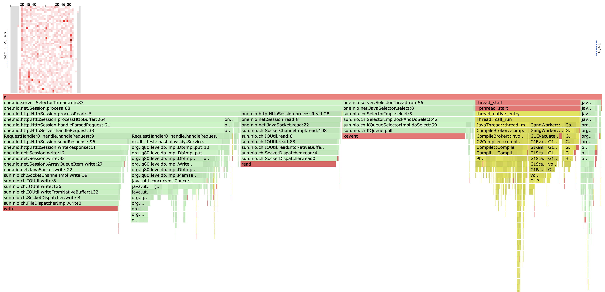
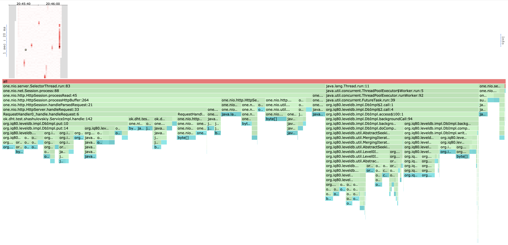
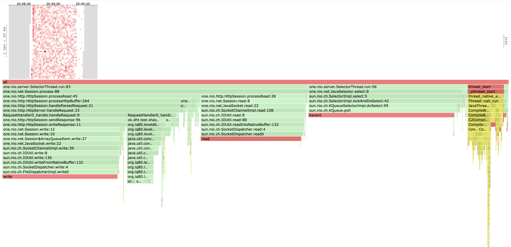
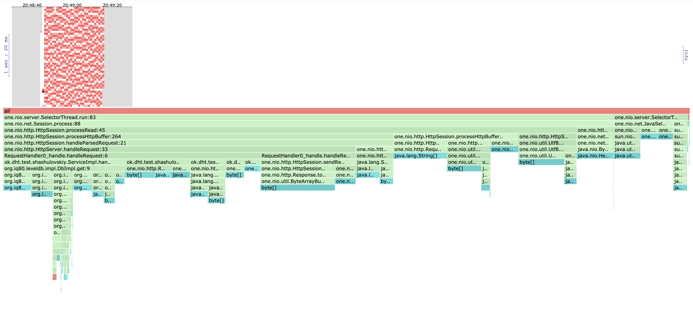

# Нагрузочное тестирование с помошью wkr2

Тестирование проводилось на ARM чипе M1 Pro с соответствующей модификацией wrk2,
поддерживающей эту архитектуру

### PUT

Для нагрузочного тестирования использовался следующий скрипт, позволяющий генерировать запросы по рандомным **m** ключам
```
request = function()
    url = '/v0/entity?id=key' .. math.random(1, m)
    body = 'value' .. math.random(1, 1000)

    return wrk.format("PUT", url, {}, body)
end
```

Рассмотрим различное число ключей и разные рейты нагрузки.

Если rate имеет порядок 10000, у нашего сервера не возникает трудностей с обработкой запросов, число
обработанных за секунду запросов примерно равно заданному рейту.

```
wrk2 -t 1 -c 1 -d 30s -R 10000 http://localhost:19234 -s load_testing_put.lua

Running 30s test @ http://localhost:19234
  1 threads and 1 connections
  Thread calibration: mean lat.: 1.924ms, rate sampling interval: 10ms
  Thread Stats   Avg      Stdev     Max   +/- Stdev
    Latency     1.62ms    2.16ms  25.82ms   95.45%
    Req/Sec    10.57k     2.33k   34.33k    89.63%
  299912 requests in 29.99s, 19.16MB read
Requests/sec:   9999.39
Transfer/sec:    654.26KB
```


Проблемы начинаются при рейте порядка 100000. Рассмотрим разный диапазон ключей:
1. 1000000 ключей, low contention
```
wrk2 -t 1 -c 1 -d 30s -R 100000 http://localhost:19234 -s load_testing_put.lua

Running 30s test @ http://localhost:19234
  1 threads and 1 connections
  Thread calibration: mean lat.: 3109.129ms, rate sampling interval: 11026ms
  Thread Stats   Avg      Stdev     Max   +/- Stdev
    Latency    12.06s     3.51s   18.15s    57.46%
    Req/Sec    39.79k     0.00    39.79k     0.00%
  1183645 requests in 30.00s, 75.63MB read
Requests/sec:  39455.05
Transfer/sec:      2.52MB
```

2. 1000 ключей, somewhat medium contention
```
wrk2 -t 1 -c 1 -d 30s -R 100000 http://localhost:19234 -s load_testing_put.lua

Running 30s test @ http://localhost:19234
  1 threads and 1 connections
  Thread calibration: mean lat.: 3060.303ms, rate sampling interval: 10846ms
  Thread Stats   Avg      Stdev     Max   +/- Stdev
    Latency    11.95s     3.46s   17.91s    57.73%
    Req/Sec    40.59k     0.00    40.58k     0.00%
  1208397 requests in 30.00s, 77.21MB read
Requests/sec:  40279.52
Transfer/sec:      2.57MB
```

3. 1 ключ, very high contention
```
wrk2 -t 1 -c 1 -d 30s -R 100000 http://localhost:19234 -s load_testing_put.lua
Running 30s test @ http://localhost:19234
  1 threads and 1 connections
  Thread calibration: mean lat.: 2937.492ms, rate sampling interval: 10461ms
  Thread Stats   Avg      Stdev     Max   +/- Stdev
    Latency    11.47s     3.28s   17.12s    57.54%
    Req/Sec    43.18k     0.00    43.20k     0.00%
  1286979 requests in 30.00s, 82.23MB read
Requests/sec:  42899.43
Transfer/sec:      2.74MB
```

Как видим, кол-во запросов которые выдерживает наш сервер больше чем в два раза меньше числа запросов,
сервер не справляется. Но чем меньше ключей тем больше запросов в секунду мы обрабатываем, связано это
с тем что мы лучше попадаем в кеш и меньше дергаем память.

```
wrk2 -t 1 -c 1 -d 30s -R 42000 http://localhost:19234 -s load_testing_put.lua
Running 30s test @ http://localhost:19234
  1 threads and 1 connections
  Thread calibration: mean lat.: 93.002ms, rate sampling interval: 277ms
  Thread Stats   Avg      Stdev     Max   +/- Stdev
    Latency     5.58ms    7.62ms  43.74ms   85.00%
    Req/Sec    42.12k     0.96k   44.27k    72.22%
  1259943 requests in 30.00s, 80.51MB read
Requests/sec:  41998.30
Transfer/sec:      2.68MB
```

Как видим, по 1 ключу наш сервер выдерживает нагрузку около 42000 RPS.

### GET

Тестирование будем проводитить следующим скрптом
```
request = function()
    url = '/v0/entity?id=key' .. math.random(1, m)
    return wrk.format("GET", url, {})
end
```

Для нагрузочного тестирования метода GET база данных была сначала наполнена 2 гигабайтами данных.

Попробуем сначала такой тест: данных которые мы ищем почти всегда нет. 10000 RPS мы как и до этого спокойно держим. 

```
wrk2 -t 1 -c 1 -d 30s -R 10000 http://localhost:19234 -s load_testing_get.lua
Running 30s test @ http://localhost:19234
  1 threads and 1 connections
  Thread calibration: mean lat.: 2.003ms, rate sampling interval: 10ms
  Thread Stats   Avg      Stdev     Max   +/- Stdev
    Latency     1.37ms    1.61ms  29.31ms   96.14%
    Req/Sec    10.55k     1.89k   35.22k    88.23%
  299981 requests in 30.00s, 19.74MB read
  Non-2xx or 3xx responses: 299981
Requests/sec:   9999.40
Transfer/sec:    673.79KB
```

На 100000 RPS появляются ожидаемый захлеб, выдерживаем мы схожие 43000 RPS:

```
wrk2 -t 1 -c 1 -d 30s -R 100000 http://localhost:19234 -s load_testing_get.lua
Running 30s test @ http://localhost:19234
  1 threads and 1 connections
  Thread calibration: mean lat.: 2868.795ms, rate sampling interval: 10272ms
  Thread Stats   Avg      Stdev     Max   +/- Stdev
    Latency    11.37s     3.29s   17.06s    57.81%
    Req/Sec    43.31k     0.00    43.31k     0.00%
  1294227 requests in 30.00s, 85.16MB read
  Non-2xx or 3xx responses: 1294227
Requests/sec:  43140.90
Transfer/sec:      2.84MB
```

Изменим условия и заполним ключи к которым мы обращаемся значениями. Нашему GET'у стало труднее:

```
wrk2 -t 1 -c 1 -d 30s -R 100000 http://localhost:19234 -s load_testing_get.lua
Running 30s test @ http://localhost:19234
  1 threads and 1 connections
  Thread calibration: mean lat.: 3214.058ms, rate sampling interval: 11280ms
  Thread Stats   Avg      Stdev     Max   +/- Stdev
    Latency    12.45s     3.58s   18.63s    57.79%
    Req/Sec    38.06k     0.00    38.06k     0.00%
  1135579 requests in 30.00s, 310.69MB read
Requests/sec:  37852.66
Transfer/sec:     10.36MB

```

Теперь мы выдерживаем около 38000 RPS, подозреваю что связано это с тем,
что здесь мы делаем много новых аллокаций, которые замедляют работу сервера.

### Выводы:
1. Сервер выдерживает RPS порядка 40000
2. Распределение ключей по которым идет поиск не оказывает большого влияния на выдерживаемую нагрузку. Оптимальной конечно является ситуация когда мы лучше попадаем в кеш и уже загруженные данные.
3. Ускорить GET запросы потенциально можно было бы добавлением небольшого кеша. Это бы сильно улучшило время исполения запросов на маленький диапазон ключей.

# Профилирование с помощью async-profiler

Соответствующие файлы можно найти в папке `reports/stage1/files`

### PUT

#### CPU



Как видно, мы тратим очень большую долю времени на селекты наших запросов (~22%). Обработка
запросов нашим фреймворком занимает около 15%, почти все время из этого уходит на чтение.
На то чтобы сформировать ответ и его отправить ушло около 20%.

Большая часть обработки самого запроса ушла на то, чтобы непосредственно положить значение в нашу БД, большая часть
из которой уже была непосредственно потрачена на add в ConcurrentSkipList, который лежит в основе
нашего DAO. Лишь маленькая часть работы (около 1%) была потрачена на наши действия: получение id
из запроса, routing и т.д.

Помимо этого какая-та часть работы ушла на "прогрев", а также запуск джоб в БД работающих
на заднем фоне.

На мой взгляд, решение здесь практически оптимальное, т.к большая часть времени тратится на системные
вызовы чтения запроса/записи ответа, а также на add в ConcurrentSkipList. Возможно получилось бы
получить прирост, использовав более оптимальную реализацию concurrent skip list'а или аналогичной
структыры данных внутри LevelDB. Наша же промежуточная прослойка сервиса тратит мизерное число ресурсов,
около процента, ее оптимизация не может дать большого выигрыша.

#### ALLOC


Здесь все не так однозначно:

Всего 5% занимают селекты.
Около 30% уходит на фоновые задачи LevelDB по ужатию данных для оптимизации занимаемого пространства,
из них примерно половина уходит на то чтобы пробежаться по данным и другая половина на то чтобы переписать данные.
Около 64% уходит на обработку самого запоса. Запись в бд занимает около 25%, 5% занимает создание ответа,
около 3% уходит на получение id из параметров, еще 6% уходит на то чтобы создать ответ, около 15 процентов уходит
на чтение запроса.

Во-первых, очень много аллокаций уходит на "профилактические" работы по сжатию внутри самой LevelDB, очевидно помогло
бы проводить их меньше, но тут мы могли бы потерять в скорости работы базы. Также можно было бы попробовать
сэкономить на промежуточных аллокациях: внутренние структуры данных, лежащие в основе делают аллокации на то,
чтобы преобразовать данные в нужный им вид. Идеальная низкоуровневая бд, как мне кажется, могла бы максимально
переиспользовать уже аллоцированные байты полученные из запроса и не делать лишних копий. Конечно свести до нуля
их не возможно, но чуть меньше в теории можно. Также можно пожертвовать записью в лог. Это сократило бы число аллокаций,
но убило бы надежность.

### GET

#### CPU

Тесты проводились в условиях наличия всех ключей на которые делались запросы.



Здесь ситуация практически аналогичная запросам PUT. Там проводятся практически те же операции, разве что
в скип листе мы теперь ищем данные а не кладем. Большую часть времени все еще занимают системные вызовы
на read и write.

Оптимизировать тут опять же можно было бы используя более умную реализацию скип листа под копотом в LevelDB.

#### ALLOC



Здесь ситуация уже сильно лучше чем в PUT'е. Сразу бросается в глаза отсутствие бэкграунд задач воркеров
LevelDB которые жали данные, это сэкномило много аллокаций. В процентном соотношении, тут уже больший процент
аллокаций уходит на чтение запроса/запись ответа. Значит сама обработка запроса делает аллокаций меньше, что
логично, ведь это GET. В самом поиске аллокации тратятся на то чтобы прочитать данные и сравнить их с тем
что мы ищем, и непосредственно отправить ответ. 

Здесь уже гораздно меньше места для маневров, возможно получилось бы ужаться в метстах где мы, например,
получаем байты из бд, а потом на основе них уже создаем ответ, не переиспользуя то что у нас уже было. Но опять же,
тут мы имеем дело с джавой и это довольно тяжело.

