# Анализ стратегий реализации

Тестировать будем тем же самым скриптом, но теперь в 64 connections:
```
request = function()
url = '/v0/entity?id=key' .. math.random(1, m)
body = 'value' .. math.random(1, 1000)

    return wrk.format("PUT", url, {}, body)
end
```

## Однопоточная реализация

Для начала протестируем однопоточную реализацию для референса. 

#### PUT
```
wrk2 -t 64 -c 64 -d 2m -R 100000 -L http://localhost:19234 -s load_testing_put.lua
Running 2m test @ http://localhost:19234
  64 threads and 64 connections
  Thread calibration: mean lat.: 3866.229ms, rate sampling interval: 12902ms
  Thread calibration: mean lat.: 4147.514ms, rate sampling interval: 13557ms
  Thread calibration: mean lat.: 3748.082ms, rate sampling interval: 12607ms
  Thread calibration: mean lat.: 4051.273ms, rate sampling interval: 13336ms
  Thread calibration: mean lat.: 3901.335ms, rate sampling interval: 12984ms
  Thread calibration: mean lat.: 4077.307ms, rate sampling interval: 13385ms
  Thread calibration: mean lat.: 3790.945ms, rate sampling interval: 12705ms
  Thread calibration: mean lat.: 3742.620ms, rate sampling interval: 12607ms
  Thread calibration: mean lat.: 3718.293ms, rate sampling interval: 12509ms
  Thread calibration: mean lat.: 3784.806ms, rate sampling interval: 12722ms
  Thread calibration: mean lat.: 3854.031ms, rate sampling interval: 12861ms
  Thread calibration: mean lat.: 4070.587ms, rate sampling interval: 13352ms
  Thread calibration: mean lat.: 3973.029ms, rate sampling interval: 13123ms
  Thread calibration: mean lat.: 4049.553ms, rate sampling interval: 13303ms
  Thread calibration: mean lat.: 3805.357ms, rate sampling interval: 12754ms
  Thread calibration: mean lat.: 3867.105ms, rate sampling interval: 12902ms
  Thread calibration: mean lat.: 3946.894ms, rate sampling interval: 13074ms
  Thread calibration: mean lat.: 3848.796ms, rate sampling interval: 12845ms
  Thread calibration: mean lat.: 3785.481ms, rate sampling interval: 12722ms
  Thread calibration: mean lat.: 3789.437ms, rate sampling interval: 12697ms
  Thread calibration: mean lat.: 3757.481ms, rate sampling interval: 12615ms
  Thread calibration: mean lat.: 3670.818ms, rate sampling interval: 12427ms
  Thread calibration: mean lat.: 3715.317ms, rate sampling interval: 12558ms
  Thread calibration: mean lat.: 3780.059ms, rate sampling interval: 12664ms
  Thread calibration: mean lat.: 4174.499ms, rate sampling interval: 13656ms
  Thread calibration: mean lat.: 3699.293ms, rate sampling interval: 12500ms
  Thread calibration: mean lat.: 3880.002ms, rate sampling interval: 12910ms
  Thread calibration: mean lat.: 3771.562ms, rate sampling interval: 12681ms
  Thread calibration: mean lat.: 3879.316ms, rate sampling interval: 12902ms
  Thread calibration: mean lat.: 3702.267ms, rate sampling interval: 12533ms
  Thread calibration: mean lat.: 3926.211ms, rate sampling interval: 13017ms
  Thread calibration: mean lat.: 3942.212ms, rate sampling interval: 13049ms
  Thread calibration: mean lat.: 3846.397ms, rate sampling interval: 12853ms
  Thread calibration: mean lat.: 3922.355ms, rate sampling interval: 13049ms
  Thread calibration: mean lat.: 3636.870ms, rate sampling interval: 12328ms
  Thread calibration: mean lat.: 4056.322ms, rate sampling interval: 13311ms
  Thread calibration: mean lat.: 4160.240ms, rate sampling interval: 13623ms
  Thread calibration: mean lat.: 3923.841ms, rate sampling interval: 13025ms
  Thread calibration: mean lat.: 3580.500ms, rate sampling interval: 12132ms
  Thread calibration: mean lat.: 3972.721ms, rate sampling interval: 13131ms
  Thread calibration: mean lat.: 3853.109ms, rate sampling interval: 12902ms
  Thread calibration: mean lat.: 3982.588ms, rate sampling interval: 13148ms
  Thread calibration: mean lat.: 3888.819ms, rate sampling interval: 12943ms
  Thread calibration: mean lat.: 4013.837ms, rate sampling interval: 13238ms
  Thread calibration: mean lat.: 3949.069ms, rate sampling interval: 13074ms
  Thread calibration: mean lat.: 3833.236ms, rate sampling interval: 12795ms
  Thread calibration: mean lat.: 4099.876ms, rate sampling interval: 13467ms
  Thread calibration: mean lat.: 3750.855ms, rate sampling interval: 12632ms
  Thread calibration: mean lat.: 3836.642ms, rate sampling interval: 12828ms
  Thread calibration: mean lat.: 3933.568ms, rate sampling interval: 13058ms
  Thread calibration: mean lat.: 3846.157ms, rate sampling interval: 12869ms
  Thread calibration: mean lat.: 3691.867ms, rate sampling interval: 12451ms
  Thread calibration: mean lat.: 4018.582ms, rate sampling interval: 13221ms
  Thread calibration: mean lat.: 4085.144ms, rate sampling interval: 13443ms
  Thread calibration: mean lat.: 3894.129ms, rate sampling interval: 12951ms
  Thread calibration: mean lat.: 3915.359ms, rate sampling interval: 13008ms
  Thread calibration: mean lat.: 3843.817ms, rate sampling interval: 12861ms
  Thread calibration: mean lat.: 3865.160ms, rate sampling interval: 12894ms
  Thread calibration: mean lat.: 4006.482ms, rate sampling interval: 13205ms
  Thread calibration: mean lat.: 3750.680ms, rate sampling interval: 12607ms
  Thread calibration: mean lat.: 3961.901ms, rate sampling interval: 13082ms
  Thread calibration: mean lat.: 3825.613ms, rate sampling interval: 12795ms
  Thread calibration: mean lat.: 3961.931ms, rate sampling interval: 13115ms
  Thread calibration: mean lat.: 3998.860ms, rate sampling interval: 13180ms
  Thread Stats   Avg      Stdev     Max   +/- Stdev
    Latency    43.94s    20.88s    1.40m    58.68%
    Req/Sec   529.17     35.13   668.00     72.71%
  Latency Distribution (HdrHistogram - Recorded Latency)
 50.000%   44.07s 
 75.000%    1.04m 
 90.000%    1.21m 
 99.000%    1.33m 
 99.900%    1.37m 
 99.990%    1.40m 
 99.999%    1.40m 
100.000%    1.40m 

  Detailed Percentile spectrum:
       Value   Percentile   TotalCount 1/(1-Percentile)

    6729.727     0.000000            5         1.00
   14884.863     0.100000       372964         1.11
   22659.071     0.200000       745970         1.25
   29474.815     0.300000      1118696         1.43
   36503.551     0.400000      1492209         1.67
   44072.959     0.500000      1864352         2.00
   47939.583     0.550000      2052674         2.22
   51478.527     0.600000      2237413         2.50
   55083.007     0.650000      2424076         2.86
   58785.791     0.700000      2610270         3.33
   62226.431     0.750000      2797168         4.00
   63799.295     0.775000      2891589         4.44
   65372.159     0.800000      2983988         5.00
   67174.399     0.825000      3078043         5.71
   69074.943     0.850000      3171936         6.67
   70844.415     0.875000      3263617         8.00
   71761.919     0.887500      3311910         8.89
   72613.887     0.900000      3358831        10.00
   73465.855     0.912500      3405323        11.43
   74252.287     0.925000      3450212        13.33
   75104.255     0.937500      3498060        16.00
   75563.007     0.943750      3521874        17.78
   75956.223     0.950000      3543062        20.00
   76414.975     0.956250      3566101        22.86
   76939.263     0.962500      3591668        26.67
   77398.015     0.968750      3612407        32.00
   77660.159     0.971875      3623882        35.56
   77987.839     0.975000      3636794        40.00
   78249.983     0.978125      3647167        45.71
   78643.199     0.981250      3660698        53.33
   78970.879     0.984375      3671389        64.00
   79167.487     0.985938      3677126        71.11
   79364.095     0.987500      3682487        80.00
   79626.239     0.989062      3689047        91.43
   79888.383     0.990625      3694988       106.67
   80150.527     0.992188      3700106       128.00
   80281.599     0.992969      3702563       142.22
   80478.207     0.993750      3706055       160.00
   80674.815     0.994531      3708990       182.86
   80871.423     0.995313      3712037       213.33
   81068.031     0.996094      3714318       256.00
   81199.103     0.996484      3715697       284.44
   81330.175     0.996875      3717296       320.00
   81461.247     0.997266      3718636       365.71
   81657.855     0.997656      3720252       426.67
   81854.463     0.998047      3721698       512.00
   81919.999     0.998242      3722096       568.89
   82051.071     0.998437      3722869       640.00
   82247.679     0.998633      3723851       731.43
   82378.751     0.998828      3724558       853.33
   82509.823     0.999023      3725218      1024.00
   82575.359     0.999121      3725521      1137.78
   82640.895     0.999219      3725738      1280.00
   82771.967     0.999316      3726118      1462.86
   82903.039     0.999414      3726472      1706.67
   83034.111     0.999512      3726860      2048.00
   83099.647     0.999561      3727098      2275.56
   83165.183     0.999609      3727328      2560.00
   83230.719     0.999658      3727590      2925.71
   83230.719     0.999707      3727590      3413.33
   83296.255     0.999756      3727747      4096.00
   83361.791     0.999780      3727831      4551.11
   83492.863     0.999805      3727935      5120.00
   83623.935     0.999829      3728019      5851.43
   83755.007     0.999854      3728133      6826.67
   83820.543     0.999878      3728258      8192.00
   83820.543     0.999890      3728258      9102.22
   83886.079     0.999902      3728416     10240.00
   83886.079     0.999915      3728416     11702.86
   83886.079     0.999927      3728416     13653.33
   83886.079     0.999939      3728416     16384.00
   83951.615     0.999945      3728551     18204.44
   83951.615     0.999951      3728551     20480.00
   83951.615     0.999957      3728551     23405.71
   83951.615     0.999963      3728551     27306.67
   83951.615     0.999969      3728551     32768.00
   83951.615     0.999973      3728551     36408.89
   83951.615     0.999976      3728551     40960.00
   84017.151     0.999979      3728634     46811.43
   84017.151     1.000000      3728634          inf
#[Mean    =    43942.920, StdDeviation   =    20876.069]
#[Max     =    83951.616, Total count    =      3728634]
#[Buckets =           27, SubBuckets     =         2048]
----------------------------------------------------------
  4022957 requests in 2.00m, 257.05MB read
Requests/sec:  33527.01
Transfer/sec:      2.14MB
```
#### GET
```
wrk2 -t 64 -c 64 -d 2m -R 100000 -L http://localhost:19234 -s load_testing_get.lua
Running 2m test @ http://localhost:19234
  64 threads and 64 connections
  Thread calibration: mean lat.: 3753.430ms, rate sampling interval: 12525ms
  Thread calibration: mean lat.: 3935.076ms, rate sampling interval: 13000ms
  Thread calibration: mean lat.: 3528.129ms, rate sampling interval: 11616ms
  Thread calibration: mean lat.: 3877.240ms, rate sampling interval: 12771ms
  Thread calibration: mean lat.: 3253.721ms, rate sampling interval: 10477ms
  Thread calibration: mean lat.: 3400.641ms, rate sampling interval: 11001ms
  Thread calibration: mean lat.: 3397.162ms, rate sampling interval: 10977ms
  Thread calibration: mean lat.: 3711.273ms, rate sampling interval: 12222ms
  Thread calibration: mean lat.: 3641.215ms, rate sampling interval: 11943ms
  Thread calibration: mean lat.: 3466.003ms, rate sampling interval: 11354ms
  Thread calibration: mean lat.: 3356.566ms, rate sampling interval: 11018ms
  Thread calibration: mean lat.: 3598.252ms, rate sampling interval: 11902ms
  Thread calibration: mean lat.: 3421.314ms, rate sampling interval: 11067ms
  Thread calibration: mean lat.: 3417.557ms, rate sampling interval: 11141ms
  Thread calibration: mean lat.: 3491.603ms, rate sampling interval: 11091ms
  Thread calibration: mean lat.: 3569.515ms, rate sampling interval: 11788ms
  Thread calibration: mean lat.: 3510.731ms, rate sampling interval: 11599ms
  Thread calibration: mean lat.: 3486.265ms, rate sampling interval: 11509ms
  Thread calibration: mean lat.: 3253.051ms, rate sampling interval: 10125ms
  Thread calibration: mean lat.: 3262.338ms, rate sampling interval: 10067ms
  Thread calibration: mean lat.: 3520.738ms, rate sampling interval: 11583ms
  Thread calibration: mean lat.: 3498.786ms, rate sampling interval: 11681ms
  Thread calibration: mean lat.: 3418.667ms, rate sampling interval: 10829ms
  Thread calibration: mean lat.: 3531.475ms, rate sampling interval: 11599ms
  Thread calibration: mean lat.: 3345.205ms, rate sampling interval: 10829ms
  Thread calibration: mean lat.: 3569.559ms, rate sampling interval: 11730ms
  Thread calibration: mean lat.: 3866.370ms, rate sampling interval: 12787ms
  Thread calibration: mean lat.: 3286.950ms, rate sampling interval: 10641ms
  Thread calibration: mean lat.: 3760.994ms, rate sampling interval: 12427ms
  Thread calibration: mean lat.: 3593.165ms, rate sampling interval: 11993ms
  Thread calibration: mean lat.: 3715.401ms, rate sampling interval: 12263ms
  Thread calibration: mean lat.: 3632.547ms, rate sampling interval: 12009ms
  Thread calibration: mean lat.: 3873.146ms, rate sampling interval: 12738ms
  Thread calibration: mean lat.: 3773.563ms, rate sampling interval: 12419ms
  Thread calibration: mean lat.: 3536.719ms, rate sampling interval: 11534ms
  Thread calibration: mean lat.: 3509.224ms, rate sampling interval: 11583ms
  Thread calibration: mean lat.: 3631.617ms, rate sampling interval: 11960ms
  Thread calibration: mean lat.: 3647.435ms, rate sampling interval: 12050ms
  Thread calibration: mean lat.: 3810.559ms, rate sampling interval: 12615ms
  Thread calibration: mean lat.: 3641.411ms, rate sampling interval: 12050ms
  Thread calibration: mean lat.: 3508.328ms, rate sampling interval: 11681ms
  Thread calibration: mean lat.: 3635.057ms, rate sampling interval: 11960ms
  Thread calibration: mean lat.: 3448.323ms, rate sampling interval: 11378ms
  Thread calibration: mean lat.: 3806.287ms, rate sampling interval: 12525ms
  Thread calibration: mean lat.: 3677.767ms, rate sampling interval: 12238ms
  Thread calibration: mean lat.: 3422.595ms, rate sampling interval: 11083ms
  Thread calibration: mean lat.: 3577.313ms, rate sampling interval: 11780ms
  Thread calibration: mean lat.: 3403.295ms, rate sampling interval: 11288ms
  Thread calibration: mean lat.: 3582.310ms, rate sampling interval: 11845ms
  Thread calibration: mean lat.: 3395.690ms, rate sampling interval: 11231ms
  Thread calibration: mean lat.: 3677.655ms, rate sampling interval: 12075ms
  Thread calibration: mean lat.: 3338.144ms, rate sampling interval: 11067ms
  Thread calibration: mean lat.: 3716.180ms, rate sampling interval: 12410ms
  Thread calibration: mean lat.: 3596.496ms, rate sampling interval: 11853ms
  Thread calibration: mean lat.: 3721.534ms, rate sampling interval: 12369ms
  Thread calibration: mean lat.: 3686.666ms, rate sampling interval: 12181ms
  Thread calibration: mean lat.: 3519.187ms, rate sampling interval: 11509ms
  Thread calibration: mean lat.: 3657.438ms, rate sampling interval: 12197ms
  Thread calibration: mean lat.: 3652.955ms, rate sampling interval: 12025ms
  Thread calibration: mean lat.: 3723.071ms, rate sampling interval: 12287ms
  Thread calibration: mean lat.: 3695.843ms, rate sampling interval: 12230ms
  Thread calibration: mean lat.: 3392.909ms, rate sampling interval: 11362ms
  Thread calibration: mean lat.: 3759.322ms, rate sampling interval: 12410ms
  Thread calibration: mean lat.: 3595.251ms, rate sampling interval: 11821ms
  Thread Stats   Avg      Stdev     Max   +/- Stdev
    Latency    38.35s    20.18s    1.34m    57.14%
    Req/Sec   598.16     77.62     0.90k    74.73%
  Latency Distribution (HdrHistogram - Recorded Latency)
 50.000%   37.39s 
 75.000%    0.93m 
 90.000%    1.12m 
 99.000%    1.26m 
 99.900%    1.31m 
 99.990%    1.33m 
 99.999%    1.34m 
100.000%    1.34m 

  Detailed Percentile spectrum:
       Value   Percentile   TotalCount 1/(1-Percentile)

    5586.943     0.000000           18         1.00
   12345.343     0.100000       419788         1.11
   17022.975     0.200000       839831         1.25
   22937.599     0.300000      1260451         1.43
   29523.967     0.400000      1679128         1.67
   37388.287     0.500000      2099407         2.00
   41451.519     0.550000      2309377         2.22
   44924.927     0.600000      2519517         2.50
   48398.335     0.650000      2728254         2.86
   52002.815     0.700000      2938439         3.33
   55672.831     0.750000      3149293         4.00
   57409.535     0.775000      3253108         4.44
   59211.775     0.800000      3359187         5.00
   61046.783     0.825000      3463186         5.71
   63045.631     0.850000      3567703         6.67
   65077.247     0.875000      3673156         8.00
   66093.055     0.887500      3725499         8.89
   67239.935     0.900000      3780868        10.00
   68157.439     0.912500      3831007        11.43
   69140.479     0.925000      3882783        13.33
   70254.591     0.937500      3937069        16.00
   70647.807     0.943750      3962414        17.78
   71172.095     0.950000      3988108        20.00
   71761.919     0.956250      4016176        22.86
   72286.207     0.962500      4041618        26.67
   72876.031     0.968750      4067567        32.00
   73138.175     0.971875      4080368        35.56
   73465.855     0.975000      4093926        40.00
   73793.535     0.978125      4105992        45.71
   74252.287     0.981250      4120596        53.33
   74645.503     0.984375      4133069        64.00
   74907.647     0.985938      4139836        71.11
   75104.255     0.987500      4146369        80.00
   75366.399     0.989062      4152375        91.43
   75628.543     0.990625      4158054       106.67
   76021.759     0.992188      4165337       128.00
   76218.367     0.992969      4169547       142.22
   76283.903     0.993750      4171474       160.00
   76480.511     0.994531      4174482       182.86
   76742.655     0.995313      4178015       213.33
   77004.799     0.996094      4181081       256.00
   77201.407     0.996484      4183607       284.44
   77266.943     0.996875      4184496       320.00
   77463.551     0.997266      4186542       365.71
   77594.623     0.997656      4187559       426.67
   77791.231     0.998047      4189191       512.00
   77922.303     0.998242      4190121       568.89
   78053.375     0.998437      4190994       640.00
   78184.447     0.998633      4191920       731.43
   78315.519     0.998828      4192635       853.33
   78446.591     0.999023      4193267      1024.00
   78577.663     0.999121      4193751      1137.78
   78708.735     0.999219      4194216      1280.00
   78774.271     0.999316      4194473      1462.86
   78905.343     0.999414      4194928      1706.67
   79036.415     0.999512      4195324      2048.00
   79101.951     0.999561      4195520      2275.56
   79167.487     0.999609      4195724      2560.00
   79233.023     0.999658      4195922      2925.71
   79298.559     0.999707      4196095      3413.33
   79364.095     0.999756      4196309      4096.00
   79429.631     0.999780      4196515      4551.11
   79429.631     0.999805      4196515      5120.00
   79495.167     0.999829      4196602      5851.43
   79626.239     0.999854      4196696      6826.67
   79757.311     0.999878      4196800      8192.00
   79822.847     0.999890      4196845      9102.22
   79888.383     0.999902      4196889     10240.00
   79953.919     0.999915      4196938     11702.86
   80019.455     0.999927      4196991     13653.33
   80084.991     0.999939      4197036     16384.00
   80150.527     0.999945      4197092     18204.44
   80150.527     0.999951      4197092     20480.00
   80216.063     0.999957      4197142     23405.71
   80216.063     0.999963      4197142     27306.67
   80281.599     0.999969      4197175     32768.00
   80281.599     0.999973      4197175     36408.89
   80347.135     0.999976      4197231     40960.00
   80347.135     0.999979      4197231     46811.43
   80347.135     0.999982      4197231     54613.33
   80347.135     0.999985      4197231     65536.00
   80412.671     0.999986      4197280     72817.78
   80412.671     0.999988      4197280     81920.00
   80412.671     0.999989      4197280     93622.86
   80412.671     0.999991      4197280    109226.67
   80412.671     0.999992      4197280    131072.00
   80412.671     0.999993      4197280    145635.56
   80412.671     0.999994      4197280    163840.00
   80412.671     0.999995      4197280    187245.71
   80412.671     0.999995      4197280    218453.33
   80412.671     0.999996      4197280    262144.00
   80412.671     0.999997      4197280    291271.11
   80412.671     0.999997      4197280    327680.00
   80412.671     0.999997      4197280    374491.43
   80478.207     0.999998      4197290    436906.67
   80478.207     1.000000      4197290          inf
#[Mean    =    38349.104, StdDeviation   =    20184.327]
#[Max     =    80412.672, Total count    =      4197290]
#[Buckets =           27, SubBuckets     =         2048]
----------------------------------------------------------
  4547862 requests in 2.00m, 303.13MB read
  Non-2xx or 3xx responses: 3587
Requests/sec:  37902.66
Transfer/sec:      2.53MB
```

Конечно же сервер не справляется с такой нагрузкой, и успевает обработать
лишь около трети наших запросов. Будем улучшать.

## Реализация на Executor Service (многопоточная реализация). Дефольные настройки

Для начала просто вынесем обработку запросов в `handleRequest` в классический ExecutorService
со всеми настройками по умолчанию. 
```
this.requestHandlerPool = Executors.newFixedThreadPool(Runtime.getRuntime().availableProcessors());
```

Будем использовать число потоков, равное кол-ву ядер в процессоре. В моем случае - 10.

#### PUT
```
wrk2 -t 64 -c 64 -d 2m -R 100000 -L http://localhost:19234 -s load_testing_put.lua
Running 2m test @ http://localhost:19234
  64 threads and 64 connections
  Thread calibration: mean lat.: 3863.230ms, rate sampling interval: 11231ms
  Thread calibration: mean lat.: 3864.014ms, rate sampling interval: 13049ms
  Thread calibration: mean lat.: 3919.535ms, rate sampling interval: 12058ms
  Thread calibration: mean lat.: 3733.130ms, rate sampling interval: 12550ms
  Thread calibration: mean lat.: 3781.531ms, rate sampling interval: 10305ms
  Thread calibration: mean lat.: 3916.353ms, rate sampling interval: 13213ms
  Thread calibration: mean lat.: 3873.372ms, rate sampling interval: 12869ms
  Thread calibration: mean lat.: 3997.561ms, rate sampling interval: 13066ms
  Thread calibration: mean lat.: 3932.254ms, rate sampling interval: 13344ms
  Thread calibration: mean lat.: 3988.972ms, rate sampling interval: 13066ms
  Thread calibration: mean lat.: 3934.139ms, rate sampling interval: 13328ms
  Thread calibration: mean lat.: 3617.930ms, rate sampling interval: 9740ms
  Thread calibration: mean lat.: 3806.020ms, rate sampling interval: 10985ms
  Thread calibration: mean lat.: 3883.949ms, rate sampling interval: 13164ms
  Thread calibration: mean lat.: 3876.755ms, rate sampling interval: 12959ms
  Thread calibration: mean lat.: 3955.015ms, rate sampling interval: 13156ms
  Thread calibration: mean lat.: 3760.886ms, rate sampling interval: 10264ms
  Thread calibration: mean lat.: 3895.354ms, rate sampling interval: 11862ms
  Thread calibration: mean lat.: 3740.491ms, rate sampling interval: 12730ms
  Thread calibration: mean lat.: 3916.821ms, rate sampling interval: 12697ms
  Thread calibration: mean lat.: 3964.827ms, rate sampling interval: 12902ms
  Thread calibration: mean lat.: 3939.233ms, rate sampling interval: 12926ms
  Thread calibration: mean lat.: 3790.902ms, rate sampling interval: 12853ms
  Thread calibration: mean lat.: 3974.214ms, rate sampling interval: 13058ms
  Thread calibration: mean lat.: 3712.372ms, rate sampling interval: 10059ms
  Thread calibration: mean lat.: 3906.644ms, rate sampling interval: 12935ms
  Thread calibration: mean lat.: 3892.405ms, rate sampling interval: 12705ms
  Thread calibration: mean lat.: 3837.415ms, rate sampling interval: 12795ms
  Thread calibration: mean lat.: 3952.349ms, rate sampling interval: 12926ms
  Thread calibration: mean lat.: 3952.410ms, rate sampling interval: 13254ms
  Thread calibration: mean lat.: 3727.991ms, rate sampling interval: 12656ms
  Thread calibration: mean lat.: 3783.785ms, rate sampling interval: 12615ms
  Thread calibration: mean lat.: 3997.851ms, rate sampling interval: 13484ms
  Thread calibration: mean lat.: 3800.841ms, rate sampling interval: 12935ms
  Thread calibration: mean lat.: 3806.470ms, rate sampling interval: 12910ms
  Thread calibration: mean lat.: 3974.844ms, rate sampling interval: 13328ms
  Thread calibration: mean lat.: 3926.669ms, rate sampling interval: 13311ms
  Thread calibration: mean lat.: 3880.481ms, rate sampling interval: 13115ms
  Thread calibration: mean lat.: 3733.365ms, rate sampling interval: 10665ms
  Thread calibration: mean lat.: 3820.624ms, rate sampling interval: 12746ms
  Thread calibration: mean lat.: 3865.825ms, rate sampling interval: 11739ms
  Thread calibration: mean lat.: 3894.198ms, rate sampling interval: 13074ms
  Thread calibration: mean lat.: 3891.082ms, rate sampling interval: 12959ms
  Thread calibration: mean lat.: 3815.309ms, rate sampling interval: 12730ms
  Thread calibration: mean lat.: 4003.444ms, rate sampling interval: 12967ms
  Thread calibration: mean lat.: 3850.383ms, rate sampling interval: 11591ms
  Thread calibration: mean lat.: 3832.307ms, rate sampling interval: 12509ms
  Thread calibration: mean lat.: 3905.348ms, rate sampling interval: 12689ms
  Thread calibration: mean lat.: 3893.654ms, rate sampling interval: 13000ms
  Thread calibration: mean lat.: 3877.353ms, rate sampling interval: 12902ms
  Thread calibration: mean lat.: 3886.969ms, rate sampling interval: 13156ms
  Thread calibration: mean lat.: 3851.908ms, rate sampling interval: 13008ms
  Thread calibration: mean lat.: 3950.302ms, rate sampling interval: 13066ms
  Thread calibration: mean lat.: 3926.765ms, rate sampling interval: 12083ms
  Thread calibration: mean lat.: 3831.565ms, rate sampling interval: 12943ms
  Thread calibration: mean lat.: 3779.519ms, rate sampling interval: 10944ms
  Thread calibration: mean lat.: 3921.392ms, rate sampling interval: 12853ms
  Thread calibration: mean lat.: 3936.020ms, rate sampling interval: 13172ms
  Thread calibration: mean lat.: 3914.492ms, rate sampling interval: 13107ms
  Thread calibration: mean lat.: 3766.743ms, rate sampling interval: 10829ms
  Thread calibration: mean lat.: 3865.518ms, rate sampling interval: 12886ms
  Thread calibration: mean lat.: 3968.621ms, rate sampling interval: 13508ms
  Thread calibration: mean lat.: 3877.407ms, rate sampling interval: 13213ms
  Thread calibration: mean lat.: 3844.952ms, rate sampling interval: 13099ms
  Thread Stats   Avg      Stdev     Max   +/- Stdev
    Latency    43.09s    20.49s    1.40m    58.47%
    Req/Sec   554.04     77.66     0.89k    73.64%
  Latency Distribution (HdrHistogram - Recorded Latency)
 50.000%   42.04s 
 75.000%    1.01m 
 90.000%    1.19m 
 99.000%    1.33m 
 99.900%    1.37m 
 99.990%    1.39m 
 99.999%    1.40m 
100.000%    1.40m 

  Detailed Percentile spectrum:
       Value   Percentile   TotalCount 1/(1-Percentile)

    5255.167     0.000000            1         1.00
   15286.271     0.100000       388851         1.11
   22167.551     0.200000       778373         1.25
   29016.063     0.300000      1166216         1.43
   35618.815     0.400000      1555702         1.67
   42041.343     0.500000      1942935         2.00
   46301.183     0.550000      2137976         2.22
   50069.503     0.600000      2332184         2.50
   53903.359     0.650000      2525805         2.86
   57507.839     0.700000      2719567         3.33
   60719.103     0.750000      2913882         4.00
   62423.039     0.775000      3012418         4.44
   64159.743     0.800000      3108036         5.00
   66027.519     0.825000      3206927         5.71
   67895.295     0.850000      3304322         6.67
   69664.767     0.875000      3402583         8.00
   70516.735     0.887500      3450612         8.89
   71303.167     0.900000      3499342        10.00
   72155.135     0.912500      3546031        11.43
   73072.639     0.925000      3594297        13.33
   74186.751     0.937500      3643387        16.00
   74711.039     0.943750      3666624        17.78
   75300.863     0.950000      3690683        20.00
   75890.687     0.956250      3715541        22.86
   76480.511     0.962500      3739647        26.67
   77135.871     0.968750      3763684        32.00
   77529.087     0.971875      3777577        35.56
   77856.767     0.975000      3789099        40.00
   78184.447     0.978125      3801303        45.71
   78512.127     0.981250      3812308        53.33
   78970.879     0.984375      3824825        64.00
   79233.023     0.985938      3831231        71.11
   79429.631     0.987500      3836461        80.00
   79691.775     0.989062      3843678        91.43
   79953.919     0.990625      3849366       106.67
   80216.063     0.992188      3855349       128.00
   80347.135     0.992969      3857797       142.22
   80543.743     0.993750      3861257       160.00
   80674.815     0.994531      3863753       182.86
   80871.423     0.995313      3867451       213.33
   81068.031     0.996094      3870442       256.00
   81133.567     0.996484      3871308       284.44
   81330.175     0.996875      3873299       320.00
   81461.247     0.997266      3874870       365.71
   81657.855     0.997656      3876232       426.67
   81854.463     0.998047      3877534       512.00
   81985.535     0.998242      3878328       568.89
   82116.607     0.998437      3879505       640.00
   82182.143     0.998633      3880129       731.43
   82247.679     0.998828      3880630       853.33
   82378.751     0.999023      3881424      1024.00
   82444.287     0.999121      3881822      1137.78
   82509.823     0.999219      3882222      1280.00
   82575.359     0.999316      3882456      1462.86
   82640.895     0.999414      3882680      1706.67
   82771.967     0.999512      3883071      2048.00
   82837.503     0.999561      3883224      2275.56
   82968.575     0.999609      3883630      2560.00
   82968.575     0.999658      3883630      2925.71
   83034.111     0.999707      3883853      3413.33
   83165.183     0.999756      3884012      4096.00
   83230.719     0.999780      3884126      4551.11
   83296.255     0.999805      3884350      5120.00
   83296.255     0.999829      3884350      5851.43
   83296.255     0.999854      3884350      6826.67
   83361.791     0.999878      3884526      8192.00
   83361.791     0.999890      3884526      9102.22
   83427.327     0.999902      3884583     10240.00
   83427.327     0.999915      3884583     11702.86
   83492.863     0.999927      3884662     13653.33
   83558.399     0.999939      3884738     16384.00
   83558.399     0.999945      3884738     18204.44
   83558.399     0.999951      3884738     20480.00
   83623.935     0.999957      3884777     23405.71
   83623.935     0.999963      3884777     27306.67
   83689.471     0.999969      3884806     32768.00
   83689.471     0.999973      3884806     36408.89
   83755.007     0.999976      3884842     40960.00
   83755.007     0.999979      3884842     46811.43
   83755.007     0.999982      3884842     54613.33
   83820.543     0.999985      3884874     65536.00
   83820.543     0.999986      3884874     72817.78
   83820.543     0.999988      3884874     81920.00
   83820.543     0.999989      3884874     93622.86
   83886.079     0.999991      3884903    109226.67
   83886.079     0.999992      3884903    131072.00
   83886.079     0.999993      3884903    145635.56
   83886.079     0.999994      3884903    163840.00
   83886.079     0.999995      3884903    187245.71
   83886.079     0.999995      3884903    218453.33
   83886.079     0.999996      3884903    262144.00
   83886.079     0.999997      3884903    291271.11
   83886.079     0.999997      3884903    327680.00
   83886.079     0.999997      3884903    374491.43
   83951.615     0.999998      3884912    436906.67
   83951.615     1.000000      3884912          inf
#[Mean    =    43091.355, StdDeviation   =    20491.175]
#[Max     =    83886.080, Total count    =      3884912]
#[Buckets =           27, SubBuckets     =         2048]
----------------------------------------------------------
  4209314 requests in 2.00m, 268.96MB read
Requests/sec:  35083.16
Transfer/sec:      2.24MB
```

#### GET
```
wrk2 -t 64 -c 64 -d 2m -R 100000 -L http://localhost:19234 -s load_testing_get.lua
Running 2m test @ http://localhost:19234
  64 threads and 64 connections
  Thread calibration: mean lat.: 3770.671ms, rate sampling interval: 12050ms
  Thread calibration: mean lat.: 3949.468ms, rate sampling interval: 12681ms
  Thread calibration: mean lat.: 3903.711ms, rate sampling interval: 12378ms
  Thread calibration: mean lat.: 3836.867ms, rate sampling interval: 12402ms
  Thread calibration: mean lat.: 3882.810ms, rate sampling interval: 12681ms
  Thread calibration: mean lat.: 3863.769ms, rate sampling interval: 12738ms
  Thread calibration: mean lat.: 3867.216ms, rate sampling interval: 12410ms
  Thread calibration: mean lat.: 4131.651ms, rate sampling interval: 13377ms
  Thread calibration: mean lat.: 3785.362ms, rate sampling interval: 12263ms
  Thread calibration: mean lat.: 3822.897ms, rate sampling interval: 12320ms
  Thread calibration: mean lat.: 4166.899ms, rate sampling interval: 13410ms
  Thread calibration: mean lat.: 3955.791ms, rate sampling interval: 12910ms
  Thread calibration: mean lat.: 3877.312ms, rate sampling interval: 12566ms
  Thread calibration: mean lat.: 3847.421ms, rate sampling interval: 12115ms
  Thread calibration: mean lat.: 3821.000ms, rate sampling interval: 12492ms
  Thread calibration: mean lat.: 3792.897ms, rate sampling interval: 12066ms
  Thread calibration: mean lat.: 3826.054ms, rate sampling interval: 12468ms
  Thread calibration: mean lat.: 3905.564ms, rate sampling interval: 12640ms
  Thread calibration: mean lat.: 3897.555ms, rate sampling interval: 12763ms
  Thread calibration: mean lat.: 4213.368ms, rate sampling interval: 13524ms
  Thread calibration: mean lat.: 3683.262ms, rate sampling interval: 11829ms
  Thread calibration: mean lat.: 4139.587ms, rate sampling interval: 13254ms
  Thread calibration: mean lat.: 3780.616ms, rate sampling interval: 11862ms
  Thread calibration: mean lat.: 3886.763ms, rate sampling interval: 12713ms
  Thread calibration: mean lat.: 3858.029ms, rate sampling interval: 12533ms
  Thread calibration: mean lat.: 4087.720ms, rate sampling interval: 13033ms
  Thread calibration: mean lat.: 4151.841ms, rate sampling interval: 13369ms
  Thread calibration: mean lat.: 3913.439ms, rate sampling interval: 12804ms
  Thread calibration: mean lat.: 3748.501ms, rate sampling interval: 12255ms
  Thread calibration: mean lat.: 3822.517ms, rate sampling interval: 12509ms
  Thread calibration: mean lat.: 3909.807ms, rate sampling interval: 12886ms
  Thread calibration: mean lat.: 3819.678ms, rate sampling interval: 12509ms
  Thread calibration: mean lat.: 4108.073ms, rate sampling interval: 12943ms
  Thread calibration: mean lat.: 3866.954ms, rate sampling interval: 12255ms
  Thread calibration: mean lat.: 3882.443ms, rate sampling interval: 12795ms
  Thread calibration: mean lat.: 3982.049ms, rate sampling interval: 12853ms
  Thread calibration: mean lat.: 4101.072ms, rate sampling interval: 13008ms
  Thread calibration: mean lat.: 4138.777ms, rate sampling interval: 13369ms
  Thread calibration: mean lat.: 3819.433ms, rate sampling interval: 12173ms
  Thread calibration: mean lat.: 4093.777ms, rate sampling interval: 13033ms
  Thread calibration: mean lat.: 4142.900ms, rate sampling interval: 13172ms
  Thread calibration: mean lat.: 4166.264ms, rate sampling interval: 13279ms
  Thread calibration: mean lat.: 3927.984ms, rate sampling interval: 13049ms
  Thread calibration: mean lat.: 3822.038ms, rate sampling interval: 12148ms
  Thread calibration: mean lat.: 3941.392ms, rate sampling interval: 13262ms
  Thread calibration: mean lat.: 3804.488ms, rate sampling interval: 12345ms
  Thread calibration: mean lat.: 3959.953ms, rate sampling interval: 13164ms
  Thread calibration: mean lat.: 3813.520ms, rate sampling interval: 12320ms
  Thread calibration: mean lat.: 3777.787ms, rate sampling interval: 12148ms
  Thread calibration: mean lat.: 3792.492ms, rate sampling interval: 11976ms
  Thread calibration: mean lat.: 4026.332ms, rate sampling interval: 13025ms
  Thread calibration: mean lat.: 3966.335ms, rate sampling interval: 12984ms
  Thread calibration: mean lat.: 3669.541ms, rate sampling interval: 11747ms
  Thread calibration: mean lat.: 3778.471ms, rate sampling interval: 12386ms
  Thread calibration: mean lat.: 3886.198ms, rate sampling interval: 12656ms
  Thread calibration: mean lat.: 4066.244ms, rate sampling interval: 12894ms
  Thread calibration: mean lat.: 4085.706ms, rate sampling interval: 13156ms
  Thread calibration: mean lat.: 3811.683ms, rate sampling interval: 12197ms
  Thread calibration: mean lat.: 3655.030ms, rate sampling interval: 11894ms
  Thread calibration: mean lat.: 3829.946ms, rate sampling interval: 12386ms
  Thread calibration: mean lat.: 3766.294ms, rate sampling interval: 12328ms
  Thread calibration: mean lat.: 4068.942ms, rate sampling interval: 12861ms
  Thread calibration: mean lat.: 3937.565ms, rate sampling interval: 12640ms
  Thread calibration: mean lat.: 3827.406ms, rate sampling interval: 12173ms
  Thread Stats   Avg      Stdev     Max   +/- Stdev
    Latency    36.60s    18.59s    1.32m    58.01%
    Req/Sec   665.79     91.49     0.90k    61.52%
  Latency Distribution (HdrHistogram - Recorded Latency)
 50.000%   36.11s 
 75.000%    0.87m 
 90.000%    1.04m 
 99.000%    1.21m 
 99.900%    1.28m 
 99.990%    1.31m 
 99.999%    1.32m 
100.000%    1.32m 

  Detailed Percentile spectrum:
       Value   Percentile   TotalCount 1/(1-Percentile)

    5910.527     0.000000            3         1.00
   11509.759     0.100000       467640         1.11
   17252.351     0.200000       936131         1.25
   23838.719     0.300000      1403408         1.43
   29294.591     0.400000      1870614         1.67
   36110.335     0.500000      2338847         2.00
   38764.543     0.550000      2574504         2.22
   41910.271     0.600000      2806900         2.50
   45219.839     0.650000      3039217         2.86
   48594.943     0.700000      3273946         3.33
   52297.727     0.750000      3508758         4.00
   54165.503     0.775000      3625406         4.44
   55934.975     0.800000      3742635         5.00
   57573.375     0.825000      3858388         5.71
   59244.543     0.850000      3976727         6.67
   60817.407     0.875000      4090958         8.00
   61571.071     0.887500      4149579         8.89
   62423.039     0.900000      4208280        10.00
   63307.775     0.912500      4268821        11.43
   64290.815     0.925000      4325089        13.33
   65339.391     0.937500      4384466        16.00
   65863.679     0.943750      4412814        17.78
   66486.271     0.950000      4442530        20.00
   67174.399     0.956250      4471317        22.86
   67895.295     0.962500      4500214        26.67
   68878.335     0.968750      4530381        32.00
   69206.015     0.971875      4544885        35.56
   69664.767     0.975000      4560247        40.00
   70189.055     0.978125      4573297        45.71
   70647.807     0.981250      4589071        53.33
   71237.631     0.984375      4603683        64.00
   71630.847     0.985938      4610049        71.11
   71892.991     0.987500      4617000        80.00
   72351.743     0.989062      4624842        91.43
   72810.495     0.990625      4633015       106.67
   73203.711     0.992188      4639315       128.00
   73465.855     0.992969      4643089       142.22
   73793.535     0.993750      4646836       160.00
   73990.143     0.994531      4650662       182.86
   74317.823     0.995313      4653914       213.33
   74579.967     0.996094      4657272       256.00
   74776.575     0.996484      4659209       284.44
   74973.183     0.996875      4660862       320.00
   75235.327     0.997266      4662638       365.71
   75431.935     0.997656      4664935       426.67
   75694.079     0.998047      4666434       512.00
   75890.687     0.998242      4667173       568.89
   76021.759     0.998437      4668275       640.00
   76152.831     0.998633      4669455       731.43
   76283.903     0.998828      4669895       853.33
   76611.583     0.999023      4670934      1024.00
   76742.655     0.999121      4671429      1137.78
   76808.191     0.999219      4671843      1280.00
   76939.263     0.999316      4672330      1462.86
   77070.335     0.999414      4672696      1706.67
   77332.479     0.999512      4673180      2048.00
   77398.015     0.999561      4673385      2275.56
   77594.623     0.999609      4673729      2560.00
   77660.159     0.999658      4673910      2925.71
   77725.695     0.999707      4674180      3413.33
   77791.231     0.999756      4674250      4096.00
   77922.303     0.999780      4674365      4551.11
   78053.375     0.999805      4674467      5120.00
   78184.447     0.999829      4674684      5851.43
   78249.983     0.999854      4674766      6826.67
   78315.519     0.999878      4675052      8192.00
   78315.519     0.999890      4675052      9102.22
   78315.519     0.999902      4675052     10240.00
   78315.519     0.999915      4675052     11702.86
   78315.519     0.999927      4675052     13653.33
   78381.055     0.999939      4675096     16384.00
   78446.591     0.999945      4675123     18204.44
   78577.663     0.999951      4675181     20480.00
   78577.663     0.999957      4675181     23405.71
   78643.199     0.999963      4675219     27306.67
   78708.735     0.999969      4675235     32768.00
   78774.271     0.999973      4675274     36408.89
   78774.271     0.999976      4675274     40960.00
   78774.271     0.999979      4675274     46811.43
   78839.807     0.999982      4675310     54613.33
   78839.807     0.999985      4675310     65536.00
   78839.807     0.999986      4675310     72817.78
   78905.343     0.999988      4675342     81920.00
   78905.343     0.999989      4675342     93622.86
   78905.343     0.999991      4675342    109226.67
   78905.343     0.999992      4675342    131072.00
   78905.343     0.999993      4675342    145635.56
   78970.879     0.999994      4675372    163840.00
   78970.879     1.000000      4675372          inf
#[Mean    =    36600.748, StdDeviation   =    18591.539]
#[Max     =    78905.344, Total count    =      4675372]
#[Buckets =           27, SubBuckets     =         2048]
----------------------------------------------------------
  5031614 requests in 2.00m, 335.39MB read
  Non-2xx or 3xx responses: 1250
Requests/sec:  41935.46
Transfer/sec:      2.80MB
```

Получили небольшой прирост в производительности, но все еще, RPS который мы выдерживаем
имеет такой же порядок и может быть списан на погрешность. Но мы все еще используем дефолтную конфигурацию
ExecutorService, которая использует под собой `LinkedBlockingQueue`, которая является эффективно
бесконечной очередью (но понятно все еще ограниченной `Integer.MAX_VALUE`). Попробуем разные релизации
многопоточных очередей.

## Executor Service на основе ArrayBlockingQueue

Перевое, что хочется попробовать - очередь на массиве, размер которой мы можем ограничить. Политика запроов по умолчанию в
ExectorService -- `AbortPolicy`. В случае переполнения она кидает `RejectedExecutionException`, который
мы можем обработать и отдать пользователю ответ `503 Service Unavailable` чтобы он в случае надобности повторил запрос
(возможно позже).

Начнем с ограничения размера очереди в 1000:

#### PUT
```
wrk2 -t 64 -c 64 -d 2m -R 100000 -L http://localhost:19234 -s load_testing_put.lua
Running 2m test @ http://localhost:19234
  64 threads and 64 connections
  Thread calibration: mean lat.: 3440.063ms, rate sampling interval: 11722ms
  Thread calibration: mean lat.: 3412.099ms, rate sampling interval: 11632ms
  Thread calibration: mean lat.: 3472.989ms, rate sampling interval: 11780ms
  Thread calibration: mean lat.: 3418.187ms, rate sampling interval: 11698ms
  Thread calibration: mean lat.: 3442.895ms, rate sampling interval: 11788ms
  Thread calibration: mean lat.: 3462.761ms, rate sampling interval: 11780ms
  Thread calibration: mean lat.: 3409.393ms, rate sampling interval: 11649ms
  Thread calibration: mean lat.: 3407.577ms, rate sampling interval: 11575ms
  Thread calibration: mean lat.: 3435.917ms, rate sampling interval: 11681ms
  Thread calibration: mean lat.: 3452.777ms, rate sampling interval: 11829ms
  Thread calibration: mean lat.: 3457.827ms, rate sampling interval: 11714ms
  Thread calibration: mean lat.: 3437.305ms, rate sampling interval: 11714ms
  Thread calibration: mean lat.: 3395.504ms, rate sampling interval: 11649ms
  Thread calibration: mean lat.: 3402.342ms, rate sampling interval: 11575ms
  Thread calibration: mean lat.: 3429.884ms, rate sampling interval: 11714ms
  Thread calibration: mean lat.: 3436.081ms, rate sampling interval: 11689ms
  Thread calibration: mean lat.: 3437.642ms, rate sampling interval: 11763ms
  Thread calibration: mean lat.: 3427.655ms, rate sampling interval: 11714ms
  Thread calibration: mean lat.: 3456.517ms, rate sampling interval: 11804ms
  Thread calibration: mean lat.: 3435.888ms, rate sampling interval: 11706ms
  Thread calibration: mean lat.: 3426.094ms, rate sampling interval: 11689ms
  Thread calibration: mean lat.: 3416.638ms, rate sampling interval: 11673ms
  Thread calibration: mean lat.: 3420.545ms, rate sampling interval: 11665ms
  Thread calibration: mean lat.: 3420.717ms, rate sampling interval: 11698ms
  Thread calibration: mean lat.: 3415.940ms, rate sampling interval: 11632ms
  Thread calibration: mean lat.: 3441.859ms, rate sampling interval: 11722ms
  Thread calibration: mean lat.: 3481.762ms, rate sampling interval: 11886ms
  Thread calibration: mean lat.: 3372.466ms, rate sampling interval: 11526ms
  Thread calibration: mean lat.: 3412.267ms, rate sampling interval: 11640ms
  Thread calibration: mean lat.: 3405.927ms, rate sampling interval: 11608ms
  Thread calibration: mean lat.: 3389.434ms, rate sampling interval: 11558ms
  Thread calibration: mean lat.: 3446.167ms, rate sampling interval: 11689ms
  Thread calibration: mean lat.: 3408.187ms, rate sampling interval: 11591ms
  Thread calibration: mean lat.: 3383.673ms, rate sampling interval: 11599ms
  Thread calibration: mean lat.: 3397.491ms, rate sampling interval: 11599ms
  Thread calibration: mean lat.: 3437.858ms, rate sampling interval: 11739ms
  Thread calibration: mean lat.: 3417.531ms, rate sampling interval: 11632ms
  Thread calibration: mean lat.: 3423.791ms, rate sampling interval: 11755ms
  Thread calibration: mean lat.: 3440.608ms, rate sampling interval: 11755ms
  Thread calibration: mean lat.: 3478.380ms, rate sampling interval: 11862ms
  Thread calibration: mean lat.: 3414.922ms, rate sampling interval: 11591ms
  Thread calibration: mean lat.: 3415.854ms, rate sampling interval: 11624ms
  Thread calibration: mean lat.: 3383.711ms, rate sampling interval: 11567ms
  Thread calibration: mean lat.: 3435.213ms, rate sampling interval: 11706ms
  Thread calibration: mean lat.: 3420.187ms, rate sampling interval: 11657ms
  Thread calibration: mean lat.: 3420.660ms, rate sampling interval: 11722ms
  Thread calibration: mean lat.: 3403.474ms, rate sampling interval: 11657ms
  Thread calibration: mean lat.: 3398.535ms, rate sampling interval: 11583ms
  Thread calibration: mean lat.: 3402.770ms, rate sampling interval: 11673ms
  Thread calibration: mean lat.: 3415.705ms, rate sampling interval: 11632ms
  Thread calibration: mean lat.: 3372.615ms, rate sampling interval: 11550ms
  Thread calibration: mean lat.: 3419.108ms, rate sampling interval: 11698ms
  Thread calibration: mean lat.: 3429.477ms, rate sampling interval: 11714ms
  Thread calibration: mean lat.: 3409.432ms, rate sampling interval: 11665ms
  Thread calibration: mean lat.: 3406.712ms, rate sampling interval: 11632ms
  Thread calibration: mean lat.: 3452.964ms, rate sampling interval: 11698ms
  Thread calibration: mean lat.: 3448.051ms, rate sampling interval: 11821ms
  Thread calibration: mean lat.: 3394.071ms, rate sampling interval: 11591ms
  Thread calibration: mean lat.: 3427.833ms, rate sampling interval: 11665ms
  Thread calibration: mean lat.: 3476.394ms, rate sampling interval: 11821ms
  Thread calibration: mean lat.: 3365.526ms, rate sampling interval: 11509ms
  Thread calibration: mean lat.: 3391.974ms, rate sampling interval: 11591ms
  Thread calibration: mean lat.: 3388.798ms, rate sampling interval: 11632ms
  Thread calibration: mean lat.: 3391.986ms, rate sampling interval: 11599ms
  Thread Stats   Avg      Stdev     Max   +/- Stdev
    Latency    43.88s    20.33s    1.32m    57.10%
    Req/Sec   540.64     36.04   622.00     56.77%
  Latency Distribution (HdrHistogram - Recorded Latency)
 50.000%   44.50s 
 75.000%    1.03m 
 90.000%    1.19m 
 99.000%    1.30m 
 99.900%    1.31m 
 99.990%    1.32m 
 99.999%    1.32m 
100.000%    1.32m 

  Detailed Percentile spectrum:
       Value   Percentile   TotalCount 1/(1-Percentile)

    6578.175     0.000000            3         1.00
   14655.487     0.100000       379948         1.11
   22790.143     0.200000       759589         1.25
   31047.679     0.300000      1138740         1.43
   36995.071     0.400000      1518567         1.67
   44498.943     0.500000      1898074         2.00
   47546.367     0.550000      2088867         2.22
   50954.239     0.600000      2277447         2.50
   55246.847     0.650000      2467061         2.86
   58490.879     0.700000      2658089         3.33
   61833.215     0.750000      2847142         4.00
   63864.831     0.775000      2943214         4.44
   65241.087     0.800000      3036633         5.00
   66519.039     0.825000      3131678         5.71
   68354.047     0.850000      3229352         6.67
   70057.983     0.875000      3323495         8.00
   70647.807     0.887500      3370787         8.89
   71237.631     0.900000      3417039        10.00
   71958.527     0.912500      3463317        11.43
   72679.423     0.925000      3513648        13.33
   73400.319     0.937500      3559930        16.00
   73859.071     0.943750      3584758        17.78
   74383.359     0.950000      3605931        20.00
   75104.255     0.956250      3630526        22.86
   75759.615     0.962500      3653269        26.67
   76349.439     0.968750      3679640        32.00
   76546.047     0.971875      3691129        35.56
   76742.655     0.975000      3702840        40.00
   76939.263     0.978125      3714586        45.71
   77135.871     0.981250      3726056        53.33
   77332.479     0.984375      3736405        64.00
   77463.551     0.985938      3742980        71.11
   77594.623     0.987500      3748946        80.00
   77725.695     0.989062      3755141        91.43
   77856.767     0.990625      3760600       106.67
   77987.839     0.992188      3767055       128.00
   78053.375     0.992969      3769812       142.22
   78118.911     0.993750      3772408       160.00
   78184.447     0.994531      3774999       182.86
   78249.983     0.995313      3777407       213.33
   78381.055     0.996094      3782714       256.00
   78381.055     0.996484      3782714       284.44
   78446.591     0.996875      3784906       320.00
   78446.591     0.997266      3784906       365.71
   78512.127     0.997656      3786586       426.67
   78577.663     0.998047      3788001       512.00
   78643.199     0.998242      3789353       568.89
   78643.199     0.998437      3789353       640.00
   78708.735     0.998633      3790661       731.43
   78774.271     0.998828      3791936       853.33
   78774.271     0.999023      3791936      1024.00
   78774.271     0.999121      3791936      1137.78
   78839.807     0.999219      3792888      1280.00
   78839.807     0.999316      3792888      1462.86
   78905.343     0.999414      3793533      1706.67
   78905.343     0.999512      3793533      2048.00
   78905.343     0.999561      3793533      2275.56
   78970.879     0.999609      3793947      2560.00
   78970.879     0.999658      3793947      2925.71
   79036.415     0.999707      3794359      3413.33
   79036.415     0.999756      3794359      4096.00
   79036.415     0.999780      3794359      4551.11
   79101.951     0.999805      3794718      5120.00
   79101.951     0.999829      3794718      5851.43
   79101.951     0.999854      3794718      6826.67
   79101.951     0.999878      3794718      8192.00
   79167.487     0.999890      3794926      9102.22
   79167.487     0.999902      3794926     10240.00
   79167.487     0.999915      3794926     11702.86
   79167.487     0.999927      3794926     13653.33
   79233.023     0.999939      3795025     16384.00
   79233.023     0.999945      3795025     18204.44
   79233.023     0.999951      3795025     20480.00
   79233.023     0.999957      3795025     23405.71
   79298.559     0.999963      3795067     27306.67
   79298.559     0.999969      3795067     32768.00
   79298.559     0.999973      3795067     36408.89
   79364.095     0.999976      3795105     40960.00
   79364.095     0.999979      3795105     46811.43
   79364.095     0.999982      3795105     54613.33
   79429.631     0.999985      3795144     65536.00
   79429.631     0.999986      3795144     72817.78
   79429.631     0.999988      3795144     81920.00
   79429.631     0.999989      3795144     93622.86
   79429.631     0.999991      3795144    109226.67
   79429.631     0.999992      3795144    131072.00
   79429.631     0.999993      3795144    145635.56
   79429.631     0.999994      3795144    163840.00
   79495.167     0.999995      3795167    187245.71
   79495.167     1.000000      3795167          inf
#[Mean    =    43884.678, StdDeviation   =    20325.927]
#[Max     =    79429.632, Total count    =      3795167]
#[Buckets =           27, SubBuckets     =         2048]
----------------------------------------------------------
  4130670 requests in 2.00m, 263.93MB read
Requests/sec:  34424.09
Transfer/sec:      2.20MB
```

#### GET
```
wrk2 -t 64 -c 64 -d 2m -R 100000 -L http://localhost:19234 -s load_testing_get.lua
Running 2m test @ http://localhost:19234
  64 threads and 64 connections
  Thread calibration: mean lat.: 3915.612ms, rate sampling interval: 13197ms
  Thread calibration: mean lat.: 3979.519ms, rate sampling interval: 13279ms
  Thread calibration: mean lat.: 3968.611ms, rate sampling interval: 13279ms
  Thread calibration: mean lat.: 3964.925ms, rate sampling interval: 13230ms
  Thread calibration: mean lat.: 3932.186ms, rate sampling interval: 13205ms
  Thread calibration: mean lat.: 3958.267ms, rate sampling interval: 13213ms
  Thread calibration: mean lat.: 3932.536ms, rate sampling interval: 13221ms
  Thread calibration: mean lat.: 3957.798ms, rate sampling interval: 13238ms
  Thread calibration: mean lat.: 3873.948ms, rate sampling interval: 13066ms
  Thread calibration: mean lat.: 3967.531ms, rate sampling interval: 13238ms
  Thread calibration: mean lat.: 3972.459ms, rate sampling interval: 13279ms
  Thread calibration: mean lat.: 3957.672ms, rate sampling interval: 13279ms
  Thread calibration: mean lat.: 3900.623ms, rate sampling interval: 13049ms
  Thread calibration: mean lat.: 3897.464ms, rate sampling interval: 13139ms
  Thread calibration: mean lat.: 3886.918ms, rate sampling interval: 13074ms
  Thread calibration: mean lat.: 3970.221ms, rate sampling interval: 13271ms
  Thread calibration: mean lat.: 3912.900ms, rate sampling interval: 13189ms
  Thread calibration: mean lat.: 3919.381ms, rate sampling interval: 13189ms
  Thread calibration: mean lat.: 3894.619ms, rate sampling interval: 13131ms
  Thread calibration: mean lat.: 3905.304ms, rate sampling interval: 13164ms
  Thread calibration: mean lat.: 3886.221ms, rate sampling interval: 13090ms
  Thread calibration: mean lat.: 3895.066ms, rate sampling interval: 13123ms
  Thread calibration: mean lat.: 3940.027ms, rate sampling interval: 13221ms
  Thread calibration: mean lat.: 3988.896ms, rate sampling interval: 13303ms
  Thread calibration: mean lat.: 3920.722ms, rate sampling interval: 13172ms
  Thread calibration: mean lat.: 3942.499ms, rate sampling interval: 13246ms
  Thread calibration: mean lat.: 3919.781ms, rate sampling interval: 13205ms
  Thread calibration: mean lat.: 3975.819ms, rate sampling interval: 13246ms
  Thread calibration: mean lat.: 3861.518ms, rate sampling interval: 13017ms
  Thread calibration: mean lat.: 3957.059ms, rate sampling interval: 13238ms
  Thread calibration: mean lat.: 3890.560ms, rate sampling interval: 13090ms
  Thread calibration: mean lat.: 3883.580ms, rate sampling interval: 12976ms
  Thread calibration: mean lat.: 3860.979ms, rate sampling interval: 13008ms
  Thread calibration: mean lat.: 3895.122ms, rate sampling interval: 13139ms
  Thread calibration: mean lat.: 3879.104ms, rate sampling interval: 13058ms
  Thread calibration: mean lat.: 3904.608ms, rate sampling interval: 13066ms
  Thread calibration: mean lat.: 3889.352ms, rate sampling interval: 13090ms
  Thread calibration: mean lat.: 3901.012ms, rate sampling interval: 13008ms
  Thread calibration: mean lat.: 3972.011ms, rate sampling interval: 13238ms
  Thread calibration: mean lat.: 3974.015ms, rate sampling interval: 13271ms
  Thread calibration: mean lat.: 3895.700ms, rate sampling interval: 13107ms
  Thread calibration: mean lat.: 3911.210ms, rate sampling interval: 13172ms
  Thread calibration: mean lat.: 3988.408ms, rate sampling interval: 13303ms
  Thread calibration: mean lat.: 3864.836ms, rate sampling interval: 13041ms
  Thread calibration: mean lat.: 3924.956ms, rate sampling interval: 13180ms
  Thread calibration: mean lat.: 3896.675ms, rate sampling interval: 13139ms
  Thread calibration: mean lat.: 4000.018ms, rate sampling interval: 13344ms
  Thread calibration: mean lat.: 3988.952ms, rate sampling interval: 13303ms
  Thread calibration: mean lat.: 3880.503ms, rate sampling interval: 12984ms
  Thread calibration: mean lat.: 3950.581ms, rate sampling interval: 13254ms
  Thread calibration: mean lat.: 3949.505ms, rate sampling interval: 13205ms
  Thread calibration: mean lat.: 3900.708ms, rate sampling interval: 13148ms
  Thread calibration: mean lat.: 3905.272ms, rate sampling interval: 13025ms
  Thread calibration: mean lat.: 3978.695ms, rate sampling interval: 13262ms
  Thread calibration: mean lat.: 3909.131ms, rate sampling interval: 13172ms
  Thread calibration: mean lat.: 3953.102ms, rate sampling interval: 13213ms
  Thread calibration: mean lat.: 3907.277ms, rate sampling interval: 13156ms
  Thread calibration: mean lat.: 3966.922ms, rate sampling interval: 13287ms
  Thread calibration: mean lat.: 3915.903ms, rate sampling interval: 13180ms
  Thread calibration: mean lat.: 3901.654ms, rate sampling interval: 13123ms
  Thread calibration: mean lat.: 3911.235ms, rate sampling interval: 13172ms
  Thread calibration: mean lat.: 3926.635ms, rate sampling interval: 13172ms
  Thread calibration: mean lat.: 3938.797ms, rate sampling interval: 13246ms
  Thread calibration: mean lat.: 3889.640ms, rate sampling interval: 13115ms
  Thread Stats   Avg      Stdev     Max   +/- Stdev
    Latency    43.80s    20.74s    1.29m    55.56%
    Req/Sec   573.76     61.92   720.00     70.70%
  Latency Distribution (HdrHistogram - Recorded Latency)
 50.000%   45.12s 
 75.000%    1.06m 
 90.000%    1.18m 
 99.000%    1.26m 
 99.900%    1.28m 
 99.990%    1.29m 
 99.999%    1.29m 
100.000%    1.30m 

  Detailed Percentile spectrum:
       Value   Percentile   TotalCount 1/(1-Percentile)

    7094.271     0.000000            2         1.00
   14303.231     0.100000       405539         1.11
   21970.943     0.200000       810494         1.25
   28475.391     0.300000      1216773         1.43
   36110.335     0.400000      1622189         1.67
   45121.535     0.500000      2027148         2.00
   49512.447     0.550000      2230600         2.22
   52297.727     0.600000      2431751         2.50
   56000.511     0.650000      2634653         2.86
   59473.919     0.700000      2836866         3.33
   63635.455     0.750000      3040074         4.00
   64815.103     0.775000      3141224         4.44
   65798.143     0.800000      3241657         5.00
   67567.615     0.825000      3347488         5.71
   69009.407     0.850000      3453918         6.67
   69533.695     0.875000      3547989         8.00
   69926.911     0.887500      3599113         8.89
   70516.735     0.900000      3648239        10.00
   71368.703     0.912500      3700681        11.43
   72286.207     0.925000      3748418        13.33
   72876.031     0.937500      3800200        16.00
   73138.175     0.943750      3824875        17.78
   73531.391     0.950000      3850869        20.00
   73859.071     0.956250      3875743        22.86
   74186.751     0.962500      3904785        26.67
   74448.895     0.968750      3933556        32.00
   74514.431     0.971875      3939037        35.56
   74711.039     0.975000      3953742        40.00
   74907.647     0.978125      3965907        45.71
   75104.255     0.981250      3976019        53.33
   75366.399     0.984375      3991431        64.00
   75497.471     0.985938      3997872        71.11
   75563.007     0.987500      4001420        80.00
   75694.079     0.989062      4008495        91.43
   75825.151     0.990625      4014773       106.67
   75956.223     0.992188      4021844       128.00
   76021.759     0.992969      4025237       142.22
   76087.295     0.993750      4027890       160.00
   76152.831     0.994531      4030629       182.86
   76218.367     0.995313      4033353       213.33
   76349.439     0.996094      4038285       256.00
   76349.439     0.996484      4038285       284.44
   76414.975     0.996875      4040025       320.00
   76480.511     0.997266      4041848       365.71
   76546.047     0.997656      4043685       426.67
   76611.583     0.998047      4045435       512.00
   76611.583     0.998242      4045435       568.89
   76677.119     0.998437      4046548       640.00
   76677.119     0.998633      4046548       731.43
   76742.655     0.998828      4047557       853.33
   76808.191     0.999023      4048412      1024.00
   76808.191     0.999121      4048412      1137.78
   76873.727     0.999219      4049211      1280.00
   76873.727     0.999316      4049211      1462.86
   76939.263     0.999414      4049837      1706.67
   77004.799     0.999512      4050304      2048.00
   77004.799     0.999561      4050304      2275.56
   77070.335     0.999609      4050611      2560.00
   77070.335     0.999658      4050611      2925.71
   77135.871     0.999707      4050956      3413.33
   77201.407     0.999756      4051208      4096.00
   77201.407     0.999780      4051208      4551.11
   77201.407     0.999805      4051208      5120.00
   77266.943     0.999829      4051406      5851.43
   77266.943     0.999854      4051406      6826.67
   77332.479     0.999878      4051571      8192.00
   77332.479     0.999890      4051571      9102.22
   77398.015     0.999902      4051726     10240.00
   77398.015     0.999915      4051726     11702.86
   77398.015     0.999927      4051726     13653.33
   77398.015     0.999939      4051726     16384.00
   77463.551     0.999945      4051843     18204.44
   77463.551     0.999951      4051843     20480.00
   77463.551     0.999957      4051843     23405.71
   77463.551     0.999963      4051843     27306.67
   77529.087     0.999969      4051891     32768.00
   77529.087     0.999973      4051891     36408.89
   77529.087     0.999976      4051891     40960.00
   77529.087     0.999979      4051891     46811.43
   77594.623     0.999982      4051922     54613.33
   77594.623     0.999985      4051922     65536.00
   77594.623     0.999986      4051922     72817.78
   77660.159     0.999988      4051959     81920.00
   77660.159     0.999989      4051959     93622.86
   77660.159     0.999991      4051959    109226.67
   77660.159     0.999992      4051959    131072.00
   77660.159     0.999993      4051959    145635.56
   77660.159     0.999994      4051959    163840.00
   77660.159     0.999995      4051959    187245.71
   77660.159     0.999995      4051959    218453.33
   77660.159     0.999996      4051959    262144.00
   77660.159     0.999997      4051959    291271.11
   77725.695     0.999997      4051972    327680.00
   77725.695     1.000000      4051972          inf
#[Mean    =    43801.956, StdDeviation   =    20736.844]
#[Max     =    77660.160, Total count    =      4051972]
#[Buckets =           27, SubBuckets     =         2048]
----------------------------------------------------------
  4333528 requests in 2.00m, 288.83MB read
  Non-2xx or 3xx responses: 5512
Requests/sec:  36114.42
Transfer/sec:      2.41MB
```

Получили незначительно уменьшение в кол-ве обработанных PUT запросов и значительное
уменьшение в кол-ве обработанных GET запросов. Однако все наши PUT запросы вернули код ответа 200,
значит в размер очереди мы не упирались, пытаться ее делать больше -- сильно ситуацию не исправит.

## Executor Service на основе LIFO Очереди

Другой полход который хочется попробовать -- изменить политику обработки запросов. Давайте вместо FIFO
порядка, использовать LIFO. Обосновано это тем, что в случае заполнения очереди, в ее начале будут стоять запросы которые
были добавлены очень давно, и возможно они уже не ждут ответа. Поэтому попробуем отдавать приоритет наиболее новым запросам
и по сути использовать стек вместо очереди.

#### PUT
```
wrk2 -t 64 -c 64 -d 2m -R 100000 -L http://localhost:19234 -s load_testing_put.lua
Running 2m test @ http://localhost:19234
  64 threads and 64 connections
  Thread calibration: mean lat.: 3331.063ms, rate sampling interval: 10928ms
  Thread calibration: mean lat.: 2877.629ms, rate sampling interval: 8986ms
  Thread calibration: mean lat.: 3456.554ms, rate sampling interval: 11976ms
  Thread calibration: mean lat.: 2854.331ms, rate sampling interval: 8798ms
  Thread calibration: mean lat.: 3516.845ms, rate sampling interval: 11329ms
  Thread calibration: mean lat.: 3616.945ms, rate sampling interval: 12394ms
  Thread calibration: mean lat.: 3503.601ms, rate sampling interval: 11362ms
  Thread calibration: mean lat.: 3476.421ms, rate sampling interval: 11919ms
  Thread calibration: mean lat.: 3460.062ms, rate sampling interval: 11329ms
  Thread calibration: mean lat.: 3635.201ms, rate sampling interval: 12525ms
  Thread calibration: mean lat.: 3492.382ms, rate sampling interval: 12083ms
  Thread calibration: mean lat.: 3654.809ms, rate sampling interval: 12779ms
  Thread calibration: mean lat.: 3649.133ms, rate sampling interval: 12484ms
  Thread calibration: mean lat.: 3391.221ms, rate sampling interval: 11034ms
  Thread calibration: mean lat.: 3694.400ms, rate sampling interval: 12476ms
  Thread calibration: mean lat.: 3408.423ms, rate sampling interval: 11526ms
  Thread calibration: mean lat.: 3628.977ms, rate sampling interval: 12328ms
  Thread calibration: mean lat.: 3383.494ms, rate sampling interval: 11296ms
  Thread calibration: mean lat.: 3286.070ms, rate sampling interval: 10813ms
  Thread calibration: mean lat.: 3699.413ms, rate sampling interval: 12574ms
  Thread calibration: mean lat.: 3029.252ms, rate sampling interval: 9854ms
  Thread calibration: mean lat.: 3592.910ms, rate sampling interval: 12705ms
  Thread calibration: mean lat.: 3524.986ms, rate sampling interval: 11771ms
  Thread calibration: mean lat.: 3545.929ms, rate sampling interval: 12132ms
  Thread calibration: mean lat.: 3175.693ms, rate sampling interval: 10444ms
  Thread calibration: mean lat.: 2953.705ms, rate sampling interval: 9781ms
  Thread calibration: mean lat.: 3433.534ms, rate sampling interval: 11182ms
  Thread calibration: mean lat.: 3491.590ms, rate sampling interval: 11943ms
  Thread calibration: mean lat.: 3442.992ms, rate sampling interval: 11870ms
  Thread calibration: mean lat.: 3661.701ms, rate sampling interval: 12435ms
  Thread calibration: mean lat.: 3678.195ms, rate sampling interval: 12648ms
  Thread calibration: mean lat.: 3697.603ms, rate sampling interval: 12476ms
  Thread calibration: mean lat.: 3480.677ms, rate sampling interval: 12189ms
  Thread calibration: mean lat.: 3642.705ms, rate sampling interval: 12500ms
  Thread calibration: mean lat.: 3350.677ms, rate sampling interval: 10641ms
  Thread calibration: mean lat.: 2852.669ms, rate sampling interval: 8839ms
  Thread calibration: mean lat.: 3323.101ms, rate sampling interval: 10772ms
  Thread calibration: mean lat.: 3010.415ms, rate sampling interval: 9715ms
  Thread calibration: mean lat.: 3054.442ms, rate sampling interval: 10076ms
  Thread calibration: mean lat.: 3751.915ms, rate sampling interval: 12558ms
  Thread calibration: mean lat.: 3438.603ms, rate sampling interval: 11059ms
  Thread calibration: mean lat.: 3680.767ms, rate sampling interval: 12361ms
  Thread calibration: mean lat.: 3698.847ms, rate sampling interval: 12361ms
  Thread calibration: mean lat.: 3560.617ms, rate sampling interval: 12197ms
  Thread calibration: mean lat.: 3458.949ms, rate sampling interval: 11411ms
  Thread calibration: mean lat.: 3322.884ms, rate sampling interval: 10739ms
  Thread calibration: mean lat.: 3421.907ms, rate sampling interval: 11255ms
  Thread calibration: mean lat.: 3370.447ms, rate sampling interval: 10936ms
  Thread calibration: mean lat.: 3746.525ms, rate sampling interval: 12640ms
  Thread calibration: mean lat.: 2880.720ms, rate sampling interval: 9175ms
  Thread calibration: mean lat.: 2832.848ms, rate sampling interval: 8740ms
  Thread calibration: mean lat.: 3506.462ms, rate sampling interval: 11640ms
  Thread calibration: mean lat.: 3688.913ms, rate sampling interval: 12476ms
  Thread calibration: mean lat.: 2927.445ms, rate sampling interval: 9158ms
  Thread calibration: mean lat.: 3480.944ms, rate sampling interval: 12156ms
  Thread calibration: mean lat.: 3649.548ms, rate sampling interval: 12378ms
  Thread calibration: mean lat.: 3371.084ms, rate sampling interval: 11042ms
  Thread calibration: mean lat.: 3686.268ms, rate sampling interval: 12345ms
  Thread calibration: mean lat.: 3581.364ms, rate sampling interval: 12550ms
  Thread calibration: mean lat.: 3319.253ms, rate sampling interval: 10526ms
  Thread calibration: mean lat.: 2867.772ms, rate sampling interval: 8830ms
  Thread calibration: mean lat.: 3057.840ms, rate sampling interval: 9969ms
  Thread calibration: mean lat.: 3721.316ms, rate sampling interval: 12509ms
  Thread calibration: mean lat.: 3702.284ms, rate sampling interval: 12877ms
  Thread Stats   Avg      Stdev     Max   +/- Stdev
    Latency    37.83s    18.90s    1.32m    61.81%
    Req/Sec   636.10    129.16     1.25k    81.90%
  Latency Distribution (HdrHistogram - Recorded Latency)
 50.000%   35.75s 
 75.000%    0.89m 
 90.000%    1.09m 
 99.000%    1.26m 
 99.900%    1.30m 
 99.990%    1.31m 
 99.999%    1.32m 
100.000%    1.32m 

  Detailed Percentile spectrum:
       Value   Percentile   TotalCount 1/(1-Percentile)

    4526.079     0.000000            7         1.00
   13230.079     0.100000       440492         1.11
   19906.559     0.200000       880772         1.25
   24231.935     0.300000      1320586         1.43
   29589.503     0.400000      1761856         1.67
   35749.887     0.500000      2202257         2.00
   39682.047     0.550000      2421801         2.22
   43646.975     0.600000      2641194         2.50
   46530.559     0.650000      2861445         2.86
   49971.199     0.700000      3081801         3.33
   53280.767     0.750000      3301995         4.00
   54984.703     0.775000      3412272         4.44
   56688.639     0.800000      3521810         5.00
   58458.111     0.825000      3632523         5.71
   60096.511     0.850000      3741018         6.67
   62652.415     0.875000      3851108         8.00
   63897.599     0.887500      3906670         8.89
   65110.015     0.900000      3962292        10.00
   66125.823     0.912500      4016269        11.43
   67174.399     0.925000      4072979        13.33
   68419.583     0.937500      4127336        16.00
   69206.015     0.943750      4154894        17.78
   69926.911     0.950000      4182409        20.00
   70778.879     0.956250      4208102        22.86
   71630.847     0.962500      4235554        26.67
   72417.279     0.968750      4263443        32.00
   72810.495     0.971875      4277776        35.56
   73269.247     0.975000      4292353        40.00
   73727.999     0.978125      4305207        45.71
   74252.287     0.981250      4319336        53.33
   74842.111     0.984375      4332907        64.00
   75104.255     0.985938      4339476        71.11
   75366.399     0.987500      4346486        80.00
   75628.543     0.989062      4352602        91.43
   75956.223     0.990625      4360167       106.67
   76218.367     0.992188      4366236       128.00
   76414.975     0.992969      4370625       142.22
   76546.047     0.993750      4373349       160.00
   76742.655     0.994531      4377086       182.86
   76939.263     0.995313      4380867       213.33
   77135.871     0.996094      4384355       256.00
   77201.407     0.996484      4385780       284.44
   77266.943     0.996875      4386991       320.00
   77398.015     0.997266      4388865       365.71
   77529.087     0.997656      4390883       426.67
   77660.159     0.998047      4392696       512.00
   77725.695     0.998242      4393470       568.89
   77791.231     0.998437      4394170       640.00
   77856.767     0.998633      4394725       731.43
   77922.303     0.998828      4395651       853.33
   78053.375     0.999023      4396539      1024.00
   78118.911     0.999121      4397052      1137.78
   78184.447     0.999219      4397474      1280.00
   78249.983     0.999316      4397871      1462.86
   78315.519     0.999414      4398332      1706.67
   78381.055     0.999512      4398641      2048.00
   78381.055     0.999561      4398641      2275.56
   78446.591     0.999609      4398922      2560.00
   78512.127     0.999658      4399225      2925.71
   78577.663     0.999707      4399450      3413.33
   78643.199     0.999756      4399669      4096.00
   78643.199     0.999780      4399669      4551.11
   78708.735     0.999805      4399862      5120.00
   78708.735     0.999829      4399862      5851.43
   78774.271     0.999854      4399989      6826.67
   78839.807     0.999878      4400131      8192.00
   78839.807     0.999890      4400131      9102.22
   78839.807     0.999902      4400131     10240.00
   78905.343     0.999915      4400228     11702.86
   78970.879     0.999927      4400302     13653.33
   78970.879     0.999939      4400302     16384.00
   79036.415     0.999945      4400382     18204.44
   79036.415     0.999951      4400382     20480.00
   79036.415     0.999957      4400382     23405.71
   79101.951     0.999963      4400427     27306.67
   79101.951     0.999969      4400427     32768.00
   79167.487     0.999973      4400477     36408.89
   79167.487     0.999976      4400477     40960.00
   79167.487     0.999979      4400477     46811.43
   79167.487     0.999982      4400477     54613.33
   79233.023     0.999985      4400505     65536.00
   79233.023     0.999986      4400505     72817.78
   79233.023     0.999988      4400505     81920.00
   79233.023     0.999989      4400505     93622.86
   79298.559     0.999991      4400523    109226.67
   79298.559     0.999992      4400523    131072.00
   79298.559     0.999993      4400523    145635.56
   79364.095     0.999994      4400550    163840.00
   79364.095     0.999995      4400550    187245.71
   79364.095     0.999995      4400550    218453.33
   79364.095     0.999996      4400550    262144.00
   79364.095     0.999997      4400550    291271.11
   79364.095     0.999997      4400550    327680.00
   79364.095     0.999997      4400550    374491.43
   79364.095     0.999998      4400550    436906.67
   79364.095     0.999998      4400550    524288.00
   79364.095     0.999998      4400550    582542.22
   79364.095     0.999998      4400550    655360.00
   79364.095     0.999999      4400550    748982.86
   79364.095     0.999999      4400550    873813.33
   79364.095     0.999999      4400550   1048576.00
   79364.095     0.999999      4400550   1165084.44
   79364.095     0.999999      4400550   1310720.00
   79364.095     0.999999      4400550   1497965.71
   79364.095     0.999999      4400550   1747626.67
   79364.095     1.000000      4400550   2097152.00
   79429.631     1.000000      4400552   2330168.89
   79429.631     1.000000      4400552          inf
#[Mean    =    37830.528, StdDeviation   =    18900.236]
#[Max     =    79364.096, Total count    =      4400552]
#[Buckets =           27, SubBuckets     =         2048]
----------------------------------------------------------
  4785032 requests in 2.00m, 305.75MB read
Requests/sec:  39876.01
Transfer/sec:      2.55MB
```

#### GET
```
wrk2 -t 64 -c 64 -d 2m -R 100000 -L http://localhost:19234 -s load_testing_get.lua
Running 2m test @ http://localhost:19234
  64 threads and 64 connections
  Thread calibration: mean lat.: 3703.920ms, rate sampling interval: 11640ms
  Thread calibration: mean lat.: 3753.989ms, rate sampling interval: 11567ms
  Thread calibration: mean lat.: 3642.316ms, rate sampling interval: 11419ms
  Thread calibration: mean lat.: 3774.631ms, rate sampling interval: 11739ms
  Thread calibration: mean lat.: 3895.327ms, rate sampling interval: 12001ms
  Thread calibration: mean lat.: 3551.857ms, rate sampling interval: 11886ms
  Thread calibration: mean lat.: 3586.202ms, rate sampling interval: 11124ms
  Thread calibration: mean lat.: 3583.200ms, rate sampling interval: 10788ms
  Thread calibration: mean lat.: 3662.394ms, rate sampling interval: 11460ms
  Thread calibration: mean lat.: 3480.348ms, rate sampling interval: 11075ms
  Thread calibration: mean lat.: 3556.849ms, rate sampling interval: 10674ms
  Thread calibration: mean lat.: 3480.234ms, rate sampling interval: 11083ms
  Thread calibration: mean lat.: 3606.086ms, rate sampling interval: 11067ms
  Thread calibration: mean lat.: 3496.158ms, rate sampling interval: 10862ms
  Thread calibration: mean lat.: 3765.493ms, rate sampling interval: 11689ms
  Thread calibration: mean lat.: 3806.222ms, rate sampling interval: 11878ms
  Thread calibration: mean lat.: 3396.065ms, rate sampling interval: 11051ms
  Thread calibration: mean lat.: 3656.507ms, rate sampling interval: 11337ms
  Thread calibration: mean lat.: 3410.177ms, rate sampling interval: 10305ms
  Thread calibration: mean lat.: 3408.881ms, rate sampling interval: 11296ms
  Thread calibration: mean lat.: 3722.666ms, rate sampling interval: 11583ms
  Thread calibration: mean lat.: 3564.802ms, rate sampling interval: 11075ms
  Thread calibration: mean lat.: 3727.720ms, rate sampling interval: 11649ms
  Thread calibration: mean lat.: 3458.147ms, rate sampling interval: 11067ms
  Thread calibration: mean lat.: 3540.979ms, rate sampling interval: 10559ms
  Thread calibration: mean lat.: 3553.020ms, rate sampling interval: 10682ms
  Thread calibration: mean lat.: 3483.092ms, rate sampling interval: 10371ms
  Thread calibration: mean lat.: 3500.177ms, rate sampling interval: 10805ms
  Thread calibration: mean lat.: 3311.522ms, rate sampling interval: 11108ms
  Thread calibration: mean lat.: 4047.672ms, rate sampling interval: 12214ms
  Thread calibration: mean lat.: 3417.370ms, rate sampling interval: 11059ms
  Thread calibration: mean lat.: 3779.712ms, rate sampling interval: 11984ms
  Thread calibration: mean lat.: 3591.801ms, rate sampling interval: 10723ms
  Thread calibration: mean lat.: 3973.935ms, rate sampling interval: 12623ms
  Thread calibration: mean lat.: 3418.079ms, rate sampling interval: 10838ms
  Thread calibration: mean lat.: 3547.071ms, rate sampling interval: 10911ms
  Thread calibration: mean lat.: 3593.520ms, rate sampling interval: 11542ms
  Thread calibration: mean lat.: 3524.103ms, rate sampling interval: 10641ms
  Thread calibration: mean lat.: 3748.054ms, rate sampling interval: 11550ms
  Thread calibration: mean lat.: 4083.938ms, rate sampling interval: 12197ms
  Thread calibration: mean lat.: 3629.364ms, rate sampling interval: 10944ms
  Thread calibration: mean lat.: 3610.275ms, rate sampling interval: 10846ms
  Thread calibration: mean lat.: 3652.045ms, rate sampling interval: 11116ms
  Thread calibration: mean lat.: 4069.842ms, rate sampling interval: 12247ms
  Thread calibration: mean lat.: 3744.081ms, rate sampling interval: 11296ms
  Thread calibration: mean lat.: 3904.373ms, rate sampling interval: 11739ms
  Thread calibration: mean lat.: 4007.723ms, rate sampling interval: 12132ms
  Thread calibration: mean lat.: 3682.809ms, rate sampling interval: 11665ms
  Thread calibration: mean lat.: 3570.932ms, rate sampling interval: 11001ms
  Thread calibration: mean lat.: 3425.307ms, rate sampling interval: 11288ms
  Thread calibration: mean lat.: 3518.138ms, rate sampling interval: 10649ms
  Thread calibration: mean lat.: 3730.503ms, rate sampling interval: 11722ms
  Thread calibration: mean lat.: 3658.046ms, rate sampling interval: 10977ms
  Thread calibration: mean lat.: 3709.307ms, rate sampling interval: 11722ms
  Thread calibration: mean lat.: 3390.342ms, rate sampling interval: 10870ms
  Thread calibration: mean lat.: 3396.875ms, rate sampling interval: 10919ms
  Thread calibration: mean lat.: 3385.094ms, rate sampling interval: 11141ms
  Thread calibration: mean lat.: 3692.368ms, rate sampling interval: 11214ms
  Thread calibration: mean lat.: 3816.003ms, rate sampling interval: 11886ms
  Thread calibration: mean lat.: 3415.495ms, rate sampling interval: 11010ms
  Thread calibration: mean lat.: 3604.353ms, rate sampling interval: 11214ms
  Thread calibration: mean lat.: 4026.764ms, rate sampling interval: 12075ms
  Thread calibration: mean lat.: 4036.399ms, rate sampling interval: 12148ms
  Thread calibration: mean lat.: 3524.953ms, rate sampling interval: 11886ms
  Thread Stats   Avg      Stdev     Max   +/- Stdev
    Latency    39.79s    18.44s    1.25m    59.70%
    Req/Sec   654.67    100.57     0.98k    60.14%
  Latency Distribution (HdrHistogram - Recorded Latency)
 50.000%   39.75s 
 75.000%    0.94m 
 90.000%    1.08m 
 99.000%    1.19m 
 99.900%    1.24m 
 99.990%    1.24m 
 99.999%    1.25m 
100.000%    1.25m 

  Detailed Percentile spectrum:
       Value   Percentile   TotalCount 1/(1-Percentile)

    5709.823     0.000000            2         1.00
   14114.815     0.100000       467531         1.11
   22593.535     0.200000       937173         1.25
   27787.263     0.300000      1402635         1.43
   33308.671     0.400000      1869677         1.67
   39747.583     0.500000      2336663         2.00
   42598.399     0.550000      2570747         2.22
   45350.911     0.600000      2805567         2.50
   48529.407     0.650000      3039330         2.86
   52953.087     0.700000      3272045         3.33
   56295.423     0.750000      3505282         4.00
   58163.199     0.775000      3622003         4.44
   60063.743     0.800000      3738496         5.00
   61145.087     0.825000      3855129         5.71
   62193.663     0.850000      3972104         6.67
   63242.239     0.875000      4091098         8.00
   64028.671     0.887500      4147697         8.89
   64880.639     0.900000      4206823        10.00
   65568.767     0.912500      4266737        11.43
   66224.127     0.925000      4322543        13.33
   67174.399     0.937500      4381545        16.00
   67567.615     0.943750      4410312        17.78
   68026.367     0.950000      4441389        20.00
   68419.583     0.956250      4469824        22.86
   68878.335     0.962500      4500395        26.67
   69271.551     0.968750      4527580        32.00
   69533.695     0.971875      4541542        35.56
   69926.911     0.975000      4558648        40.00
   70254.591     0.978125      4571446        45.71
   70582.271     0.981250      4587370        53.33
   70909.951     0.984375      4602155        64.00
   71106.559     0.985938      4609439        71.11
   71237.631     0.987500      4616013        80.00
   71368.703     0.989062      4623863        91.43
   71499.775     0.990625      4629691       106.67
   71696.383     0.992188      4636525       128.00
   71892.991     0.992969      4641210       142.22
   71958.527     0.993750      4643550       160.00
   72089.599     0.994531      4647515       182.86
   72351.743     0.995313      4651137       213.33
   72744.959     0.996094      4654489       256.00
   72876.031     0.996484      4656302       284.44
   73138.175     0.996875      4658141       320.00
   73465.855     0.997266      4660740       365.71
   73531.391     0.997656      4662130       426.67
   73727.999     0.998047      4663944       512.00
   73859.071     0.998242      4665296       568.89
   73924.607     0.998437      4666156       640.00
   73990.143     0.998633      4666554       731.43
   74121.215     0.998828      4668153       853.33
   74121.215     0.999023      4668153      1024.00
   74186.751     0.999121      4668986      1137.78
   74252.287     0.999219      4669890      1280.00
   74252.287     0.999316      4669890      1462.86
   74317.823     0.999414      4670808      1706.67
   74317.823     0.999512      4670808      2048.00
   74317.823     0.999561      4670808      2275.56
   74383.359     0.999609      4671384      2560.00
   74383.359     0.999658      4671384      2925.71
   74383.359     0.999707      4671384      3413.33
   74448.895     0.999756      4671586      4096.00
   74514.431     0.999780      4671928      4551.11
   74514.431     0.999805      4671928      5120.00
   74514.431     0.999829      4671928      5851.43
   74579.967     0.999854      4672219      6826.67
   74579.967     0.999878      4672219      8192.00
   74579.967     0.999890      4672219      9102.22
   74579.967     0.999902      4672219     10240.00
   74645.503     0.999915      4672409     11702.86
   74645.503     0.999927      4672409     13653.33
   74645.503     0.999939      4672409     16384.00
   74711.039     0.999945      4672505     18204.44
   74711.039     0.999951      4672505     20480.00
   74711.039     0.999957      4672505     23405.71
   74711.039     0.999963      4672505     27306.67
   74776.575     0.999969      4672619     32768.00
   74776.575     0.999973      4672619     36408.89
   74776.575     0.999976      4672619     40960.00
   74776.575     0.999979      4672619     46811.43
   74776.575     0.999982      4672619     54613.33
   74776.575     0.999985      4672619     65536.00
   74776.575     0.999986      4672619     72817.78
   74776.575     0.999988      4672619     81920.00
   74842.111     0.999989      4672670     93622.86
   74842.111     1.000000      4672670          inf
#[Mean    =    39789.757, StdDeviation   =    18438.587]
#[Max     =    74776.576, Total count    =      4672670]
#[Buckets =           27, SubBuckets     =         2048]
----------------------------------------------------------
  5054208 requests in 2.00m, 336.91MB read
  Non-2xx or 3xx responses: 1771
Requests/sec:  42123.70
Transfer/sec:      2.81MB
```

Получили некоторый прирост в обрабатываемом RPS.

Выводы:
1. Делегирование обработки запросов с селекторов в отдельные пул дает выигрыш в лучшем случае в производительности по RPS на 18%
в случае PUT запросов, и на 13% в случае GET запросов (реализация без пула vs. LIFO based pool), а так же схожие улучшения по 
latency
2. Лучше всего себя показала LIFO стратегия организации очереди.

Дальнешие оптимизации можно делать, например, в сторону эвристик обработки запросов. Например можно в случае высокой 
загруженности чередовать LIFO и FIFO обработку, брать часть задач с начала очереди, а часть с конца. Возможно также
попробовать более оптимальные кастомные реализации очередей, в т.ч попробовать lock free алгоритмы. Можно попробовать использовать
Multi Queue и навесить на нее аналогичные эвристики.

# Профилирование

Профилировать будем реализацию, показавшую лучший результат (LIFO), а также рассмотрим некоторые интересные случаи.
Каждый из результатов будем сравнивать с реализацией без отдельного пула для обработки запросов, так как наиболее интересно
именно понять откуда приходит выигрыш (и приходит ли)

## PUT

### CPU

#### No Pool
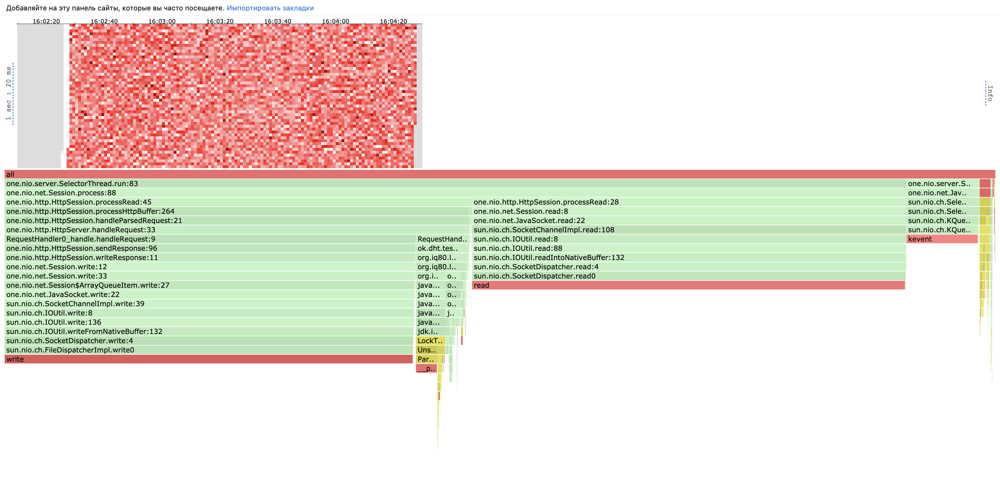
#### LIFO
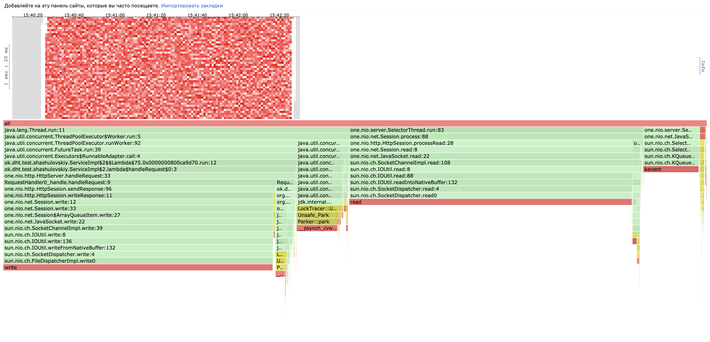

Как видим, здесь ситуация все еще такая же. Подробно происходящее я описывал в прошлом
отчете, но обратим внимание еще раз, что большая часть работы уходит на системные вызовы.
Оптимизировать мы тут мало что можем. Но из этого сравнения отлично видно почему
переход на использование отдельного пула обработчиков дает минимум прироста произовдительности:
мы действительно стали тратить меньше работы на обработку запросов, но в качестве платы получили накладные расходы
на синхронизацию в пуле между воркерами (7% !!)

Еще стоит заметить, что на хитмапе очень много белых или почти белых точек. Если рассмотреть что в них
происходит, то там мы почти всегда заняты либо чтением либо записью. Это в целом еще раз подтверждает что
мы сильно упираемся в системные вызовы.

### ALLOC

#### No Pool
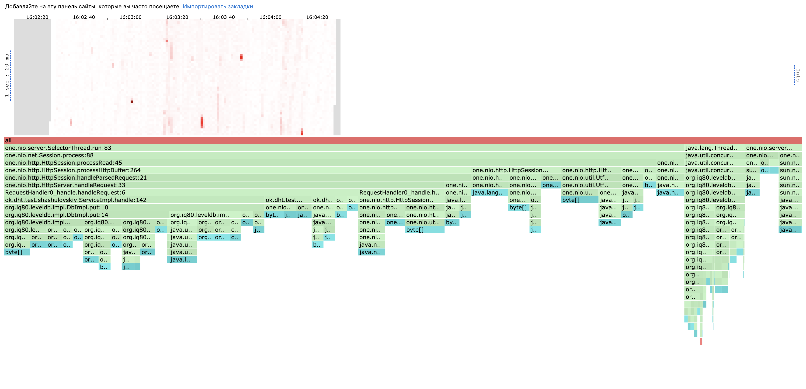
#### LIFO
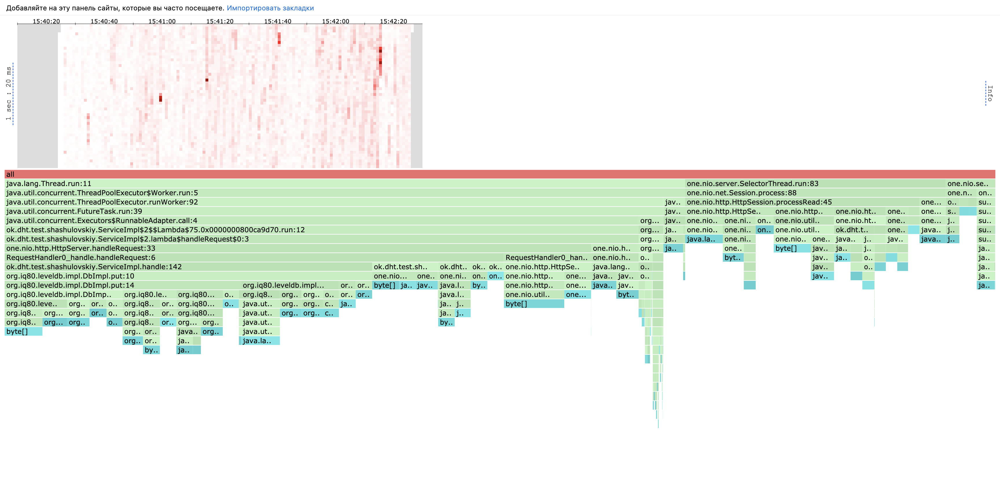

Сразу бросается в глаза то, что в реализации с пулом хитмап заметно более розовый, это значит что
мы делаем больше аллокаций. В целом, вид аллокаций которые мы совершаем практически не поменялся 
при добавлении пула. Единственное что бросается в глаза -- фоновые задачи по сжатию данных в 
LevelDB заняли сильно меньше в процентном соотношении: 2.5% в реалазации с пулом против
7.5% в реалиазции без пула.

### LOCK

#### No pool
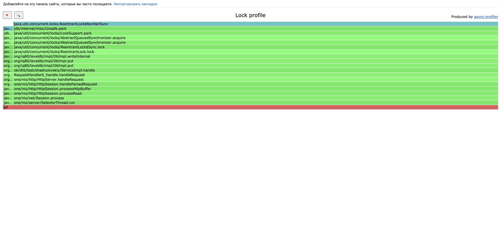
#### LIFO
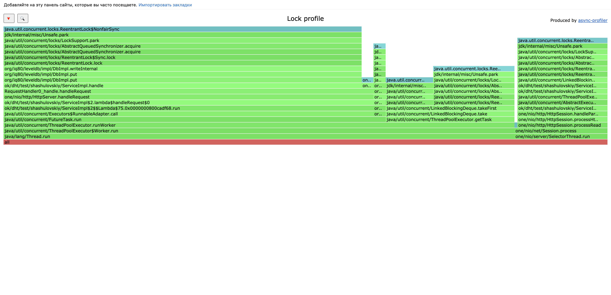

Здесь уже видна большая разница. В случае без пула мы почти не берем блокировок:
98% там занимают блокировки которые берут SelectorThread'ы. В случае с пулом же мы видим
большее разнообразие: больше всего блокировок теперь занимает синхронизация наших обработчиков запросов 
при записи в БД (61%) и около 21% блокировки на получение самих задач возникающих в очереди. Селекторы же
занимают всего 15%.

Понятно что мы сильно могли бы сократить число блокировок перейдя на лок фри алгоритмы.
Точно можно попробовать использовать lock-free очередь.

## GET

### CPU

#### No pool
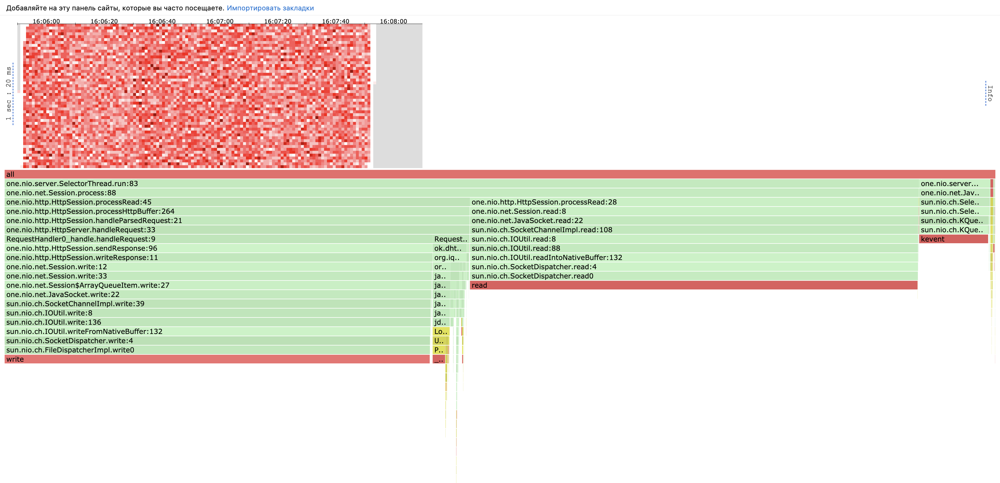
#### LIFO
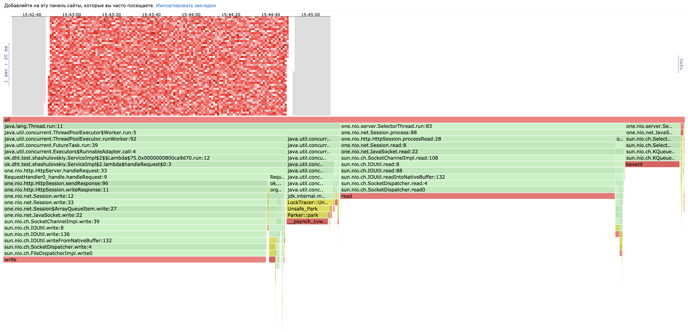

Здесь мы видим ситуацию абсолютно аналогичную запросам PUT. Большую часть занимают системные вызовы, работу по
получению из БД получилось сделать чуть меньше, но это стоило большого числа накладных расходов на синхронизацию и 
обработку очереди.

### ALLOC

#### No pool
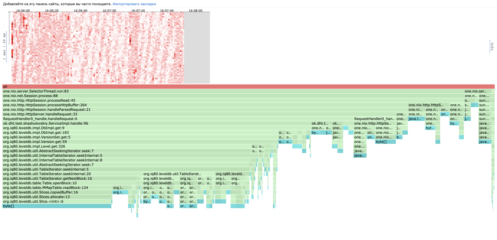
#### LIFO
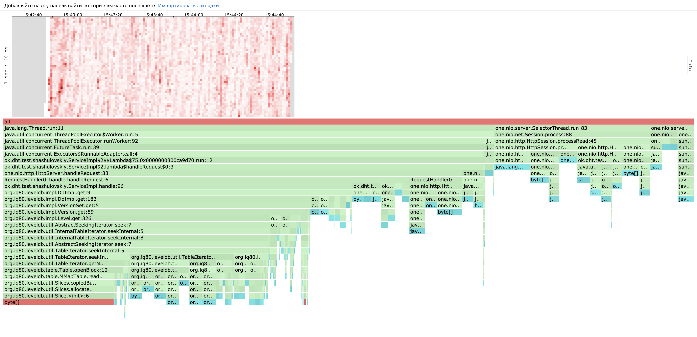

В отличие от PUT'а здесь мы видим похожий окрас хитмапа в обоих случаях, однако мне кажется,
что он немного темнее в случае отсутствия пула. Распределение аллокаций практически однаковоe, однако
в случае с пулом появляется совсем немного (2.5%) аллокаций на обработку задач в очереди.

### LOCK

#### No pool
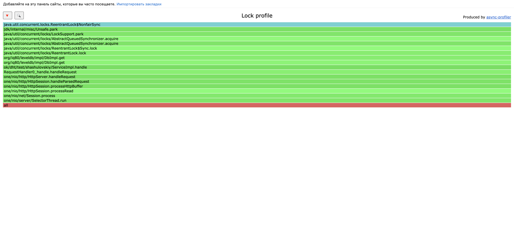
#### LIFO
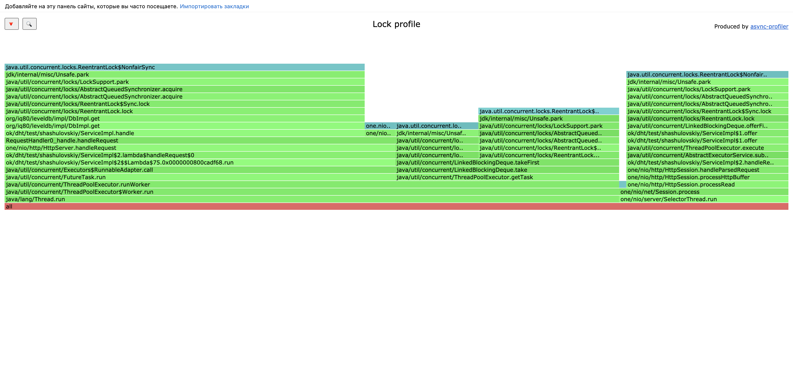

Здесь ситуация аналогична запросам PUT. В случае без пула все блокироки у нас делают селекторы,
а в случае с пулом селекторы также трятят всего 21%. Остальное же тратится на блокировки в бд и получения
задачи из очереди.

# Выводы

1. Несмотря на то, что нагрузочное тестирование показало прирост по RPS, мне кажется некоторую его часть
можно списать на погрешности измерения. Прирост есть, но не очень большой, так как большая часть времени у нас
уходила на системные вызовы. Мы пытаемся оптимизировать очень маленькую долю работы, но на ее оптимизацию ушло множество
накладных расходов на синхронизацию и поддержание очереди. 

2. Сильно возросло число взятых блокировок, однако тут ситуацию можно спасти lock free алгоритмами (которые могут
спокойно в целом добавить еще аллокаций и работы). База данных это все еще разделяемый ресурс и надо быть очень аккуратным 
с параллельными обращениями к ней.

3. При анализе политик поддержания очереди лучше всего себя показала LIFO очередь, но тут есть простор для 
роста в сторону эврестик (но опять же сильного прироста они не дадут)


В заключение хотелось бы написать еще свои мысли по поводу того, почему распараллеливание в этой части не может дать
большого выигрыша и почему разработчики one-nio - не глупые люди. Если заглянуть в код, библиотека выделяет на тред-пул 
столько потоков, сколько ядер есть на нашем процессоре. По сути, (по модулю гипертрединга) наше железо не может одновременно 
делать действией больше чем у нее есть ядер. Это значит, что создавая еще один тред пул под наши обработчики, мы эффективно 
переиспользуем ту же самую вычислительную мощность. Это значит, что, в общем, если селекторы не успевают справляться с обработкой 
запросов, то не справятся и воркеры которых мы насоздавали. Зато освободившиеся селекторы в промежутках когда им было выделено 
процессорное время успеют собрать целую очередь необработанных запросов, которую потом придется разгребать и решать те 
проблемы с честностью, о которых я писал выше, создавая этим накладные раходы (еще не учитывая расходы которые уходят на 
синхронизацию). Единственный способ выиграть от такой архитектуры - иметь в коде много пассивных ожиданий. Если в логику обработки 
нашего запроса входили бы такие долгие действия, как, например, поход в сеть - наши селекторы бы простаивали в то время когда 
они могли бы делать полезную работу. В таком случае было бы полезно подключить пул условных корутин и писать асинхронный код. 
В нашем же случаие операции довольно простые и соответственно дают выигрыш сопоставимый с накладными расходами на поддержание еще
одного пула потоков.
Мне стало интересно и я решил устроить самый страшный тест. Добавить в обработку запросов строчку `Thread.sleep(100)`. Как 
и ожидалось: реализация без пула смогла показать RPS в целых 96 запросов в секунду, а реализация с пулом на 1000 потоков - 608. 
Это очень притянутый за уши пример, но он отлично показывает ту ситуацию в которой использование пула потоков дает выигрыш.
