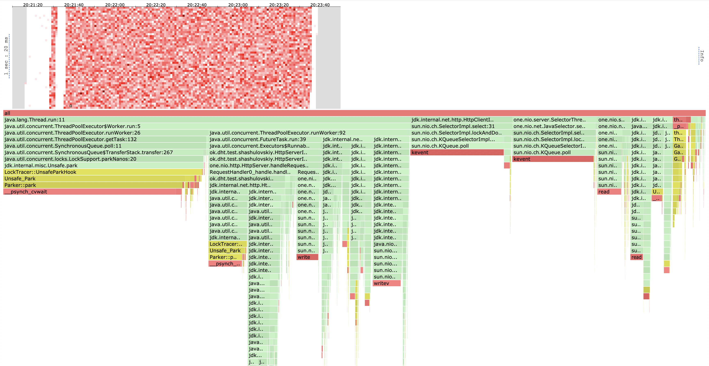
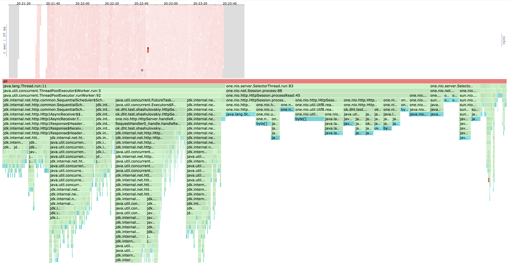
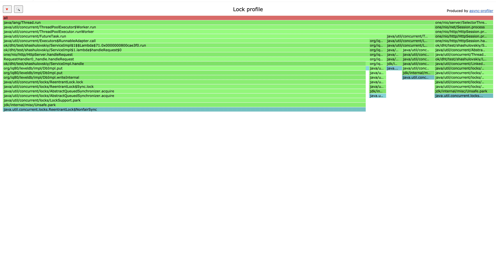
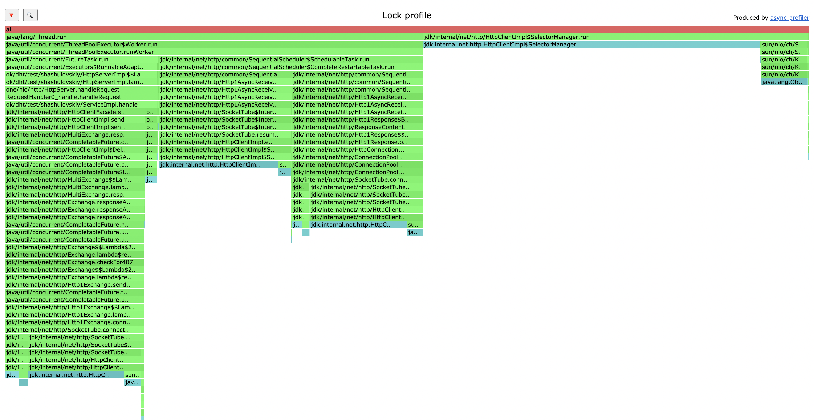
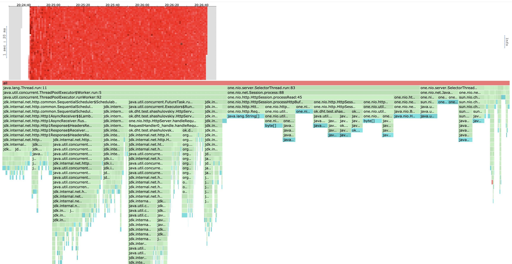
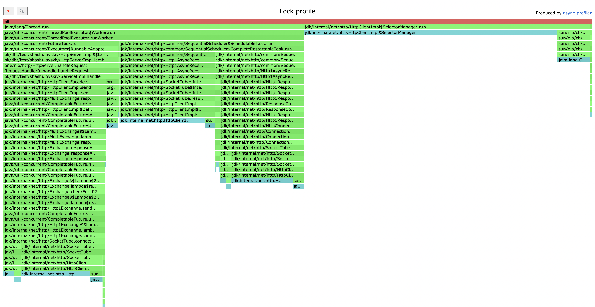

# Описание реализации и мои оптимизации
## Подход к шардированию
В задание было предложено реализовать один из подходов: consistent hashing, rendezvous hashing. 
Обсудим каждый из этих подходов.

1. Rendezvous Hashing: очень прост в реализации, поддерживает удаление/добавление новых шардов. При вычислении нужного 
шарда используются только простые операции, не надо много лезть в пямять, однако имеет ассимтотическую сложность, линейную от 
количества шардов. При хорошей хэш функции дает равномерное распределение ключей между нодами, однако не дает возможности 
гранулярной настройки в случае перевеса на одном из шардов
2. Consistent Hashing: при вычислении нужного шарда требует уже более сложных операций, в том числе требует поддерживать 
какую-то отсортированную структуру данных, позволяющую быстро искать нужный шард. Имеет уже логарифмическую ассимптотику. 
При маленьком количестве нод может очень легко получиться несбалансированное распределение ключей, поэтому я решил дополнительно 
реализовать оптимизацию с VNODES. Где для каждой ноды я поддерживаю несколько "виртуальных", ведущих на тот же самый шард.
Такой подход позволяет не только обеспечить более равномерную нагрузку, но и к тому же позволяет при желании разгрузить 
сильно нагруженные шарды, добавив рядом vnode'у другого шарда, перекинув часть нагрузки туда. Так же поддерживает добавление 
и удаление новых шардов.

Я решил использовать второй подход - так как он ассимтотически более быстрый и, что главное, 
позволяет регулировать нагрузку на каждый из шардов.

В своей первой реализации я использовал очевидное решение с TreeMap, однако по результатм профилироания получил большой 
оверхед на этот самый мап, поэтому решил хранить хэши в массиве примитивов, и делать бинпоиск уже по нему. С реализацией 
можно ознакомиться в соответствующем классе.

## Подход к хэшированию
Отдельно бы хотелось поговорить про получение хэша по ключу. Известно, что дефолтная хэш функция в джаве не самая оптимальная 
и ее можно легко сломать. Реализовав на ней свое решение я столкнулся с ужасными результатам. Так как мой скрипт генерирует 
по сути ключи вида "value" + $случайное число$, а названия шардов я положил равными shard + $номер шарда$ + $номер виртуальной ноды$,
распределение хэшей получалось очень не равномерным, и на двух шардах я получил перевес аж в 10 (!!) раз на первый шард. Это еще не 
учитывая тот факт, что можно специально подбирать ключи так, чтобы они имели одинаковый хэш. 

Я решил не исправлять то, что заведомо плохо работает, поэтому принял решение использовать MD5 хэш, оставляя от него последние 
64 бита для того, чтобы работать с лонгами. Такое решение уже без дополнительных махинаций, даже для практически идентичных 
строк дало на глаз не отличимое от нормального распределение (4%, статистически не значимо). При этом конечно же это решение 
далось ценой небольшой потери в производительности (как мы увидим далее при профилировании), однако, на мой взгляд, это стоит того, 
чтобы получить хорошее распределение данных между шардами.

## Подход к обработке случая нахождения записи на другом шарде
Каждая нода знает где находится любой ключ, причем эти знания дожны быть одинаковыми для всех нод, чтобы мы могли 
корректно отвечать на запросы пользователя. Соответственно, если ключ не у нас - надо проксировать запрос на нужную ноду. В 
задании мы договорились использовать протокол HTTP, однако, на мой взгляд, это решение сильно будет замедлять 
работу нашего сервиса, так как этот протокол очень избыточный и можно было использовать что-то более быстрое с меньшим 
кол-вом оверхеда, например GRPC, или даже свой низкоуровневый протокол, так как для внутренних запросов, где мы все сами 
контролируем, даже GRPC несет некоторый оверхед.

# Нагрузочное тестирование реализации

Сразу надо отметить, что наши тесты очень плохо будут отражать поведение сервиса, так как мы тестируем ноды, поднятые на 
одной машине. Времени здесь тратится на обмен данными минимум, поэтому "мысленно" можно раздувать время, которое тратится на 
пересылку сообщений, ведь когда мы поднимем реальные машины соединенные сетью, их общение по сети станет не только сильно дольше,
но и менее надежным.

Для тестирования я запустил 3 шарда, каждый на своей JVM, а также загрузил каждый из шардов данными примерно на 1 гигабайт, 
чтобы данные точно не влезли в оперативную память.

Сравнивать буду, как всегда, со старой однашардовой реализацией, так как хочется понять какие накладные расходы мы добавили и 
что за это получили. (Реализацию без шардирования я заполнил соответственно 3мя гигабайтами)

## PUT
Тестировать будем уже проверенным скриптом
```
request = function()
url = '/v0/entity?id=key' .. math.random(1, m)
body = 'value' .. math.random(1, 1000)

    return wrk.format("PUT", url, {}, body)
end
```
m положим равным 100000. В первом отчете мы выяснили что разницы большой в этом месте нет.

Сначала нащупаем оптимальный RPS. Запустим сначала на нагрузке в 100000 RPS

```
wrk2 -t 16 -c 64 -d 2m -R 100000 -L http://localhost:19234 -s load_testing_put.lua
Running 2m test @ http://localhost:19234
  16 threads and 64 connections
  Thread calibration: mean lat.: 135.379ms, rate sampling interval: 1170ms
  Thread calibration: mean lat.: 120.469ms, rate sampling interval: 1053ms
  Thread calibration: mean lat.: 109.003ms, rate sampling interval: 787ms
  Thread calibration: mean lat.: 133.111ms, rate sampling interval: 988ms
  Thread calibration: mean lat.: 278.440ms, rate sampling interval: 1577ms
  Thread calibration: mean lat.: 79.712ms, rate sampling interval: 522ms
  Thread calibration: mean lat.: 13.834ms, rate sampling interval: 81ms
  Thread calibration: mean lat.: 39.043ms, rate sampling interval: 306ms
  Thread calibration: mean lat.: 59.089ms, rate sampling interval: 484ms
  Thread calibration: mean lat.: 90.857ms, rate sampling interval: 505ms
  Thread calibration: mean lat.: 568.745ms, rate sampling interval: 4077ms
  Thread calibration: mean lat.: 76.239ms, rate sampling interval: 563ms
  Thread calibration: mean lat.: 14.187ms, rate sampling interval: 103ms
  Thread calibration: mean lat.: 840.282ms, rate sampling interval: 3700ms
  Thread calibration: mean lat.: 20.781ms, rate sampling interval: 124ms
  Thread calibration: mean lat.: 690.321ms, rate sampling interval: 4198ms
  Thread Stats   Avg      Stdev     Max   +/- Stdev
    Latency     3.61s     6.97s   35.00s    86.56%
    Req/Sec     1.91k     1.50k    8.68k    58.41%
  Latency Distribution (HdrHistogram - Recorded Latency)
 50.000%   80.58ms
 75.000%    3.37s 
 90.000%   14.42s 
 99.000%   30.56s 
 99.900%   34.34s 
 99.990%   34.96s 
 99.999%   35.00s 
100.000%   35.03s 

  Detailed Percentile spectrum:
       Value   Percentile   TotalCount 1/(1-Percentile)

       0.026     0.000000            1         1.00
       0.795     0.100000       344846         1.11
       1.201     0.200000       689753         1.25
       1.820     0.300000      1034218         1.43
       8.847     0.400000      1378903         1.67
      80.575     0.500000      1723547         2.00
     211.071     0.550000      1895974         2.22
     526.335     0.600000      2068242         2.50
    1241.087     0.650000      2240717         2.86
    2199.551     0.700000      2412938         3.33
    3373.055     0.750000      2585478         4.00
    4155.391     0.775000      2671555         4.44
    5173.247     0.800000      2757663         5.00
    6574.079     0.825000      2843897         5.71
    8757.247     0.850000      2930005         6.67
   11558.911     0.875000      3016305         8.00
   13099.007     0.887500      3059463         8.89
   14417.919     0.900000      3102413        10.00
   15622.143     0.912500      3145679        11.43
   17448.959     0.925000      3188809        13.33
   19234.815     0.937500      3231845        16.00
   20119.551     0.943750      3253321        17.78
   20938.751     0.950000      3275032        20.00
   21610.495     0.956250      3296410        22.86
   22839.295     0.962500      3317864        26.67
   24395.775     0.968750      3339343        32.00
   25067.519     0.971875      3350154        35.56
   25706.495     0.975000      3360867        40.00
   26230.783     0.978125      3371915        45.71
   26984.447     0.981250      3382658        53.33
   27705.343     0.984375      3393297        64.00
   28475.391     0.985938      3398627        71.11
   29310.975     0.987500      3404079        80.00
   30113.791     0.989062      3409356        91.43
   30932.991     0.990625      3414760       106.67
   31686.655     0.992188      3420138       128.00
   31981.567     0.992969      3422855       142.22
   32538.623     0.993750      3425570       160.00
   32866.303     0.994531      3428251       182.86
   33062.911     0.995313      3431018       213.33
   33275.903     0.996094      3433582       256.00
   33390.591     0.996484      3434946       284.44
   33456.127     0.996875      3436274       320.00
   33538.047     0.997266      3437649       365.71
   33751.039     0.997656      3439064       426.67
   33914.879     0.998047      3440392       512.00
   34013.183     0.998242      3441310       568.89
   34078.719     0.998437      3441873       640.00
   34144.255     0.998633      3442399       731.43
   34308.095     0.998828      3443255       853.33
   34340.863     0.999023      3443699      1024.00
   34373.631     0.999121      3444264      1137.78
   34406.399     0.999219      3444757      1280.00
   34406.399     0.999316      3444757      1462.86
   34471.935     0.999414      3445296      1706.67
   34504.703     0.999512      3445412      2048.00
   34570.239     0.999561      3445618      2275.56
   34603.007     0.999609      3445701      2560.00
   34701.311     0.999658      3445950      2925.71
   34766.847     0.999707      3446146      3413.33
   34799.615     0.999756      3446218      4096.00
   34832.383     0.999780      3446311      4551.11
   34865.151     0.999805      3446414      5120.00
   34897.919     0.999829      3446568      5851.43
   34897.919     0.999854      3446568      6826.67
   34930.687     0.999878      3446685      8192.00
   34930.687     0.999890      3446685      9102.22
   34963.455     0.999902      3446920     10240.00
   34963.455     0.999915      3446920     11702.86
   34963.455     0.999927      3446920     13653.33
   34963.455     0.999939      3446920     16384.00
   34963.455     0.999945      3446920     18204.44
   34963.455     0.999951      3446920     20480.00
   34963.455     0.999957      3446920     23405.71
   34963.455     0.999963      3446920     27306.67
   34996.223     0.999969      3447014     32768.00
   34996.223     0.999973      3447014     36408.89
   34996.223     0.999976      3447014     40960.00
   34996.223     0.999979      3447014     46811.43
   34996.223     0.999982      3447014     54613.33
   34996.223     0.999985      3447014     65536.00
   34996.223     0.999986      3447014     72817.78
   34996.223     0.999988      3447014     81920.00
   34996.223     0.999989      3447014     93622.86
   34996.223     0.999991      3447014    109226.67
   35028.991     0.999992      3447043    131072.00
   35028.991     1.000000      3447043          inf
#[Mean    =     3611.437, StdDeviation   =     6970.993]
#[Max     =    34996.224, Total count    =      3447043]
#[Buckets =           27, SubBuckets     =         2048]
----------------------------------------------------------
  3760994 requests in 2.00m, 220.41MB read
  Socket errors: connect 0, read 0, write 0, timeout 2671
Requests/sec:  31341.88
Transfer/sec:      1.84MB
```

Сервис выдержал RPS в 32000, однако мы видим 2671 сокет таймаутов, да и 75 персентиль уже занимает 3 секунд на ответ, мы 
сильно захлебываемся. Посмотрим что происходит на 30000 RPS

```
wrk2 -t 16 -c 64 -d 2m -R 30000 -L http://localhost:19234 -s load_testing_put.lua
Running 2m test @ http://localhost:19234
  16 threads and 64 connections
  Thread calibration: mean lat.: 3.945ms, rate sampling interval: 11ms
  Thread calibration: mean lat.: 8.344ms, rate sampling interval: 25ms
  Thread calibration: mean lat.: 5.088ms, rate sampling interval: 14ms
  Thread calibration: mean lat.: 5.979ms, rate sampling interval: 11ms
  Thread calibration: mean lat.: 7.465ms, rate sampling interval: 19ms
  Thread calibration: mean lat.: 5.804ms, rate sampling interval: 19ms
  Thread calibration: mean lat.: 5.218ms, rate sampling interval: 16ms
  Thread calibration: mean lat.: 5.951ms, rate sampling interval: 15ms
  Thread calibration: mean lat.: 5.342ms, rate sampling interval: 13ms
  Thread calibration: mean lat.: 4.707ms, rate sampling interval: 10ms
  Thread calibration: mean lat.: 4.751ms, rate sampling interval: 14ms
  Thread calibration: mean lat.: 9.397ms, rate sampling interval: 23ms
  Thread calibration: mean lat.: 4.033ms, rate sampling interval: 13ms
  Thread calibration: mean lat.: 5.194ms, rate sampling interval: 13ms
  Thread calibration: mean lat.: 3.134ms, rate sampling interval: 10ms
  Thread calibration: mean lat.: 4.864ms, rate sampling interval: 14ms
  Thread Stats   Avg      Stdev     Max   +/- Stdev
    Latency     5.95ms   24.25ms 865.79ms   95.57%
    Req/Sec     1.95k   675.87    11.30k    83.64%
  Latency Distribution (HdrHistogram - Recorded Latency)
 50.000%    1.12ms
 75.000%    1.70ms
 90.000%    8.94ms
 99.000%  103.04ms
 99.900%  322.56ms
 99.990%  679.42ms
 99.999%  840.19ms
100.000%  866.30ms

  Detailed Percentile spectrum:
       Value   Percentile   TotalCount 1/(1-Percentile)

       0.025     0.000000            2         1.00
       0.436     0.100000       330334         1.11
       0.623     0.200000       661356         1.25
       0.793     0.300000       990707         1.43
       0.958     0.400000      1320644         1.67
       1.122     0.500000      1651082         2.00
       1.205     0.550000      1815856         2.22
       1.292     0.600000      1980422         2.50
       1.389     0.650000      2145194         2.86
       1.509     0.700000      2310340         3.33
       1.698     0.750000      2474804         4.00
       1.870     0.775000      2557232         4.44
       2.199     0.800000      2639818         5.00
       2.857     0.825000      2722099         5.71
       3.933     0.850000      2804597         6.67
       5.727     0.875000      2887157         8.00
       7.107     0.887500      2928311         8.89
       8.935     0.900000      2969590        10.00
      11.431     0.912500      3010876        11.43
      14.807     0.925000      3052074        13.33
      19.519     0.937500      3093286        16.00
      22.543     0.943750      3113987        17.78
      26.191     0.950000      3134541        20.00
      30.655     0.956250      3155176        22.86
      36.191     0.962500      3175851        26.67
      43.263     0.968750      3196423        32.00
      47.615     0.971875      3206745        35.56
      52.671     0.975000      3217024        40.00
      58.783     0.978125      3227351        45.71
      66.495     0.981250      3237701        53.33
      76.095     0.984375      3247978        64.00
      81.983     0.985938      3253116        71.11
      88.831     0.987500      3258265        80.00
      97.151     0.989062      3263415        91.43
     107.327     0.990625      3268589       106.67
     119.615     0.992188      3273731       128.00
     127.039     0.992969      3276300       142.22
     135.807     0.993750      3278880       160.00
     146.303     0.994531      3281467       182.86
     159.231     0.995313      3284054       213.33
     175.359     0.996094      3286624       256.00
     185.855     0.996484      3287899       284.44
     197.887     0.996875      3289189       320.00
     212.351     0.997266      3290480       365.71
     228.735     0.997656      3291763       426.67
     249.087     0.998047      3293054       512.00
     261.375     0.998242      3293703       568.89
     274.687     0.998437      3294349       640.00
     289.023     0.998633      3294990       731.43
     304.895     0.998828      3295630       853.33
     325.119     0.999023      3296278      1024.00
     335.871     0.999121      3296599      1137.78
     347.903     0.999219      3296926      1280.00
     361.215     0.999316      3297242      1462.86
     375.039     0.999414      3297564      1706.67
     396.287     0.999512      3297888      2048.00
     407.807     0.999561      3298050      2275.56
     423.935     0.999609      3298208      2560.00
     447.231     0.999658      3298370      2925.71
     478.463     0.999707      3298530      3413.33
     513.535     0.999756      3298691      4096.00
     532.991     0.999780      3298775      4551.11
     550.399     0.999805      3298852      5120.00
     571.391     0.999829      3298933      5851.43
     609.791     0.999854      3299014      6826.67
     644.095     0.999878      3299094      8192.00
     663.551     0.999890      3299134      9102.22
     683.007     0.999902      3299174     10240.00
     702.975     0.999915      3299216     11702.86
     718.335     0.999927      3299255     13653.33
     739.839     0.999939      3299295     16384.00
     751.103     0.999945      3299315     18204.44
     763.391     0.999951      3299336     20480.00
     775.167     0.999957      3299356     23405.71
     787.455     0.999963      3299376     27306.67
     799.743     0.999969      3299396     32768.00
     806.399     0.999973      3299407     36408.89
     812.031     0.999976      3299416     40960.00
     818.687     0.999979      3299426     46811.43
     825.343     0.999982      3299436     54613.33
     830.463     0.999985      3299447     65536.00
     832.511     0.999986      3299452     72817.78
     835.583     0.999988      3299456     81920.00
     838.655     0.999989      3299461     93622.86
     842.239     0.999991      3299467    109226.67
     844.799     0.999992      3299471    131072.00
     846.847     0.999993      3299474    145635.56
     848.895     0.999994      3299477    163840.00
     850.943     0.999995      3299479    187245.71
     852.479     0.999995      3299482    218453.33
     854.527     0.999996      3299484    262144.00
     856.063     0.999997      3299485    291271.11
     856.575     0.999997      3299486    327680.00
     858.623     0.999997      3299488    374491.43
     859.647     0.999998      3299489    436906.67
     860.671     0.999998      3299490    524288.00
     861.183     0.999998      3299491    582542.22
     861.183     0.999998      3299491    655360.00
     862.719     0.999999      3299492    748982.86
     863.231     0.999999      3299493    873813.33
     863.231     0.999999      3299493   1048576.00
     864.767     0.999999      3299494   1165084.44
     864.767     0.999999      3299494   1310720.00
     864.767     0.999999      3299494   1497965.71
     865.279     0.999999      3299495   1747626.67
     865.279     1.000000      3299495   2097152.00
     865.279     1.000000      3299495   2330168.89
     865.279     1.000000      3299495   2621440.00
     865.279     1.000000      3299495   2995931.43
     866.303     1.000000      3299496   3495253.33
     866.303     1.000000      3299496          inf
#[Mean    =        5.951, StdDeviation   =       24.249]
#[Max     =      865.792, Total count    =      3299496]
#[Buckets =           27, SubBuckets     =         2048]
----------------------------------------------------------
  3599650 requests in 2.00m, 210.96MB read
Requests/sec:  29997.38
Transfer/sec:      1.76MB
```

Видим, что сервис отлично справляется с такой нагрузкой и держит latency около 100мс на 99 персентиле

Сравним с реализацией без шардирования, постреляем тем же RPSом:

```
wrk2 -t 16 -c 64 -d 2m -R 30000 -L http://localhost:19234 -s load_testing_put.lua
Running 2m test @ http://localhost:19234
  16 threads and 64 connections
  Thread calibration: mean lat.: 5.231ms, rate sampling interval: 22ms
  Thread calibration: mean lat.: 4.904ms, rate sampling interval: 21ms
  Thread calibration: mean lat.: 4.938ms, rate sampling interval: 20ms
  Thread calibration: mean lat.: 5.127ms, rate sampling interval: 22ms
  Thread calibration: mean lat.: 5.050ms, rate sampling interval: 21ms
  Thread calibration: mean lat.: 5.145ms, rate sampling interval: 22ms
  Thread calibration: mean lat.: 5.060ms, rate sampling interval: 21ms
  Thread calibration: mean lat.: 5.022ms, rate sampling interval: 21ms
  Thread calibration: mean lat.: 5.015ms, rate sampling interval: 21ms
  Thread calibration: mean lat.: 4.962ms, rate sampling interval: 20ms
  Thread calibration: mean lat.: 4.938ms, rate sampling interval: 21ms
  Thread calibration: mean lat.: 4.777ms, rate sampling interval: 20ms
  Thread calibration: mean lat.: 4.925ms, rate sampling interval: 21ms
  Thread calibration: mean lat.: 5.170ms, rate sampling interval: 22ms
  Thread calibration: mean lat.: 5.120ms, rate sampling interval: 22ms
  Thread calibration: mean lat.: 4.886ms, rate sampling interval: 20ms
  Thread Stats   Avg      Stdev     Max   +/- Stdev
    Latency     6.33ms    9.90ms 155.52ms   94.70%
    Req/Sec     1.92k   381.44     8.86k    74.03%
  Latency Distribution (HdrHistogram - Recorded Latency)
 50.000%    4.05ms
 75.000%    7.20ms
 90.000%   11.76ms
 99.000%   56.86ms
 99.900%  107.58ms
 99.990%  134.01ms
 99.999%  149.25ms
100.000%  155.65ms

  Detailed Percentile spectrum:
       Value   Percentile   TotalCount 1/(1-Percentile)

       0.024     0.000000            1         1.00
       0.853     0.100000       330535         1.11
       1.355     0.200000       660245         1.25
       2.239     0.300000       989995         1.43
       3.157     0.400000      1319867         1.67
       4.051     0.500000      1649693         2.00
       4.539     0.550000      1815323         2.22
       5.075     0.600000      1980641         2.50
       5.675     0.650000      2144549         2.86
       6.375     0.700000      2309966         3.33
       7.203     0.750000      2474457         4.00
       7.687     0.775000      2557257         4.44
       8.231     0.800000      2640124         5.00
       8.863     0.825000      2722596         5.71
       9.607     0.850000      2804944         6.67
      10.535     0.875000      2887126         8.00
      11.103     0.887500      2928594         8.89
      11.759     0.900000      2969561        10.00
      12.551     0.912500      3010820        11.43
      13.535     0.925000      3052058        13.33
      14.847     0.937500      3093041        16.00
      15.711     0.943750      3113793        17.78
      16.783     0.950000      3134455        20.00
      18.191     0.956250      3154939        22.86
      20.239     0.962500      3175610        26.67
      23.583     0.968750      3196184        32.00
      26.015     0.971875      3206448        35.56
      29.263     0.975000      3216783        40.00
      33.279     0.978125      3227098        45.71
      37.983     0.981250      3237431        53.33
      43.487     0.984375      3247712        64.00
      46.655     0.985938      3252855        71.11
      50.207     0.987500      3258012        80.00
      54.175     0.989062      3263161        91.43
      58.687     0.990625      3268308       106.67
      64.095     0.992188      3273460       128.00
      67.071     0.992969      3276037       142.22
      70.335     0.993750      3278658       160.00
      73.855     0.994531      3281209       182.86
      77.759     0.995313      3283802       213.33
      82.111     0.996094      3286363       256.00
      84.607     0.996484      3287664       284.44
      87.167     0.996875      3288953       320.00
      89.919     0.997266      3290235       365.71
      93.055     0.997656      3291510       426.67
      96.511     0.998047      3292808       512.00
      98.431     0.998242      3293439       568.89
     100.671     0.998437      3294085       640.00
     102.847     0.998633      3294728       731.43
     105.279     0.998828      3295370       853.33
     107.967     0.999023      3296029      1024.00
     109.503     0.999121      3296343      1137.78
     111.167     0.999219      3296661      1280.00
     112.895     0.999316      3296983      1462.86
     115.007     0.999414      3297311      1706.67
     117.311     0.999512      3297630      2048.00
     118.719     0.999561      3297789      2275.56
     119.999     0.999609      3297952      2560.00
     121.407     0.999658      3298107      2925.71
     123.071     0.999707      3298270      3413.33
     124.799     0.999756      3298431      4096.00
     125.823     0.999780      3298513      4551.11
     126.911     0.999805      3298589      5120.00
     128.255     0.999829      3298671      5851.43
     130.047     0.999854      3298751      6826.67
     131.967     0.999878      3298835      8192.00
     132.863     0.999890      3298874      9102.22
     134.271     0.999902      3298914     10240.00
     135.679     0.999915      3298952     11702.86
     137.215     0.999927      3298995     13653.33
     139.263     0.999939      3299032     16384.00
     140.031     0.999945      3299053     18204.44
     140.799     0.999951      3299073     20480.00
     141.823     0.999957      3299093     23405.71
     142.847     0.999963      3299113     27306.67
     143.743     0.999969      3299133     32768.00
     144.511     0.999973      3299145     36408.89
     144.895     0.999976      3299153     40960.00
     145.535     0.999979      3299163     46811.43
     146.943     0.999982      3299175     54613.33
     147.711     0.999985      3299184     65536.00
     148.351     0.999986      3299188     72817.78
     148.607     0.999988      3299193     81920.00
     148.863     0.999989      3299198     93622.86
     149.631     0.999991      3299204    109226.67
     150.399     0.999992      3299208    131072.00
     150.783     0.999993      3299211    145635.56
     151.167     0.999994      3299213    163840.00
     152.319     0.999995      3299216    187245.71
     152.703     0.999995      3299218    218453.33
     153.471     0.999996      3299221    262144.00
     153.599     0.999997      3299222    291271.11
     153.727     0.999997      3299223    327680.00
     154.111     0.999997      3299225    374491.43
     154.367     0.999998      3299227    436906.67
     154.367     0.999998      3299227    524288.00
     154.495     0.999998      3299228    582542.22
     154.495     0.999998      3299228    655360.00
     154.751     0.999999      3299229    748982.86
     155.135     0.999999      3299230    873813.33
     155.135     0.999999      3299230   1048576.00
     155.263     0.999999      3299231   1165084.44
     155.263     0.999999      3299231   1310720.00
     155.263     0.999999      3299231   1497965.71
     155.647     0.999999      3299233   1747626.67
     155.647     1.000000      3299233          inf
#[Mean    =        6.327, StdDeviation   =        9.898]
#[Max     =      155.520, Total count    =      3299233]
#[Buckets =           27, SubBuckets     =         2048]
----------------------------------------------------------
  3599619 requests in 2.00m, 230.00MB read
Requests/sec:  29997.66
Transfer/sec:      1.92MB
```


Как видим, уже на 99 персентиле реализация с шардированием начинает 
показывать большую latency, с чем это точно связано мы посмотрим при профилировании, но понятно, 
что при шардировании мы имеем много накладных расходов которые повышают время ответа сервиса.
По модулю в три раза большей БД, реализация без шардирования выполняет эффективно ту же самую работу, но при 
этом не ходит на другую ноду, трятя на это работу.

## GET
Аналогично сначала нащупаем оптимальный RPS. Запустим сначала на нагрузке в 100000 RPS, стрелять будем по тому же 
диапазону ключей, что мы делали PUT перед этим.

```
wrk2 -t 16 -c 64 -d 2m -R 100000 -L http://localhost:19234 -s load_testing_get.lua
Running 2m test @ http://localhost:19234
  16 threads and 64 connections
  Thread calibration: mean lat.: 600.325ms, rate sampling interval: 4558ms
  Thread calibration: mean lat.: 23.761ms, rate sampling interval: 164ms
  Thread calibration: mean lat.: 233.905ms, rate sampling interval: 1804ms
  Thread calibration: mean lat.: 61.392ms, rate sampling interval: 446ms
  Thread calibration: mean lat.: 56.485ms, rate sampling interval: 429ms
  Thread calibration: mean lat.: 93.820ms, rate sampling interval: 675ms
  Thread calibration: mean lat.: 35.064ms, rate sampling interval: 194ms
  Thread calibration: mean lat.: 2129.384ms, rate sampling interval: 12304ms
  Thread calibration: mean lat.: 114.869ms, rate sampling interval: 892ms
  Thread calibration: mean lat.: 432.406ms, rate sampling interval: 3076ms
  Thread calibration: mean lat.: 476.930ms, rate sampling interval: 1738ms
  Thread calibration: mean lat.: 1493.141ms, rate sampling interval: 4640ms
  Thread calibration: mean lat.: 8.738ms, rate sampling interval: 55ms
  Thread calibration: mean lat.: 10.081ms, rate sampling interval: 56ms
  Thread calibration: mean lat.: 188.800ms, rate sampling interval: 1754ms
  Thread calibration: mean lat.: 498.795ms, rate sampling interval: 791ms
  Thread Stats   Avg      Stdev     Max   +/- Stdev
    Latency    11.92s    17.74s    1.01m    80.11%
    Req/Sec     1.69k     1.81k    9.68k    82.44%
  Latency Distribution (HdrHistogram - Recorded Latency)
 50.000%  571.90ms
 75.000%   21.10s 
 90.000%   44.11s 
 99.000%    0.94m 
 99.900%    1.00m 
 99.990%    1.01m 
 99.999%    1.01m 
100.000%    1.01m 

  Detailed Percentile spectrum:
       Value   Percentile   TotalCount 1/(1-Percentile)

       0.028     0.000000            2         1.00
       0.820     0.100000       350441         1.11
       1.280     0.200000       699908         1.25
       2.467     0.300000      1049295         1.43
      48.479     0.400000      1399073         1.67
     571.903     0.500000      1748807         2.00
    1305.599     0.550000      1923704         2.22
    3432.447     0.600000      2098548         2.50
    7839.743     0.650000      2273454         2.86
   13975.551     0.700000      2448454         3.33
   21102.591     0.750000      2623208         4.00
   25657.343     0.775000      2710722         4.44
   29523.967     0.800000      2798283         5.00
   33193.983     0.825000      2885616         5.71
   36798.463     0.850000      2972927         6.67
   40206.335     0.875000      3061306         8.00
   42270.719     0.887500      3104556         8.89
   44105.727     0.900000      3148053        10.00
   45907.967     0.912500      3191752        11.43
   47513.599     0.925000      3235474        13.33
   49676.287     0.937500      3279079        16.00
   50855.935     0.943750      3301092        17.78
   51642.367     0.950000      3322749        20.00
   52592.639     0.956250      3345117        22.86
   53444.607     0.962500      3366705        26.67
   54001.663     0.968750      3389830        32.00
   54231.039     0.971875      3399352        35.56
   54493.183     0.975000      3410392        40.00
   54853.631     0.978125      3421508        45.71
   55148.543     0.981250      3431989        53.33
   55443.455     0.984375      3443335        64.00
   55574.527     0.985938      3448377        71.11
   55738.367     0.987500      3454563        80.00
   56000.511     0.989062      3459404        91.43
   56360.959     0.990625      3464784       106.67
   56786.943     0.992188      3470732       128.00
   56918.015     0.992969      3473165       142.22
   57147.391     0.993750      3475713       160.00
   57442.303     0.994531      3478541       182.86
   57638.911     0.995313      3481174       213.33
   57901.055     0.996094      3483882       256.00
   58032.127     0.996484      3485232       284.44
   58195.967     0.996875      3486750       320.00
   58392.575     0.997266      3487982       365.71
   58621.951     0.997656      3489343       426.67
   59047.935     0.998047      3490755       512.00
   59310.079     0.998242      3491475       568.89
   59539.455     0.998437      3492286       640.00
   59604.991     0.998633      3492752       731.43
   59736.063     0.998828      3493567       853.33
   59867.135     0.999023      3494211      1024.00
   59932.671     0.999121      3494526      1137.78
   59998.207     0.999219      3495000      1280.00
   60030.975     0.999316      3495163      1462.86
   60129.279     0.999414      3495571      1706.67
   60194.815     0.999512      3495880      2048.00
   60227.583     0.999561      3496170      2275.56
   60227.583     0.999609      3496170      2560.00
   60260.351     0.999658      3496489      2925.71
   60293.119     0.999707      3496690      3413.33
   60293.119     0.999756      3496690      4096.00
   60325.887     0.999780      3496899      4551.11
   60325.887     0.999805      3496899      5120.00
   60358.655     0.999829      3497030      5851.43
   60358.655     0.999854      3497030      6826.67
   60391.423     0.999878      3497119      8192.00
   60424.191     0.999890      3497213      9102.22
   60424.191     0.999902      3497213     10240.00
   60456.959     0.999915      3497328     11702.86
   60456.959     0.999927      3497328     13653.33
   60456.959     0.999939      3497328     16384.00
   60456.959     0.999945      3497328     18204.44
   60489.727     0.999951      3497401     20480.00
   60489.727     0.999957      3497401     23405.71
   60489.727     0.999963      3497401     27306.67
   60522.495     0.999969      3497475     32768.00
   60522.495     0.999973      3497475     36408.89
   60522.495     0.999976      3497475     40960.00
   60522.495     0.999979      3497475     46811.43
   60522.495     0.999982      3497475     54613.33
   60522.495     0.999985      3497475     65536.00
   60522.495     0.999986      3497475     72817.78
   60555.263     0.999988      3497519     81920.00
   60555.263     1.000000      3497519          inf
#[Mean    =    11916.323, StdDeviation   =    17742.620]
#[Max     =    60522.496, Total count    =      3497519]
#[Buckets =           27, SubBuckets     =         2048]
----------------------------------------------------------
  3815006 requests in 2.00m, 246.50MB read
  Socket errors: connect 0, read 0, write 0, timeout 2724
  Non-2xx or 3xx responses: 42773
Requests/sec:  31792.06
Transfer/sec:      2.05MB
```

Здесь мы выдерживаем похожий RPS в 32000, ошибки в запросах 404, так как не все ключие есть в нашей базе.
Значит наш рабочий RPS опять же около 30000, будем смотреть что просходит на нем.

```
wrk2 -t 16 -c 64 -d 2m -R 30000 -L http://localhost:19234 -s load_testing_get.lua
Running 2m test @ http://localhost:19234
  16 threads and 64 connections
  Thread calibration: mean lat.: 3.161ms, rate sampling interval: 10ms
  Thread calibration: mean lat.: 3.088ms, rate sampling interval: 10ms
  Thread calibration: mean lat.: 3.087ms, rate sampling interval: 10ms
  Thread calibration: mean lat.: 2.673ms, rate sampling interval: 10ms
  Thread calibration: mean lat.: 3.259ms, rate sampling interval: 10ms
  Thread calibration: mean lat.: 2.451ms, rate sampling interval: 10ms
  Thread calibration: mean lat.: 3.788ms, rate sampling interval: 10ms
  Thread calibration: mean lat.: 2.775ms, rate sampling interval: 10ms
  Thread calibration: mean lat.: 4.168ms, rate sampling interval: 11ms
  Thread calibration: mean lat.: 2.765ms, rate sampling interval: 10ms
  Thread calibration: mean lat.: 2.712ms, rate sampling interval: 10ms
  Thread calibration: mean lat.: 2.976ms, rate sampling interval: 10ms
  Thread calibration: mean lat.: 2.525ms, rate sampling interval: 10ms
  Thread calibration: mean lat.: 3.400ms, rate sampling interval: 10ms
  Thread calibration: mean lat.: 3.229ms, rate sampling interval: 10ms
  Thread calibration: mean lat.: 3.327ms, rate sampling interval: 10ms
  Thread Stats   Avg      Stdev     Max   +/- Stdev
    Latency     2.87ms    9.84ms 291.84ms   96.14%
    Req/Sec     1.98k   534.15    12.22k    85.43%
  Latency Distribution (HdrHistogram - Recorded Latency)
 50.000%    1.07ms
 75.000%    1.52ms
 90.000%    3.68ms
 99.000%   45.28ms
 99.900%  135.17ms
 99.990%  219.90ms
 99.999%  264.45ms
100.000%  292.10ms

  Detailed Percentile spectrum:
       Value   Percentile   TotalCount 1/(1-Percentile)

       0.026     0.000000            1         1.00
       0.419     0.100000       330869         1.11
       0.597     0.200000       660763         1.25
       0.759     0.300000       990021         1.43
       0.915     0.400000      1320130         1.67
       1.071     0.500000      1651100         2.00
       1.149     0.550000      1816116         2.22
       1.228     0.600000      1980830         2.50
       1.311     0.650000      2145622         2.86
       1.404     0.700000      2310895         3.33
       1.519     0.750000      2474560         4.00
       1.597     0.775000      2557701         4.44
       1.703     0.800000      2639995         5.00
       1.865     0.825000      2722282         5.71
       2.159     0.850000      2804640         6.67
       2.723     0.875000      2887070         8.00
       3.135     0.887500      2928297         8.89
       3.681     0.900000      2969508        10.00
       4.411     0.912500      3010676        11.43
       5.399     0.925000      3051943        13.33
       6.907     0.937500      3093221        16.00
       7.911     0.943750      3113777        17.78
       9.223     0.950000      3134391        20.00
      10.919     0.956250      3155052        22.86
      13.159     0.962500      3175629        26.67
      16.191     0.968750      3196265        32.00
      18.159     0.971875      3206575        35.56
      20.495     0.975000      3216850        40.00
      23.423     0.978125      3227200        45.71
      27.103     0.981250      3237482        53.33
      31.935     0.984375      3247785        64.00
      34.911     0.985938      3252953        71.11
      38.399     0.987500      3258120        80.00
      42.463     0.989062      3263280        91.43
      47.359     0.990625      3268419       106.67
      53.407     0.992188      3273586       128.00
      56.959     0.992969      3276142       142.22
      61.055     0.993750      3278725       160.00
      65.727     0.994531      3281305       182.86
      71.487     0.995313      3283881       213.33
      78.655     0.996094      3286469       256.00
      82.879     0.996484      3287736       284.44
      87.743     0.996875      3289036       320.00
      93.439     0.997266      3290319       365.71
      99.711     0.997656      3291601       426.67
     107.455     0.998047      3292889       512.00
     112.063     0.998242      3293542       568.89
     116.927     0.998437      3294184       640.00
     122.431     0.998633      3294823       731.43
     128.703     0.998828      3295470       853.33
     136.191     0.999023      3296113      1024.00
     140.799     0.999121      3296437      1137.78
     146.175     0.999219      3296755      1280.00
     151.551     0.999316      3297077      1462.86
     157.439     0.999414      3297401      1706.67
     164.351     0.999512      3297723      2048.00
     168.063     0.999561      3297884      2275.56
     172.415     0.999609      3298046      2560.00
     177.919     0.999658      3298206      2925.71
     184.319     0.999707      3298368      3413.33
     191.999     0.999756      3298527      4096.00
     196.095     0.999780      3298608      4551.11
     200.575     0.999805      3298688      5120.00
     205.183     0.999829      3298769      5851.43
     209.663     0.999854      3298850      6826.67
     214.655     0.999878      3298931      8192.00
     217.087     0.999890      3298970      9102.22
     220.287     0.999902      3299011     10240.00
     223.487     0.999915      3299051     11702.86
     228.351     0.999927      3299091     13653.33
     233.215     0.999939      3299131     16384.00
     235.903     0.999945      3299153     18204.44
     238.591     0.999951      3299171     20480.00
     242.687     0.999957      3299192     23405.71
     245.759     0.999963      3299212     27306.67
     249.215     0.999969      3299235     32768.00
     250.751     0.999973      3299244     36408.89
     252.415     0.999976      3299252     40960.00
     254.207     0.999979      3299262     46811.43
     256.511     0.999982      3299273     54613.33
     259.327     0.999985      3299282     65536.00
     260.863     0.999986      3299289     72817.78
     262.655     0.999988      3299295     81920.00
     263.423     0.999989      3299297     93622.86
     264.959     0.999991      3299303    109226.67
     267.007     0.999992      3299308    131072.00
     268.287     0.999993      3299310    145635.56
     269.055     0.999994      3299312    163840.00
     270.847     0.999995      3299316    187245.71
     271.359     0.999995      3299317    218453.33
     273.407     0.999996      3299320    262144.00
     274.687     0.999997      3299321    291271.11
     275.455     0.999997      3299322    327680.00
     277.503     0.999997      3299324    374491.43
     278.527     0.999998      3299325    436906.67
     280.319     0.999998      3299326    524288.00
     282.367     0.999998      3299327    582542.22
     282.367     0.999998      3299327    655360.00
     284.159     0.999999      3299328    748982.86
     285.951     0.999999      3299329    873813.33
     285.951     0.999999      3299329   1048576.00
     287.999     0.999999      3299330   1165084.44
     287.999     0.999999      3299330   1310720.00
     287.999     0.999999      3299330   1497965.71
     290.047     0.999999      3299331   1747626.67
     290.047     1.000000      3299331   2097152.00
     290.047     1.000000      3299331   2330168.89
     290.047     1.000000      3299331   2621440.00
     290.047     1.000000      3299331   2995931.43
     292.095     1.000000      3299332   3495253.33
     292.095     1.000000      3299332          inf
#[Mean    =        2.870, StdDeviation   =        9.837]
#[Max     =      291.840, Total count    =      3299332]
#[Buckets =           27, SubBuckets     =         2048]
----------------------------------------------------------
  3599698 requests in 2.00m, 231.80MB read
  Non-2xx or 3xx responses: 186854
Requests/sec:  29997.71
Transfer/sec:      1.93MB
```

Здесь видим latency лучше чем на PUT'е, 45мс на 99 персентиле и "всего" 300 на сотом. Ошибки опять же все 404ые из-за того,
что не все ключи по которым мы стреляем есть в базе.

Сравним с реализацией без шардирования, постреляем тем же RPSом:

```
wrk2 -t 16 -c 64 -d 2m -R 30000 -L http://localhost:19234 -s load_testing_get.lua
Running 2m test @ http://localhost:19234
  16 threads and 64 connections
  Thread calibration: mean lat.: 4.250ms, rate sampling interval: 17ms
  Thread calibration: mean lat.: 4.655ms, rate sampling interval: 17ms
  Thread calibration: mean lat.: 4.620ms, rate sampling interval: 18ms
  Thread calibration: mean lat.: 5.308ms, rate sampling interval: 18ms
  Thread calibration: mean lat.: 3.813ms, rate sampling interval: 16ms
  Thread calibration: mean lat.: 3.999ms, rate sampling interval: 16ms
  Thread calibration: mean lat.: 4.078ms, rate sampling interval: 17ms
  Thread calibration: mean lat.: 3.855ms, rate sampling interval: 16ms
  Thread calibration: mean lat.: 3.813ms, rate sampling interval: 15ms
  Thread calibration: mean lat.: 4.298ms, rate sampling interval: 18ms
  Thread calibration: mean lat.: 4.049ms, rate sampling interval: 16ms
  Thread calibration: mean lat.: 4.656ms, rate sampling interval: 18ms
  Thread calibration: mean lat.: 4.261ms, rate sampling interval: 17ms
  Thread calibration: mean lat.: 4.666ms, rate sampling interval: 17ms
  Thread calibration: mean lat.: 4.616ms, rate sampling interval: 17ms
  Thread calibration: mean lat.: 4.140ms, rate sampling interval: 16ms
  Thread Stats   Avg      Stdev     Max   +/- Stdev
    Latency     5.04ms    6.69ms 167.42ms   91.67%
    Req/Sec     1.93k   401.86     9.53k    72.45%
  Latency Distribution (HdrHistogram - Recorded Latency)
 50.000%    3.28ms
 75.000%    6.15ms
 90.000%   10.71ms
 99.000%   31.18ms
 99.900%   77.76ms
 99.990%  110.72ms
 99.999%  128.90ms
100.000%  167.55ms

  Detailed Percentile spectrum:
       Value   Percentile   TotalCount 1/(1-Percentile)

       0.028     0.000000            2         1.00
       0.771     0.100000       330118         1.11
       1.187     0.200000       660268         1.25
       1.712     0.300000       989974         1.43
       2.481     0.400000      1320249         1.67
       3.279     0.500000      1650419         2.00
       3.701     0.550000      1815166         2.22
       4.167     0.600000      1980867         2.50
       4.699     0.650000      2144795         2.86
       5.347     0.700000      2310159         3.33
       6.151     0.750000      2474851         4.00
       6.635     0.775000      2557299         4.44
       7.187     0.800000      2639581         5.00
       7.827     0.825000      2722111         5.71
       8.591     0.850000      2804506         6.67
       9.527     0.875000      2887590         8.00
      10.071     0.887500      2928253         8.89
      10.711     0.900000      2969901        10.00
      11.455     0.912500      3011023        11.43
      12.335     0.925000      3052002        13.33
      13.431     0.937500      3093218        16.00
      14.087     0.943750      3113902        17.78
      14.847     0.950000      3134576        20.00
      15.743     0.956250      3155095        22.86
      16.847     0.962500      3175814        26.67
      18.239     0.968750      3196483        32.00
      19.071     0.971875      3206641        35.56
      20.095     0.975000      3217068        40.00
      21.327     0.978125      3227278        45.71
      22.863     0.981250      3237587        53.33
      24.895     0.984375      3247907        64.00
      26.223     0.985938      3253069        71.11
      27.839     0.987500      3258179        80.00
      29.743     0.989062      3263371        91.43
      32.287     0.990625      3268507       106.67
      35.615     0.992188      3273644       128.00
      37.567     0.992969      3276218       142.22
      39.871     0.993750      3278800       160.00
      42.623     0.994531      3281397       182.86
      45.983     0.995313      3283955       213.33
      50.079     0.996094      3286543       256.00
      52.287     0.996484      3287829       284.44
      54.719     0.996875      3289113       320.00
      57.503     0.997266      3290392       365.71
      60.639     0.997656      3291694       426.67
      64.031     0.998047      3292976       512.00
      66.239     0.998242      3293626       568.89
      68.735     0.998437      3294264       640.00
      71.743     0.998633      3294906       731.43
      74.943     0.998828      3295561       853.33
      78.143     0.999023      3296195      1024.00
      80.255     0.999121      3296516      1137.78
      82.559     0.999219      3296837      1280.00
      85.759     0.999316      3297162      1462.86
      88.959     0.999414      3297479      1706.67
      92.095     0.999512      3297802      2048.00
      93.823     0.999561      3297966      2275.56
      95.679     0.999609      3298127      2560.00
      97.727     0.999658      3298288      2925.71
      99.903     0.999707      3298452      3413.33
     102.207     0.999756      3298607      4096.00
     103.359     0.999780      3298692      4551.11
     104.511     0.999805      3298772      5120.00
     105.727     0.999829      3298851      5851.43
     107.263     0.999854      3298930      6826.67
     108.927     0.999878      3299011      8192.00
     110.015     0.999890      3299051      9102.22
     110.975     0.999902      3299092     10240.00
     112.063     0.999915      3299131     11702.86
     113.023     0.999927      3299171     13653.33
     114.367     0.999939      3299212     16384.00
     114.751     0.999945      3299233     18204.44
     115.263     0.999951      3299252     20480.00
     116.223     0.999957      3299274     23405.71
     117.311     0.999963      3299292     27306.67
     118.655     0.999969      3299314     32768.00
     119.103     0.999973      3299322     36408.89
     120.127     0.999976      3299333     40960.00
     120.831     0.999979      3299343     46811.43
     121.855     0.999982      3299352     54613.33
     123.583     0.999985      3299362     65536.00
     125.119     0.999986      3299367     72817.78
     126.719     0.999988      3299372     81920.00
     127.423     0.999989      3299377     93622.86
     129.471     0.999991      3299382    109226.67
     130.879     0.999992      3299387    131072.00
     131.711     0.999993      3299390    145635.56
     132.607     0.999994      3299392    163840.00
     134.399     0.999995      3299395    187245.71
     137.343     0.999995      3299397    218453.33
     143.359     0.999996      3299400    262144.00
     145.407     0.999997      3299401    291271.11
     147.455     0.999997      3299402    327680.00
     151.551     0.999997      3299404    374491.43
     153.599     0.999998      3299405    436906.67
     155.519     0.999998      3299406    524288.00
     157.567     0.999998      3299407    582542.22
     157.567     0.999998      3299407    655360.00
     159.487     0.999999      3299408    748982.86
     161.663     0.999999      3299409    873813.33
     161.663     0.999999      3299409   1048576.00
     163.583     0.999999      3299410   1165084.44
     163.583     0.999999      3299410   1310720.00
     163.583     0.999999      3299410   1497965.71
     165.503     0.999999      3299411   1747626.67
     165.503     1.000000      3299411   2097152.00
     165.503     1.000000      3299411   2330168.89
     165.503     1.000000      3299411   2621440.00
     165.503     1.000000      3299411   2995931.43
     167.551     1.000000      3299412   3495253.33
     167.551     1.000000      3299412          inf
#[Mean    =        5.038, StdDeviation   =        6.686]
#[Max     =      167.424, Total count    =      3299412]
#[Buckets =           27, SubBuckets     =         2048]
----------------------------------------------------------
  3599693 requests in 2.00m, 239.78MB read
  Non-2xx or 3xx responses: 186854
Requests/sec:  29997.45
Transfer/sec:      2.00MB
```


Здесь разница уже не такая большая, однако она все же есть. Мы имеем дело со всем теми же накладными расходами на шардирование,
на которые мы будем смотреть в секции профилирования

# Профилирование через async-profiler
## PUT
### CPU
#### Реализация без шардирования

#### Реализация с шардированием (Главная нода)


Из этого сравнения уже становится наглядно понятно с чем связан рост latency в ответах. 

15% работы ушло у нас на то, чтобы отправить запрос на другой шард и дождаться от него ответа, это очень 
большая цифра. Тут еще нужно учесть, что запросы посылались по локальной сети на 1 машине, и даже если ноды будут расположены в одном 
датацентре, это время станет еще больше. Из flamegraph'а видно что использование HTTP клиента и HTTP протокола в целом 
несет очень большие расходы. В этом месте точно нужно использовать либо GRPC либо, еще лучше, сапописный протокол поверх UDP, 
заточенный максимально на пересылаемые нами данные.

Наше вычисление шарда занимает всего 0.22% работы после моих оптимизаций которые я описывал в самом начале отчета. 
Около половины этого времени (0.09%) занимает получение MD5 хэша, конечно тут можно было бы использовать более быстрый хэш,
но время на его вычисление занимает ничтожно мало, зато мы бы сильно проиграли бы в равномерности распределения. Остальное 
занимает бинпоиск по массиву, тут улучшать уже нечего.

Работы levelDB на нашем шарде на графике даже не видно, по сравению с HTTP запросом, приходится искать. Связано это в том числе с тем,
что наша база данных в данном случае в 3 раза меньше, так как равномерно "размазана" между шардами.

Еще бросается в глаза огромный кусок с park'ом на SynchonousQueue. Это очередь также используется под копотом в HttpClient'е,
блокировки на ней занимают 28% нашей работы. Тоже неоптимальный кусок.

Вывод: шардирование дало нам гигантский накладной расход в виде общения по сети между шардами, однако дало 
сравнимо небольшой выигрыш по времени работы БД, т.к ее обьем стал меньше в силу ее распределенности.
Исправляется это сменой протокола по которому мы общаемся, либо же использованием более простого и оптимального 
HttpClient'а, это бы уже дало большой выигрыш.

### ALLOC
#### Реализация без шардирования

#### Реализация с шардированием (Главная нода)


При взгляде на второй flamegraph сразу бросается в глаза огромный кусок аллокаций (44% !!), который уходит на отправление
и получение HTTP запроса, что еще раз показывает неоптимальность решения использования тут HTTP. Аналогично помогло бы 
использование кастномного HTTP клиента, который будет менее функциональный, однако будет делать меньше аллокаций, так как 
дефолтный джавовский делает их практически на что угодно.

Опять же бросается в глаза то, что мы стали использовать меньше аллокаций на работу самой БД, так как она стала сильно меньше.

### Lock
#### Реализация без шардирования

#### Реализация с шардированием (Главная нода)


На первой картинке мы видим, что большую часть заняли блокировки на PUT в нашу БД, однако же,
на второй я их ели нашел, т.к они занимают всего 1.5%. Это связано с тем, что во-первых элементарно нагрузка на БД 
стала в 3 раза меньше, а во-вторых появился огромный кусок блокировок для HTTP сервера (около 50%).

Это уже в 3 раз доказывает неоптимальность использования тут данного HttpServer'а.

## GET
### CPU
#### Реализация без шардирования

#### Реализация с шардированием (Главная нода)

Здесь ситуация абсолютно аналогичная PUT'у, flamegraph'ы даже практически изоморфны, по модулю 
операций по скип листу в GET реализации LevelDB. Выводы те же самые: Http Client сильно нам испортил жизнь.

### ALLOC
#### Реализация без шардирования

#### Реализация с шардированием (Главная нода)

Опять же тут мы имеем дело с ситуацией, абсолютно аналогичной PUT'у, поэтому выводы те же.

### LOCK
#### Реализация без шардирования

#### Реализация с шардированием (Главная нода)

И в очередной раз мы видим, изоморфную PUT'у картинку, выводы те же

# Глобальные выводы
1. Основная цель шардирования - снизить нагрузку на базу данных, позволить горизонтальное маштабирование. 
С этой задачей мы полностью справились. С тремя шардами, размер базы данных на каждом стал в три раза меньше, что 
сильно уменьшило нагрузку. Учитывая, что в реальном мире все запросы будут посылаться не на одну ноду, а примерно на все, 
мы бы получили еще более размазанную равномерную нагрузку. С достижением этой цели нам бы помогло что-то в духе гео балансера,
направляя трафик с разных регионов в разные кластеры, а так как в разных регионах могут интересоваться разным контентом, то 
возможно наша нагрузка бы тоже кластеризовалась.
2. Основным боттл-неком нашей реализации стало общение шардов по HTTP. Во-первых, это сам по себе очень 
человеко-читабельный протокол с огромным оверхедом. Во-вторых, дефолтная джавовая реализация клиента далека от 
оптимальной, и как мы выяснили по профилирования, сжирает львиную долю работы CPU, аллокаций и даже блокировок. В этом месте бы
очевидно помогло использование другого протокола, либо оптимизации клиента, также хорошо было бы гонять внутренний трафик поверх 
UDP, а не TCP.
3. Consistent Hashing показал себя хорошо со всеми оптимизациями и обеспечил равномерную нагрузку при минимальных затратах.
4. Правильный подход к хэшированию очень важен, без хорошей хэш функции можно легко получить ситуацию, когда почти вся нагрузка 
идет на одну ноду, что ставит всю идею шардирования под сомнение.