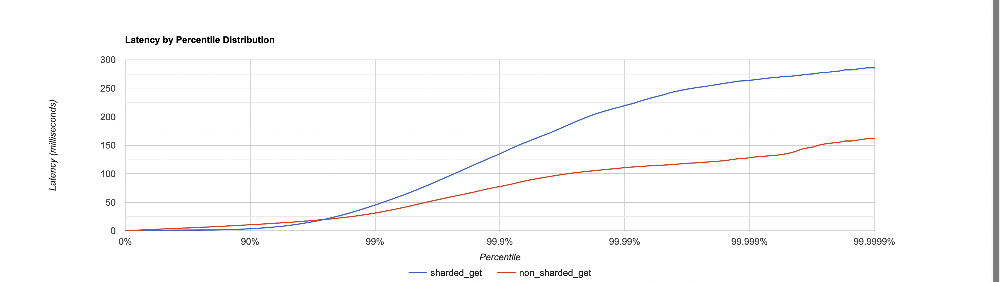

# Описание реализации и мои оптимизации
## Подход к шардированию
В задание было предложено реализовать один из подходов: consistent hashing, rendezvous hashing. 
Обсудим каждый из этих подходов.

1. Rendezvous Hashing: очень прост в реализации, поддерживает удаление/добавление новых шардов. При вычислении нужного 
шарда используются только простые операции, не надо много лезть в пямять, однако имеет ассимтотическую сложность, линейную от 
количества шардов. При хорошей хэш функции дает равномерное распределение ключей между нодами, однако не дает возможности 
гранулярной настройки в случае перевеса на одном из шардов
2. Consistent Hashing: при вычислении нужного шарда требует уже более сложных операций, в том числе требует поддерживать 
какую-то отсортированную структуру данных, позволяющую быстро искать нужный шард. Имеет уже логарифмическую ассимптотику. 
При маленьком количестве нод может очень легко получиться несбалансированное распределение ключей, поэтому я решил дополнительно 
реализовать оптимизацию с VNODES. Где для каждой ноды я поддерживаю несколько "виртуальных", ведущих на тот же самый шард.
Такой подход позволяет не только обеспечить более равномерную нагрузку, но и к тому же позволяет при желании разгрузить 
сильно нагруженные шарды, добавив рядом vnode'у другого шарда, перекинув часть нагрузки туда. Так же поддерживает добавление 
и удаление новых шардов.

Я решил использовать второй подход - так как он ассимтотически более быстрый и, что главное, 
позволяет регулировать нагрузку на каждый из шардов.

В своей первой реализации я использовал очевидное решение с TreeMap, однако по результатм профилироания получил большой 
оверхед на этот самый мап, поэтому решил хранить хэши в массиме примитивов, и делать бинпоиск уже по нему. С реализацией 
можно ознакомиться соответствующем классе.

## Подход к хэшированию
Отдельно бы хотелось поговорить про получение хэша по ключу. Известно, что дефолтная хэш функция в джаве не самая оптимальная 
и ее можно легко сломать. Реализовав на ней свое решение я столкнулся с ужасными результатам. Так как мой скрипт генерирует 
по сути ключи вида "value" + $случайное число$, а названия шардов я положил равными shard + $номер шарда$ + $номер виртуальной ноды$,
распределение хэшей получалось очень не равномерным, и на двух шардах я получил перевес аж в 10 (!!) раз на первый шард. Это еще не 
учитывая тот факт, что можно специально подбирать ключи так, чтобы они имели одинаковый хэш. 

Я решил не исправлять то, что заведомо плохо работает, поэтому принял решение использовать MD5 хэш, оставляя от него последние 
64 бита для того, чтобы работать с лонгами. Такое решение уже без дополнительных махинаций, даже для практически идентичных 
строк дало на глаз не отличимое от нормального распределение. При этом конечно же это решение далось ценой небольшой потери в 
производительности (как мы увидим далее при профилировании), однако, на мой взгляд, это стоит того, чтобы получить хорошее распределение 
данных между шардами.

## Подход к обработке случае нахождения записи на другом шарде
Каждая нода знает где находится любой ключ, причем эти знания дожны быть одинаковыми для всех нод, чтобы мы могли 
корректно отвечать на запросы пользователя. Соответственно, если ключ не у нас - надо проксировать запрос на нужную ноду. В 
задании мы договорились использовать протокол HTTP, однако, на мой взгляд, это решение сильно будет замедлять 
работу нашего сервиса, так как этот протокол очень избыточный и можно было использовать что-то более быстрое с меньшим 
кол-вом оверхеда, например GRPC, или даже свой низкоуровневый протокол, так как для внутренних запросов где мы все сами 
контролируем, даже GRPC несет некоторый оверхед.

# Нагрузочное тестирование реализации

Сразу надо отметить, что наши тесты очень плохо будут отражать поведение сервиса, так как мы тестируем ноды, поднятые на 
одной машине. Времени здесь тратится на обмен данными минимум, поэтому "мысленно" можно раздувать время, которое тратится на 
пересылку сообщений, ведь когда мы поднимем реальные машины соединенные сетью, их общение по сети станет не только сильно дольше,
но и менее надежным.

Для тестирования я запустил 3 шарда, каждый на своей JVM, а также загрузил каждый из шардов данными примерно на 1 гигабайт, 
чтобы данные точно не влезли в оперативную память.

Сравнивать буду, как всегда, со старой однашардовой реализацией, так как хочется понять какие накладные расходы мы добавили и 
что за это получили.

## PUT
Тестировать будем уже проверенным скриптом
```
request = function()
url = '/v0/entity?id=key' .. math.random(1, m)
body = 'value' .. math.random(1, 1000)

    return wrk.format("PUT", url, {}, body)
end
```
m положим равным 100000. В первом отчете мы выяснили что разницы большой в этом месте нет.

Сначала нащупаем оптимальный RPS. Запустим сначала на нагрузке в 100000 RPS

```
wrk2 -t 16 -c 64 -d 2m -R 100000 -L http://localhost:19234 -s load_testing_put.lua
Running 2m test @ http://localhost:19234
  16 threads and 64 connections
  Thread calibration: mean lat.: 135.379ms, rate sampling interval: 1170ms
  Thread calibration: mean lat.: 120.469ms, rate sampling interval: 1053ms
  Thread calibration: mean lat.: 109.003ms, rate sampling interval: 787ms
  Thread calibration: mean lat.: 133.111ms, rate sampling interval: 988ms
  Thread calibration: mean lat.: 278.440ms, rate sampling interval: 1577ms
  Thread calibration: mean lat.: 79.712ms, rate sampling interval: 522ms
  Thread calibration: mean lat.: 13.834ms, rate sampling interval: 81ms
  Thread calibration: mean lat.: 39.043ms, rate sampling interval: 306ms
  Thread calibration: mean lat.: 59.089ms, rate sampling interval: 484ms
  Thread calibration: mean lat.: 90.857ms, rate sampling interval: 505ms
  Thread calibration: mean lat.: 568.745ms, rate sampling interval: 4077ms
  Thread calibration: mean lat.: 76.239ms, rate sampling interval: 563ms
  Thread calibration: mean lat.: 14.187ms, rate sampling interval: 103ms
  Thread calibration: mean lat.: 840.282ms, rate sampling interval: 3700ms
  Thread calibration: mean lat.: 20.781ms, rate sampling interval: 124ms
  Thread calibration: mean lat.: 690.321ms, rate sampling interval: 4198ms
  Thread Stats   Avg      Stdev     Max   +/- Stdev
    Latency     3.61s     6.97s   35.00s    86.56%
    Req/Sec     1.91k     1.50k    8.68k    58.41%
  Latency Distribution (HdrHistogram - Recorded Latency)
 50.000%   80.58ms
 75.000%    3.37s 
 90.000%   14.42s 
 99.000%   30.56s 
 99.900%   34.34s 
 99.990%   34.96s 
 99.999%   35.00s 
100.000%   35.03s 

  Detailed Percentile spectrum:
       Value   Percentile   TotalCount 1/(1-Percentile)

       0.026     0.000000            1         1.00
       0.795     0.100000       344846         1.11
       1.201     0.200000       689753         1.25
       1.820     0.300000      1034218         1.43
       8.847     0.400000      1378903         1.67
      80.575     0.500000      1723547         2.00
     211.071     0.550000      1895974         2.22
     526.335     0.600000      2068242         2.50
    1241.087     0.650000      2240717         2.86
    2199.551     0.700000      2412938         3.33
    3373.055     0.750000      2585478         4.00
    4155.391     0.775000      2671555         4.44
    5173.247     0.800000      2757663         5.00
    6574.079     0.825000      2843897         5.71
    8757.247     0.850000      2930005         6.67
   11558.911     0.875000      3016305         8.00
   13099.007     0.887500      3059463         8.89
   14417.919     0.900000      3102413        10.00
   15622.143     0.912500      3145679        11.43
   17448.959     0.925000      3188809        13.33
   19234.815     0.937500      3231845        16.00
   20119.551     0.943750      3253321        17.78
   20938.751     0.950000      3275032        20.00
   21610.495     0.956250      3296410        22.86
   22839.295     0.962500      3317864        26.67
   24395.775     0.968750      3339343        32.00
   25067.519     0.971875      3350154        35.56
   25706.495     0.975000      3360867        40.00
   26230.783     0.978125      3371915        45.71
   26984.447     0.981250      3382658        53.33
   27705.343     0.984375      3393297        64.00
   28475.391     0.985938      3398627        71.11
   29310.975     0.987500      3404079        80.00
   30113.791     0.989062      3409356        91.43
   30932.991     0.990625      3414760       106.67
   31686.655     0.992188      3420138       128.00
   31981.567     0.992969      3422855       142.22
   32538.623     0.993750      3425570       160.00
   32866.303     0.994531      3428251       182.86
   33062.911     0.995313      3431018       213.33
   33275.903     0.996094      3433582       256.00
   33390.591     0.996484      3434946       284.44
   33456.127     0.996875      3436274       320.00
   33538.047     0.997266      3437649       365.71
   33751.039     0.997656      3439064       426.67
   33914.879     0.998047      3440392       512.00
   34013.183     0.998242      3441310       568.89
   34078.719     0.998437      3441873       640.00
   34144.255     0.998633      3442399       731.43
   34308.095     0.998828      3443255       853.33
   34340.863     0.999023      3443699      1024.00
   34373.631     0.999121      3444264      1137.78
   34406.399     0.999219      3444757      1280.00
   34406.399     0.999316      3444757      1462.86
   34471.935     0.999414      3445296      1706.67
   34504.703     0.999512      3445412      2048.00
   34570.239     0.999561      3445618      2275.56
   34603.007     0.999609      3445701      2560.00
   34701.311     0.999658      3445950      2925.71
   34766.847     0.999707      3446146      3413.33
   34799.615     0.999756      3446218      4096.00
   34832.383     0.999780      3446311      4551.11
   34865.151     0.999805      3446414      5120.00
   34897.919     0.999829      3446568      5851.43
   34897.919     0.999854      3446568      6826.67
   34930.687     0.999878      3446685      8192.00
   34930.687     0.999890      3446685      9102.22
   34963.455     0.999902      3446920     10240.00
   34963.455     0.999915      3446920     11702.86
   34963.455     0.999927      3446920     13653.33
   34963.455     0.999939      3446920     16384.00
   34963.455     0.999945      3446920     18204.44
   34963.455     0.999951      3446920     20480.00
   34963.455     0.999957      3446920     23405.71
   34963.455     0.999963      3446920     27306.67
   34996.223     0.999969      3447014     32768.00
   34996.223     0.999973      3447014     36408.89
   34996.223     0.999976      3447014     40960.00
   34996.223     0.999979      3447014     46811.43
   34996.223     0.999982      3447014     54613.33
   34996.223     0.999985      3447014     65536.00
   34996.223     0.999986      3447014     72817.78
   34996.223     0.999988      3447014     81920.00
   34996.223     0.999989      3447014     93622.86
   34996.223     0.999991      3447014    109226.67
   35028.991     0.999992      3447043    131072.00
   35028.991     1.000000      3447043          inf
#[Mean    =     3611.437, StdDeviation   =     6970.993]
#[Max     =    34996.224, Total count    =      3447043]
#[Buckets =           27, SubBuckets     =         2048]
----------------------------------------------------------
  3760994 requests in 2.00m, 220.41MB read
  Socket errors: connect 0, read 0, write 0, timeout 2671
Requests/sec:  31341.88
Transfer/sec:      1.84MB
```

Сервис выдержал RPS в 32000, однако мы видим 2671 сокет таймаутов, и да 75 персентиль уже занимает 3 секунд на ответ, мы 
сильно захлебываемся. Посмотрим что происходит на 30000 RPS

```
wrk2 -t 16 -c 64 -d 2m -R 30000 -L http://localhost:19234 -s load_testing_put.lua
Running 2m test @ http://localhost:19234
  16 threads and 64 connections
  Thread calibration: mean lat.: 3.945ms, rate sampling interval: 11ms
  Thread calibration: mean lat.: 8.344ms, rate sampling interval: 25ms
  Thread calibration: mean lat.: 5.088ms, rate sampling interval: 14ms
  Thread calibration: mean lat.: 5.979ms, rate sampling interval: 11ms
  Thread calibration: mean lat.: 7.465ms, rate sampling interval: 19ms
  Thread calibration: mean lat.: 5.804ms, rate sampling interval: 19ms
  Thread calibration: mean lat.: 5.218ms, rate sampling interval: 16ms
  Thread calibration: mean lat.: 5.951ms, rate sampling interval: 15ms
  Thread calibration: mean lat.: 5.342ms, rate sampling interval: 13ms
  Thread calibration: mean lat.: 4.707ms, rate sampling interval: 10ms
  Thread calibration: mean lat.: 4.751ms, rate sampling interval: 14ms
  Thread calibration: mean lat.: 9.397ms, rate sampling interval: 23ms
  Thread calibration: mean lat.: 4.033ms, rate sampling interval: 13ms
  Thread calibration: mean lat.: 5.194ms, rate sampling interval: 13ms
  Thread calibration: mean lat.: 3.134ms, rate sampling interval: 10ms
  Thread calibration: mean lat.: 4.864ms, rate sampling interval: 14ms
  Thread Stats   Avg      Stdev     Max   +/- Stdev
    Latency     5.95ms   24.25ms 865.79ms   95.57%
    Req/Sec     1.95k   675.87    11.30k    83.64%
  Latency Distribution (HdrHistogram - Recorded Latency)
 50.000%    1.12ms
 75.000%    1.70ms
 90.000%    8.94ms
 99.000%  103.04ms
 99.900%  322.56ms
 99.990%  679.42ms
 99.999%  840.19ms
100.000%  866.30ms

  Detailed Percentile spectrum:
       Value   Percentile   TotalCount 1/(1-Percentile)

       0.025     0.000000            2         1.00
       0.436     0.100000       330334         1.11
       0.623     0.200000       661356         1.25
       0.793     0.300000       990707         1.43
       0.958     0.400000      1320644         1.67
       1.122     0.500000      1651082         2.00
       1.205     0.550000      1815856         2.22
       1.292     0.600000      1980422         2.50
       1.389     0.650000      2145194         2.86
       1.509     0.700000      2310340         3.33
       1.698     0.750000      2474804         4.00
       1.870     0.775000      2557232         4.44
       2.199     0.800000      2639818         5.00
       2.857     0.825000      2722099         5.71
       3.933     0.850000      2804597         6.67
       5.727     0.875000      2887157         8.00
       7.107     0.887500      2928311         8.89
       8.935     0.900000      2969590        10.00
      11.431     0.912500      3010876        11.43
      14.807     0.925000      3052074        13.33
      19.519     0.937500      3093286        16.00
      22.543     0.943750      3113987        17.78
      26.191     0.950000      3134541        20.00
      30.655     0.956250      3155176        22.86
      36.191     0.962500      3175851        26.67
      43.263     0.968750      3196423        32.00
      47.615     0.971875      3206745        35.56
      52.671     0.975000      3217024        40.00
      58.783     0.978125      3227351        45.71
      66.495     0.981250      3237701        53.33
      76.095     0.984375      3247978        64.00
      81.983     0.985938      3253116        71.11
      88.831     0.987500      3258265        80.00
      97.151     0.989062      3263415        91.43
     107.327     0.990625      3268589       106.67
     119.615     0.992188      3273731       128.00
     127.039     0.992969      3276300       142.22
     135.807     0.993750      3278880       160.00
     146.303     0.994531      3281467       182.86
     159.231     0.995313      3284054       213.33
     175.359     0.996094      3286624       256.00
     185.855     0.996484      3287899       284.44
     197.887     0.996875      3289189       320.00
     212.351     0.997266      3290480       365.71
     228.735     0.997656      3291763       426.67
     249.087     0.998047      3293054       512.00
     261.375     0.998242      3293703       568.89
     274.687     0.998437      3294349       640.00
     289.023     0.998633      3294990       731.43
     304.895     0.998828      3295630       853.33
     325.119     0.999023      3296278      1024.00
     335.871     0.999121      3296599      1137.78
     347.903     0.999219      3296926      1280.00
     361.215     0.999316      3297242      1462.86
     375.039     0.999414      3297564      1706.67
     396.287     0.999512      3297888      2048.00
     407.807     0.999561      3298050      2275.56
     423.935     0.999609      3298208      2560.00
     447.231     0.999658      3298370      2925.71
     478.463     0.999707      3298530      3413.33
     513.535     0.999756      3298691      4096.00
     532.991     0.999780      3298775      4551.11
     550.399     0.999805      3298852      5120.00
     571.391     0.999829      3298933      5851.43
     609.791     0.999854      3299014      6826.67
     644.095     0.999878      3299094      8192.00
     663.551     0.999890      3299134      9102.22
     683.007     0.999902      3299174     10240.00
     702.975     0.999915      3299216     11702.86
     718.335     0.999927      3299255     13653.33
     739.839     0.999939      3299295     16384.00
     751.103     0.999945      3299315     18204.44
     763.391     0.999951      3299336     20480.00
     775.167     0.999957      3299356     23405.71
     787.455     0.999963      3299376     27306.67
     799.743     0.999969      3299396     32768.00
     806.399     0.999973      3299407     36408.89
     812.031     0.999976      3299416     40960.00
     818.687     0.999979      3299426     46811.43
     825.343     0.999982      3299436     54613.33
     830.463     0.999985      3299447     65536.00
     832.511     0.999986      3299452     72817.78
     835.583     0.999988      3299456     81920.00
     838.655     0.999989      3299461     93622.86
     842.239     0.999991      3299467    109226.67
     844.799     0.999992      3299471    131072.00
     846.847     0.999993      3299474    145635.56
     848.895     0.999994      3299477    163840.00
     850.943     0.999995      3299479    187245.71
     852.479     0.999995      3299482    218453.33
     854.527     0.999996      3299484    262144.00
     856.063     0.999997      3299485    291271.11
     856.575     0.999997      3299486    327680.00
     858.623     0.999997      3299488    374491.43
     859.647     0.999998      3299489    436906.67
     860.671     0.999998      3299490    524288.00
     861.183     0.999998      3299491    582542.22
     861.183     0.999998      3299491    655360.00
     862.719     0.999999      3299492    748982.86
     863.231     0.999999      3299493    873813.33
     863.231     0.999999      3299493   1048576.00
     864.767     0.999999      3299494   1165084.44
     864.767     0.999999      3299494   1310720.00
     864.767     0.999999      3299494   1497965.71
     865.279     0.999999      3299495   1747626.67
     865.279     1.000000      3299495   2097152.00
     865.279     1.000000      3299495   2330168.89
     865.279     1.000000      3299495   2621440.00
     865.279     1.000000      3299495   2995931.43
     866.303     1.000000      3299496   3495253.33
     866.303     1.000000      3299496          inf
#[Mean    =        5.951, StdDeviation   =       24.249]
#[Max     =      865.792, Total count    =      3299496]
#[Buckets =           27, SubBuckets     =         2048]
----------------------------------------------------------
  3599650 requests in 2.00m, 210.96MB read
Requests/sec:  29997.38
Transfer/sec:      1.76MB
```

Видим, что сервис отлично справляется с такой нагрузкой и держит latency около 100мс на 99 персентиле


## GET
Аналогично сначала нащупаем оптимальный RPS. Запустим сначала на нагрузке в 100000 RPS, стрелять будем по тому же 
диапазону ключей, что мы делали PUT перед этим.

```
wrk2 -t 16 -c 64 -d 2m -R 100000 -L http://localhost:19234 -s load_testing_get.lua
Running 2m test @ http://localhost:19234
  16 threads and 64 connections
  Thread calibration: mean lat.: 600.325ms, rate sampling interval: 4558ms
  Thread calibration: mean lat.: 23.761ms, rate sampling interval: 164ms
  Thread calibration: mean lat.: 233.905ms, rate sampling interval: 1804ms
  Thread calibration: mean lat.: 61.392ms, rate sampling interval: 446ms
  Thread calibration: mean lat.: 56.485ms, rate sampling interval: 429ms
  Thread calibration: mean lat.: 93.820ms, rate sampling interval: 675ms
  Thread calibration: mean lat.: 35.064ms, rate sampling interval: 194ms
  Thread calibration: mean lat.: 2129.384ms, rate sampling interval: 12304ms
  Thread calibration: mean lat.: 114.869ms, rate sampling interval: 892ms
  Thread calibration: mean lat.: 432.406ms, rate sampling interval: 3076ms
  Thread calibration: mean lat.: 476.930ms, rate sampling interval: 1738ms
  Thread calibration: mean lat.: 1493.141ms, rate sampling interval: 4640ms
  Thread calibration: mean lat.: 8.738ms, rate sampling interval: 55ms
  Thread calibration: mean lat.: 10.081ms, rate sampling interval: 56ms
  Thread calibration: mean lat.: 188.800ms, rate sampling interval: 1754ms
  Thread calibration: mean lat.: 498.795ms, rate sampling interval: 791ms
  Thread Stats   Avg      Stdev     Max   +/- Stdev
    Latency    11.92s    17.74s    1.01m    80.11%
    Req/Sec     1.69k     1.81k    9.68k    82.44%
  Latency Distribution (HdrHistogram - Recorded Latency)
 50.000%  571.90ms
 75.000%   21.10s 
 90.000%   44.11s 
 99.000%    0.94m 
 99.900%    1.00m 
 99.990%    1.01m 
 99.999%    1.01m 
100.000%    1.01m 

  Detailed Percentile spectrum:
       Value   Percentile   TotalCount 1/(1-Percentile)

       0.028     0.000000            2         1.00
       0.820     0.100000       350441         1.11
       1.280     0.200000       699908         1.25
       2.467     0.300000      1049295         1.43
      48.479     0.400000      1399073         1.67
     571.903     0.500000      1748807         2.00
    1305.599     0.550000      1923704         2.22
    3432.447     0.600000      2098548         2.50
    7839.743     0.650000      2273454         2.86
   13975.551     0.700000      2448454         3.33
   21102.591     0.750000      2623208         4.00
   25657.343     0.775000      2710722         4.44
   29523.967     0.800000      2798283         5.00
   33193.983     0.825000      2885616         5.71
   36798.463     0.850000      2972927         6.67
   40206.335     0.875000      3061306         8.00
   42270.719     0.887500      3104556         8.89
   44105.727     0.900000      3148053        10.00
   45907.967     0.912500      3191752        11.43
   47513.599     0.925000      3235474        13.33
   49676.287     0.937500      3279079        16.00
   50855.935     0.943750      3301092        17.78
   51642.367     0.950000      3322749        20.00
   52592.639     0.956250      3345117        22.86
   53444.607     0.962500      3366705        26.67
   54001.663     0.968750      3389830        32.00
   54231.039     0.971875      3399352        35.56
   54493.183     0.975000      3410392        40.00
   54853.631     0.978125      3421508        45.71
   55148.543     0.981250      3431989        53.33
   55443.455     0.984375      3443335        64.00
   55574.527     0.985938      3448377        71.11
   55738.367     0.987500      3454563        80.00
   56000.511     0.989062      3459404        91.43
   56360.959     0.990625      3464784       106.67
   56786.943     0.992188      3470732       128.00
   56918.015     0.992969      3473165       142.22
   57147.391     0.993750      3475713       160.00
   57442.303     0.994531      3478541       182.86
   57638.911     0.995313      3481174       213.33
   57901.055     0.996094      3483882       256.00
   58032.127     0.996484      3485232       284.44
   58195.967     0.996875      3486750       320.00
   58392.575     0.997266      3487982       365.71
   58621.951     0.997656      3489343       426.67
   59047.935     0.998047      3490755       512.00
   59310.079     0.998242      3491475       568.89
   59539.455     0.998437      3492286       640.00
   59604.991     0.998633      3492752       731.43
   59736.063     0.998828      3493567       853.33
   59867.135     0.999023      3494211      1024.00
   59932.671     0.999121      3494526      1137.78
   59998.207     0.999219      3495000      1280.00
   60030.975     0.999316      3495163      1462.86
   60129.279     0.999414      3495571      1706.67
   60194.815     0.999512      3495880      2048.00
   60227.583     0.999561      3496170      2275.56
   60227.583     0.999609      3496170      2560.00
   60260.351     0.999658      3496489      2925.71
   60293.119     0.999707      3496690      3413.33
   60293.119     0.999756      3496690      4096.00
   60325.887     0.999780      3496899      4551.11
   60325.887     0.999805      3496899      5120.00
   60358.655     0.999829      3497030      5851.43
   60358.655     0.999854      3497030      6826.67
   60391.423     0.999878      3497119      8192.00
   60424.191     0.999890      3497213      9102.22
   60424.191     0.999902      3497213     10240.00
   60456.959     0.999915      3497328     11702.86
   60456.959     0.999927      3497328     13653.33
   60456.959     0.999939      3497328     16384.00
   60456.959     0.999945      3497328     18204.44
   60489.727     0.999951      3497401     20480.00
   60489.727     0.999957      3497401     23405.71
   60489.727     0.999963      3497401     27306.67
   60522.495     0.999969      3497475     32768.00
   60522.495     0.999973      3497475     36408.89
   60522.495     0.999976      3497475     40960.00
   60522.495     0.999979      3497475     46811.43
   60522.495     0.999982      3497475     54613.33
   60522.495     0.999985      3497475     65536.00
   60522.495     0.999986      3497475     72817.78
   60555.263     0.999988      3497519     81920.00
   60555.263     1.000000      3497519          inf
#[Mean    =    11916.323, StdDeviation   =    17742.620]
#[Max     =    60522.496, Total count    =      3497519]
#[Buckets =           27, SubBuckets     =         2048]
----------------------------------------------------------
  3815006 requests in 2.00m, 246.50MB read
  Socket errors: connect 0, read 0, write 0, timeout 2724
  Non-2xx or 3xx responses: 42773
Requests/sec:  31792.06
Transfer/sec:      2.05MB
```

Здесь мы выдерживаем похожий RPS в 32000, ошибки в запросах 404, так как не все ключие есть в нашей базе.
Значит наш рабочий RPS опять же около 30000, будем смотреть что просходит на нем.

```
wrk2 -t 16 -c 64 -d 2m -R 30000 -L http://localhost:19234 -s load_testing_get.lua
Running 2m test @ http://localhost:19234
  16 threads and 64 connections
  Thread calibration: mean lat.: 4.612ms, rate sampling interval: 10ms
  Thread calibration: mean lat.: 3.011ms, rate sampling interval: 10ms
  Thread calibration: mean lat.: 2.781ms, rate sampling interval: 10ms
  Thread calibration: mean lat.: 3.534ms, rate sampling interval: 10ms
  Thread calibration: mean lat.: 2.889ms, rate sampling interval: 10ms
  Thread calibration: mean lat.: 9.696ms, rate sampling interval: 10ms
  Thread calibration: mean lat.: 3.385ms, rate sampling interval: 10ms
  Thread calibration: mean lat.: 3.546ms, rate sampling interval: 10ms
  Thread calibration: mean lat.: 6.062ms, rate sampling interval: 17ms
  Thread calibration: mean lat.: 3.376ms, rate sampling interval: 10ms
  Thread calibration: mean lat.: 6.596ms, rate sampling interval: 10ms
  Thread calibration: mean lat.: 2.965ms, rate sampling interval: 10ms
  Thread calibration: mean lat.: 4.821ms, rate sampling interval: 14ms
  Thread calibration: mean lat.: 3.875ms, rate sampling interval: 10ms
  Thread calibration: mean lat.: 3.604ms, rate sampling interval: 10ms
  Thread calibration: mean lat.: 3.370ms, rate sampling interval: 10ms
  Thread Stats   Avg      Stdev     Max   +/- Stdev
    Latency     2.89ms    9.95ms 369.92ms   96.09%
    Req/Sec     1.97k   524.57    11.50k    84.28%
  Latency Distribution (HdrHistogram - Recorded Latency)
 50.000%    1.07ms
 75.000%    1.52ms
 90.000%    3.73ms
 99.000%   45.28ms
 99.900%  132.09ms
 99.990%  251.65ms
 99.999%  340.74ms
100.000%  370.18ms

  Detailed Percentile spectrum:
       Value   Percentile   TotalCount 1/(1-Percentile)

       0.025     0.000000            2         1.00
       0.425     0.100000       330580         1.11
       0.604     0.200000       660399         1.25
       0.767     0.300000       991653         1.43
       0.922     0.400000      1320556         1.67
       1.075     0.500000      1650124         2.00
       1.152     0.550000      1816444         2.22
       1.229     0.600000      1979827         2.50
       1.311     0.650000      2144812         2.86
       1.405     0.700000      2311133         3.33
       1.522     0.750000      2475308         4.00
       1.600     0.775000      2557925         4.44
       1.705     0.800000      2639597         5.00
       1.866     0.825000      2722208         5.71
       2.157     0.850000      2804670         6.67
       2.733     0.875000      2887026         8.00
       3.163     0.887500      2928209         8.89
       3.731     0.900000      2969469        10.00
       4.491     0.912500      3010721        11.43
       5.539     0.925000      3051941        13.33
       7.095     0.937500      3093177        16.00
       8.139     0.943750      3113801        17.78
       9.495     0.950000      3134432        20.00
      11.215     0.956250      3155061        22.86
      13.455     0.962500      3175671        26.67
      16.527     0.968750      3196315        32.00
      18.479     0.971875      3206641        35.56
      20.863     0.975000      3216957        40.00
      23.791     0.978125      3227240        45.71
      27.439     0.981250      3237557        53.33
      32.175     0.984375      3247835        64.00
      35.071     0.985938      3252999        71.11
      38.495     0.987500      3258148        80.00
      42.463     0.989062      3263307        91.43
      47.327     0.990625      3268464       106.67
      53.311     0.992188      3273613       128.00
      56.831     0.992969      3276204       142.22
      60.831     0.993750      3278765       160.00
      65.503     0.994531      3281336       182.86
      71.231     0.995313      3283934       213.33
      77.951     0.996094      3286493       256.00
      81.855     0.996484      3287782       284.44
      86.271     0.996875      3289067       320.00
      91.391     0.997266      3290364       365.71
      97.599     0.997656      3291647       426.67
     104.767     0.998047      3292935       512.00
     108.927     0.998242      3293578       568.89
     113.599     0.998437      3294221       640.00
     118.847     0.998633      3294867       731.43
     125.375     0.998828      3295512       853.33
     133.247     0.999023      3296165      1024.00
     137.727     0.999121      3296482      1137.78
     143.231     0.999219      3296801      1280.00
     149.247     0.999316      3297123      1462.86
     155.263     0.999414      3297442      1706.67
     163.071     0.999512      3297764      2048.00
     167.679     0.999561      3297927      2275.56
     172.927     0.999609      3298087      2560.00
     178.815     0.999658      3298249      2925.71
     186.751     0.999707      3298409      3413.33
     196.607     0.999756      3298570      4096.00
     202.367     0.999780      3298652      4551.11
     209.023     0.999805      3298731      5120.00
     217.727     0.999829      3298812      5851.43
     227.583     0.999854      3298892      6826.67
     239.487     0.999878      3298973      8192.00
     246.015     0.999890      3299013      9102.22
     252.799     0.999902      3299053     10240.00
     260.095     0.999915      3299095     11702.86
     267.007     0.999927      3299134     13653.33
     274.943     0.999939      3299174     16384.00
     280.575     0.999945      3299195     18204.44
     286.463     0.999951      3299215     20480.00
     292.095     0.999957      3299237     23405.71
     297.727     0.999963      3299255     27306.67
     304.895     0.999969      3299275     32768.00
     310.015     0.999973      3299285     36408.89
     313.855     0.999976      3299295     40960.00
     319.743     0.999979      3299306     46811.43
     325.631     0.999982      3299315     54613.33
     330.751     0.999985      3299325     65536.00
     334.591     0.999986      3299330     72817.78
     337.151     0.999988      3299335     81920.00
     340.479     0.999989      3299341     93622.86
     342.527     0.999991      3299346    109226.67
     344.575     0.999992      3299350    131072.00
     346.367     0.999993      3299353    145635.56
     346.879     0.999994      3299355    163840.00
     350.463     0.999995      3299358    187245.71
     352.511     0.999995      3299360    218453.33
     354.559     0.999996      3299363    262144.00
     356.351     0.999997      3299364    291271.11
     356.607     0.999997      3299365    327680.00
     358.399     0.999997      3299367    374491.43
     360.191     0.999998      3299368    436906.67
     360.447     0.999998      3299369    524288.00
     362.239     0.999998      3299370    582542.22
     362.239     0.999998      3299370    655360.00
     362.495     0.999999      3299371    748982.86
     364.287     0.999999      3299372    873813.33
     364.287     0.999999      3299372   1048576.00
     366.335     0.999999      3299373   1165084.44
     366.335     0.999999      3299373   1310720.00
     366.335     0.999999      3299373   1497965.71
     368.127     0.999999      3299374   1747626.67
     368.127     1.000000      3299374   2097152.00
     368.127     1.000000      3299374   2330168.89
     368.127     1.000000      3299374   2621440.00
     368.127     1.000000      3299374   2995931.43
     370.175     1.000000      3299375   3495253.33
     370.175     1.000000      3299375          inf
#[Mean    =        2.892, StdDeviation   =        9.955]
#[Max     =      369.920, Total count    =      3299375]
#[Buckets =           27, SubBuckets     =         2048]
----------------------------------------------------------
  3599730 requests in 2.00m, 232.60MB read
  Non-2xx or 3xx responses: 40080
Requests/sec:  29997.86
Transfer/sec:      1.94MB
```

Здесь видим latency лучше чем на PUT'е, 45мс на 99 персентиле и "всего" 370 на сотом. Ошибки опять же все 404ые из-за того,
что не все ключи по которым мы стреляем есть в базе.

