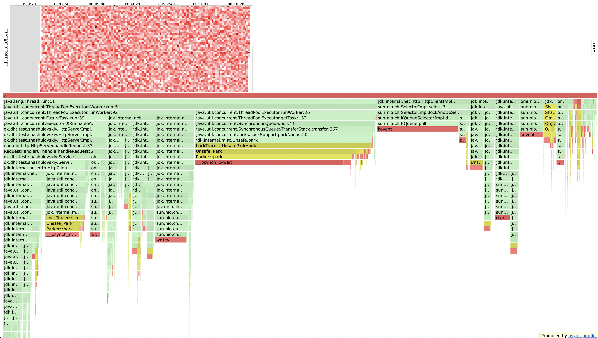
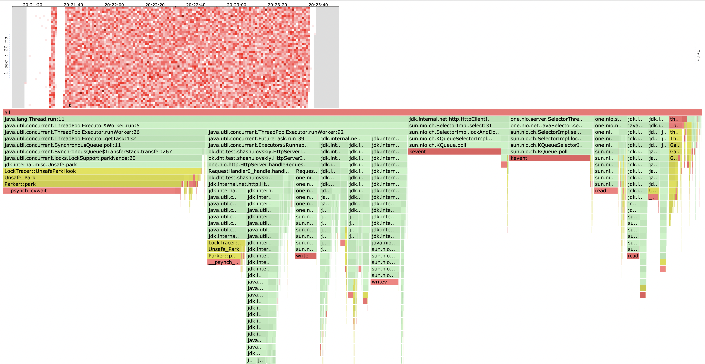
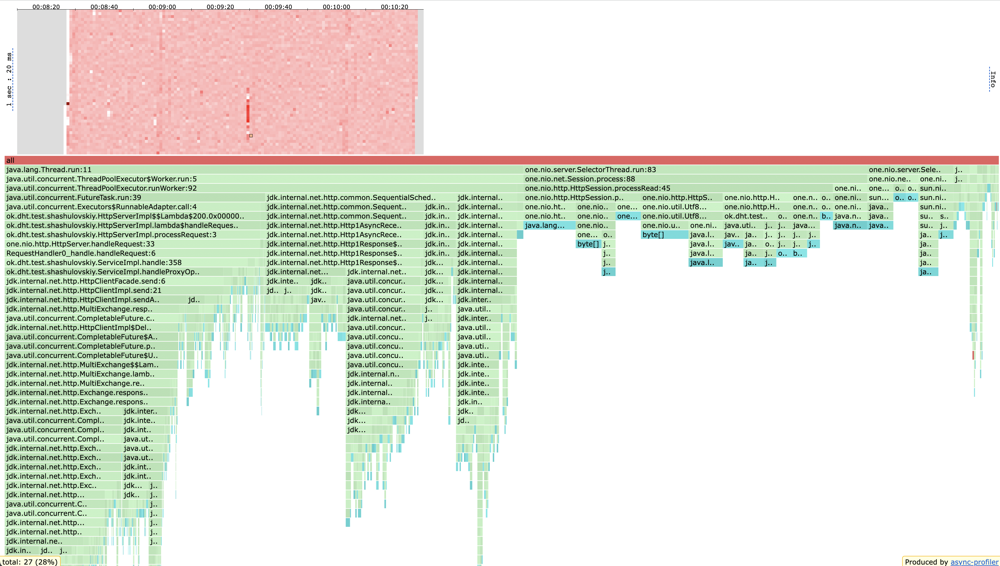
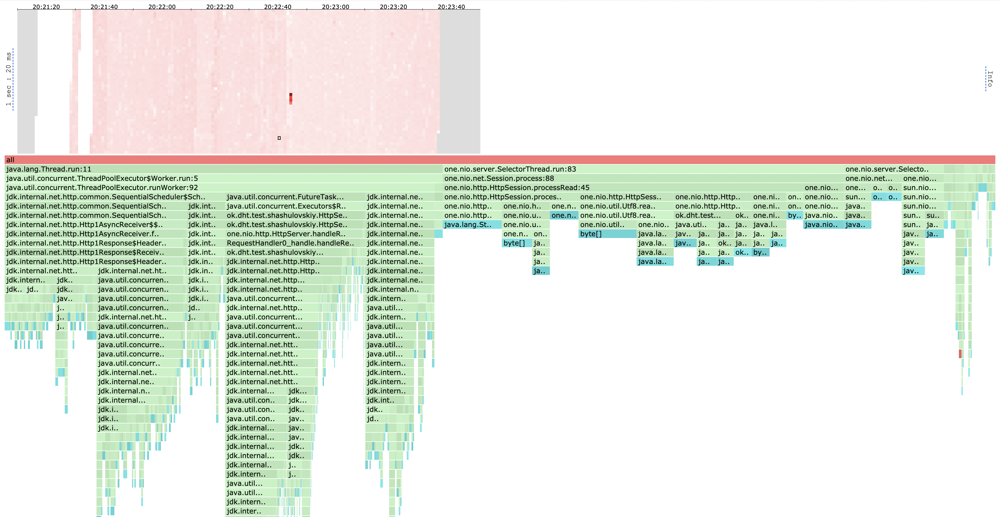
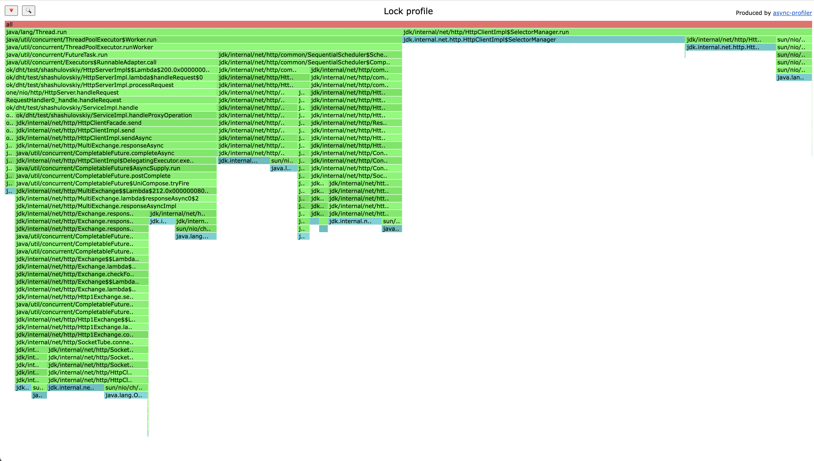
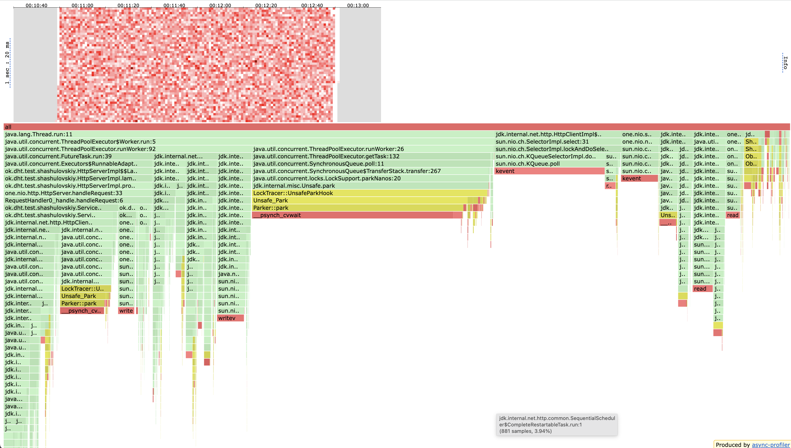
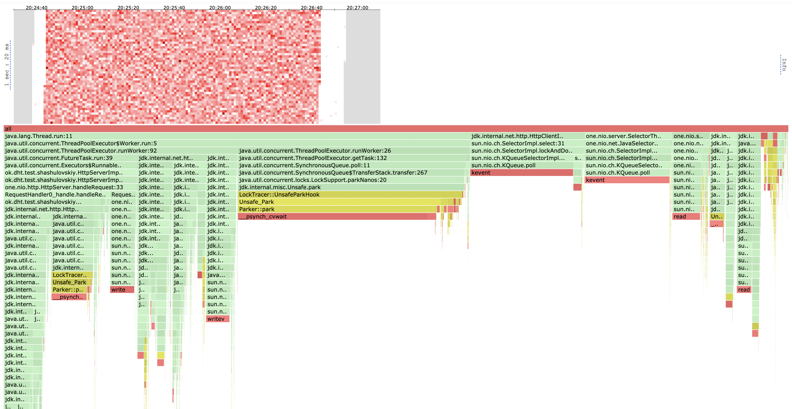
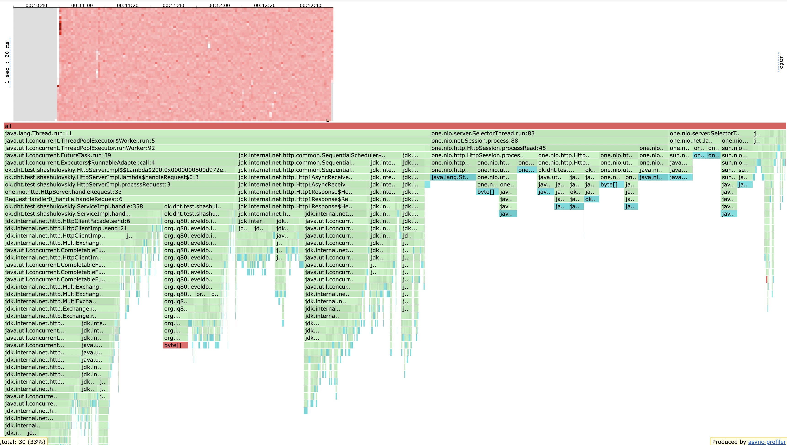
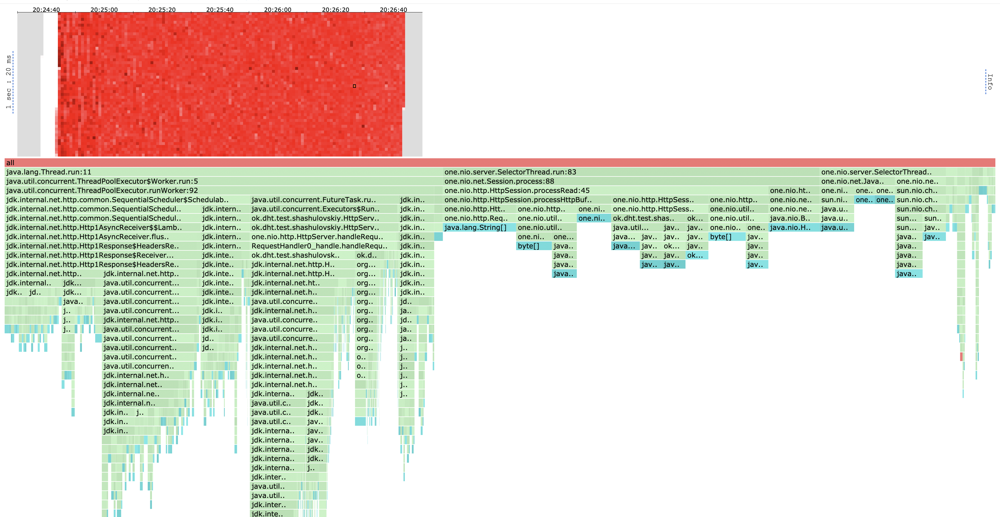
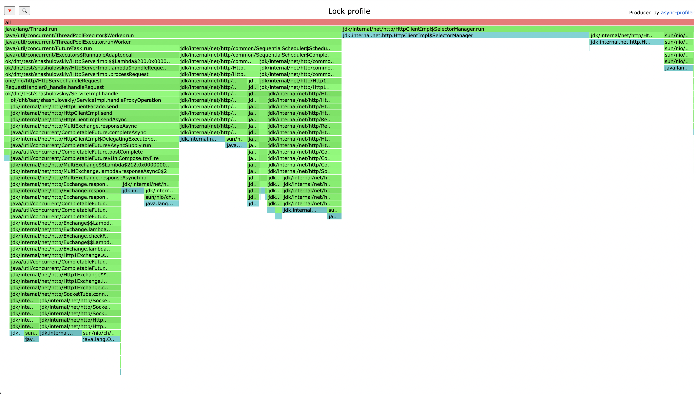

# Описание решения
## Подход к репликации
В основе все так же лежит консистентное хеширование, реализованное на прошлом этапе, однако теперь мы будем
исполнять запрос на выбранной и `from - 1` последующих нод. 

Есть два способа отвечать клиенту:
1. По достижении `ack` успешных ответов ответить успехом и продолжить репликацию на оставшиеся `from - ack` шардов
2. Дождаться ответа от всех `from` шардов и уже затем ответить в соответствии с числом успехов

Я решил реализовать первый вариант, так как это поможет сэкономить на времени ответа пользователю, чтобы он не ждал 
ответы от шардов которые все равно не повлияют на результат и в любом случае будут выполнены.
Однако я могу представить ситуацию в которой мы можем захотеть первый вариант: мы можем хотеть точно знать что о нашем 
запросе узнали (или не узнали) все шарды которым это было положено, потому что иначе мы можем столкнуться с 
неконсистентностью.

Есть два способа посылать запросы репликации:
1. Последовательно
2. Асинхронно

Тут я опять же реализовал первый вариант, так как во втором варианте надо дополнительно решать множество проблем:
синхронизация, поддержание очереди и пула потоков которые будут обрабатывать эти параллельные запросы. И так как нам 
кажется говорили что это следующий этап, я решил остановиться на синхронной реализации. Однако асинхронная реализация 
дала бы большой прирост в производительности, так как (как мы увидим дальше), очень много времени мы тратим на ожидание ответа.

## Подход к хранению данных
Чтобы обрабатывать корректно GET запросы и получать наиболее актуальный ответ необходимо было дополнительно с 
данными таймштамп создания/удаления значения, а также флаг который говорит что данные были удалены. Для этого я стал 
оборачивать хранимые данные этой информацией. Первые 8 байт я выделил под хранение времени, следующий байт под хранение 
флага удаления данных, а далее следуют основные данные.

## Подход к общению шардов
Так как теперь шарды вынуждены сообщать друг другу дополнительную информацию скрытую от пользователя (например таймштамп),
я выделил отдельное апи для внутренних запросов, в котором, более того, убрал лишнюю повторную валидацию. Здесь в будущем 
можно добавить авторизацию либо оставить эти ручки открытыми как некое "unsafe api".

# Нагрузочное тестирование

Тестировать я буду с 3 шардами в кластере и c дефолтным кворумом (ack = 2/from = 3).
Для начала, в лучших традициях, наполним наши шарды данными, по гигабайту на каждый, чтобы тестировать работу не только в 
оперативной памяти.

## PUT

Тестировать будем как всегда уже проверенным скриптом
```
request = function()
url = '/v0/entity?id=key' .. math.random(1, m)
body = 'value' .. math.random(1, 1000)

    return wrk.format("PUT", url, {}, body)
end
```
m положим равным 100000.

Начнем с RPS 30000 и нащупаем такой, который наша система выдерживает.

```
wrk2 -t 16 -c 64 -d 2m -R 30000 -L http://localhost:19234 -s load_testing_put.lua
Running 2m test @ http://localhost:19234
  16 threads and 64 connections
  Thread calibration: mean lat.: 1125.536ms, rate sampling interval: 6582ms
  Thread calibration: mean lat.: 59.187ms, rate sampling interval: 419ms
  Thread calibration: mean lat.: 247.866ms, rate sampling interval: 1833ms
  Thread calibration: mean lat.: 193.906ms, rate sampling interval: 1667ms
  Thread calibration: mean lat.: 375.763ms, rate sampling interval: 3022ms
  Thread calibration: mean lat.: 0.000ms, rate sampling interval: 10ms
  Thread calibration: mean lat.: 431.284ms, rate sampling interval: 4517ms
  Thread calibration: mean lat.: 427.250ms, rate sampling interval: 3506ms
  Thread calibration: mean lat.: 562.685ms, rate sampling interval: 4134ms
  Thread calibration: mean lat.: 91.901ms, rate sampling interval: 636ms
  Thread calibration: mean lat.: 636.365ms, rate sampling interval: 4993ms
  Thread calibration: mean lat.: 37.511ms, rate sampling interval: 238ms
  Thread calibration: mean lat.: 1418.500ms, rate sampling interval: 8167ms
  Thread calibration: mean lat.: 2340.610ms, rate sampling interval: 7876ms
  Thread calibration: mean lat.: 569.285ms, rate sampling interval: 4020ms
  Thread calibration: mean lat.: 92.268ms, rate sampling interval: 638ms
  Thread Stats   Avg      Stdev     Max   +/- Stdev
    Latency     3.44s     9.77s    1.20m    91.57%
    Req/Sec   546.98    770.83     5.22k    88.16%
  Latency Distribution (HdrHistogram - Recorded Latency)
 50.000%   10.42ms
 75.000%  858.11ms
 90.000%   10.31s 
 99.000%    0.95m 
 99.900%    1.17m 
 99.990%    1.19m 
 99.999%    1.20m 
100.000%    1.20m 

  Detailed Percentile spectrum:
       Value   Percentile   TotalCount 1/(1-Percentile)

       0.098     0.000000            1         1.00
       0.748     0.100000        96044         1.11
       1.093     0.200000       191819         1.25
       1.435     0.300000       287539         1.43
       2.535     0.400000       383215         1.67
      10.423     0.500000       479011         2.00
      25.471     0.550000       526928         2.22
      61.343     0.600000       574808         2.50
     146.559     0.650000       622740         2.86
     356.351     0.700000       670619         3.33
     858.111     0.750000       718514         4.00
    1357.823     0.775000       742465         4.44
    2111.487     0.800000       766399         5.00
    3217.407     0.825000       790361         5.71
    4886.527     0.850000       814319         6.67
    7094.271     0.875000       838244         8.00
    8544.255     0.887500       850224         8.89
   10313.727     0.900000       862222        10.00
   12541.951     0.912500       874190        11.43
   14999.551     0.925000       886167        13.33
   18612.223     0.937500       898149        16.00
   20873.215     0.943750       904114        17.78
   23150.591     0.950000       910107        20.00
   25542.655     0.956250       916081        22.86
   28573.695     0.962500       922087        26.67
   31621.119     0.968750       928058        32.00
   33914.879     0.971875       931074        35.56
   36241.407     0.975000       934080        40.00
   38535.167     0.978125       937060        45.71
   40828.927     0.981250       940031        53.33
   44204.031     0.984375       943036        64.00
   46366.719     0.985938       944548        71.11
   48857.087     0.987500       946032        80.00
   51314.687     0.989062       947516        91.43
   57901.055     0.990625       949016       106.67
   60293.119     0.992188       950508       128.00
   61308.927     0.992969       951270       142.22
   62488.575     0.993750       952022       160.00
   63700.991     0.994531       952757       182.86
   64978.943     0.995313       953537       213.33
   66060.287     0.996094       954262       256.00
   66682.879     0.996484       954636       284.44
   67305.471     0.996875       955007       320.00
   67764.223     0.997266       955382       365.71
   68288.511     0.997656       955765       426.67
   68943.871     0.998047       956155       512.00
   69206.015     0.998242       956322       568.89
   69468.159     0.998437       956498       640.00
   69664.767     0.998633       956691       731.43
   69992.447     0.998828       956891       853.33
   70320.127     0.999023       957078      1024.00
   70451.199     0.999121       957164      1137.78
   70582.271     0.999219       957253      1280.00
   70778.879     0.999316       957372      1462.86
   70909.951     0.999414       957447      1706.67
   71041.023     0.999512       957526      2048.00
   71172.095     0.999561       957621      2275.56
   71172.095     0.999609       957621      2560.00
   71237.631     0.999658       957665      2925.71
   71368.703     0.999707       957748      3413.33
   71434.239     0.999756       957788      4096.00
   71434.239     0.999780       957788      4551.11
   71499.775     0.999805       957830      5120.00
   71499.775     0.999829       957830      5851.43
   71565.311     0.999854       957873      6826.67
   71630.847     0.999878       957911      8192.00
   71630.847     0.999890       957911      9102.22
   71630.847     0.999902       957911     10240.00
   71630.847     0.999915       957911     11702.86
   71696.383     0.999927       957947     13653.33
   71696.383     0.999939       957947     16384.00
   71696.383     0.999945       957947     18204.44
   71696.383     0.999951       957947     20480.00
   71761.919     0.999957       957988     23405.71
   71761.919     0.999963       957988     27306.67
   71761.919     0.999969       957988     32768.00
   71761.919     0.999973       957988     36408.89
   71761.919     0.999976       957988     40960.00
   71761.919     0.999979       957988     46811.43
   71761.919     0.999982       957988     54613.33
   71761.919     0.999985       957988     65536.00
   71761.919     0.999986       957988     72817.78
   71761.919     0.999988       957988     81920.00
   71761.919     0.999989       957988     93622.86
   71761.919     0.999991       957988    109226.67
   71761.919     0.999992       957988    131072.00
   71761.919     0.999993       957988    145635.56
   71761.919     0.999994       957988    163840.00
   71761.919     0.999995       957988    187245.71
   71761.919     0.999995       957988    218453.33
   71827.455     0.999996       957992    262144.00
   71827.455     1.000000       957992          inf
#[Mean    =     3443.997, StdDeviation   =     9771.147]
#[Max     =    71761.920, Total count    =       957992]
#[Buckets =           27, SubBuckets     =         2048]
----------------------------------------------------------
  1028842 requests in 2.00m, 65.74MB read
  Socket errors: connect 0, read 0, write 0, timeout 2774
Requests/sec:   8573.57
Transfer/sec:    560.97KB
```

Видим много таймаутов, а также огромные latency на высоких персентилях. Мы захлебываемся, подберем оптимальный RPS.

```
wrk2 -t 16 -c 64 -d 2m -R 8000 -L http://localhost:19234 -s load_testing_put.lua
Running 2m test @ http://localhost:19234
  16 threads and 64 connections
  Thread calibration: mean lat.: 60.538ms, rate sampling interval: 85ms
  Thread calibration: mean lat.: 7.209ms, rate sampling interval: 11ms
  Thread calibration: mean lat.: 10.158ms, rate sampling interval: 21ms
  Thread calibration: mean lat.: 143.629ms, rate sampling interval: 527ms
  Thread calibration: mean lat.: 53.558ms, rate sampling interval: 61ms
  Thread calibration: mean lat.: 116.647ms, rate sampling interval: 220ms
  Thread calibration: mean lat.: 8.628ms, rate sampling interval: 17ms
  Thread calibration: mean lat.: 9.091ms, rate sampling interval: 13ms
  Thread calibration: mean lat.: 69.341ms, rate sampling interval: 158ms
  Thread calibration: mean lat.: 82.907ms, rate sampling interval: 59ms
  Thread calibration: mean lat.: 84.998ms, rate sampling interval: 78ms
  Thread calibration: mean lat.: 12.445ms, rate sampling interval: 17ms
  Thread calibration: mean lat.: 6.941ms, rate sampling interval: 20ms
  Thread calibration: mean lat.: 70.205ms, rate sampling interval: 58ms
  Thread calibration: mean lat.: 21.647ms, rate sampling interval: 16ms
  Thread calibration: mean lat.: 45.794ms, rate sampling interval: 39ms
  Thread Stats   Avg      Stdev     Max   +/- Stdev
    Latency     3.41ms   18.01ms 912.90ms   97.91%
    Req/Sec   514.54    111.86     3.36k    85.72%
  Latency Distribution (HdrHistogram - Recorded Latency)
 50.000%    1.19ms
 75.000%    1.79ms
 90.000%    3.83ms
 99.000%   48.58ms
 99.900%  257.28ms
 99.990%  653.82ms
 99.999%  846.34ms
100.000%  913.41ms

  Detailed Percentile spectrum:
       Value   Percentile   TotalCount 1/(1-Percentile)

       0.076     0.000000            1         1.00
       0.489     0.100000        88034         1.11
       0.695     0.200000       176033         1.25
       0.871     0.300000       264281         1.43
       1.033     0.400000       352064         1.67
       1.194     0.500000       440386         2.00
       1.274     0.550000       484158         2.22
       1.364     0.600000       528196         2.50
       1.472     0.650000       572115         2.86
       1.608     0.700000       616160         3.33
       1.787     0.750000       659874         4.00
       1.906     0.775000       681977         4.44
       2.061     0.800000       703949         5.00
       2.269     0.825000       726026         5.71
       2.547     0.850000       747860         6.67
       2.975     0.875000       769852         8.00
       3.321     0.887500       780900         8.89
       3.833     0.900000       791839        10.00
       4.479     0.912500       802872        11.43
       5.191     0.925000       813889        13.33
       6.003     0.937500       824867        16.00
       6.579     0.943750       830347        17.78
       7.287     0.950000       835838        20.00
       8.171     0.956250       841341        22.86
       9.687     0.962500       846836        26.67
      12.919     0.968750       852328        32.00
      14.511     0.971875       855084        35.56
      16.415     0.975000       857838        40.00
      20.223     0.978125       860579        45.71
      23.983     0.981250       863326        53.33
      30.223     0.984375       866077        64.00
      33.759     0.985938       867450        71.11
      38.879     0.987500       868827        80.00
      44.863     0.989062       870203        91.43
      52.191     0.990625       871575       106.67
      62.719     0.992188       872949       128.00
      69.567     0.992969       873635       142.22
      78.079     0.993750       874325       160.00
      88.255     0.994531       875010       182.86
     101.823     0.995313       875697       213.33
     117.951     0.996094       876385       256.00
     127.551     0.996484       876729       284.44
     137.343     0.996875       877073       320.00
     151.167     0.997266       877418       365.71
     166.783     0.997656       877763       426.67
     185.471     0.998047       878105       512.00
     197.375     0.998242       878276       568.89
     209.151     0.998437       878447       640.00
     223.615     0.998633       878620       731.43
     239.871     0.998828       878790       853.33
     260.735     0.999023       878962      1024.00
     273.407     0.999121       879049      1137.78
     288.511     0.999219       879134      1280.00
     305.919     0.999316       879220      1462.86
     328.959     0.999414       879307      1706.67
     359.167     0.999512       879392      2048.00
     376.319     0.999561       879435      2275.56
     398.847     0.999609       879478      2560.00
     422.655     0.999658       879521      2925.71
     453.375     0.999707       879564      3413.33
     487.935     0.999756       879607      4096.00
     508.671     0.999780       879628      4551.11
     534.527     0.999805       879650      5120.00
     560.127     0.999829       879671      5851.43
     591.871     0.999854       879694      6826.67
     622.591     0.999878       879715      8192.00
     637.951     0.999890       879725      9102.22
     661.503     0.999902       879736     10240.00
     684.031     0.999915       879746     11702.86
     710.143     0.999927       879757     13653.33
     740.863     0.999939       879769     16384.00
     750.591     0.999945       879773     18204.44
     761.855     0.999951       879779     20480.00
     770.047     0.999957       879784     23405.71
     779.775     0.999963       879789     27306.67
     793.087     0.999969       879795     32768.00
     800.255     0.999973       879797     36408.89
     806.399     0.999976       879800     40960.00
     814.591     0.999979       879803     46811.43
     821.759     0.999982       879805     54613.33
     829.951     0.999985       879808     65536.00
     830.975     0.999986       879809     72817.78
     838.655     0.999988       879811     81920.00
     846.335     0.999989       879812     93622.86
     854.015     0.999991       879813    109226.67
     869.887     0.999992       879815    131072.00
     869.887     0.999993       879815    145635.56
     877.055     0.999994       879816    163840.00
     884.735     0.999995       879817    187245.71
     884.735     0.999995       879817    218453.33
     891.903     0.999996       879818    262144.00
     891.903     0.999997       879818    291271.11
     899.583     0.999997       879819    327680.00
     899.583     0.999997       879819    374491.43
     899.583     0.999998       879819    436906.67
     905.727     0.999998       879820    524288.00
     905.727     0.999998       879820    582542.22
     905.727     0.999998       879820    655360.00
     905.727     0.999999       879820    748982.86
     905.727     0.999999       879820    873813.33
     913.407     0.999999       879821   1048576.00
     913.407     1.000000       879821          inf
#[Mean    =        3.413, StdDeviation   =       18.008]
#[Max     =      912.896, Total count    =       879821]
#[Buckets =           27, SubBuckets     =         2048]
----------------------------------------------------------
  959954 requests in 2.00m, 61.34MB read
Requests/sec:   7999.49
Transfer/sec:    523.40KB
```

Мы плюс минус держим RPS в 8000. На высоких персентилях виден рост latency до секунды, это связано с тем, 
что забивается наш пул соединений к другим шардам, и мы вынуждены ждать пока запросы разгребутся.

Обратим внимание, что по сравнению с шардированной реализацией из прошлого дз, мы видим рпс ниже порядка в 3 раза.
Это связано как раз с тем, что мы делаем в три раза больше работы: если раньше мы работали на одном шарде, то теперь надо 
сохранить данные на всех трех.

## GET

Стрелять будем по тому же диапазону ключей, по котором делали PUT запросы.

Аналогично нащупаем оптимальный RPS для GET. Начнем с 30000

```
wrk2 -t 16 -c 64 -d 2m -R 30000 -L http://localhost:19234 -s load_testing_get.lua
Running 2m test @ http://localhost:19234
  16 threads and 64 connections
  Thread calibration: mean lat.: 591.291ms, rate sampling interval: 4460ms
  Thread calibration: mean lat.: 1843.691ms, rate sampling interval: 10018ms
  Thread calibration: mean lat.: 116.189ms, rate sampling interval: 925ms
  Thread calibration: mean lat.: 583.592ms, rate sampling interval: 4472ms
  Thread calibration: mean lat.: 6.756ms, rate sampling interval: 33ms
  Thread calibration: mean lat.: 38.202ms, rate sampling interval: 216ms
  Thread calibration: mean lat.: 0.000ms, rate sampling interval: 10ms
  Thread calibration: mean lat.: 35.098ms, rate sampling interval: 280ms
  Thread calibration: mean lat.: 22.817ms, rate sampling interval: 135ms
  Thread calibration: mean lat.: 108.679ms, rate sampling interval: 635ms
  Thread calibration: mean lat.: 486.731ms, rate sampling interval: 3532ms
  Thread calibration: mean lat.: 70.744ms, rate sampling interval: 528ms
  Thread calibration: mean lat.: 139.364ms, rate sampling interval: 996ms
  Thread calibration: mean lat.: 27.909ms, rate sampling interval: 219ms
  Thread calibration: mean lat.: 9.197ms, rate sampling interval: 32ms
  Thread calibration: mean lat.: 545.149ms, rate sampling interval: 5050ms
  Thread Stats   Avg      Stdev     Max   +/- Stdev
    Latency     1.03s     3.54s   30.05s    93.29%
    Req/Sec   283.33    434.49     3.45k    89.57%
  Latency Distribution (HdrHistogram - Recorded Latency)
 50.000%    1.95ms
 75.000%   95.74ms
 90.000%    1.92s 
 99.000%   20.87s 
 99.900%   27.84s 
 99.990%   29.82s 
 99.999%   30.03s 
100.000%   30.06s 

  Detailed Percentile spectrum:
       Value   Percentile   TotalCount 1/(1-Percentile)

       0.098     0.000000            1         1.00
       0.620     0.100000       144518         1.11
       0.885     0.200000       288513         1.25
       1.134     0.300000       432827         1.43
       1.391     0.400000       576540         1.67
       1.951     0.500000       720684         2.00
       2.823     0.550000       792685         2.22
       5.127     0.600000       864745         2.50
      12.599     0.650000       936787         2.86
      35.231     0.700000      1008879         3.33
      95.743     0.750000      1080939         4.00
     157.055     0.775000      1116982         4.44
     259.455     0.800000      1152999         5.00
     424.703     0.825000      1189005         5.71
     677.375     0.850000      1225089         6.67
    1108.991     0.875000      1261085         8.00
    1437.695     0.887500      1279097         8.89
    1922.047     0.900000      1297109        10.00
    2666.495     0.912500      1315115        11.43
    3737.599     0.925000      1333137        13.33
    5058.559     0.937500      1351144        16.00
    5804.031     0.943750      1360150        17.78
    6680.575     0.950000      1369148        20.00
    8036.351     0.956250      1378181        22.86
    9363.455     0.962500      1387205        26.67
   11247.615     0.968750      1396178        32.00
   12255.231     0.971875      1400688        35.56
   13328.383     0.975000      1405195        40.00
   14942.207     0.978125      1409682        45.71
   16359.423     0.981250      1414207        53.33
   17907.711     0.984375      1418729        64.00
   18776.063     0.985938      1420976        71.11
   19644.415     0.987500      1423212        80.00
   20479.999     0.989062      1425500        91.43
   21168.127     0.990625      1427732       106.67
   21823.487     0.992188      1430011       128.00
   22216.703     0.992969      1431094       142.22
   22659.071     0.993750      1432204       160.00
   23068.671     0.994531      1433344       182.86
   23478.271     0.995313      1434498       213.33
   23887.871     0.996094      1435602       256.00
   24199.167     0.996484      1436153       284.44
   24592.383     0.996875      1436711       320.00
   25067.519     0.997266      1437278       365.71
   25624.575     0.997656      1437835       426.67
   26411.007     0.998047      1438404       512.00
   26787.839     0.998242      1438677       568.89
   27164.671     0.998437      1438972       640.00
   27525.119     0.998633      1439257       731.43
   27639.807     0.998828      1439536       853.33
   27852.799     0.999023      1439813      1024.00
   28082.175     0.999121      1439946      1137.78
   28229.631     0.999219      1440088      1280.00
   28426.239     0.999316      1440229      1462.86
   28655.615     0.999414      1440370      1706.67
   28901.375     0.999512      1440512      2048.00
   28999.679     0.999561      1440576      2275.56
   29130.751     0.999609      1440653      2560.00
   29229.055     0.999658      1440717      2925.71
   29343.743     0.999707      1440786      3413.33
   29474.815     0.999756      1440862      4096.00
   29540.351     0.999780      1440899      4551.11
   29589.503     0.999805      1440933      5120.00
   29655.039     0.999829      1440969      5851.43
   29720.575     0.999854      1441005      6826.67
   29769.727     0.999878      1441038      8192.00
   29802.495     0.999890      1441056      9102.22
   29835.263     0.999902      1441076     10240.00
   29851.647     0.999915      1441085     11702.86
   29884.415     0.999927      1441103     13653.33
   29917.183     0.999939      1441121     16384.00
   29933.567     0.999945      1441131     18204.44
   29949.951     0.999951      1441140     20480.00
   29966.335     0.999957      1441150     23405.71
   29982.719     0.999963      1441159     27306.67
   29999.103     0.999969      1441175     32768.00
   29999.103     0.999973      1441175     36408.89
   29999.103     0.999976      1441175     40960.00
   30015.487     0.999979      1441189     46811.43
   30015.487     0.999982      1441189     54613.33
   30015.487     0.999985      1441189     65536.00
   30015.487     0.999986      1441189     72817.78
   30031.871     0.999988      1441198     81920.00
   30031.871     0.999989      1441198     93622.86
   30031.871     0.999991      1441198    109226.67
   30031.871     0.999992      1441198    131072.00
   30048.255     0.999993      1441207    145635.56
   30048.255     0.999994      1441207    163840.00
   30048.255     0.999995      1441207    187245.71
   30048.255     0.999995      1441207    218453.33
   30048.255     0.999996      1441207    262144.00
   30048.255     0.999997      1441207    291271.11
   30048.255     0.999997      1441207    327680.00
   30048.255     0.999997      1441207    374491.43
   30048.255     0.999998      1441207    436906.67
   30048.255     0.999998      1441207    524288.00
   30048.255     0.999998      1441207    582542.22
   30048.255     0.999998      1441207    655360.00
   30048.255     0.999999      1441207    748982.86
   30048.255     0.999999      1441207    873813.33
   30048.255     0.999999      1441207   1048576.00
   30048.255     0.999999      1441207   1165084.44
   30048.255     0.999999      1441207   1310720.00
   30064.639     0.999999      1441208   1497965.71
   30064.639     1.000000      1441208          inf
#[Mean    =     1025.875, StdDeviation   =     3541.147]
#[Max     =    30048.256, Total count    =      1441208]
#[Buckets =           27, SubBuckets     =         2048]
----------------------------------------------------------
  1560708 requests in 2.00m, 103.89MB read
  Socket errors: connect 0, read 0, write 0, timeout 2188
  Non-2xx or 3xx responses: 158139
Requests/sec:  13005.83
Transfer/sec:      0.87MB
```

Аналогично видим сильный захлеб. Нащупаем оптимальный RPS

```
wrk2 -t 16 -c 64 -d 2m -R 11000 -L http://localhost:19234 -s load_testing_get.lua
Running 2m test @ http://localhost:19234
  16 threads and 64 connections
  Thread calibration: mean lat.: 20.685ms, rate sampling interval: 55ms
  Thread calibration: mean lat.: 3.225ms, rate sampling interval: 10ms
  Thread calibration: mean lat.: 4.675ms, rate sampling interval: 12ms
  Thread calibration: mean lat.: 14.093ms, rate sampling interval: 24ms
  Thread calibration: mean lat.: 9.110ms, rate sampling interval: 35ms
  Thread calibration: mean lat.: 10.248ms, rate sampling interval: 34ms
  Thread calibration: mean lat.: 12.441ms, rate sampling interval: 33ms
  Thread calibration: mean lat.: 5.727ms, rate sampling interval: 12ms
  Thread calibration: mean lat.: 11.806ms, rate sampling interval: 48ms
  Thread calibration: mean lat.: 5.344ms, rate sampling interval: 10ms
  Thread calibration: mean lat.: 19.371ms, rate sampling interval: 59ms
  Thread calibration: mean lat.: 9.111ms, rate sampling interval: 31ms
  Thread calibration: mean lat.: 2.976ms, rate sampling interval: 10ms
  Thread calibration: mean lat.: 4.729ms, rate sampling interval: 11ms
  Thread calibration: mean lat.: 7.539ms, rate sampling interval: 12ms
  Thread calibration: mean lat.: 15.482ms, rate sampling interval: 71ms
  Thread Stats   Avg      Stdev     Max   +/- Stdev
    Latency     4.89ms   21.30ms 879.62ms   96.89%
    Req/Sec   714.79    175.27     4.70k    84.91%
  Latency Distribution (HdrHistogram - Recorded Latency)
 50.000%    1.35ms
 75.000%    2.44ms
 90.000%    5.64ms
 99.000%   81.60ms
 99.900%  308.99ms
 99.990%  628.22ms
 99.999%  839.68ms
100.000%  880.13ms

  Detailed Percentile spectrum:
       Value   Percentile   TotalCount 1/(1-Percentile)

       0.077     0.000000            2         1.00
       0.555     0.100000       120993         1.11
       0.780     0.200000       242167         1.25
       0.981     0.300000       363261         1.43
       1.169     0.400000       484350         1.67
       1.355     0.500000       605229         2.00
       1.463     0.550000       665542         2.22
       1.592     0.600000       726170         2.50
       1.758     0.650000       786354         2.86
       2.005     0.700000       846940         3.33
       2.443     0.750000       907323         4.00
       2.777     0.775000       937583         4.44
       3.163     0.800000       967886         5.00
       3.583     0.825000       998093         5.71
       4.059     0.850000      1028280         6.67
       4.655     0.875000      1058492         8.00
       5.075     0.887500      1073631         8.89
       5.639     0.900000      1088772        10.00
       6.375     0.912500      1103896        11.43
       8.423     0.925000      1118978        13.33
      10.767     0.937500      1134098        16.00
      11.879     0.943750      1141667        17.78
      14.423     0.950000      1149227        20.00
      17.023     0.956250      1156808        22.86
      21.215     0.962500      1164364        26.67
      25.743     0.968750      1171904        32.00
      29.055     0.971875      1175689        35.56
      33.759     0.975000      1179492        40.00
      39.135     0.978125      1183242        45.71
      45.663     0.981250      1187024        53.33
      54.271     0.984375      1190804        64.00
      60.127     0.985938      1192692        71.11
      67.967     0.987500      1194592        80.00
      75.711     0.989062      1196489        91.43
      86.335     0.990625      1198368       106.67
      98.623     0.992188      1200254       128.00
     105.791     0.992969      1201199       142.22
     115.455     0.993750      1202146       160.00
     126.335     0.994531      1203092       182.86
     138.623     0.995313      1204053       213.33
     153.343     0.996094      1204980       256.00
     163.327     0.996484      1205452       284.44
     174.847     0.996875      1205930       320.00
     189.567     0.997266      1206396       365.71
     205.567     0.997656      1206868       426.67
     227.199     0.998047      1207343       512.00
     239.231     0.998242      1207581       568.89
     254.463     0.998437      1207813       640.00
     269.567     0.998633      1208050       731.43
     290.047     0.998828      1208290       853.33
     311.551     0.999023      1208522      1024.00
     325.887     0.999121      1208642      1137.78
     342.015     0.999219      1208758      1280.00
     359.935     0.999316      1208877      1462.86
     380.159     0.999414      1208995      1706.67
     401.663     0.999512      1209114      2048.00
     412.671     0.999561      1209172      2275.56
     423.935     0.999609      1209231      2560.00
     437.759     0.999658      1209290      2925.71
     455.167     0.999707      1209349      3413.33
     482.815     0.999756      1209409      4096.00
     497.919     0.999780      1209439      4551.11
     513.791     0.999805      1209469      5120.00
     531.455     0.999829      1209497      5851.43
     553.983     0.999854      1209528      6826.67
     591.871     0.999878      1209556      8192.00
     611.839     0.999890      1209571      9102.22
     633.343     0.999902      1209586     10240.00
     651.775     0.999915      1209600     11702.86
     667.135     0.999927      1209615     13653.33
     682.495     0.999939      1209630     16384.00
     689.663     0.999945      1209637     18204.44
     698.367     0.999951      1209644     20480.00
     710.143     0.999957      1209653     23405.71
     717.311     0.999963      1209659     27306.67
     750.079     0.999969      1209667     32768.00
     764.415     0.999973      1209670     36408.89
     785.407     0.999976      1209674     40960.00
     802.815     0.999979      1209678     46811.43
     819.711     0.999982      1209681     54613.33
     830.463     0.999985      1209685     65536.00
     833.535     0.999986      1209687     72817.78
     836.095     0.999988      1209689     81920.00
     839.679     0.999989      1209691     93622.86
     840.191     0.999991      1209692    109226.67
     844.799     0.999992      1209694    131072.00
     845.823     0.999993      1209695    145635.56
     846.847     0.999994      1209696    163840.00
     849.919     0.999995      1209697    187245.71
     852.479     0.999995      1209698    218453.33
     858.111     0.999996      1209699    262144.00
     858.111     0.999997      1209699    291271.11
     863.231     0.999997      1209700    327680.00
     863.231     0.999997      1209700    374491.43
     868.863     0.999998      1209701    436906.67
     868.863     0.999998      1209701    524288.00
     868.863     0.999998      1209701    582542.22
     874.495     0.999998      1209702    655360.00
     874.495     0.999999      1209702    748982.86
     874.495     0.999999      1209702    873813.33
     874.495     0.999999      1209702   1048576.00
     874.495     0.999999      1209702   1165084.44
     880.127     0.999999      1209703   1310720.00
     880.127     1.000000      1209703          inf
#[Mean    =        4.892, StdDeviation   =       21.299]
#[Max     =      879.616, Total count    =      1209703]
#[Buckets =           27, SubBuckets     =         2048]
----------------------------------------------------------
  1319846 requests in 2.00m, 87.86MB read
  Non-2xx or 3xx responses: 134035
Requests/sec:  10999.18
Transfer/sec:    749.76KB
```

Схожий latency с PUT мы получили на 11000 RPS, что на первый взгляд странно: GET более долгая операция чем PUT. И 
это действительно так, однако наше значение replicas: 2/3. Мой код написан так, что в случае когда мы получили 2 успешных 
get'а, мы сразу возвращаем пользователю ответ, и не идем на третий шард. PUT же обязан сходить на все три шарда. Отсюда и 
эта разница в примерно полтора раза. Все-же чуть меньше на GET'е из-за того что это сильно более долгая операция.

# Профилирование с помощью async-profiler

Будем сравнивать с реализацией прошлого этапа, хочется понять какие накладные расходы нам дала репликаций. Выигрыша мы 
очевидно не получим, так как наше шардирование это по сути 1/1 репликация, а тут мы делаем просто больше работы ради 
надежности и отказоустойчивости.

## PUT

### CPU

#### С репликацией

#### Шардирование


Распределение семплов практически не изменилось. Все так же большую часть занимает общение по HTTP между шардами, мы тратим
много работы на формирование запроса и обработку ответа, ожидание соединения, ожидание ответа и т.д. Очевидным решением тут было 
бы, опять же, использовать не HTTP а какой-нибудь байтовый RPC протокол с меньшим оверхедом + основное общение тут происходит 
во внутренней сети и мы (предполагая что у нас нет византийских шардов) можем друг другу доверять и не слать ничего лишнего, 
только данные и айди метода который надо обработать, пересылка всего остального тут - явный оверхед. 

Обработка ответов от шардов на нашей стороне заняла доли процента, так что я не вижу смысла там что-то оптимизировать, даже для 
большого количества шардов это все еще будет малый процент от общей работы.

Совсем небольшой выигрыш получилось получить убрав лишние валидации id из внутреннего апи.

### ALLOC

#### С репликацией

#### Шардирование


Наши аллокации все еще доминирует HTTP Server, однако теперь он их делает еще больше, так как вместо одного запроса,
мы теперь делаем два. Все еще дефолтный клиент сильно избыточен для наших целей и помогло бы перейти на легковесный RPC протокол.
Мы делаем много аллокаций на формирование запросов, ответов, а также на внутренние детали реализации самого клиента

### Lock
#### С репликацией

#### Шардирование


Блокировки опять же почти все берет HTTP Server, в процентном соотношении к select'ам их стало еще больше.

## GET

### CPU
#### С репликацией

#### Шардирование


Тут мы опять же видим картинки практически идентичные, так как мы по сути делаем одно и то же, только несколько раз.

### ALLOC
#### С репликацией

#### Шардирование


Аналогично гораздо больше аллокаций стало тратить посылка и ожидание ответа, так как теперь мы эту процедуру 
эффективно проделали дважды

### Lock
#### С репликацией

#### Шардирование


И тут аналогично больше блокировок стал брать HttpClient, так как мы делаем больше работы через него.

# Выводы
1. Репликация очевидно не дала выигрыша в производительности, однако сильно подняла нашу отказоустойчивость, так как мы 
теперь можем пережить отказ какого-то количества узлов. Замедление работы же примерно пропорционально кол-ву реплик на которые
мы делаем запросы.
2. Основной оверхед все еще несет использование HTTP. Для внутреннего апи хорошо было бы использовать байтовый RPC, поверх
UDP, с минимумом накладных расходов.
3. Можно сильно ускорить работу сервиса, сделав запросы на реплики асинхронными, чтобы не исполнять их последовательно
4. Все еще нужно решать проблемы неактуальности данных. Если мы делали put на все шарды и один из них отвалился, хорошо было 
бы потом ему все-таки узнать о данных который должны быть на нем. Это можно было бы сделать например с помощью GOSSIP'а или 
Hinted Handoff, как сделано в Cassandra.
5. Есть вариант полностью избавиться от неконсистентности данных реализовав RSM с помощью какого-то из прокотолов выбора лидера,
например Paxos или Raft. Вкратце, в таких алгоритмах выбирается лидер с помощью консенсуса, данные пишутся на все реплики, но считаются 
закоммиченными только если их подтвердил кворум шардов. Однако здесь возможна проблема с перегрузкой лидера, которую придется 
отдельно решать.