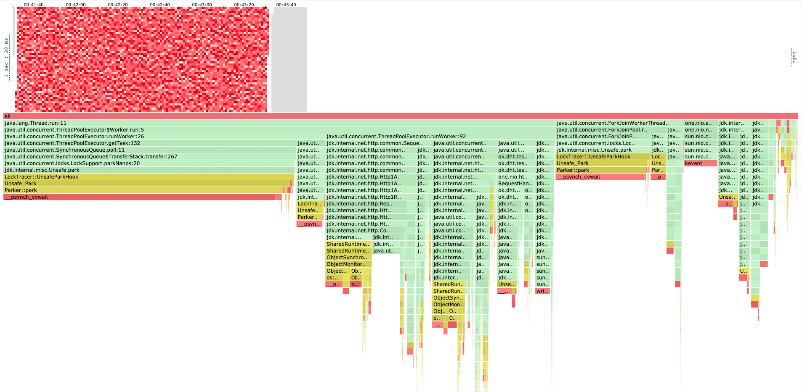
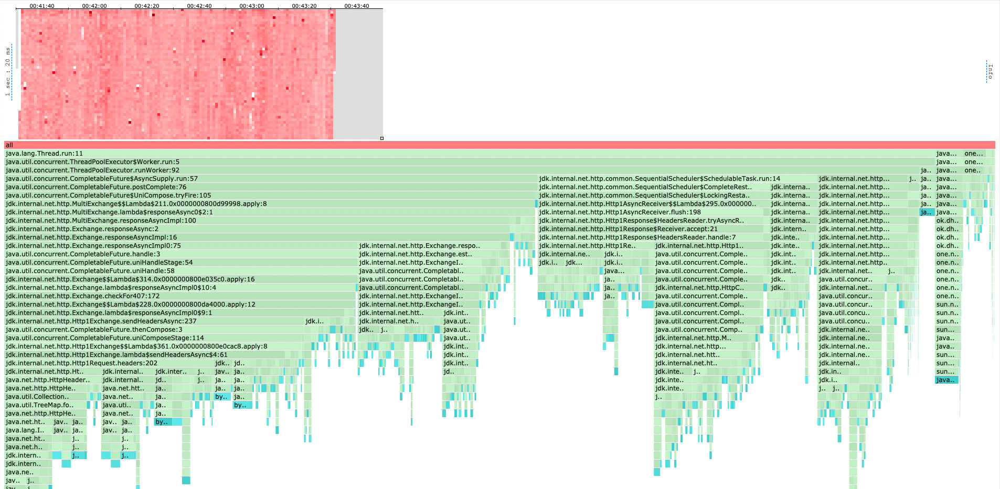
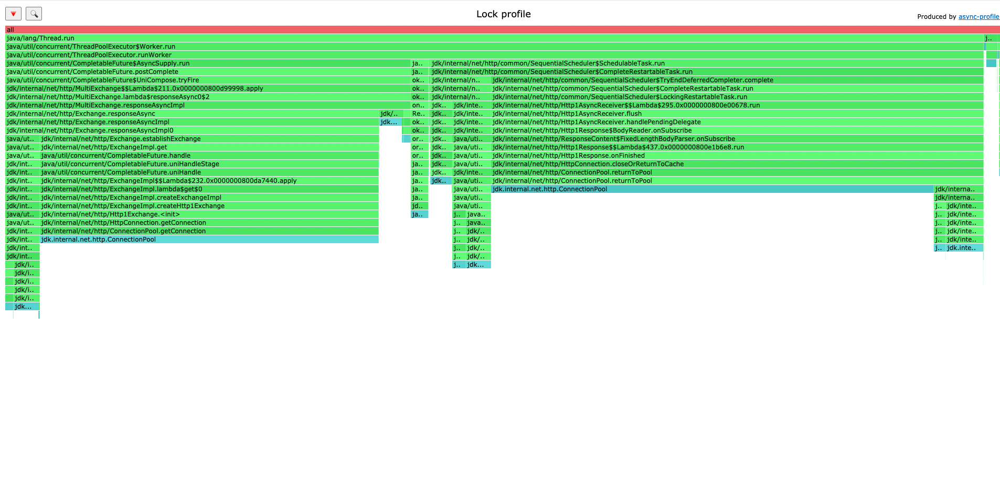
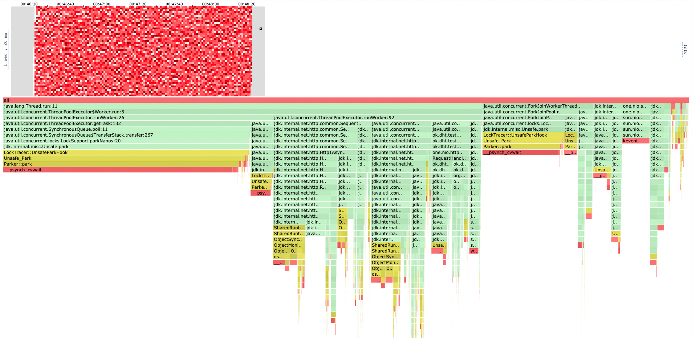
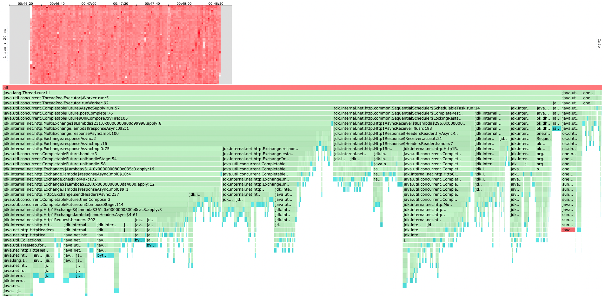

# Описание решения

Теперь вместо синхронной отправки запросов на реплики используется асинхронная. Чтобы координировать актуальный ответ
я разработал потокобезопасный класс ResponseAccumulator. После получения ответа на каждый из запросов будем в него сообщать
о том, что пришел успешный ответ.

Внутри поддерживаются два счетчика: кол-во успешных запросов и кол-во запросов обработанных в целом. Также я сразу поддерживаю
сразу самый актуальный ответ (с последним таймштампом), его я обновляю в CAS-loop'е. Некоторые мысли по поводу такой реализации
я отписал в выводах в конце отчета.

В итоге мы отправим один ответ. Либо когда получим ack успешных ответов, либо когда получим все (в т.ч неуспешные) ответы
от всех реплик. Тогда, (если мы еще не послали успешный ответ) отправим ошибку 504.

Все остальное в целом по коду осталось неизменным.

# Нагрузочное тестирование

Тестировать я буду с 3 шардами в кластере и c дефолтным кворумом (ack = 2/from = 3).
Для начала, в лучших традициях, наполним наши шарды данными, по гигабайту на каждый, чтобы тестировать работу не только в
оперативной памяти.

Сравнивать буду с решением из прошлого задания, чтобы понять, какой выигрыш нам дала асинхронная реализация.

## PUT

Тестировать будем как всегда уже проверенным скриптом
```
request = function()
url = '/v0/entity?id=key' .. math.random(1, m)
body = 'value' .. math.random(1, 1000)

    return wrk.format("PUT", url, {}, body)
end
```
m положим равным 100000.

Начнем, как всегда, с RPS в 30000, чтобы нащупать оптимальный

```
wrk2 -t 16 -c 64 -d 2m -R 30000 -L http://localhost:19234 -s load_testing_put.lua
Running 2m test @ http://localhost:19234
  16 threads and 64 connections
  Thread calibration: mean lat.: 3950.847ms, rate sampling interval: 12787ms
  Thread calibration: mean lat.: 3937.335ms, rate sampling interval: 12730ms
  Thread calibration: mean lat.: 3946.029ms, rate sampling interval: 12828ms
  Thread calibration: mean lat.: 3949.333ms, rate sampling interval: 12804ms
  Thread calibration: mean lat.: 3959.323ms, rate sampling interval: 12836ms
  Thread calibration: mean lat.: 3960.274ms, rate sampling interval: 12886ms
  Thread calibration: mean lat.: 3937.797ms, rate sampling interval: 12820ms
  Thread calibration: mean lat.: 3960.115ms, rate sampling interval: 12918ms
  Thread calibration: mean lat.: 3927.180ms, rate sampling interval: 12820ms
  Thread calibration: mean lat.: 3944.509ms, rate sampling interval: 12795ms
  Thread calibration: mean lat.: 3961.746ms, rate sampling interval: 12828ms
  Thread calibration: mean lat.: 3972.129ms, rate sampling interval: 12861ms
  Thread calibration: mean lat.: 3975.827ms, rate sampling interval: 12935ms
  Thread calibration: mean lat.: 3904.193ms, rate sampling interval: 12730ms
  Thread calibration: mean lat.: 3950.016ms, rate sampling interval: 12836ms
  Thread calibration: mean lat.: 3971.249ms, rate sampling interval: 12877ms
  Thread Stats   Avg      Stdev     Max   +/- Stdev
    Latency    42.05s    21.13s    1.31m    56.90%
    Req/Sec   656.26     37.83   715.00     75.00%
  Latency Distribution (HdrHistogram - Recorded Latency)
 50.000%   42.60s 
 75.000%    1.01m 
 90.000%    1.19m 
 99.000%    1.29m 
 99.900%    1.31m 
 99.990%    1.31m 
 99.999%    1.31m 
100.000%    1.31m 

  Detailed Percentile spectrum:
       Value   Percentile   TotalCount 1/(1-Percentile)

    6844.415     0.000000            2         1.00
   13254.655     0.100000       115654         1.11
   19709.951     0.200000       231174         1.25
   26542.079     0.300000       346876         1.43
   33587.199     0.400000       462186         1.67
   42598.399     0.500000       578174         2.00
   46268.415     0.550000       635477         2.22
   49938.431     0.600000       693346         2.50
   53542.911     0.650000       751283         2.86
   57049.087     0.700000       808920         3.33
   60653.567     0.750000       866933         4.00
   62357.503     0.775000       895464         4.44
   64094.207     0.800000       924528         5.00
   65929.215     0.825000       953559         5.71
   67764.223     0.850000       983093         6.67
   69599.231     0.875000      1011983         8.00
   70451.199     0.887500      1026241         8.89
   71303.167     0.900000      1040118        10.00
   72220.671     0.912500      1054764        11.43
   73138.175     0.925000      1069641        13.33
   73924.607     0.937500      1083711        16.00
   74317.823     0.943750      1090492        17.78
   74776.575     0.950000      1098299        20.00
   75235.327     0.956250      1105699        22.86
   75694.079     0.962500      1112653        26.67
   76152.831     0.968750      1120077        32.00
   76349.439     0.971875      1123570        35.56
   76546.047     0.975000      1126925        40.00
   76742.655     0.978125      1130186        45.71
   77004.799     0.981250      1134234        53.33
   77266.943     0.984375      1138029        64.00
   77398.015     0.985938      1139898        71.11
   77529.087     0.987500      1141943        80.00
   77594.623     0.989062      1143022        91.43
   77725.695     0.990625      1145200       106.67
   77856.767     0.992188      1147396       128.00
   77856.767     0.992969      1147396       142.22
   77922.303     0.993750      1148517       160.00
   77987.839     0.994531      1149619       182.86
   78053.375     0.995313      1150719       213.33
   78118.911     0.996094      1151771       256.00
   78118.911     0.996484      1151771       284.44
   78118.911     0.996875      1151771       320.00
   78184.447     0.997266      1152624       365.71
   78249.983     0.997656      1153390       426.67
   78249.983     0.998047      1153390       512.00
   78249.983     0.998242      1153390       568.89
   78315.519     0.998437      1154086       640.00
   78315.519     0.998633      1154086       731.43
   78315.519     0.998828      1154086       853.33
   78381.055     0.999023      1154599      1024.00
   78381.055     0.999121      1154599      1137.78
   78381.055     0.999219      1154599      1280.00
   78381.055     0.999316      1154599      1462.86
   78446.591     0.999414      1154946      1706.67
   78446.591     0.999512      1154946      2048.00
   78446.591     0.999561      1154946      2275.56
   78446.591     0.999609      1154946      2560.00
   78512.127     0.999658      1155202      2925.71
   78512.127     0.999707      1155202      3413.33
   78512.127     0.999756      1155202      4096.00
   78512.127     0.999780      1155202      4551.11
   78512.127     0.999805      1155202      5120.00
   78512.127     0.999829      1155202      5851.43
   78512.127     0.999854      1155202      6826.67
   78577.663     0.999878      1155323      8192.00
   78577.663     0.999890      1155323      9102.22
   78577.663     0.999902      1155323     10240.00
   78577.663     0.999915      1155323     11702.86
   78577.663     0.999927      1155323     13653.33
   78577.663     0.999939      1155323     16384.00
   78577.663     0.999945      1155323     18204.44
   78577.663     0.999951      1155323     20480.00
   78577.663     0.999957      1155323     23405.71
   78577.663     0.999963      1155323     27306.67
   78643.199     0.999969      1155360     32768.00
   78643.199     0.999973      1155360     36408.89
   78643.199     0.999976      1155360     40960.00
   78643.199     0.999979      1155360     46811.43
   78643.199     0.999982      1155360     54613.33
   78643.199     0.999985      1155360     65536.00
   78643.199     0.999986      1155360     72817.78
   78643.199     0.999988      1155360     81920.00
   78643.199     0.999989      1155360     93622.86
   78643.199     0.999991      1155360    109226.67
   78643.199     0.999992      1155360    131072.00
   78643.199     0.999993      1155360    145635.56
   78643.199     0.999994      1155360    163840.00
   78643.199     0.999995      1155360    187245.71
   78643.199     0.999995      1155360    218453.33
   78643.199     0.999996      1155360    262144.00
   78643.199     0.999997      1155360    291271.11
   78643.199     0.999997      1155360    327680.00
   78643.199     0.999997      1155360    374491.43
   78643.199     0.999998      1155360    436906.67
   78643.199     0.999998      1155360    524288.00
   78708.735     0.999998      1155362    582542.22
   78708.735     1.000000      1155362          inf
#[Mean    =    42047.306, StdDeviation   =    21129.818]
#[Max     =    78643.200, Total count    =      1155362]
#[Buckets =           27, SubBuckets     =         2048]
----------------------------------------------------------
  1247129 requests in 2.00m, 79.69MB read
Requests/sec:  10392.34
Transfer/sec:    679.97KB
```

Получили ожидаемый захлеб, попробуем меньше.

```
wrk2 -t 16 -c 64 -d 2m -R 10500 -L http://localhost:19234 -s load_testing_put.lua
Running 2m test @ http://localhost:19234
  16 threads and 64 connections
  Thread calibration: mean lat.: 238.220ms, rate sampling interval: 712ms
  Thread calibration: mean lat.: 208.550ms, rate sampling interval: 632ms
  Thread calibration: mean lat.: 251.078ms, rate sampling interval: 674ms
  Thread calibration: mean lat.: 205.160ms, rate sampling interval: 647ms
  Thread calibration: mean lat.: 217.224ms, rate sampling interval: 660ms
  Thread calibration: mean lat.: 263.026ms, rate sampling interval: 791ms
  Thread calibration: mean lat.: 230.888ms, rate sampling interval: 732ms
  Thread calibration: mean lat.: 233.001ms, rate sampling interval: 696ms
  Thread calibration: mean lat.: 218.329ms, rate sampling interval: 712ms
  Thread calibration: mean lat.: 254.495ms, rate sampling interval: 742ms
  Thread calibration: mean lat.: 224.807ms, rate sampling interval: 742ms
  Thread calibration: mean lat.: 232.198ms, rate sampling interval: 681ms
  Thread calibration: mean lat.: 202.209ms, rate sampling interval: 603ms
  Thread calibration: mean lat.: 229.801ms, rate sampling interval: 706ms
  Thread calibration: mean lat.: 239.249ms, rate sampling interval: 726ms
  Thread calibration: mean lat.: 222.591ms, rate sampling interval: 662ms
  Thread Stats   Avg      Stdev     Max   +/- Stdev
    Latency   102.94ms  109.86ms 589.82ms   82.44%
    Req/Sec   656.29     27.10   724.00     77.68%
  Latency Distribution (HdrHistogram - Recorded Latency)
 50.000%   52.41ms
 75.000%  177.79ms
 90.000%  260.61ms
 99.000%  431.87ms
 99.900%  545.28ms
 99.990%  579.58ms
 99.999%  587.77ms
100.000%  590.34ms

  Detailed Percentile spectrum:
       Value   Percentile   TotalCount 1/(1-Percentile)

       0.239     0.000000            1         1.00
       4.991     0.100000       115519         1.11
       7.879     0.200000       230947         1.25
      14.599     0.300000       346387         1.43
      28.127     0.400000       461893         1.67
      52.415     0.500000       577403         2.00
      73.919     0.550000       635055         2.22
     105.151     0.600000       692855         2.50
     133.119     0.650000       750718         2.86
     155.647     0.700000       808299         3.33
     177.791     0.750000       866149         4.00
     188.927     0.775000       894943         4.44
     200.575     0.800000       923995         5.00
     213.247     0.825000       952702         5.71
     227.327     0.850000       981650         6.67
     242.303     0.875000      1010456         8.00
     250.495     0.887500      1024832         8.89
     260.607     0.900000      1039296        10.00
     271.615     0.912500      1053666        11.43
     283.903     0.925000      1068107        13.33
     298.239     0.937500      1082487        16.00
     306.943     0.943750      1089847        17.78
     316.927     0.950000      1096898        20.00
     327.423     0.956250      1104109        22.86
     340.223     0.962500      1111327        26.67
     353.535     0.968750      1118569        32.00
     361.215     0.971875      1122258        35.56
     369.663     0.975000      1125849        40.00
     378.367     0.978125      1129465        45.71
     387.071     0.981250      1133024        53.33
     400.895     0.984375      1136629        64.00
     409.343     0.985938      1138405        71.11
     417.023     0.987500      1140203        80.00
     425.983     0.989062      1142007        91.43
     435.711     0.990625      1143844       106.67
     446.463     0.992188      1145626       128.00
     452.351     0.992969      1146525       142.22
     457.471     0.993750      1147425       160.00
     463.871     0.994531      1148314       182.86
     472.063     0.995313      1149217       213.33
     483.839     0.996094      1150130       256.00
     489.983     0.996484      1150567       284.44
     495.871     0.996875      1151015       320.00
     501.759     0.997266      1151480       365.71
     513.279     0.997656      1151919       426.67
     523.007     0.998047      1152368       512.00
     526.847     0.998242      1152598       568.89
     531.455     0.998437      1152840       640.00
     537.087     0.998633      1153052       731.43
     541.695     0.998828      1153271       853.33
     545.791     0.999023      1153502      1024.00
     548.351     0.999121      1153630      1137.78
     550.399     0.999219      1153727      1280.00
     553.471     0.999316      1153841      1462.86
     556.031     0.999414      1153957      1706.67
     558.079     0.999512      1154061      2048.00
     559.615     0.999561      1154133      2275.56
     561.151     0.999609      1154185      2560.00
     562.687     0.999658      1154232      2925.71
     564.735     0.999707      1154288      3413.33
     566.783     0.999756      1154347      4096.00
     567.807     0.999780      1154373      4551.11
     569.343     0.999805      1154402      5120.00
     571.391     0.999829      1154438      5851.43
     572.415     0.999854      1154459      6826.67
     574.463     0.999878      1154485      8192.00
     576.511     0.999890      1154496      9102.22
     579.583     0.999902      1154510     10240.00
     581.119     0.999915      1154526     11702.86
     582.655     0.999927      1154542     13653.33
     583.679     0.999939      1154555     16384.00
     584.191     0.999945      1154563     18204.44
     584.703     0.999951      1154571     20480.00
     585.215     0.999957      1154575     23405.71
     585.727     0.999963      1154582     27306.67
     586.239     0.999969      1154591     32768.00
     586.239     0.999973      1154591     36408.89
     586.751     0.999976      1154599     40960.00
     586.751     0.999979      1154599     46811.43
     587.263     0.999982      1154606     54613.33
     587.263     0.999985      1154606     65536.00
     587.775     0.999986      1154610     72817.78
     587.775     0.999988      1154610     81920.00
     587.775     0.999989      1154610     93622.86
     588.287     0.999991      1154614    109226.67
     588.287     0.999992      1154614    131072.00
     588.799     0.999993      1154619    145635.56
     588.799     0.999994      1154619    163840.00
     588.799     0.999995      1154619    187245.71
     588.799     0.999995      1154619    218453.33
     588.799     0.999996      1154619    262144.00
     588.799     0.999997      1154619    291271.11
     588.799     0.999997      1154619    327680.00
     588.799     0.999997      1154619    374491.43
     589.311     0.999998      1154620    436906.67
     589.311     0.999998      1154620    524288.00
     589.823     0.999998      1154621    582542.22
     589.823     0.999998      1154621    655360.00
     589.823     0.999999      1154621    748982.86
     589.823     0.999999      1154621    873813.33
     589.823     0.999999      1154621   1048576.00
     590.335     0.999999      1154622   1165084.44
     590.335     1.000000      1154622          inf
#[Mean    =      102.936, StdDeviation   =      109.864]
#[Max     =      589.824, Total count    =      1154622]
#[Buckets =           27, SubBuckets     =         2048]
----------------------------------------------------------
  1259335 requests in 2.00m, 80.47MB read
Requests/sec:  10494.19
Transfer/sec:    686.63KB
```

Мы выдерживаем RPS в примерно 10500, видим распределение latency без аномалий. Сравним с синхронной реализацией:

```
wrk2 -t 16 -c 64 -d 2m -R 10500 -L http://localhost:19234 -s load_testing_put.lua
Running 2m test @ http://localhost:19234
  16 threads and 64 connections
  Thread calibration: mean lat.: 56.693ms, rate sampling interval: 334ms
  Thread calibration: mean lat.: 99.035ms, rate sampling interval: 581ms
  Thread calibration: mean lat.: 326.775ms, rate sampling interval: 2547ms
  Thread calibration: mean lat.: 161.475ms, rate sampling interval: 1262ms
  Thread calibration: mean lat.: 232.778ms, rate sampling interval: 1417ms
  Thread calibration: mean lat.: 88.062ms, rate sampling interval: 487ms
  Thread calibration: mean lat.: 196.342ms, rate sampling interval: 1409ms
  Thread calibration: mean lat.: 323.327ms, rate sampling interval: 3110ms
  Thread calibration: mean lat.: 696.209ms, rate sampling interval: 4902ms
  Thread calibration: mean lat.: 113.648ms, rate sampling interval: 518ms
  Thread calibration: mean lat.: 337.208ms, rate sampling interval: 2465ms
  Thread calibration: mean lat.: 562.399ms, rate sampling interval: 5378ms
  Thread calibration: mean lat.: 429.620ms, rate sampling interval: 2639ms
  Thread calibration: mean lat.: 592.262ms, rate sampling interval: 5812ms
  Thread calibration: mean lat.: 997.213ms, rate sampling interval: 8765ms
  Thread calibration: mean lat.: 96.072ms, rate sampling interval: 610ms
  Thread Stats   Avg      Stdev     Max   +/- Stdev
    Latency     2.84s    10.58s    1.81m    94.31%
    Req/Sec   564.67    442.50     4.48k    89.27%
  Latency Distribution (HdrHistogram - Recorded Latency)
 50.000%    2.73ms
 75.000%  333.06ms
 90.000%    5.48s 
 99.000%    0.98m 
 99.900%    1.71m 
 99.990%    1.80m 
 99.999%    1.81m 
100.000%    1.81m 

  Detailed Percentile spectrum:
       Value   Percentile   TotalCount 1/(1-Percentile)

       0.089     0.000000            1         1.00
       0.733     0.100000       101065         1.11
       1.062     0.200000       201798         1.25
       1.355     0.300000       302604         1.43
       1.756     0.400000       403606         1.67
       2.725     0.500000       504324         2.00
       4.471     0.550000       554757         2.22
      10.967     0.600000       605154         2.50
      36.991     0.650000       655597         2.86
     122.367     0.700000       706023         3.33
     333.055     0.750000       756467         4.00
     521.983     0.775000       781666         4.44
     811.519     0.800000       806874         5.00
    1270.783     0.825000       832090         5.71
    2021.375     0.850000       857319         6.67
    3297.279     0.875000       882525         8.00
    4272.127     0.887500       895125         8.89
    5476.351     0.900000       907731        10.00
    7135.231     0.912500       920357        11.43
    9183.231     0.925000       932948        13.33
   11952.127     0.937500       945572        16.00
   13631.487     0.943750       951871        17.78
   15884.287     0.950000       958184        20.00
   18628.607     0.956250       964470        22.86
   22118.399     0.962500       970786        26.67
   27148.287     0.968750       977083        32.00
   30932.991     0.971875       980228        35.56
   34570.239     0.975000       983377        40.00
   38436.863     0.978125       986542        45.71
   42729.471     0.981250       989683        53.33
   48136.191     0.984375       992844        64.00
   51019.775     0.985938       994422        71.11
   54001.663     0.987500       995999        80.00
   56852.479     0.989062       997563        91.43
   59834.367     0.990625       999143       106.67
   65601.535     0.992188      1000713       128.00
   69795.839     0.992969      1001498       142.22
   74055.679     0.993750      1002286       160.00
   78577.663     0.994531      1003083       182.86
   82444.287     0.995313      1003868       213.33
   86638.591     0.996094      1004650       256.00
   88801.279     0.996484      1005055       284.44
   90832.895     0.996875      1005440       320.00
   93061.119     0.997266      1005835       365.71
   95289.343     0.997656      1006226       426.67
   97386.495     0.998047      1006623       512.00
   98500.607     0.998242      1006819       568.89
   99680.255     0.998437      1007024       640.00
  100728.831     0.998633      1007214       731.43
  101842.943     0.998828      1007415       853.33
  102957.055     0.999023      1007609      1024.00
  103546.879     0.999121      1007714      1137.78
  104071.167     0.999219      1007805      1280.00
  104660.991     0.999316      1007907      1462.86
  105250.815     0.999414      1008009      1706.67
  105775.103     0.999512      1008099      2048.00
  106102.783     0.999561      1008156      2275.56
  106364.927     0.999609      1008202      2560.00
  106627.071     0.999658      1008247      2925.71
  106954.751     0.999707      1008304      3413.33
  107216.895     0.999756      1008350      4096.00
  107347.967     0.999780      1008373      4551.11
  107479.039     0.999805      1008396      5120.00
  107610.111     0.999829      1008419      5851.43
  107741.183     0.999854      1008443      6826.67
  107872.255     0.999878      1008467      8192.00
  107937.791     0.999890      1008479      9102.22
  108068.863     0.999902      1008502     10240.00
  108134.399     0.999915      1008514     11702.86
  108199.935     0.999927      1008525     13653.33
  108265.471     0.999939      1008537     16384.00
  108265.471     0.999945      1008537     18204.44
  108331.007     0.999951      1008548     20480.00
  108331.007     0.999957      1008548     23405.71
  108396.543     0.999963      1008562     27306.67
  108396.543     0.999969      1008562     32768.00
  108396.543     0.999973      1008562     36408.89
  108462.079     0.999976      1008575     40960.00
  108462.079     0.999979      1008575     46811.43
  108462.079     0.999982      1008575     54613.33
  108462.079     0.999985      1008575     65536.00
  108527.615     0.999986      1008589     72817.78
  108527.615     1.000000      1008589          inf
#[Mean    =     2837.908, StdDeviation   =    10580.932]
#[Max     =   108462.080, Total count    =      1008589]
#[Buckets =           27, SubBuckets     =         2048]
----------------------------------------------------------
  1083644 requests in 2.00m, 69.24MB read
  Socket errors: connect 0, read 0, write 0, timeout 898
Requests/sec:   9030.50
Transfer/sec:    590.86KB
```

На тех же самых 10500 RPS видим сильный захлеб, latency на высоких персентилях улетает в две минуты. Из прошлого отчета
мы знаем, что там мы держали примерно 8000 RPS. То есть прирост примерно 31 процент по latency

## GET

Начнем, как всегда, с RPS в 30000, чтобы нащупать оптимальный

```
wrk2 -t 16 -c 64 -d 2m -R 30000 -L http://localhost:19234 -s load_testing_get.lua
Running 2m test @ http://localhost:19234
  16 threads and 64 connections
  Thread calibration: mean lat.: 3591.392ms, rate sampling interval: 11894ms
  Thread calibration: mean lat.: 3606.481ms, rate sampling interval: 11935ms
  Thread calibration: mean lat.: 3594.532ms, rate sampling interval: 11894ms
  Thread calibration: mean lat.: 3581.657ms, rate sampling interval: 11886ms
  Thread calibration: mean lat.: 3587.373ms, rate sampling interval: 11870ms
  Thread calibration: mean lat.: 3623.061ms, rate sampling interval: 11993ms
  Thread calibration: mean lat.: 3591.663ms, rate sampling interval: 11894ms
  Thread calibration: mean lat.: 3608.489ms, rate sampling interval: 11968ms
  Thread calibration: mean lat.: 3586.008ms, rate sampling interval: 11878ms
  Thread calibration: mean lat.: 3594.265ms, rate sampling interval: 11911ms
  Thread calibration: mean lat.: 3593.293ms, rate sampling interval: 11927ms
  Thread calibration: mean lat.: 3578.464ms, rate sampling interval: 11853ms
  Thread calibration: mean lat.: 3597.353ms, rate sampling interval: 11919ms
  Thread calibration: mean lat.: 3600.143ms, rate sampling interval: 11943ms
  Thread calibration: mean lat.: 3593.133ms, rate sampling interval: 11911ms
  Thread calibration: mean lat.: 3572.935ms, rate sampling interval: 11853ms
  Thread Stats   Avg      Stdev     Max   +/- Stdev
    Latency    41.47s    20.28s    1.28m    57.55%
    Req/Sec   678.39     12.33   696.00     69.44%
  Latency Distribution (HdrHistogram - Recorded Latency)
 50.000%   41.78s 
 75.000%    0.99m 
 90.000%    1.16m 
 99.000%    1.27m 
 99.900%    1.28m 
 99.990%    1.28m 
 99.999%    1.28m 
100.000%    1.28m 

  Detailed Percentile spectrum:
       Value   Percentile   TotalCount 1/(1-Percentile)

    6496.255     0.000000            1         1.00
   13426.687     0.100000       119542         1.11
   20365.311     0.200000       238885         1.25
   27312.127     0.300000       358387         1.43
   34144.255     0.400000       477702         1.67
   41779.199     0.500000       597174         2.00
   45187.071     0.550000       657400         2.22
   48562.175     0.600000       716536         2.50
   52068.351     0.650000       776688         2.86
   55607.295     0.700000       836300         3.33
   59146.239     0.750000       895923         4.00
   60882.943     0.775000       926098         4.44
   62586.879     0.800000       955577         5.00
   64290.815     0.825000       985632         5.71
   65994.751     0.850000      1015365         6.67
   67698.687     0.875000      1045117         8.00
   68616.191     0.887500      1061021         8.89
   69468.159     0.900000      1075316        10.00
   70385.663     0.912500      1090789        11.43
   71237.631     0.925000      1105686        13.33
   72089.599     0.937500      1120160        16.00
   72679.423     0.943750      1127852        17.78
   73203.711     0.950000      1135250        20.00
   73662.463     0.956250      1142782        22.86
   74121.215     0.962500      1150462        26.67
   74579.967     0.968750      1157310        32.00
   74776.575     0.971875      1160694        35.56
   75038.719     0.975000      1165492        40.00
   75235.327     0.978125      1169112        45.71
   75431.935     0.981250      1172660        53.33
   75628.543     0.984375      1176156        64.00
   75759.615     0.985938      1178337        71.11
   75825.151     0.987500      1179451        80.00
   75956.223     0.989062      1181638        91.43
   76087.295     0.990625      1183830       106.67
   76152.831     0.992188      1184902       128.00
   76218.367     0.992969      1185930       142.22
   76283.903     0.993750      1186928       160.00
   76349.439     0.994531      1187923       182.86
   76414.975     0.995313      1188927       213.33
   76480.511     0.996094      1189949       256.00
   76546.047     0.996484      1190926       284.44
   76546.047     0.996875      1190926       320.00
   76611.583     0.997266      1191808       365.71
   76611.583     0.997656      1191808       426.67
   76677.119     0.998047      1192578       512.00
   76677.119     0.998242      1192578       568.89
   76677.119     0.998437      1192578       640.00
   76677.119     0.998633      1192578       731.43
   76742.655     0.998828      1193202       853.33
   76742.655     0.999023      1193202      1024.00
   76742.655     0.999121      1193202      1137.78
   76808.191     0.999219      1193636      1280.00
   76808.191     0.999316      1193636      1462.86
   76808.191     0.999414      1193636      1706.67
   76808.191     0.999512      1193636      2048.00
   76873.727     0.999561      1193917      2275.56
   76873.727     0.999609      1193917      2560.00
   76873.727     0.999658      1193917      2925.71
   76873.727     0.999707      1193917      3413.33
   76873.727     0.999756      1193917      4096.00
   76939.263     0.999780      1194131      4551.11
   76939.263     0.999805      1194131      5120.00
   76939.263     0.999829      1194131      5851.43
   76939.263     0.999854      1194131      6826.67
   76939.263     0.999878      1194131      8192.00
   76939.263     0.999890      1194131      9102.22
   76939.263     0.999902      1194131     10240.00
   76939.263     0.999915      1194131     11702.86
   76939.263     0.999927      1194131     13653.33
   76939.263     0.999939      1194131     16384.00
   77004.799     0.999945      1194191     18204.44
   77004.799     0.999951      1194191     20480.00
   77004.799     0.999957      1194191     23405.71
   77004.799     0.999963      1194191     27306.67
   77004.799     0.999969      1194191     32768.00
   77004.799     0.999973      1194191     36408.89
   77004.799     0.999976      1194191     40960.00
   77004.799     0.999979      1194191     46811.43
   77004.799     0.999982      1194191     54613.33
   77004.799     0.999985      1194191     65536.00
   77004.799     0.999986      1194191     72817.78
   77004.799     0.999988      1194191     81920.00
   77004.799     0.999989      1194191     93622.86
   77070.335     0.999991      1194203    109226.67
   77070.335     1.000000      1194203          inf
#[Mean    =    41474.919, StdDeviation   =    20282.990]
#[Max     =    77004.800, Total count    =      1194203]
#[Buckets =           27, SubBuckets     =         2048]
----------------------------------------------------------
  1295903 requests in 2.00m, 86.12MB read
  Non-2xx or 3xx responses: 294774
Requests/sec:  10796.29
Transfer/sec:    734.73KB
```

Получили ожидаемый захлеб, попробуем меньше.

```
wrk2 -t 16 -c 64 -d 2m -R 9800 -L http://localhost:19234 -s load_testing_get.lua
Running 2m test @ http://localhost:19234
  16 threads and 64 connections
  Thread calibration: mean lat.: 278.856ms, rate sampling interval: 892ms
  Thread calibration: mean lat.: 282.587ms, rate sampling interval: 900ms
  Thread calibration: mean lat.: 295.486ms, rate sampling interval: 879ms
  Thread calibration: mean lat.: 312.832ms, rate sampling interval: 876ms
  Thread calibration: mean lat.: 295.012ms, rate sampling interval: 903ms
  Thread calibration: mean lat.: 283.930ms, rate sampling interval: 885ms
  Thread calibration: mean lat.: 351.109ms, rate sampling interval: 967ms
  Thread calibration: mean lat.: 272.823ms, rate sampling interval: 879ms
  Thread calibration: mean lat.: 257.447ms, rate sampling interval: 826ms
  Thread calibration: mean lat.: 277.945ms, rate sampling interval: 902ms
  Thread calibration: mean lat.: 318.378ms, rate sampling interval: 958ms
  Thread calibration: mean lat.: 244.875ms, rate sampling interval: 794ms
  Thread calibration: mean lat.: 314.189ms, rate sampling interval: 956ms
  Thread calibration: mean lat.: 282.425ms, rate sampling interval: 932ms
  Thread calibration: mean lat.: 303.163ms, rate sampling interval: 927ms
  Thread calibration: mean lat.: 265.060ms, rate sampling interval: 851ms
  Thread Stats   Avg      Stdev     Max   +/- Stdev
    Latency    77.15ms  153.70ms 889.34ms   86.74%
    Req/Sec   612.53     28.30   751.00     83.14%
  Latency Distribution (HdrHistogram - Recorded Latency)
 50.000%    6.90ms
 75.000%   43.39ms
 90.000%  298.24ms
 99.000%  678.91ms
 99.900%  775.17ms
 99.990%  859.13ms
 99.999%  885.76ms
100.000%  889.86ms

  Detailed Percentile spectrum:
       Value   Percentile   TotalCount 1/(1-Percentile)

       0.199     0.000000            1         1.00
       1.742     0.100000       107912         1.11
       2.387     0.200000       215766         1.25
       3.291     0.300000       323599         1.43
       4.771     0.400000       431262         1.67
       6.899     0.500000       539054         2.00
       8.679     0.550000       592965         2.22
      11.655     0.600000       646957         2.50
      16.559     0.650000       700828         2.86
      25.071     0.700000       754720         3.33
      43.391     0.750000       808569         4.00
      62.943     0.775000       835538         4.44
     101.247     0.800000       862474         5.00
     152.703     0.825000       889494         5.71
     196.479     0.850000       916444         6.67
     246.015     0.875000       943334         8.00
     272.383     0.887500       956872         8.89
     298.239     0.900000       970279        10.00
     326.655     0.912500       983809        11.43
     359.935     0.925000       997242        13.33
     402.431     0.937500      1010777        16.00
     426.495     0.943750      1017502        17.78
     455.679     0.950000      1024226        20.00
     488.959     0.956250      1030930        22.86
     526.847     0.962500      1037690        26.67
     559.615     0.968750      1044469        32.00
     575.487     0.971875      1047783        35.56
     591.871     0.975000      1051180        40.00
     608.255     0.978125      1054597        45.71
     624.127     0.981250      1057890        53.33
     642.047     0.984375      1061323        64.00
     651.775     0.985938      1063016        71.11
     662.015     0.987500      1064697        80.00
     672.255     0.989062      1066344        91.43
     682.495     0.990625      1067984       106.67
     693.759     0.992188      1069679       128.00
     699.391     0.992969      1070524       142.22
     706.559     0.993750      1071407       160.00
     712.703     0.994531      1072200       182.86
     720.895     0.995313      1073056       213.33
     729.087     0.996094      1073913       256.00
     732.671     0.996484      1074325       284.44
     736.255     0.996875      1074724       320.00
     740.351     0.997266      1075154       365.71
     745.983     0.997656      1075590       426.67
     752.639     0.998047      1075999       512.00
     756.735     0.998242      1076193       568.89
     760.831     0.998437      1076422       640.00
     764.415     0.998633      1076614       731.43
     769.023     0.998828      1076831       853.33
     776.703     0.999023      1077037      1024.00
     781.823     0.999121      1077142      1137.78
     785.407     0.999219      1077243      1280.00
     790.015     0.999316      1077353      1462.86
     795.135     0.999414      1077455      1706.67
     801.791     0.999512      1077560      2048.00
     804.863     0.999561      1077632      2275.56
     806.399     0.999609      1077671      2560.00
     808.447     0.999658      1077718      2925.71
     811.519     0.999707      1077770      3413.33
     821.759     0.999756      1077823      4096.00
     834.047     0.999780      1077850      4551.11
     844.287     0.999805      1077875      5120.00
     849.919     0.999829      1077901      5851.43
     852.479     0.999854      1077929      6826.67
     855.551     0.999878      1077954      8192.00
     857.087     0.999890      1077968      9102.22
     859.135     0.999902      1077980     10240.00
     861.695     0.999915      1077993     11702.86
     865.279     0.999927      1078010     13653.33
     866.815     0.999939      1078020     16384.00
     868.351     0.999945      1078026     18204.44
     871.423     0.999951      1078033     20480.00
     877.567     0.999957      1078041     23405.71
     879.615     0.999963      1078046     27306.67
     881.151     0.999969      1078053     32768.00
     881.663     0.999973      1078056     36408.89
     882.687     0.999976      1078059     40960.00
     883.711     0.999979      1078065     46811.43
     884.223     0.999982      1078066     54613.33
     885.247     0.999985      1078071     65536.00
     885.247     0.999986      1078071     72817.78
     885.759     0.999988      1078074     81920.00
     885.759     0.999989      1078074     93622.86
     886.783     0.999991      1078079    109226.67
     886.783     0.999992      1078079    131072.00
     886.783     0.999993      1078079    145635.56
     886.783     0.999994      1078079    163840.00
     887.295     0.999995      1078080    187245.71
     888.319     0.999995      1078081    218453.33
     888.319     0.999996      1078081    262144.00
     888.831     0.999997      1078083    291271.11
     888.831     0.999997      1078083    327680.00
     888.831     0.999997      1078083    374491.43
     888.831     0.999998      1078083    436906.67
     888.831     0.999998      1078083    524288.00
     889.343     0.999998      1078084    582542.22
     889.343     0.999998      1078084    655360.00
     889.343     0.999999      1078084    748982.86
     889.343     0.999999      1078084    873813.33
     889.343     0.999999      1078084   1048576.00
     889.855     0.999999      1078085   1165084.44
     889.855     1.000000      1078085          inf
#[Mean    =       77.148, StdDeviation   =      153.703]
#[Max     =      889.344, Total count    =      1078085]
#[Buckets =           27, SubBuckets     =         2048]
----------------------------------------------------------
  1175835 requests in 2.00m, 78.15MB read
  Non-2xx or 3xx responses: 267083
Requests/sec:   9798.86
Transfer/sec:    666.86KB
```

Тут уже мы держим меньший RPS в 9800. Это связано с тем, что GET сам по себе работает дольше,
плюс есть дополнительная, хоть и не очень большая, нагрузка на агрегацию ответов.
Однако, по прошлому отчету мы знаем, что синхронная реализация держала 11000, что больше чем наша
асинхронная. Напомню, что это вызвано оптимизацией которую я там написал: после получения ответов
от ack шардов я не посылал запросы на остальные, что, на нашей конфигурации, по сути уменьшало нагрузку
на шарды в полтора раза. Здесь такую оптимизацию провернуть не так тривиально, об этом я написал в выводах в
конце отчета.

# Профилирование с помощью async-profiler

## PUT

### CPU
#### Асинхронная реализация

#### Синхронная реализация


По CPU мы видим что профиль поменялся в основном в методах HttpClient'а что логично, ведь мы теперь отправляем
запросы асинхронно, а не синхронно. 

Сразу бросается в глаза ожидания на мониторах которых раньше не было, это получение
и возвращение connection'ов в кешированый пул. Я поизучал код, и, как я понял, HttpClient переиспользует некоторые 
connection'ы из пула чтобы каждый раз их не пересоздавать, и в этом пуле он использует synchronized чтобы туда 
класть/забирать.

Опять же на профиле очень много park'ов. Это связано с тем, что у нас используется сильно больше потоков чем ядер в системе,
например уже селекторов используется по кол-ву ядер, а также в каждом моем шарде для пула воркеров из ДЗ2. В связи с этим
часто переключается контекст.

Других аномалий я не вижу.

### ALLOC
#### Асинхронная реализация

#### Синхронная реализация


Тут бросается в глаза то, что раньше аллокации селектора занимали 34 процента от общего числа, то теперь это
всего-лишь 2 процента. Это вызвано тем, что сервис хуже справлялся c нагрузкой и селекоторы успели населектить 
запросов больше чем было обработано. В остальном, если смотреть на остальную часть профиля, она такая же,
как и раньше.

Основным спонсором аллокаций стали CompletableFuture и доп расходы на асинхронную обработку

### LOCK
#### Асинхронная реализация

#### Синхронная реализация


Тут профиль лок тоже немного поменялся. Асинхронная обработка реализована на пуле потоков, поэтому тут появились новые 
блокировки, в т.ч на пул соединений про который я писал в секции про CPU.

Код который я писал для ResponseAccumulator lock-free и в связи с этим понятно не светится на этом профиле.

## GET

### CPU
#### Асинхронная реализация

#### Синхронная реализация


Здесь профиль такой же как при PUT'е, однако видно больше работы на самой операции чтения из базы, так как в отличие от
PUT'а мы там не только ходим в оперативную память, но и бегаем по файликам, ищем наше значение.

### ALLOC
#### Асинхронная реализация

#### Синхронная реализация


Здесь тоже профиль практически идентичный PUT'у

### LOCK
#### Асинхронная реализация

#### Синхронная реализация


По сравнению с PUT'ом разница лишь в появлении блокировки в tryAsyncReceive на BodyReader'е. В целом оно и логично,
тело ответа надо получать, а в PUT'е тела ответа не было.

# Выводи и идеи по оптимизации
1. Получили выигрыш на 30% по RPS в случае PUT запросов. На GET запросах немного проиграли, но это можно решить
тем, что я описал в пункте 3.
2. Сейчас агрегация запросов для GET'а написана lock-free образом на CAS'ах. Если у нас будет много ответов,
которые придут в одно время, то в этих cas-loop'ах начнется contention. Чтобы этого избежать можно попробовать реализацию
с thread-safe массивом, в который воркеры будут складывать полученные запросы, а потом какой-то из них, получивший 
последний необходимый успешный ответ сам агрегирует ответы. Чтобы понять какой из этих способов лучше надо провести 
тесты на реальной сети с большим кол-вом шардов, потому что мои локальные тесты не показали статистически значимой
разницы.
3. Для GET запросов аналогично мой реализации из прошлой ДЗ нам достаточно запросов на ack шардов чтобы операция считалась
завершенной, а мы шлем практически в два раза больше. Можно замерить время за которое отвечает условно 99 персентиль на
нашем проде и условно делать следующее:
- Сначала отправляем GET запросы на ack шардов
- Не получив ответы за время 99 персентиля отправить остальные запросы (таймаут у нас сильно больше)
- Наш мини circuit breaker может помнить: лежит ли сейчас какой-то шард, и если лежит, то сразу посылать запросы
на все шарды
Это позволит сильно снизить нагрузку на наши шарды в общем и ускорить ответ на GET запросы.
4. Раз уж мы отсылаем одинаковые запросы на все шарды, можно попробовать слать их ip мультикастом. Но мне не совсем очевидно
даст ли это прирост в производительности
5. Все еще актуальна оптимизация по переходу с HTTP на RPC протокол с меньшим оверхедом
6. Сейчас у нас по сути шарды для репликации выбираются случайно, но мы можем хотеть, например, чтобы шарды были как можно 
ближе друг к другу (в одном ДЦ) чтобы ускорить ответ, или наоборот как можно дальше (в разных ДЦ), чтобы например технические
работы не портили нам доступность. Это тоже можно реализовать как эвристику и задавать в конфигурации сервиса.