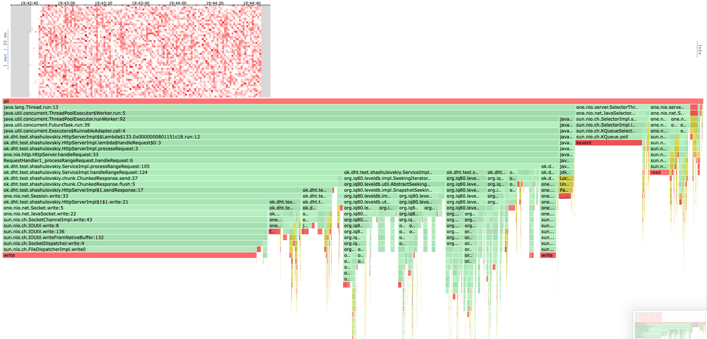
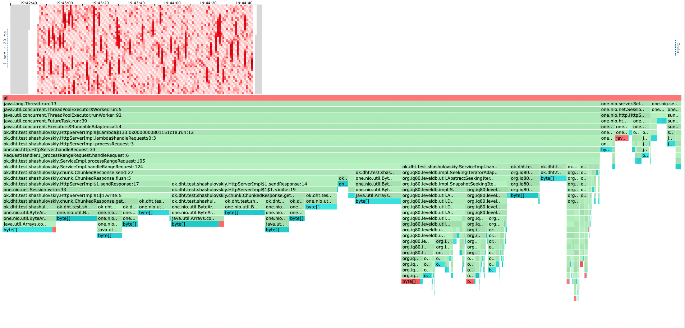

# Описание решения

Для получения данных с шарда был использован функционал итератора, имеющийся в LevelDB.

Для отправки данных был реализован [chunked transfer encoding](https://en.wikipedia.org/wiki/Chunked_transfer_encoding).
Основная реализация представлена в классе `ChunkedResponse`, а также в переопределенном методе `createSession` в классе
`HttpServerImpl`.
Основная идея такая: будем накапливать некий буфер, а по его заполнению отправлять данные пользователю.

# Профилирование и анализ с помощью wrk2

Для тестирования я написал вот такой скрипт:
```
request = function()
    m = 100000
    k = 10

    start = math.random(1, m - k)
    url = '/v0/entities?start=key' .. start .. '&end=key' .. start + k
    return wrk.format("GET", url, {})
end
```

Предварительно база на шарде была заполнена ~1 гигабайтом данных. Достаем данные из диапазона
\[key(N); key(N + K)]. Каждое значение по ключу имеет длину в 300 символов.

Очевидно, что чем больше K мы ставим, тем больше времени будет уходить на ответы. Давайте поймем насколько.

## Анализ размера диапазона

При k = 10 видим адекватный latency на RPS порядка 15000. Такое распределение latency здесь 
и далее вызвано тем, как много ключей попало в наш диапазон (база заполнена разряжено)

```
wrk2 -t 16 -c 64 -d 2m -R 15000 -L http://localhost:19234 -s load_testing_range.lua
Running 2m test @ http://localhost:19234
  16 threads and 64 connections
  Thread calibration: mean lat.: 22.407ms, rate sampling interval: 91ms
..
  Thread calibration: mean lat.: 38.116ms, rate sampling interval: 272ms
  Thread Stats   Avg      Stdev     Max   +/- Stdev
    Latency    11.19ms   40.27ms 729.60ms   93.70%
    Req/Sec     0.94k   214.22     3.15k    84.92%
  Latency Distribution (HdrHistogram - Recorded Latency)
 50.000%    1.18ms
 75.000%    1.74ms
 90.000%   12.54ms
 99.000%  202.50ms
 99.900%  418.30ms
 99.990%  606.21ms
 99.999%  687.10ms
100.000%  730.11ms

  Detailed Percentile spectrum:
       Value   Percentile   TotalCount 1/(1-Percentile)

       0.059     0.000000            1         1.00
..
     730.111     1.000000      1649686          inf
#[Mean    =       11.190, StdDeviation   =       40.275]
#[Max     =      729.600, Total count    =      1649686]
#[Buckets =           27, SubBuckets     =         2048]
----------------------------------------------------------
  1799205 requests in 2.00m, 19.87GB read
  Socket errors: connect 0, read 4, write 0, timeout 0
Requests/sec:  14993.57
Transfer/sec:    169.57MB

```

При k = 100 видим схожее распределение latency при RPS порядка 1500, что логично при размере 
интервала в 10 раз больше. Из этого мы можем сделать вывод, что зависимость примерно линейная.

## Анализ профилей с помощью async-profiler

В задании нас не просили этого делать, но мне все равно было интересно.
Тестирование проводилось на диапазоне в 100 ключей, без захлеба.

### CPU



Сразу бросается в глаза, что тут большую часть занимает поиск в бд, хотя раньше ее было трудно найти на профиле, но это
не удивительно, ведь теперь мы делаем там примерно в 100 раз больше работы.

Основная часть ушла на hasNext (14%). Хочется сказать что мы тратим слишком много работы на то, чтобы просто узнать есть
ли следующее значение, но если открыть реализацию, то hasNext сразу достает из базы следующее значение, и уже затем проверяет,
существует оно или нет. Значит тут мы не сильно проигрываем. 

Тут же мы видим одну проблему: мы достаем значения из базы по одному, так как другого способа в этой реализации LevelDB
сейчас нет, но мы могли бы сэкономить, если бы доставали данные сразу пачкой из БД, из каждого файла, а не бегали каждый раз в 
память и обратно. Это бы позволило, в том числе, сэкономить на построении ответа пользователю, так как мы бы строили наш буфер
более крупными кусками.

Также видим, что все еще огромную часть работы занимают системные вызовы на запись. Их процентное соотношение практически не 
изменилось, ведь теперь мы достаем больше данных, и ответы у нас сильно больше по размеру.

Аномалий не вижу.



Практически половину аллокаций мы потратили на формирование и отправку ответов, что опять же не очень удивительно, ведь
они стали в 100 раз больше. Также на профиле хорошо прорисовались аллокации, которые делает сама LevelDB, что, опять же, 
не очень удивительно, ведь там мы теперь тоже делаем сильно больше работы.

Из оптимизаций тут, я бы предложил разве что больше переиспользовать ByteArrayBuilder'ы, но авторы этого класса не завезли
его очистку. Можно было бы написать свой, тем самым сэкономив память.

Аномалий не вижу.

# Выводы и идеи по оптимизации

1. Время ответа сервиса обратно пропорционально размеру запрашиваемого интервала, а также сильно зависит от
того, сколько ключей попапо в диапазон (что мы видим по разнице в низких и высоких персентилях).
2. Реализация LevelDB которую я использую, не предоставляет интерефейса выгрузить данные батчем из диапазона, что
заставляет пользоваться итератором и получать за это дополнительный оверхед. В идеале можно реализовать выгрузку данных
из ренджа на уровне самой бд, это будет точно быстрее.
3. После запуска сервиса в продакшн среде можно оценить средний размер ответов на range запросы и соответствующим образом
подобрать размер буфера, чтобы сократить число ответов, но при этом не делать его слишком большим.
