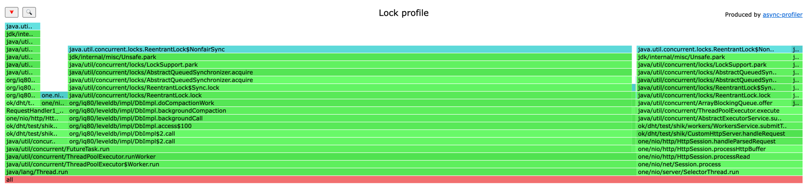
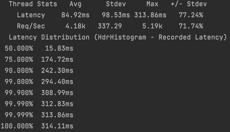

# Домашнее задание 2

## Put запросы 

### Дз1, 12 соединений, 55k rps, put запросы
Сделал новое профилирование с многопоточкой, чтобы проанализировать профит от добавления воркеров, а не от докидывания числа соединений.  
Число 12 взято не случайно, в one-nio по умолчанию используется 12 селектор тредов. Как раз каждый из них будет получать нагрузку.

### Дз2, 12 соединений, 55k rps, put запросы

Изменения за счет добавления воркеров:
* Latency в большей части запросов выросла. Это можно обосновать тем, что операция записи в LevelDB очень дешевая и накладные расходы на создание таски и её шедулинг оказались дороже чем просто выполнение таски в том же потоке селекторе
* На 5% меньше времени проводим в методе select, потому что за счет воркеров большая часть работы перешла от selector потока в worker поток.
* На 8% увеличилось время gc. Отчасти это связано с тем, что теперь стало больше аллокаций: 1) runnable, которые сабмитятся в pool; 2) накладные расходы на thread pool и на очередь внутри него в частности. А еще сюда явно перетекла часть 5%, выигранных на select.
* В коде из первого дз сильно больше времени проводится на взятии блокировки перед записью. Не думаю, что это связано с кодом из дз2, скорее всего в этот момент compaction держал блокировку достаточно долгое время, например, после compaction 2 уровня в 3 удалял таблицы 2 уровня, при этом он бы все время держал блокировку и воркерам пришлось бы ждать его перед записью.
* 4,5% тратится на создание потоков в thread pool. Это связано с тем, что в дефолтном конфиге стоит `corePoolSize = 0`, то есть изначально потоков будет 0, а создаваться они будут при появлении запросов (в том случае если остальные потоки заняты работой и суммарное число тредов < maxPoolSize). А еще в дефолтном конфиге стоит `keepAliveTime = 0`, то есть если в какой-то момент к нам перестанут приходить запросы (или rpc станет меньше), то thread pool уменьшит число потоков до corePoolSize (соответственно, если потом rps возрастет, будут снова создаваться потоки). Оба этих параметра можно потюнить.
* 90% запросов обрабатываются за 2ms, что хорошо. Если смотреть на запросы, попавшие в хвост распределения, то вероятнее всего, это запросы, которым: 1) не повезло с взятием блокировки при попадании в очередь пула потоков; 2) в целом потоку, обрабатывавшему этот запрос не повезло с cpu (так как в моем конфиге по умолчанию потоков создается больше чем свободных ядер, какому-то потоку может в целом не везти); 3) эти запросы могут происходить параллельно с compaction и проигрывать ему блокировку (в частности, compaction может достаточно долго держать блокировку, что вполне объясняет запросы за ~100ms). 

### Профиль блокировок

* 70% занимают блокировки во время compaction. В реализации LevelDB при compaction конкретного уровня для каждого ключа (получаемого из merge файлов этого уровня и файлов верхних уровней, пересекающихся с ними по ключам) берется блокировка, чтобы скомпактить immutable memtable. Понятно, что раз эта блокировка берется на каждый ключ, то она не бесплатная, особенно учитывая, что параллельно несколько потоков пытаются писать в mutable memtable под этой же блокировкой. Также блокировка держится при удалении таблиц после compaction.
* 20% занимают блокировки во время добавления тасок в executor. Здесь тоже нет ничего удивительного, потому что в одну очередь добавляют таски несколько потоков одновременно.
* 4% занимают блокировки при записи в базу данных.

Здесь достаточно простора для оптимизаций:
* Можно сделать отдельную блокировку для всех memtable и всех sstable. Тогда compaction будет не так сильно аффектить операции записи. Например, при compaction мы периодически берем блокировку на memtable, что компактить и флашить её, при этом все время держим блокировку на ss-таблицы. Тогда при удалении старых таблиц в конце compaction нам не придется держать блокировку на memtable, что явно улучшит производительность.
* Можно сделать отдельную блокировку для каждого уровня ss-таблиц. Ведь во время compaction 2 уровня мы никак не аффектим 0-й уровень, а значит флашить таблицы на нулевой уровень можно только с блокировкой на 0-й уровень (вспоминаем, что там таблицы с пересекающимися ключами, а не помердженные). Также можно сливать 0-й уровень с 1-м и параллельно сливать 3-й уровень с 4-м. Очевидно, для такого понадобится иерархическая блокировка, но дедлоков в любом случае не будет, потому для compaction i-о уровня нужно держать блокировку только на несколько больших уровней (в LevelDB на i+1-й и i+2-й) (понятно, раз нам нужны только большие номера, то граф зависимостей ациклический и дедлоков не бывает).
* Можно попробовать засунуть в ThreadPool lock-free очередь. И хотя в ней не будет блокировок, performance может уменьшиться, поэтому это спорное улучшение.

## Get запросы

### Дз2, 12 соединений, 40k rps, get запросы

### Дз 1, 12 соединений, 50k rps, get запросы

Изменения за счет добавления воркеров:
* Предельный rps уменьшился c 50k до 40k
* На 4% уменьшилось время чтения записи
* На 4% уменьшилось время select
* На 1% уменьшилось время чтения из сокета
* На 4% уменьшилось время записи в сокет
* Появились 2% на старт рабочих потоков в thread pool
* Увеличилось время работы gc. Отчасти это связано с тем, что теперь стало больше аллокаций: 1) runnable, которые сабмитятся в pool; 2) накладные расходы на thread pool и на очередь внутри него в частности  

Пример с rps 50k для get из дз2
  
Думаю, что такое замедление связано с тем, что операция чтения выполняется достаточно быстро и накладные расходы на рабочие потоки не окупаются. А это происходит, потому что я не так сильно как в дз1 заполнил бд (сейчас тестировал при 1Гб, тогда до 7Гб добил).  

Само распределение процессорного времени стало лучше, потому что из selector потока вынесена обработка самого запроса чтения и записи в сокет, а значит, если вместо операции чтения будет что-то более тяжелое (например, поход по сети в 3 других сервиса и какая-то логика на основании их ответов), то эта нагрузка ляжет только на воркеров и все накладные расходы окупятся.

### Профиль блокировок

Общая картина как в профиле put. Из особенностей:
* Всего лишь 0,16% приходится на обработку get запроса базой данных. Это связано с тем, что блокировка держится только на момент обращения к memtable, что очень быстро, а затем отпускается, поэтому она незначительно влияет на программу.

### Профиль аллокаций
В целом и в put, и в get запросах картина не поменялась, хотя ясно, что аллокаций стало немного больше за счет создания тасок и накладыных расходов на сам thread pool и его очередь для тасок в частности

## Сравнение с однопоточным решением
Код из дз1 перетестировал на текущей базе в 1Гб
* В дз1 с одним соединением операция put стабильно работает c rps 17k, в дз2 при 12 соединениях работает с трудом при 55k rps и легко при 50k rps. Таким образом, увеличили rps в 3 раза.
* В дз1 с одним соединением операция get стабильно работает c rps 16k, в дз2 при 12 соединениях работает при 40k rps. Таким образом, увеличили rps в 2.5 раза.

## FIFO vs LIFO
  
На put запросах при изменении очереди на стек rps понизился до 30k rps. Думаю, это связано с тем, что сами таски очень быстрые, а дефолтное capacity стека у меня всего 100. В очередь быстро добавлялись новые таски и часть старых не исполнялась на воркерах вовсе   
После этого я поднял capacity до 10000 и предельный rps поднялся до 45k.
  
Потом попробовал вместо своего стека использовать DiscardOldestPolicy в тредпуле, это подняло rps с lifo очередью до 50k rps. То есть сравнимо с перформансом очереди. Это не удивительно, потому что свой стек я сделал на основе LinkedBlockingDeque, которая сама по себе медленнее чем ArrayBlockingQueue.
  
Запуск с fifo очередью и 10000 capacity дал похожие результаты
  
В итоге, если сравнивать FIFO и LIFO как политики очереди thread pool, то на моем ворклоаде разницы нет.  
LIFO может быть лучше в случае, когда таски не успевают выполняться и отваливаются по таймаутам, в таком случае важнее исполнять самые свежие задачи.  
FIFO может быть лучше, если сервер справляется с нагрузкой. Также в случае с FIFO мы не сможем получить аномалий вида "пользователь сделал лайк, потом репост, но в очереди таски поменялись местами из-за LIFO и в ленте видим сначала репост, а потом лайк".  
В моем случае увеличение capacity очереди улучшило performance, потому что задачи быстрые, если задачи будут тяжелее, то не будет смысла хранить 10k в очереди, потому что большая их часть отвалится по таймаутам, пока будет стоять в очереди.   

## Внутренние параметры пула потоков
Поменял keepAliveTime с 0 до 20ms, чтобы при небольшом уменьшении нагрузки не уничтожались потоки до количества corePoolSize, потому что потом их может понадобиться создавать заново, а это дорого.    
По запуску видно, что перформанс улучшился на тех же 50k rps. Думаю, это связано с тем, что wrk посылает запросы не непрерывно, а по таймеру раз в какое-то время, а значит может произойти момент, в который у воркеров не будет работы и thread pool очистится до corePoolSize. 

Также попробовал поменять corePoolSize и поставить его равным maxPoolSize, чтобы новые потоки не создавались в процессе работы приложение (только на самых первых запросах создадутся все нужные потоки). Это улучшило предельный rps до 55k.
  
При уменьшении размера очереди значительно падает производительность, на том же rps 55k latency становится секундной.  
Попробовал в качестве количества потоков использовать просто `Runtime.getRuntime().availableProcessors()`.
  
В результате производительность упала. И это логично, потому что моя формула учитывает, насколько мы утилизируем cpu при текущем ворклоаде. Более подробно эта идея описана в книге "Java Concurrency in Practice", думаю, лучше так сослаться, чем переписать сюда параграф.