# Отчет по 3 дз

### Алгоритм шардирования
Была реализована простая версия консистентного хеширования, без поддержки удаления/добавления шарда  

Сначала для простоты я взял число vnode равным 3, но в таком случае интервалы ключей, за которые ответственна нода получались слишком большими, а еще одна из нод получала намного больше ключей, потому что адреса узлов отличаются между собой в нескольких символах и полиномиальные хеши от них были распределены не равномерно. Все записи улетали на один и тот же узел.
На фото видно, что шард с портом 19234 получает сильно меньше ключей.
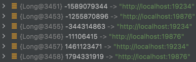

Увеличил число vnode до 30000, после этого распределение данных по узлам стало намного более равномерным.
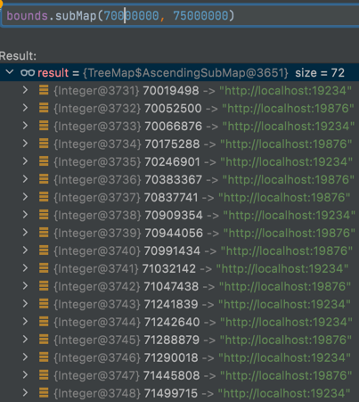
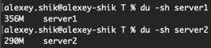

Добавление шардирования значительно уменьшило performance. Теперь серверу становится тяжело уже на 15k rps.
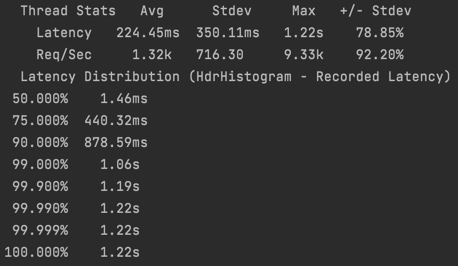

С 12k rps сервер уже легко справляется
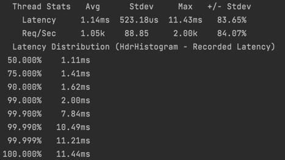

При трех vnode performance сильно лучше: сервер держит нагрузку 18k rps.
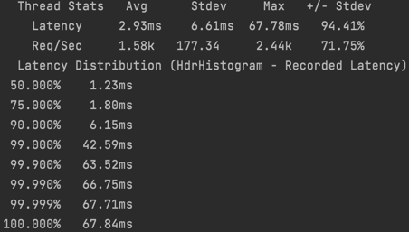

Попробовал сделать 3000 vnodes. Распределение ключей по шардам осталось близким к равномерному.    
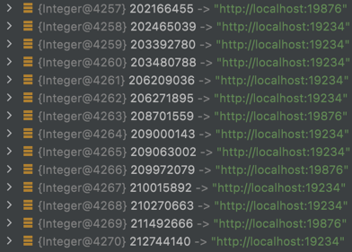  
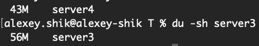  
По performance видны улучшения, сервер держит нагрузку 20k rps, это связано с тем, что при 3 vnode все запросы проходили через прокси, а значит чаще ходили по сети и ускорение логичное. В профиле алгоритм консистентного хеширования занимает 0,92% cpu, то есть практически не замедляет приложение, что логично, ведь поиск шарда работает за логарифм от числа шардов, что в нашем случае очень мало.  
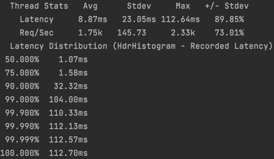  
Принял решение остановиться на 3000 vnode.

### Профиль приложения

В профиле 32% cpu тратится на получение таски для воркера. Это значительно больше, чем было в дз2. Отчасти это связано с тем, что теперь оба сервера расположены на одной моей машине, значит суммарно они создают в два раза больше тредов, а значит и конкуренция за ресурсы моей машины становится большей для каждого конкретного треда. Понятно, что сейчас используется слишком много тредов в воркерах.
Также в профиле видно, что очень много времени треды просто ждут, это означает, что в executor стоит настроить политику corePoolSize поменьше, тогда в момент не максимальной загрузки лишные треды будут останавливаться.  
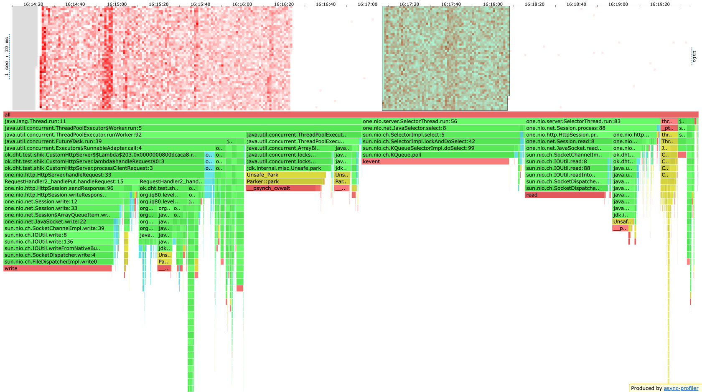  
Сделал 8 тредов на координаторе и 4 на фолловере, на моей машине `availableProcessors == 12` (это логично, ведь через фолловера проходит только половина запросов, а через координатора все (хоть координатор идет в базу только в половине случаев, put в LevelDB дешевая операция по сравнению с работой с сетью))  
Сделал `corePoolSize = 0`, чтобы треды не простаивали внутри executor зря.  
Судя по профилю, это помогло, теперь на получение таски тратится 16% cpu.  
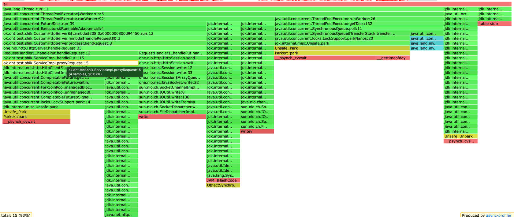
Если смотреть на запросы, которые проксируются на другой шард, то такие запросы занимают 26,6% cpu, причем большая часть времени на координаторе тратится на ожидание ответа от фолловера (а фолловер, само собой обрабатывает запрос)  
Чтобы это ускорить, можно использовать асинхронные запросы.

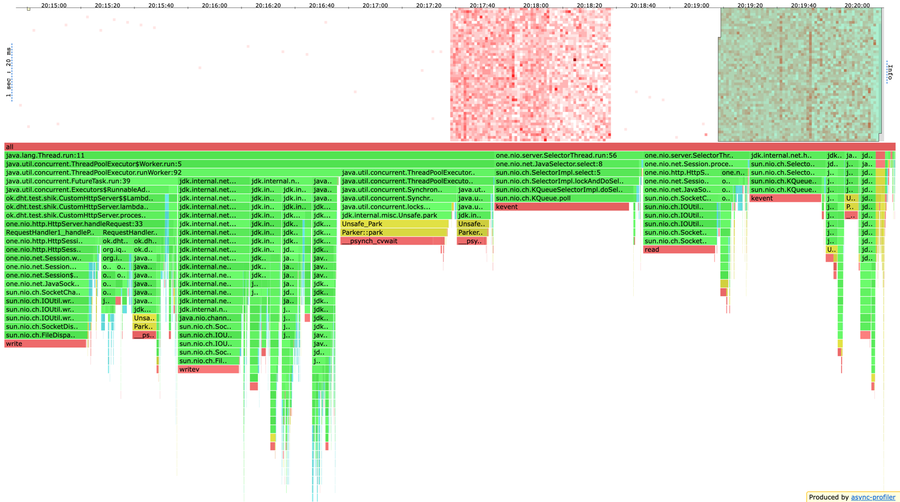
Сделал асинхронную реализацию, но время ожидания результата с другого шарда не уменьшилось. Это так, потому что помимо запроса к другому шарду наш сервис ничего не делает, если бы у него была другая работа, то она бы выполнялась параллельно с запросом на другой шард, и это ускорило бы приложение.  
Также, при реализации репликации асинхронные вызовы будут лучше, потому что запросы к разным репликам будут параллельно, а значит быстрее чем последовательно.  
Поэтому оставлю реализацию с использованием асинхронного метода, чтобы она пригодилась в будущем.

Из анализа cpu:
* 24% - работа селектор треда
* 18% - ожидание таски в пуле воркеров, здесь лучше не получилось, потому что дальнейшее уменьшение числа воркеров уменьшает performance приложения
* 13% - накладные расходы на HttpClient (работу с его селектором вне воркер треда)
* 10% - шедулинг таски на другой шард (работа внутри воркер треда)
* 18% - запись в сокет из воркер треда
* 3,5% - ожидание воркером ответа с другого шарда
* 3,2% - запись в бд
* 1,6% - старт воркеров в тредпуле

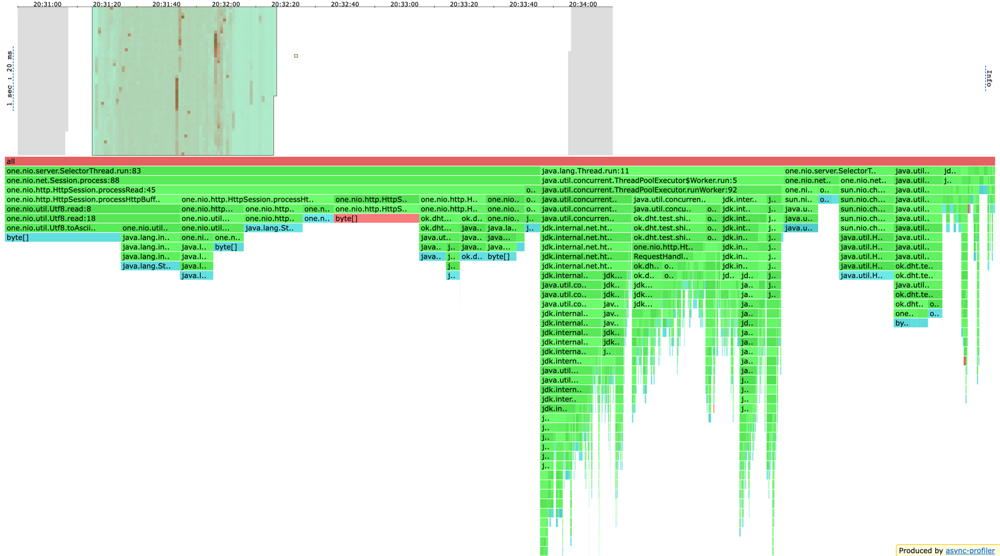
Аллокации:
* 65% `SelectorThread`
* 9% - работа с `CompletableFuture` при запросах на другой шард
* 6% `HttpClient` для запросов на другой шард
* 5% - создание Response в ответе на запрос
* 3% - воркер аллоцирует при инициации запроса на другой шард
* 4,5% - запись в бд
* 6% - воркер аллоцирует при шедулинге запроса на другой шард

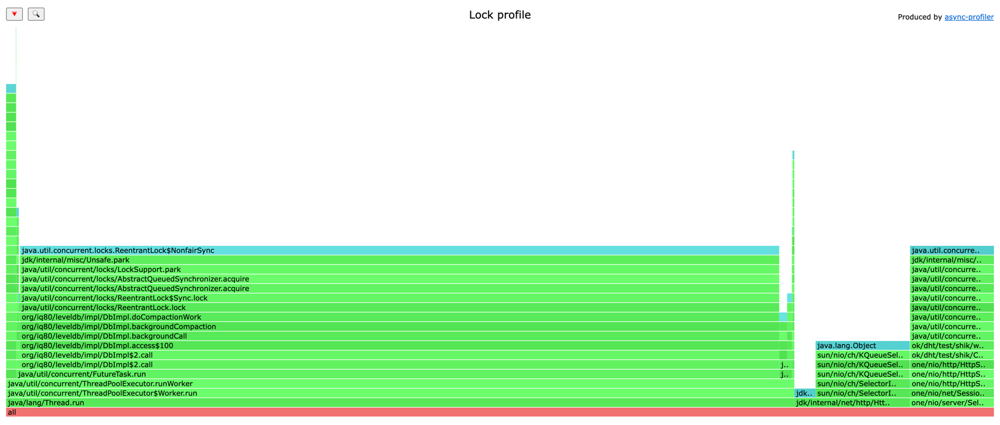
Блокировки:
* 75% - compaction в LevelDB
* 12% - `HttplClient` при работе с селектором
* 8% - `SelectorThread`
* 1% - `CompletableFuture` при запросах на другой шард в воркер треде