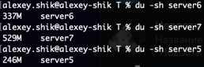

# Отчет по 3 дз

### Алгоритм шардирования
Была реализована простая версия консистентного хеширования, без поддержки удаления/добавления шарда  

Сначала для простоты я взял число vnode равным 3, но в таком случае интервалы ключей, за которые ответственна нода получались слишком большими, а еще одна из нод получала намного больше ключей, потому что адреса узлов отличаются между собой в нескольких символах и полиномиальные хеши от них были распределены не равномерно. Все записи улетали на один и тот же узел.
На фото видно, что шард с портом 19234 получает сильно меньше ключей.  
  
Попробовал сделать 3000 vnodes. Распределение ключей по шардам стало близким к равномерному.    
  
Протестировал на двух шардах, ключи разбиваются достаточно равномерно.  
  
  
Все алгоритмы замедлили performance:
* при 3 vnodes, это связано с тем, что все запросы проходили через прокси, а значит чаще ходили по сети и замедление логичное
* при 3k vnodes perfornace оказался лучше, потому что походы по сети на другой шард происходили значительно реже.  

  
3000 vnodes дают хороший результат, но это достаточно много и занимает 0,45% cpu в профиле.    
  
Хотелось бы сделать операцию определения шарда еще более дешевой.  
Во-первых, можно заменить `TreeMap` обычным отсортированным массивом. Как минимум, `int[]` будет эффективнее, потому что массив примитивов аллоцируется непрерывным отрезком в памяти, а значит не будет cache miss-ов как при спуске по дереву (еще круче будет, массив влезает в cache line, для этого можно взять 16 интов, например). А еще `TreeMap` на каждый добавленный элемент аллоцирует `Entry`, что вряд ли является оправданной аллокацией в нашем случае.   
Во-вторых, `Arrays.hashcode` не лучшая хеш-функция, потому что она очень чувствительная к числу элементов строки, которые различны. Например, если посмотреть хеши `abac, abab`, то они будут отличаться на `1`. Не говоря уже о том, что эта функция первая, которая придет на ум злоумышленнику, если он захочет положить нам какую-то ноду.    
  
Теперь оперделение шарда занимает 0,25% cpu и bottleneck теперь - вычисление sha256. Однако, это я считаю оправданной тратой cpu, потому что мы платим за более стойкую хеш-функцию, да и `vnodes` теперь используется лишь 5.  
А еще сейчас каждый из вспомогательных массивов занимает 3 * 5 * 4 = 60 байт, а значит влезает в одну кеш-линию - приятный бонус. Думаю, это одна из причин, почему в профиле `Arrays.binarySearch` занимает лишь 0,02%, а вторая причина, что массив всего лишь из 15 элементов.  
  
Распределение ключей по нодам не похоже на равномерное, но в целом норм, разница между самой тяжелой и самой легкой нодой в два раза, что не звучит очень плохо. Понятно, что проблема здесь в маленьком числе vnodes, если сделать их больше, то равномерность улучшится.  
  
15 vnodes показали такой же результат  
  
При 50 vnodes ситуация уже лучше, доля данных на шардах равна 34%, 38%, 28%, соответственно. Пожалуй, остановлюсь на этой конфигурации.  
  
При этом performance алгоритма консистентного хеширования не ухудшился, занимает 0,2% cpu, из которых 0,16% уходит на sha-256, 0,02% на бинпоиск и 0,02% на взятие `MessageDigest` из `ThreadLocal`

### Заболевшая нода
Я считаю, что нода заболевшая, если `FAILURES_THRESHOLD` раз произошло одно из:
1) При выполнении proxy запроса к этой ноде произошел `ExecutionException`, то есть при обработке этого запроса follower нодой произошла какая-то ошибка.
2) При выполнении proxy запроса вылетел таймаут. В качестве таймаута я использую 10 секунд, что на порядок больше чем желаемый 99-й персентиль латенси моего приложения.   

В своей реализации я взял `FAILURES_THRESHOLD` равным 5, потому что в моем случае сеть между шардами быстрая (они ведь на одном localhost) и timeout наверняка означает, что нода лежит и вообще не принимает запросы или у нее зависли потоки в каком-то из тредпулов. В любом из этих случаев timeout означает неработоспособность шарда. Вылетевший `ExecutionException` тоже означает, что шард в неработоспособном состоянии (вообще еще может быть проблема с сокетом и сессией, например, что сокет закрылся и на шарде вылетает `IOException` при записи в него, но это тоже можно считать проблемой шарда). Чтобы случайные таймауты не делали ноду моментально больной, сделал `FAILURES_THRESHOLD` > 1. Понятно, что в продакшене таймауты случаются чаще, а еще некоторые ошибки из шарда могут быть нормой, поэтому там этот параметр имеет смысл сделать побольше. 

Ясно, что ноды умеют выздоравливать, например, от рестарта, поэтому я сделал пул с одним потоком, который раз в 5 минут обнуляет число ошибок и статус болезненности для каждой ноды. Не хочется делать эту проверку слишком часто, потому что ноды падают не каждую минуту (по крайней мере в нашем небольшом приложении из 3 нод), но и не хочется, чтобы поднявшаяся после болезни нода простаивала без дела слишком долго, поэтому я выбрал некий компромисс. К слову, в крупном продакшене не каждый сервер успеет стартовать за 5 минут, может быть необходимо, например, прогреть кеши для поддержания высокого rps, поэтому там этот параметр будет смысл сделать побольше. А еще было бы круто реализовать Circuit breaker, но я специально не смотрел его, чтобы придумать более простое решение.    

### Число воркеров
Даже при 2 воркерах у меня 14% cpu в ожидании на взятие таски воркером. Это было довольно странно, потому что `availableProcessors` на моей машине 12.     
  
При этом приложение вполне справляется с нагрузкой в 7k rps.  
  
Попробовал использовать 8 воркеров, тогда в ожидании на взятие таски стало 16% cpu. При это throwput повысился, это логичный эффект от увеличения числа тредов, больше кода исполняется логически параллельно. Здесь увеличился средний latency, но это не страшно, в разбивке по персентилям 50-й, 75-й и 90-й улучшились, и я считаю, что это важнее чем замедление на 99-м. Замедление на 99-м можно объяснить повышение большей конкуренцией тредов за физические ресурсы моей машины.  
  
При 8k rps приложению становится тяжко, почти секунда на 75-м персениле не ок.  
Решил остановиться на 8 воркерах.  

### Профиль cpu, put запросы
  
* 16% ожидание на взятие таски воркером
* 15% работа селектора в `HttpClient` (взятие ивентов на сокете)
* 13% работа селектор треда (взятие ивентов на сокете и чтение из сокета)
* 13% работа с `CompletableFuture`.
* 11% запись в сокет из воркера
* 9% `SelectorManager` в `HttpClient`
* 9% `SequentialScheduler`, из них 1,5% на запись `Http1AsyncReceiver`
* 1% ожидание в `get()` `CompletableFuture`
* 1% работа с `LevelDB`

Что можно улучшить:
* Может показаться, что от расходов на `CompletableFuture` легко избавиться, но в `HttpClient` `send` реализован как `sendAsync().get()`, поэтому придется избавляться от `HttpClient` в целом и использовать что-то более легковесное  
* Я бы хотел уменьшить ожидание на взятие таски воркером, потому что 12-16% звучит как очень много, но даже при 2 воркерах в пуле у меня не получилось опустить ниже 12%, возможно дело в том, что у меня не только треды внутри одного пула конкурируют за железо, но и разные пулы между собой. Отчасти это связано с тем, что таски у воркеров все еще легкие и, вероятно, они выполняются быстрее чем поступают новые от селекторов.
* `HttpClient` добавил много накладных расходов, имеет смысл попробовать вместо него более легковесный чем http протокол для общения между шардами. Также можно попробовать rpc подходы или хотя бы сделать отдельный handler метод для прокси запросов, чтобы не делать лишний раз валидацию параметров, проверку, что мы на нужном шарде и похожее.
* Сделать честное асинхронное решение, на данный момент, хоть и вызывается `sendAsync`, но я тут же в рабочем потоке делаю `get`, а значит активное ожидание никуда не пропадает. Оно занимает мало времени, потому что шарды у меня находятся на одном localhost, сеть между ними быстрая, да и операции с бд сами по себе легкие. В случае тяжелого продакшена задержка на `get` могла бы быть сильно больше и от нее есть смысл избавиться. 

### Профиль cpu, get запросы
  
Немного дольше стали запросы к бд, потому что в LevelDB put by design работает быстрее чем get. В целом профиль такой же как у put, что логично, ведь основной cpu тратится не на обоработку конкретного запроса к бд.

### Профиль alloc, put запросы
  
* 40% `SelctorThread`
* 35% работа с `HttpClient`. Много аллокаций происходит внутри `Http1Exchange`. Там создаются и блокировки, и атомики, и многопоточные структуры данных.
* 4% `SelectorManager` внутри `HttpClientImpl`
* 1,5% работа с `LevelDB`

Что можно улучшить:
* `HttpClient` добавил много накладных расходов, имеет смысл попробовать вместо него более легковесный чем http протокол для общения между шардами. Также можно попробовать rpc подходы.

### Профиль alloc, get запросы
  
Не увидел значимых отличий с профилем put запросов

### Профиль lock, put запросы
  
* 57% `SelectorImpl#select()`
* 16% Еще пара методов `SelctorManager`
* 15% на взятие таски из пула воркеров
* 10% `SelectorManager#register()`
* 1% приходится на работу с `LevelDB`

Что можно улучшить:
* 57% происходит при внутреннем взаимодействии между шардами, когда leader запроса ждет ответ от follower шарда и делает `SelectorImpl#select`. Большой процент локов тут связан с тем, что в `select` происходит активное ожидание, причем ждет ровно один из 8 воркеров, ведь selector в `SelectorManager` ровно один, естественно, за него конкурируют воркеры и потому ждут на блокировке. Чтобы это поправить можно либо сделать асинхронное решение, либо сделать больше инстансов `HttpClient`.
* `SelectorManager#register()` - это synchronized метод, но, кажется, его нельзя улучшить. Там под блокировкой идет добавление в коллекцию и запись по файловому дескриптору под новым synchronized. Даже если убрать synchronized в самом register придется использовать thread-safe `List`, а на запись по fd все равно возьмется блокировка, так что будет только хуже от того, что придетсяс один lock два раза подряд брать.      
* '15% на взятие таски из пула воркеров' можно немного уменьшить, но это понизит throughput (выше был wrk на эту тему), я выбрал throughput в этом спорном месте.  

### Профиль lock, get запросы
  
* 46% `SelectorManager#register()`
* 35%Еще пара методов `SelctorManager`
* 8% на взятие таски из пула воркеров
* 3% `SelectorImpl#select()`

Профили get и put в данном случае различаются, думаю, это связано с тем, что для get у меня более комфортный rps, то есть воркеры лучше успевают выполнять задачи, поэтому в `SelectorImpl#select` нет большой конкуренции, а все локи берутся лишь в `SelectorManager#register`, в случае put запросов rps больше, поэтому больше воркеров работают конкуррентно и, соответственно, конкуренция за `SelectorImpl#select` становится сильнее и больше потоков проводят время в ожидании блокировки на этом методе (на самом деле не совсем на этом методе, но внутри там есть synchronized в `lockAndDoSelect`)  

### Итог
* Консистентное хеширование - отличный способ распределить данные по шардам (при достаточно большом количестве vnode) 
* От добавления шардирования снижается performance приложения. Это объясняется тем, что в 2/3 запросов стало в 2 раза больше round trip-ов, появились накладные расходы на HttpClient (работа с сокетами, чтение из них, запись в них, select на клиентском сокете сервера). Также появилось активное (пока что) ожидание ответа от шарда, что сильно замедляет систему в целом, потому что в это время мог исполняться полезный код  
* Увеличивается количество аллокаций - опять же из-за частых двух походов по сети серверный код аллоцирует больше, новый 'клиентский' код сервера тоже аллоцирует на работу с `CompletableFuture` и на асинхронный вызов в целом.
* Локов стало значительно больше, в основном из-за `SelectorManager` и `SelectorImpl#register`, то есть из-за добавления взаимодействия между шардами.
* Для ускорения приложения и уменьшения аллокаций имеет смысл использовать более оптимальный протокол чем http или применить rpc, а еще реальзовать вместо активного ожидания асинхронный подход.
* Появилась возможность горизонтального масштабирования 

