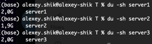
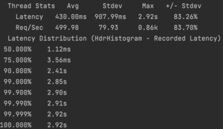
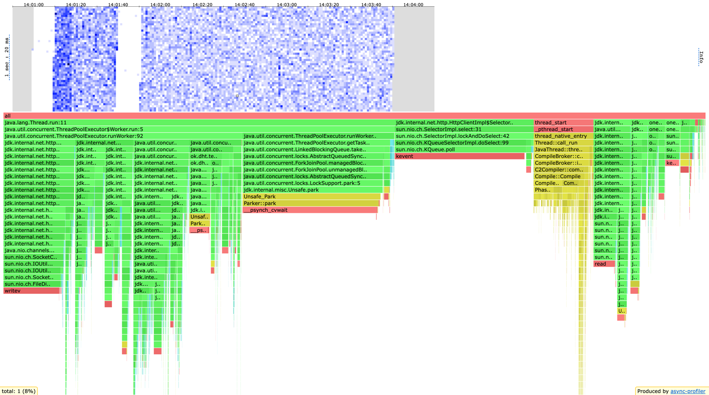
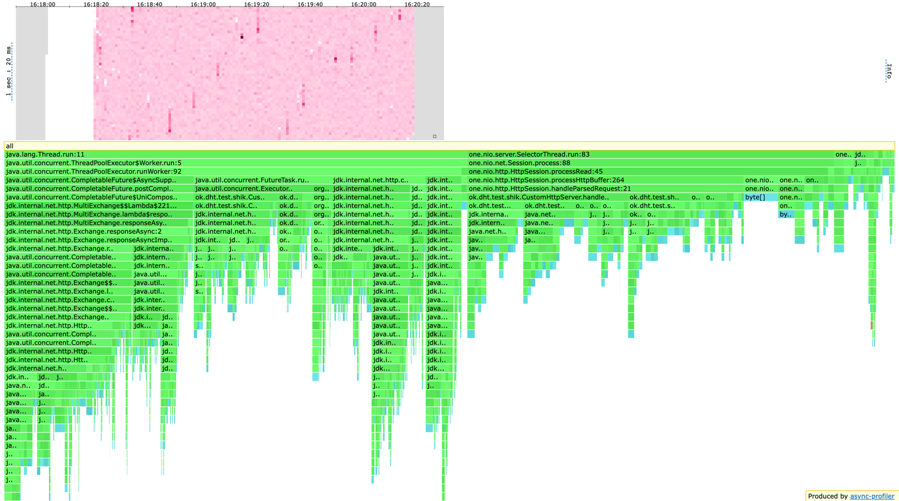
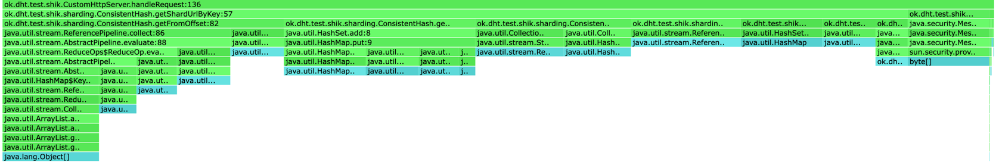
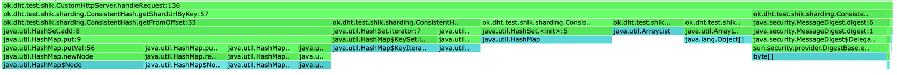
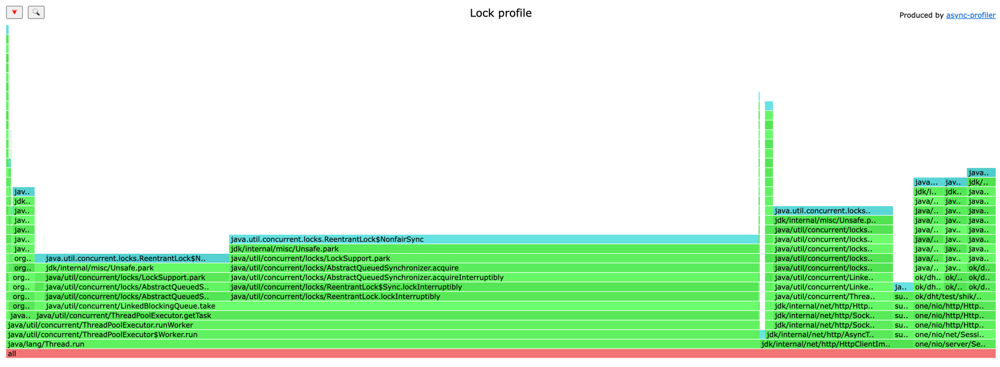
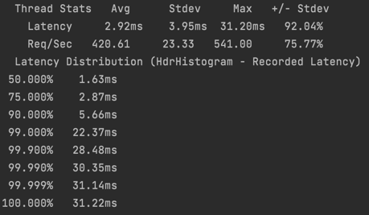
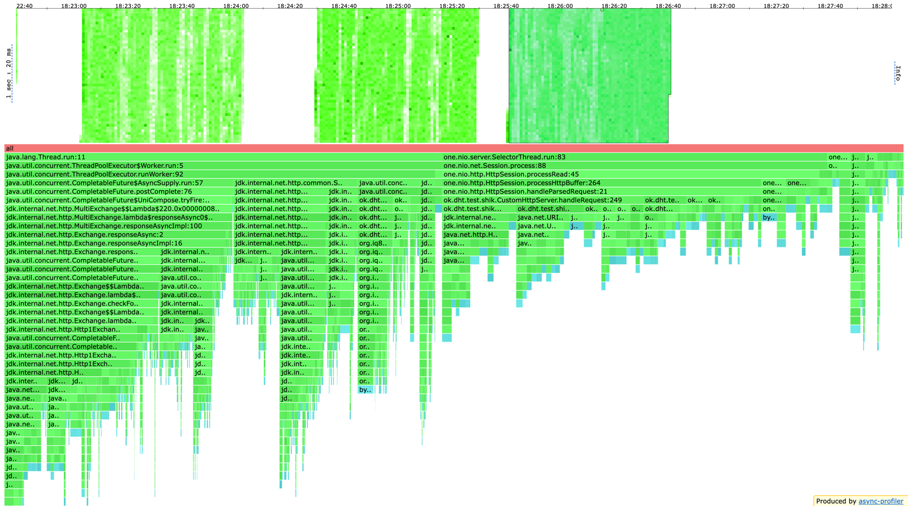
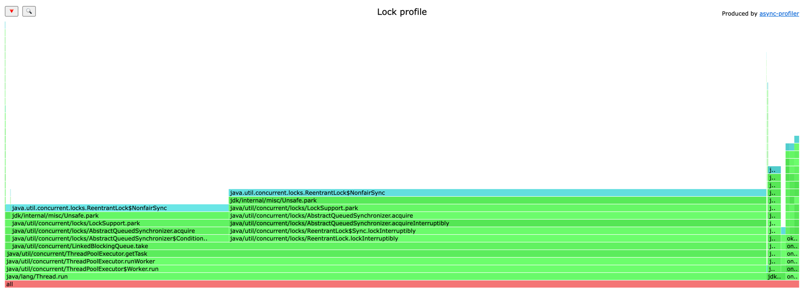

# Домашнее задание 4
При запусках я использовал репликацию на кворум, то есть каждый ключ хранится на 2 нодах.

### Шардирование
  
Заполнил бд до 2Gb на каждой ноде. Распределение данных оказалось вполне равномерным, консистентное хеширование не подвело.  

## Профиль
### wrk, put запросы

Приложение хорошо справляется с нагрузкой 6k rps.  
Можно сделать вывод, что производительность приложения понизилась на 1k rps, что примерно 15%. Это логично, основные причины замедления:
1) При любом валидном запросе происходит проксирование (так как replication factor 2, то не получится применить операцию только к лидеру, в прошлом дз треть запросов обходилась без проксирования).
2) В трети клиентских запросов происходит два прокси запроса, в прошлом дз мог быть только один прокси запрос.

### cpu, put запросы
  
* Ожидание таски воркером увеличилось с 17% до 22%. Это связано с тем, что уменьшился performance у `SelectorThread`. За счет этого в очередь задачи стали поступать медленнее, соответственно, воркеры стали дольше ждать получения задач. Замедление `SelectorThread` произошло из-за того, что я вынес в него валидацию и определение шарда. Раньше было удобно делать все это в воркер треде, а сейчас более правильным будет выполнение в воркере отдельной операции с репликой / отдельной операции с лидером, а  не клиентского запроса целиком, так как в таком случае ожидание лидером будет происходить не в селекторе, а еще все 3 операции к нодам будут concurrent. Можно было сделать сабмит таски на целый клиентский запрос, которая бы породила еще 3 таски (на 2 реплики и на лидера), но я считаю такой подход менее прозрачным и менее логичным, хотя он будет работать немного быстрее.
* Время на `select` в `HttpClientImpl` увеличилось с 15% до 18%. Тоже логично, потому что через `HttpClient` стало проходить больше запросов, в том смысле, что теперь каждый запрос к кластеру содержит прокси запрос, а значит содержит и работу с `HttpClient`, то есть при каждой запросе к кластеру лидер должен ждать ответа реплики, вот это время и выросло.
* Время работы `SelectorThread` уменьшилось с 13% до 10%. Я думаю, что тут нет никакого ускорения (а, как я уже описывал, наоборот замедление) и просто изменилось распределение процентов. То есть часть процентов перетекла от селектор треда в другие части приложения, например в работу с `HttpClient` и в работу внутри воркер треда (Они замедлились сильнее `SelectorThread`, потому что в селектор добавились легкие операции - валидация и определение реплик, а в воркеров стало поступать больше задач, плюс больше задач стало содержать работу с сетью).
* Время работы `SelectorManager` уменьшилось с 7,5% до 7%. Опять же, здесь нет ускорения, просто перераспределение процентов.
* Время работы воркера в целом увеличилось с 57% до 60%, что логично, ведь теперь в воркеров приходит больше задачи и сами задачи стали тяжелее из-за большего взаимодействия с сетью внутри кластера.
* Из значимых изменений внутри воркера могу отметить, что время в `CompletableFuture#get` увеличилось с 1% до 4%. Это объясняется тем, что ожиданий в целом стало сильно больше: в каждом запросе есть хотя бы одно ожидание проксируемого запроса и хотя бы одно ожидание в лидерском запросе, пока отработают все запросы к репликам; в трети запросов происходит два ожидания запроса от реплики и одно ожидание на лидерском запросе, пока отработают запросы к репликам.

### alloc, put запросы

Приведу только отличия от прошлого дз.
*   
  В `SelectorThread` теперь 7% аллокаций делает определение нод, к которым нужно делать запросы. К слову, достаточно много аллокаций появилось из-за `stream`, который я решил поиспользовать для более красивого кода.  
      
  Убрал стримы из `ConsistentHash`, теперь метод определения нод делает 3,5% аллокаций. Можно сделать вывод, что стримы не бесплатное удовольствие и сильно влияют на число аллокаций.
* 5% аллокацию занимает создание `URI` для запроса на другую ноду с лидера. Думаю, не очень хорошо, что эти аллокации переехали из воркеров в `SelectorThread`, но не вижу в этом достаточно большой проблемы, чтобы сабмитить еще одну таску в воркеров. Для уменьшения аллокаций можно было бы кешировать эти `URI`, если бы в наших запросах `id` не лежал внутри url, а был бы, например, хедером. Тогда у нас было бы всего лишь 3 возможных `URI` и этих 7% аллокаций удалось бы избежать. С другой стороны передавать id хедером семантически неправильно, поэтому не стану менять текущее решение.
* 8,5% аллокаций на обработку проксируемого запроса внутри `HttpClientImpl`. Здесь рост понятен, ведь в целом проксируемых запросов стало значительно больше

### lock, put запросы
  
* В профиле блокировок 15% занимает `HttpClientImpl$SelectorManager`, в это входит добавление запросов во внутреннюю очередь и `select` ответов.  
* Остальные блокировки связаны с очередью воркеров, 8% происходят в `SelectorThread` при добавлении таски в очередь, остальные при доставании таски из очереди. При уменьшении числа воркеров сильно уменьшается performance, поэтому уменьшать их число не получится. Для улучшения можно сделать несколько пулов и добавлять задачу в случайный их них, так будут конкурировать не 8 потоков за 1 ресурс, а, например, 4 потока за первый и 4 за второй, это может снизить число блокировок.  

Думаю, такое распределение  локов связано с тем, что сейчас я сабмичу в тредпул в 3 раза больше тасок, чем раньше (две на рекплики и одну на лидера), так задач становится больше, а значит треды больше раз вызывают этот метод `take`, поэтому и получается больше сэмплов.  

### wrk, get запросы
  
Приложение хорошо справляется с нагрузкой 5k rps.  
Можно сделать вывод, что производительность приложения практически не изменилась. Даже интересно, почему так получилось, скорее всего я не очень хорошо протестировал прошлый stage, помню, что я там торопился.

### cpu, get запросы
  
Интересно, что время ожидание на взятие таски воркером из тредпула уменьшилось с 18% до 17%. Думаю, это связано с тем, что get запросы более тяжелые чем put запросы, поэтому, когда за счет репликации этих задач в пуле воркеров стало больше, то и время, которое воркеры проводят в работе тоже увеличилось, а следовательно, время простоя воркеров в ожидании таски уменьшилось.  
В остальном изменения похожи на изменения в профиле put запросов

### alloc, get запросы
  
* Аналогично put запросам, 7,5% занимает создание `URI` для запроса на другую ноду с лидера. Идеи по улучшению такие же.
* 4% аллокаций на определение нод в консистентном хешировании (это когда я уже выпилил стримы оттуда).
* 2% аллокаций на создание `CountDownLatch` для отсчета, сколько запросов от реплик осталось получить в целом (from) и сколько осталось получить до успеха (ack).
* 2% аллокаций на валидацию данных внутри `Validator`. На самом деле там тоже необходимые аллокации, ведь по сути там только достаются параметры из исходного `Request`.
* Интересно, что в `ServiceImpl#handleLeaderGet` я тоже использовал стримы, но их суммарное влияние в профиле аллокаций меньше чем 0,1%. Я думаю, это связано с тем, что в `ConsistentHash` основные аллокации делает `collect`, а в данном методе его нет, там только `filter`, `map`, `max`. 

### lock, get запросы

Почти все сэмплы - взятие таски из очереди воркеров. Думаю, это связано с тем, что сейчас я сабмичу в тредпул в 3 раза больше тасок, чем раньше (две на рекплики и одну на лидера), так задач становится больше, а значит треды больше раз вызывают этот метод `take`, поэтому и получается больше сэмплов. Предложения по улучшению такие же, как и в put запросах.

## Выводы
* Добавление репликации уменьшило performance, но не очень сильно, на ~15%.
* Зато теперь данные хранятся на кворуме (или смотря какие параметры проставляет пользователь), а значит при падении меньше половины узлов кластера, все данные будут доступны.
* В моей реализации лидер ждет только `ack` ответов от реплик, а не всех `from`, поэтому если в нашей системе есть медленная/упавшая нода, то она не будет аффектить performance приложения. Конечно, если это медленная нода, которая не отсыпает таймаутами, а просто медленно работает, то она все равно будет тратить время внутри воркера, но на latency запроса это не повлияет.
* Стало немного больше аллокаций, но все их я считаю обоснованными.
* При записи на кворум консистентное хеширование показывает себя еще лучше. Это можно объяснить, например, тем, что если был большой промежуток, принадлежащий одному шарду, то теперь этот промежуток принадлежит двум репликам, то есть становится меньше случаев, когда одна нода имеет строго больше всех ключей. Разумеется, это очень частный случай, но он имеет место быть.

## Что улучшить
* Советы со stage 3 по прежнему актуальны
* Сильно улучшат performance нормальные асинхронные вызовы. Сейчас лидерский запрос по сути заставляет одного из воркеров ждать пока все ack проксируемые запросы выполнятся.
* Можно попробовать сделать несколько очередей с воркерами и проверить, улучшит ли это performance и профиль локов. Мне кажется, что да, но времени на проверку гипотезы нет.
* Сейчас, если при get запросе две ноды вернули разные записи по ключу, мы выбираем из них самую актуальную, но не решаем сам конфликт. Здесь можно послать актуальное значение в отстающую ноду.
* Чтобы не гонять много данных по сети, можно присылать значение по ключу только с одной реплики, а с остальных возвращать хеш. Если на лидере хеши совпадают, то конфликтов нет и можно отдавать ответ клиену. Если конфликты есть, то делаем аналог read-repair в cassandre, то есть читаем из всех нод честные значения по ключу и рассылаем всем конфликтным репликам актуальные значения. Это явно поможет ускорить приложение, потому что по сети будут бегать меньшие данные, а конфликты будут решаться сразу же.