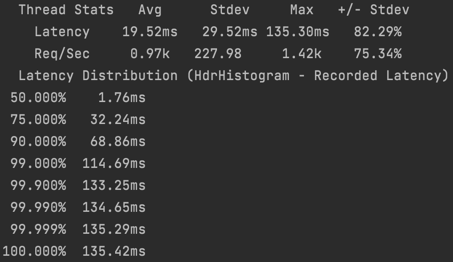
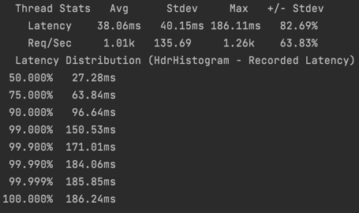
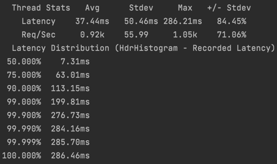
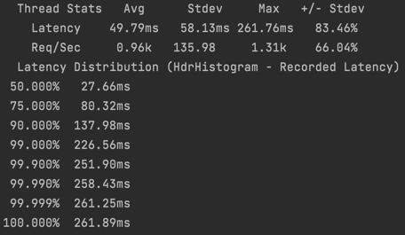
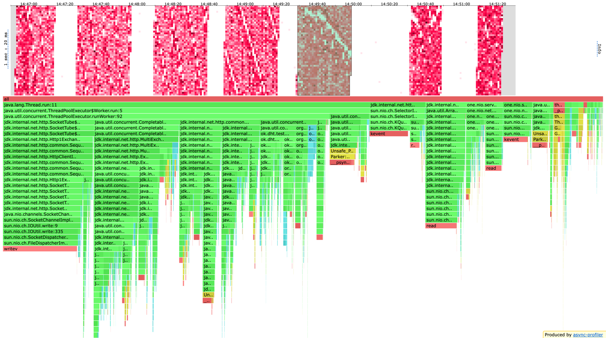
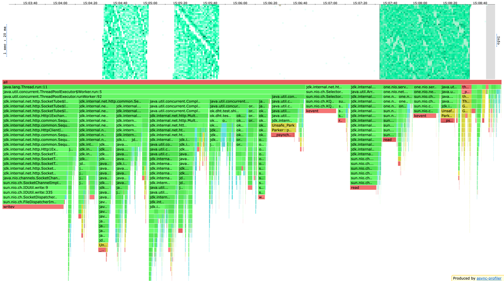
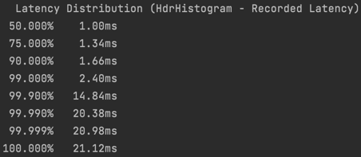
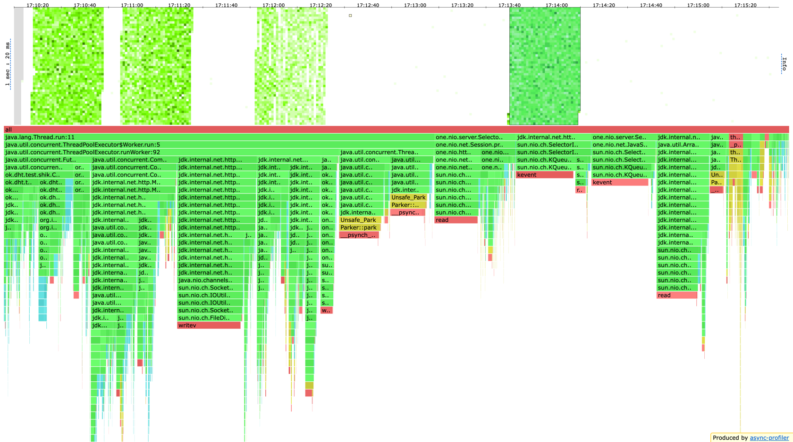

## Отмена задач, когда ack ответов уже получены

### Конфигурация ack = 2, from = 3
  
  
Приложение без отмены задач справляется с 11500 rps, на 12k становится слишком тяжело.  

  
С отменой предельный rps упал до 11k. Это связано с тем, что в первоначальной реализации я всегда кидаю воркерам новую таску на отмену futures, даже если все futures уже выполнены. Естественно это лишняя работа, и таску надо давать воркерам только после проверки, что future еще не выполнена (хотя от момента сабмита таски до ее реального начала исполнения future может уже завершиться, эта оптимизация явно не повредит).
  
С оптимизацией стало чуть лучше, на 11500 rps с трудом живет приложение, но это все равно хуже, чем без отмены. Замедление может быть связано с сабмитом самой задачи в пул. Изначально я сделал так, потому что семантически отмена future, по-моему, звучит как фоновое действие. Попробовал не сабмитить, а выполнять в том же потоке, улучшений нет.   

Профили cpu очень похожи, на первый взгляд ничего нового.  
  
  

Отсутствие большой разницы еще могу объяснить тем, что при ack = 2 нам всегда приходится ходить по сети, а поскольку походы по сети асинхронные, то сделать один поход вместо двух, не звучит как сильное улучшение. Более того, два похода по сети на реплики обычно сабминятся в воркеров примерно в одно время, а значит и исполняться (при условии, что все ноды здоровые и быстрые) начнут примерно одновременно, а значит и закончат выполняться примерно одновременно и профита от cancel не будет.   
А вот если ноль походов по сети вместо одного...  

### Конфигурация ack = 1, from = 3
  
В такой конфигурации cancel позволил поднять rps до 20k. Причина в том, что запрос, исполняющийся на лидере, часто происходит так быстро, что успевает отменить запросы на другие реплики, поэтому сеть и `HttpClient` не забиваются лишними действиями.  

В профиле видно, что воркеры стали больше ждать таски, потому что часто не приходится обрабатывать ответы от реплик, потому что они отменяются.  

Без cancel перформанс приложения такой же как и при ack = 2. Это не удивительно, ведь изменилась только агрегация ответов, и по прежнему на каждый запрос пользователя происходит 2 запроса на другую реплику.

## Вывод
* Отмена future имеет свои накладные расходы и в случае, когда задачи не успевают отменяться (ack = 2) только замедляет приложение.
* В некоторых ситуациях (запросы с ack = 1) отмена future очень сильно улучшает производительность за счет уменьшения работы в целом и, в частности, хождения по сети, работы с `HttpClient`, выполнения уже не нужных действий на других репликах.
* Этот трюк позволяет реализовать интересные идеи вида: Если в нашем приложении записи сильно чаще чтений, то делаем записи ack = 1, from = 3, а чтения ack = 3, from = 3. Тогда мы и видим все актуальные изменения данных, и можем выдерживать большую нагрузку put запросов. Для абстрактного примера, получится выдерживать 12k put + 5k get, а не 7k put + 7k get. Да тут сумма rps не одинаковая, потому что запросы с ack > 1 весят сильно больше чем запросы с ack = 1.
* В общем, целесообразность применения такого подхода полностью зависит от запросов к приложению.