# Домашнее задание 5
При запусках я использовал репликацию на кворум, то есть каждый ключ хранится на 2 нодах, нагрузку давал 2 минуты.

## Профиль, put запросы
### wrk
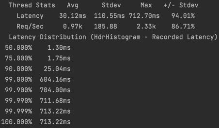  
Приложение стабильно работает на 11k rps.

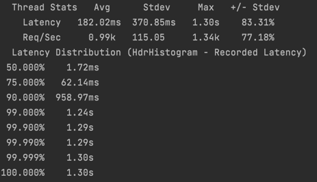  
В целом приложение справляется и с 12k rps, но latency на 90-м персентиле становится слишком большой.  
По сравнению с предыдущими двумя этапами приложение сильно ускорилось за счет отсутствия активного ожидания от запроса на другую ноду.     

### cpu
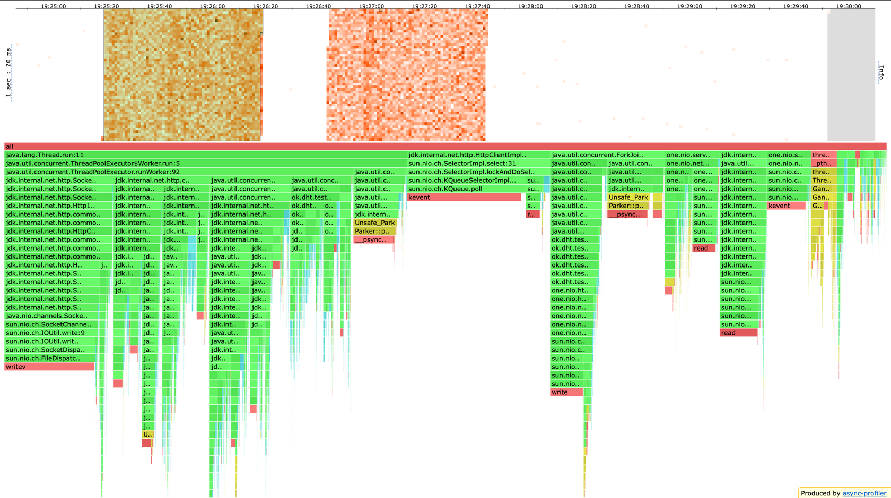
* Время на взятие таски воркерами уменьшилось с 22% до 5%. Я думаю, это связано с повышением rps. Приложение стало быстрее обрабатывать запросы, я поднял rps, запросов стало больше, значит они чаще приходят к воркерам, значит каждому воркеру приходится меньше ждать следующую таску.      
* Время на `select` в `HttpClientImpl` уменьшилось с 18% до 16%. Думаю, здесь нет проблемы. С одной стороны запросов стало сильно больше, значит и `select` будет вызываться чаще. С другой стороны, если запросов больше, то в методе `select` будет меньше ожидания новых запросов, ведь они приходят чаще. В общем, тут не ясно, но проблем не вижу, `SelectorManager` делает свою работу.  
* В `SelectorThread` сервера увеличилось на 1% время добавления таски в пул воркеров, причем выросло оно из-за метода `ReentrantLock#unlock`, который внутри себя делает `unpark` следующему в очереди на лок. Это эффект от того, что rps x повысился и воркеры стали намного активнее взаимодействовать с очередью задач, тем самым вызывал лишние расходы на добавление задачи.  
* В воркер треде с 2,75% до 0,06% уменьшилось активное ожидание за счет того, заменил `CompletableFuture#get` на честно асинхронную работу. А также заменил логику с `CountDownLatch` на `synchronized` методы и работу с примитивами. Основная причина смены на `synchronized` - простота реализации. Я решил не делать преждевременные оптимизации, а сделал простое рабочее решение. Так как я не увидел в профиле cpu и lock проблемы, связанной с `synchronized`, то считаю решение правильным. В этом дз логика с `CountDownLatch` у меня стала слишком сложной и не очевидно правильной, поэтому переделал. Да и в целом replication фактор редко бывает большим (обычно 2-3), поэтому сильной конкуренции на этом `synchronized` и нет, особенно, учитывая, что обычно свой рандом вносит сеть до разных реплик, и их ответы приходят не одновременно.
* Время в методе `select` у `SelectorThread` увеличилось с 2,5% до 3,8%. И я не вижу в этом ничего плохого, ведь это означает, что таски быстрее долетают до воркеров, а селектор тред садится в ожидание новых. Я специально сделал `submitTask` в пул воркеров пораньше в коде, чтобы селектор тред занимался только селектом запросов, валидацией параметров и определением реплик. Да, я считаю, что валидация параметров дешевле чем submit отдельной задачи в пул воркеров, потестировал это, правда приложение немного замедлилось.

### alloc
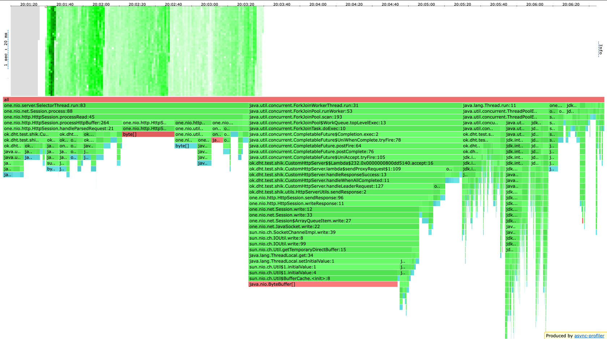
* 0,5% аллокаций добавились из-за `thenAccept` и `exceptionally` у `CompletableFuture`  
* В селектор треде изменений не вижу
* 30% аллокаций на `sendResponse`, то есть на отправку ответа клиенту. Хорошо, что их так много, потому что все эти аллокации не лишние. А вот в профиле 4 дз аллокации на отправку ответа не так явно видны, а сильно размазаны по профилю. Так что это я считаю улучшением.
* Убрал из селектор треда аллокации на создание `URI`, о которых писал в прошлом дз.

### lock
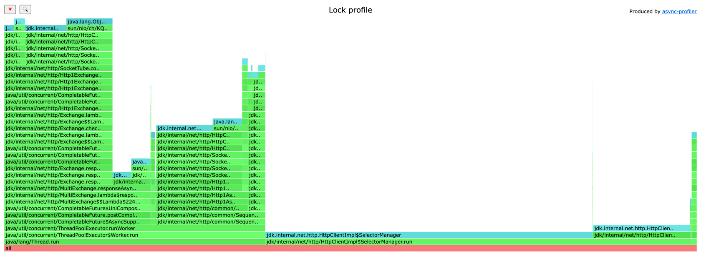
* На взятие задачи из пула потоков тратится всего 0,2% локов, даже не сразу нашел это в профиле.
* Работа с бд занимает примерно 0,6% локов.
* Блокировки связанные с `synchronized` в логике состояния лидера я не нашел в профиле, видимо, они занимают относительно малую часть.
* Остальное - блокировки, связанные с `HttpClient` и `CompletableFuture`. Там очень много локов в `SelectorManager`, но их можно объяснить, ведь `SelectorManager` инкапсулирует внутри себя очень много разных действий: там и селектор тред внутри, и пул соединений, и набор входящих событий, в общем, сложное состояние, которое хочется менять атомарно, поэтому там и берется здоровенный `synchronized(this)`.   

В общем, performance значительно улучшился, активного ожидания стало сильно меньше, в профиле локов нет ничего лишнего. Из доработок я бы посмотрел внимательнее на профиль аллокаций, там очень много мелких аллокаций, если внимательно на них посмотреть, есть большой шанс найти не необходимые аллокации. Мб займусь этим на 2 неделе дз. 

## Профиль, get запросы

### wrk
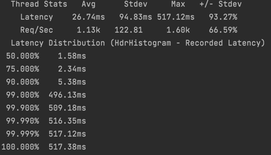  
Приложение хорошо справляется с 13k get запросов.  

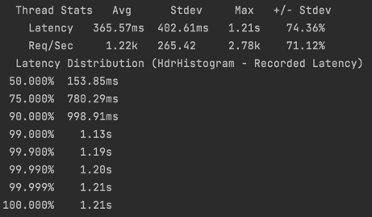  
С 14k запросов приложение скорее не справляется, даже 50-й персентиль великоват.  

Интересно, что performance get запросов стал лучше, чем у put запросов как минимум на 1k rps.  
Возможно, это связано с тем, что в put запросах на реплики передается timestamp, а в get запросах нет.  

### cpu
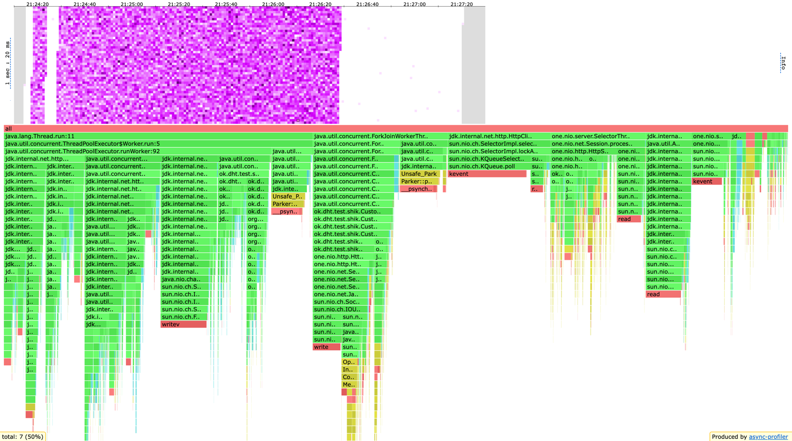  
Если сравнивать с дз-4, то:
* Ушли 4,5% cpu на `CompletableFuture#get`.  
* Уменьшилось ожидание воркером на взятие таски из пула с 18% до 4,5%.  
* Появилось ожидание 5,5% на ожидание таски воркером из `ForkJoinPool`, в который летят задачи `sendAsync` при запросе к реплике.
* В целом за счет `thenApply` 11% cpu по аггрегации ответов с реплик и отправке ответа клиенту перетекли в `ForkJoinPool`.  
* Время в `select` селектор треда `HttpClient` уменьшилось с 20% до 13%. Это явно объясняется повышением rps. Запросы происходят чаще, значит ждать их в `select` приходится меньше времени.  
* Время работы в `SelectorThread` сервера повысилось с 4% до 12%. Думаю, это связано с повышением rps.
 
### alloc
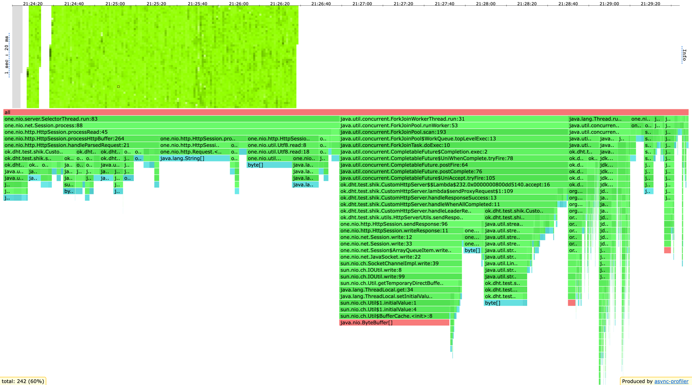  
В целом профили у get и put похожие, но есть отличия:
* 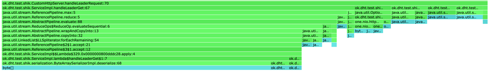  
В get запросах при обработке запроса лидером (когда нужное число реплик уже ответили) происходит много аллокаций. Часть из них из-за моих любимых стримов. Если все просуммировать, то 3,5% аллокаций - доп расход на стримы. Пока оставлю так, потому что код получаетсяс очень красивый, читаемый, простой и понятный. На след неделе может займусь тюнингом аллокаций.    
* В том же месте происходит десериализация ответов с реплик. На мой взгляд, сериализатор не аллоцирует лишнего: `ByteBuffer#wrap` для распаршенного значения и новый объект `DBValue`. Пока не вижу, как тут уменьшить аллокации.  
* В `SelectorThread` при чтении данных, парсинге запроса и определении шарда в get запросах стало больше аллокаций. Причем в put запросах 8% аллокаций уходило на body, а в get запросах этих аллокаций нет. Зато там аллокации от консистетного хеширования занимают 9% аллокаций, а не 4,5%, как в put запросах. Могу предположить, что аллокаций на get запросах суммарно меньше, поэтому в процентном соотношении в `SelectorThread` виден рост. В это можно поверить, сравнив аллокации на методе `select` при равном rps, который абсолютно одинаково работает в случае get и put. Там в put запросах 1,91% аллокаций, а в get запросах 1,07%. Поэтому подтверждаю предположение.   

### lock
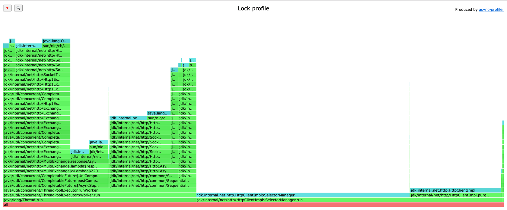  
* По сравнению с put запросами на 3% выросли локи в `SelectorManager`. Это явно связано с тем, что в get запросах больший rps, потому что больше rps, значит `SelectorManager` должен оркестрировать большее число запросов, логично что при этом contention на ресурсах самого `SelectorManager` становится больше, что и влечет большее число локов.

## Вывод
* Значительно увеличился performance приложения.
* Значительно уменьшилось активное ожидание за счет асинхронного подхода.
* Значительно улучшился профиль блокировок, остались только локи от `HttpClient$SelectorManager`.