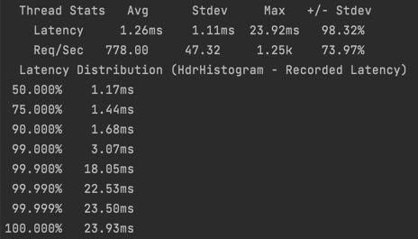
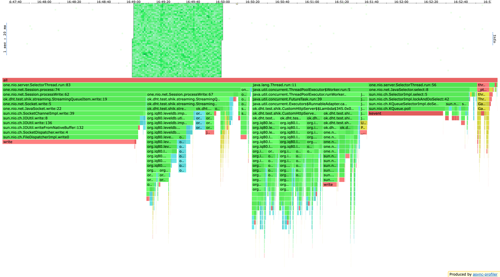
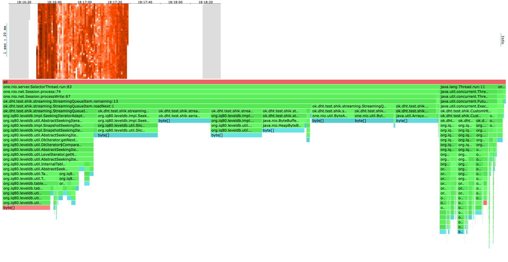
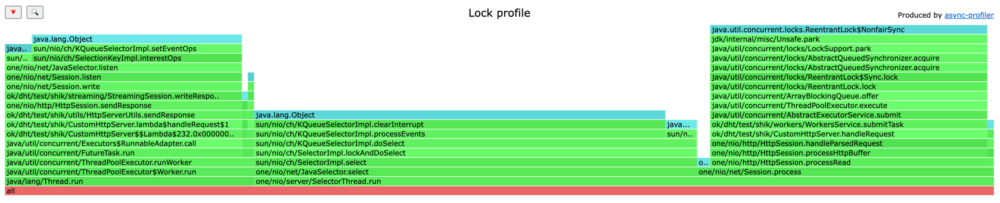

# Домашнее задание 6

Так как код для обработки запросов с одним ключом не менялся, то их профиль и нагрузочное тестирование не покажут ничего нового.
Поэтому тестирую range запросы. В базе ключи - строки размером ~300 байт.

## Range по 100 значений
### wrk

Приложение выдерживает 9000 rps, но 10k уже нет.  
Видно, что rps ниже, чем в случае запросов по одному ключу, потому что:
* Cейчас сильно возросла нагрузка на сеть, потому что на 1 запрос пересылается в 100 раз больше данны.
* Cильно возросла нагрузка на бд. Но стоит заметить, что в LevelDB есть memtable на 2MB, поэтому пока что чтения с диска происходят далеко не на каждый запрос и бд отдает данные очень быстро.
* Как будет показано в анализе профиля, в `SelectorThread` перешло много работы.

### cpu profile

Видно, что в профиле 70% cpu занимает `SelectorThread`. Из них:
* 22% `select`
* 29% запись в сокет
* 2% чтение из сокета
* 17% поиск по итератору следующего чанка для записи в сокет

Последний пункт здесь выглядит весьма неожиданным. Дело в том, что в `one.nio.net.Session.write(one.nio.net.Session.QueueItem)` есть вызов метода `listen`, в результате которого обработка событий чтение/запись в сокет переходит в `SelectorThread`, а воркер освобождается от задачи. И если то, что `SelectorThread` стал больше писать в сокет - это норм, в целом, это и есть одна из его обязанностей, то вот искать по итератору следующие данные явно не его работа. С другой стороны полностью сделать запись чанками на стороне воркера тоже не получится, потому что нельзя присваивать воркер треду весь сокет, ведь тогда не получится слушать актуальные действия пользователя на этом сокете (может клиенту уже не интересен дальнейший кусок данных, а мы продолжаем его пихать в сокет или клиент хочет выполнить более приоритетный запрос).
Чтобы это поменять, можно сделать обработку пишущих событий на сокете через сабмит задачи в пул воркеров, тогда и поиск нового чанка через итератор, и запись в сокет уйдут в поток воркеров. К сожалению, на этой неделе у меня не хватило времени это попробовать.

### alloc profile

Все аллокации происходят при чтении данных из бд. При этом большая часть аллокаций приходится на `SelectorThread`. Причина та же, что описывал выше.

### lock profile

Из-за большого трафика по сети профиль локов сильно перераспределился  
* 28% на submit задачи в пул воркеров. Тут так много, потому что задачи стали сильно объемнее чем раньше, поэтому свободных воркеров часто нет и задачам приходится ждать. Кстати, этот же вывод можно сделать, потому что в cpu профиле нет ожидание со стороны воркера на взятие таски, то есть воркерам постоянно есть чем заняться.
* 24% на `one.nio.net.Session.listen`. Там внутри вызывается `sun.nio.ch.KQueueSelectorImpl.setEventOps` и при проставлении новых событий селектору берется `synchronized`.
* 45% на `select`.

## Выводы
* Конечно, performance приложения снизился в сравнении с запросами с одним ключом, но их и не очень корректно сравнивать. rpc, на котором приложение работает, выше чем в дз с синхронной репликацией, поэтому считаю производительность хорошей.  
* Слишком много работы приходится на `SelectorThread`, планирую это поправить, но, видимо, не на этой неделе.
