# Домашнее задание 7: Read repair

## Политики Read repair:
1) NONE -> не исправлять неконсистентность данных
2) READ_REPAIR -> читаем значения с реплик и в случае неконсистентности исправляем их
3) READ_REPAIR_DIGEST -> читаем значение только с одной реплики, а с остальных лишь хеш данных. В случае несовпадения хешей читаем со всех реплик данные и исправляем неконсистентность

## Политика NONE

### put запросы с rps 11k.
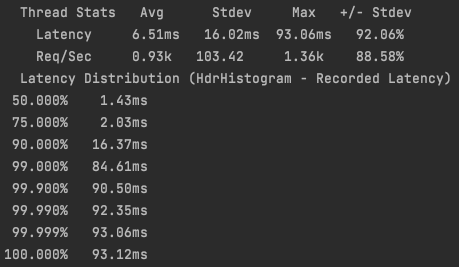  

### put запросы с rps 12k.  
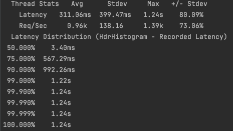  
Производительность put запросов с выключенным read repair не поменялась.  

### get запросы с rps 12k.
  
Производительность get запросов как будто уменьшилась на 1k rps. Но я посмотрел, во всех stage у меня put и get запросы работали с близким rps, а в stage5 вдруг get стал работать на 1k rps лучше. Поэтому я склоняюсь к тому, что это погрешность/ошибка в измерениях stage5 (скорее всего это был запуск без async-profiler в фоне) и на самом деле производительность get запросов не изменилась. Также я посмотрел в профиль и не увидел там ничего нового.    

### cpu profile
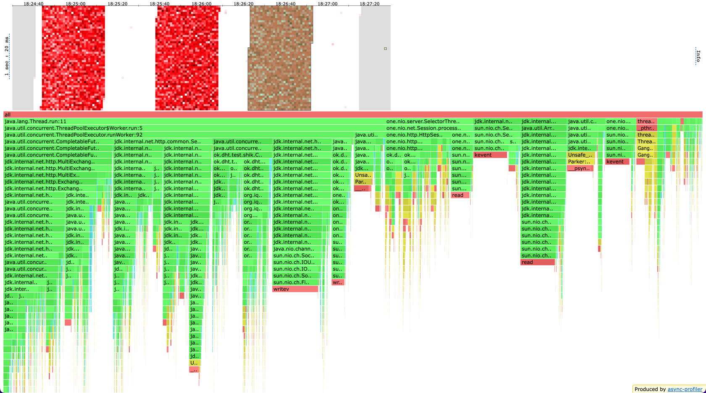

### alloc profile
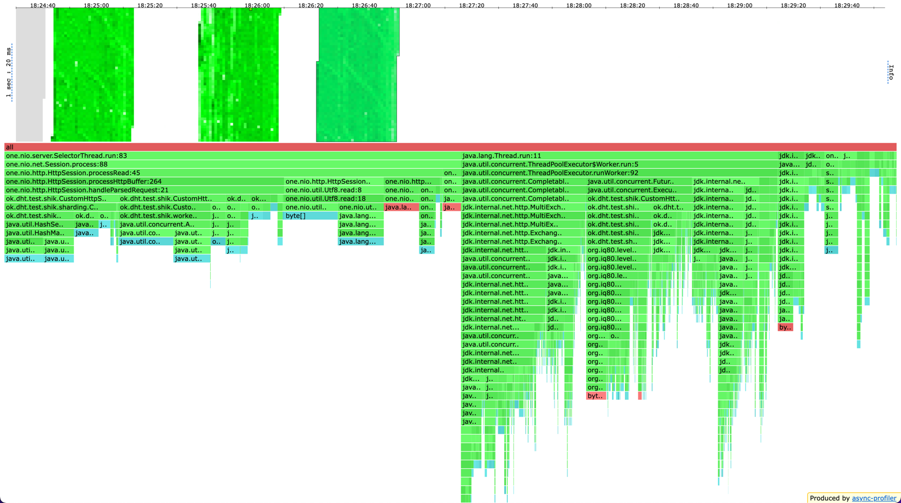

### lock profile
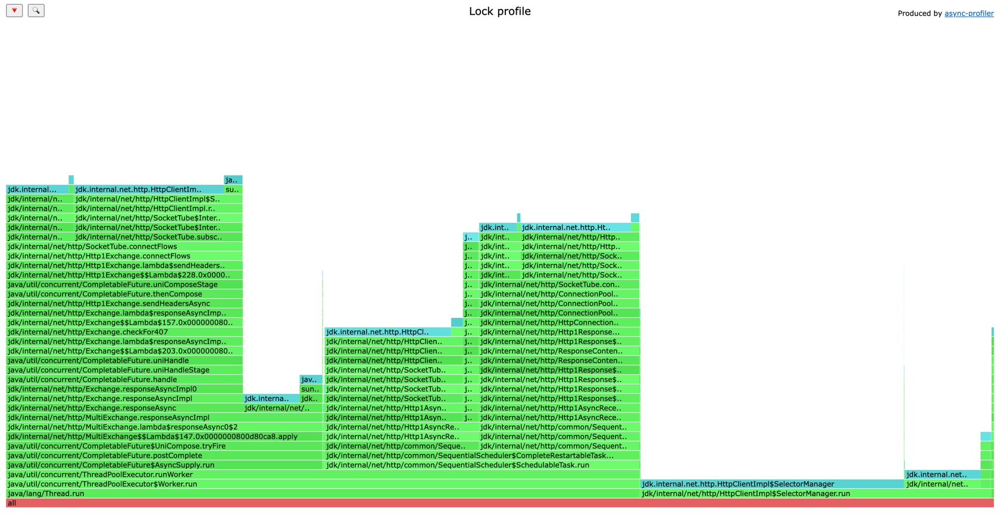

## Политика READ_REPAIR

### put запросы с rps 12k.
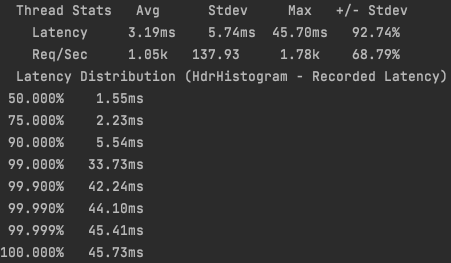  
Производительность put запросов с включенным read repair и полностью консистентным состоянием незначительно улучшилось. Думаю, это шум измерений и ничего особенного.  

### get запросы с rps 12k.
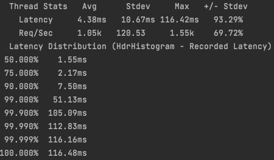  
Производительность get запросов с включенным read repair и полностью консистентным состоянием не поменялась.  
Результаты понятны: состояние консистентно, значит фактически read repair не происходит, поэтому новых запросов для исправления конфликтов нет, а поэтому и производительность на том же уровне.  

### cpu profile
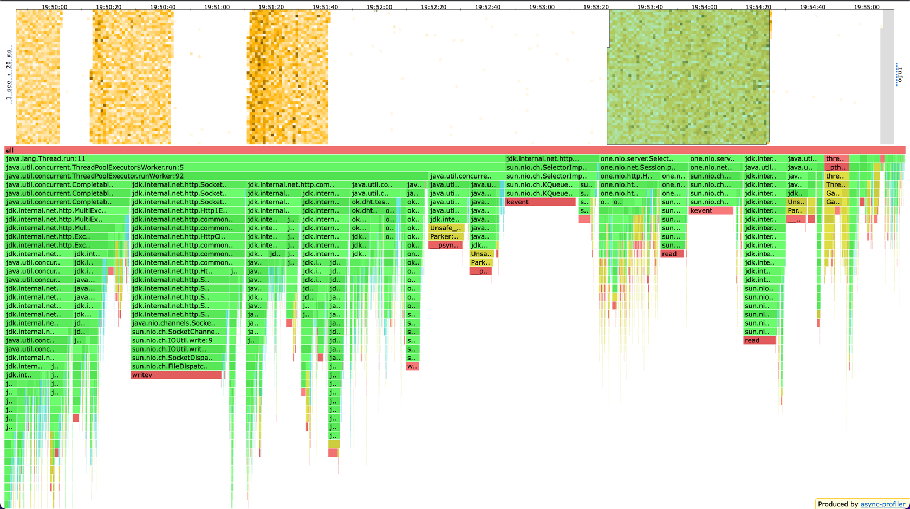

### alloc profile
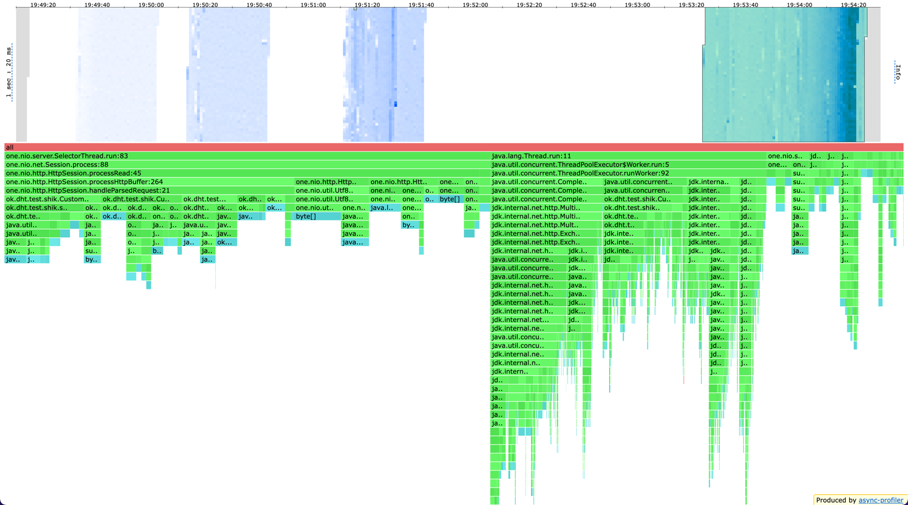

### lock profile
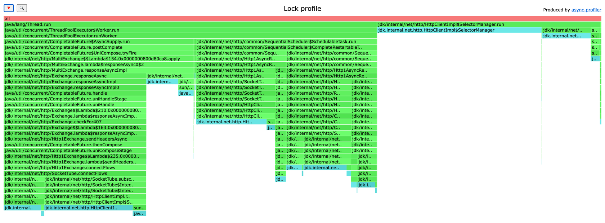

## Политика READ_REPAIR_DIGEST

### put запросы с rps 13k
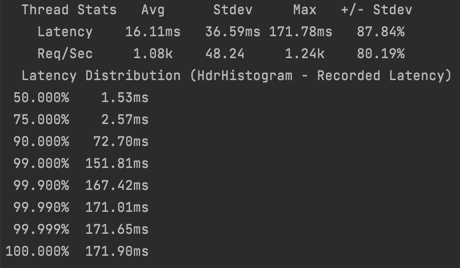  
Интересно, что put запросы ускорились на 1k rps. Не ясно, с чем это связано, явных оптимизаций для put запросов в этой политике я не делал.

### get запросы с rps 19k
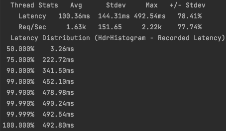  
При включеном async-profiler я разогнал приложение до 19k rps. Это очень сильный прирост производительности. Произошел он, разумеется, из-за того, что теперь по сети в основном гуляют хеши, а не сами значения. При репликации на кворум с вероятностью 2/3 одна из реплик окажется мастер нодой запроса, а значит запрос за значением можно осуществить локально, а у второй реплики спросить только хеш.  

### get запросы с rps 21k
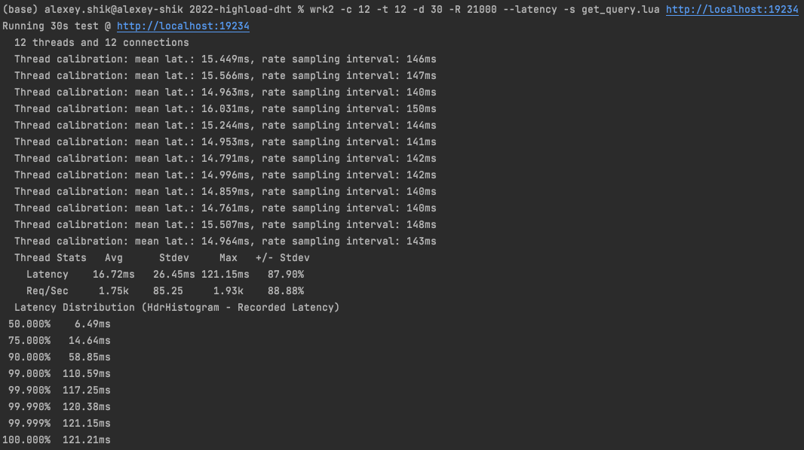  
Без async-profiler мне удалось разогнать приложение до 21k rps. 

### cpu profile
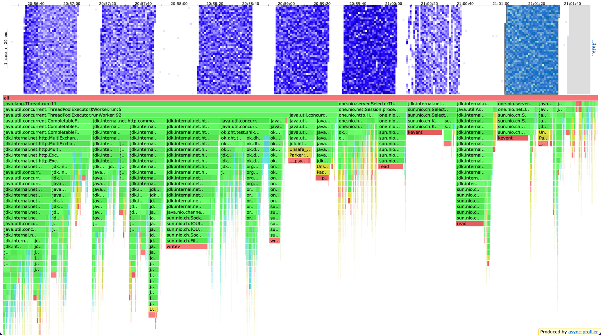  
По сравнению с двумя предыдущими политиками, на 2,5% выросло время работы `SelectorThread`, основной рост за счет чтения из сокета и связан с повывшением rps.  

### alloc profile
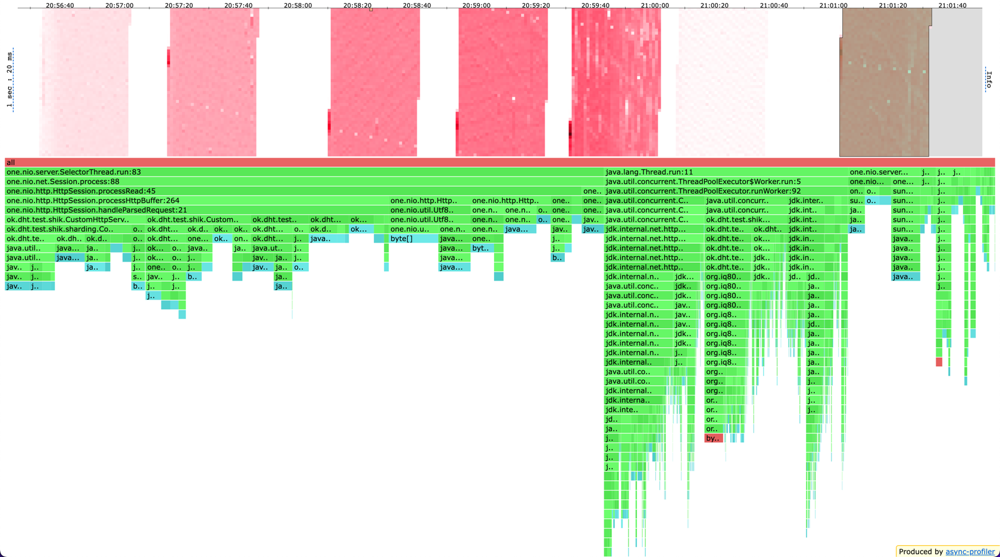  
В профилях аллокаций значимой разницы не вижу.  

### lock profile
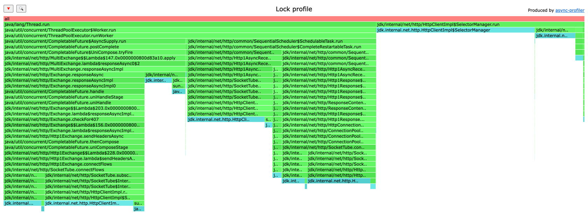  
В профилях блокировок значимой разницы не вижу

## Политика READ_REPAIR в случае неконсистентности
Для тестирования я сначала заливаю value1 с ack=from=3, потом заливаю value2 с ack=from=2, а затем делаю get с ack=2,from=3. Таким образом, моментально начнется repair многих значений.
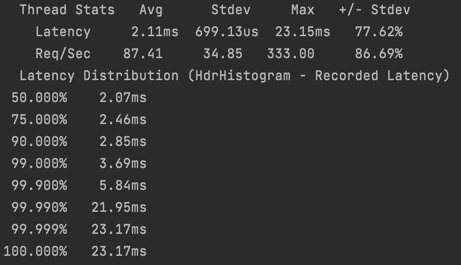  
Запросы были всего лишь с 1k rps.
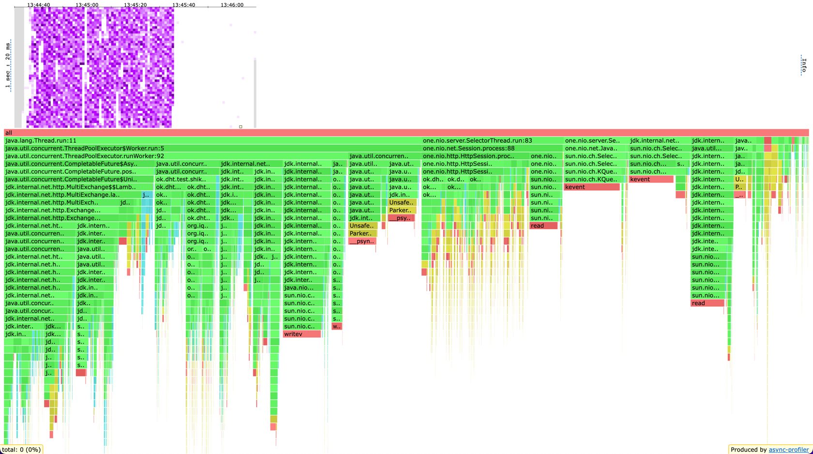  
* В `SelectorThread` теперь тратится 25% cpu. Думаю, здесь просто перераспределение процентных пунктов, потому что воркеры и `HttpClient` сильно разгрузились за счет меньшего rps.
* В остальном в профилях нет отличий. Для меня было удивительно, что `ReadWriteLock` не появился в профиле блокировок. Это означает, что concurrency при работе с бд при обработке repair запросов невысокая.
* В принципе, при нормальном rps в 12k уметь исправлять 1k неконсистентностей вполне неплохо, ведь в случае штатной работы приложения неконсистентности будут редки (условно единицы-десятки в секунду). В таком случае моя реализация успешно справится.

## Улучшения текущего решения
* Проблема, если много значений станут неконсистентными. Чтобы не положить приложение в таком случае, стоит сделать throttler, который будет ограничивать число "текущих" repair. Например, можно хранить счетчик отправленных repair запросов за последние s секунд и, если он превышает определенное значение (например, 200), то до конца интервала из s секунд не слать новые repair запросы. Так неконсистентности потихоньку будут устраняться и не будут мешать основной логике приложения. Конечно, такой алгоритм будет даже не eventually consistency, ведь новые неконсистентности могут появляться с большим rps, чем устраняются старые, поэтому все равно потребуется участие самих разработчиков, чтобы устранить причину возникновения такого большого числа неконсистентностей.
* Для корректности repair я сделал в одном месте `ReadWriteLock`. Выглядит страшно, но в профиле блокировок не засветился, поэтому оставлю так. Возможно, не очевидно, зачем тут вообще блокировки. Представим, что одновременно на ноду летят обычный put запрос и repair put запрос (можно построить такое исполнение запросов, чтобы они были примерно одновременно). Теперь представим, что put запрос исполнился раньше и его перетер repair put запрос. Получается, что вместо исправления неконсистентности мы сделали еще хуже, потеряв новое значение и записав вместо этого устаревшее. А дальше можно развить эту идею и придумать исполнение, в котором новая запись, хоть и пишется на кворум, но каждая реплика оказывается перезаписана из-за параллельных repair. Я гарантирую корректность repair тем, что сначала читаю текущее актуальное значение на ноде, а потом, если оно действительно устарело, записываю в бд значение из repair запроса. 

## Вывод
* Read repair не ухудшает performance при условии консистентности данных
* Read repair с digest-оптимизацией значительно улучшает performance (Опять же при условии консистентности данных). Для улучшения вместо одного лока здесь можно сделать пул локов, каждый из которых будет контролировать конкретную партицию.