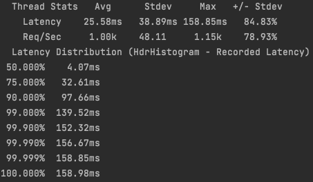

# Домашнее задание 7: Read repair

## Политики Read repair:
1) NONE -> не исправлять неконсистентность данных
2) READ_REPAIR -> читаем значения с реплик и в случае неконсистентности исправляем их
3) READ_REPAIR_DIGEST -> читаем значение только с одной реплики, а с остальных лишь хеш данных. В случае несовпадения хешей читаем со всех реплик данные и исправляем неконсистентность

## Политика NONE

### put запросы с rps 11k.
  

### put запросы с rps 12k.  
  
Производительность put запросов с выключенным read repair не поменялась.  

### get запросы с rps 12k.
  
Производительность get запросов как будто уменьшилась на 1k rps. Но я посмотрел, во всех stage у меня put и get запросы работали с близким rps, а в stage5 вдруг get стал работать на 1k rps лучше. Поэтому я склоняюсь к тому, что это погрешность/ошибка в измерениях stage5 (скорее всего это был запуск без async-profiler в фоне) и на самом деле производительность get запросов не изменилась. Также я посмотрел в профиль и не увидел там ничего нового.    

### cpu profile

### alloc profile

### lock profile

## Политика READ_REPAIR

### put запросы с rps 12k.
  
Производительность put запросов с включенным read repair и полностью консистентным состоянием незначительно улучшилось. Думаю, это шум измерений и ничего особенного.  

### get запросы с rps 12k.
  
Производительность get запросов с включенным read repair и полностью консистентным состоянием не поменялась.  
Результаты понятны: состояние консистентно, значит фактически read repair не происходит, поэтому новых запросов для исправления конфликтов нет, а поэтому и производительность на том же уровне.  

### cpu profile

### alloc profile

### lock profile

## Политика READ_REPAIR_DIGEST

### put запросы с rps 14k
 
Интересно, что put запросы ускорились на 2k rps. Пока сложно сказать, почему именно.

### put запросы с rps 15k
  
Но 15k rps уже не выдерживает. 

### get запросы с rps 19k
  
При включеном async-profiler я разогнал приложение до 19k rps. Это очень сильный прирост производительности. Произошел он, разумеется, из-за того, что теперь по сети в основном гуляют хеши, а не сами значения. При репликации на кворум с вероятностью 2/3 одна из реплик окажется мастер нодой запроса, а значит запрос за значением можно осуществить локально, а у второй реплики спросить только хеш.  

### get запросы с rps 21k
  
Без async-profiler мне удалось разогнать приложение до 21k rps. 

### cpu profile

### alloc profile

### lock profile

## Вывод
* Read repair не ухудшает performance при условии консистентности данных
* Read repair с digest-оптимизацией значительно улучшает performance, причем не только get, но и put запросов. (Опять же при условии консистентности данных)

# TODO:
* Анализ профилей
* Запуски wrk и профиля при неконсистентных данных, то есть когда начнутся сами read repair
