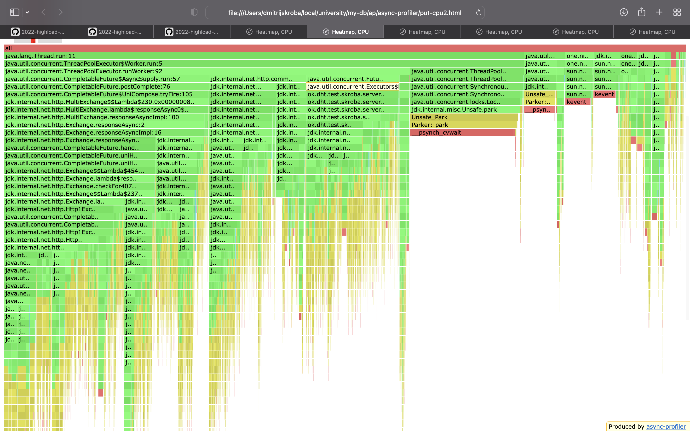
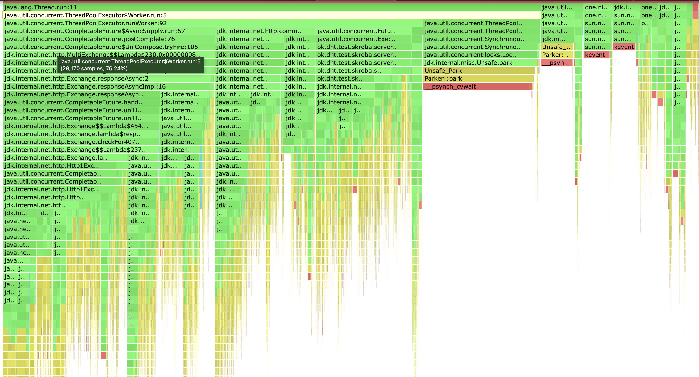
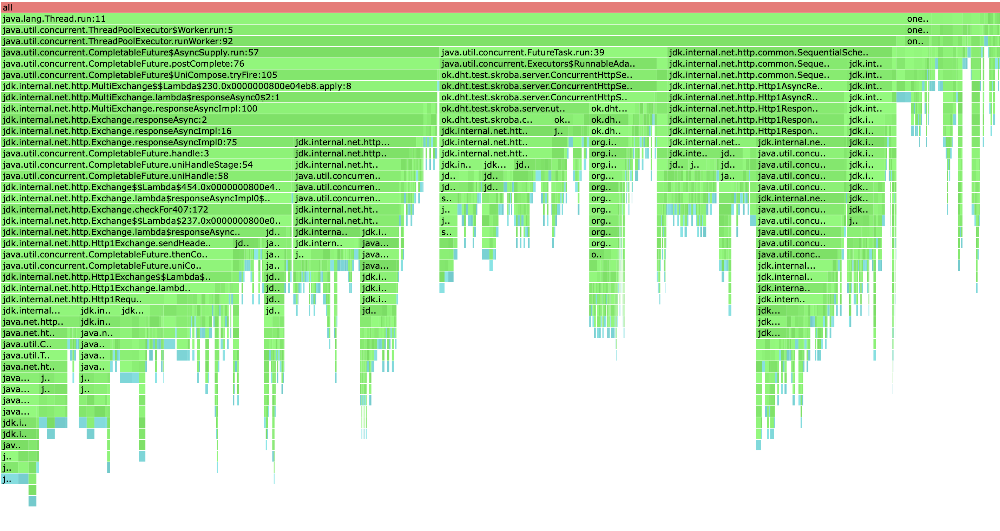
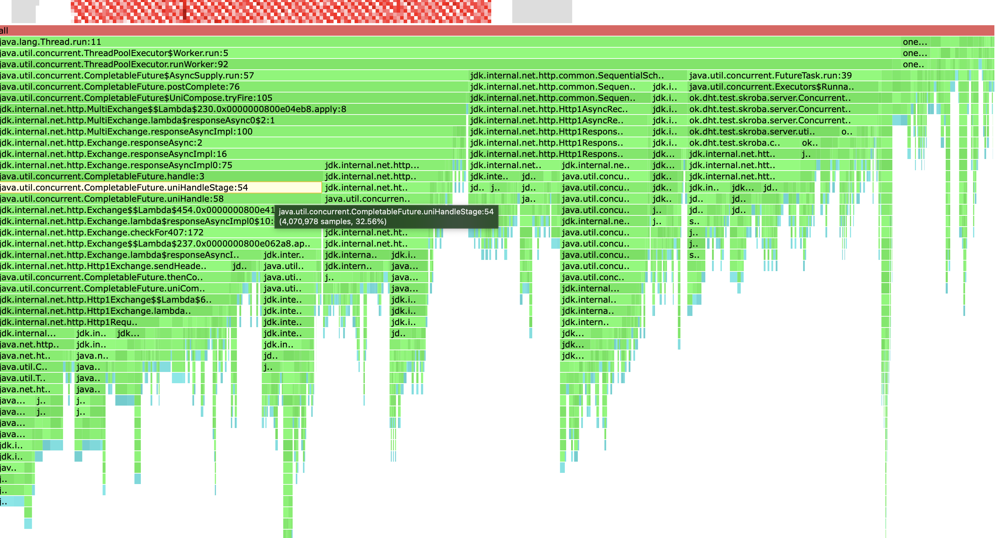

# Stage 5

## Вводные:

На этом этапе мы делали обработку ответов с других нго д асинхронной.
Для обработки ответов были добавлены два счетчика: положительные ответы, все
обработанные. Также было добавлено сохранение сущности с самой ранней меткой
для `GET` запроса.
В реализации нет активных ожиданий, для изменений значений используются либо
атомарные переменные, либо в случае сущности, замена производится в цикле при
помощи `CAS'a`.
Ответ мы отправляем либо когда получим первые ack ответов положительных или
когда получим все ответы и отправим ошибку `504`.

## Нагрузочное тестирование:

Тестирование производилось на кластере из 3 нод локально.

_На данный момент: все больше заметны недостатки такого подхода, так я пытался
проверить несколько вариантов сервера и несколько подходов в обработке запросов,
в частности использовать ли отдельный Worker ForkJoin или нет, тесты локально не
показали сколько значимой разницы, хотя из общей логики она должна быть._

Put
```
wrk2 -t 16 -c 64 -d 120s -R 1000 http://localhost:3000 -s put.lua
Thread Stats   Avg      Stdev     Max   +/- Stdev
    Latency    15.55ms   14.29ms 125.50ms   78.60%
    Req/Sec    62.41     12.98   119.00     74.64%
  120016 requests in 2.00m, 7.67MB read
Requests/sec:   1000.08
Transfer/sec:     65.43KB
```
Get
```
wrk2 -t 16 -c 64 -d 180s -R 1000 http://localhost:3000 -s get.lua
Thread Stats   Avg      Stdev     Max   +/- Stdev
    Latency    17.04ms   17.40ms 688.13ms   81.91%
    Req/Sec    62.42     13.06   204.00     71.40%
  180017 requests in 3.00m, 12.02MB read
  Non-2xx or 3xx responses: 6463
Requests/sec:    999.90
Transfer/sec:     68.38KB
```

## Профилирование:

Все графики можно найти в [здесь](./flames/five/html).

Если сравнивать `GET` и `PUT` запросы. Видно, что при пут запросе, который является более быстрым, очевидно что большая часть времени уходит на общение между нодами. При гет же запросе, видно различимость работы с базой данных.

### CPU:

GET
 

PUT


### Alloc:

GET


PUT


Анализ в выводах.

## Анализ и выводы:

1. Категорически не хватает рельного окружения, чтобы видеть влияние изменений чуть меньших, чем между этапами(описано выше).
2. Разница между асинхронной обработки общения между нодами сервиса и последовательной крайне ощутима. Так на предыдущем этапе у меня не получилось даже замерить нормально производительность, тк сервис не мирал только при работе в 1-2 потока на wrk. Так что прирост производительности у меня получился значительным. 
3. У нас достаточно много парков тк я использую поток больше, чем у меня ядер на машине.
4. Также у нас есть ожидания связанные с тем, что клиент переиспользует некоторые connection'ы и там он использует synchronized.
5. При всем этом мы сильно сократили наше ожидание по сравнению с предыдущим этапом.

## Идеи оптимизации:

1. Можно попробовать делать мультикаст на все ноды. Но тогда если наши ноды расположены равноудалено от данной, мы можем получить гонку на `CAS'e`.
2. Уйти от общения через `HTTTP` между нодами, ибо это на данный момент является самым узким горлышком нашего приложения.
3. Перейти на другую стратегий репликации, чтобы уменьшить количество сообщений между нодами для этого можно использовать Gossip репликацию или же избирать лидера, который будет заниматься надежной репликацией, из положительного - это даст настоящие гарантии приложению.
4. Можно уйти от случайного выбора шардов, сделать менеджера более умного. Но это не очевидно как можно протестировать в наших условиях.


