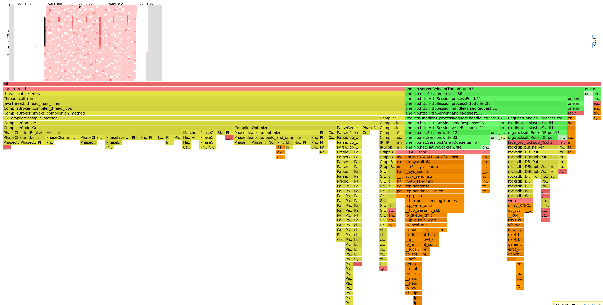
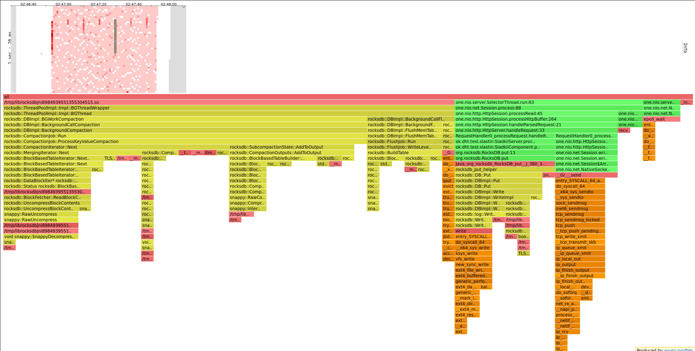
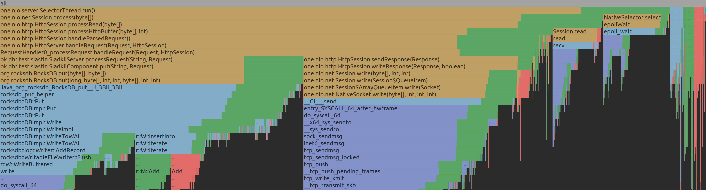
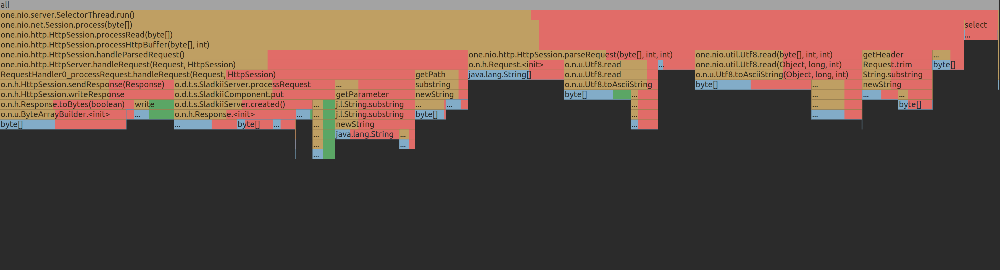
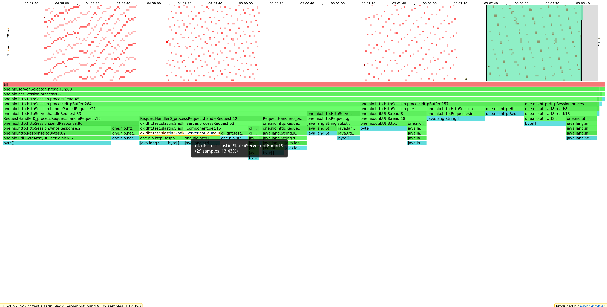
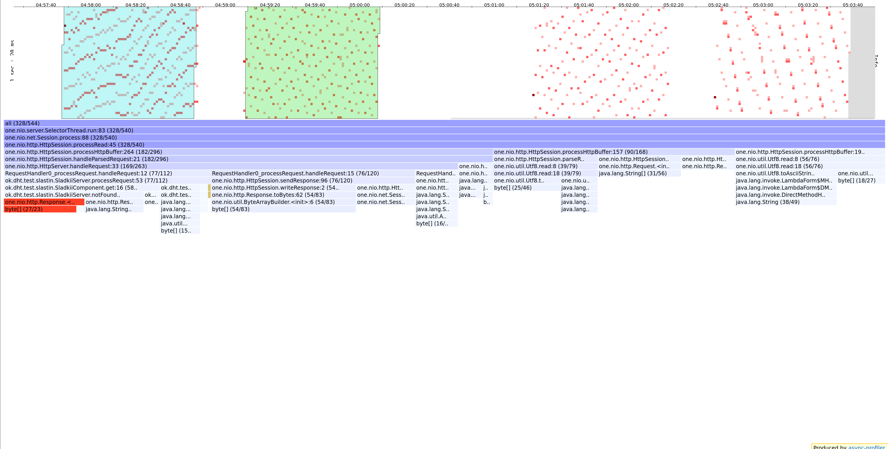

# Отчет 1 (Александр Сластин, ИТМО)

Отчет будет состоять из 3-х частей:
1. Анализ `PUT`
2. Анализ `GET`
3. Общий вывод

Однако прежде чем переходить к анализу проясню пару моментов:
- *Что такое __стабильная нагрузка__?*
  - Как я понял, это такая нагрузка, которая дает приемлемый для нас latency.
  - Для своего сервера выберу приемлемый latency ~ `1ms`, и разрешу отклоняться этому значению в окрестностях `0.5ms`. 
  - То есть, если мы посмотрели, как работает сервер под нагрузкой, и среднее значение latency по нагрузке лежит в отрезке `[0.5, 1.5]` - то нагрузка стабильная, в противном случае - нет.
- *Что значит __наполненная__ БД?* 
  - Под этим буду понимать следующее: __БД наполненная__, если ее данные хранятся не только в кеше / хипе / буфере диска, но еще и на самом диске, чтобы сымитировать высокую нагрузку на приложение.
  - Приложение имеет размер хипа `128Mb`, а локально на машине, на которой поднят сервер, данные хранятся на диске _Samsung 970 EVO Plus 500 ГБ M.2 MZ-V7S500BW_, который имеет размер буфера `512Mb`. Отсюда ясно, что если в БД хранится больше `2Gb` данных, то она будет _наполненной_.

В качесте БД буду использовать `RocksDB`.

## PUT

### Поиск стабильной нагрузки

Данные для создания запросов буду генерировать с помощью [putsu.lua](../../wrk2/putsu.lua).

Каждый раз запуск происходил на пустой БД.

Поймем, какой параметр `-R` нужен, чтобы обеспечить стабильную нагрузку на сервер.

 - R = 10000
   - `wrk2 -t1 -c1 -d1m -R10000 -s putsu.lua -L http://localhost:2022`
   - Avg Latency = `1.42ms`, Requests/sec: `9999.81`

 - R = 15000
   - `wrk2 -t1 -c1 -d1m -R15000 -s putsu.lua -L http://localhost:2022`
   - Avg Latency = `628.35us`, Requests/sec: `14999.86`

 - R = 17500
   - `wrk2 -t1 -c1 -d1m -R17500 -s puts.lua -L http://localhost:2022`
   - Avg Latency = `1.37ms`, Requests/sec: `17499.76`

 - R = 20000
   - `wrk2 -t1 -c1 -d1m -R25000 -s puts.lua -L http://localhost:2022`
   - Avg Latency = `48.60ms`, Requests/sec: `19998.06`

В каком-то плане значение __R = 17500__ является пороговым - если увеличить кол-во запросов, то latency моментально сильно возрастает и нагрузка перестает быть _стабильной_.

График, на котором изображены показатели latency в зависимости от разной скорости запросов:

`87.5%` запросов при __R = 17500__ имеюют latency не превосходящий `1.404ms`, что обеспечивает стабильную нагрузку.

### CPU

#### Общий взгляд

Посмотрим на общую CPU-нагрузку при __R=17500__:

- `85%`: `SelectorThread`, который считывает данные и записыват их обратно
  - `41%`: `db.put`
    - `17%`: запись в WAL (Write-Ahead-Log)
    - `10%`: запись в MemTable
  - `31%`: работа с сокетом, где практически все - системные вызовы
- `5%`: фоновый compaction

По нагрузке все ожидаемо: запись в WAL (Write-Ahead-Log) каждый раз ходит на диск, поэтому занимает основное время метода `put`. С одной стороны, можно было бы отключить, получив прирост в произодительности, с другой потеряли бы durability.

Работу с сокетом можно было бы соптимизировать, используя HTTP/1.1 pipelining, чтобы не каждый раз создавать по новому соединению, а переиспользовать имеющиеся.

Фоновый compaction занимает так мало нагрузки, потому что данных немного, поэтому за всю нагрузки он происходит единожды.

#### Наибольшая нагрузка

За всю нагрузку при __R=17500__ можно выделить 2 тяжелых учатска:

Работа JIT-а (`70%`), которая отрабатывает в самом начале.

Фоновый compaction (`52%`) вместе со сбросом MemTable в память (`flush`) (`14%`). Для `RocksDB` такие операции обязательны, но учитывая, что их вес относительно всей нагрузки весьма мал, БД хорошо справляется с пробросом на диск.

#### 17500 vs 20000

Сравним как менялось распределение нагрузки при __R=17500__ и __R=20000__:

При __R=17500__ данных приходит меньше, поэтому нагрузка на сеть (столбец по центру), записей в БД (столбец слева) меньше, а также compaction занимает маньше времени.

Поэтому при __R=20000__ latency возрастает в несколько раз по сравнению с __R=17500__.

### ALLOC

#### Общий взгляд

Посмотрим на выделении памяти при __R=17500__:

- `95%`: `SelectorThread`
  - `40%` уходит на конвертацию байт в строку при чтении входного запроса `HttpSession` - это особенность HTTP-запросов, и кажется это сложно улучшить, ведь HTTP - текстовый протокол, поэтому парсинга не избежать. Однако в нашем случае можно было бы сократить кол-во парсинга, учитывая, что мы кладем именно байты в базу.
  - `12%` уходит каждый раз на создани объекта `Response` вызовом метода `created`. Можно заранее создать статические переменные, но тогда надо не забыть переписать `HttpSession`, в частности метод `sendResponse(response)`, который к каждому ответу дописывает лишние хедера вида `"Connection: Keep-Alive"` or `"Connection: close"`.
  - `16%` уходит на запись в `MemTable`, что ожидаемо

#### 17500 vs 10000

Сравним, какие менялось распределение аллокаций при __R=17500__ и __R=10000__:

Везде ожидаемые изменения с увеличеним числа данных: тратим больше памяти на выгрузку данных на диск, а также обработку запросов.

## GET

Буду искать стабильную нагрузку при наполненной БД (`2.6Gb`) с помощью скрипта [getu.lua](../../wrk2/getu.lua).

В базе находятся данные, заполненные с помощью [putbu.lua](../../wrk2/putbu.lua).

### Поиск стабильной нагрузки

 - R = 10000
   - `wrk2 -t1 -c1 -d1m -R10000 -s get.lua -L http://localhost:2022`
   - Avg Latency = `2.64s`, Requests/sec: `9171.36`
   - Сервер умирает, сокращаю объем

 - R = 5000
   - `wrk2 -t1 -c1 -d1m -R5000 -s get.lua -L http://localhost:2022`
   - Avg Latency = `9.91ms`, Requests/sec: `4999.99`

 - R = 3000
   - `wrk2 -t1 -c1 -d1m -R3000 -s get.lua -L http://localhost:2022`
   - Avg Latency = `6.70ms`, Requests/sec: `2999.91`

 - R = 2000
   - `wrk2 -t1 -c1 -d1m -R2000 -s get.lua -L http://localhost:2022`
   - Avg Latency = `2.73ms`, Requests/sec: `1999.97`

 - R = 1500
   - `wrk2 -t1 -c1 -d1m -R1500 -s get.lua -L http://localhost:2022`
   - Avg Latency = `1.19ms`, Requests/sec: `1499.98`

Стальниая нагрузка получается при __R=1500__. 

### CPU

#### Общая нагрузка

Посмотрим на общую CPU-нагрузку при __R=1500__:

- `76%` ложится на БД
  - `20%` на поиск данных. Этот момент можно было ускорить, используя фильм Блума, для отсечения поиска того, чего в БД нет.
  - `53%` на разжимание данных. А здесь уже некий трейдоф: либо не сжимаем данные, быстрее их ищем, но они много занимают места, либо наоборот - надо смотреть от входной нагрузки.
- `13%` на сеть

#### 5000 vs 10000

Ожидамо с ростом кол-ва запросов растет время обращения, в особенности расжимание данных.

### ALLOC

#### Общий взгляд

`50%` уходит на выделение памяти внутри обработчика, `50%` уходит на сети. Замечания по оптимизации памяти для `put` применимы и тут.

#### 3000 vs 5000

Выделение памяти увеличивается равномерно в ожидаемых местах при увеличении нагрузки.

## Выводы

С `PUT` сервер показал хорошую стабильную нагрузку, а также есть durability, благодаря записи в WAL. CPU елся в ожидаемых местах, но подчеркивал, что эти самые горячие точки можно улучшить, например, созданием большего пула для compaction (раз на нее приходится бОльшая нагрузка) или настройкой конкретно под одиночные запросы. С памятью прям сильно лишних выделений не наблюдалось, раз только в создание одних и тех же `Response`, но в будущем с распаралеливанием сервера, нагрузки станет больше и эти аллокации померкнут на общем фоне, поэтому с ними сильно можно не возиться.

`GET` также неплохо себя показал, однако скорость по сравнению с `PUT` снизилась в несколько раз и дает пищу на размыления, касательно трейдофа между сжатием данных и скоростью. Также, можно для одиночного типа запросов, добавить фильтр Блума, чтобы избежать лишних поисков. Память выделилась в ожидаемых местах, а ее оптимизации аналогичны `PUT`.
