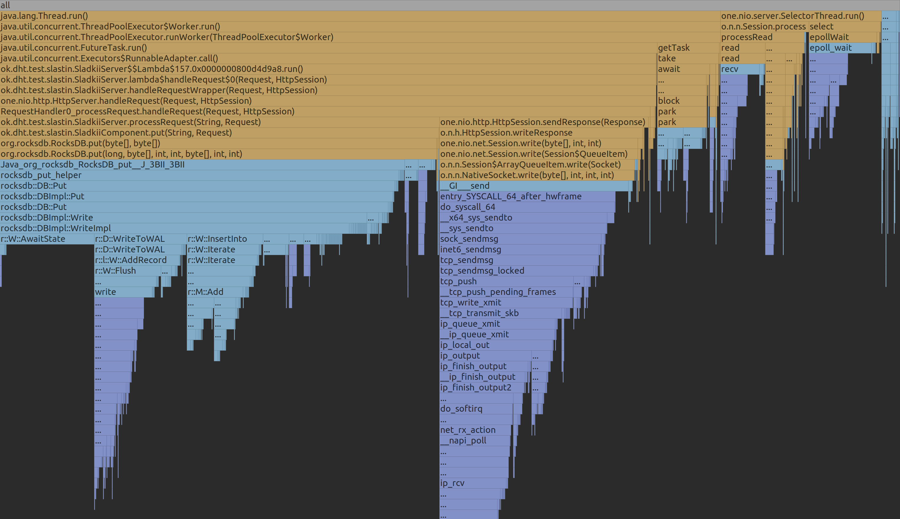
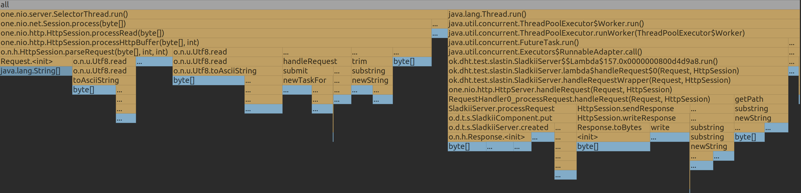
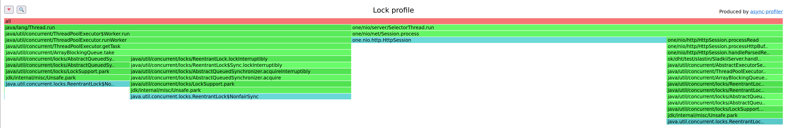
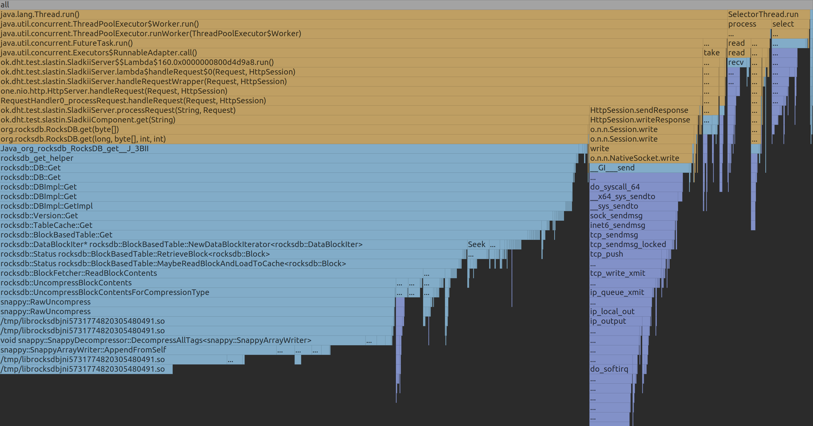
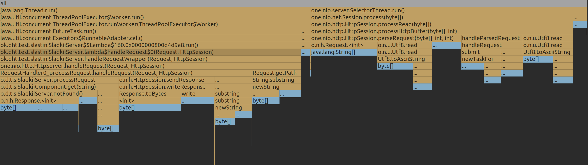

# Отчет 2 (Александр Сластин, ИТМО)

Отчет будет состоять из 3-х частей:
1. Анализ `PUT`
2. Анализ `GET`
3. Общий вывод

Однако прежде чем переходить к анализу проясню пару моментов:
- *Что такое __стабильная нагрузка__?*
  - Как я понял, это такая нагрузка, которая дает приемлемый для нас latency.
  - Для своего сервера выберу приемлемый latency ~ `1ms`, и разрешу отклоняться этому значению в окрестностях `0.5ms`. 
  - То есть, если мы посмотрели, как работает сервер под нагрузкой, и среднее значение latency по нагрузке лежит в отрезке `[0.5, 1.5]` - то нагрузка стабильная, в противном случае - нет.
- *Что значит __наполненная__ БД?* 
  - Под этим буду понимать следующее: __БД наполненная__, если ее данные хранятся не только в кеше / хипе / буфере диска, но еще и на самом диске, чтобы сымитировать высокую нагрузку на приложение.
  - Приложение имеет размер хипа `128Mb`, а локально на машине, на которой поднят сервер, данные хранятся на диске _Samsung 970 EVO Plus 500 ГБ M.2 MZ-V7S500BW_, который имеет размер буфера `512Mb`. Отсюда ясно, что если в БД хранится больше `2Gb` данных, то она будет _наполненной_.

В качесте БД буду использовать `RocksDB`.

## PUT

Проанализируем сервер под следующей нагрузкой: `wrk2 -t8 -c256 -d2m -R40000 -s putsu.lua -L http://localhost:2022` 
([putsu.lua](../../wrk2/putsu.lua))

wrk2 output:
```
  Thread Stats   Avg      Stdev     Max   +/- Stdev
    Latency     1.40ms    1.98ms  47.52ms   96.28%
    Req/Sec     5.26k   687.01    15.40k    76.53%
  4792035 requests in 2.00m, 306.19MB read
Requests/sec:  39933.62
Transfer/sec:      2.55MB
```

### CPU



- `80%`: workers. Ожидаемым образом ту нагрузку, которую раньше делали в `SelectorThread` сместили на работу пула
  - `9%`: `park`, который вызывается для каждого потока прежде чем он получит задание. Такая задержка неибезжна,
     ведь очередь с заданиями - разделяемый ресурс между потоками и их надо между собой синхронизовать.
  - `23%`: запись ответа в сокет. Тут по существу системные вызовы, поэтому это та нагрузка, которую избежать нельзя.
  - `48%`: `db.put`, где нагрузка в рамной мере распределилась между синхронизацией параллельно пишущих потоков, синхронизацией
     с WAL (которую не избежать для сохранения durability), а также вставки в MemTable.
- `17%`: `SelectorThread` - установка соединения и чтение запроса

Сразу видно, что по сравнению с однопоточной версией мы только выиграли в производительности, обрабатывая больше соединений с большим
числом запросов и полуя даже более лучший latency. Это показывает, что перенести нагрузку с `SelectorThread` было правильным решением, а также
что `RocksDB` хорошо исполнять `put` запросы в многопоточной среде.

### ALLOC



- `52%`: `SelectorThread`, где вся память тратится на парсинг запроса. Рецепты по улучшению этой части аналогичны предыдущему отчету, а именно что,
   что нет необходимости делить лишний парсинг `id`
- `44%`: workers, где ожидаемым образом память разделилась пополам между `db.put` и запись ответа в socket

По памяти все в пределах ожиданий и пропорционально используемым данным.

### LOCK



- `44%` уходит на синхронизацию workers, что весьма резонно
- оставшееся ожидание уходит на чтение и запись в сокет

## GET

Буду искать стабильную нагрузку при наполненной БД (`2.6Gb`) с помощью скрипта [getu.lua](../../wrk2/getu.lua).

Проанализируем сервер под следующей нагрузкой: `wrk2 -t8 -c256 -d2m -R20000 -s getu.lua -L http://localhost:2022`
([getu.lua](../../wrk2/getu.lua))

```
  Thread Stats   Avg      Stdev     Max   +/- Stdev
    Latency     2.22ms    5.07ms  62.75ms   95.61%
    Req/Sec     2.56k   314.68     6.55k    85.57%
  2398472 requests in 2.00m, 157.83MB read
  Non-2xx or 3xx responses: 2398472
Requests/sec:  19987.17
Transfer/sec:      1.32MB
```

### CPU



- `90%`: workers
  - `16%`: запись ответа в сокет из потока воркера
  - `72%`: `db.get`
    - `57%`: разжимание данных
    - `15%`: поиск в MemTable 
- `10%`: SelectorThread

Распределение нагрузки осталось аналогичным однопоточному случаю, однако теперь параллельно исполняя запросы, -R увеличилась в несколько раз, при
этом latency не пострадал. Рассуждения про tradeoff между сжатием данных также аналогично однопоточному случаю, а также
оптимизация в виде Фильтра Блума имеет место быть.

### ALLOC



Память поровну распределилась между селектор-тредами и воркерами. Также здесь сразу видны плюсы использования фильтра Блума, потому что `16%` тратится на
создание `Reponse(NOT_FOUND)_` - можно и заранее создавать и выдавать имеющиеся, учитывая текущий стиль нагрузки.

### LOCK


Поведение лока аналогично при `PUT` нагрузки, что естественно, учитывая что и PUT и GET запросы обрабатывает один пул. 

## Выводы

Благодаря вынесению операций над сервером в отдельный пул потоков, удалось увеличить стабильную нагрузку гораздо при большем числе запросов - это касается
и PUT, и GET. Распределение нагрузки сместилось с SelectorThread на пул потоков, благодаря чему вышло примерно одинаковое кол-во аллокаций и там, и там.
RocksDB вне зависимости от многопоточности имеют нагрузку по методам аналогичную однопоточному варианту, а учитывая, что кол-во запросов для стабильной
нагрузки увеличилось, то не является узким местом работы сервера. Однако, в зависимости от нагрузки, ее нужно настраивать определенным образом, например, 
если доставать данные согласно [getu.lua](../../wrk2/getu.lua), то будет много обращений по несуществующему id, а значит рационально прикрутить фильтр Блума.
one-nio поддерживает pipelining, но в данный момент его не используем - это тоже место для потенциальной оптимизации.
