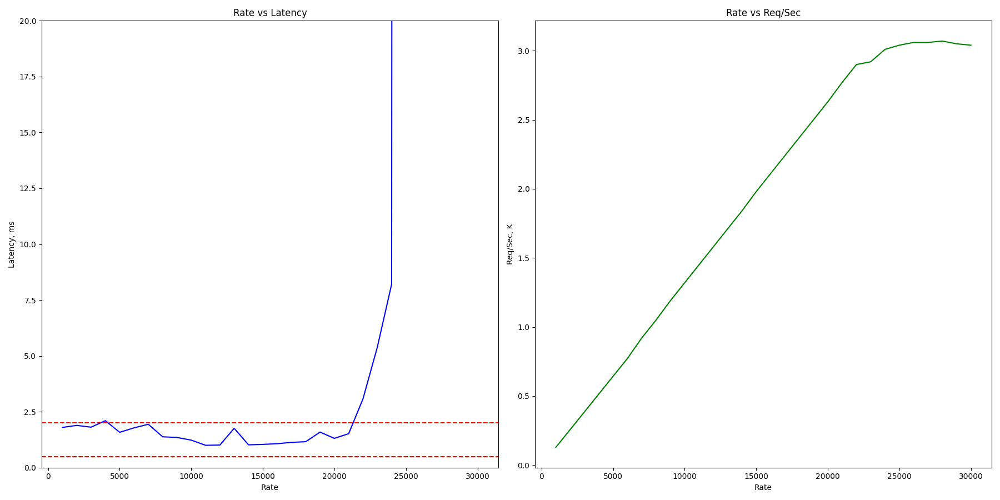
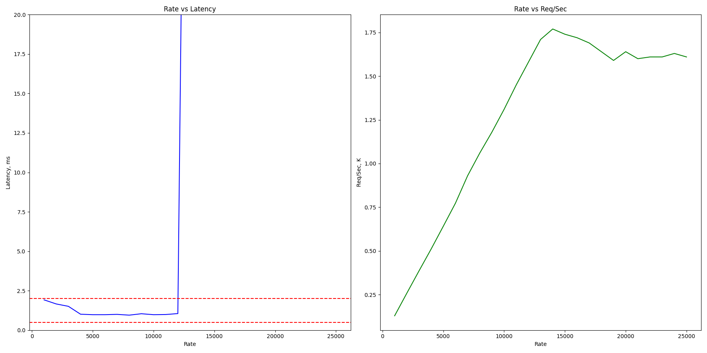
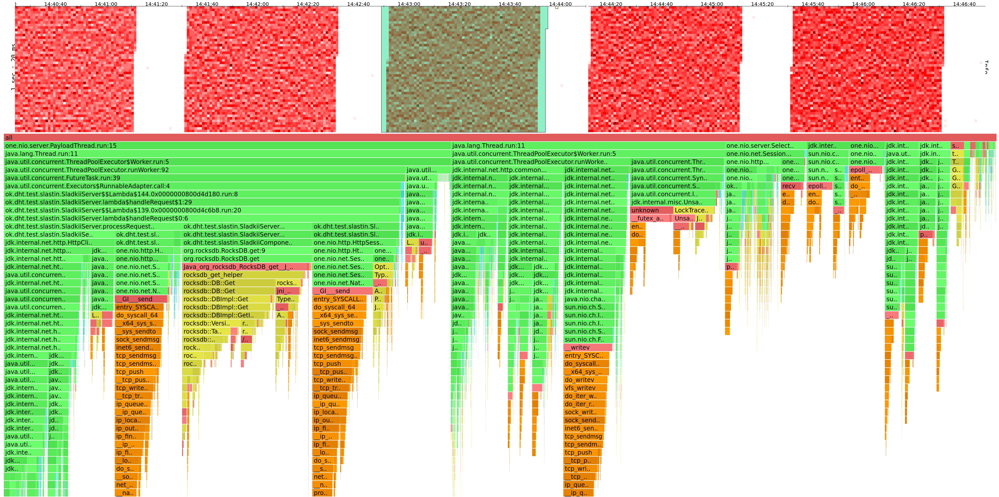
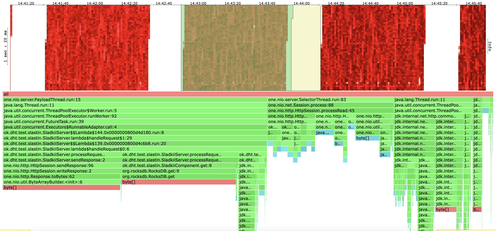
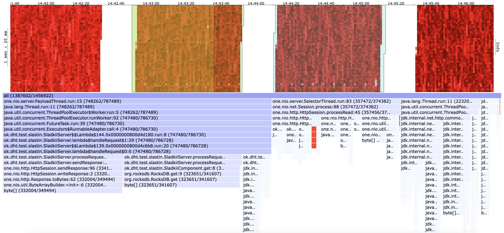
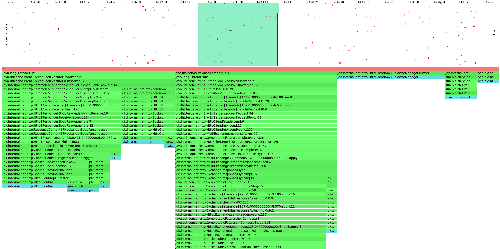
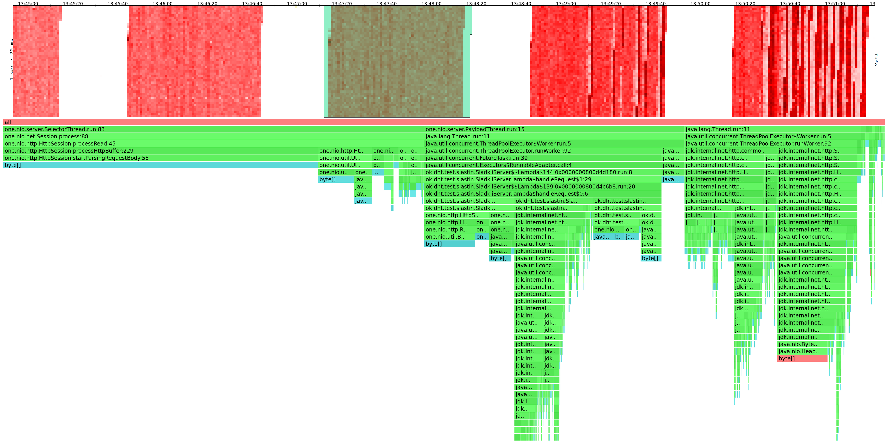
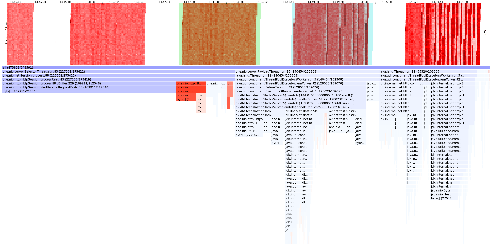
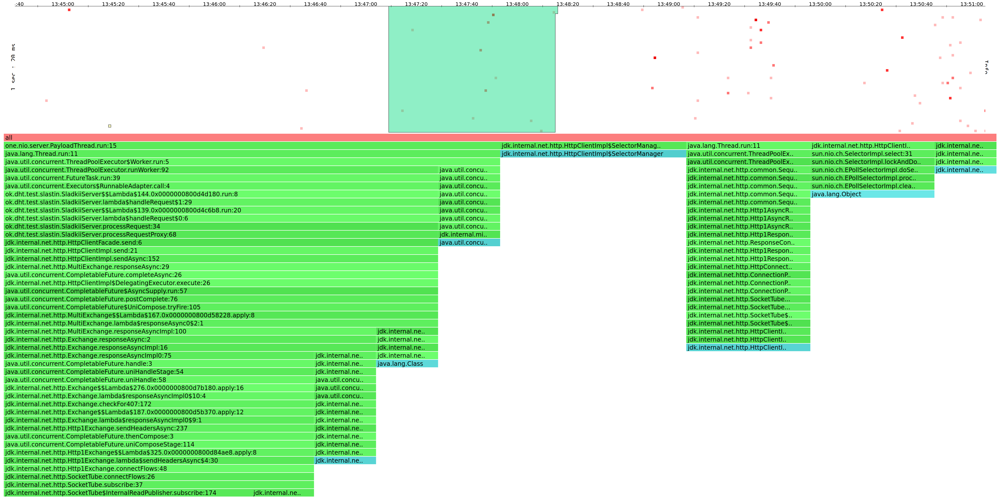

# Отчет 3 (Александр Сластин, ИТМО)

# Вступление

Прежде чем переходить к анализу проясню пару моментов:
- *Что такое __стабильная нагрузка__?*
  - Нагрузка, которая дает приемлемый для нас latency.
  - Для своего сервера буду называть latency приемлемым, если он лежит в [`OK_LATENCY_LOWER_BOUND`, `OK_LATENCY_UPPER_BOUND`].
- *Что значит __наполненная__ БД?* 
  - Под этим буду понимать следующее: __БД наполненная__, если ее данные хранятся не только в кеше / хипе / буфере диска, но еще и на самом диске, чтобы сымитировать высокую нагрузку на приложение.
  - Приложение имеет размер хипа `128Mb`, а локально на машине, на которой поднят сервер, данные хранятся на диске _Samsung 970 EVO Plus 500 ГБ M.2 MZ-V7S500BW_, который имеет размер буфера `512Mb`. Отсюда ясно, что если в БД хранится больше `2Gb` данных, то она будет _наполненной_.

В качесте БД буду использовать `RocksDB`.

В рамках данного задания зафиксирую `OK_LATENCY_LOWER_BOUND`=`0.5ms`, `OK_LATENCY_UPPER_BOUND`=`2ms`.

Далее сформулирую некоторый сценарий, исходя из которого и буду настраивать сервер.

# Сценарий

После успешной питч-сессии стартап команда "MLArtBest" решила захватить рынок. В частности, специальному отделу разработчиков #highload-nerds, было поручено выкатить высокопроизводительный сервер, который будет выдерживать 3 вида запросов по протоколу HTTP:
1. `GET "/v0/entity?id=…"` - получить картинку с заданным `id`
2. `PUT "/v0/entity?id=…", Body=value` - положить картинку с `id` со значением `value`
3. `DELETE "/v0/entity?id=…"` - удалить картинку с заданным `id`

Неделю назад была встреча с отделом аналитиков, на котором были выдвинуты следующие гипотезы, подтвержденные статистикой:
1. Стартап сильно заинтересовал пользователей, поэтому ожидается огромное кол-во запросов GET
2. Нейронки довольно часто будут выкладывать картинки
3. Удалений совсем немного, только в некоторых случаях при нарушении возрастных ограничений или авторских прав
"Статистика не  точная, но это лучше чем ничего" - подумала команда #highload-nerds.

Поставьте себя на место тимлида команды #highload-nerds - как стоит организовать сервер, используя предполагаемое распределение запросов. Отпрофилируйте приложение на GET/PUT запросах, рассмотрев краевые случаи и сделайте выводы.

## Адаптация под сценарий

Исходя из данных аналитиков, буду предполагать следующую соотношение различных видов запросов: GET 6, PUT 3, DELETE 1.

Также, учитывая, что GET >> PUT, то логичной оптимизацией является добавление в БД фильтра Блума. Гипотеза: latency GET запросов увеличится, а у PUT слегка уменьшится. Это желаемое поведение.

# Структура отчета и детали реализации

- Начнем с ответа на вопрос: правда ли фильтр Блума позволяет поднять rate для запросов GET и слегка уменьшить для PUT? Для этого сравню точку разладки без него vs с ним
- PUT/GET запросы будут запускаться на полной БД (`8.1 Gb`), заполненной с помощью [Fill.java](../../Fill.java)
- Точку разладки буду искать с помощью самописного [profiler.py](../../profile/profiler.py). Для PUT запросов будет использоваться [put.lua](../../profile/lua/hw3/put.lua), а для GET запросов будет использоваться [get.lua](../../profile/lua/hw3/get.lua).

Далее для каждого вида запросов (GET/PUT) проведу анализ в точке разладки:
1. CPU (общий взгляд, причина разладки)
2. ALLOC (общий взгляд, сравнение с соседом)
3. LOCK (общий взгляд)

Наконец, сделаем общий вывод по GET/PUT запросам, а также поймем, было ли правильным решением добавлять в БД фильтр Блума.

# Анализ

## Поиск точки разладки

### GET

`python3 profiler.py -t 8 -c 64 -d 50s -s lua/get.lua -u http://localhost:2022 -sn Launch`

Без фильтра Блума (точка разладки `R=20000`):

(красные линии соответствуют `OK_LATENCY_LOWER_BOUND` и `OK_LATENCY_UPPER_BOUND`)

C фильтром Блума (точка разладки `R=22000`)::

### PUT

`python3 profiler.py -t 8 -c 64 -d 50s -s lua/put.lua -u http://localhost:2022 -sn Launch`

Без фильтра Блума (точка разладки `R=12000`):

C фильтром Блума (точка разладки `R=12000`)::

### Выводы

Гипотеза оправдалась: после добавления фильтра Блума удалось увеличить скорость запросов для GET, а также скорость запросов для PUT не изменилась, что является тольком плюсом.

Далее рассмотрю в деталях CPU/ALLOC/LOCK флеймграфы на БД с фильтром Блума в точке разладки.

## GET

### CPU

#### Общий взгляд

- `45%`: `one.nio.server.PayloadThread` (пул воркеров внутри `SladkiiService`)
  - `12%`: отправка шарду и прием ответа. Это место необходимо оптимизировать через переход на асинхронное взаимодействие - сейчас поток по большей части ждет и ничего не делает.
  - `13%`: `RocksDB.get`
    - `9%`: `rocksdb::DBImpl::Get`
      - `6%`: поиск ключа по SST-файлам. Это самое тяжелое место, поэтому ожидаемо большой процент.
      - `2%`: поиск внутри MemTable.
    - `3%` - `rocksdb::jniUtil::createJavaByteArrayWithSizeCheck`. Как понял, это затраты, приходящиеся на jni взаимодействие - плата за то, что должны дергать джавой плюсовый код. Потенциально этого места можно избежать, если бы библиотека RocksDB была написана на java, но что есть, то есть.
  - `9%`: отправка ответа клиенту. Отпимизировать сложно - тут в основном только системные вызовы.
  - `5%`: `park`. Показатель больше, чем хотелось бы и улучшится переходом на асинхронщину, когда потоки перестанут ждать и ничего не делать.
- `12%`: `SelectorThread` - принимает соединение и парсит запрос клиента, а также кладет задание в очередь. Ожидаемое время работы: системный вызовы принимают и считывают соединение клиента + необходмая работа по парсингу.
- `28%`: джавовский пул воркеров для отправки и приема http-запроса.
  - `6%`: системные вызовы на отправку запроса.
  - `10%`: `park`. Это плохие цифры - слишком много потоков стоит и ничего не делает. Объясняю тем, что `SladkiiService` теперь помимо своих воркеров использует и джавовский пулл при отправке сообщения шарду. Потоков сильно больше ядер, поэтому на многих вызывается `park`. Этот показатель улучшится переходом на асинрхронное взаимодействие, где будет явно указан пулл воркеров необходимого размера и настроек, которые будут обрабатывать запрос со стороны шарда.
  - `10%`: затраты `java.net` при отправке запроса и приеме запроса. Улучшить можно одним из двух способов: 1) поменять протокол общения между шардами (на практике по http никто не общается, чаще по gRPC); 2) поменять httpclient. Но второй вариант вряд ли что-то изменит, потому что джавовский и так хорошо написан.
- `12%`: `SelectorManager` на стороне `java.net.httpclient`. По большей части тут системные вызовы, поэтому остается автоматизировать их.

#### Причина разладки

По профилю видно, что стало приходить больше запросов и воркеры стали получать больше задач. Это естественно, при увеличении скорости подачи запросов. Но сам профиль не изменился. Это означает, что мы попали на сеть и ресурсы, используемые сервером: селекторы и воркеры не успевают вовремя принять запрос и отправить на него ответ. Улучшить можно увеличив скорость обраотки запроса, чтобы было доступно больше времени на отправку ответа.

### ALLOC

#### Общий взгляд

- `50%`: `one.nio.server.PayloadThread`
  - `22%`: `sendResponse` - естественные траты на отправку значения
  - `22%`: `RocksDb.get`
  - `3%`: `jdk.internal.net.httpclient.HttpClientFacade.send` - отправляем только небольшой ключ, поэтому тратим так мало памяти
- `30%`: `SelectorThread` - парсинг запроса клиента.
- `16%`: воркер `java.net` на прием ответа с другого шарда. Хорошо, что объем аллокаций близок к объему в `RocksDb.get`: это означает, что консистентное хеширование раскидало данные примерно равномерно.

#### Сравнение с соседом

Профиль аллокаций не изменился: это также означает, что после точки разладки поведение сервера осталось таким же (не сломался с ростом нагрузки). Кол-во аллокаций увеличилось в естественных местах. 

### LOCK

#### Общий взгляд

- `34%`: воркеры java httpclient, ждущие ответы с другого шарда. Ожидание тут естественно
- `32%`: воркеры `SladkiiService`. Ожидание также ествественно, так как добавляем задание в очередь. Но не очень хорошо, что вместо того, чтобы выполнять обработку запросов на текущий шард, воркер еще ждет пул других джавовских воркеров. В идеале хотелось бы, чтобы был пул активных воркеров, которые обрабатывают запросы на текущий шард, а также небольшой пул ленивых воркеров, ждущих ответ с других шардов. Такое поведение должно появиться в асинхронной версии.
- `15%`: `net.http.HttpClientImpl` в селекторе
- `12%`: `SelectorThread`

## PUT

### CPU

#### Общий взгляд

- `30%`: `one.nio.server.PayloadThread` (пул воркеров внутри `SladkiiService`)
  - `7%`: проксирование шардам. Это узкое место сервера, потому что здесь тред ничего не делает, а ждет результат с другого сервера. Можно улучшить переключением на асинхронное взаимодействие.
  - `10.73%`: работа с БД (`RocksDB.put`)
    - `5%`: запись в `WAL`. Трейдоф между скоростью работы и durability.
    - остальное: поиск места вставки и запись в `MemTable`
  - `7.5%`: отправка ответа клиенту. Тут в основном системные вызовы, поэтому улучшить эту часть сложно. 
  - `3%`: `park`, где треды бьются за процессорное время. Учитывая, что в программе используется тредов сильно больше чем ядер - это ожидаемое поведение и потенциальное место для улучшений.
- `28%`: compaction и flushing MemTable в SST file.
  - `13%`: кодирование данных (сжатие/разжатие). Это трейдоф между затратой памяти и производительностью. Кол-во затраченной памяти сильно сокращатеся (в частности, наполненная БД вместо `11Gb` хранит `8Gb`).
- `20%`: общение по сети с шардами. 
  - `5%`: `park` по тем же причинам, что и раньше.
  - остальное: парсинг, чтение, обработка и запись HTTP-запросов. Это тоже потенциальное место для улучшений: HTTP-протокол накладывает куча лишней информации - для внутренного взаимодейтсвия шардов между собой это излишне.
- `14%`: `SelectorThread`, который занимается приемом соединения клиента, парсингом запроса и добавлением задачи на обраотку в пулл. Здесь в основном системные вызовы, поэтому сложно оптимизировать.

#### Причина разладки

Есть 2 причины разладки:
1. Те же, что и для GET (не успеевает вовремя прочитать все запросы и отправить на них ответы вовремя)
2. По профилю видно, что кол-во нагрузки на стадии compaction не сильно изменилось (самый правый столбец, светло-голубой). При дальнейшем увеличении скорости, кол-во работы на этой стадии не меняется. Это естественно, потому что в RocksDb для compaction есть специальный пул потоков, который его делает (на моем сервере этот пул из 2-х потоков). И далее, тут уже встает вопрос трейдофа: стоит ли сделать пул побольше. Но тогда, могут возникнуть еще больше лишних `park` (а их и так много). Поэтому стоит найти золотую середину, между размером пула для compaction, и размером пула для сервера. Для своего сервера я не решил увеличивать этот пул, потому что GET запросы приоритетнее, а там он не возникает.

### ALLOC

#### Общий взгляд

- `50%`: `SelectorThread`. Ожидаемо, потому что именно селекторы парсят вход (value размером `2.5 Kb`), и отправляется обратно только пустое body. В ранних отчетах писал, что парсинг `id` - излишен, ведь потом происходит снова конвертация в массив байт для того, чтобы положить в БД. Однако, `id` нужен для шардирования, поэтому парсинг не лишний.
- `27%`: внутри воркеров.  Так как внутренний протокол для общения между шардами HTTP - тратится излишнее кол-во аллокаций (`7%`), чтобы сформировать HTTP запрос.
- `20%`: общение по сети с шардами. Снова происходит аллокации на парсинг HTTP-запросы от шарда. Сократить можно используя более оптимальный протокол передачи по сети.

#### Сравнение с соседом

Увеличилось число аллокаций при увеличении кол-ва запросов - это ожидаемо, ведь прежде чем очередь переполняется необходимо распарсить HTTP-запрос, а на это и уходит основное кол-во аллокаций. Сам профиль нагрузки не изменился.

### LOCK

#### Общий взгляд

- `24%`: `one.nio.server.SelectorThread` - ожидание уходит на метод внутри `Session`: `public synchronized void process(byte[] buffer)`. Но это не узкое место, потому что каждый воркер работает индивидуально с сессией.
- `12%`: воркер сервера ожидает ответ шарда. Это грустно, потому что воркер ничего не делает и ждет воркера из джавовского треда для работы с сетью, который будет формировать HTTP-запрос, принимать ответ и отдавать результат обратно. Исправить можно использованием асинхронщины.
- `30%`: отправка шардовского запроса и обработка ответа. Основное ожидание происходит в `jdk.internal.net.http.HttpClientImpl$SelectorManager.run` и `jdk.internal.net.http.ConnectionPool`. Такое ожидание естественно, если использовать джавовский httpclient для отправки запроса.
- `6%`: contention на извлечение задачи из очереди ноды. Учитывая, что каждую ноду может обрабатывать не более половина потоков, то contention в этом месте вполне уместен

## Выводы

- Добавить фильтр Блума было правильным решением: удалось увеличить скорость запросов для GET и при этом не проиграть для PUT
- Сервер хорошо справляется с требуемой от него нагрузкой: cpu, alloc и lock профили работают ожидаемо и приемлемо в большинстве мест, но есть следующие моменты для улучшения: перейти на асинхронщину и подогнать оптимальное кол-во потоков для пула, который будет общаться с шардами.
- Общение между очередями воркеров сервера и очередью задач для каждой ноды (`Node.tasks`) не является узким местом и также достигается благодаря используемой `LinkedBlockingQueue` системе блокировок: в ней есть есть отедельный лок для get (`takeLock`) и для put (`putLock`) - за счет чего тот кто кладет задачу не сильно конфликтует за разделяемый ресурс с тем, кто извлекает.
