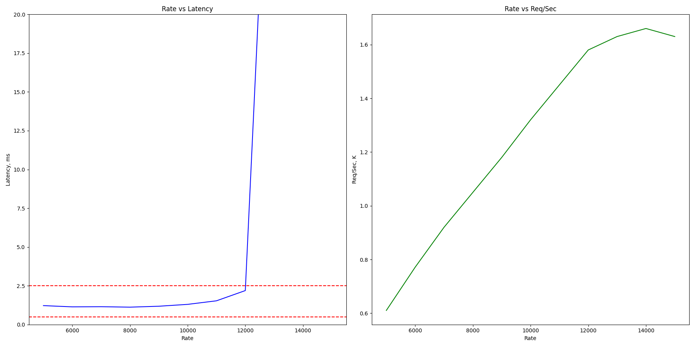
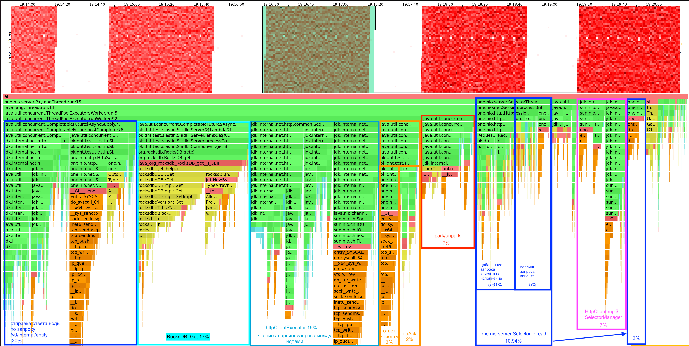
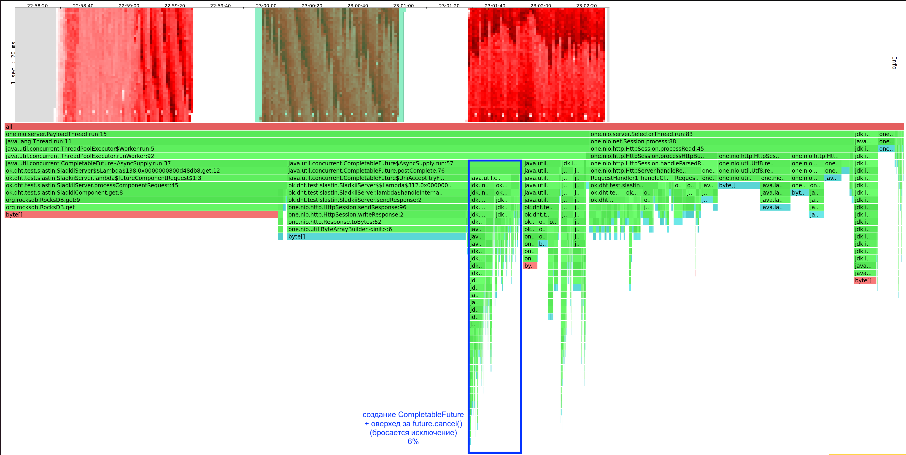
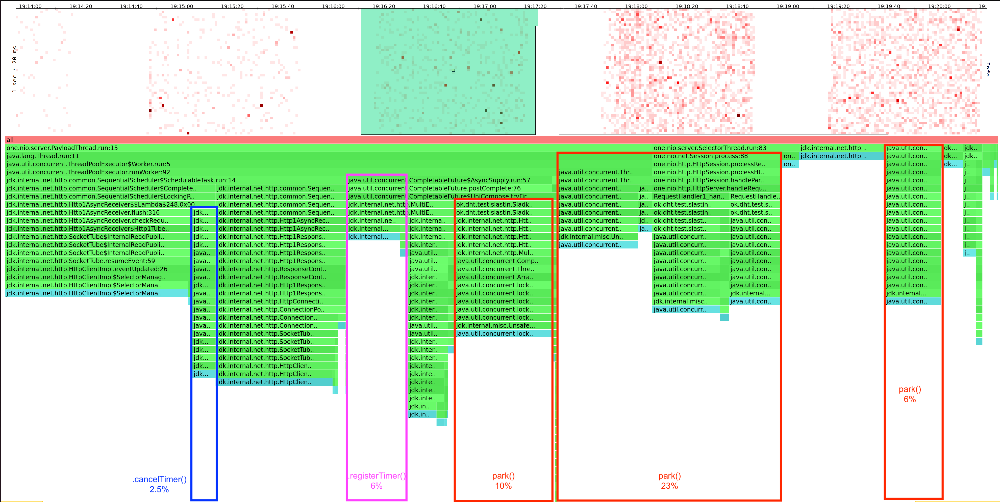
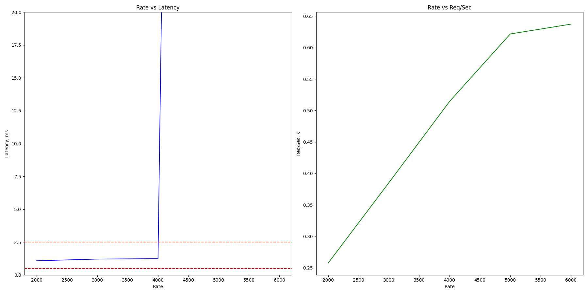
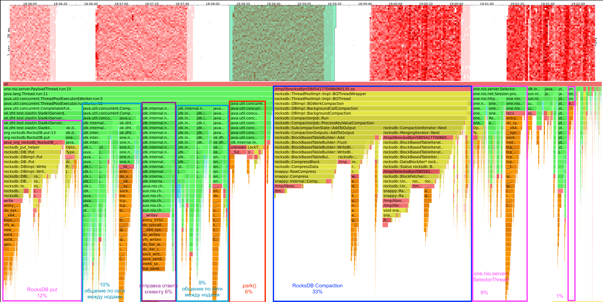
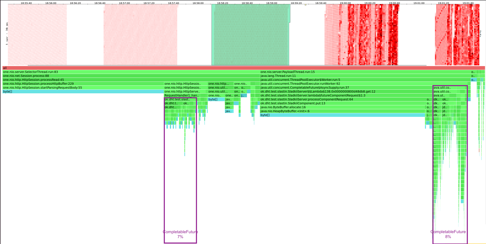
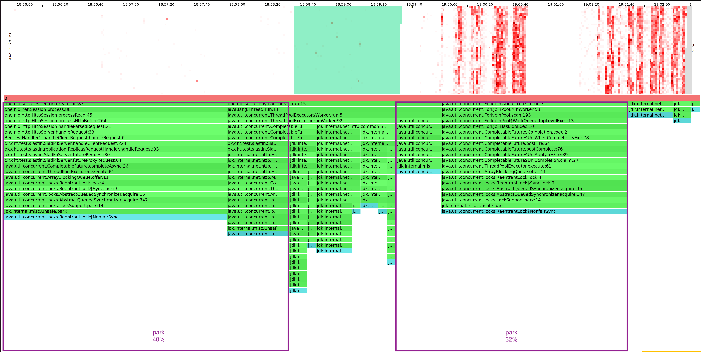

# Отчет 5 (Александр Сластин, ИТМО)

## Вступление

Аналогично [предыдущему отчету](../stage4/report.md).

## Сценарий

Аналогично предыдущему отчету.

## Структура отчета и детали реализации

- Найду точку разладки для PUT/GET запросах с `ack=2, from=3` на кластере состоящем из 3 нод
- PUT/GET запросы будут запускаться на полной БД (`8.2 Gb`), заполненной с помощью [Fill.java](../../Fill.java)
- Точку разладки буду искать с помощью самописного [profiler.py](../../profile/profiler.py). Для PUT запросов будет использоваться [put.lua](../../profile/lua/hw5/put.lua), а для GET запросов будет использоваться [get.lua](../../profile/lua/hw5/get.lua)

Далее в точке разладки поймем, удалось ли убрать лишние ожидания в рабочих потоках из-за синхронной версии, а также рассмотрим нагрузку на систему в целом на следующих профилях:
1. CPU
2. ALLOC
3. LOCK

Наконец, общий вывод.

## Анализ

### GET

#### Поиск точки разладки

`python3 profiler.py -t 8 -c 64 -d 1m -s lua/hw5/get.lua -u http://localhost:2022 -sn Launch`

Как видно, точка разладки достигается при `R=12000`. Рассмотрим распределение работы сервера в ней.

#### CPU

На фото отмечено, что именно занимает сколько-то нагрузки.

Характер нагрузки аналогичен предыдущему заданию за исключением того, что добавляется логика обработки `CompletableFuture`, которая сокращает `park/unpark` с `15%` до `7%`, что показывает выигрыш при переходе на асинхронщину. Также используется только созданные нами потоки, что гарантирует бОльшую надежность и способность контролировать выделение ресурсов.

#### ALLOC

Оверхед из-за создания `CompletableFuture` составляет `6%`, что приемлемо, учитывая выигрыш в производительности. 

#### LOCK

Ожидаем образом большая часть ожиданий уходит на `park()` (`40%`). Остальное: сеть, проставление/отмена таймеров, работа БД.

### PUT

#### Поиск точки разладки

`python3 profiler.py -t 8 -c 64 -d 1m -s lua/hw5/put.lua -u http://localhost:2022 -sn Launch`

Как видно, точка разладки достигается при `R=4000`. Рассмотрим распределение работы сервера в ней.

#### CPU

По профилю нагрузки все также помимо того, что `park` стал также как в случае `GET` равен `6-7%`, что лучше, чем было раньше. `merge` на профиле не выделяется, а значит происходит быстро.

#### ALLOC

Появляется лишние `15%` аллокаций на создание `CompletableFuture`. Все остальное остается таким же, и как по мне это приемлемое кол-во аллокаций ради увелечения производительности.

#### LOCK

Метод `park` является основным местом ожидания, остальное также как и в lock для GET.

## Общий вывод

- Переход на асинхронную версию позволил увеличить скорость запросов и сократить `park` до `7%` для GET/PUT.
- Создание `CompletableFuture` не бесплатное, но выигрыш в производительности стоит того.
- Реализация методов сложнее не стала, а также теперь появилась гибкость в выборе пула потоков под конкретную `CompletableFuture` в зависимости от сложности работы (`heavyExecutor` / `lightExecutor`).
