# Отчет по stage 1

В качестве Dao взял свою реализацию на String с прошлого семестра
Сервер имеет 2 ядра, 2 ГБ оперативной памяти и 30 ГБ NVMe, при этом без запуска сервиса и вообще при отсутствии нагрузки
занято оперативы 700 мб, то есть чуть меньше половины

put.lua

```
raw_path = "/v0/entity?id=k"
request = function()
    local r = math.random(1, 100_000_000)
    path = raw_path .. r
    wrk.body = "v" .. r
    return wrk.format("PUT", path)
end 
```

get.lua

```
raw_path = "/v0/entity?id=k"
request = function()
    local r = math.random(1, 60000000-1)
    path = raw_path .. r
    return wrk.format("GET", path)
end
```

---

### PUT, 10 000 RPS

```
 ./wrk -c 1 -t 1 -d 60s -R 10000 http://62.113.98.110:19235 -s put.lua -L
Running 1m test @ http://62.113.98.110:19235
  1 threads and 1 connections
  Thread calibration: mean lat.: 797.206ms, rate sampling interval: 2924ms
  Thread Stats   Avg      Stdev     99%   +/- Stdev
    Latency   824.13ms  474.06ms   1.63s    57.56%
    Req/Sec     1.26k    85.31     1.33k    88.24%
  Latency Distribution (HdrHistogram - Recorded Latency)
 50.000%  824.83ms
 75.000%    1.24s 
 90.000%    1.48s 
 99.000%    1.63s 
 99.900%    1.64s 
 99.990%    1.64s 
 99.999%    1.64s 
100.000%    1.64s 
---------------------------------------------------------
  76120 requests in 1.00m, 9.80MB read
Requests/sec:   1268.41
Transfer/sec:    167.16KB
```

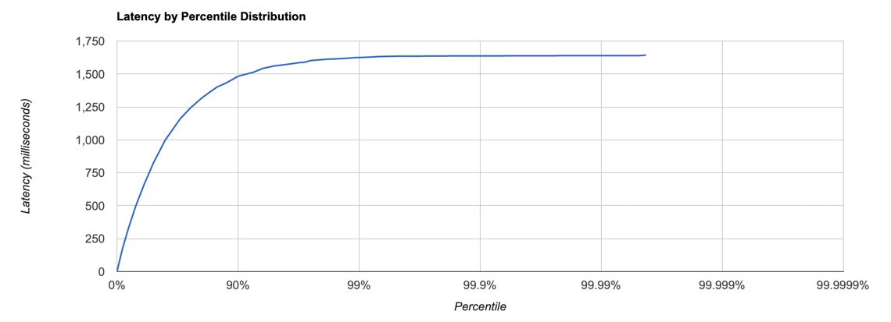

10 000 rps сервис не справляется, 90% запросов обрабатываются меньше, чем за 1.4 с

### PUT, 15 000 rps

```
./wrk -c 1 -t 1 -d 60s -R 15000 http://62.113.98.110:19235 -s put.lua -L
Running 1m test @ http://62.113.98.110:19235
  1 threads and 1 connections
  Thread calibration: mean lat.: 528.229ms, rate sampling interval: 1932ms
  Thread Stats   Avg      Stdev     99%   +/- Stdev
    Latency   534.86ms  312.08ms   1.06s    58.03%
    Req/Sec     1.28k    25.41     1.30k    68.00%
  Latency Distribution (HdrHistogram - Recorded Latency)
 50.000%  531.46ms
 75.000%  811.01ms
 90.000%  966.14ms
 99.000%    1.06s 
 99.900%    1.08s 
 99.990%    1.08s 
 99.999%    1.08s 
100.000%    1.08s 

----------------------------------------------------------
  74609 requests in 1.00m, 9.60MB read
Requests/sec:   1243.44
Transfer/sec:    163.87KB
```

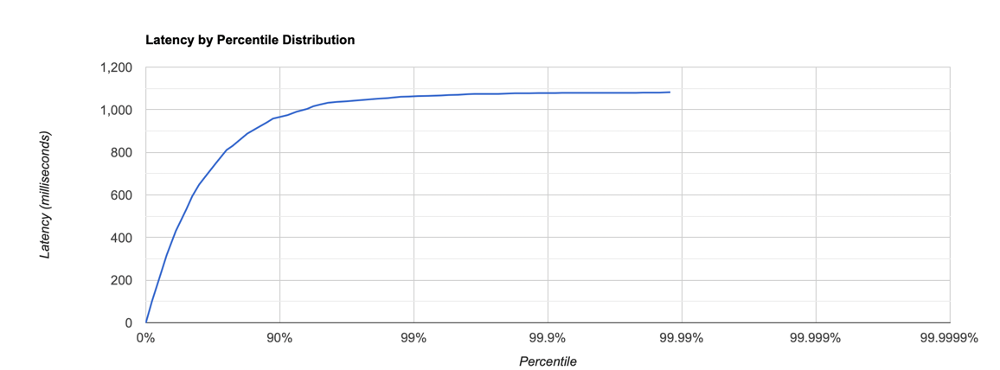

На 15к rps уже время немного лучше, и 90% запросов за 966 мс

### PUT, 100k RPS

```
 ./wrk -c 1 -t 1 -d 60s -R 100000 http://62.113.98.110:19235 -s put.lua -L
Running 1m test @ http://62.113.98.110:19235
  1 threads and 1 connections
  Thread calibration: mean lat.: 191.571ms, rate sampling interval: 680ms
  Thread Stats   Avg      Stdev     99%   +/- Stdev
    Latency   220.57ms  242.09ms   1.20s    86.83%
    Req/Sec   521.12    237.51     0.89k    69.86%
  Latency Distribution (HdrHistogram - Recorded Latency)
 50.000%  142.34ms
 75.000%  271.87ms
 90.000%  539.65ms
 99.000%    1.20s 
 99.900%    1.33s 
 99.990%    1.40s 
 99.999%    1.40s 
100.000%    1.40s 

  Detailed Percentile spectrum:

----------------------------------------------------------
  33785 requests in 1.00m, 4.35MB read
Requests/sec:    562.60
Transfer/sec:     74.14KB
```

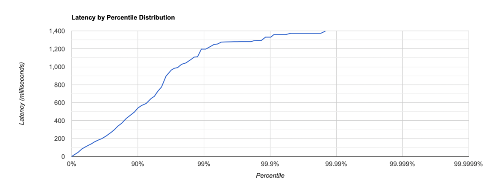

Интересно, что на 100к запросах в секунду сервер показывает результаты лучше, чем при меньшем числе rps  
Среднее время ожидания 220 мс, а 90% запросов обрабатываются меньше, чем за 539 мс  
Но это объясняется тем, что в этом эксперименте было всего 33785 запросов, а в предыдущих под 75к

---

Для профилирования get запросов была использована предварительно заполненная база на 1.8 ГБ, порядка 60 000 000 записей

### GET, 1000 RPS

```
./wrk -c 1 -t 1 -d 120s -R 1000 http://62.113.98.110:19235 -s get.lua -L
Running 2m test @ http://62.113.98.110:19235
1 threads and 1 connections
Thread calibration: mean lat.: 5261.474ms, rate sampling interval: 18120ms
Thread Stats   Avg      Stdev     99%   +/- Stdev
Latency     8.16s     4.95s   16.72s    56.67%
Req/Sec     9.50      0.50    10.00    100.00%
Latency Distribution (HdrHistogram - Recorded Latency)
50.000%    8.21s
75.000%   12.46s
90.000%   14.81s
99.000%   16.72s
99.900%   17.74s
99.990%   17.76s
99.999%   17.76s
100.000%   17.76s

Detailed Percentile spectrum:

----------------------------------------------------------
1205 requests in 2.00m, 160.48KB read
Socket errors: connect 0, read 0, write 0, timeout 1
Non-2xx or 3xx responses: 511
Requests/sec:     10.04
Transfer/sec:      1.34KB
```

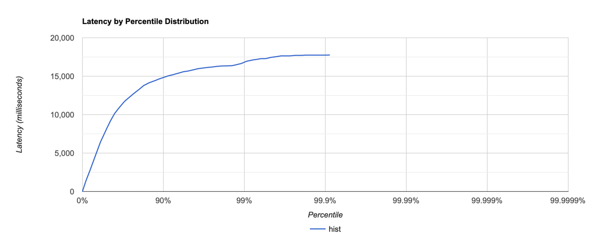

Сервис не справляется с нагрузкой на get по рандомному ключу, 90 перцентиле - 14с, а среднее время 8с

---

### GET, 10000 RPS

```
./wrk -c 1 -t 1 -d 120s -R 10000 http://62.113.98.110:19235 -s get.lua -L    
Running 2m test @ http://62.113.98.110:19235
1 threads and 1 connections
Thread calibration: mean lat.: 5206.313ms, rate sampling interval: 18268ms
Thread Stats   Avg      Stdev     99%   +/- Stdev
Latency     6.47s     4.37s   17.47s    65.54%
Req/Sec    10.00      0.58    11.00    100.00%
Latency Distribution (HdrHistogram - Recorded Latency)
50.000%    6.00s
75.000%    9.08s
90.000%   12.74s
99.000%   17.47s
99.900%   18.32s
99.990%   18.43s
99.999%   18.43s
100.000%   18.43s

Detailed Percentile spectrum:

----------------------------------------------------------
1218 requests in 2.00m, 162.22KB read
Socket errors: connect 0, read 0, write 0, timeout 35
Non-2xx or 3xx responses: 527
Requests/sec:     10.15
Transfer/sec:      1.35KB 
```

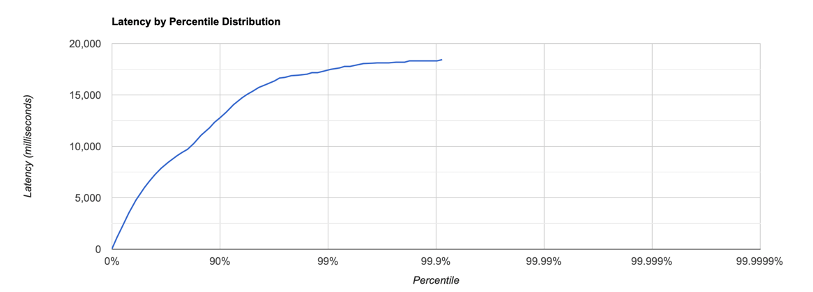

Цифры немного лучше, чем в прошлом случае, но всё равно в отчете wrk видно, что
итоговый rps был 10, как и в предыдущем случае

---

### Heatmap

[PUT cpu](./put_cpu.html)  
[PUT alloc](./put_alloc.html)  
[GET cpu](./get_cpu.html)  
[GET alloc](./get_alloc.html)

### Анализ PUT

Анализируя flame graph put-запросов, можно заметить, что большую часть времени занимают методы one-nio, а именно чтение
данных из сокета, а сама обработка запроса и сохранение данных в базе занимают примерно 21%, так как по сути это вставка
в мапу в
памяти. Также есть фоновые процессы флаша на диск. Еще на хитмапе есть периоды JIT компиляции и сборщика мусора G1,
из-за которых появляются запросы с задержкой больше средней в два раза
По аллокация видно, что довольно много памяти выделяется при кодировании кодирования и раскодирования строк в UTF-8, так
как сейчас метод обработки get-запроса принимает строковый id, и чтобы улучшить показатели, можно получать байты

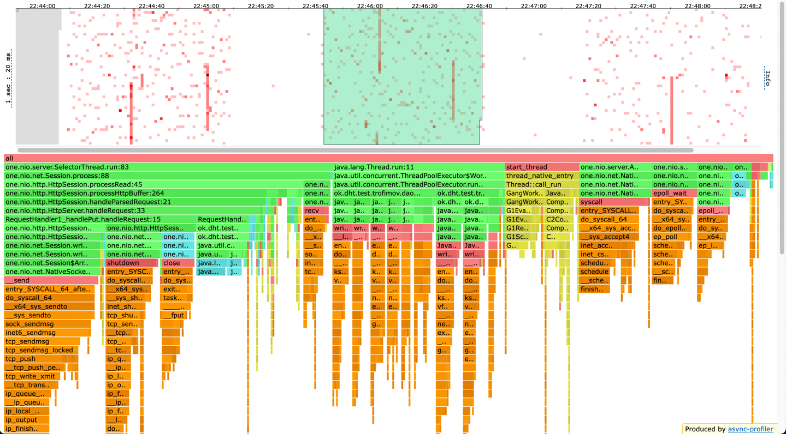

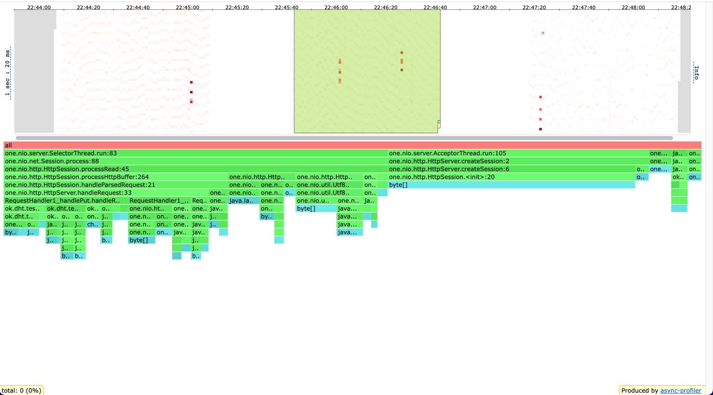

### Анализ GET

В get-запросах по cpu львиную долю времени занимает поиск в файлах, соответственно чтение long и UTF данных, и можно
улучшить, читая данные большими порциями, а уже потом разделяя их на компоненты
Вообще сейчас много времени тратится на перевод из байтов в строку и обратно, поэтому, реализация через массив байт или
ByteBuffer не имела таких проблем

По аллокациям опять-таки дао больше всего тратит память на создание String и byte[] при поиске записи в файлах
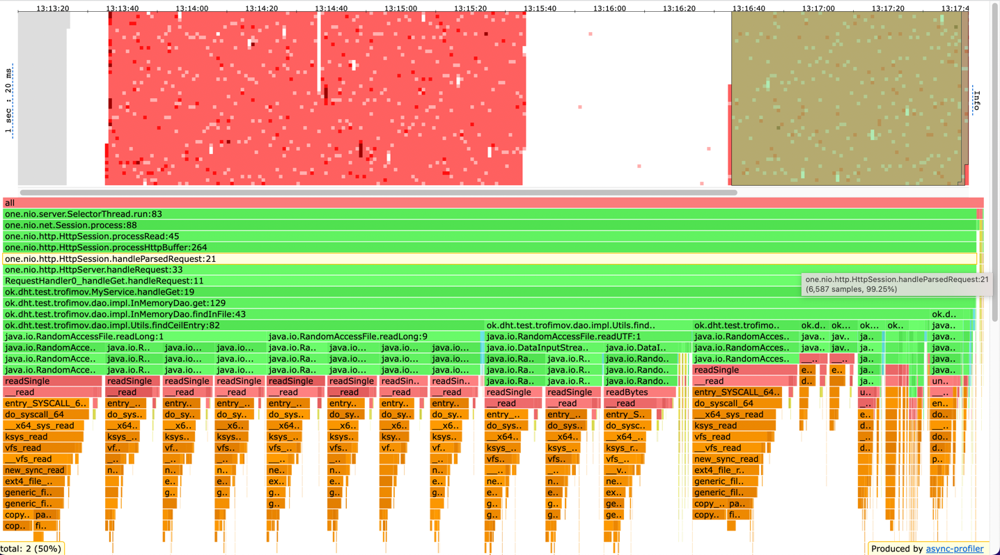

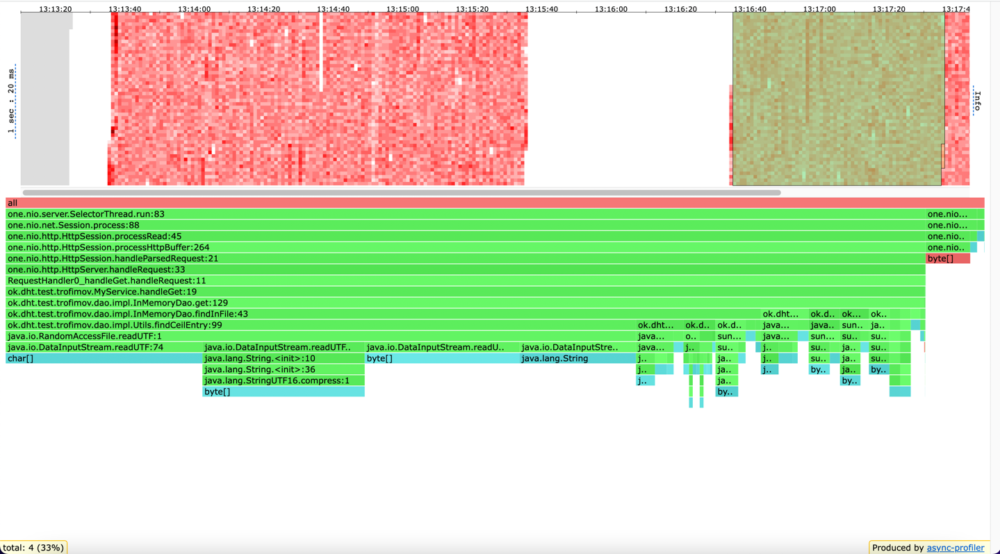


---

### UPDATE 05.10

Была реализована оптимизация с min/max ключами в хипе для каждого файла
Теперь не будет лишних походов на диск, если в файлике нет нужного ключа

```
# ./wrk -c 1 -t 1 -d 60s -R 500 http://62.113.98.110:19235 -s get.lua -L
Running 1m test @ http://62.113.98.110:19235
  1 threads and 1 connections
  Thread calibration: mean lat.: 524.822ms, rate sampling interval: 1881ms
  Thread Stats   Avg      Stdev     99%   +/- Stdev
    Latency     3.91s     1.63s    6.63s    57.82%
    Req/Sec   443.12      8.52   455.00     69.23%
  Latency Distribution (HdrHistogram - Recorded Latency)
 50.000%    3.98s
 75.000%    5.28s
 90.000%    6.14s
 99.000%    6.63s
 99.900%    6.70s
 99.990%    6.71s
 99.999%    6.72s
100.000%    6.72s

  Detailed Percentile spectrum:

----------------------------------------------------------
  26658 requests in 1.00m, 3.46MB read
Requests/sec:    444.28
Transfer/sec:     58.98KB
```

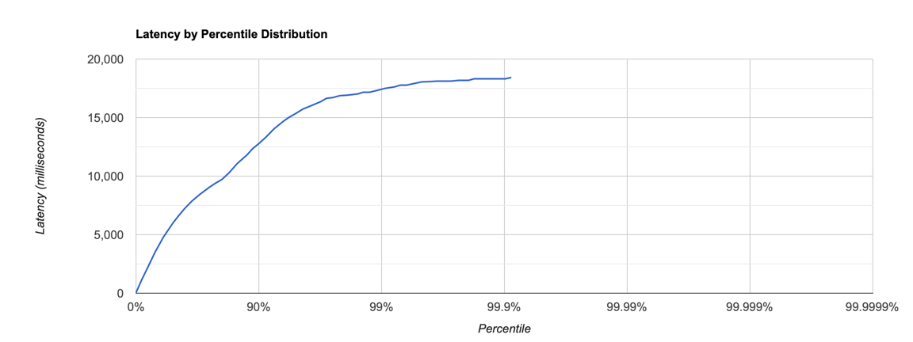

``` 
 ./wrk -c 1 -t 1 -d 120s -R 1000 http://62.113.98.110:19235 -s get.lua -L
Running 2m test @ http://62.113.98.110:19235
  1 threads and 1 connections
  Thread calibration: mean lat.: 2905.708ms, rate sampling interval: 10166ms
  Thread Stats   Avg      Stdev     99%   +/- Stdev
    Latency     8.42s     4.47s   16.20s    60.78%
    Req/Sec   483.40     10.77   502.00     80.00%
  Latency Distribution (HdrHistogram - Recorded Latency)
 50.000%    8.59s 
 75.000%   12.08s 
 90.000%   14.52s 
 99.000%   16.20s 
 99.900%   16.35s 
 99.990%   16.38s 
 99.999%   16.38s 
100.000%   16.38s 

  Detailed Percentile spectrum:

----------------------------------------------------------
  57855 requests in 2.00m, 7.50MB read
Requests/sec:    482.12
Transfer/sec:     64.00KB
```

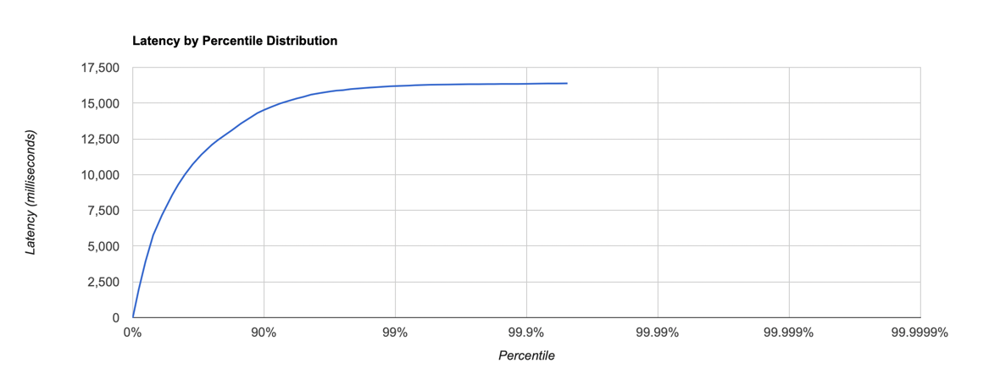

В общем-то каких-то значимых изменений не произошло, и, возможно, необходимо как-то избавляться от чтения файлов через
RandomAccessFile, так как он, например, читает long с помощью двух readInt, то есть уже два системных вызова,
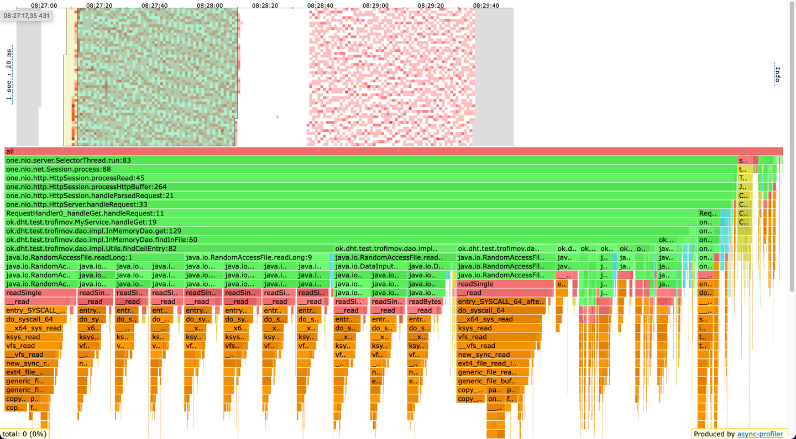