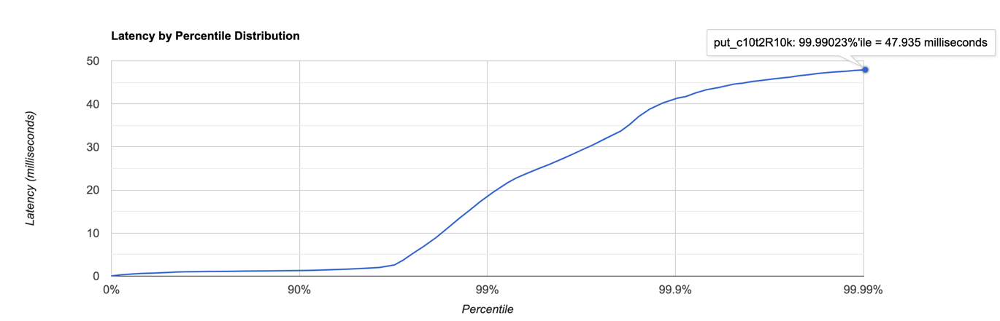

# Отчет по stage 1

В качестве Dao взял свою реализацию на String с прошлого семестра

---

### PUT, 10 000 RPS

```
../wrk2/wrk -c 10 -d 60s -t 2 -R 10000 http://localhost:19234/v0/entity -s put.lua  
Running 1m test @ http://localhost:19234/v0/entity
  2 threads and 10 connections
  Thread calibration: mean lat.: 1.161ms, rate sampling interval: 10ms
  Thread calibration: mean lat.: 1.144ms, rate sampling interval: 10ms
  Thread Stats   Avg      Stdev     Max   +/- Stdev
    Latency     1.01ms    2.21ms  34.78ms   98.02%
    Req/Sec     3.75k     1.00k   12.44k    81.41%
  448308 requests in 1.00m, 36.77MB read
  Socket errors: connect 0, read 0, write 0, timeout 68
Requests/sec:   7471.43
Transfer/sec:    627.48KB
```

10 000 rps сервис в целом хорошо справляется и 99.99% запросов обрабатываются меньше, чем за 47 миллисекунд


### PUT, 15 000 rps

```
../wrk2/wrk -c 10 -d 60s -t 1 -R 15000 http://localhost:19234/v0/entity -s put.lua
Running 1m test @ http://localhost:19234/v0/entity
  1 threads and 10 connections
  Thread calibration: mean lat.: 992.807ms, rate sampling interval: 3590ms
  Thread Stats   Avg      Stdev     Max   +/- Stdev
    Latency     2.53s     1.60s    4.53s    58.83%
    Req/Sec     8.65k     3.64k   12.05k    69.23%
  533377 requests in 1.00m, 43.75MB read
  Socket errors: connect 0, read 0, write 0, timeout 99
Requests/sec:   8889.61
Transfer/sec:    746.59KB
```

На 15к rps уже всё плохо, среднее время ожидания 2.53 секунды, при этом уже на 30 перцентиле у 70% запросов время ответа
больше 1.2 секунды

### PUT, 100k RPS

```
../wrk2/wrk -c 100 -d 60s -t 5 -R 100000 http://localhost:19234/v0/entity -s put.lua
Running 1m test @ http://localhost:19234/v0/entity
  5 threads and 100 connections
  Thread calibration: mean lat.: 4117.274ms, rate sampling interval: 15319ms
  Thread calibration: mean lat.: 3913.567ms, rate sampling interval: 14376ms
  Thread calibration: mean lat.: 4111.088ms, rate sampling interval: 15237ms
  Thread calibration: mean lat.: 4168.095ms, rate sampling interval: 15253ms
  Thread calibration: mean lat.: 3948.392ms, rate sampling interval: 15048ms
  Thread Stats   Avg      Stdev     Max   +/- Stdev
    Latency    29.83s    12.35s    0.86m    57.70%
    Req/Sec     2.87k    45.33     2.95k    60.00%
  865814 requests in 1.00m, 71.01MB read
Requests/sec:  14429.83
Transfer/sec:      1.18MB
```

На 100 000 всё плохо

---

Для профилирования get запросов была использована предварительно заполненная база на 1.8 ГБ, порядка 60 000 000 записей

### GET, 100 RPS, один ключ

```
../wrk2/wrk -c 1 -d 60s -t 1 -R 100 http://localhost:19234/v0/entity\?id\=k30000000
Running 1m test @ http://localhost:19234/v0/entity?id=k30000000
  1 threads and 1 connections
  Thread calibration: mean lat.: 9223372036854776.000ms, rate sampling interval: 10ms
  Thread Stats   Avg      Stdev     Max   +/- Stdev
    Latency    28.41s     9.19s   37.58s    50.00%
    Req/Sec     0.02      0.79    50.00     99.96%
  2 requests in 1.00m, 174.00B read
  Socket errors: connect 0, read 0, write 0, timeout 28
Requests/sec:      0.03
Transfer/sec:       2.89B
```

Получение по одному и тому же ключу при 100 запросах в среднем занимает 28 секунд

### GET, 100 RPS, разные ключи

```
../wrk2/wrk -c 1 -d 60s -t 1 -R 100 http://localhost:19234 -s get.lua                
Running 1m test @ http://localhost:19234
  1 threads and 1 connections
  Thread calibration: mean lat.: 9223372036854776.000ms, rate sampling interval: 10ms
  Thread Stats   Avg      Stdev     Max   +/- Stdev
    Latency    20.14s     7.18s   27.97s    33.33%
    Req/Sec     0.06      2.46   100.00     99.94%
  3 requests in 1.01m, 261.00B read
  Socket errors: connect 0, read 0, write 0, timeout 27
Requests/sec:      0.05
Transfer/sec:       4.32B
```

На случайных ключах среднее время ответа всё так же огромное

---

### Heatmap

[PUT cpu](./artyom-put-cpu.html)  
[PUT alloc](./artyom-put-alloc.html)  
[GET cpu](./artyom-get-cpu.html)  
[GET alloc](./artyom-get-alloc.html)

### Анализ PUT

Анализируя flame graph put-запросов, можно заметить, что большую часть времени занимают методы one-nio, а именно чтение
данных из сокета, а сама обработка запроса и сохранение данных в базе занимают 21%, так как по сути это вставка в мапу в
памяти.
По аллокациям тоже большая часть приходится на one-nio, на создание сессии.

### Анализ GET

В get-запросах по cpu львиную долю времени занимает поиск в файлах, соответственно чтение long и UTF данных.
По аллокациям опять-таки дао больше всего тратит память на создание String и byte[] при поиске записи в файлах

