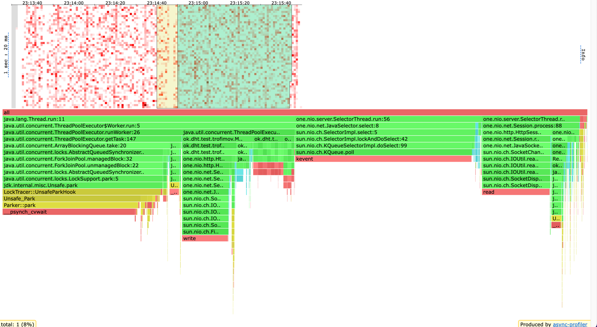

# Отчет по stage 2

Окружение: 8 гб ОЗУ, 8 ядер

В качестве ExecutorService был взять ThreadPool с количеством потоков равным кол-ву ядер, а для очереди запросов был
выбран ArrayBlockingQueue, который имеет размер 1024, и это значение было подобрано в ходе экспериментов и оказалось
наиболее эффективным. Также используется политика отбрасывания самых старых запросов при заполнении очереди запросов, и
это было выбрано потому, что старые запросы с большей вероятностью уже неактуальны, поэтому ими можно пожертвовать ради
обработки новых.

## GET

``` 
# ./wrk -c 64 -t 4 -d 60s -R 1000 http://host.docker.internal:19234 -s get.lua -L                
Running 1m test @ http://host.docker.internal:19234
  4 threads and 64 connections
  Thread calibration: mean lat.: 3.565ms, rate sampling interval: 12ms
  Thread calibration: mean lat.: 2.251ms, rate sampling interval: 10ms
  Thread calibration: mean lat.: 2.784ms, rate sampling interval: 10ms
  Thread calibration: mean lat.: 2.670ms, rate sampling interval: 10ms
  Thread Stats   Avg      Stdev     99%   +/- Stdev
    Latency     2.42ms    1.72ms   8.05ms   74.66%
    Req/Sec   272.32    362.84     1.20k    79.71%
  Latency Distribution (HdrHistogram - Recorded Latency)
 50.000%    2.02ms
 75.000%    3.21ms
 90.000%    4.70ms
 99.000%    8.05ms
 99.900%   12.95ms
 99.990%   16.33ms
 99.999%   17.14ms
100.000%   17.14ms

  Detailed Percentile spectrum:

----------------------------------------------------------
  59963 requests in 1.00m, 3.89MB read
Requests/sec:    999.54
Transfer/sec:     66.36KB
```


На 1к rps присутствуют выбросы в 17 мс, но средняя latency 2 мс, и ниже на хитмапе можно заметить периоды
JIT-компиляции, а также сборки мусора, из-за которых некоторые запросы могли обрабатываться медленнее


---

``` 
 ./wrk -c 64 -t 4 -d 60s -R 2000 http://host.docker.internal:19234 -s get.lua -L
Running 1m test @ http://host.docker.internal:19234
  4 threads and 64 connections
  Thread calibration: mean lat.: 0.919ms, rate sampling interval: 10ms
  Thread calibration: mean lat.: 0.691ms, rate sampling interval: 10ms
  Thread calibration: mean lat.: 0.579ms, rate sampling interval: 10ms
  Thread calibration: mean lat.: 1.432ms, rate sampling interval: 10ms
  Thread Stats   Avg      Stdev     99%   +/- Stdev
    Latency     0.97ms    2.16ms   3.66ms   98.67%
    Req/Sec   542.46    397.21     1.30k    55.25%
  Latency Distribution (HdrHistogram - Recorded Latency)
 50.000%  607.00us
 75.000%    1.12ms
 90.000%    1.60ms
 99.000%    3.66ms
 99.900%   35.20ms
 99.990%   54.53ms
 99.999%   55.30ms
100.000%   55.33ms

  Detailed Percentile spectrum:

----------------------------------------------------------
  119941 requests in 1.00m, 7.78MB read
Requests/sec:   1998.80
Transfer/sec:    132.70KB 
```


2k rps сервис выдерживает, при этом на диаграмме перцентилей заметно, что сервис резко увеличаивает время обработки,
начиная с 99 перцентиля, в отличие от предыдущей нагрузки, где плавно увеличивается

``` 
 ./wrk -c 64 -t 4 -d 60s -R 5000 http://host.docker.internal:19234 -s get.lua -L
Running 1m test @ http://host.docker.internal:19234
  4 threads and 64 connections
  Thread calibration: mean lat.: 3.589ms, rate sampling interval: 21ms
  Thread calibration: mean lat.: 3.787ms, rate sampling interval: 21ms
  Thread calibration: mean lat.: 3.872ms, rate sampling interval: 21ms
  Thread calibration: mean lat.: 3.473ms, rate sampling interval: 21ms
  Thread Stats   Avg      Stdev     99%   +/- Stdev
    Latency     1.44ms    0.92ms   4.49ms   73.38%
    Req/Sec     1.28k    89.46     1.50k    66.51%
  Latency Distribution (HdrHistogram - Recorded Latency)
 50.000%    1.27ms
 75.000%    1.86ms
 90.000%    2.64ms
 99.000%    4.49ms
 99.900%    6.50ms
 99.990%    8.93ms
 99.999%    9.89ms
100.000%    9.99ms

  Detailed Percentile spectrum:

----------------------------------------------------------
  299893 requests in 1.00m, 19.44MB read
Requests/sec:   4998.24
Transfer/sec:    331.82KB
```


## PUT

``` 
 ./wrk -c 64 -t 4 -d 60s -R 1000 http://host.docker.internal:19234 -s put.lua -L
Running 1m test @ http://host.docker.internal:19234
  4 threads and 64 connections
  Thread calibration: mean lat.: 0.435ms, rate sampling interval: 10ms
  Thread calibration: mean lat.: 0.407ms, rate sampling interval: 10ms
  Thread calibration: mean lat.: 0.376ms, rate sampling interval: 10ms
  Thread calibration: mean lat.: 0.424ms, rate sampling interval: 10ms
  Thread Stats   Avg      Stdev     99%   +/- Stdev
    Latency   327.63us  169.56us 803.00us   91.14%
    Req/Sec   274.41    386.25     1.22k    78.84%
  Latency Distribution (HdrHistogram - Recorded Latency)
 50.000%  294.00us
 75.000%  371.00us
 90.000%  471.00us
 99.000%  803.00us
 99.900%    2.36ms
 99.990%    5.34ms
 99.999%    6.09ms
100.000%    6.09ms

  Detailed Percentile spectrum:

----------------------------------------------------------
  59971 requests in 1.00m, 3.83MB read
Requests/sec:    998.91
Transfer/sec:     65.36KB
 ```


Метод put хорошо справляется с нагрузкой, но максимальное latency 6мс, и вероятно, это из-за GC


---

```  
./wrk -c 64 -t 4 -d 60s -R 10000 http://host.docker.internal:19234 -s put.lua -L
Running 1m test @ http://host.docker.internal:19234
  4 threads and 64 connections
  Thread calibration: mean lat.: 0.330ms, rate sampling interval: 10ms
  Thread calibration: mean lat.: 0.350ms, rate sampling interval: 10ms
  Thread calibration: mean lat.: 0.314ms, rate sampling interval: 10ms
  Thread calibration: mean lat.: 0.319ms, rate sampling interval: 10ms
  Thread Stats   Avg      Stdev     99%   +/- Stdev
    Latency   310.97us  137.20us 810.00us   86.96%
    Req/Sec   541.78    401.67     1.33k    61.39%
  Latency Distribution (HdrHistogram - Recorded Latency)
 50.000%  283.00us
 75.000%  354.00us
 90.000%  446.00us
 99.000%  810.00us
 99.900%    1.06ms
 99.990%    4.01ms
 99.999%    5.50ms
100.000%    5.96ms

  Detailed Percentile spectrum:

----------------------------------------------------------
  119943 requests in 1.00m, 7.66MB read
Requests/sec:   1998.82
Transfer/sec:    130.78KB
```


---

```  
./wrk -c 64 -t 4 -d 60s -R 10000 http://host.docker.internal:19234 -s put.lua -L
Running 1m test @ http://host.docker.internal:19234
  4 threads and 64 connections
  Thread calibration: mean lat.: 0.455ms, rate sampling interval: 10ms
  Thread calibration: mean lat.: 0.450ms, rate sampling interval: 10ms
  Thread calibration: mean lat.: 0.444ms, rate sampling interval: 10ms
  Thread calibration: mean lat.: 0.461ms, rate sampling interval: 10ms
  Thread Stats   Avg      Stdev     99%   +/- Stdev
    Latency   686.89us    3.64ms   1.70ms   99.42%
    Req/Sec     2.64k   291.22     3.22k    76.07%
  Latency Distribution (HdrHistogram - Recorded Latency)
 50.000%  392.00us
 75.000%  539.00us
 90.000%  758.00us
 99.000%    1.70ms
 99.900%   61.76ms
 99.990%   71.74ms
 99.999%  237.31ms
100.000%  268.54ms

  Detailed Percentile spectrum:
 
----------------------------------------------------------
  599819 requests in 1.00m, 38.33MB read
Requests/sec:   9997.15
Transfer/sec:    654.11KB
```


---

## Heatmap

### PUT cpu



### PUT alloc


### PUT lock


Можем заметить локи при постановки запроса в executorService метод execute, а также локи при методе take для обработки
запроса
При этом лок при постановке занимает 44%, а когда забираем задачу, то где-то 10-20%. Также на хитмапе cpu видно, что
ArrayBlockingQueue.take довольно долгий и занимает 21%, и собственно это из-за того, что поток находится в ожидании(за
это отвечает метод Unsafe.park) либо новой задачи(т.е очередь пуста), либо ситуация high contention. Поэтому я пробовал
менять кол-во потоков executor'а, использовать другую очередь
LinkedBlockingQueue, так как там разделены локи для put и take (и будет соответственно будет большая производительность)
. В итоге картина не менялась, и, вероятно, что поток как раз ожидает задачу, так как очередь пуста, и значит, в целом
ничего плохого нет в этих ожиданиях, притом что latency хорошее

### GET cpu


На этой хитмапе также заметен метод take у ArrayBlockingQueue при постановке в очередь запроса

### GET alloc


### GET lock


### Вывод

В итоге удалось увеличить количество принятых запросов засчет их обработки в отдельном потоке, при этом появились
накладные расходы на локи при постановке и выборке запроса из очереди