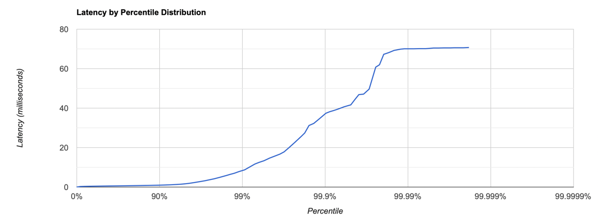
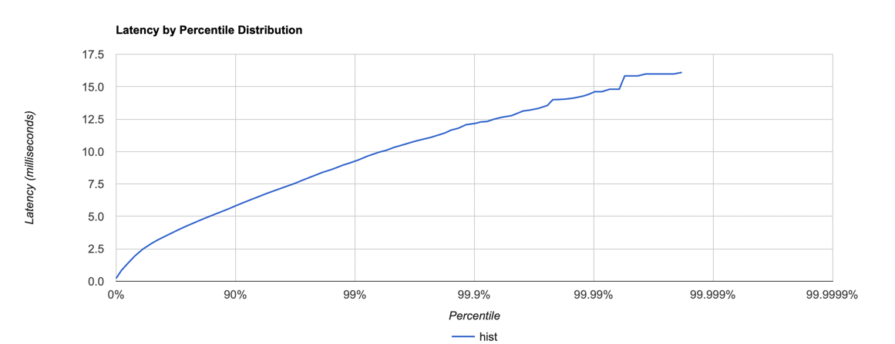

``` 
./wrk -c 64 -t 4 -d 60s -R 1000 http://host.docker.internal:19234 -s put.lua -L
Running 1m test @ http://host.docker.internal:19234
4 threads and 64 connections
Thread calibration: mean lat.: 0.798ms, rate sampling interval: 10ms
Thread calibration: mean lat.: 0.691ms, rate sampling interval: 10ms
Thread calibration: mean lat.: 0.663ms, rate sampling interval: 10ms
Thread calibration: mean lat.: 0.674ms, rate sampling interval: 10ms
Thread Stats   Avg      Stdev     99%   +/- Stdev
Latency   619.14us  691.76us   2.79ms   96.66%
Req/Sec   274.24    396.07     1.33k    81.41%
Latency Distribution (HdrHistogram - Recorded Latency)
50.000%  504.00us
75.000%  663.00us
90.000%    0.89ms
99.000%    2.79ms
99.900%   10.05ms
99.990%   15.93ms
99.999%   22.32ms
100.000%   22.32ms

----------------------------------------------------------
59938 requests in 1.00m, 3.83MB read
Requests/sec:    999.12
Transfer/sec:     65.37KB
```


---

```
./wrk -c 64 -t 4 -d 60s -R 2000 http://host.docker.internal:19234 -s put.lua -L
Running 1m test @ http://host.docker.internal:19234
4 threads and 64 connections
Thread calibration: mean lat.: 0.585ms, rate sampling interval: 10ms
Thread calibration: mean lat.: 0.551ms, rate sampling interval: 10ms
Thread calibration: mean lat.: 0.560ms, rate sampling interval: 10ms
Thread calibration: mean lat.: 0.560ms, rate sampling interval: 10ms
Thread Stats   Avg      Stdev     99%   +/- Stdev
Latency   829.70us    2.31ms   8.29ms   97.13%
Req/Sec   544.63    402.42     1.33k    46.65%
Latency Distribution (HdrHistogram - Recorded Latency)
50.000%  491.00us
75.000%  664.00us
90.000%    0.96ms
99.000%    8.29ms
99.900%   37.31ms
99.990%   70.08ms
99.999%   70.72ms
100.000%   70.72ms
----------------------------------------------------------
119940 requests in 1.00m, 7.66MB read
Requests/sec:   1998.82
Transfer/sec:    130.78KB
```


---

```
./wrk -c 64 -t 4 -d 60s -R 5000 http://host.docker.internal:19234 -s put.lua -L
Running 1m test @ http://host.docker.internal:19234
4 threads and 64 connections
Thread calibration: mean lat.: 0.777ms, rate sampling interval: 10ms
Thread calibration: mean lat.: 0.759ms, rate sampling interval: 10ms
Thread calibration: mean lat.: 0.784ms, rate sampling interval: 10ms
Thread calibration: mean lat.: 0.827ms, rate sampling interval: 10ms
Thread Stats   Avg      Stdev     99%   +/- Stdev
Latency     2.16ms   10.39ms  65.38ms   97.49%
Req/Sec     1.32k   372.89     1.82k    86.47%
Latency Distribution (HdrHistogram - Recorded Latency)
50.000%  567.00us
75.000%  792.00us
90.000%    1.14ms
99.000%   65.38ms
99.900%  111.55ms
99.990%  134.01ms
99.999%  157.69ms
100.000%  157.69ms
---------------------------------------------------------
298625 requests in 1.00m, 19.08MB read
Requests/sec:   4977.47
Transfer/sec:    325.67KB
```


---

```
./wrk -c 64 -t 4 -d 60s -R 10000 http://host.docker.internal:19234 -s put.lua -L
Running 1m test @ http://host.docker.internal:19234
4 threads and 64 connections
Thread calibration: mean lat.: 9.341ms, rate sampling interval: 41ms
Thread calibration: mean lat.: 9.328ms, rate sampling interval: 42ms
Thread calibration: mean lat.: 9.254ms, rate sampling interval: 41ms
Thread calibration: mean lat.: 9.428ms, rate sampling interval: 43ms
Thread Stats   Avg      Stdev     99%   +/- Stdev
Latency    59.80ms  134.53ms 596.99ms   88.10%
Req/Sec     2.51k     1.14k    4.82k    88.63%
Latency Distribution (HdrHistogram - Recorded Latency)
50.000%    1.39ms
75.000%   20.00ms
90.000%  218.75ms
99.000%  596.99ms
99.900%  809.47ms
99.990%  929.28ms
99.999%    1.05s
100.000%    1.08s
----------------------------------------------------------
593488 requests in 1.00m, 37.92MB read
Requests/sec:   9892.76
Transfer/sec:    647.28KB
```


---

```
./wrk -c 64 -t 4 -d 60s -R 12500 http://host.docker.internal:19234 -s put.lua -L
Running 1m test @ http://host.docker.internal:19234
4 threads and 64 connections
Thread calibration: mean lat.: 185.008ms, rate sampling interval: 924ms
Thread calibration: mean lat.: 202.544ms, rate sampling interval: 973ms
Thread calibration: mean lat.: 232.496ms, rate sampling interval: 994ms
Thread calibration: mean lat.: 230.167ms, rate sampling interval: 988ms
Thread Stats   Avg      Stdev     99%   +/- Stdev
Latency    70.03ms  251.92ms 370.94ms   95.33%
Req/Sec     2.84k   161.78     3.27k    79.02%
Latency Distribution (HdrHistogram - Recorded Latency)
50.000%   10.13ms
75.000%   79.42ms
90.000%  252.93ms
99.000%  370.94ms
99.900%  439.04ms
99.990%   11.03s
99.999%   21.69s
100.000%   41.39s

----------------------------------------------------------
686838 requests in 1.00m, 43.89MB read
Socket errors: connect 0, read 0, write 1, timeout 46
Requests/sec:  11447.64
Transfer/sec:    749.02KB
```


---

```
./wrk -c 64 -t 4 -d 60s -R 1000 http://host.docker.internal:19234 -s get.lua -L
Running 1m test @ http://host.docker.internal:19234
4 threads and 64 connections
Thread calibration: mean lat.: 5.147ms, rate sampling interval: 16ms
Thread calibration: mean lat.: 3.208ms, rate sampling interval: 11ms
Thread calibration: mean lat.: 3.377ms, rate sampling interval: 11ms
Thread calibration: mean lat.: 3.257ms, rate sampling interval: 11ms
Thread Stats   Avg      Stdev     99%   +/- Stdev
Latency     3.20ms    1.98ms   9.25ms   68.13%
Req/Sec   269.75    359.73     1.20k    78.05%
Latency Distribution (HdrHistogram - Recorded Latency)
50.000%    2.94ms
75.000%    4.31ms
90.000%    5.82ms
99.000%    9.25ms
99.900%   12.16ms
99.990%   14.41ms
99.999%   16.09ms
100.000%   16.09ms
----------------------------------------------------------
59965 requests in 1.00m, 3.91MB read
Requests/sec:    998.79
Transfer/sec:     66.75KB
```



---

```
./wrk -c 64 -t 4 -d 60s -R 2000 http://host.docker.internal:19234 -s get.lua -L
Running 1m test @ http://host.docker.internal:19234
4 threads and 64 connections
Thread calibration: mean lat.: 2.736ms, rate sampling interval: 10ms
Thread calibration: mean lat.: 1.064ms, rate sampling interval: 10ms
Thread calibration: mean lat.: 1.092ms, rate sampling interval: 10ms
Thread calibration: mean lat.: 0.852ms, rate sampling interval: 10ms
Thread Stats   Avg      Stdev     99%   +/- Stdev
Latency     1.25ms    0.92ms   4.42ms   83.76%
Req/Sec   535.96    380.10     1.22k    58.66%
Latency Distribution (HdrHistogram - Recorded Latency)
50.000%    0.89ms
75.000%    1.68ms
90.000%    2.54ms
99.000%    4.42ms
99.900%    6.34ms
99.990%    7.84ms
99.999%    8.73ms
100.000%    8.97ms
----------------------------------------------------------
119940 requests in 1.00m, 7.83MB read
Requests/sec:   1998.58
Transfer/sec:    133.58KB
```


---

```
./wrk -c 64 -t 4 -d 60s -R 5000 http://host.docker.internal:19234 -s get.lua -L
Running 1m test @ http://host.docker.internal:19234
4 threads and 64 connections
Thread calibration: mean lat.: 1439.308ms, rate sampling interval: 4706ms
Thread calibration: mean lat.: 1438.278ms, rate sampling interval: 4702ms
Thread calibration: mean lat.: 1439.039ms, rate sampling interval: 4706ms
Thread calibration: mean lat.: 1438.153ms, rate sampling interval: 4706ms
Thread Stats   Avg      Stdev     99%   +/- Stdev
Latency     2.92s   209.21ms   3.28s    58.84%
Req/Sec    76.62    229.88   767.00     90.00%
Latency Distribution (HdrHistogram - Recorded Latency)
50.000%    2.91s
75.000%    3.09s
90.000%    3.22s
99.000%    3.28s
99.900%    3.29s
99.990%    3.29s
99.999%    3.29s
100.000%    3.29s

----------------------------------------------------------
51718 requests in 1.00m, 3.38MB read
Requests/sec:    861.59
Transfer/sec:     57.58KB
```

