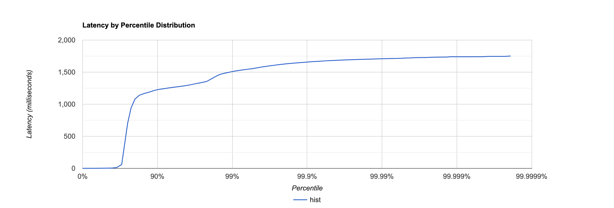
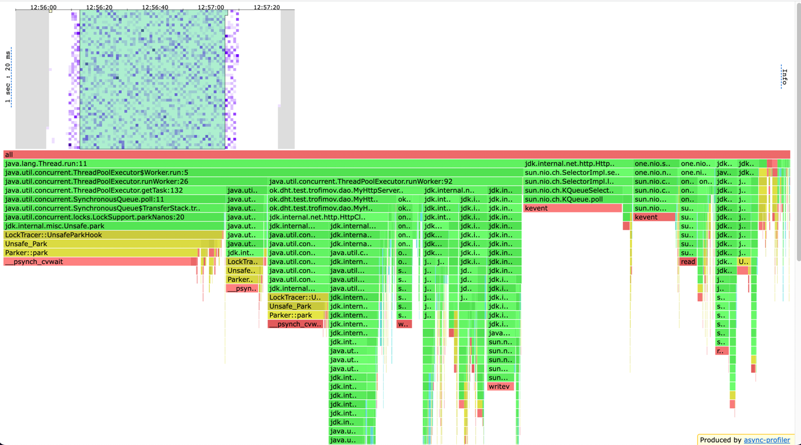
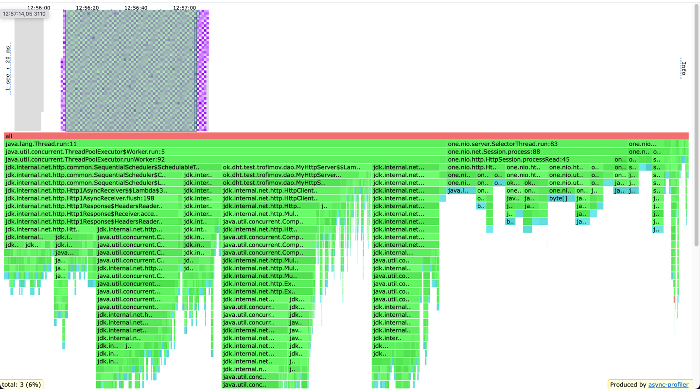
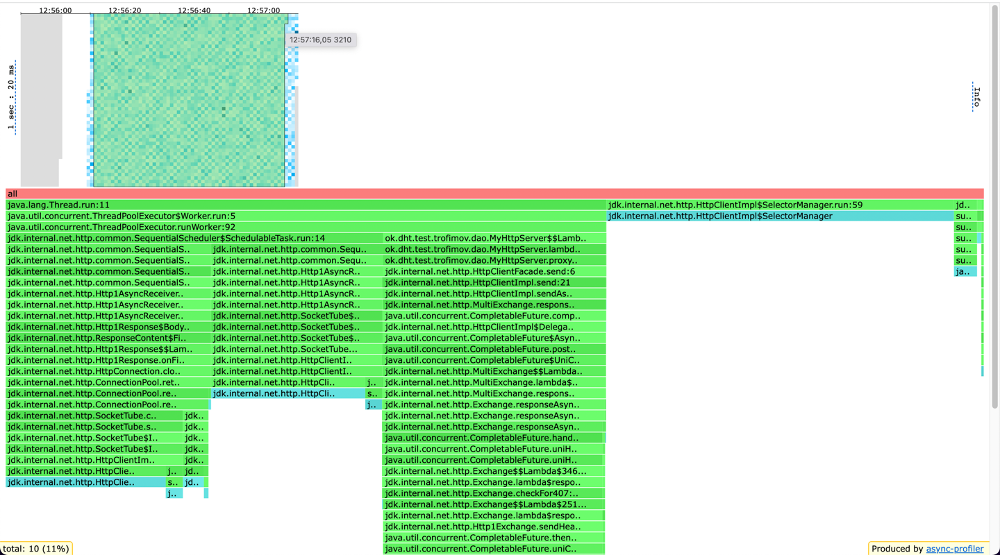
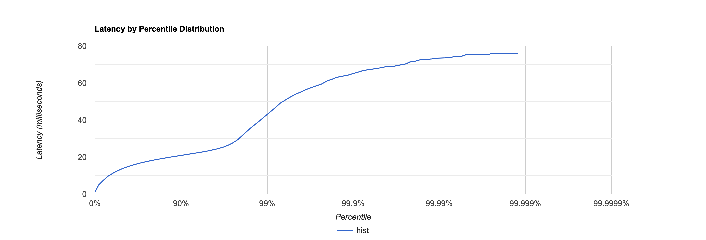
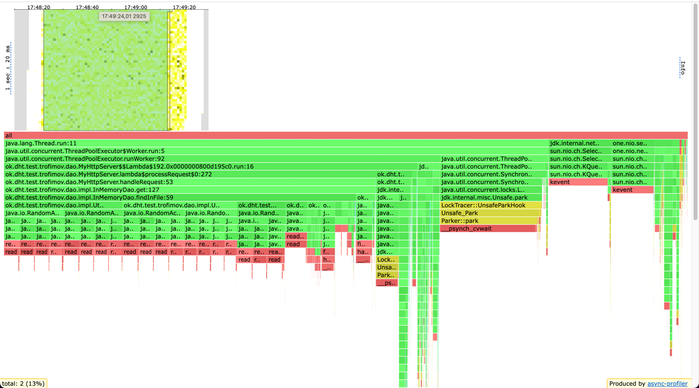
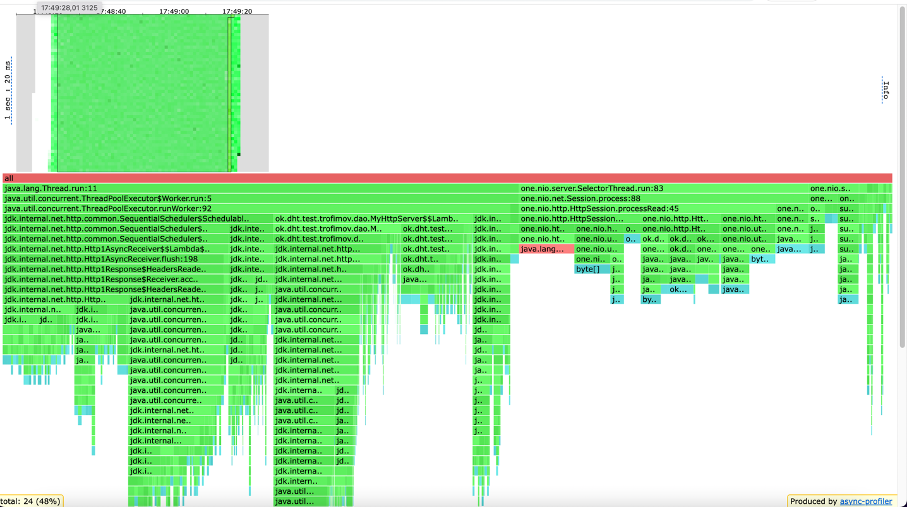
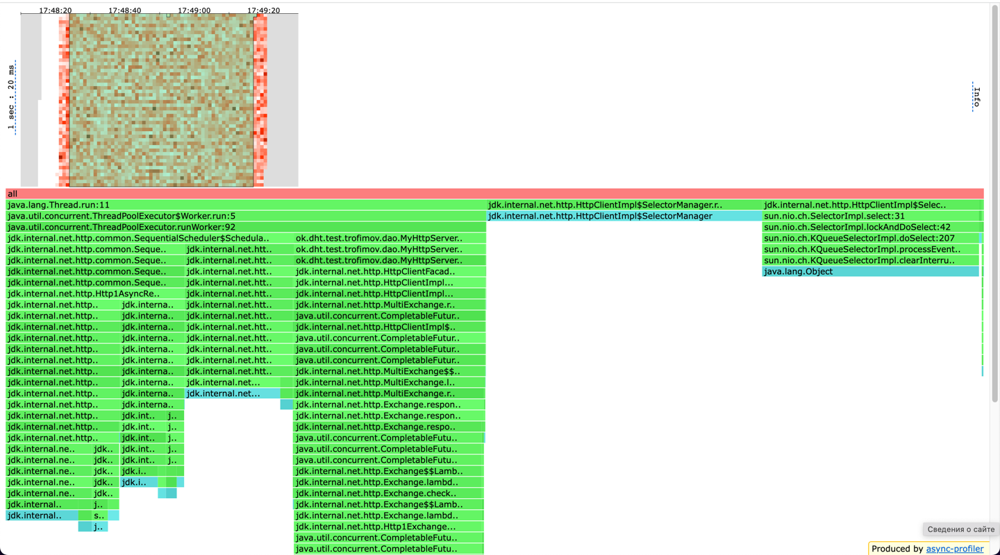

# Отчет по stage 4

## PUT, 10k rps

```
 ./wrk -c 64 -t 4 -d 60s -R 10000 http://host.docker.internal:19234 -s put.lua -L
Running 1m test @ http://host.docker.internal:19234
  4 threads and 64 connections
  Thread calibration: mean lat.: 33.981ms, rate sampling interval: 257ms
  Thread calibration: mean lat.: 33.482ms, rate sampling interval: 254ms
  Thread calibration: mean lat.: 33.760ms, rate sampling interval: 256ms
  Thread calibration: mean lat.: 33.921ms, rate sampling interval: 257ms
  Thread Stats   Avg      Stdev     99%   +/- Stdev
    Latency   313.37ms  513.44ms   1.51s    75.90%
    Req/Sec     2.44k     0.94k    3.98k    91.88%
  Latency Distribution (HdrHistogram - Recorded Latency)
 50.000%    2.33ms
 75.000%  702.46ms
 90.000%    1.23s 
 99.000%    1.51s 
 99.900%    1.66s 
 99.990%    1.71s 
 99.999%    1.74s 
100.000%    1.75s 

----------------------------------------------------------
  588160 requests in 1.00m, 37.58MB read
Requests/sec:   9803.30
Transfer/sec:    641.43KB
```



По сравнению с предыдущим этапом средняя латенси ухудшилась в 3 раза, и это ожидаемо, так как мы теперь не просто
проксируем запрос, а рассылаем по нескольким нодам и ждем ответа от них





Довольно много занимает park при взятии задачи из очереди запросов (27%), также работа HttpClient занимает 32%
По аллокация httpClient и one-nio много выделяют память
По локам HttpClient в основном на всем flamegraph делает синхронизации на SelectorManager

---

## GET, 1.6k rps

```
# ./wrk -c 64 -t 4 -d 60s -R 1600 http://host.docker.internal:19234 -s get.lua -L
Running 1m test @ http://host.docker.internal:19234
  4 threads and 64 connections
  Thread calibration: mean lat.: 112.854ms, rate sampling interval: 604ms
  Thread calibration: mean lat.: 112.913ms, rate sampling interval: 605ms
  Thread calibration: mean lat.: 114.087ms, rate sampling interval: 606ms
  Thread calibration: mean lat.: 111.803ms, rate sampling interval: 596ms
  Thread Stats   Avg      Stdev     99%   +/- Stdev
    Latency    13.68ms    7.46ms  43.13ms   75.53%
    Req/Sec   399.90      3.85   412.00     89.67%
  Latency Distribution (HdrHistogram - Recorded Latency)
 50.000%   13.47ms
 75.000%   17.63ms
 90.000%   20.91ms
 99.000%   43.13ms
 99.900%   65.09ms
 99.990%   73.47ms
 99.999%   76.09ms
100.000%   76.22ms
----------------------------------------------------------
  95911 requests in 1.00m, 6.38MB read
Requests/sec:   1598.59
Transfer/sec:    108.96KB 
```


средняя латенси гет запросов тоже ухудшилась, ведь нам нужно собирать кворум





Процесс поиска ключа и чтение файлов занимает 17% cpu

# Вывод

Ухудшение пропускной способности сервиса было ожидаемо, однако теперь сервис стал более надежным

