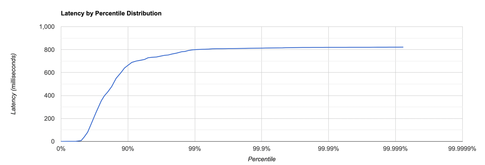
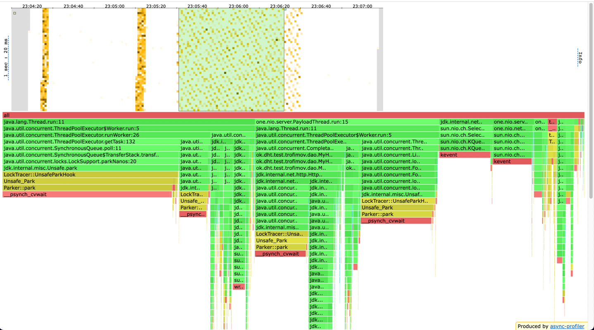
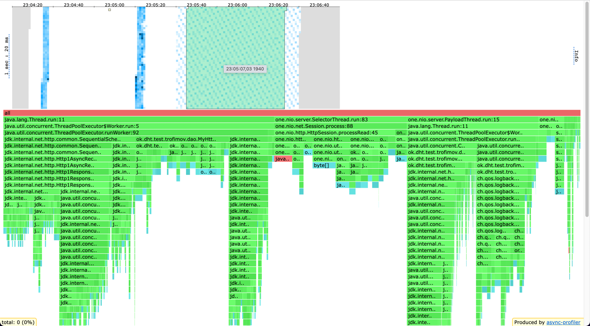
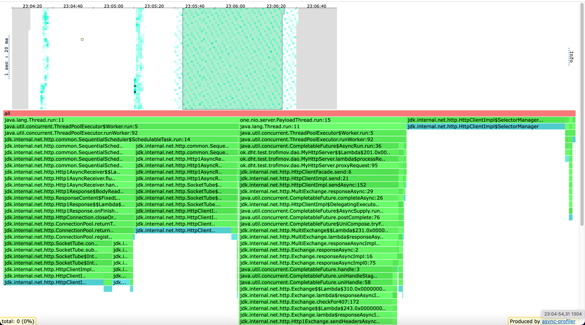
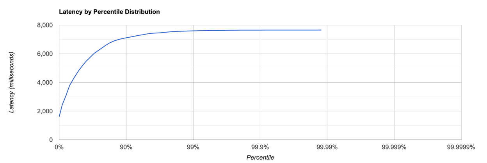
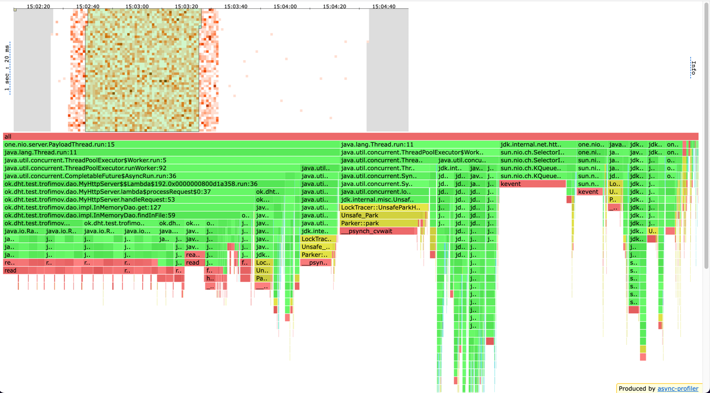
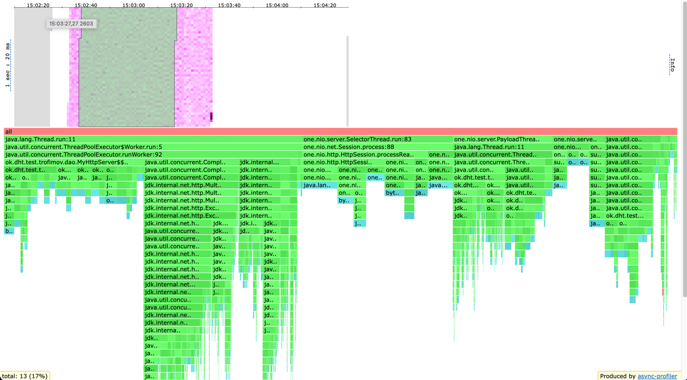
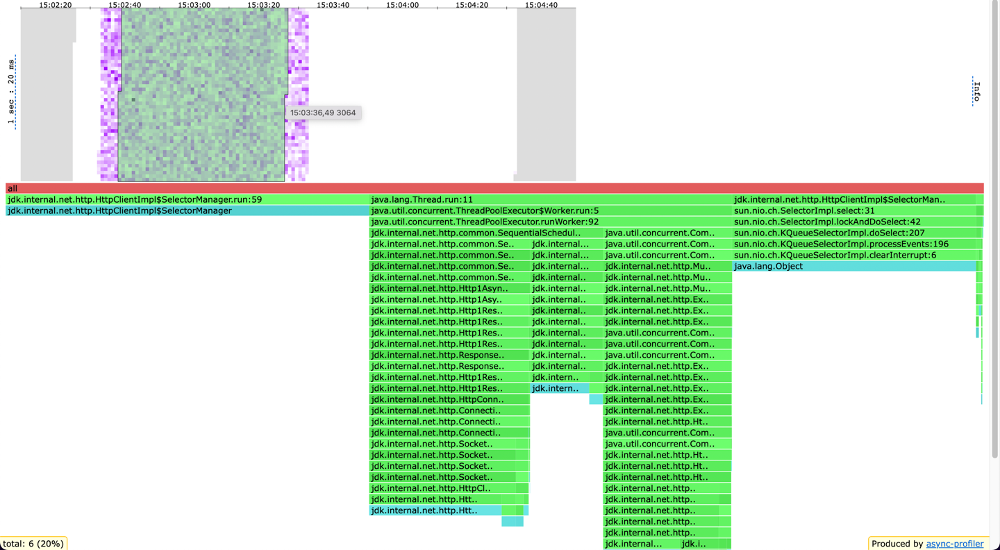

# Отчет по stage 5

## PUT, 4.5k rps

```
./wrk -c 64 -t 4 -d 60s -R 4500 http://host.docker.internal:19234 -s put.lua -L
Running 1m test @ http://host.docker.internal:19234
  4 threads and 64 connections
  Thread calibration: mean lat.: 30.344ms, rate sampling interval: 221ms
  Thread calibration: mean lat.: 30.352ms, rate sampling interval: 221ms
  Thread calibration: mean lat.: 30.664ms, rate sampling interval: 223ms
  Thread calibration: mean lat.: 30.444ms, rate sampling interval: 221ms
  Thread Stats   Avg      Stdev     99%   +/- Stdev
    Latency   183.56ms  256.55ms 799.74ms   80.21%
    Req/Sec     1.12k   161.19     1.59k    74.86%
  Latency Distribution (HdrHistogram - Recorded Latency)
 50.000%    7.26ms
 75.000%  354.30ms
 90.000%  663.04ms
 99.000%  799.74ms
 99.900%  813.05ms
 99.990%  819.71ms
 99.999%  821.25ms
100.000%  821.76ms
----------------------------------------------------------
  267785 requests in 1.00m, 17.11MB read
Requests/sec:   4463.22
Transfer/sec:    292.03KB
```



В сравнении с предыдущим этапом ухудшилась производительность: было 10k rps, стало 4500rps





Довольно много занимает park при взятии задачи из очереди запросов (29%) и вообще видно, что много park

По аллокация httpClient и one-nio много выделяют память

По локам HttpClient в основном на всем flamegraph делает синхронизации на SelectorManager

---

## GET, 1.6k rps

```
# ./wrk -c 64 -t 4 -d 60s -R 1600 http://host.docker.internal:19234 -s get.lua -L
Running 1m test @ http://host.docker.internal:19234
  4 threads and 64 connections
  Thread calibration: mean lat.: 952.661ms, rate sampling interval: 2961ms
  Thread calibration: mean lat.: 952.702ms, rate sampling interval: 2959ms
  Thread calibration: mean lat.: 953.743ms, rate sampling interval: 2961ms
  Thread calibration: mean lat.: 957.522ms, rate sampling interval: 2971ms
  Thread Stats   Avg      Stdev     99%   +/- Stdev
    Latency     4.82s     1.71s    7.60s    57.27%
    Req/Sec   351.03      7.67   363.00     67.19%
  Latency Distribution (HdrHistogram - Recorded Latency)
 50.000%    4.89s 
 75.000%    6.29s 
 90.000%    7.11s 
 99.000%    7.60s 
 99.900%    7.65s 
 99.990%    7.66s 
 99.999%    7.66s 
100.000%    7.66s 

----------------------------------------------------------
  83718 requests in 1.00m, 5.57MB read
  Non-2xx or 3xx responses: 776
Requests/sec:   1395.23
Transfer/sec:     95.06KB
```


средняя латенси гет запросов тоже ухудшилась, и вообще сервис показал меньшую производительность на 300 rps





# Вывод

Производительность сервиса ухудшилась, и латенси довольно резко увеличивается как на гетах, так и на путах

