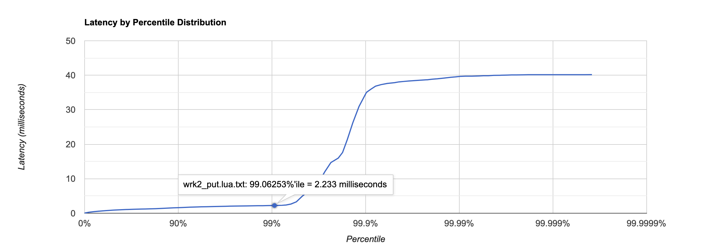
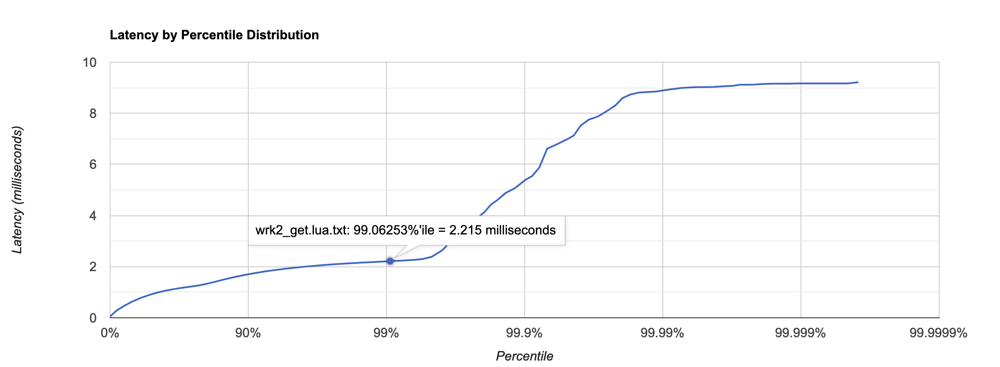
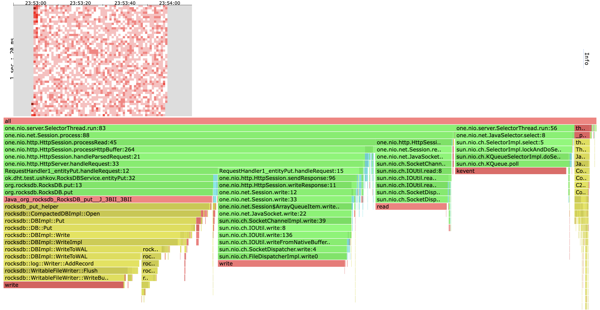
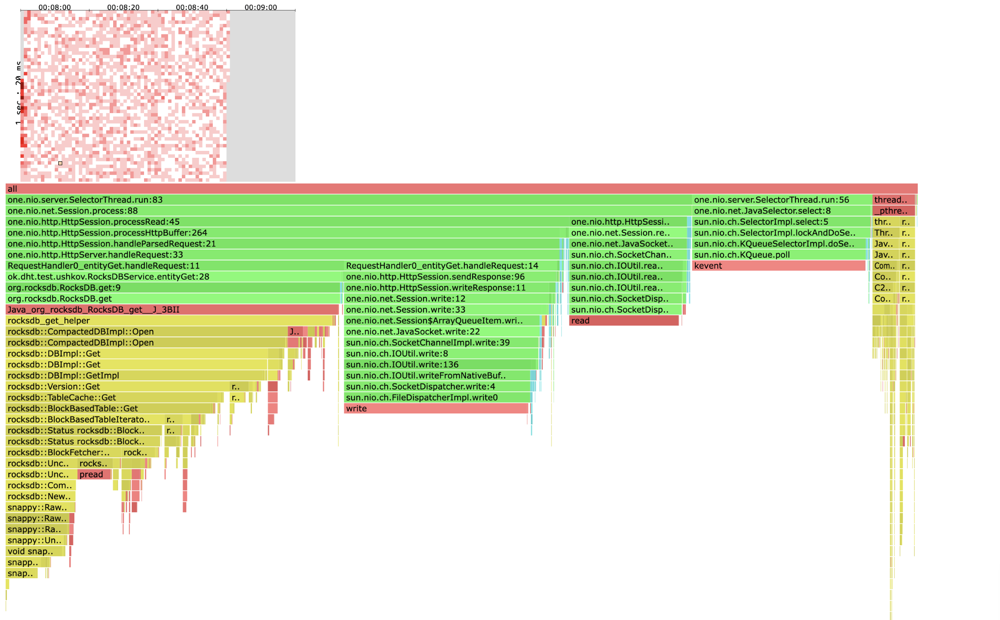
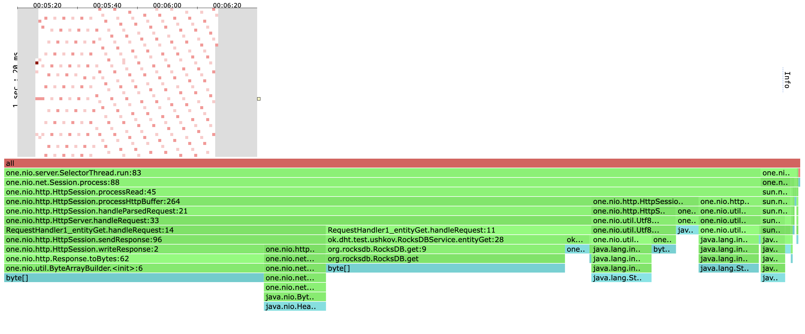

# Отчет

В качестве базы данных была взята RocksDB и для нее был реализовани интерфейс Dao из репозитория `2022-nosql-lsm`.

# Нагрузочное тестирование

## PUT

> NB. Все запуски `wrk` для метода `PUT` производились на пустой бд.

Для `wrk` был написан скрипт на Lua для выполнения `PUT` запросов:
```lua
counter = 0
request = function()
    wrk.method = "PUT"
    wrk.body = "" .. counter
    path = "/v0/entity?id=" .. counter
    counter = counter + 1
    return wrk.format(nil, path)
end
```

Перебор различных значений опции `--rate` показал, что `--rate=5000` -- это стабильная нагрузка.

```
$ wrk2 -t1 -c1 -R5000 -d 1m -s put.lua -L http://localhost:8000
Running 1m test @ http://localhost:8000
  1 threads and 1 connections
  Thread calibration: mean lat.: 1.148ms, rate sampling interval: 10ms
  Thread Stats   Avg      Stdev     Max   +/- Stdev
    Latency     1.40ms    3.39ms  60.22ms   98.59%
    Req/Sec     5.26k   524.69    11.44k    81.28%
  Latency Distribution (HdrHistogram - Recorded Latency)
 50.000%    1.08ms
 75.000%    1.56ms
 90.000%    1.97ms
 99.000%   10.02ms
 99.900%   57.31ms
 99.990%   59.97ms
 99.999%   60.26ms
100.000%   60.26ms

  Detailed Percentile spectrum:
       Value   Percentile   TotalCount 1/(1-Percentile)

       0.052     0.000000            1         1.00
       0.297     0.100000        25033         1.11
       0.516     0.200000        50040         1.25
       0.725     0.300000        75047         1.43
       0.919     0.400000       100057         1.67
       1.084     0.500000       125146         2.00
       1.144     0.550000       137579         2.22
       1.209     0.600000       150113         2.50
       1.307     0.650000       162500         2.86
       1.428     0.700000       175068         3.33
       1.556     0.750000       187550         4.00
       1.620     0.775000       193738         4.44
       1.687     0.800000       199990         5.00
       1.755     0.825000       206313         5.71
       1.824     0.850000       212487         6.67
       1.894     0.875000       218775         8.00
       1.930     0.887500       221855         8.89
       1.966     0.900000       225011        10.00
       2.003     0.912500       228127        11.43
       2.043     0.925000       231285        13.33
       2.081     0.937500       234364        16.00
       2.101     0.943750       235933        17.78
       2.123     0.950000       237628        20.00
       2.145     0.956250       239125        22.86
       2.169     0.962500       240647        26.67
       2.195     0.968750       242171        32.00
       2.213     0.971875       243006        35.56
       2.245     0.975000       243745        40.00
       2.403     0.978125       244509        45.71
       3.131     0.981250       245289        53.33
       4.095     0.984375       246070        64.00
       4.863     0.985938       246460        71.11
       5.999     0.987500       246849        80.00
       7.463     0.989062       247240        91.43
      11.135     0.990625       247630       106.67
      15.415     0.992188       248021       128.00
      17.263     0.992969       248217       142.22
      18.719     0.993750       248413       160.00
      19.903     0.994531       248607       182.86
      22.495     0.995313       248803       213.33
      27.727     0.996094       248997       256.00
      34.143     0.996484       249095       284.44
      40.575     0.996875       249192       320.00
      45.599     0.997266       249290       365.71
      48.383     0.997656       249388       426.67
      50.975     0.998047       249487       512.00
      52.831     0.998242       249534       568.89
      54.079     0.998437       249583       640.00
      55.167     0.998633       249633       731.43
      56.383     0.998828       249682       853.33
      57.503     0.999023       249729      1024.00
      58.111     0.999121       249756      1137.78
      58.591     0.999219       249778      1280.00
      58.847     0.999316       249803      1462.86
      59.263     0.999414       249830      1706.67
      59.359     0.999512       249853      2048.00
      59.455     0.999561       249867      2275.56
      59.551     0.999609       249884      2560.00
      59.583     0.999658       249891      2925.71
      59.679     0.999707       249903      3413.33
      59.743     0.999756       249914      4096.00
      59.775     0.999780       249929      4551.11
      59.775     0.999805       249929      5120.00
      59.807     0.999829       249937      5851.43
      59.807     0.999854       249937      6826.67
      59.871     0.999878       249943      8192.00
      59.935     0.999890       249947      9102.22
      59.999     0.999902       249950     10240.00
      60.031     0.999915       249952     11702.86
      60.063     0.999927       249955     13653.33
      60.095     0.999939       249959     16384.00
      60.127     0.999945       249962     18204.44
      60.127     0.999951       249962     20480.00
      60.159     0.999957       249964     23405.71
      60.159     0.999963       249964     27306.67
      60.191     0.999969       249967     32768.00
      60.191     0.999973       249967     36408.89
      60.191     0.999976       249967     40960.00
      60.223     0.999979       249969     46811.43
      60.223     0.999982       249969     54613.33
      60.255     0.999985       249973     65536.00
      60.255     1.000000       249973          inf
#[Mean    =        1.402, StdDeviation   =        3.386]
#[Max     =       60.224, Total count    =       249973]
#[Buckets =           27, SubBuckets     =         2048]
----------------------------------------------------------
  299997 requests in 1.00m, 19.17MB read
Requests/sec:   4999.96
Transfer/sec:    327.15KB
```

График:



На `--rate=10000` сервер начинает захлебываться, `latency` возрастает до ~30ms.

```
$ wrk2 -t1 -c1 -R10000 -d 1m -s put.lua -L http://localhost:8000
Running 1m test @ http://localhost:8000
  1 threads and 1 connections
  Thread calibration: mean lat.: 4.856ms, rate sampling interval: 17ms
  Thread Stats   Avg      Stdev     Max   +/- Stdev
    Latency    27.60ms  124.37ms 996.86ms   95.68%
    Req/Sec    10.12k     1.14k   17.12k    88.87%
  Latency Distribution (HdrHistogram - Recorded Latency)
 50.000%  764.00us
 75.000%    1.11ms
 90.000%   12.57ms
 99.000%  757.25ms
 99.900%  985.60ms
 99.990%  991.74ms
 99.999%  997.38ms
100.000%  997.38ms

  Detailed Percentile spectrum:
       Value   Percentile   TotalCount 1/(1-Percentile)

       0.052     0.000000            5         1.00
       0.211     0.100000        49289         1.11
       0.351     0.200000        98333         1.25
       0.489     0.300000       147415         1.43
       0.627     0.400000       196573         1.67
       0.764     0.500000       245346         2.00
       0.833     0.550000       270004         2.22
       0.902     0.600000       294456         2.50
       0.972     0.650000       319256         2.86
       1.040     0.700000       343554         3.33
       1.107     0.750000       368187         4.00
       1.140     0.775000       380413         4.44
       1.173     0.800000       392615         5.00
       1.211     0.825000       404910         5.71
       1.322     0.850000       417030         6.67
       2.505     0.875000       429265         8.00
       5.095     0.887500       435400         8.89
      12.567     0.900000       441528        10.00
      21.567     0.912500       447663        11.43
      32.415     0.925000       453793        13.33
      44.671     0.937500       459940        16.00
      60.671     0.943750       462994        17.78
      76.479     0.950000       466057        20.00
     137.471     0.956250       469127        22.86
     264.447     0.962500       472204        26.67
     420.607     0.968750       475280        32.00
     465.407     0.971875       476834        35.56
     506.367     0.975000       478323        40.00
     548.351     0.978125       479859        45.71
     595.455     0.981250       481393        53.33
     653.311     0.984375       482955        64.00
     665.087     0.985938       483709        71.11
     707.583     0.987500       484463        80.00
     742.399     0.989062       485240        91.43
     763.903     0.990625       486046       106.67
     790.527     0.992188       486775       128.00
     823.295     0.992969       487139       142.22
     848.383     0.993750       487531       160.00
     878.079     0.994531       487915       182.86
     887.295     0.995313       488289       213.33
     920.063     0.996094       488697       256.00
     939.519     0.996484       488862       284.44
     951.295     0.996875       489058       320.00
     957.439     0.997266       489260       365.71
     968.191     0.997656       489438       426.67
     980.479     0.998047       489680       512.00
     980.991     0.998242       489750       568.89
     982.527     0.998437       489843       640.00
     984.575     0.998633       489930       731.43
     985.087     0.998828       490019       853.33
     985.599     0.999023       490119      1024.00
     986.111     0.999121       490167      1137.78
     987.135     0.999219       490210      1280.00
     988.671     0.999316       490331      1462.86
     988.671     0.999414       490331      1706.67
     989.183     0.999512       490451      2048.00
     989.183     0.999561       490451      2275.56
     989.183     0.999609       490451      2560.00
     989.183     0.999658       490451      2925.71
     989.183     0.999707       490451      3413.33
     989.695     0.999756       490493      4096.00
     989.695     0.999780       490493      4551.11
     989.695     0.999805       490493      5120.00
     990.207     0.999829       490505      5851.43
     991.743     0.999854       490537      6826.67
     991.743     0.999878       490537      8192.00
     991.743     0.999890       490537      9102.22
     992.255     0.999902       490547     10240.00
     992.255     0.999915       490547     11702.86
     994.303     0.999927       490551     13653.33
     994.815     0.999939       490574     16384.00
     994.815     0.999945       490574     18204.44
     994.815     0.999951       490574     20480.00
     994.815     0.999957       490574     23405.71
     994.815     0.999963       490574     27306.67
     994.815     0.999969       490574     32768.00
     994.815     0.999973       490574     36408.89
     995.839     0.999976       490575     40960.00
     996.351     0.999979       490576     46811.43
     997.375     0.999982       490586     54613.33
     997.375     1.000000       490586          inf
#[Mean    =       27.605, StdDeviation   =      124.373]
#[Max     =      996.864, Total count    =       490586]
#[Buckets =           27, SubBuckets     =         2048]
----------------------------------------------------------
  590024 requests in 1.00m, 37.70MB read
Requests/sec:   9833.76
Transfer/sec:    643.42KB
```

На графике мы видим, что в 10% запросов (90-100 процентили) время ожидание больше 12ms.


## GET

База данных была заранее наполнена 2_000_000 ключей (~1G).

Скрипт на Lua для `wrk`:
```lua
counter = 0
request = function()
    wrk.method = "GET"
    path = "/v0/entity?id=" .. counter
    counter = counter + 1
    return wrk.format(nil, path)
end
```

Перебор различных значений опции `--rate` для `wrk` показал, что `--rate=5000` -- это стабильная нагрузка.

```
$ wrk2 -t1 -c1 -R5000 -d 1m -s get.lua -L http://localhost:8000
Running 1m test @ http://localhost:8000
  1 threads and 1 connections
  Thread calibration: mean lat.: 1.067ms, rate sampling interval: 10ms
  Thread Stats   Avg      Stdev     Max   +/- Stdev
    Latency     1.10ms  584.93us   5.07ms   60.05%
    Req/Sec     5.29k   451.33     6.78k    65.77%
  Latency Distribution (HdrHistogram - Recorded Latency)
 50.000%    1.09ms
 75.000%    1.56ms
 90.000%    1.93ms
 99.000%    2.18ms
 99.900%    2.37ms
 99.990%    4.09ms
 99.999%    5.06ms
100.000%    5.07ms

  Detailed Percentile spectrum:
       Value   Percentile   TotalCount 1/(1-Percentile)

       0.040     0.000000            1         1.00
       0.285     0.100000        25036         1.11
       0.512     0.200000        50065         1.25
       0.733     0.300000        75036         1.43
       0.937     0.400000       100016         1.67
       1.092     0.500000       125169         2.00
       1.151     0.550000       137650         2.22
       1.221     0.600000       150036         2.50
       1.327     0.650000       162484         2.86
       1.443     0.700000       174996         3.33
       1.562     0.750000       187497         4.00
       1.623     0.775000       193816         4.44
       1.683     0.800000       200077         5.00
       1.743     0.825000       206282         5.71
       1.804     0.850000       212498         6.67
       1.865     0.875000       218728         8.00
       1.896     0.887500       221869         8.89
       1.927     0.900000       225007        10.00
       1.959     0.912500       228171        11.43
       1.991     0.925000       231275        13.33
       2.022     0.937500       234350        16.00
       2.039     0.943750       235978        17.78
       2.055     0.950000       237504        20.00
       2.073     0.956250       239225        22.86
       2.089     0.962500       240630        26.67
       2.107     0.968750       242178        32.00
       2.117     0.971875       243028        35.56
       2.127     0.975000       243832        40.00
       2.137     0.978125       244554        45.71
       2.149     0.981250       245405        53.33
       2.159     0.984375       246203        64.00
       2.163     0.985938       246483        71.11
       2.169     0.987500       246896        80.00
       2.177     0.989062       247337        91.43
       2.183     0.990625       247657       106.67
       2.191     0.992188       248071       128.00
       2.195     0.992969       248233       142.22
       2.201     0.993750       248452       160.00
       2.205     0.994531       248607       182.86
       2.213     0.995313       248847       213.33
       2.221     0.996094       249026       256.00
       2.225     0.996484       249104       284.44
       2.231     0.996875       249192       320.00
       2.241     0.997266       249301       365.71
       2.251     0.997656       249393       426.67
       2.265     0.998047       249492       512.00
       2.277     0.998242       249541       568.89
       2.289     0.998437       249590       640.00
       2.305     0.998633       249632       731.43
       2.333     0.998828       249681       853.33
       2.379     0.999023       249730      1024.00
       2.415     0.999121       249754      1137.78
       2.447     0.999219       249778      1280.00
       2.519     0.999316       249803      1462.86
       2.615     0.999414       249827      1706.67
       2.727     0.999512       249851      2048.00
       2.809     0.999561       249864      2275.56
       2.889     0.999609       249876      2560.00
       2.971     0.999658       249888      2925.71
       3.087     0.999707       249900      3413.33
       3.183     0.999756       249912      4096.00
       3.255     0.999780       249919      4551.11
       3.363     0.999805       249925      5120.00
       3.457     0.999829       249931      5851.43
       3.593     0.999854       249937      6826.67
       3.801     0.999878       249943      8192.00
       3.995     0.999890       249946      9102.22
       4.175     0.999902       249949     10240.00
       4.323     0.999915       249952     11702.86
       4.555     0.999927       249955     13653.33
       4.755     0.999939       249958     16384.00
       4.771     0.999945       249961     18204.44
       4.771     0.999951       249961     20480.00
       4.819     0.999957       249963     23405.71
       4.827     0.999963       249964     27306.67
       4.883     0.999969       249966     32768.00
       4.887     0.999973       249967     36408.89
       4.887     0.999976       249967     40960.00
       4.891     0.999979       249968     46811.43
       4.971     0.999982       249969     54613.33
       5.047     0.999985       249970     65536.00
       5.047     0.999986       249970     72817.78
       5.047     0.999988       249970     81920.00
       5.059     0.999989       249971     93622.86
       5.059     0.999991       249971    109226.67
       5.067     0.999992       249972    131072.00
       5.067     0.999993       249972    145635.56
       5.067     0.999994       249972    163840.00
       5.067     0.999995       249972    187245.71
       5.067     0.999995       249972    218453.33
       5.075     0.999996       249973    262144.00
       5.075     1.000000       249973          inf
#[Mean    =        1.097, StdDeviation   =        0.585]
#[Max     =        5.072, Total count    =       249973]
#[Buckets =           27, SubBuckets     =         2048]
----------------------------------------------------------
  299991 requests in 1.00m, 19.35MB read
Requests/sec:   4999.80
Transfer/sec:    330.21KB
```

График:


При `--rate=10000` среднее `latency` поднимается до ~15ms.

```
$ wrk2 -t1 -c1 -R10000 -d 1m -s get.lua -L http://localhost:8000
Running 1m test @ http://localhost:8000
  1 threads and 1 connections
  Thread calibration: mean lat.: 1.096ms, rate sampling interval: 10ms
  Thread Stats   Avg      Stdev     Max   +/- Stdev
    Latency    14.78ms   68.42ms 532.48ms   95.67%
    Req/Sec    10.57k     2.24k   24.22k    93.54%
  Latency Distribution (HdrHistogram - Recorded Latency)
 50.000%    0.97ms
 75.000%    1.43ms
 90.000%    2.00ms
 99.000%  432.13ms
 99.900%  520.96ms
 99.990%  532.48ms
 99.999%  532.99ms
100.000%  532.99ms

  Detailed Percentile spectrum:
       Value   Percentile   TotalCount 1/(1-Percentile)

       0.039     0.000000            2         1.00
       0.249     0.100000        50193         1.11
       0.443     0.200000       100208         1.25
       0.628     0.300000       150025         1.43
       0.805     0.400000       200230         1.67
       0.966     0.500000       250144         2.00
       1.040     0.550000       275211         2.22
       1.109     0.600000       300122         2.50
       1.172     0.650000       325353         2.86
       1.278     0.700000       350034         3.33
       1.431     0.750000       375112         4.00
       1.513     0.775000       387490         4.44
       1.600     0.800000       399967         5.00
       1.691     0.825000       412529         5.71
       1.786     0.850000       425019         6.67
       1.888     0.875000       437551         8.00
       1.942     0.887500       443741         8.89
       2.000     0.900000       449970        10.00
       2.065     0.912500       456279        11.43
       2.139     0.925000       462548        13.33
       2.223     0.937500       468729        16.00
       2.299     0.943750       471842        17.78
      22.239     0.950000       474961        20.00
      79.999     0.956250       478092        22.86
     145.535     0.962500       481209        26.67
     220.159     0.968750       484335        32.00
     257.407     0.971875       485897        35.56
     295.423     0.975000       487467        40.00
     320.511     0.978125       489032        45.71
     341.759     0.981250       490612        53.33
     370.687     0.984375       492151        64.00
     388.863     0.985938       492936        71.11
     406.527     0.987500       493716        80.00
     422.399     0.989062       494489        91.43
     436.735     0.990625       495282       106.67
     445.951     0.992188       496076       128.00
     449.279     0.992969       496492       142.22
     450.815     0.993750       496842       160.00
     459.519     0.994531       497235       182.86
     464.383     0.995313       497617       213.33
     471.551     0.996094       498005       256.00
     474.879     0.996484       498230       284.44
     479.487     0.996875       498407       320.00
     488.959     0.997266       498594       365.71
     497.151     0.997656       498786       426.67
     506.623     0.998047       498984       512.00
     509.951     0.998242       499079       568.89
     513.791     0.998437       499176       640.00
     518.143     0.998633       499277       731.43
     519.935     0.998828       499375       853.33
     520.959     0.999023       499484      1024.00
     522.495     0.999121       499518      1137.78
     524.799     0.999219       499583      1280.00
     526.335     0.999316       499622      1462.86
     528.383     0.999414       499670      1706.67
     530.431     0.999512       499728      2048.00
     530.943     0.999561       499794      2275.56
     530.943     0.999609       499794      2560.00
     530.943     0.999658       499794      2925.71
     531.455     0.999707       499845      3413.33
     531.455     0.999756       499845      4096.00
     531.967     0.999780       499887      4551.11
     531.967     0.999805       499887      5120.00
     531.967     0.999829       499887      5851.43
     531.967     0.999854       499887      6826.67
     532.479     0.999878       499921      8192.00
     532.479     0.999890       499921      9102.22
     532.479     0.999902       499921     10240.00
     532.479     0.999915       499921     11702.86
     532.479     0.999927       499921     13653.33
     532.991     0.999939       499957     16384.00
     532.991     1.000000       499957          inf
#[Mean    =       14.780, StdDeviation   =       68.422]
#[Max     =      532.480, Total count    =       499957]
#[Buckets =           27, SubBuckets     =         2048]
----------------------------------------------------------
  599985 requests in 1.00m, 39.48MB read
  Non-2xx or 3xx responses: 599985
Requests/sec:   9999.59
Transfer/sec:    673.80KB
```

На графике видим, что примерно в 5% случаев `latency` больше 80ms.


# Профилирование

## PUT

[Хитмап и флеймграф (CPU)](./html/heat_cpu_put.lua.html)


[Хитмап и флеймграф (ALLOC)](./html/heat_alloc_put.lua.html)


# GET

[Хитмап и флеймграф (CPU)](./html/heat_cpu_get.lua.html)


[Хитмап и флеймграф (ALLOC)](./html/heat_alloc_get.lua.html)


## Выводы

### PUT
* 5000 r/s -- стабильная нагрузка, 99% запросов имеют `latency` не больше 2ms.
* На 10000 r/s сервер начинает "захлебываться". В 10% случаев `latency` больше 12ms.
* Больше всего времени в обработке одного запроса сервер тратит на сетевое взаимодействие и походы в RocksDB. На сеть чуть больше.
* Большая часть памяти аллоцируется в недрах one-nio. Немного аллокаций также приходится на создание `one.nio.http.Response` и `java.nio.ByteBuffer` уже в рамках реализованного сервера.

### GET
* 5000 r/s -- стабильная нагрузка, более 99.9% запросов проодят меньше чем за 2.3ms.
* На нагрузке 10000 r/s сервер начинает "захлебываться". В 4-5% случаях `latency` взлетает до 80ms.
* Большую часть времени сервер тратит на сеть и в несколько раз меньше на походы в RocksDB.
* Аналогично `PUT`, большая часть памяти аллоцируется в недрах one-nio. Немного аллокаций также приходится на создание `one.nio.http.Response` и `java.nio.ByteBuffer` уже в рамках реализованного сервера. 