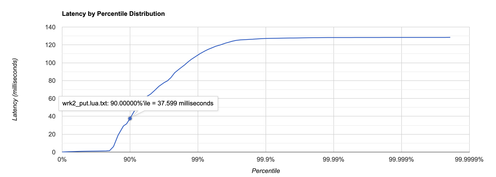
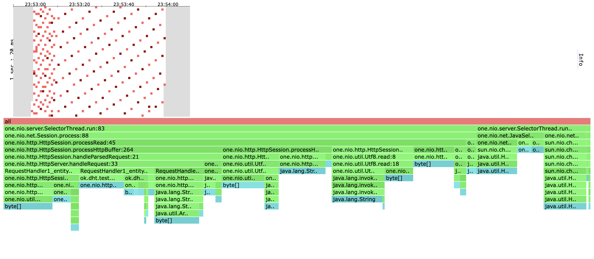

# Отчет

В качестве базы данных была взята RocksDB и для нее был реализовани интерфейс Dao из репозитория `2022-nosql-lsm`.

# Нагрузочное тестирование

## PUT

> NB. Все запуски `wrk` для метода `PUT` производились на пустой бд.

Для `wrk` был написан скрипт на Lua для выполнения `PUT` запросов:
```lua
counter = 0
request = function()
    wrk.method = "PUT"
    wrk.body = "" .. counter
    path = "/v0/entity?id=" .. counter
    counter = counter + 1
    return wrk.format(nil, path)
end
```

Перебор различных значений опции `--rate` показал, что `--rate=5000` -- это стабильная нагрузка.

```
$ wrk2 -t1 -c1 -R5000 -d 1m -s put.lua -L http://localhost:8000
Running 1m test @ http://localhost:8000
  1 threads and 1 connections
  Thread calibration: mean lat.: 1.019ms, rate sampling interval: 10ms
  Thread Stats   Avg      Stdev     Max   +/- Stdev
    Latency     0.99ms    1.54ms  40.16ms   99.35%
    Req/Sec     5.28k   480.52    10.60k    71.85%
  Latency Distribution (HdrHistogram - Recorded Latency)
 50.000%    0.89ms
 75.000%    1.20ms
 90.000%    1.61ms
 99.000%    2.22ms
 99.900%   34.69ms
 99.990%   39.65ms
 99.999%   40.16ms
100.000%   40.19ms

  Detailed Percentile spectrum:
       Value   Percentile   TotalCount 1/(1-Percentile)

       0.054     0.000000            1         1.00
       0.269     0.100000        25055         1.11
       0.439     0.200000        50046         1.25
       0.597     0.300000        75001         1.43
       0.748     0.400000       100071         1.67
       0.889     0.500000       125189         2.00
       0.955     0.550000       137501         2.22
       1.020     0.600000       150084         2.50
       1.082     0.650000       162657         2.86
       1.138     0.700000       175095         3.33
       1.195     0.750000       187674         4.00
       1.226     0.775000       193903         4.44
       1.260     0.800000       199996         5.00
       1.313     0.825000       206306         5.71
       1.392     0.850000       212517         6.67
       1.496     0.875000       218754         8.00
       1.553     0.887500       221863         8.89
       1.614     0.900000       224991        10.00
       1.677     0.912500       228100        11.43
       1.744     0.925000       231227        13.33
       1.813     0.937500       234348        16.00
       1.851     0.943750       235934        17.78
       1.888     0.950000       237473        20.00
       1.928     0.956250       239065        22.86
       1.969     0.962500       240598        26.67
       2.014     0.968750       242175        32.00
       2.038     0.971875       242970        35.56
       2.063     0.975000       243721        40.00
       2.091     0.978125       244559        45.71
       2.119     0.981250       245300        53.33
       2.149     0.984375       246075        64.00
       2.165     0.985938       246467        71.11
       2.185     0.987500       246860        80.00
       2.207     0.989062       247246        91.43
       2.233     0.990625       247628       106.67
       2.291     0.992188       248019       128.00
       2.389     0.992969       248214       142.22
       2.663     0.993750       248409       160.00
       3.313     0.994531       248603       182.86
       5.039     0.995313       248799       213.33
       6.759     0.996094       248994       256.00
       7.783     0.996484       249092       284.44
       9.071     0.996875       249189       320.00
      11.927     0.997266       249287       365.71
      14.687     0.997656       249385       426.67
      15.991     0.998047       249482       512.00
      17.599     0.998242       249532       568.89
      21.391     0.998437       249580       640.00
      26.191     0.998633       249629       731.43
      30.975     0.998828       249678       853.33
      35.039     0.999023       249727      1024.00
      35.935     0.999121       249751      1137.78
      36.831     0.999219       249777      1280.00
      37.279     0.999316       249802      1462.86
      37.631     0.999414       249824      1706.67
      37.855     0.999512       249848      2048.00
      38.079     0.999561       249863      2275.56
      38.207     0.999609       249873      2560.00
      38.335     0.999658       249886      2925.71
      38.463     0.999707       249897      3413.33
      38.623     0.999756       249909      4096.00
      38.687     0.999780       249916      4551.11
      38.847     0.999805       249923      5120.00
      38.975     0.999829       249928      5851.43
      39.167     0.999854       249935      6826.67
      39.423     0.999878       249941      8192.00
      39.519     0.999890       249943      9102.22
      39.679     0.999902       249947     10240.00
      39.743     0.999915       249953     11702.86
      39.743     0.999927       249953     13653.33
      39.807     0.999939       249955     16384.00
      39.871     0.999945       249958     18204.44
      39.871     0.999951       249958     20480.00
      39.967     0.999957       249960     23405.71
      39.999     0.999963       249961     27306.67
      40.063     0.999969       249963     32768.00
      40.095     0.999973       249964     36408.89
      40.095     0.999976       249964     40960.00
      40.127     0.999979       249965     46811.43
      40.159     0.999982       249969     54613.33
      40.159     0.999985       249969     65536.00
      40.159     0.999986       249969     72817.78
      40.159     0.999988       249969     81920.00
      40.159     0.999989       249969     93622.86
      40.159     0.999991       249969    109226.67
      40.159     0.999992       249969    131072.00
      40.159     0.999993       249969    145635.56
      40.159     0.999994       249969    163840.00
      40.159     0.999995       249969    187245.71
      40.159     0.999995       249969    218453.33
      40.191     0.999996       249970    262144.00
      40.191     1.000000       249970          inf
#[Mean    =        0.988, StdDeviation   =        1.544]
#[Max     =       40.160, Total count    =       249970]
#[Buckets =           27, SubBuckets     =         2048]
----------------------------------------------------------
  299995 requests in 1.00m, 19.17MB read
Requests/sec:   4999.93
Transfer/sec:    327.14KB
```

График:


На `--rate=10000` сервер начинает захлебываться, `latency` возрастает до ~10ms.

```
$ wrk2 -t1 -c1 -R10000 -d 1m -s put.lua -L http://localhost:8000
Running 1m test @ http://localhost:8000
  1 threads and 1 connections
  Thread calibration: mean lat.: 31.265ms, rate sampling interval: 276ms
  Thread Stats   Avg      Stdev     Max   +/- Stdev
    Latency     9.43ms   22.64ms 128.38ms   88.96%
    Req/Sec    10.02k   550.74    13.25k    84.53%
  Latency Distribution (HdrHistogram - Recorded Latency)
 50.000%    0.86ms
 75.000%    1.23ms
 90.000%   37.60ms
 99.000%  108.48ms
 99.900%  127.17ms
 99.990%  128.26ms
 99.999%  128.38ms
100.000%  128.45ms

  Detailed Percentile spectrum:
       Value   Percentile   TotalCount 1/(1-Percentile)

       0.060     0.000000            1         1.00
       0.241     0.100000        50280         1.11
       0.397     0.200000       100121         1.25
       0.551     0.300000       150146         1.43
       0.705     0.400000       200077         1.67
       0.858     0.500000       250276         2.00
       0.932     0.550000       275175         2.22
       1.006     0.600000       300134         2.50
       1.079     0.650000       325091         2.86
       1.150     0.700000       350241         3.33
       1.226     0.750000       375056         4.00
       1.302     0.775000       387495         4.44
       1.599     0.800000       399972         5.00
       6.151     0.825000       412460         5.71
      18.879     0.850000       424959         6.67
      29.231     0.875000       437473         8.00
      31.599     0.887500       443725         8.89
      37.599     0.900000       449954        10.00
      45.247     0.912500       456216        11.43
      53.823     0.925000       462477        13.33
      59.711     0.937500       468709        16.00
      62.399     0.943750       471843        17.78
      64.767     0.950000       474957        20.00
      68.735     0.956250       478087        22.86
      73.663     0.962500       481204        26.67
      77.887     0.968750       484350        32.00
      79.743     0.971875       485890        35.56
      83.327     0.975000       487460        40.00
      88.959     0.978125       489019        45.71
      93.055     0.981250       490575        53.33
      97.663     0.984375       492160        64.00
     100.735     0.985938       492920        71.11
     103.807     0.987500       493710        80.00
     106.687     0.989062       494482        91.43
     110.015     0.990625       495260       106.67
     113.343     0.992188       496062       128.00
     115.007     0.992969       496432       142.22
     116.607     0.993750       496833       160.00
     118.463     0.994531       497217       182.86
     119.935     0.995313       497612       213.33
     121.983     0.996094       497998       256.00
     122.943     0.996484       498194       284.44
     124.095     0.996875       498392       320.00
     125.055     0.997266       498582       365.71
     125.631     0.997656       498800       426.67
     125.951     0.998047       498994       512.00
     126.143     0.998242       499093       568.89
     126.335     0.998437       499167       640.00
     126.655     0.998633       499264       731.43
     126.975     0.998828       499362       853.33
     127.231     0.999023       499487      1024.00
     127.295     0.999121       499533      1137.78
     127.359     0.999219       499564      1280.00
     127.423     0.999316       499606      1462.86
     127.551     0.999414       499687      1706.67
     127.615     0.999512       499717      2048.00
     127.679     0.999561       499752      2275.56
     127.679     0.999609       499752      2560.00
     127.743     0.999658       499777      2925.71
     127.871     0.999707       499817      3413.33
     127.999     0.999756       499831      4096.00
     128.063     0.999780       499838      4551.11
     128.127     0.999805       499863      5120.00
     128.127     0.999829       499863      5851.43
     128.191     0.999854       499883      6826.67
     128.255     0.999878       499920      8192.00
     128.255     0.999890       499920      9102.22
     128.255     0.999902       499920     10240.00
     128.255     0.999915       499920     11702.86
     128.255     0.999927       499920     13653.33
     128.255     0.999939       499920     16384.00
     128.255     0.999945       499920     18204.44
     128.319     0.999951       499936     20480.00
     128.319     0.999957       499936     23405.71
     128.319     0.999963       499936     27306.67
     128.319     0.999969       499936     32768.00
     128.319     0.999973       499936     36408.89
     128.319     0.999976       499936     40960.00
     128.319     0.999979       499936     46811.43
     128.383     0.999982       499945     54613.33
     128.383     0.999985       499945     65536.00
     128.383     0.999986       499945     72817.78
     128.383     0.999988       499945     81920.00
     128.383     0.999989       499945     93622.86
     128.383     0.999991       499945    109226.67
     128.383     0.999992       499945    131072.00
     128.383     0.999993       499945    145635.56
     128.383     0.999994       499945    163840.00
     128.383     0.999995       499945    187245.71
     128.383     0.999995       499945    218453.33
     128.383     0.999996       499945    262144.00
     128.383     0.999997       499945    291271.11
     128.383     0.999997       499945    327680.00
     128.383     0.999997       499945    374491.43
     128.383     0.999998       499945    436906.67
     128.447     0.999998       499946    524288.00
     128.447     1.000000       499946          inf
#[Mean    =        9.435, StdDeviation   =       22.642]
#[Max     =      128.384, Total count    =       499946]
#[Buckets =           27, SubBuckets     =         2048]
----------------------------------------------------------
  599989 requests in 1.00m, 38.34MB read
Requests/sec:   9999.85
Transfer/sec:    654.29KB
```

На графике мы видим, что в 10% запросов время ожидание больше 37ms.



## GET

База данных была заранее наполнена 2_000_000 ключей (~1G).

Скрипт на Lua для `wrk`:
```lua
counter = 0
request = function()
    wrk.method = "GET"
    path = "/v0/entity?id=" .. counter
    counter = counter + 1
    return wrk.format(nil, path)
end
```

Перебор различных значений опции `--rate` для `wrk` показал, что `--rate=5000` -- это стабильная нагрузка.

```
$ wrk2 -t1 -c1 -R5000 -d 1m -s get.lua -L http://localhost:8000
Running 1m test @ http://localhost:8000
  1 threads and 1 connections
  Thread calibration: mean lat.: 1.095ms, rate sampling interval: 10ms
  Thread Stats   Avg      Stdev     Max   +/- Stdev
    Latency     0.95ms  570.03us   9.21ms   69.71%
    Req/Sec     5.27k   466.29     7.55k    66.30%
  Latency Distribution (HdrHistogram - Recorded Latency)
 50.000%    0.92ms
 75.000%    1.23ms
 90.000%    1.70ms
 99.000%    2.21ms
 99.900%    5.38ms
 99.990%    8.89ms
 99.999%    9.17ms
100.000%    9.22ms

  Detailed Percentile spectrum:
       Value   Percentile   TotalCount 1/(1-Percentile)

       0.052     0.000000            1         1.00
       0.277     0.100000        25099         1.11
       0.453     0.200000        50037         1.25
       0.622     0.300000        75042         1.43
       0.779     0.400000       100030         1.67
       0.924     0.500000       125024         2.00
       0.992     0.550000       137502         2.22
       1.057     0.600000       150128         2.50
       1.117     0.650000       162587         2.86
       1.174     0.700000       175179         3.33
       1.234     0.750000       187594         4.00
       1.272     0.775000       193825         4.44
       1.329     0.800000       200070         5.00
       1.405     0.825000       206259         5.71
       1.497     0.850000       212532         6.67
       1.597     0.875000       218797         8.00
       1.648     0.887500       221873         8.89
       1.703     0.900000       225004        10.00
       1.758     0.912500       228108        11.43
       1.816     0.925000       231234        13.33
       1.876     0.937500       234369        16.00
       1.907     0.943750       235933        17.78
       1.940     0.950000       237500        20.00
       1.974     0.956250       239084        22.86
       2.008     0.962500       240609        26.67
       2.044     0.968750       242174        32.00
       2.065     0.971875       242972        35.56
       2.085     0.975000       243765        40.00
       2.107     0.978125       244549        45.71
       2.129     0.981250       245301        53.33
       2.153     0.984375       246097        64.00
       2.167     0.985938       246485        71.11
       2.181     0.987500       246869        80.00
       2.197     0.989062       247253        91.43
       2.215     0.990625       247656       106.67
       2.235     0.992188       248030       128.00
       2.249     0.992969       248224       142.22
       2.269     0.993750       248427       160.00
       2.297     0.994531       248611       182.86
       2.385     0.995313       248807       213.33
       2.653     0.996094       249002       256.00
       2.915     0.996484       249101       284.44
       3.201     0.996875       249197       320.00
       3.475     0.997266       249295       365.71
       3.781     0.997656       249393       426.67
       4.123     0.998047       249490       512.00
       4.415     0.998242       249540       568.89
       4.615     0.998437       249589       640.00
       4.883     0.998633       249637       731.43
       5.071     0.998828       249688       853.33
       5.407     0.999023       249734      1024.00
       5.547     0.999121       249759      1137.78
       5.871     0.999219       249783      1280.00
       6.619     0.999316       249808      1462.86
       6.779     0.999414       249832      1706.67
       6.991     0.999512       249856      2048.00
       7.127     0.999561       249869      2275.56
       7.523     0.999609       249881      2560.00
       7.751     0.999658       249893      2925.71
       7.875     0.999707       249905      3413.33
       8.139     0.999756       249917      4096.00
       8.303     0.999780       249924      4551.11
       8.591     0.999805       249930      5120.00
       8.735     0.999829       249936      5851.43
       8.815     0.999854       249943      6826.67
       8.839     0.999878       249949      8192.00
       8.855     0.999890       249951      9102.22
       8.903     0.999902       249954     10240.00
       8.943     0.999915       249957     11702.86
       8.991     0.999927       249961     13653.33
       9.015     0.999939       249964     16384.00
       9.023     0.999945       249966     18204.44
       9.023     0.999951       249966     20480.00
       9.031     0.999957       249968     23405.71
       9.055     0.999963       249970     27306.67
       9.079     0.999969       249971     32768.00
       9.119     0.999973       249972     36408.89
       9.119     0.999976       249972     40960.00
       9.127     0.999979       249973     46811.43
       9.151     0.999982       249974     54613.33
       9.159     0.999985       249975     65536.00
       9.159     0.999986       249975     72817.78
       9.159     0.999988       249975     81920.00
       9.167     0.999989       249977     93622.86
       9.167     0.999991       249977    109226.67
       9.167     0.999992       249977    131072.00
       9.167     0.999993       249977    145635.56
       9.167     0.999994       249977    163840.00
       9.167     0.999995       249977    187245.71
       9.167     0.999995       249977    218453.33
       9.215     0.999996       249978    262144.00
       9.215     1.000000       249978          inf
#[Mean    =        0.955, StdDeviation   =        0.570]
#[Max     =        9.208, Total count    =       249978]
#[Buckets =           27, SubBuckets     =         2048]
----------------------------------------------------------
  299995 requests in 1.00m, 179.37MB read
Requests/sec:   4999.87
Transfer/sec:      2.99MB
```

График:


При `--rate=15000` среднее `latency` поднимается до ~15ms.

```
$ wrk2 -t1 -c1 -R15000 -d 1m -s get.lua -L http://localhost:8000
Running 1m test @ http://localhost:8000
  1 threads and 1 connections
  Thread calibration: mean lat.: 9.548ms, rate sampling interval: 44ms
  Thread Stats   Avg      Stdev     Max   +/- Stdev
    Latency    14.44ms   41.57ms 237.57ms   91.94%
    Req/Sec    15.14k     1.45k   21.21k    86.34%
  Latency Distribution (HdrHistogram - Recorded Latency)
 50.000%    0.88ms
 75.000%    1.34ms
 90.000%   35.94ms
 99.000%  228.48ms
 99.900%  237.05ms
 99.990%  237.57ms
 99.999%  237.70ms
100.000%  237.70ms

  Detailed Percentile spectrum:
       Value   Percentile   TotalCount 1/(1-Percentile)

       0.040     0.000000            1         1.00
       0.233     0.100000        75033         1.11
       0.399     0.200000       149771         1.25
       0.563     0.300000       224805         1.43
       0.721     0.400000       299558         1.67
       0.877     0.500000       374251         2.00
       0.953     0.550000       411738         2.22
       1.028     0.600000       448988         2.50
       1.103     0.650000       486606         2.86
       1.178     0.700000       523898         3.33
       1.338     0.750000       560978         4.00
       1.778     0.775000       579665         4.44
       4.069     0.800000       598361         5.00
       9.783     0.825000       617069         5.71
      17.743     0.850000       635768         6.67
      27.407     0.875000       654469         8.00
      31.279     0.887500       663812         8.89
      35.935     0.900000       673188        10.00
      46.911     0.912500       682523        11.43
      63.423     0.925000       691867        13.33
      73.791     0.937500       701235        16.00
      79.615     0.943750       705878        17.78
     101.439     0.950000       710575        20.00
     117.695     0.956250       715246        22.86
     132.095     0.962500       719920        26.67
     157.183     0.968750       724579        32.00
     174.463     0.971875       726922        35.56
     185.471     0.975000       729290        40.00
     192.383     0.978125       731598        45.71
     204.543     0.981250       733952        53.33
     220.159     0.984375       736270        64.00
     225.023     0.985938       737472        71.11
     225.919     0.987500       738748        80.00
     227.071     0.989062       739811        91.43
     229.119     0.990625       741040       106.67
     230.015     0.992188       742138       128.00
     230.655     0.992969       742800       142.22
     231.039     0.993750       743387       160.00
     231.551     0.994531       743870       182.86
     231.935     0.995313       744609       213.33
     232.575     0.996094       745032       256.00
     233.599     0.996484       745357       284.44
     234.367     0.996875       745688       320.00
     235.135     0.997266       745908       365.71
     235.775     0.997656       746250       426.67
     236.287     0.998047       746633       512.00
     236.415     0.998242       746774       568.89
     236.543     0.998437       746917       640.00
     236.671     0.998633       746972       731.43
     236.927     0.998828       747142       853.33
     237.055     0.999023       747269      1024.00
     237.183     0.999121       747497      1137.78
     237.183     0.999219       747497      1280.00
     237.183     0.999316       747497      1462.86
     237.311     0.999414       747734      1706.67
     237.311     0.999512       747734      2048.00
     237.311     0.999561       747734      2275.56
     237.311     0.999609       747734      2560.00
     237.311     0.999658       747734      2925.71
     237.311     0.999707       747734      3413.33
     237.439     0.999756       747851      4096.00
     237.439     0.999780       747851      4551.11
     237.439     0.999805       747851      5120.00
     237.439     0.999829       747851      5851.43
     237.439     0.999854       747851      6826.67
     237.567     0.999878       747917      8192.00
     237.567     0.999890       747917      9102.22
     237.567     0.999902       747917     10240.00
     237.567     0.999915       747917     11702.86
     237.567     0.999927       747917     13653.33
     237.567     0.999939       747917     16384.00
     237.567     0.999945       747917     18204.44
     237.567     0.999951       747917     20480.00
     237.695     0.999957       747949     23405.71
     237.695     1.000000       747949          inf
#[Mean    =       14.442, StdDeviation   =       41.571]
#[Max     =      237.568, Total count    =       747949]
#[Buckets =           27, SubBuckets     =         2048]
----------------------------------------------------------
  898013 requests in 1.00m, 58.41MB read
  Non-2xx or 3xx responses: 298024
Requests/sec:  14966.93
Transfer/sec:      0.97MB
```

На графике видим, что примерно в 10% случаев `latency` больше 36ms.


# Профилирование

## PUT

[Хитмап и флеймграф (CPU)](./html/heat_cpu_put.lua.html)


[Хитмап и флеймграф (ALLOC)](./html/heat_alloc_put.lua.html)



# GET

[Хитмап и флеймграф (CPU)](./html/heat_cpu_get.lua.html)


[Хитмап и флеймграф (ALLOC)](./html/heat_alloc_get.lua.html)


## Выводы

### PUT
* 5000 r/s -- стабильная нагрузка, 99% запросов имеют `latency` не больше 2.3ms.
* На 10000 r/s сервер начинает "захлебываться". В 10% случаев `latency` больше 37ms.
* Примерно 34% времени уходит на взаимодействие с RocksDB, остальное -- сеть и JIT. Из этих 34% некоторая часть (~6%) отводится на взятие локов, аллокации, различные вспомогательные функции (все это в рамках кода самой RocksDB). Основная часть (~24%) тратится на запись в лог (WAL файл) и ~4% на запись в memory table. Здесь можно было бы оптимизировать выключив запись в WAL, но тогда мы начнем проигрывать в durability.
* Большая часть памяти аллоцируется в недрах one-nio. Некоторое количество аллокаций (~13%) также приходится на создание `one.nio.http.Response` уже в рамках реализованного сервера. Их можно было бы оптимизировать, однако это потребовало бы логики для переиспользования созданных объектов. Учитывая, что в будущем наш сервер скорее всего станет многопоточным, это может сказаться на `latency` одного запроса из-за использования синхронизации. Также кажется не имеет большого смысла оптимизировать такое незначительное количество аллокаций.

### GET
* 5000 r/s -- стабильная нагрузка, более 99.9% запросов проодят меньше чем за 2.3ms.
* На нагрузке 15000 r/s сервер начинает "захлебываться". В 10% случаях `latency` становится больше 35ms.
* На взимодействие с RocksDB тратится ~37% времени, остальное -- на сеть и JIT. При этом 2% времени тратится на обращение к memory table, 24% на обращение к диску, а остальное -- на локи и аллокации. Дабы уменьшить количество походов в диск, можно было бы, например, увеличить memory table, однако тогда мы начнем жертвовать оперативной памятью.
* Большая часть памяти аллоцируется в недрах one-nio. Некоторое количество аллокаций (~32%) также приходится на создание `one.nio.http.Response` уже в рамках реализованного сервера. Дальнейшие рассуждения аналогичны тому, что было сказано в последнем пункте выводов про `PUT`.