# Отчет

Обратите внимание:
* При профилировании метода GET бд наполнялась 2 млн пар ключ-значение и имела размер 1GB.
* При профилировании метода PUT бд изначально была пустой.
* Использовались две реализации очереди: Queue (LinkedBlockingQueue) и Stack (на основе LinkedBlockingDeque).
* Скрипты для wrk2: [get](scripts/get.lua) и [put](scripts/put.lua)

# Профилирование

Результаты профилирования на старой реализации.
Заголовок в формате `<Метод> t=<количество потоков wrk2> с=<количество соединений wrk2> R=<RPS для wrk2> d=<время профилирования>`.

## PUT t=4 c=64 R=70000 d=1m
wrk2 output:
```
Running 1m test @ http://localhost:8000
  4 threads and 64 connections
  Thread calibration: mean lat.: 1230.792ms, rate sampling interval: 4968ms
  Thread calibration: mean lat.: 1214.462ms, rate sampling interval: 4882ms
  Thread calibration: mean lat.: 1221.378ms, rate sampling interval: 4911ms
  Thread calibration: mean lat.: 1235.925ms, rate sampling interval: 5005ms
  Thread Stats   Avg      Stdev     Max   +/- Stdev
    Latency     7.15s     2.90s   16.03s    67.37%
    Req/Sec    13.65k     1.98k   16.02k    76.92%
  Latency Distribution (HdrHistogram - Recorded Latency)
 50.000%    6.80s 
 75.000%    9.00s 
 90.000%   11.37s 
 99.000%   14.64s 
 99.900%   15.65s 
 99.990%   15.93s 
 99.999%   16.02s 
100.000%   16.04s 

  Detailed Percentile spectrum:
       Value   Percentile   TotalCount 1/(1-Percentile)

    2330.623     0.000000           10         1.00
    3770.367     0.100000       270613         1.11
    4493.311     0.200000       541591         1.25
    5079.039     0.300000       811004         1.43
    5931.007     0.400000      1080340         1.67
    6803.455     0.500000      1351276         2.00
    7110.655     0.550000      1486637         2.22
    7491.583     0.600000      1621330         2.50
    7950.335     0.650000      1755590         2.86
    8445.951     0.700000      1891828         3.33
    9003.007     0.750000      2026180         4.00
    9306.111     0.775000      2094751         4.44
    9576.447     0.800000      2161377         5.00
    9879.551     0.825000      2228177         5.71
   10231.807     0.850000      2296483         6.67
   10715.135     0.875000      2362986         8.00
   11034.623     0.887500      2397516         8.89
   11370.495     0.900000      2431093        10.00
   11763.711     0.912500      2464622        11.43
   12148.735     0.925000      2497927        13.33
   12558.335     0.937500      2532143        16.00
   12754.943     0.943750      2549133        17.78
   12951.551     0.950000      2565521        20.00
   13164.543     0.956250      2582710        22.86
   13369.343     0.962500      2599275        26.67
   13590.527     0.968750      2616385        32.00
   13713.407     0.971875      2624996        35.56
   13836.287     0.975000      2633388        40.00
   13959.167     0.978125      2641576        45.71
   14106.623     0.981250      2649993        53.33
   14278.655     0.984375      2658309        64.00
   14376.959     0.985938      2662708        71.11
   14475.263     0.987500      2666793        80.00
   14581.759     0.989062      2671142        91.43
   14688.255     0.990625      2675469       106.67
   14794.751     0.992188      2679619       128.00
   14852.095     0.992969      2681708       142.22
   14917.631     0.993750      2683782       160.00
   14991.359     0.994531      2685891       182.86
   15065.087     0.995313      2687822       213.33
   15163.391     0.996094      2689986       256.00
   15212.543     0.996484      2690974       284.44
   15278.079     0.996875      2692108       320.00
   15335.423     0.997266      2693103       365.71
   15392.767     0.997656      2694128       426.67
   15466.495     0.998047      2695300       512.00
   15499.263     0.998242      2695795       568.89
   15532.031     0.998437      2696280       640.00
   15564.799     0.998633      2696791       731.43
   15605.759     0.998828      2697330       853.33
   15646.719     0.999023      2697828      1024.00
   15671.295     0.999121      2698099      1137.78
   15695.871     0.999219      2698374      1280.00
   15720.447     0.999316      2698647      1462.86
   15745.023     0.999414      2698876      1706.67
   15777.791     0.999512      2699167      2048.00
   15794.175     0.999561      2699308      2275.56
   15810.559     0.999609      2699461      2560.00
   15826.943     0.999658      2699572      2925.71
   15843.327     0.999707      2699684      3413.33
   15859.711     0.999756      2699788      4096.00
   15876.095     0.999780      2699889      4551.11
   15884.287     0.999805      2699947      5120.00
   15892.479     0.999829      2699995      5851.43
   15908.863     0.999854      2700101      6826.67
   15917.055     0.999878      2700150      8192.00
   15925.247     0.999890      2700191      9102.22
   15925.247     0.999902      2700191     10240.00
   15933.439     0.999915      2700223     11702.86
   15941.631     0.999927      2700260     13653.33
   15949.823     0.999939      2700288     16384.00
   15958.015     0.999945      2700314     18204.44
   15966.207     0.999951      2700331     20480.00
   15974.399     0.999957      2700357     23405.71
   15974.399     0.999963      2700357     27306.67
   15982.591     0.999969      2700374     32768.00
   15982.591     0.999973      2700374     36408.89
   15990.783     0.999976      2700387     40960.00
   15998.975     0.999979      2700397     46811.43
   16007.167     0.999982      2700407     54613.33
   16007.167     0.999985      2700407     65536.00
   16015.359     0.999986      2700418     72817.78
   16015.359     0.999988      2700418     81920.00
   16023.551     0.999989      2700433     93622.86
   16023.551     0.999991      2700433    109226.67
   16023.551     0.999992      2700433    131072.00
   16023.551     0.999993      2700433    145635.56
   16023.551     0.999994      2700433    163840.00
   16023.551     0.999995      2700433    187245.71
   16031.743     0.999995      2700444    218453.33
   16031.743     0.999996      2700444    262144.00
   16031.743     0.999997      2700444    291271.11
   16031.743     0.999997      2700444    327680.00
   16031.743     0.999997      2700444    374491.43
   16031.743     0.999998      2700444    436906.67
   16031.743     0.999998      2700444    524288.00
   16031.743     0.999998      2700444    582542.22
   16031.743     0.999998      2700444    655360.00
   16031.743     0.999999      2700444    748982.86
   16031.743     0.999999      2700444    873813.33
   16039.935     0.999999      2700447   1048576.00
   16039.935     1.000000      2700447          inf
#[Mean    =     7150.044, StdDeviation   =     2896.433]
#[Max     =    16031.744, Total count    =      2700447]
#[Buckets =           27, SubBuckets     =         2048]
----------------------------------------------------------
  3189655 requests in 1.00m, 203.81MB read
Requests/sec:  53161.42
Transfer/sec:      3.40MB
```

[cpu heatmap & flame graph](profiles/2022-10-04-10-27-04_old_put_t4_c64_R70000_d1m/cpu.html)


[alloc heatmap & flame graph](profiles/2022-10-04-10-27-04_old_put_t4_c64_R70000_d1m/alloc.html)


[lock flame graph](profiles/2022-10-04-10-27-04_old_put_t4_c64_R70000_d1m/lock.html)


## GET t=4 c=64 R=70000 d=1m
wrk2 output:
```
Running 1m test @ http://localhost:8000
  4 threads and 64 connections
  Thread calibration: mean lat.: 4.896ms, rate sampling interval: 29ms
  Thread calibration: mean lat.: 4.706ms, rate sampling interval: 27ms
  Thread calibration: mean lat.: 4.696ms, rate sampling interval: 27ms
  Thread calibration: mean lat.: 4.768ms, rate sampling interval: 28ms
  Thread Stats   Avg      Stdev     Max   +/- Stdev
    Latency     2.56s     1.77s    4.80s    53.32%
    Req/Sec    16.19k     2.63k   27.46k    78.52%
  Latency Distribution (HdrHistogram - Recorded Latency)
 50.000%    3.13s 
 75.000%    4.12s 
 90.000%    4.51s 
 99.000%    4.67s 
 99.900%    4.78s 
 99.990%    4.80s 
 99.999%    4.80s 
100.000%    4.80s 

  Detailed Percentile spectrum:
       Value   Percentile   TotalCount 1/(1-Percentile)

       0.050     0.000000            1         1.00
       1.333     0.100000       317451         1.11
       2.405     0.200000       634498         1.25
    1150.975     0.300000       951663         1.43
    2584.575     0.400000      1269479         1.67
    3125.247     0.500000      1586417         2.00
    3504.127     0.550000      1745282         2.22
    3639.295     0.600000      1903841         2.50
    3844.095     0.650000      2063443         2.86
    4009.983     0.700000      2221428         3.33
    4124.671     0.750000      2381297         4.00
    4171.775     0.775000      2460453         4.44
    4235.263     0.800000      2538738         5.00
    4366.335     0.825000      2620802         5.71
    4427.775     0.850000      2702289         6.67
    4468.735     0.875000      2776977         8.00
    4489.215     0.887500      2817738         8.89
    4505.599     0.900000      2857750        10.00
    4526.079     0.912500      2900980        11.43
    4542.463     0.925000      2940885        13.33
    4558.847     0.937500      2980724        16.00
    4567.039     0.943750      2996945        17.78
    4579.327     0.950000      3021482        20.00
    4587.519     0.956250      3037541        22.86
    4595.711     0.962500      3054861        26.67
    4607.999     0.968750      3073958        32.00
    4616.191     0.971875      3083505        35.56
    4624.383     0.975000      3095998        40.00
    4632.575     0.978125      3108091        45.71
    4636.671     0.981250      3113696        53.33
    4648.959     0.984375      3123726        64.00
    4657.151     0.985938      3128778        71.11
    4661.247     0.987500      3132524        80.00
    4669.439     0.989062      3139169        91.43
    4677.631     0.990625      3143685       106.67
    4685.823     0.992188      3148075       128.00
    4689.919     0.992969      3150761       142.22
    4694.015     0.993750      3153620       160.00
    4698.111     0.994531      3155436       182.86
    4706.303     0.995313      3157855       213.33
    4714.495     0.996094      3159734       256.00
    4718.591     0.996484      3160968       284.44
    4722.687     0.996875      3162378       320.00
    4726.783     0.997266      3163901       365.71
    4730.879     0.997656      3165141       426.67
    4734.975     0.998047      3166205       512.00
    4739.071     0.998242      3166827       568.89
    4743.167     0.998437      3167195       640.00
    4759.551     0.998633      3167749       731.43
    4780.031     0.998828      3168859       853.33
    4784.127     0.999023      3170150      1024.00
    4784.127     0.999121      3170150      1137.78
    4784.127     0.999219      3170150      1280.00
    4784.127     0.999316      3170150      1462.86
    4784.127     0.999414      3170150      1706.67
    4788.223     0.999512      3170932      2048.00
    4788.223     0.999561      3170932      2275.56
    4788.223     0.999609      3170932      2560.00
    4788.223     0.999658      3170932      2925.71
    4792.319     0.999707      3171502      3413.33
    4792.319     0.999756      3171502      4096.00
    4792.319     0.999780      3171502      4551.11
    4792.319     0.999805      3171502      5120.00
    4792.319     0.999829      3171502      5851.43
    4796.415     0.999854      3171822      6826.67
    4796.415     0.999878      3171822      8192.00
    4796.415     0.999890      3171822      9102.22
    4796.415     0.999902      3171822     10240.00
    4796.415     0.999915      3171822     11702.86
    4796.415     0.999927      3171822     13653.33
    4796.415     0.999939      3171822     16384.00
    4800.511     0.999945      3172000     18204.44
    4800.511     1.000000      3172000          inf
#[Mean    =     2563.501, StdDeviation   =     1774.584]
#[Max     =     4796.416, Total count    =      3172000]
#[Buckets =           27, SubBuckets     =         2048]
----------------------------------------------------------
  3874814 requests in 1.00m, 2.35GB read
Requests/sec:  64580.78
Transfer/sec:     40.19MB
```

[cpu heatmap & flame graph](profiles/2022-10-04-10-42-45_old_get_t4_c64_R70000_d1m/cpu.html)


[alloc heatmap & flame graph](profiles/2022-10-04-10-42-45_old_get_t4_c64_R70000_d1m/alloc.html)


[lock flame graph](profiles/2022-10-04-10-42-45_old_get_t4_c64_R70000_d1m/lock.html)


Далее следуют результаты профилорвания.
Заголовок в формате `<Очередь> <Метод> t=<количество потоков wrk2> с=<количество соединений wrk2> R=<RPS для wrk2> d=<время профилирования>`.

## Queue PUT t=4 c=64 R=70000 d=1m
wrk2 output:
```
Running 1m test @ http://localhost:8000
  4 threads and 64 connections
  Thread calibration: mean lat.: 208.722ms, rate sampling interval: 929ms
  Thread calibration: mean lat.: 233.200ms, rate sampling interval: 940ms
  Thread calibration: mean lat.: 209.424ms, rate sampling interval: 932ms
  Thread calibration: mean lat.: 208.130ms, rate sampling interval: 925ms
  Thread Stats   Avg      Stdev     Max   +/- Stdev
    Latency     4.93s     3.74s   11.49s    56.01%
    Req/Sec    13.68k     2.12k   16.69k    73.58%
  Latency Distribution (HdrHistogram - Recorded Latency)
 50.000%    3.28s 
 75.000%    9.02s 
 90.000%   10.53s 
 99.000%   11.30s 
 99.900%   11.44s 
 99.990%   11.49s 
 99.999%   11.50s 
100.000%   11.50s 

  Detailed Percentile spectrum:
       Value   Percentile   TotalCount 1/(1-Percentile)

     510.975     0.000000            7         1.00
     841.727     0.100000       273093         1.11
    1350.655     0.200000       546261         1.25
    1934.335     0.300000       819007         1.43
    2510.847     0.400000      1092233         1.67
    3280.895     0.500000      1365481         2.00
    4065.279     0.550000      1501445         2.22
    5525.503     0.600000      1637788         2.50
    6660.095     0.650000      1774270         2.86
    7774.207     0.700000      1911223         3.33
    9019.391     0.750000      2047483         4.00
    9314.303     0.775000      2116420         4.44
    9633.791     0.800000      2183864         5.00
    9904.127     0.825000      2252874         5.71
   10133.503     0.850000      2321689         6.67
   10313.727     0.875000      2391066         8.00
   10412.031     0.887500      2423311         8.89
   10526.719     0.900000      2457077        10.00
   10657.791     0.912500      2492357        11.43
   10772.479     0.925000      2525245        13.33
   10895.359     0.937500      2560818        16.00
   10952.703     0.943750      2576840        17.78
   11010.047     0.950000      2594588        20.00
   11059.199     0.956250      2611746        22.86
   11100.159     0.962500      2628256        26.67
   11141.119     0.968750      2646718        32.00
   11157.503     0.971875      2654228        35.56
   11173.887     0.975000      2661446        40.00
   11198.463     0.978125      2671536        45.71
   11223.039     0.981250      2680470        53.33
   11247.615     0.984375      2688237        64.00
   11263.999     0.985938      2692680        71.11
   11280.383     0.987500      2696956        80.00
   11296.767     0.989062      2700956        91.43
   11313.151     0.990625      2704657       106.67
   11337.727     0.992188      2709869       128.00
   11345.919     0.992969      2711534       142.22
   11354.111     0.993750      2713187       160.00
   11362.303     0.994531      2714733       182.86
   11378.687     0.995313      2717930       213.33
   11386.879     0.996094      2719438       256.00
   11395.071     0.996484      2720895       284.44
   11403.263     0.996875      2722255       320.00
   11403.263     0.997266      2722255       365.71
   11411.455     0.997656      2723541       426.67
   11419.647     0.998047      2724624       512.00
   11427.839     0.998242      2725655       568.89
   11427.839     0.998437      2725655       640.00
   11436.031     0.998633      2726547       731.43
   11436.031     0.998828      2726547       853.33
   11444.223     0.999023      2727274      1024.00
   11444.223     0.999121      2727274      1137.78
   11452.415     0.999219      2727920      1280.00
   11452.415     0.999316      2727920      1462.86
   11460.607     0.999414      2728457      1706.67
   11460.607     0.999512      2728457      2048.00
   11460.607     0.999561      2728457      2275.56
   11468.799     0.999609      2728880      2560.00
   11468.799     0.999658      2728880      2925.71
   11468.799     0.999707      2728880      3413.33
   11476.991     0.999756      2729154      4096.00
   11476.991     0.999780      2729154      4551.11
   11476.991     0.999805      2729154      5120.00
   11476.991     0.999829      2729154      5851.43
   11485.183     0.999854      2729405      6826.67
   11485.183     0.999878      2729405      8192.00
   11485.183     0.999890      2729405      9102.22
   11485.183     0.999902      2729405     10240.00
   11485.183     0.999915      2729405     11702.86
   11485.183     0.999927      2729405     13653.33
   11493.375     0.999939      2729554     16384.00
   11493.375     0.999945      2729554     18204.44
   11493.375     0.999951      2729554     20480.00
   11493.375     0.999957      2729554     23405.71
   11493.375     0.999963      2729554     27306.67
   11493.375     0.999969      2729554     32768.00
   11493.375     0.999973      2729554     36408.89
   11493.375     0.999976      2729554     40960.00
   11493.375     0.999979      2729554     46811.43
   11493.375     0.999982      2729554     54613.33
   11493.375     0.999985      2729554     65536.00
   11493.375     0.999986      2729554     72817.78
   11493.375     0.999988      2729554     81920.00
   11501.567     0.999989      2729586     93622.86
   11501.567     1.000000      2729586          inf
#[Mean    =     4928.764, StdDeviation   =     3738.122]
#[Max     =    11493.376, Total count    =      2729586]
#[Buckets =           27, SubBuckets     =         2048]
----------------------------------------------------------
  3379572 requests in 1.00m, 215.94MB read
Requests/sec:  56326.70
Transfer/sec:      3.60MB
```

[cpu heatmap & flame graph](profiles/2022-10-04-10-24-46_new_queue_put_t4_c64_R70000_d1m/cpu.html)


[alloc heatmap & flame graph](profiles/2022-10-04-10-24-46_new_queue_put_t4_c64_R70000_d1m/alloc.html)


[lock flame graph](profiles/2022-10-04-10-24-46_new_queue_put_t4_c64_R70000_d1m/lock.html)


## Stack PUT t=4 c=64 R=70000 d=1m
wrk2 output:
```
Running 1m test @ http://localhost:8000
  4 threads and 64 connections
  Thread calibration: mean lat.: 1414.593ms, rate sampling interval: 5894ms
  Thread calibration: mean lat.: 1525.087ms, rate sampling interval: 6635ms
  Thread calibration: mean lat.: 1471.101ms, rate sampling interval: 5971ms
  Thread calibration: mean lat.: 1518.675ms, rate sampling interval: 6332ms
  Thread Stats   Avg      Stdev     Max   +/- Stdev
    Latency     8.98s     3.09s   14.98s    59.15%
    Req/Sec    13.73k   644.53    14.50k    76.67%
  Latency Distribution (HdrHistogram - Recorded Latency)
 50.000%    9.18s 
 75.000%   11.64s 
 90.000%   13.03s 
 99.000%   14.24s 
 99.900%   14.74s 
 99.990%   14.93s 
 99.999%   14.98s 
100.000%   14.99s 

  Detailed Percentile spectrum:
       Value   Percentile   TotalCount 1/(1-Percentile)

    2330.623     0.000000            9         1.00
    4755.455     0.100000       275847         1.11
    5824.511     0.200000       551504         1.25
    6877.183     0.300000       827108         1.43
    7864.319     0.400000      1102733         1.67
    9183.231     0.500000      1378314         2.00
    9822.207     0.550000      1516230         2.22
   10330.111     0.600000      1654908         2.50
   10780.671     0.650000      1793191         2.86
   11206.655     0.700000      1930411         3.33
   11640.831     0.750000      2069700         4.00
   11853.823     0.775000      2136021         4.44
   12083.199     0.800000      2205501         5.00
   12328.959     0.825000      2276202         5.71
   12558.335     0.850000      2343235         6.67
   12787.711     0.875000      2413672         8.00
   12902.399     0.887500      2447256         8.89
   13025.279     0.900000      2482265        10.00
   13148.159     0.912500      2515676        11.43
   13287.423     0.925000      2551435        13.33
   13418.495     0.937500      2585679        16.00
   13484.031     0.943750      2601888        17.78
   13557.759     0.950000      2619964        20.00
   13623.295     0.956250      2635677        22.86
   13705.215     0.962500      2653421        26.67
   13803.519     0.968750      2670698        32.00
   13852.671     0.971875      2679609        35.56
   13901.823     0.975000      2688115        40.00
   13950.975     0.978125      2695725        45.71
   14016.511     0.981250      2704778        53.33
   14090.239     0.984375      2713671        64.00
   14123.007     0.985938      2717536        71.11
   14163.967     0.987500      2722074        80.00
   14204.927     0.989062      2725864        91.43
   14262.271     0.990625      2730686       106.67
   14319.615     0.992188      2734880       128.00
   14352.383     0.992969      2737212       142.22
   14376.959     0.993750      2739075       160.00
   14409.727     0.994531      2741298       182.86
   14442.495     0.995313      2743330       213.33
   14491.647     0.996094      2745463       256.00
   14516.223     0.996484      2746482       284.44
   14540.799     0.996875      2747384       320.00
   14573.567     0.997266      2748497       365.71
   14606.335     0.997656      2749650       426.67
   14639.103     0.998047      2750794       512.00
   14655.487     0.998242      2751264       568.89
   14680.063     0.998437      2751816       640.00
   14704.639     0.998633      2752414       731.43
   14721.023     0.998828      2752848       853.33
   14745.599     0.999023      2753430      1024.00
   14753.791     0.999121      2753601      1137.78
   14770.175     0.999219      2753882      1280.00
   14786.559     0.999316      2754125      1462.86
   14811.135     0.999414      2754445      1706.67
   14827.519     0.999512      2754681      2048.00
   14835.711     0.999561      2754812      2275.56
   14843.903     0.999609      2754945      2560.00
   14852.095     0.999658      2755087      2925.71
   14860.287     0.999707      2755225      3413.33
   14876.671     0.999756      2755406      4096.00
   14876.671     0.999780      2755406      4551.11
   14884.863     0.999805      2755487      5120.00
   14893.055     0.999829      2755523      5851.43
   14909.439     0.999854      2755612      6826.67
   14925.823     0.999878      2755683      8192.00
   14934.015     0.999890      2755718      9102.22
   14942.207     0.999902      2755747     10240.00
   14950.399     0.999915      2755799     11702.86
   14950.399     0.999927      2755799     13653.33
   14958.591     0.999939      2755834     16384.00
   14966.783     0.999945      2755876     18204.44
   14966.783     0.999951      2755876     20480.00
   14966.783     0.999957      2755876     23405.71
   14974.975     0.999963      2755917     27306.67
   14974.975     0.999969      2755917     32768.00
   14974.975     0.999973      2755917     36408.89
   14983.167     0.999976      2755971     40960.00
   14983.167     0.999979      2755971     46811.43
   14983.167     0.999982      2755971     54613.33
   14983.167     0.999985      2755971     65536.00
   14983.167     0.999986      2755971     72817.78
   14983.167     0.999988      2755971     81920.00
   14983.167     0.999989      2755971     93622.86
   14983.167     0.999991      2755971    109226.67
   14983.167     0.999992      2755971    131072.00
   14991.359     0.999993      2755992    145635.56
   14991.359     1.000000      2755992          inf
#[Mean    =     8979.930, StdDeviation   =     3086.154]
#[Max     =    14983.168, Total count    =      2755992]
#[Buckets =           27, SubBuckets     =         2048]
----------------------------------------------------------
  3230934 requests in 1.00m, 206.44MB read
Requests/sec:  53849.29
Transfer/sec:      3.44MB
```

[cpu heatmap & flame graph](profiles/2022-10-04-10-29-41_new_stack_put_t4_c64_R70000_d1m/cpu.html)


[alloc heatmap & flame graph](profiles/2022-10-04-10-29-41_new_stack_put_t4_c64_R70000_d1m/alloc.html)


[lock flame graph](profiles/2022-10-04-10-29-41_new_stack_put_t4_c64_R70000_d1m/lock.html)


## Queue GET t=4 c=64 R=70000 d=1m
wrk2 output:
```
Running 1m test @ http://localhost:8000
  4 threads and 64 connections
  Thread calibration: mean lat.: 1663.295ms, rate sampling interval: 4820ms
  Thread calibration: mean lat.: 1664.076ms, rate sampling interval: 4825ms
  Thread calibration: mean lat.: 1660.000ms, rate sampling interval: 4820ms
  Thread calibration: mean lat.: 1658.495ms, rate sampling interval: 4816ms
  Thread Stats   Avg      Stdev     Max   +/- Stdev
    Latency     6.05s     1.94s    8.95s    57.54%
    Req/Sec    15.26k   752.84    15.90k    80.00%
  Latency Distribution (HdrHistogram - Recorded Latency)
 50.000%    6.37s 
 75.000%    7.82s 
 90.000%    8.48s 
 99.000%    8.86s 
 99.900%    8.93s 
 99.990%    8.95s 
 99.999%    8.95s 
100.000%    8.95s 

  Detailed Percentile spectrum:
       Value   Percentile   TotalCount 1/(1-Percentile)

    2574.335     0.000000            1         1.00
    3239.935     0.100000       307156         1.11
    3815.423     0.200000       611812         1.25
    4411.391     0.300000       917716         1.43
    5599.231     0.400000      1224617         1.67
    6369.279     0.500000      1529154         2.00
    6877.183     0.550000      1683408         2.22
    7139.327     0.600000      1834543         2.50
    7372.799     0.650000      1988130         2.86
    7503.871     0.700000      2141059         3.33
    7823.359     0.750000      2295909         4.00
    7892.991     0.775000      2372602         4.44
    7979.007     0.800000      2446945         5.00
    8130.559     0.825000      2523411         5.71
    8278.015     0.850000      2600159         6.67
    8380.415     0.875000      2678032         8.00
    8429.567     0.887500      2719275         8.89
    8478.719     0.900000      2755885        10.00
    8544.255     0.912500      2793621        11.43
    8609.791     0.925000      2831034        13.33
    8667.135     0.937500      2866654        16.00
    8708.095     0.943750      2888904        17.78
    8732.671     0.950000      2904864        20.00
    8757.247     0.956250      2923738        22.86
    8781.823     0.962500      2947486        26.67
    8798.207     0.968750      2964982        32.00
    8806.399     0.971875      2973637        35.56
    8814.591     0.975000      2982052        40.00
    8822.783     0.978125      2990775        45.71
    8839.167     0.981250      3006767        53.33
    8847.359     0.984375      3014014        64.00
    8855.551     0.985938      3021268        71.11
    8855.551     0.987500      3021268        80.00
    8863.743     0.989062      3027731        91.43
    8871.935     0.990625      3034414       106.67
    8871.935     0.992188      3034414       128.00
    8880.127     0.992969      3039338       142.22
    8880.127     0.993750      3039338       160.00
    8888.319     0.994531      3043731       182.86
    8888.319     0.995313      3043731       213.33
    8896.511     0.996094      3047359       256.00
    8896.511     0.996484      3047359       284.44
    8904.703     0.996875      3049666       320.00
    8904.703     0.997266      3049666       365.71
    8912.895     0.997656      3052114       426.67
    8912.895     0.998047      3052114       512.00
    8912.895     0.998242      3052114       568.89
    8921.087     0.998437      3054152       640.00
    8921.087     0.998633      3054152       731.43
    8921.087     0.998828      3054152       853.33
    8929.279     0.999023      3055670      1024.00
    8929.279     0.999121      3055670      1137.78
    8929.279     0.999219      3055670      1280.00
    8929.279     0.999316      3055670      1462.86
    8937.471     0.999414      3056698      1706.67
    8937.471     0.999512      3056698      2048.00
    8937.471     0.999561      3056698      2275.56
    8937.471     0.999609      3056698      2560.00
    8937.471     0.999658      3056698      2925.71
    8937.471     0.999707      3056698      3413.33
    8945.663     0.999756      3057358      4096.00
    8945.663     0.999780      3057358      4551.11
    8945.663     0.999805      3057358      5120.00
    8945.663     0.999829      3057358      5851.43
    8945.663     0.999854      3057358      6826.67
    8945.663     0.999878      3057358      8192.00
    8945.663     0.999890      3057358      9102.22
    8945.663     0.999902      3057358     10240.00
    8945.663     0.999915      3057358     11702.86
    8945.663     0.999927      3057358     13653.33
    8945.663     0.999939      3057358     16384.00
    8945.663     0.999945      3057358     18204.44
    8945.663     0.999951      3057358     20480.00
    8945.663     0.999957      3057358     23405.71
    8953.855     0.999963      3057471     27306.67
    8953.855     1.000000      3057471          inf
#[Mean    =     6052.996, StdDeviation   =     1943.713]
#[Max     =     8945.664, Total count    =      3057471]
#[Buckets =           27, SubBuckets     =         2048]
----------------------------------------------------------
  3576678 requests in 1.00m, 2.17GB read
Requests/sec:  59612.18
Transfer/sec:     37.04MB
```

[cpu heatmap & flame graph](profiles/2022-10-04-10-46-51_new_queue_get_t4_c64_R70000_d1m/cpu.html)


[alloc heatmap & flame graph](profiles/2022-10-04-10-46-51_new_queue_get_t4_c64_R70000_d1m/alloc.html)


[lock flame graph](profiles/2022-10-04-10-46-51_new_queue_get_t4_c64_R70000_d1m/lock.html)


## Stack GET t=4 c=64 R=70000 d=1m
wrk2 output:
```
Running 1m test @ http://localhost:8000
  4 threads and 64 connections
  Thread calibration: mean lat.: 109.763ms, rate sampling interval: 358ms
  Thread calibration: mean lat.: 108.684ms, rate sampling interval: 356ms
  Thread calibration: mean lat.: 108.759ms, rate sampling interval: 356ms
  Thread calibration: mean lat.: 161.479ms, rate sampling interval: 508ms
  Thread Stats   Avg      Stdev     Max   +/- Stdev
    Latency     4.49s     2.61s    8.57s    62.46%
    Req/Sec    14.66k     2.24k   18.91k    69.25%
  Latency Distribution (HdrHistogram - Recorded Latency)
 50.000%    5.57s 
 75.000%    6.43s 
 90.000%    7.59s 
 99.000%    8.32s 
 99.900%    8.53s 
 99.990%    8.56s 
 99.999%    8.58s 
100.000%    8.58s 

  Detailed Percentile spectrum:
       Value   Percentile   TotalCount 1/(1-Percentile)

     168.191     0.000000            6         1.00
     233.727     0.100000       292426         1.11
    1187.839     0.200000       584646         1.25
    2979.839     0.300000       878092         1.43
    4163.583     0.400000      1169668         1.67
    5566.463     0.500000      1462510         2.00
    5840.895     0.550000      1610095         2.22
    5902.335     0.600000      1754480         2.50
    6041.599     0.650000      1899975         2.86
    6225.919     0.700000      2047815         3.33
    6430.719     0.750000      2193564         4.00
    6590.463     0.775000      2267493         4.44
    6742.015     0.800000      2341173         5.00
    6930.431     0.825000      2412497         5.71
    7266.303     0.850000      2485687         6.67
    7458.815     0.875000      2561126         8.00
    7499.775     0.887500      2595585         8.89
    7593.983     0.900000      2632226        10.00
    7647.231     0.912500      2668612        11.43
    7720.959     0.925000      2704054        13.33
    7831.551     0.937500      2741476        16.00
    7888.895     0.943750      2758455        17.78
    7979.007     0.950000      2777287        20.00
    8056.831     0.956250      2796362        22.86
    8118.271     0.962500      2813648        26.67
    8163.327     0.968750      2831850        32.00
    8187.903     0.971875      2840839        35.56
    8216.575     0.975000      2850668        40.00
    8241.151     0.978125      2859574        45.71
    8265.727     0.981250      2869406        53.33
    8286.207     0.984375      2877747        64.00
    8298.495     0.985938      2882949        71.11
    8306.687     0.987500      2886597        80.00
    8318.975     0.989062      2892143        91.43
    8327.167     0.990625      2895839       106.67
    8343.551     0.992188      2900647       128.00
    8359.935     0.992969      2902845       142.22
    8376.319     0.993750      2904681       160.00
    8404.991     0.994531      2907603       182.86
    8421.375     0.995313      2909198       213.33
    8445.951     0.996094      2911626       256.00
    8462.335     0.996484      2913267       284.44
    8470.527     0.996875      2914130       320.00
    8478.719     0.997266      2914974       365.71
    8495.103     0.997656      2916725       426.67
    8503.295     0.998047      2917745       512.00
    8503.295     0.998242      2917745       568.89
    8511.487     0.998437      2918661       640.00
    8519.679     0.998633      2919685       731.43
    8519.679     0.998828      2919685       853.33
    8527.871     0.999023      2920681      1024.00
    8527.871     0.999121      2920681      1137.78
    8527.871     0.999219      2920681      1280.00
    8536.063     0.999316      2921371      1462.86
    8536.063     0.999414      2921371      1706.67
    8544.255     0.999512      2921921      2048.00
    8544.255     0.999561      2921921      2275.56
    8544.255     0.999609      2921921      2560.00
    8544.255     0.999658      2921921      2925.71
    8552.447     0.999707      2922277      3413.33
    8552.447     0.999756      2922277      4096.00
    8552.447     0.999780      2922277      4551.11
    8560.639     0.999805      2922649      5120.00
    8560.639     0.999829      2922649      5851.43
    8560.639     0.999854      2922649      6826.67
    8560.639     0.999878      2922649      8192.00
    8560.639     0.999890      2922649      9102.22
    8560.639     0.999902      2922649     10240.00
    8560.639     0.999915      2922649     11702.86
    8568.831     0.999927      2922782     13653.33
    8568.831     0.999939      2922782     16384.00
    8568.831     0.999945      2922782     18204.44
    8568.831     0.999951      2922782     20480.00
    8568.831     0.999957      2922782     23405.71
    8568.831     0.999963      2922782     27306.67
    8568.831     0.999969      2922782     32768.00
    8577.023     0.999973      2922865     36408.89
    8577.023     1.000000      2922865          inf
#[Mean    =     4485.914, StdDeviation   =     2614.780]
#[Max     =     8568.832, Total count    =      2922865]
#[Buckets =           27, SubBuckets     =         2048]
----------------------------------------------------------
  3593938 requests in 1.00m, 2.18GB read
Requests/sec:  59899.55
Transfer/sec:     37.22MB
```

[cpu heatmap & flame graph](profiles/2022-10-04-10-39-28_new_stack_get_t4_c64_R70000_d1m/cpu.html)


[alloc heatmap & flame graph](profiles/2022-10-04-10-39-28_new_stack_get_t4_c64_R70000_d1m/alloc.html)


[lock flame graph](profiles/2022-10-04-10-39-28_new_stack_get_t4_c64_R70000_d1m/lock.html)


Далее следуют реузльтаты профилирования с использованием неблокирующей очереди Майкла Скотта.
Данная очередь имеет неограниченную емкость, что безусловно приведет к проблемам на практике, так как
в ней скопится очень много запросов и часть из них уже будут неактуальны. Автор осознает этот момент и
все же рискнет ее отпрофилировать.

## MSQueue PUT t=4 c=64 R=70000 d=1m
wrk2 output:
```
Running 1m test @ http://localhost:8000
  4 threads and 64 connections
  Thread calibration: mean lat.: 1431.721ms, rate sampling interval: 5345ms
  Thread calibration: mean lat.: 1427.083ms, rate sampling interval: 5316ms
  Thread calibration: mean lat.: 1432.210ms, rate sampling interval: 5349ms
  Thread calibration: mean lat.: 1430.655ms, rate sampling interval: 5337ms
  Thread Stats   Avg      Stdev     Max   +/- Stdev
    Latency     8.65s     3.94s   16.65s    60.56%
    Req/Sec    12.76k     1.03k   14.34k    55.56%
  Latency Distribution (HdrHistogram - Recorded Latency)
 50.000%    8.11s 
 75.000%   11.71s 
 90.000%   14.67s 
 99.000%   16.42s 
 99.900%   16.60s 
 99.990%   16.64s 
 99.999%   16.66s 
100.000%   16.66s 

  Detailed Percentile spectrum:
       Value   Percentile   TotalCount 1/(1-Percentile)

    2932.735     0.000000            1         1.00
    3764.223     0.100000       254416         1.11
    4841.471     0.200000       508897         1.25
    5689.343     0.300000       762289         1.43
    6680.575     0.400000      1016273         1.67
    8110.079     0.500000      1270984         2.00
    8822.783     0.550000      1398044         2.22
    9519.103     0.600000      1525486         2.50
   10190.847     0.650000      1652758         2.86
   10928.127     0.700000      1779006         3.33
   11706.367     0.750000      1905389         4.00
   12230.655     0.775000      1969530         4.44
   12722.175     0.800000      2033243         5.00
   13262.847     0.825000      2096234         5.71
   13729.791     0.850000      2159864         6.67
   14196.735     0.875000      2223572         8.00
   14450.687     0.887500      2254946         8.89
   14671.871     0.900000      2286453        10.00
   14925.823     0.912500      2319212        11.43
   15155.199     0.925000      2350148        13.33
   15392.767     0.937500      2382429        16.00
   15507.455     0.943750      2398382        17.78
   15646.719     0.950000      2414048        20.00
   15785.983     0.956250      2429933        22.86
   15917.055     0.962500      2445542        26.67
   16031.743     0.968750      2461201        32.00
   16089.087     0.971875      2469387        35.56
   16146.431     0.975000      2477377        40.00
   16203.775     0.978125      2484929        45.71
   16269.311     0.981250      2493648        53.33
   16326.655     0.984375      2501830        64.00
   16351.231     0.985938      2505374        71.11
   16375.807     0.987500      2508895        80.00
   16408.575     0.989062      2513456        91.43
   16433.151     0.990625      2516850       106.67
   16465.919     0.992188      2521477       128.00
   16474.111     0.992969      2522659       142.22
   16490.495     0.993750      2525050       160.00
   16506.879     0.994531      2527453       182.86
   16515.071     0.995313      2528670       213.33
   16531.455     0.996094      2531074       256.00
   16539.647     0.996484      2532256       284.44
   16547.839     0.996875      2533369       320.00
   16556.031     0.997266      2534447       365.71
   16564.223     0.997656      2535420       426.67
   16572.415     0.998047      2536312       512.00
   16572.415     0.998242      2536312       568.89
   16580.607     0.998437      2537173       640.00
   16580.607     0.998633      2537173       731.43
   16588.799     0.998828      2537912       853.33
   16596.991     0.999023      2538533      1024.00
   16596.991     0.999121      2538533      1137.78
   16596.991     0.999219      2538533      1280.00
   16605.183     0.999316      2539077      1462.86
   16605.183     0.999414      2539077      1706.67
   16613.375     0.999512      2539514      2048.00
   16613.375     0.999561      2539514      2275.56
   16613.375     0.999609      2539514      2560.00
   16621.567     0.999658      2539874      2925.71
   16621.567     0.999707      2539874      3413.33
   16629.759     0.999756      2540133      4096.00
   16629.759     0.999780      2540133      4551.11
   16629.759     0.999805      2540133      5120.00
   16629.759     0.999829      2540133      5851.43
   16629.759     0.999854      2540133      6826.67
   16637.951     0.999878      2540276      8192.00
   16637.951     0.999890      2540276      9102.22
   16637.951     0.999902      2540276     10240.00
   16646.143     0.999915      2540381     11702.86
   16646.143     0.999927      2540381     13653.33
   16646.143     0.999939      2540381     16384.00
   16646.143     0.999945      2540381     18204.44
   16646.143     0.999951      2540381     20480.00
   16654.335     0.999957      2540458     23405.71
   16654.335     0.999963      2540458     27306.67
   16654.335     0.999969      2540458     32768.00
   16654.335     0.999973      2540458     36408.89
   16654.335     0.999976      2540458     40960.00
   16654.335     0.999979      2540458     46811.43
   16654.335     0.999982      2540458     54613.33
   16662.527     0.999985      2540498     65536.00
   16662.527     1.000000      2540498          inf
#[Mean    =     8649.791, StdDeviation   =     3939.484]
#[Max     =    16654.336, Total count    =      2540498]
#[Buckets =           27, SubBuckets     =         2048]
----------------------------------------------------------
  3035805 requests in 1.00m, 193.98MB read
Requests/sec:  50597.30
Transfer/sec:      3.23MB
```

[cpu heatmap & flame graph](profiles/2022-10-04-20-55-59_new_msqueue_put_t4_c64_R70000_d1m/cpu.html)
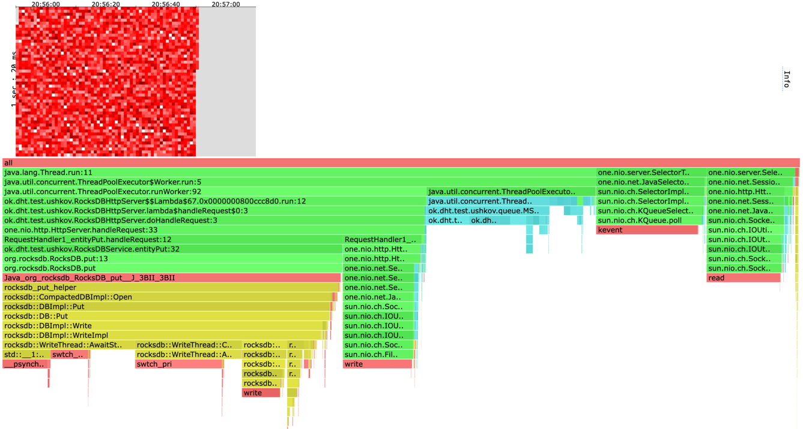

[alloc heatmap & flame graph](profiles/2022-10-04-20-55-59_new_msqueue_put_t4_c64_R70000_d1m/alloc.html)
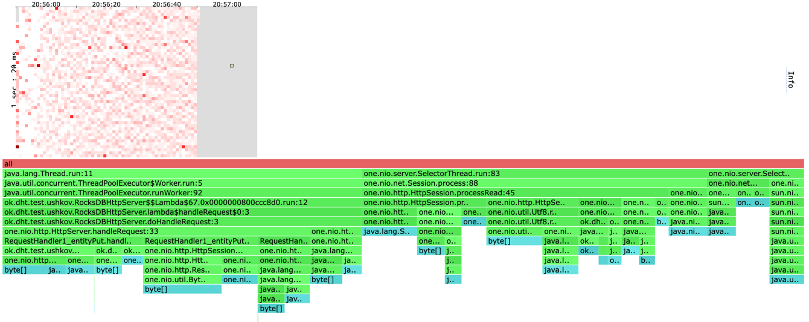

[lock flame graph](profiles/2022-10-04-20-55-59_new_msqueue_put_t4_c64_R70000_d1m/lock.html)
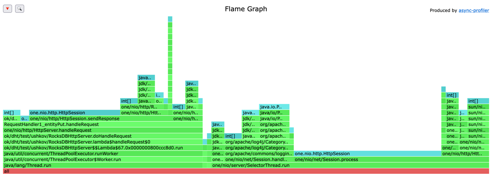

## MSQueue GET t=4 c=64 R=70000 d=1m
wrk2 output:
```
Running 1m test @ http://localhost:8000
  4 threads and 64 connections
  Thread calibration: mean lat.: 1440.392ms, rate sampling interval: 4489ms
  Thread calibration: mean lat.: 1441.453ms, rate sampling interval: 4489ms
  Thread calibration: mean lat.: 1441.053ms, rate sampling interval: 4489ms
  Thread calibration: mean lat.: 1439.894ms, rate sampling interval: 4489ms
  Thread Stats   Avg      Stdev     Max   +/- Stdev
    Latency     9.08s     4.68s   18.10s    57.25%
    Req/Sec    12.07k     1.03k   13.60k    54.55%
  Latency Distribution (HdrHistogram - Recorded Latency)
 50.000%    8.20s 
 75.000%   13.30s 
 90.000%   16.13s 
 99.000%   17.68s 
 99.900%   17.96s 
 99.990%   18.07s 
 99.999%   18.10s 
100.000%   18.12s 

  Detailed Percentile spectrum:
       Value   Percentile   TotalCount 1/(1-Percentile)

    2260.991     0.000000           12         1.00
    3401.727     0.100000       241295         1.11
    4399.103     0.200000       482226         1.25
    5488.639     0.300000       722917         1.43
    6713.343     0.400000       964367         1.67
    8196.095     0.500000      1205220         2.00
    9043.967     0.550000      1325103         2.22
   10027.007     0.600000      1445749         2.50
   11091.967     0.650000      1566077         2.86
   12214.271     0.700000      1687243         3.33
   13295.615     0.750000      1807847         4.00
   13787.135     0.775000      1867840         4.44
   14278.655     0.800000      1927689         5.00
   14753.791     0.825000      1988089         5.71
   15220.735     0.850000      2047919         6.67
   15695.871     0.875000      2108989         8.00
   15908.863     0.887500      2138920         8.89
   16130.047     0.900000      2168758        10.00
   16367.615     0.912500      2199094        11.43
   16588.799     0.925000      2228957        13.33
   16809.983     0.937500      2260784        16.00
   16908.287     0.943750      2275141        17.78
   17006.591     0.950000      2289531        20.00
   17104.895     0.956250      2303882        22.86
   17219.583     0.962500      2320804        26.67
   17317.887     0.968750      2335333        32.00
   17367.039     0.971875      2342514        35.56
   17416.191     0.975000      2349672        40.00
   17465.343     0.978125      2356757        45.71
   17530.879     0.981250      2366203        53.33
   17580.031     0.984375      2373092        64.00
   17612.799     0.985938      2377557        71.11
   17629.183     0.987500      2379758        80.00
   17661.951     0.989062      2383928        91.43
   17694.719     0.990625      2387718       106.67
   17727.487     0.992188      2391289       128.00
   17743.871     0.992969      2392879       142.22
   17760.255     0.993750      2394386       160.00
   17793.023     0.994531      2397236       182.86
   17809.407     0.995313      2398586       213.33
   17842.175     0.996094      2401063       256.00
   17842.175     0.996484      2401063       284.44
   17858.559     0.996875      2402262       320.00
   17874.943     0.997266      2403350       365.71
   17891.327     0.997656      2404308       426.67
   17907.711     0.998047      2405096       512.00
   17907.711     0.998242      2405096       568.89
   17924.095     0.998437      2405756       640.00
   17940.479     0.998633      2406341       731.43
   17956.863     0.998828      2406939       853.33
   17956.863     0.999023      2406939      1024.00
   17973.247     0.999121      2407479      1137.78
   17973.247     0.999219      2407479      1280.00
   17989.631     0.999316      2407962      1462.86
   17989.631     0.999414      2407962      1706.67
   18006.015     0.999512      2408362      2048.00
   18006.015     0.999561      2408362      2275.56
   18006.015     0.999609      2408362      2560.00
   18022.399     0.999658      2408651      2925.71
   18022.399     0.999707      2408651      3413.33
   18038.783     0.999756      2408833      4096.00
   18038.783     0.999780      2408833      4551.11
   18038.783     0.999805      2408833      5120.00
   18055.167     0.999829      2408975      5851.43
   18055.167     0.999854      2408975      6826.67
   18055.167     0.999878      2408975      8192.00
   18071.551     0.999890      2409094      9102.22
   18071.551     0.999902      2409094     10240.00
   18071.551     0.999915      2409094     11702.86
   18071.551     0.999927      2409094     13653.33
   18087.935     0.999939      2409198     16384.00
   18087.935     0.999945      2409198     18204.44
   18087.935     0.999951      2409198     20480.00
   18087.935     0.999957      2409198     23405.71
   18087.935     0.999963      2409198     27306.67
   18087.935     0.999969      2409198     32768.00
   18104.319     0.999973      2409264     36408.89
   18104.319     0.999976      2409264     40960.00
   18104.319     0.999979      2409264     46811.43
   18104.319     0.999982      2409264     54613.33
   18104.319     0.999985      2409264     65536.00
   18104.319     0.999986      2409264     72817.78
   18104.319     0.999988      2409264     81920.00
   18104.319     0.999989      2409264     93622.86
   18104.319     0.999991      2409264    109226.67
   18104.319     0.999992      2409264    131072.00
   18104.319     0.999993      2409264    145635.56
   18104.319     0.999994      2409264    163840.00
   18104.319     0.999995      2409264    187245.71
   18104.319     0.999995      2409264    218453.33
   18104.319     0.999996      2409264    262144.00
   18104.319     0.999997      2409264    291271.11
   18104.319     0.999997      2409264    327680.00
   18104.319     0.999997      2409264    374491.43
   18104.319     0.999998      2409264    436906.67
   18104.319     0.999998      2409264    524288.00
   18104.319     0.999998      2409264    582542.22
   18104.319     0.999998      2409264    655360.00
   18104.319     0.999999      2409264    748982.86
   18120.703     0.999999      2409267    873813.33
   18120.703     1.000000      2409267          inf
#[Mean    =     9084.760, StdDeviation   =     4676.027]
#[Max     =    18104.320, Total count    =      2409267]
#[Buckets =           27, SubBuckets     =         2048]
----------------------------------------------------------
  2948297 requests in 1.00m, 1.78GB read
Requests/sec:  49139.10
Transfer/sec:     30.41MB
```

[cpu heatmap & flame graph](profiles/2022-10-04-21-05-19_new_msqueue_get_t4_c64_R70000_d1m/cpu.html)
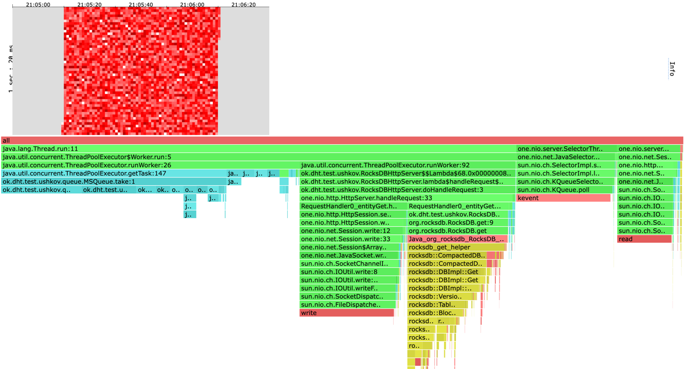

[alloc heatmap & flame graph](profiles/2022-10-04-21-05-19_new_msqueue_get_t4_c64_R70000_d1m/alloc.html)
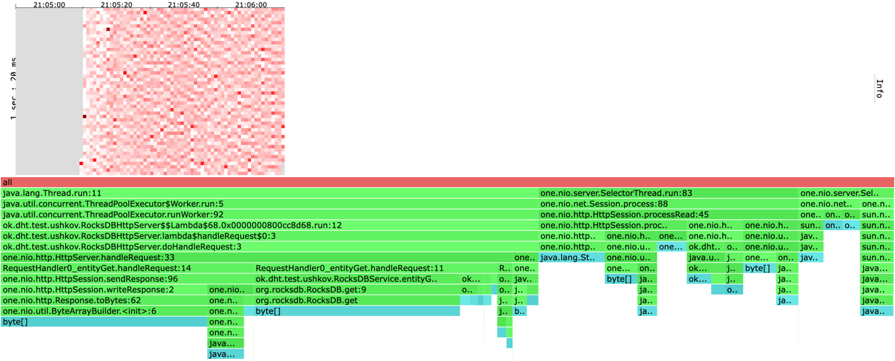

[lock flame graph](profiles/2022-10-04-21-05-19_new_msqueue_get_t4_c64_R70000_d1m/lock.html)
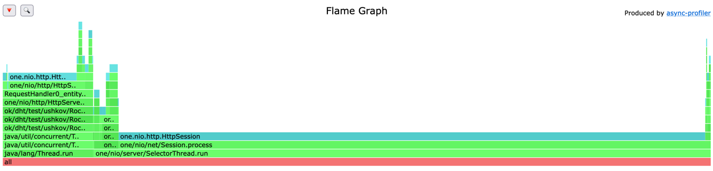


Далее идут результаты профилирования MultiQueue с 10 очередями, capacity каждой из которых равно 50.
При запсуке использовалось 2 воркера и 5 селектор тредов.
# MultiQueue PUT t=4 c=64 R=70000 d=1m
wrk2 output:
```
Running 1m test @ http://localhost:8000
  4 threads and 64 connections
  Thread calibration: mean lat.: 1786.751ms, rate sampling interval: 5447ms
  Thread calibration: mean lat.: 1787.114ms, rate sampling interval: 5455ms
  Thread calibration: mean lat.: 1788.001ms, rate sampling interval: 5443ms
  Thread calibration: mean lat.: 1781.494ms, rate sampling interval: 5431ms
  Thread Stats   Avg      Stdev     Max   +/- Stdev
    Latency     5.22s     2.01s    9.67s    61.38%
    Req/Sec    15.20k     1.18k   17.08k    66.67%
  Latency Distribution (HdrHistogram - Recorded Latency)
 50.000%    4.53s 
 75.000%    6.64s 
 90.000%    8.68s 
 99.000%    9.48s 
 99.900%    9.58s 
 99.990%    9.64s 
 99.999%    9.67s 
100.000%    9.68s 

  Detailed Percentile spectrum:
       Value   Percentile   TotalCount 1/(1-Percentile)

    2940.927     0.000000           61         1.00
    3092.479     0.100000       306714         1.11
    3262.463     0.200000       608034         1.25
    3624.959     0.300000       910605         1.43
    4118.527     0.400000      1214803         1.67
    4534.271     0.500000      1519490         2.00
    4837.375     0.550000      1670638         2.22
    5267.455     0.600000      1821098         2.50
    5853.183     0.650000      1974528         2.86
    6172.671     0.700000      2124956         3.33
    6635.519     0.750000      2276565         4.00
    6975.487     0.775000      2353353         4.44
    7196.671     0.800000      2428501         5.00
    7593.983     0.825000      2504042         5.71
    7847.935     0.850000      2580153         6.67
    8167.423     0.875000      2656329         8.00
    8421.375     0.887500      2695007         8.89
    8683.519     0.900000      2732884        10.00
    8806.399     0.912500      2770956        11.43
    8904.703     0.925000      2808959        13.33
    9019.391     0.937500      2846184        16.00
    9076.735     0.943750      2865476        17.78
    9125.887     0.950000      2884674        20.00
    9183.231     0.956250      2903997        22.86
    9248.767     0.962500      2923656        26.67
    9306.111     0.968750      2942819        32.00
    9330.687     0.971875      2951523        35.56
    9355.263     0.975000      2960120        40.00
    9379.839     0.978125      2969022        45.71
    9412.607     0.981250      2981055        53.33
    9437.183     0.984375      2990305        64.00
    9445.375     0.985938      2993317        71.11
    9461.759     0.987500      2999371        80.00
    9469.951     0.989062      3002599        91.43
    9486.335     0.990625      3008922       106.67
    9494.527     0.992188      3011989       128.00
    9502.719     0.992969      3014957       142.22
    9510.911     0.993750      3017700       160.00
    9519.103     0.994531      3020205       182.86
    9527.295     0.995313      3022440       213.33
    9535.487     0.996094      3024535       256.00
    9535.487     0.996484      3024535       284.44
    9543.679     0.996875      3026416       320.00
    9551.871     0.997266      3028289       365.71
    9551.871     0.997656      3028289       426.67
    9560.063     0.998047      3029863       512.00
    9560.063     0.998242      3029863       568.89
    9568.255     0.998437      3031172       640.00
    9568.255     0.998633      3031172       731.43
    9576.447     0.998828      3032290       853.33
    9576.447     0.999023      3032290      1024.00
    9584.639     0.999121      3033130      1137.78
    9584.639     0.999219      3033130      1280.00
    9584.639     0.999316      3033130      1462.86
    9592.831     0.999414      3033766      1706.67
    9592.831     0.999512      3033766      2048.00
    9601.023     0.999561      3034266      2275.56
    9601.023     0.999609      3034266      2560.00
    9601.023     0.999658      3034266      2925.71
    9609.215     0.999707      3034467      3413.33
    9609.215     0.999756      3034467      4096.00
    9617.407     0.999780      3034657      4551.11
    9617.407     0.999805      3034657      5120.00
    9617.407     0.999829      3034657      5851.43
    9625.599     0.999854      3034746      6826.67
    9633.791     0.999878      3034850      8192.00
    9633.791     0.999890      3034850      9102.22
    9641.983     0.999902      3034878     10240.00
    9650.175     0.999915      3034952     11702.86
    9650.175     0.999927      3034952     13653.33
    9658.367     0.999939      3035017     16384.00
    9658.367     0.999945      3035017     18204.44
    9658.367     0.999951      3035017     20480.00
    9666.559     0.999957      3035076     23405.71
    9666.559     0.999963      3035076     27306.67
    9666.559     0.999969      3035076     32768.00
    9666.559     0.999973      3035076     36408.89
    9674.751     0.999976      3035146     40960.00
    9674.751     0.999979      3035146     46811.43
    9674.751     0.999982      3035146     54613.33
    9674.751     0.999985      3035146     65536.00
    9674.751     0.999986      3035146     72817.78
    9674.751     0.999988      3035146     81920.00
    9674.751     0.999989      3035146     93622.86
    9674.751     0.999991      3035146    109226.67
    9674.751     0.999992      3035146    131072.00
    9674.751     0.999993      3035146    145635.56
    9674.751     0.999994      3035146    163840.00
    9674.751     0.999995      3035146    187245.71
    9674.751     0.999995      3035146    218453.33
    9682.943     0.999996      3035158    262144.00
    9682.943     1.000000      3035158          inf
#[Mean    =     5215.605, StdDeviation   =     2007.230]
#[Max     =     9674.752, Total count    =      3035158]
#[Buckets =           27, SubBuckets     =         2048]
----------------------------------------------------------
  3529577 requests in 1.00m, 225.53MB read
Requests/sec:  58827.04
Transfer/sec:      3.76MB
```

[cpu heatmap & flame graph](profiles/2022-10-05-20-40-59_new_multiqueue_w2_q10_put_t4_c64_R70000_d1m/cpu.html)
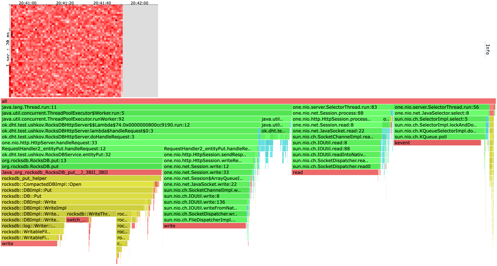

[alloc heatmap & flame graph](profiles/2022-10-05-20-40-59_new_multiqueue_w2_q10_put_t4_c64_R70000_d1m/alloc.html)
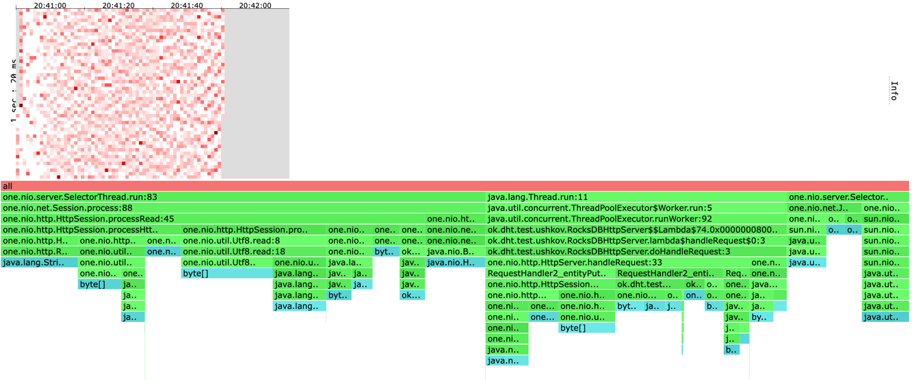

[lock flame graph](profiles/2022-10-05-20-40-59_new_multiqueue_w2_q10_put_t4_c64_R70000_d1m/lock.html)
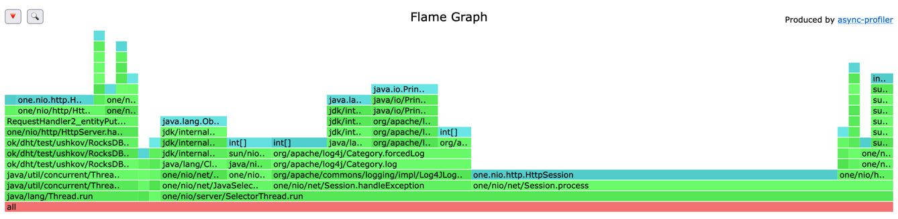

# MultiQueue GET t=4 c=64 R=70000 d=1m
wrk2 output:
```
Running 1m test @ http://localhost:8000
  4 threads and 64 connections
  Thread calibration: mean lat.: 1114.893ms, rate sampling interval: 3958ms
  Thread calibration: mean lat.: 1115.066ms, rate sampling interval: 3969ms
  Thread calibration: mean lat.: 1146.788ms, rate sampling interval: 4022ms
  Thread calibration: mean lat.: 1113.764ms, rate sampling interval: 3958ms
  Thread Stats   Avg      Stdev     Max   +/- Stdev
    Latency     3.74s     1.05s    6.55s    79.60%
    Req/Sec    16.19k     1.05k   17.48k    58.33%
  Latency Distribution (HdrHistogram - Recorded Latency)
 50.000%    3.25s 
 75.000%    4.24s 
 90.000%    5.61s 
 99.000%    6.41s 
 99.900%    6.51s 
 99.990%    6.54s 
 99.999%    6.55s 
100.000%    6.55s 

  Detailed Percentile spectrum:
       Value   Percentile   TotalCount 1/(1-Percentile)

    2494.463     0.000000            2         1.00
    2795.519     0.100000       323908         1.11
    2916.351     0.200000       650132         1.25
    3059.711     0.300000       968421         1.43
    3192.831     0.400000      1291645         1.67
    3252.223     0.500000      1620443         2.00
    3305.471     0.550000      1772655         2.22
    3442.687     0.600000      1935136         2.50
    3610.623     0.650000      2094602         2.86
    3878.911     0.700000      2255683         3.33
    4235.263     0.750000      2417448         4.00
    4468.735     0.775000      2498010         4.44
    4739.071     0.800000      2578276         5.00
    4935.679     0.825000      2658493         5.71
    5177.343     0.850000      2739608         6.67
    5406.719     0.875000      2819283         8.00
    5513.215     0.887500      2860782         8.89
    5607.423     0.900000      2900907        10.00
    5705.727     0.912500      2940853        11.43
    5816.319     0.925000      2980483        13.33
    5935.103     0.937500      3020901        16.00
    6000.639     0.943750      3041711        17.78
    6062.079     0.950000      3061473        20.00
    6127.615     0.956250      3081791        22.86
    6184.959     0.962500      3101970        26.67
    6242.303     0.968750      3122689        32.00
    6266.879     0.971875      3132132        35.56
    6291.455     0.975000      3141693        40.00
    6316.031     0.978125      3151534        45.71
    6340.607     0.981250      3161557        53.33
    6365.183     0.984375      3171950        64.00
    6377.471     0.985938      3177203        71.11
    6389.759     0.987500      3182701        80.00
    6402.047     0.989062      3188011        91.43
    6410.239     0.990625      3191767       106.67
    6426.623     0.992188      3197802       128.00
    6430.719     0.992969      3199194       142.22
    6438.911     0.993750      3201921       160.00
    6447.103     0.994531      3204537       182.86
    6455.295     0.995313      3207067       213.33
    6463.487     0.996094      3209340       256.00
    6471.679     0.996484      3211396       284.44
    6475.775     0.996875      3212336       320.00
    6479.871     0.997266      3213248       365.71
    6488.063     0.997656      3214952       426.67
    6492.159     0.998047      3215734       512.00
    6496.255     0.998242      3216515       568.89
    6500.351     0.998437      3217235       640.00
    6504.447     0.998633      3217899       731.43
    6508.543     0.998828      3218542       853.33
    6512.639     0.999023      3219142      1024.00
    6512.639     0.999121      3219142      1137.78
    6516.735     0.999219      3219656      1280.00
    6516.735     0.999316      3219656      1462.86
    6520.831     0.999414      3220123      1706.67
    6524.927     0.999512      3220531      2048.00
    6524.927     0.999561      3220531      2275.56
    6529.023     0.999609      3220921      2560.00
    6529.023     0.999658      3220921      2925.71
    6529.023     0.999707      3220921      3413.33
    6533.119     0.999756      3221218      4096.00
    6533.119     0.999780      3221218      4551.11
    6533.119     0.999805      3221218      5120.00
    6537.215     0.999829      3221473      5851.43
    6537.215     0.999854      3221473      6826.67
    6537.215     0.999878      3221473      8192.00
    6537.215     0.999890      3221473      9102.22
    6541.311     0.999902      3221649     10240.00
    6541.311     0.999915      3221649     11702.86
    6541.311     0.999927      3221649     13653.33
    6541.311     0.999939      3221649     16384.00
    6541.311     0.999945      3221649     18204.44
    6541.311     0.999951      3221649     20480.00
    6545.407     0.999957      3221751     23405.71
    6545.407     0.999963      3221751     27306.67
    6545.407     0.999969      3221751     32768.00
    6545.407     0.999973      3221751     36408.89
    6545.407     0.999976      3221751     40960.00
    6545.407     0.999979      3221751     46811.43
    6545.407     0.999982      3221751     54613.33
    6549.503     0.999985      3221796     65536.00
    6549.503     0.999986      3221796     72817.78
    6549.503     0.999988      3221796     81920.00
    6549.503     0.999989      3221796     93622.86
    6549.503     0.999991      3221796    109226.67
    6549.503     0.999992      3221796    131072.00
    6549.503     0.999993      3221796    145635.56
    6549.503     0.999994      3221796    163840.00
    6549.503     0.999995      3221796    187245.71
    6549.503     0.999995      3221796    218453.33
    6549.503     0.999996      3221796    262144.00
    6549.503     0.999997      3221796    291271.11
    6553.599     0.999997      3221806    327680.00
    6553.599     1.000000      3221806          inf
#[Mean    =     3735.992, StdDeviation   =     1053.721]
#[Max     =     6549.504, Total count    =      3221806]
#[Buckets =           27, SubBuckets     =         2048]
----------------------------------------------------------
  3727428 requests in 1.00m, 2.26GB read
Requests/sec:  62125.03
Transfer/sec:     38.63MB
```

[cpu heatmap & flame graph](profiles/2022-10-05-21-34-30_new_multiqueue_w2_q10_get_t4_c64_R70000_d1m/cpu.html)
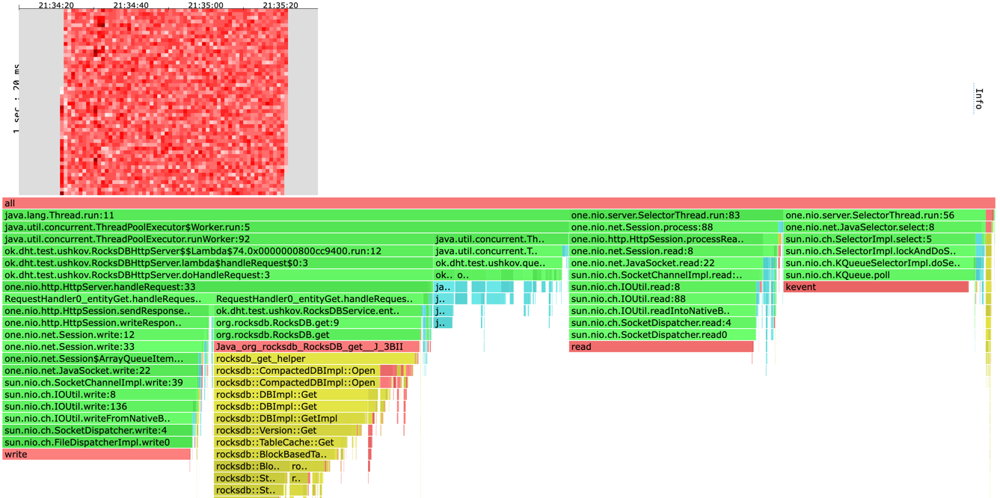

[alloc heatmap & flame graph](profiles/2022-10-05-21-34-30_new_multiqueue_w2_q10_get_t4_c64_R70000_d1m/alloc.html)
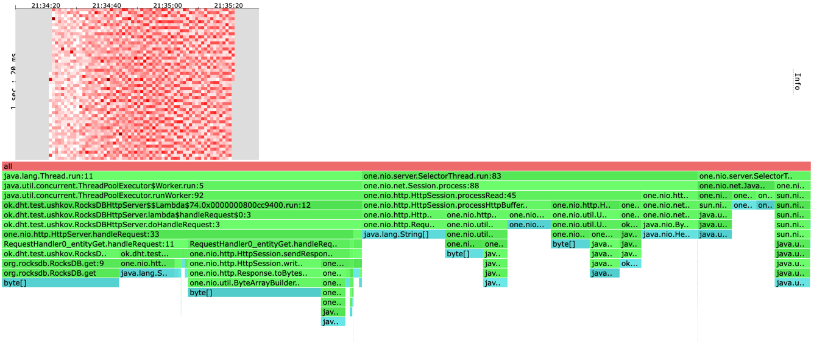

[lock flame graph](profiles/2022-10-05-21-34-30_new_multiqueue_w2_q10_get_t4_c64_R70000_d1m/lock.html)
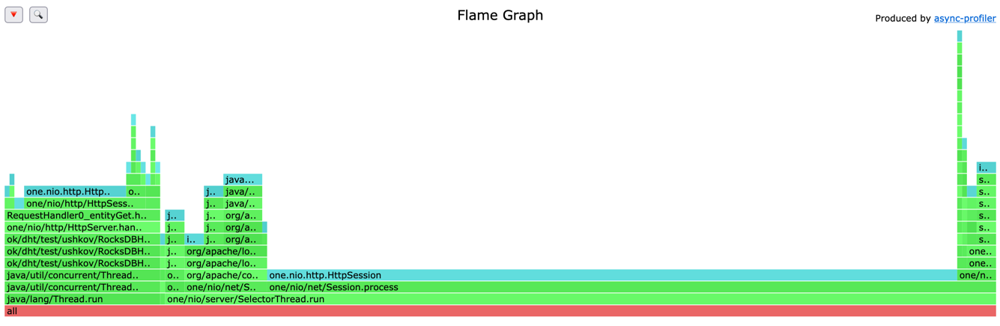

## Наблюдения
* В случае с методом PUT на новой реализации с очередью RPS выросла на 5.6%.
* В случае с методом PUT на новой реализации со стеком RPS не выросла значительно.
* В случае с методом GET все новые реализации показали результат строго хуже. У всех RPS упал примерно на 6%.
* В случае с очередью и стеком на CPU Flame Graph-ах видно, что 20-25% времени уходит на синхронизацию.
* В случае с очередью и стеком на Lock Flame Graph-ах видно, что 70-90% локов уходит на Thread Pool.
* По аллокациям значительно ничего не поменялось.
* У очереди Майкла Скотта очень много времени уходит на взятие элемента из головы очереди. От 20% до 33%.
* В случае использования очереди Майкла Скотта процент взятых блокировок в Thread Pool-е сократился до 30%.
* В случае использования MultiQueue RPS на PUT вырос на 9.4%. На GET RPS незначительно уменьшился.
* В случае использования MultiQueue 6% времени тратится на синхронизацию в Thread Pool-е и в нем берется 15% локов.

## Выводы
* Многие проблемы у реализаций с очередью и стеком, такие как незначительный рост RPS в случае PUT или вообще уменьшение RPS в случае GET, 
скорее всего связаны с затратами на синхронизацию. Данную проблему возможно удасться решить при помощи неблокирующей очереди.
* Неблокирующая очередь Майкла Скотта оказалась не лучше старой реализации. У этого возможны две причины.
Первая это то, что наша очередь неограничена и те запросы, что появились там давно успели устареть.
Вторая причина в том, что в очереди Майкла Скотта операцию "взять элемент" довольно медленна из-за
конкуренции потоков за голову очереди.
* MultiQueue показала результат немного лучше обычной блокирующей очереди. 
Стоит протестировать ее на большем числе потоков с большим количество очередей внутри.
