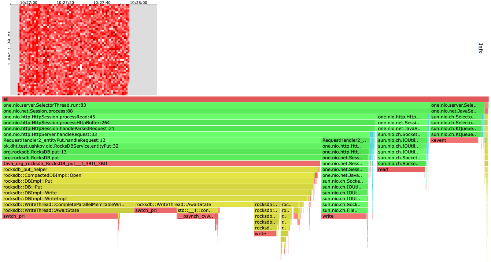

# Отчет

Обратите внимание:
* При профилировании метода GET бд наполнялась 2 млн пар ключ-значение и имела размер 1GB.
* При профилировании метода PUT бд изначально была пустой.
* Использовались две реализации очереди: Queue (LinkedBlockingQueue) и Stack (на основе LinkedBlockingDeque).
* Скрипты для wrk2: [get](scripts/get.lua) и [put](scripts/put.lua)

# Профилирование

Результаты профилирования на старой реализации.
Заголовок в формате `<Метод> t=<количество потоков wrk2> с=<количество соединений wrk2> R=<RPS для wrk2> d=<время профилирования>`.

## PUT t=4 c=64 R=70000 d=1m
wrk2 output:
```
Running 1m test @ http://localhost:8000
  4 threads and 64 connections
  Thread calibration: mean lat.: 1230.792ms, rate sampling interval: 4968ms
  Thread calibration: mean lat.: 1214.462ms, rate sampling interval: 4882ms
  Thread calibration: mean lat.: 1221.378ms, rate sampling interval: 4911ms
  Thread calibration: mean lat.: 1235.925ms, rate sampling interval: 5005ms
  Thread Stats   Avg      Stdev     Max   +/- Stdev
    Latency     7.15s     2.90s   16.03s    67.37%
    Req/Sec    13.65k     1.98k   16.02k    76.92%
  Latency Distribution (HdrHistogram - Recorded Latency)
 50.000%    6.80s 
 75.000%    9.00s 
 90.000%   11.37s 
 99.000%   14.64s 
 99.900%   15.65s 
 99.990%   15.93s 
 99.999%   16.02s 
100.000%   16.04s 

  Detailed Percentile spectrum:
       Value   Percentile   TotalCount 1/(1-Percentile)

    2330.623     0.000000           10         1.00
    3770.367     0.100000       270613         1.11
    4493.311     0.200000       541591         1.25
    5079.039     0.300000       811004         1.43
    5931.007     0.400000      1080340         1.67
    6803.455     0.500000      1351276         2.00
    7110.655     0.550000      1486637         2.22
    7491.583     0.600000      1621330         2.50
    7950.335     0.650000      1755590         2.86
    8445.951     0.700000      1891828         3.33
    9003.007     0.750000      2026180         4.00
    9306.111     0.775000      2094751         4.44
    9576.447     0.800000      2161377         5.00
    9879.551     0.825000      2228177         5.71
   10231.807     0.850000      2296483         6.67
   10715.135     0.875000      2362986         8.00
   11034.623     0.887500      2397516         8.89
   11370.495     0.900000      2431093        10.00
   11763.711     0.912500      2464622        11.43
   12148.735     0.925000      2497927        13.33
   12558.335     0.937500      2532143        16.00
   12754.943     0.943750      2549133        17.78
   12951.551     0.950000      2565521        20.00
   13164.543     0.956250      2582710        22.86
   13369.343     0.962500      2599275        26.67
   13590.527     0.968750      2616385        32.00
   13713.407     0.971875      2624996        35.56
   13836.287     0.975000      2633388        40.00
   13959.167     0.978125      2641576        45.71
   14106.623     0.981250      2649993        53.33
   14278.655     0.984375      2658309        64.00
   14376.959     0.985938      2662708        71.11
   14475.263     0.987500      2666793        80.00
   14581.759     0.989062      2671142        91.43
   14688.255     0.990625      2675469       106.67
   14794.751     0.992188      2679619       128.00
   14852.095     0.992969      2681708       142.22
   14917.631     0.993750      2683782       160.00
   14991.359     0.994531      2685891       182.86
   15065.087     0.995313      2687822       213.33
   15163.391     0.996094      2689986       256.00
   15212.543     0.996484      2690974       284.44
   15278.079     0.996875      2692108       320.00
   15335.423     0.997266      2693103       365.71
   15392.767     0.997656      2694128       426.67
   15466.495     0.998047      2695300       512.00
   15499.263     0.998242      2695795       568.89
   15532.031     0.998437      2696280       640.00
   15564.799     0.998633      2696791       731.43
   15605.759     0.998828      2697330       853.33
   15646.719     0.999023      2697828      1024.00
   15671.295     0.999121      2698099      1137.78
   15695.871     0.999219      2698374      1280.00
   15720.447     0.999316      2698647      1462.86
   15745.023     0.999414      2698876      1706.67
   15777.791     0.999512      2699167      2048.00
   15794.175     0.999561      2699308      2275.56
   15810.559     0.999609      2699461      2560.00
   15826.943     0.999658      2699572      2925.71
   15843.327     0.999707      2699684      3413.33
   15859.711     0.999756      2699788      4096.00
   15876.095     0.999780      2699889      4551.11
   15884.287     0.999805      2699947      5120.00
   15892.479     0.999829      2699995      5851.43
   15908.863     0.999854      2700101      6826.67
   15917.055     0.999878      2700150      8192.00
   15925.247     0.999890      2700191      9102.22
   15925.247     0.999902      2700191     10240.00
   15933.439     0.999915      2700223     11702.86
   15941.631     0.999927      2700260     13653.33
   15949.823     0.999939      2700288     16384.00
   15958.015     0.999945      2700314     18204.44
   15966.207     0.999951      2700331     20480.00
   15974.399     0.999957      2700357     23405.71
   15974.399     0.999963      2700357     27306.67
   15982.591     0.999969      2700374     32768.00
   15982.591     0.999973      2700374     36408.89
   15990.783     0.999976      2700387     40960.00
   15998.975     0.999979      2700397     46811.43
   16007.167     0.999982      2700407     54613.33
   16007.167     0.999985      2700407     65536.00
   16015.359     0.999986      2700418     72817.78
   16015.359     0.999988      2700418     81920.00
   16023.551     0.999989      2700433     93622.86
   16023.551     0.999991      2700433    109226.67
   16023.551     0.999992      2700433    131072.00
   16023.551     0.999993      2700433    145635.56
   16023.551     0.999994      2700433    163840.00
   16023.551     0.999995      2700433    187245.71
   16031.743     0.999995      2700444    218453.33
   16031.743     0.999996      2700444    262144.00
   16031.743     0.999997      2700444    291271.11
   16031.743     0.999997      2700444    327680.00
   16031.743     0.999997      2700444    374491.43
   16031.743     0.999998      2700444    436906.67
   16031.743     0.999998      2700444    524288.00
   16031.743     0.999998      2700444    582542.22
   16031.743     0.999998      2700444    655360.00
   16031.743     0.999999      2700444    748982.86
   16031.743     0.999999      2700444    873813.33
   16039.935     0.999999      2700447   1048576.00
   16039.935     1.000000      2700447          inf
#[Mean    =     7150.044, StdDeviation   =     2896.433]
#[Max     =    16031.744, Total count    =      2700447]
#[Buckets =           27, SubBuckets     =         2048]
----------------------------------------------------------
  3189655 requests in 1.00m, 203.81MB read
Requests/sec:  53161.42
Transfer/sec:      3.40MB
```

[cpu heatmap & flame graph](profiles/2022-10-04-10-27-04_old_put_t4_c64_R70000_d1m/cpu.html)


[alloc heatmap & flame graph](profiles/2022-10-04-10-27-04_old_put_t4_c64_R70000_d1m/alloc.html)


[lock flame graph](profiles/2022-10-04-10-27-04_old_put_t4_c64_R70000_d1m/lock.html)


## GET t=4 c=64 R=70000 d=1m
wrk2 output:
```
Running 1m test @ http://localhost:8000
  4 threads and 64 connections
  Thread calibration: mean lat.: 4.896ms, rate sampling interval: 29ms
  Thread calibration: mean lat.: 4.706ms, rate sampling interval: 27ms
  Thread calibration: mean lat.: 4.696ms, rate sampling interval: 27ms
  Thread calibration: mean lat.: 4.768ms, rate sampling interval: 28ms
  Thread Stats   Avg      Stdev     Max   +/- Stdev
    Latency     2.56s     1.77s    4.80s    53.32%
    Req/Sec    16.19k     2.63k   27.46k    78.52%
  Latency Distribution (HdrHistogram - Recorded Latency)
 50.000%    3.13s 
 75.000%    4.12s 
 90.000%    4.51s 
 99.000%    4.67s 
 99.900%    4.78s 
 99.990%    4.80s 
 99.999%    4.80s 
100.000%    4.80s 

  Detailed Percentile spectrum:
       Value   Percentile   TotalCount 1/(1-Percentile)

       0.050     0.000000            1         1.00
       1.333     0.100000       317451         1.11
       2.405     0.200000       634498         1.25
    1150.975     0.300000       951663         1.43
    2584.575     0.400000      1269479         1.67
    3125.247     0.500000      1586417         2.00
    3504.127     0.550000      1745282         2.22
    3639.295     0.600000      1903841         2.50
    3844.095     0.650000      2063443         2.86
    4009.983     0.700000      2221428         3.33
    4124.671     0.750000      2381297         4.00
    4171.775     0.775000      2460453         4.44
    4235.263     0.800000      2538738         5.00
    4366.335     0.825000      2620802         5.71
    4427.775     0.850000      2702289         6.67
    4468.735     0.875000      2776977         8.00
    4489.215     0.887500      2817738         8.89
    4505.599     0.900000      2857750        10.00
    4526.079     0.912500      2900980        11.43
    4542.463     0.925000      2940885        13.33
    4558.847     0.937500      2980724        16.00
    4567.039     0.943750      2996945        17.78
    4579.327     0.950000      3021482        20.00
    4587.519     0.956250      3037541        22.86
    4595.711     0.962500      3054861        26.67
    4607.999     0.968750      3073958        32.00
    4616.191     0.971875      3083505        35.56
    4624.383     0.975000      3095998        40.00
    4632.575     0.978125      3108091        45.71
    4636.671     0.981250      3113696        53.33
    4648.959     0.984375      3123726        64.00
    4657.151     0.985938      3128778        71.11
    4661.247     0.987500      3132524        80.00
    4669.439     0.989062      3139169        91.43
    4677.631     0.990625      3143685       106.67
    4685.823     0.992188      3148075       128.00
    4689.919     0.992969      3150761       142.22
    4694.015     0.993750      3153620       160.00
    4698.111     0.994531      3155436       182.86
    4706.303     0.995313      3157855       213.33
    4714.495     0.996094      3159734       256.00
    4718.591     0.996484      3160968       284.44
    4722.687     0.996875      3162378       320.00
    4726.783     0.997266      3163901       365.71
    4730.879     0.997656      3165141       426.67
    4734.975     0.998047      3166205       512.00
    4739.071     0.998242      3166827       568.89
    4743.167     0.998437      3167195       640.00
    4759.551     0.998633      3167749       731.43
    4780.031     0.998828      3168859       853.33
    4784.127     0.999023      3170150      1024.00
    4784.127     0.999121      3170150      1137.78
    4784.127     0.999219      3170150      1280.00
    4784.127     0.999316      3170150      1462.86
    4784.127     0.999414      3170150      1706.67
    4788.223     0.999512      3170932      2048.00
    4788.223     0.999561      3170932      2275.56
    4788.223     0.999609      3170932      2560.00
    4788.223     0.999658      3170932      2925.71
    4792.319     0.999707      3171502      3413.33
    4792.319     0.999756      3171502      4096.00
    4792.319     0.999780      3171502      4551.11
    4792.319     0.999805      3171502      5120.00
    4792.319     0.999829      3171502      5851.43
    4796.415     0.999854      3171822      6826.67
    4796.415     0.999878      3171822      8192.00
    4796.415     0.999890      3171822      9102.22
    4796.415     0.999902      3171822     10240.00
    4796.415     0.999915      3171822     11702.86
    4796.415     0.999927      3171822     13653.33
    4796.415     0.999939      3171822     16384.00
    4800.511     0.999945      3172000     18204.44
    4800.511     1.000000      3172000          inf
#[Mean    =     2563.501, StdDeviation   =     1774.584]
#[Max     =     4796.416, Total count    =      3172000]
#[Buckets =           27, SubBuckets     =         2048]
----------------------------------------------------------
  3874814 requests in 1.00m, 2.35GB read
Requests/sec:  64580.78
Transfer/sec:     40.19MB
```

[cpu heatmap & flame graph](profiles/2022-10-04-10-42-45_old_get_t4_c64_R70000_d1m/cpu.html)


[alloc heatmap & flame graph](profiles/2022-10-04-10-42-45_old_get_t4_c64_R70000_d1m/alloc.html)


[lock flame graph](profiles/2022-10-04-10-42-45_old_get_t4_c64_R70000_d1m/lock.html)


Далее следуют результаты профилорвания.
Заголовок в формате `<Очередь> <Метод> t=<количество потоков wrk2> с=<количество соединений wrk2> R=<RPS для wrk2> d=<время профилирования>`.

## Queue PUT t=4 c=64 R=70000 d=1m
wrk2 output:
```
Running 1m test @ http://localhost:8000
  4 threads and 64 connections
  Thread calibration: mean lat.: 208.722ms, rate sampling interval: 929ms
  Thread calibration: mean lat.: 233.200ms, rate sampling interval: 940ms
  Thread calibration: mean lat.: 209.424ms, rate sampling interval: 932ms
  Thread calibration: mean lat.: 208.130ms, rate sampling interval: 925ms
  Thread Stats   Avg      Stdev     Max   +/- Stdev
    Latency     4.93s     3.74s   11.49s    56.01%
    Req/Sec    13.68k     2.12k   16.69k    73.58%
  Latency Distribution (HdrHistogram - Recorded Latency)
 50.000%    3.28s 
 75.000%    9.02s 
 90.000%   10.53s 
 99.000%   11.30s 
 99.900%   11.44s 
 99.990%   11.49s 
 99.999%   11.50s 
100.000%   11.50s 

  Detailed Percentile spectrum:
       Value   Percentile   TotalCount 1/(1-Percentile)

     510.975     0.000000            7         1.00
     841.727     0.100000       273093         1.11
    1350.655     0.200000       546261         1.25
    1934.335     0.300000       819007         1.43
    2510.847     0.400000      1092233         1.67
    3280.895     0.500000      1365481         2.00
    4065.279     0.550000      1501445         2.22
    5525.503     0.600000      1637788         2.50
    6660.095     0.650000      1774270         2.86
    7774.207     0.700000      1911223         3.33
    9019.391     0.750000      2047483         4.00
    9314.303     0.775000      2116420         4.44
    9633.791     0.800000      2183864         5.00
    9904.127     0.825000      2252874         5.71
   10133.503     0.850000      2321689         6.67
   10313.727     0.875000      2391066         8.00
   10412.031     0.887500      2423311         8.89
   10526.719     0.900000      2457077        10.00
   10657.791     0.912500      2492357        11.43
   10772.479     0.925000      2525245        13.33
   10895.359     0.937500      2560818        16.00
   10952.703     0.943750      2576840        17.78
   11010.047     0.950000      2594588        20.00
   11059.199     0.956250      2611746        22.86
   11100.159     0.962500      2628256        26.67
   11141.119     0.968750      2646718        32.00
   11157.503     0.971875      2654228        35.56
   11173.887     0.975000      2661446        40.00
   11198.463     0.978125      2671536        45.71
   11223.039     0.981250      2680470        53.33
   11247.615     0.984375      2688237        64.00
   11263.999     0.985938      2692680        71.11
   11280.383     0.987500      2696956        80.00
   11296.767     0.989062      2700956        91.43
   11313.151     0.990625      2704657       106.67
   11337.727     0.992188      2709869       128.00
   11345.919     0.992969      2711534       142.22
   11354.111     0.993750      2713187       160.00
   11362.303     0.994531      2714733       182.86
   11378.687     0.995313      2717930       213.33
   11386.879     0.996094      2719438       256.00
   11395.071     0.996484      2720895       284.44
   11403.263     0.996875      2722255       320.00
   11403.263     0.997266      2722255       365.71
   11411.455     0.997656      2723541       426.67
   11419.647     0.998047      2724624       512.00
   11427.839     0.998242      2725655       568.89
   11427.839     0.998437      2725655       640.00
   11436.031     0.998633      2726547       731.43
   11436.031     0.998828      2726547       853.33
   11444.223     0.999023      2727274      1024.00
   11444.223     0.999121      2727274      1137.78
   11452.415     0.999219      2727920      1280.00
   11452.415     0.999316      2727920      1462.86
   11460.607     0.999414      2728457      1706.67
   11460.607     0.999512      2728457      2048.00
   11460.607     0.999561      2728457      2275.56
   11468.799     0.999609      2728880      2560.00
   11468.799     0.999658      2728880      2925.71
   11468.799     0.999707      2728880      3413.33
   11476.991     0.999756      2729154      4096.00
   11476.991     0.999780      2729154      4551.11
   11476.991     0.999805      2729154      5120.00
   11476.991     0.999829      2729154      5851.43
   11485.183     0.999854      2729405      6826.67
   11485.183     0.999878      2729405      8192.00
   11485.183     0.999890      2729405      9102.22
   11485.183     0.999902      2729405     10240.00
   11485.183     0.999915      2729405     11702.86
   11485.183     0.999927      2729405     13653.33
   11493.375     0.999939      2729554     16384.00
   11493.375     0.999945      2729554     18204.44
   11493.375     0.999951      2729554     20480.00
   11493.375     0.999957      2729554     23405.71
   11493.375     0.999963      2729554     27306.67
   11493.375     0.999969      2729554     32768.00
   11493.375     0.999973      2729554     36408.89
   11493.375     0.999976      2729554     40960.00
   11493.375     0.999979      2729554     46811.43
   11493.375     0.999982      2729554     54613.33
   11493.375     0.999985      2729554     65536.00
   11493.375     0.999986      2729554     72817.78
   11493.375     0.999988      2729554     81920.00
   11501.567     0.999989      2729586     93622.86
   11501.567     1.000000      2729586          inf
#[Mean    =     4928.764, StdDeviation   =     3738.122]
#[Max     =    11493.376, Total count    =      2729586]
#[Buckets =           27, SubBuckets     =         2048]
----------------------------------------------------------
  3379572 requests in 1.00m, 215.94MB read
Requests/sec:  56326.70
Transfer/sec:      3.60MB
```

[cpu heatmap & flame graph](profiles/2022-10-04-10-24-46_new_queue_put_t4_c64_R70000_d1m/cpu.html)


[alloc heatmap & flame graph](profiles/2022-10-04-10-24-46_new_queue_put_t4_c64_R70000_d1m/alloc.html)


[lock flame graph](profiles/2022-10-04-10-24-46_new_queue_put_t4_c64_R70000_d1m/lock.html)


## Stack PUT t=4 c=64 R=70000 d=1m
wrk2 output:
```
Running 1m test @ http://localhost:8000
  4 threads and 64 connections
  Thread calibration: mean lat.: 1414.593ms, rate sampling interval: 5894ms
  Thread calibration: mean lat.: 1525.087ms, rate sampling interval: 6635ms
  Thread calibration: mean lat.: 1471.101ms, rate sampling interval: 5971ms
  Thread calibration: mean lat.: 1518.675ms, rate sampling interval: 6332ms
  Thread Stats   Avg      Stdev     Max   +/- Stdev
    Latency     8.98s     3.09s   14.98s    59.15%
    Req/Sec    13.73k   644.53    14.50k    76.67%
  Latency Distribution (HdrHistogram - Recorded Latency)
 50.000%    9.18s 
 75.000%   11.64s 
 90.000%   13.03s 
 99.000%   14.24s 
 99.900%   14.74s 
 99.990%   14.93s 
 99.999%   14.98s 
100.000%   14.99s 

  Detailed Percentile spectrum:
       Value   Percentile   TotalCount 1/(1-Percentile)

    2330.623     0.000000            9         1.00
    4755.455     0.100000       275847         1.11
    5824.511     0.200000       551504         1.25
    6877.183     0.300000       827108         1.43
    7864.319     0.400000      1102733         1.67
    9183.231     0.500000      1378314         2.00
    9822.207     0.550000      1516230         2.22
   10330.111     0.600000      1654908         2.50
   10780.671     0.650000      1793191         2.86
   11206.655     0.700000      1930411         3.33
   11640.831     0.750000      2069700         4.00
   11853.823     0.775000      2136021         4.44
   12083.199     0.800000      2205501         5.00
   12328.959     0.825000      2276202         5.71
   12558.335     0.850000      2343235         6.67
   12787.711     0.875000      2413672         8.00
   12902.399     0.887500      2447256         8.89
   13025.279     0.900000      2482265        10.00
   13148.159     0.912500      2515676        11.43
   13287.423     0.925000      2551435        13.33
   13418.495     0.937500      2585679        16.00
   13484.031     0.943750      2601888        17.78
   13557.759     0.950000      2619964        20.00
   13623.295     0.956250      2635677        22.86
   13705.215     0.962500      2653421        26.67
   13803.519     0.968750      2670698        32.00
   13852.671     0.971875      2679609        35.56
   13901.823     0.975000      2688115        40.00
   13950.975     0.978125      2695725        45.71
   14016.511     0.981250      2704778        53.33
   14090.239     0.984375      2713671        64.00
   14123.007     0.985938      2717536        71.11
   14163.967     0.987500      2722074        80.00
   14204.927     0.989062      2725864        91.43
   14262.271     0.990625      2730686       106.67
   14319.615     0.992188      2734880       128.00
   14352.383     0.992969      2737212       142.22
   14376.959     0.993750      2739075       160.00
   14409.727     0.994531      2741298       182.86
   14442.495     0.995313      2743330       213.33
   14491.647     0.996094      2745463       256.00
   14516.223     0.996484      2746482       284.44
   14540.799     0.996875      2747384       320.00
   14573.567     0.997266      2748497       365.71
   14606.335     0.997656      2749650       426.67
   14639.103     0.998047      2750794       512.00
   14655.487     0.998242      2751264       568.89
   14680.063     0.998437      2751816       640.00
   14704.639     0.998633      2752414       731.43
   14721.023     0.998828      2752848       853.33
   14745.599     0.999023      2753430      1024.00
   14753.791     0.999121      2753601      1137.78
   14770.175     0.999219      2753882      1280.00
   14786.559     0.999316      2754125      1462.86
   14811.135     0.999414      2754445      1706.67
   14827.519     0.999512      2754681      2048.00
   14835.711     0.999561      2754812      2275.56
   14843.903     0.999609      2754945      2560.00
   14852.095     0.999658      2755087      2925.71
   14860.287     0.999707      2755225      3413.33
   14876.671     0.999756      2755406      4096.00
   14876.671     0.999780      2755406      4551.11
   14884.863     0.999805      2755487      5120.00
   14893.055     0.999829      2755523      5851.43
   14909.439     0.999854      2755612      6826.67
   14925.823     0.999878      2755683      8192.00
   14934.015     0.999890      2755718      9102.22
   14942.207     0.999902      2755747     10240.00
   14950.399     0.999915      2755799     11702.86
   14950.399     0.999927      2755799     13653.33
   14958.591     0.999939      2755834     16384.00
   14966.783     0.999945      2755876     18204.44
   14966.783     0.999951      2755876     20480.00
   14966.783     0.999957      2755876     23405.71
   14974.975     0.999963      2755917     27306.67
   14974.975     0.999969      2755917     32768.00
   14974.975     0.999973      2755917     36408.89
   14983.167     0.999976      2755971     40960.00
   14983.167     0.999979      2755971     46811.43
   14983.167     0.999982      2755971     54613.33
   14983.167     0.999985      2755971     65536.00
   14983.167     0.999986      2755971     72817.78
   14983.167     0.999988      2755971     81920.00
   14983.167     0.999989      2755971     93622.86
   14983.167     0.999991      2755971    109226.67
   14983.167     0.999992      2755971    131072.00
   14991.359     0.999993      2755992    145635.56
   14991.359     1.000000      2755992          inf
#[Mean    =     8979.930, StdDeviation   =     3086.154]
#[Max     =    14983.168, Total count    =      2755992]
#[Buckets =           27, SubBuckets     =         2048]
----------------------------------------------------------
  3230934 requests in 1.00m, 206.44MB read
Requests/sec:  53849.29
Transfer/sec:      3.44MB
```

[cpu heatmap & flame graph](profiles/2022-10-04-10-29-41_new_stack_put_t4_c64_R70000_d1m/cpu.html)


[alloc heatmap & flame graph](profiles/2022-10-04-10-29-41_new_stack_put_t4_c64_R70000_d1m/alloc.html)


[lock flame graph](profiles/2022-10-04-10-29-41_new_stack_put_t4_c64_R70000_d1m/lock.html)


## Queue GET t=4 c=64 R=70000 d=1m
wrk2 output:
```
Running 1m test @ http://localhost:8000
  4 threads and 64 connections
  Thread calibration: mean lat.: 1663.295ms, rate sampling interval: 4820ms
  Thread calibration: mean lat.: 1664.076ms, rate sampling interval: 4825ms
  Thread calibration: mean lat.: 1660.000ms, rate sampling interval: 4820ms
  Thread calibration: mean lat.: 1658.495ms, rate sampling interval: 4816ms
  Thread Stats   Avg      Stdev     Max   +/- Stdev
    Latency     6.05s     1.94s    8.95s    57.54%
    Req/Sec    15.26k   752.84    15.90k    80.00%
  Latency Distribution (HdrHistogram - Recorded Latency)
 50.000%    6.37s 
 75.000%    7.82s 
 90.000%    8.48s 
 99.000%    8.86s 
 99.900%    8.93s 
 99.990%    8.95s 
 99.999%    8.95s 
100.000%    8.95s 

  Detailed Percentile spectrum:
       Value   Percentile   TotalCount 1/(1-Percentile)

    2574.335     0.000000            1         1.00
    3239.935     0.100000       307156         1.11
    3815.423     0.200000       611812         1.25
    4411.391     0.300000       917716         1.43
    5599.231     0.400000      1224617         1.67
    6369.279     0.500000      1529154         2.00
    6877.183     0.550000      1683408         2.22
    7139.327     0.600000      1834543         2.50
    7372.799     0.650000      1988130         2.86
    7503.871     0.700000      2141059         3.33
    7823.359     0.750000      2295909         4.00
    7892.991     0.775000      2372602         4.44
    7979.007     0.800000      2446945         5.00
    8130.559     0.825000      2523411         5.71
    8278.015     0.850000      2600159         6.67
    8380.415     0.875000      2678032         8.00
    8429.567     0.887500      2719275         8.89
    8478.719     0.900000      2755885        10.00
    8544.255     0.912500      2793621        11.43
    8609.791     0.925000      2831034        13.33
    8667.135     0.937500      2866654        16.00
    8708.095     0.943750      2888904        17.78
    8732.671     0.950000      2904864        20.00
    8757.247     0.956250      2923738        22.86
    8781.823     0.962500      2947486        26.67
    8798.207     0.968750      2964982        32.00
    8806.399     0.971875      2973637        35.56
    8814.591     0.975000      2982052        40.00
    8822.783     0.978125      2990775        45.71
    8839.167     0.981250      3006767        53.33
    8847.359     0.984375      3014014        64.00
    8855.551     0.985938      3021268        71.11
    8855.551     0.987500      3021268        80.00
    8863.743     0.989062      3027731        91.43
    8871.935     0.990625      3034414       106.67
    8871.935     0.992188      3034414       128.00
    8880.127     0.992969      3039338       142.22
    8880.127     0.993750      3039338       160.00
    8888.319     0.994531      3043731       182.86
    8888.319     0.995313      3043731       213.33
    8896.511     0.996094      3047359       256.00
    8896.511     0.996484      3047359       284.44
    8904.703     0.996875      3049666       320.00
    8904.703     0.997266      3049666       365.71
    8912.895     0.997656      3052114       426.67
    8912.895     0.998047      3052114       512.00
    8912.895     0.998242      3052114       568.89
    8921.087     0.998437      3054152       640.00
    8921.087     0.998633      3054152       731.43
    8921.087     0.998828      3054152       853.33
    8929.279     0.999023      3055670      1024.00
    8929.279     0.999121      3055670      1137.78
    8929.279     0.999219      3055670      1280.00
    8929.279     0.999316      3055670      1462.86
    8937.471     0.999414      3056698      1706.67
    8937.471     0.999512      3056698      2048.00
    8937.471     0.999561      3056698      2275.56
    8937.471     0.999609      3056698      2560.00
    8937.471     0.999658      3056698      2925.71
    8937.471     0.999707      3056698      3413.33
    8945.663     0.999756      3057358      4096.00
    8945.663     0.999780      3057358      4551.11
    8945.663     0.999805      3057358      5120.00
    8945.663     0.999829      3057358      5851.43
    8945.663     0.999854      3057358      6826.67
    8945.663     0.999878      3057358      8192.00
    8945.663     0.999890      3057358      9102.22
    8945.663     0.999902      3057358     10240.00
    8945.663     0.999915      3057358     11702.86
    8945.663     0.999927      3057358     13653.33
    8945.663     0.999939      3057358     16384.00
    8945.663     0.999945      3057358     18204.44
    8945.663     0.999951      3057358     20480.00
    8945.663     0.999957      3057358     23405.71
    8953.855     0.999963      3057471     27306.67
    8953.855     1.000000      3057471          inf
#[Mean    =     6052.996, StdDeviation   =     1943.713]
#[Max     =     8945.664, Total count    =      3057471]
#[Buckets =           27, SubBuckets     =         2048]
----------------------------------------------------------
  3576678 requests in 1.00m, 2.17GB read
Requests/sec:  59612.18
Transfer/sec:     37.04MB
```

[cpu heatmap & flame graph](profiles/2022-10-04-10-46-51_new_queue_get_t4_c64_R70000_d1m/cpu.html)


[alloc heatmap & flame graph](profiles/2022-10-04-10-46-51_new_queue_get_t4_c64_R70000_d1m/alloc.html)


[lock flame graph](profiles/2022-10-04-10-46-51_new_queue_get_t4_c64_R70000_d1m/lock.html)


## Stack GET t=4 c=64 R=70000 d=1m
wrk2 output:
```
Running 1m test @ http://localhost:8000
  4 threads and 64 connections
  Thread calibration: mean lat.: 109.763ms, rate sampling interval: 358ms
  Thread calibration: mean lat.: 108.684ms, rate sampling interval: 356ms
  Thread calibration: mean lat.: 108.759ms, rate sampling interval: 356ms
  Thread calibration: mean lat.: 161.479ms, rate sampling interval: 508ms
  Thread Stats   Avg      Stdev     Max   +/- Stdev
    Latency     4.49s     2.61s    8.57s    62.46%
    Req/Sec    14.66k     2.24k   18.91k    69.25%
  Latency Distribution (HdrHistogram - Recorded Latency)
 50.000%    5.57s 
 75.000%    6.43s 
 90.000%    7.59s 
 99.000%    8.32s 
 99.900%    8.53s 
 99.990%    8.56s 
 99.999%    8.58s 
100.000%    8.58s 

  Detailed Percentile spectrum:
       Value   Percentile   TotalCount 1/(1-Percentile)

     168.191     0.000000            6         1.00
     233.727     0.100000       292426         1.11
    1187.839     0.200000       584646         1.25
    2979.839     0.300000       878092         1.43
    4163.583     0.400000      1169668         1.67
    5566.463     0.500000      1462510         2.00
    5840.895     0.550000      1610095         2.22
    5902.335     0.600000      1754480         2.50
    6041.599     0.650000      1899975         2.86
    6225.919     0.700000      2047815         3.33
    6430.719     0.750000      2193564         4.00
    6590.463     0.775000      2267493         4.44
    6742.015     0.800000      2341173         5.00
    6930.431     0.825000      2412497         5.71
    7266.303     0.850000      2485687         6.67
    7458.815     0.875000      2561126         8.00
    7499.775     0.887500      2595585         8.89
    7593.983     0.900000      2632226        10.00
    7647.231     0.912500      2668612        11.43
    7720.959     0.925000      2704054        13.33
    7831.551     0.937500      2741476        16.00
    7888.895     0.943750      2758455        17.78
    7979.007     0.950000      2777287        20.00
    8056.831     0.956250      2796362        22.86
    8118.271     0.962500      2813648        26.67
    8163.327     0.968750      2831850        32.00
    8187.903     0.971875      2840839        35.56
    8216.575     0.975000      2850668        40.00
    8241.151     0.978125      2859574        45.71
    8265.727     0.981250      2869406        53.33
    8286.207     0.984375      2877747        64.00
    8298.495     0.985938      2882949        71.11
    8306.687     0.987500      2886597        80.00
    8318.975     0.989062      2892143        91.43
    8327.167     0.990625      2895839       106.67
    8343.551     0.992188      2900647       128.00
    8359.935     0.992969      2902845       142.22
    8376.319     0.993750      2904681       160.00
    8404.991     0.994531      2907603       182.86
    8421.375     0.995313      2909198       213.33
    8445.951     0.996094      2911626       256.00
    8462.335     0.996484      2913267       284.44
    8470.527     0.996875      2914130       320.00
    8478.719     0.997266      2914974       365.71
    8495.103     0.997656      2916725       426.67
    8503.295     0.998047      2917745       512.00
    8503.295     0.998242      2917745       568.89
    8511.487     0.998437      2918661       640.00
    8519.679     0.998633      2919685       731.43
    8519.679     0.998828      2919685       853.33
    8527.871     0.999023      2920681      1024.00
    8527.871     0.999121      2920681      1137.78
    8527.871     0.999219      2920681      1280.00
    8536.063     0.999316      2921371      1462.86
    8536.063     0.999414      2921371      1706.67
    8544.255     0.999512      2921921      2048.00
    8544.255     0.999561      2921921      2275.56
    8544.255     0.999609      2921921      2560.00
    8544.255     0.999658      2921921      2925.71
    8552.447     0.999707      2922277      3413.33
    8552.447     0.999756      2922277      4096.00
    8552.447     0.999780      2922277      4551.11
    8560.639     0.999805      2922649      5120.00
    8560.639     0.999829      2922649      5851.43
    8560.639     0.999854      2922649      6826.67
    8560.639     0.999878      2922649      8192.00
    8560.639     0.999890      2922649      9102.22
    8560.639     0.999902      2922649     10240.00
    8560.639     0.999915      2922649     11702.86
    8568.831     0.999927      2922782     13653.33
    8568.831     0.999939      2922782     16384.00
    8568.831     0.999945      2922782     18204.44
    8568.831     0.999951      2922782     20480.00
    8568.831     0.999957      2922782     23405.71
    8568.831     0.999963      2922782     27306.67
    8568.831     0.999969      2922782     32768.00
    8577.023     0.999973      2922865     36408.89
    8577.023     1.000000      2922865          inf
#[Mean    =     4485.914, StdDeviation   =     2614.780]
#[Max     =     8568.832, Total count    =      2922865]
#[Buckets =           27, SubBuckets     =         2048]
----------------------------------------------------------
  3593938 requests in 1.00m, 2.18GB read
Requests/sec:  59899.55
Transfer/sec:     37.22MB
```

[cpu heatmap & flame graph](profiles/2022-10-04-10-39-28_new_stack_get_t4_c64_R70000_d1m/cpu.html)


[alloc heatmap & flame graph](profiles/2022-10-04-10-39-28_new_stack_get_t4_c64_R70000_d1m/alloc.html)


[lock flame graph](profiles/2022-10-04-10-39-28_new_stack_get_t4_c64_R70000_d1m/lock.html)


## Наблюдения
* В случае с методом PUT на новой реализации с очередью RPS выросла на 5.6%.
* В случае с методом PUT на новой реализации со стеком RPS значительно выросла.
* В случае с методом GET все новые реализации показали результат строго хуже. Все примерно на 6%.
* На CPU Flame Graph-ах видно, что 20-25% времени уходит на синхронизацию.
* На Lock Flame Graph-ах видно, что 70-90% локов уходит на Thread Pool.
* По аллокациям значительно ничего не поменялось.

## Выводы
* Многие проблемы, такие как незначительный рост RPS в случае PUT или вообще уменьшение RPS в случае GET, 
скорее всего связаны с затратами на синхронизацию. Данную проблему возможно удасться решить при помощи неблокирующей очереди
(ее реализацию вы уже можете в [исходниках](../../queue/MSQueue.java), мне осталось подогнать под нужный интерфейс и протестировать).
* Вообще говоря, можно залезть в недры one.nio и возможно убрать лишние аллокации на конвертации byte[] -> String и String -> []byte.
